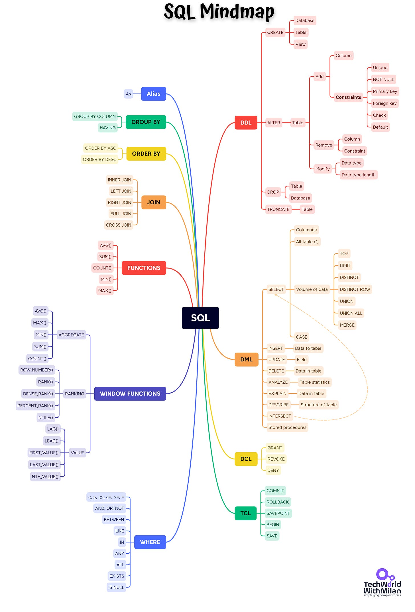
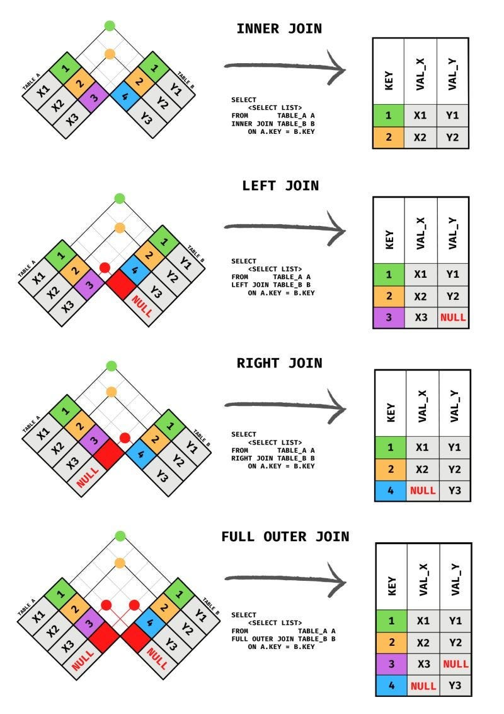
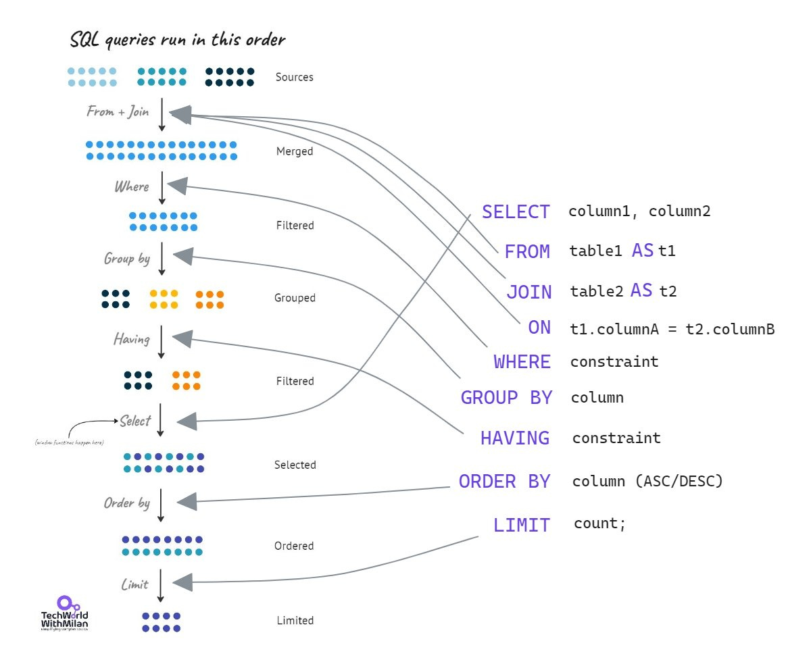
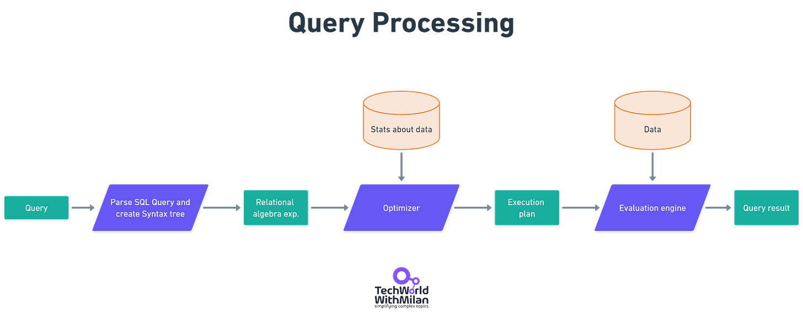
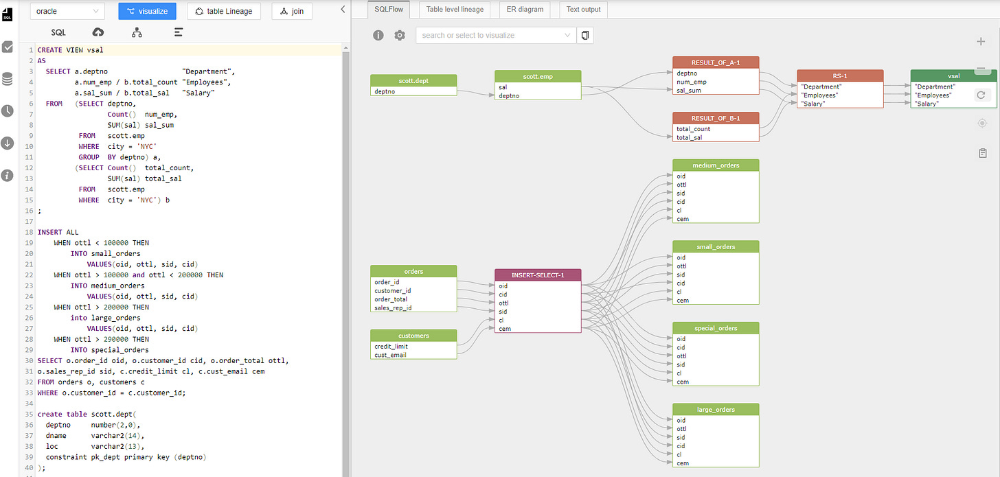
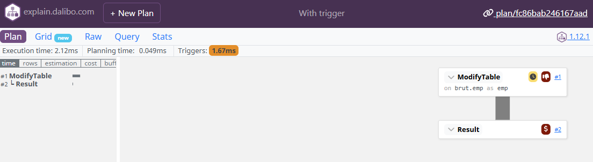
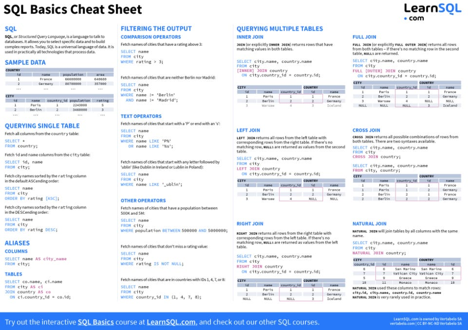
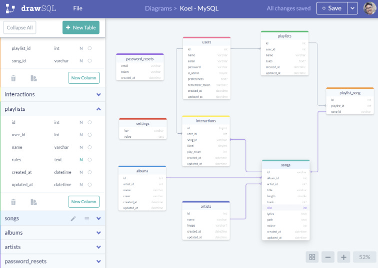
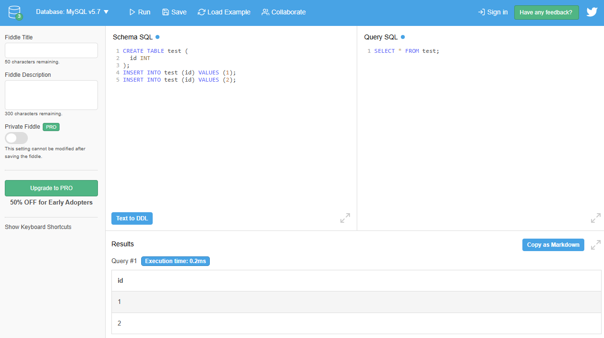

# How To Learn SQL?

In this issue, we talk about the following:

- **How to Learn SQL?**
- **What is the Difference Between Inner, Left, Right, and Full Join?**
- **SQL Queries Run Order**
- **What is Query Optimizer?**
- **Top 20 SQL Query Optimization Techniques**
- **Tools & Resources**

So, let’s dive in.

---

## How To Learn SQL?

Structured Query Language (SQL) is a domain-specific language used in programming and designed to manage data held in relational database management systems for many years. It was developed at IBM in the early 1970s. As relational databases are still very prevalent, any developer still needs to use them.

The SQL language has **clauses**, which are components of statements and queries; **expressions** that can produce scalar values or tables; **predicates**, which specify conditions that can be evaluated to SQL three-valued logic; and **queries**, which retrieve data based on criteria and other elements.

So, the question is **how to learn SQL**. Here are some (free) resources that I can recommend:

1. **[SQLBolt](https://sqlbolt.com/)**- is an entirely free, fully interactive introductory course. All SQL basics include writing queries, filtering, joins, aggregations, and creating, updating, and deleting tables.
2. **[SQLZoo](https://sqlzoo.net/wiki/SQL_Tutorial)**- It provides both tutorials and exercises, which is why it is equally helpful for someone just starting with SQL and programmers who know SQL but want some good practice to master it.
3. **[SQL Tutorial at FreeCodeCamp](https://www.youtube.com/watch?v=HXV3zeQKqGY)** - This SQL course has more than 7 million views, and I think it's YouTube’s most popular free SQL course.
4. **[PopSQL](https://popsql.com/learn-sql)**- is an exciting tool for collaborative SQL querying. It enables multiple users to share queries, store commonly used queries in a searchable library, and provide a visual interface for analysis.
5. **[Learning SQL by Alan Beaulieu](http://www.r-5.org/files/books/computers/languages/sql/mysql/Alan_Beaulieu-Learning_SQL-EN.pdf)is a free e-book.** This book provides helpful context regarding the language's history and current usage, offers an overview of query and table architecture, and covers more complex SQL subjects than the abovementioned courses.
6. **Learn it by playing a game** - [SQL Murder Mystery](https://mystery.knightlab.com/), [SQL Island](http://wwwlgis.informatik.uni-kl.de/extra/game/?lang=en), [SQL Police Department](https://sqlpd.com/), [SQL Noir](https://www.sqlnoir.com/), and [Schemaverse](https://schemaverse.com/).

The image below shows **an overview of SQL Language**.

SQL MindMap

If you’re starting to learn SQL, I would recommend the following **learning path**:

- **Beginner**: SELECT, FROM, WHERE, LEFT/INNER JOIN, GROUP BY, ORDER BY.
- **Intermediate**: HAVING, CASE WHEN, LIKE, IN, UNION (ALL), TOP/ LIMIT.
- **Advanced**: WITH AS, PARTITION BY, OVER, LEAD, PIVOT, Stored Procedures, and Functions.

## What is the Difference Between Inner, Left, Right, and Full Join?

- **(INNER) JOIN -** return all rows that have matching values in both tables.
- **LEFT (OUTER) JOIN -** return all rows from the left table and those that meet the condition from the right table.
- **RIGHT (OUTER) JOIN -** return all rows from the right table and those that meet the condition from the left table.
- **FULL (OUTER) JOIN**- return all rows with a match in either table.

How different types of SQL joins work (Credits: Hadley Wickham & Garrett Grolemund in their book “R for Data Science,” prepared as a [cheatsheet](https://t.co/1bEWZreApe)by Andreas Martinson)

## SQL Queries Execution Order

We utilize SQL queries to access a collection of records stored in our database tables. Clauses are the building blocks of SQL queries. These clauses must be executed to get the proper outcomes. SQL query execution order is the name given to this sequence of operations.

**SQL query execution order** refers to how the requirements evaluate the query clauses or how to optimize database search results. We use clauses in a specific order known as the SQL query execution order, similar to how we plan something step by step and arrive at the result.

Here is the **order in which the SQL clauses are executed**:

1. **FROM**- tables are joined to get the base data.
2. **WHERE**- the base data is filtered.
3. **GROUP BY** - the filtered base data is grouped.
4. **HAVING** - the grouped base data is filtered.
5. **SELECT**- the final data is returned.
6. **ORDER BY** - the final data is sorted.
7. **LIMIT**- the returned data is limited to row count.

SQL Query Execution Order

## What is Query Optimizer?

Its primary function is to determine **the most efficient way** to execute a given SQL query by finding the best execution plan. The query optimizer takes the SQL query as input and analyzes it to determine how best to execute it. The first step is to parse the SQL query and create a syntax tree. The optimizer then analyzes the syntax tree to determine how to execute the query.

Next, the optimizer generates **alternative execution plans**, which are different ways of executing the same query. Each execution plan specifies the order in which the tables should be accessed, the join methods, and any filtering or sorting operations. The optimizer then assigns a **cost**to each execution plan based on factors such as the number of disk reads and the CPU time required to execute the query.

Finally,**the optimizer chooses the execution plan with the lowest cost** as the optimal execution plan for the query. This plan is then used to execute the query.

Query Processing

## Top 20 SQL Query Optimization Techniques

Here is the list of the top 20 SQL query optimization techniques I found noteworthy:

1. **Create an index on huge tables (>1.000.000) rows.**
2. **Use EXIST() instead of COUNT() to find an element in the table.**
3. **SELECT fields instead of using SELECT ***
4. **Avoid Subqueries in WHERE Clause**
5. **Avoid SELECT DISTINCT where possible.**
6. **Use WHERE Clause instead of HAVING.**
7. **Create joins with INNER JOIN (not WHERE)**
8. **Use LIMIT to sample query results.**
9. **Use UNION ALL instead of UNION wherever possible.**
10. **Use UNION where instead of WHERE ... or ... query.**
11. **Run your query during off-peak hours.**
12. **Avoid using OR in join queries.**
13. **Choose GROUP BY over window functions.**
14. **Use derived and temporary tables.**
15. **Drop the index before loading bulk data.**
16. **Use materialized views instead of views.**
17. **Avoid != or <> (not equal) operator**
18. **Minimize the number of subqueries.**
19. **Use INNER join as little as possible when you can get the same output using LEFT/RIGHT join**
20. **For retrieving the same dataset, frequently try to use temporary sources.**

👉 Learn more about [best practices when writing SQL Queries](https://www.metabase.com/learn/grow-your-data-skills/learn-sql/working-with-sql/sql-best-practices).

> ⚠️ Note that these optimization techniques are a bit generic, and something else can work better in your particular case, as the DB engine does some [optimizations](https://bertwagner.com/posts/how-i-troubleshoot-sql-server-execution-plans/) under the hood. You can use the **[EXPLAIN](https://www.geeksforgeeks.org/explain-in-sql/)** command or with **ANALYZE to ensure exactly what is happening**. This command will tell you the plan but will not execute the query. However, with **EXPLAIN ANALYZE**, will run the query and tell you what happened. Be careful with this command, as it modifies the state.

## Tools & Resources

- **[SQLFlow](https://sqlflow.gudusoft.com/#/)**- a great tool to visualize SQL queries.

SQLFlow

- **[explain.dalibo.com](https://explain.dalibo.com/) - PostgreSQL execution plan visualizer**

- **[SQL Basics Cheat Sheet](https://learnsql.com/blog/sql-basics-cheat-sheet/)**by LearnSQL.

SQL Basics Cheat Sheet

- **[DrawSQL](https://drawsql.app/)** - Design, visualize, and collaborate on database entity relationship diagrams.

- **[DB Fiddle](https://www.db-fiddle.com/)** - a free tool for testing SQL queries

- **[What I Wish Someone Told Me About Postgres](https://challahscript.com/what_i_wish_someone_told_me_about_postgres)** article
- **[SQL style guide](https://www.sqlstyle.guide/)**
- **[Database fundamentals](https://tontinton.com/posts/database-fundementals/)** article

---

Thanks for reading Tech World With Milan Newsletter! Subscribe for free to receive new posts and support my work.