# The 12 mental models and biases for engineers

*and my favorite mental models for engineers and managers.*

In the complex software development and management world, the quality of our thinking often determines the success of our projects and teams. **Mental models and cognitive biases** are crucial in approaching problems, making decisions, and interacting with others.

This article focuses on **critical mental models that enhance problem-solving abilities and decision-making processes**. We'll also deep-dive into common cognitive biases that can derail even the most experienced professionals. By understanding these concepts, you will become a super thinker and make better decisions.

We will see the following mental models:

1. **➡️ Second-Order Thinking**
2. 🧠 **First-Principles Thinking**
3. 🔵 **Circle of Competence**
4. 🔄 **Inversion**
5. **🎯 Pareto Principles (80/20) rule**
6. 🚧 **Sunk Cost Fallacy**
7. 👀 **Confirmation Bias**
8. 🔑 **Type 1 vs Type 2 decisions**
9. ✂️ **Occam’s Razor**
10. 🤔 **Dunning-Kruger Effect**
11. 🗺️ **The Map is not the Territory**

So, let’s dive in.

---

# How to use Second-Order Thinking to outperform

We all make decisions in our lives that we regret. Although it’s tough to predict the future, the main issue with our choices is that we only focus on the next important thing. We can choose a company because of the high salary, but we may stagnate there, and the company has a bad culture, requiring us to work many long hours, etc.

In the long run, we will conclude that we made a wrong decision, and this is an excellent example of **first-order thinking**. It often occurs when we prioritize immediate rewards over long-term benefits.

The shortcomings of first-order thinking are significant:

- **🔮 Lack of foresight**: It overlooks potential long-term consequences, which can lead to unintended adverse outcomes. Decisions made without considering future effects can lead to more complex and costly problems.
- **🧠 Superficial solutions**: First-order thinkers often settle for the first solution, which may confirm their biases and lead to suboptimal choices. This can create a cycle of reactive decision-making, where problems are addressed only as they arise rather than being anticipated and mitigated.
- **🎯 Missed opportunities**: First-order thinking can overlook potential benefits from more thoughtful, second-order considerations by focusing solely on immediate effects. This can stifle innovation and limit strategic growth.

Yet, we can use **second-order thinking** **➡️**to improve our decisions significantly. Howard Marks coined this term in his book *[The Most Important Thing](https://amzn.to/4gdEBib)*, which discusses investment psychology in volatile markets. He says, “*First-level thinking is simplistic and superficial, and just about everyone can do it*…” but “*Second-level thinking is deep, complex, and convoluted.*”

[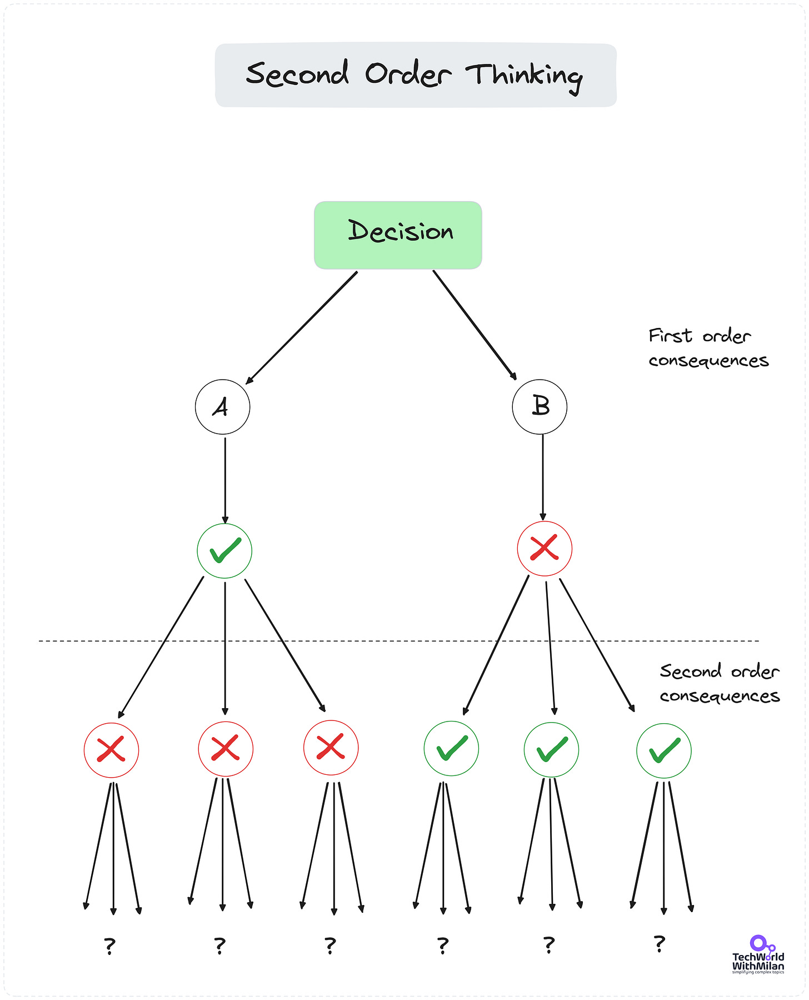](https://substackcdn.com/image/fetch/$s_!LGhM!,f_auto,q_auto:good,fl_progressive:steep/https%3A%2F%2Fsubstack-post-media.s3.amazonaws.com%2Fpublic%2Fimages%2F57a41cbb-d86c-4025-8138-4aae2fecf59d_4150x5128.png)Second-order thinking

What are the ways we can put **Second-order thinking**into practice:

1. **🤔 Start with self-questioning**. After deciding or judging, ask yourself: "And then what?" This simple question can uncover the next layer of consequences.
2. **🖼️ Visualize.** Create a visual representation of your decision. Start with the primary outcome in the center, then branch out to secondary, tertiary, and further consequences.
3. **🧐 Challenge our assumptions.** Try to play devil’s advocate and ask, “What if this fails? What if that fails? What is the probability I’m right?”.
4. **📜 Check our past decisions.** Based on the history and trends, what unforeseen consequences can arise?
5. **💬 Engage in group think tanks.** Organize brainstorming sessions where team members explore the potential outcomes of a decision. Collective thinking often reveals consequences an individual might miss.
6. **🗓️ Reflect.** Set aside time, weekly or monthly, to reflect on your decisions. Consider what went as expected and what unforeseen consequences arose. You can ask yourself, “*How will I feel about this decision in 10 minutes/days/months from now”*?

Second-order thinking can be used in software engineering. Before implementing a new software feature, consider how users will adapt or misuse it. How will it impact system performance or security?

---

# The most important mental models and cognitive biases for engineers and managers

Making good decisions is crucial in the complex world of software engineering. Yet, pursuing "good" decisions can be misleading. Instead, we should focus on making decisions using reliable thinking methods. This is where mental models and cognitive biases come into play.

**Mental models** are a set of beliefs and ideas that help us understand the world based on our experiences. These models can be powerful tools for problem-solving, design, and project management in software engineering.

**Cognitive biases**, on the other hand, are systematic patterns of deviation from rational judgment. These biases affect how we perceive, process, and interpret information. They often result from mental shortcuts (heuristics) our brain uses to make quick decisions.

**Mental models help us think more effectively**, whereas **cognitive biases can distort our thinking**, leading to flawed decisions and misjudgments. Understanding both helps us make more informed decisions and avoid common pitfalls in reasoning.

[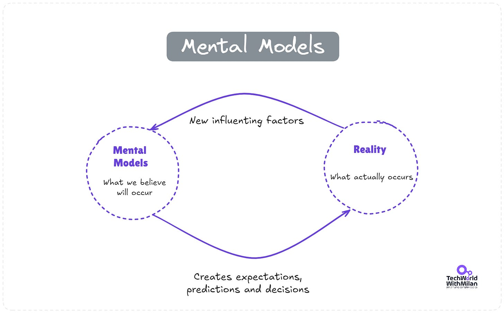](https://substackcdn.com/image/fetch/$s_!xOU3!,f_auto,q_auto:good,fl_progressive:steep/https%3A%2F%2Fsubstack-post-media.s3.amazonaws.com%2Fpublic%2Fimages%2F61a99aaa-610e-4437-b5a6-c287dd249f40_1675x1042.png)Mental models

I’m a big fan of mental models and biases. Below are some of my favorite mental models and biases, in addition to the previously mentioned Second-order thinking I regularly use in my daily work.

## 1. First-Principles Thinking 🧠

First-principles thinking involves breaking down complex problems into their fundamental components. **Instead of relying on assumptions or analogies, this model encourages engineers to analyze the essential truths of a problem**. This approach can lead to innovative solutions in software engineering by allowing developers to rethink existing frameworks and designs. For instance, an engineer might deconstruct the system to identify the root cause when faced with a performance issue, rather than applying conventional fixes. This leads to more effective and original solutions.

Read more about [First-principles thinking](https://newsletter.techworld-with-milan.com/i/139384954/solving-complex-problems-with-first-principles).

First-principles thinking

## 2. **Circle of Competence** 🔵

The Circle of Competence is a mental model that encourages us to work in areas where we have deep expertise, make good decisions, and avoid costly mistakes. Everyone has a "circle" where they are competent, and their knowledge is broad and deep. Beyond that circle, you're venturing into areas where mistakes are more likely.

It consists of the following circles:

- **🏅 What you know**- This is where you are most competent. It's where you have the deepest understanding, and your skills are most refined.
- **🔍 What you are aware you don’t know** - This is the perimeter of your competence, where you have some knowledge but are not an expert, but you know there are some things out there that you don’t know (e.g., software architecture).
- **🌍 What you aren’t aware you don’t know** - Everything outside your circle of competence. You are not even aware that such things exist.

However, it’s not about staying in the circle where we know it all; growing our circle is critical to proper career and personal development. By expanding our knowledge through continuous learning and experience, we can gradually increase the areas in which we're competent.

In software engineering, this might involve **mastering new technologies or techniques while staying grounded in your core strengths**. The goal is to know where your expertise ends and how to strategically grow it over time without overextending into unknown territory.

The most significant growth occurs in **[areas we are unaware of and don’t know](https://newsletter.techworld-with-milan.com/i/123308003/the-more-you-know-the-more-you-realize-you-dont-know)**exist, so we must seek guidance or advice from someone who can lead us in this direction or explore new territories by ourselves, such as attending conferences, taking on stretch roles, and more.

[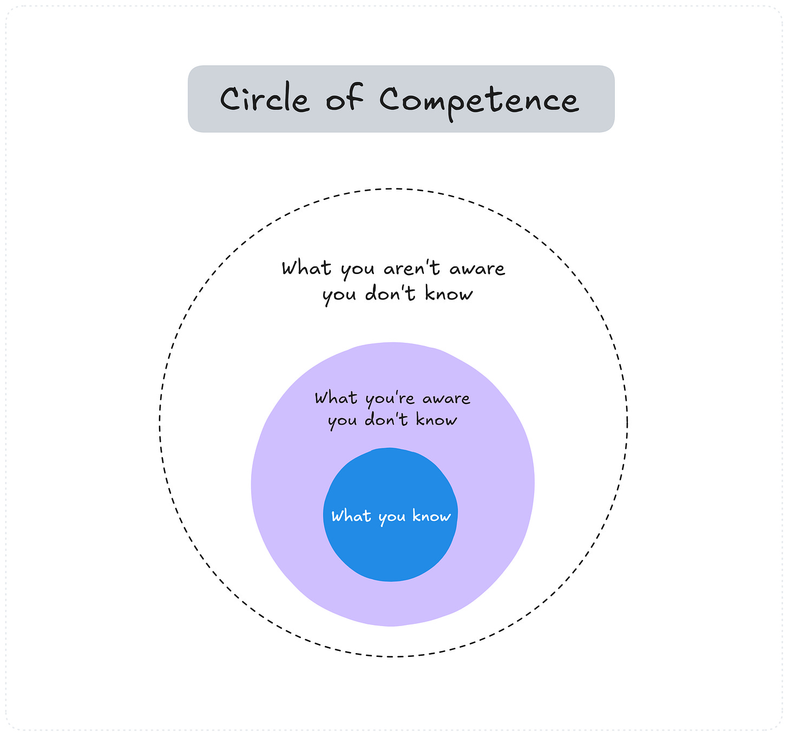](https://substackcdn.com/image/fetch/$s_!g5DX!,f_auto,q_auto:good,fl_progressive:steep/https%3A%2F%2Fsubstack-post-media.s3.amazonaws.com%2Fpublic%2Fimages%2F89acc334-8919-4b8e-9aaf-51d51fa9d1e1_2695x2515.png)Circle of Competence

## 3. Inversion 🔄

Inversion involves approaching problems backward. Instead of asking, "*How can we make this system work?*" we might ask, "*What could cause this system to fail?*". This perspective can be invaluable in software engineering, particularly in error handling, security, and reliability. By anticipating potential failures, we can build more robust and resilient systems.

Many famous thinkers used this method, including **Charlie Munger**. Read more about this in the bonus section.

[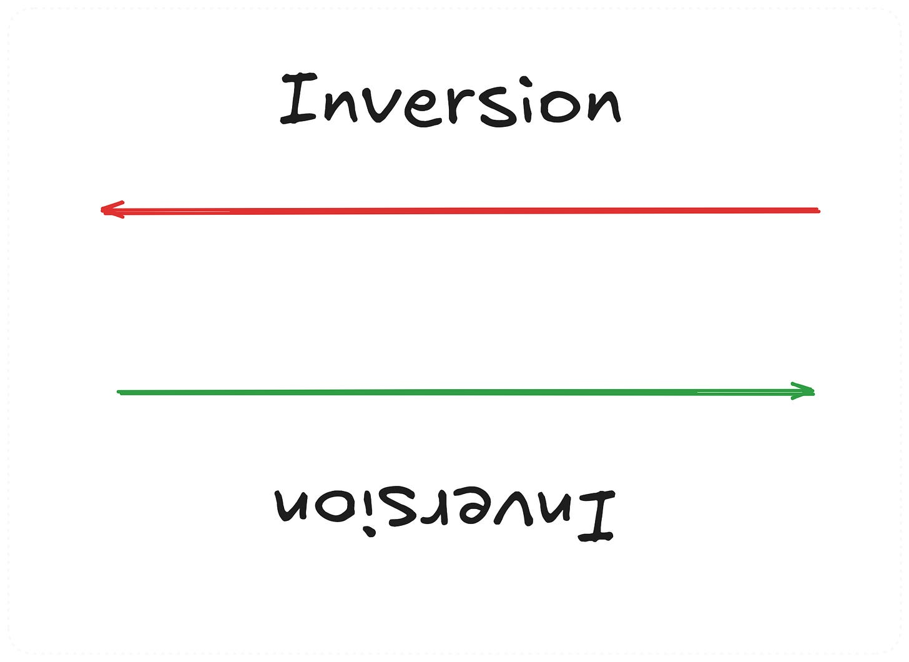](https://substackcdn.com/image/fetch/$s_!N9T9!,f_auto,q_auto:good,fl_progressive:steep/https%3A%2F%2Fsubstack-post-media.s3.amazonaws.com%2Fpublic%2Fimages%2F3ae5fe86-97d9-4c81-898d-959efbf67266_2163x1575.png)Inversion

## 4. Pareto Principles (80/20) rule 🎯

The Pareto Principle suggests that approximately 80% of effects are attributed to 20% of causes. This principle can guide our focus and resource allocation. For instance, **a system's performance issues stem from 20% of its components**. We can achieve significant improvements with minimal effort by identifying and optimizing these critical areas.

And this can be used in every part of our lives:

- **⏳ Time management:** Focus on 20% of activities that generate 80% of the results.
- **🎯 Goal settings:** Focus on 20% of goals that will make the biggest impact.
- **🔀 Decision making:** Identify 20% of factors that have the most significant impact on a decision.

[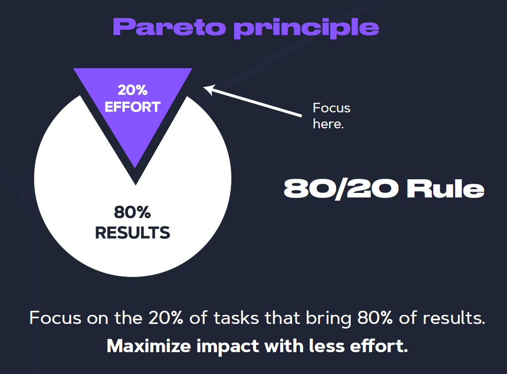](https://substackcdn.com/image/fetch/$s_!GDmf!,f_auto,q_auto:good,fl_progressive:steep/https%3A%2F%2Fsubstack-post-media.s3.amazonaws.com%2Fpublic%2Fimages%2F51fa2150-7b79-4bbe-92d7-8935c1583249_1113x822.png)Pareto principle

## 5. Sunk Cost Fallacy 🚧

It refers to the tendency to continue investing in a project due to previously invested resources, even when those resources are no longer justified. For example, if a project is failing but significant resources have already been allocated, it may be tempting to push forward. But understanding the sunk cost fallacy allows teams to pivot or abandon projects that no longer align with their goals.

[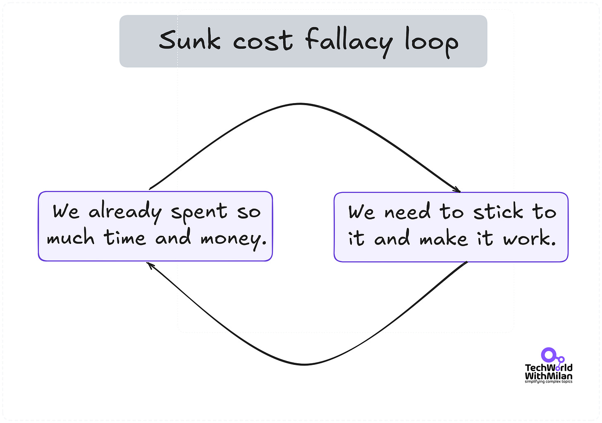](https://substackcdn.com/image/fetch/$s_!SuAg!,f_auto,q_auto:good,fl_progressive:steep/https%3A%2F%2Fsubstack-post-media.s3.amazonaws.com%2Fpublic%2Fimages%2Feacbccb3-fe24-4732-a7aa-2be2c3cf349b_4493x3166.png)Sunk cost fallacy loop

## 6. Confirmation Bias 👀

Confirmation bias is the tendency to search for, interpret, favor, and recall information that confirms or supports one's prior beliefs or values. This phenomenon often leads us to favor information that supports our views while disregarding or minimizing evidence that contradicts them.

In software engineering, confirmation bias can manifest in several ways:

- **🧐 Code reviews**: Engineers might focus on aspects of the code that confirm their beliefs about its quality or correctness, potentially overlooking issues or alternative approaches.
- **🧪 Testing**: Developers might unconsciously design tests that are likely to pass rather than those that could reveal potential flaws in the system.
- **🛠️ Debugging**: When trying to find the cause of a bug, engineers might fixate on a particular hypothesis and seek evidence to support it, possibly ignoring data that points to other causes.
- **💡 Technology choices**: Engineers might favor familiar technologies or approaches, seeking information that supports their use even when alternatives might be more suitable.
- **⚙️ Performance** **optimization**: Developers might focus on optimizing parts of the code they believe are slow without sufficient profiling or evidence.

To mitigate this bias, we must consider problems from diverse perspectives, employ a data-driven decision-making process, utilize iterative processes with continuous feedback and adaptation, and apply critical thinking when solving problems.

[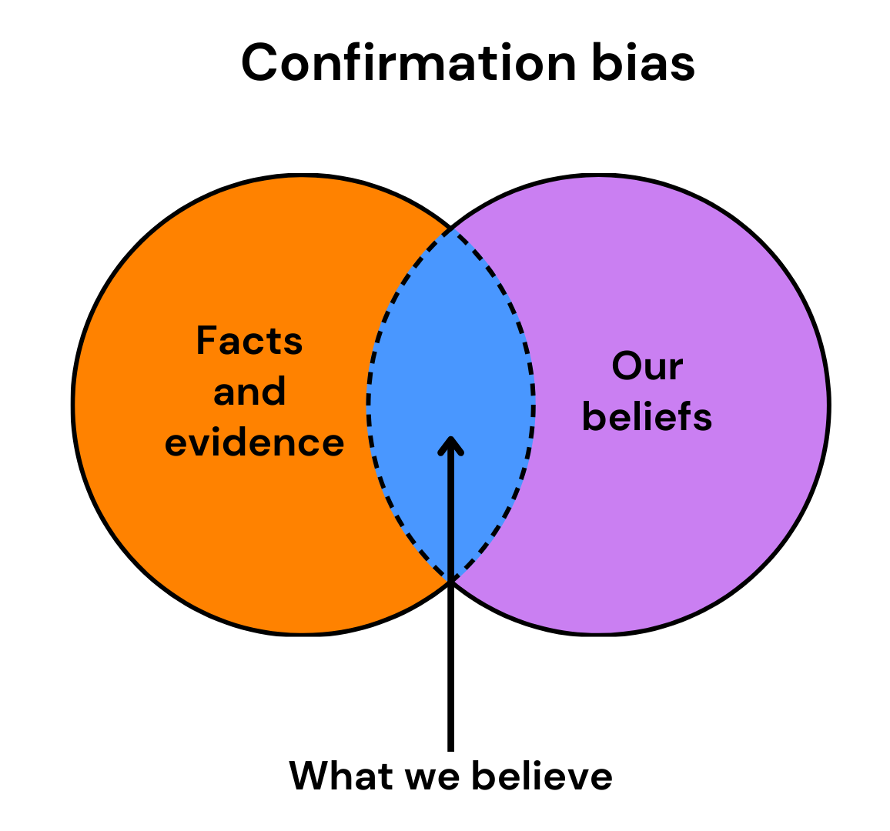](https://substackcdn.com/image/fetch/$s_!Plkt!,f_auto,q_auto:good,fl_progressive:steep/https%3A%2F%2Fsubstack-post-media.s3.amazonaws.com%2Fpublic%2Fimages%2Fbe77bb22-0141-4ec2-ac05-239ce21da232_1156x1080.png)Confirmation bias

Read more about critical thinking and its importance:
[
Tech World With Milan NewsletterWhy is critical thinking a game-changer for developers ?This week’s issue brings to you the following…Read more2 years ago · 31 likes · 1 comment · Dr Milan Milanović](https://newsletter.techworld-with-milan.com/p/why-is-critical-thinking-a-game-changer?utm_source=substack&utm_campaign=post_embed&utm_medium=web)
## 7. Type 1 vs Type 2 decisions 🔑

This model, popularized by Jeff Bezos, distinguishes between:

1. **🚀 Type 1:** **irreversible, consequential decisions**. Once made, these decisions are difficult or impossible to undo. They require careful deliberation and a deep understanding of potential risks and rewards, as a wrong move can have a significant impact on the business or organization. An example of such a decision is choosing a tech stack or deciding on monolith or microservices architecture.
2. **🔙 Type 2:** **reversible, less impactful decisions.** These decisions allow for more agility and experimentation because the consequences are less significant, and corrections can be made quickly and effectively. An example of such a decision can be refactoring a specific function or A/B testing certain features.

Recognizing the difference can help us divide our decision-making resources more effectively.

## 8. Occam’s Razor ✂️

The simplest explanation is often the most accurate one. This principle favors simpler solutions over complex ones when possible. In software engineering, this idea translates to favoring minimalism and simplicity over complexity, whether in system design, code structure, or problem-solving.

Here’s how Occam’s Razor can apply in various software engineering scenarios:

- **🧩 Code Design**: Simple code is easier to understand, maintain, and debug. Complex code might solve the problem, but it also introduces more places where things can go wrong. When refactoring, the goal should be to remove unnecessary complexity, resulting in cleaner and more efficient solutions.
- **🏛️ System Architecture**: When designing system architectures, it can be tempting to add layers of complexity in the form of multiple microservices, databases, or third-party integrations. Occam’s Razor reminds us to evaluate whether all those components are necessary, or if a simpler design could achieve the same goals with fewer moving parts, thereby reducing the chance of failure and complexity in maintenance.
- **🔧 Debugging**: Instead of assuming the most intricate cause for a bug, it's often best to start with the simplest explanation: a configuration issue, a missing dependency, or an off-by-one error. This approach can save hours of troubleshooting.
- **📦 Feature Creep**: As products evolve, teams may feel pressured to add more features to meet the diverse demands of users. Occam’s Razor encourages us to question whether these additions add value or complicate the product. Sometimes, less is more when it comes to product features.
- **⚡ Performance Optimization**: While complex optimizations can be tempting, the simplest solution, such as improving database indexing or minimizing network calls, often delivers the highest gains with the least effort. It’s easy to fall into the trap of over-engineering, but Occam's Razor nudges us to start with straightforward improvements.

[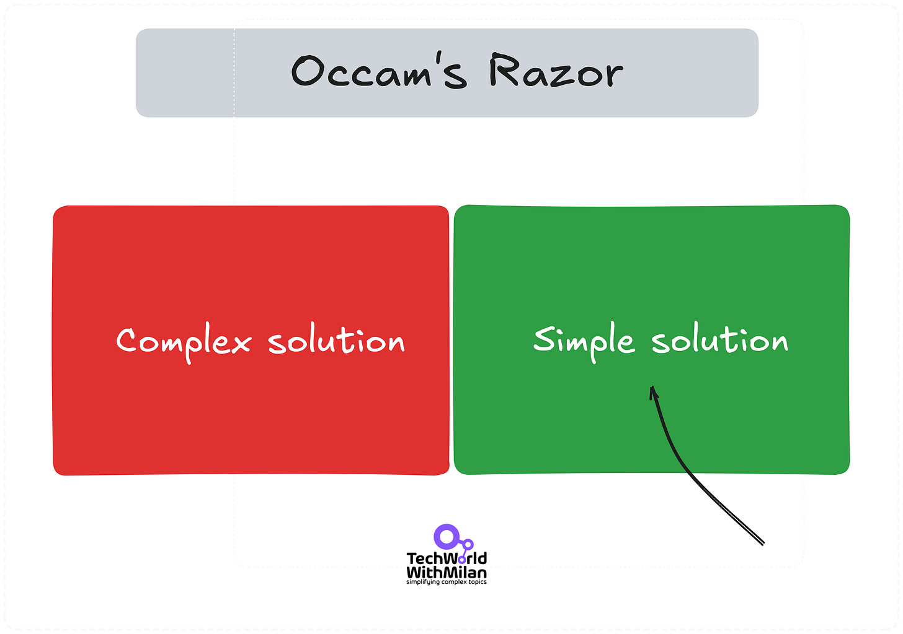](https://substackcdn.com/image/fetch/$s_!6IIf!,f_auto,q_auto:good,fl_progressive:steep/https%3A%2F%2Fsubstack-post-media.s3.amazonaws.com%2Fpublic%2Fimages%2F345ed3ef-b7c7-4172-924b-d4ac5333a307_3980x2799.png)Occam’s Razor

## 9. Dunning-Kruger Effect 🤔

The Dunning-Kruger Effect describes how people with limited knowledge in a domain may overestimate their competence while experts underestimate theirs (**illusion of superiority**). Awareness of this cognitive bias in software engineering can foster humility and continuous learning. It encourages us to seek peer reviews, share knowledge, and approach complex problems with an open mind.

[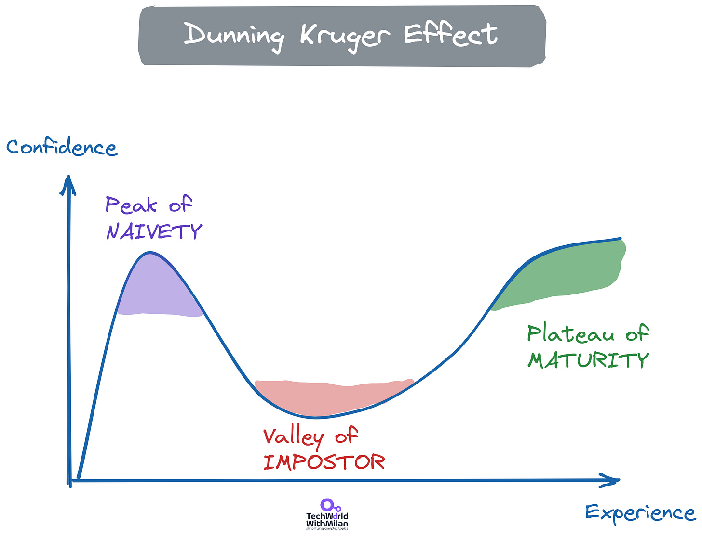](https://substackcdn.com/image/fetch/$s_!WMT4!,f_auto,q_auto:good,fl_progressive:steep/https%3A%2F%2Fsubstack-post-media.s3.amazonaws.com%2Fpublic%2Fimages%2F0a0d2679-c20e-4588-8961-d0493f83cb68_2279x1747.png)The Dunning-Kruger Effect

Read more about it here:
[
Tech World With Milan NewsletterHow to Fight Impostor Syndrome?The Impostor Syndrome…Read more3 years ago · 48 likes · 2 comments · Dr Milan Milanović](https://newsletter.techworld-with-milan.com/p/how-to-fight-impostor-syndrome?utm_source=substack&utm_campaign=post_embed&utm_medium=web)
## 10. Parkinson’s Law ⏲️

Parkinson's law states that work expands to fill the time available for completion. This can manifest as scope creep or inefficient use of development time. Recognizing this tendency can help us set more realistic deadlines, break work into smaller, time-boxed tasks, and maintain focus on delivering value.

A few strategies that can help us fight the Parkinson’s Law are:

- **📅 Set reasonable deadlines**: Instead of giving yourself or your team more time than necessary, establish shorter, more aggressive timelines. This forces focus and prevents unnecessary tasks from creeping into the work.
- **⏱️ Time-box tasks**: Break down tasks into smaller, time-bound chunks. Assign fixed periods to complete specific parts of the project. This not only maintains momentum but also prevents procrastination.
- **🔝 Prioritize**: Focus on high-impact tasks first and avoid getting distracted by less important ones. Applying the Pareto Principle (also known as the 80/20 rule) can help you identify which activities will bring the most value in a limited time.
- **✔️ Avoid perfectionism**: Many tasks expand because we strive for perfection. Recognize when "good enough" is sufficient and move on to the next task.
- **⏲️ Use productivity techniques**: Techniques like the Pomodoro Technique (25-minute work intervals) or time blocking can help maintain discipline and prevent unnecessary expansion of tasks.
- **📝 Review regularly**: Monitor progress and adjust deadlines or scope if necessary. Regular check-ins help ensure that work remains focused and doesn't balloon unnecessarily.

[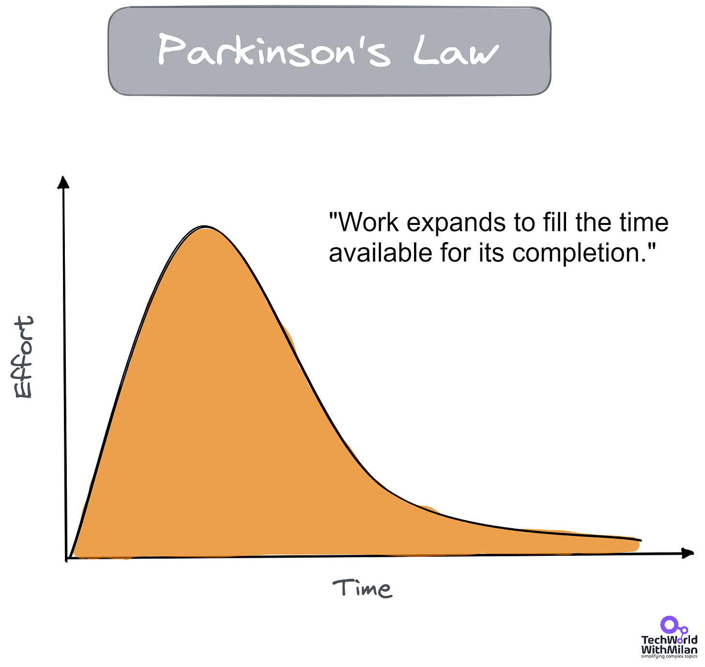](https://substackcdn.com/image/fetch/$s_!m7yT!,f_auto,q_auto:good,fl_progressive:steep/https%3A%2F%2Fsubstack-post-media.s3.amazonaws.com%2Fpublic%2Fimages%2F9d77ae2f-40ba-4daf-80a5-efce406db803_1922x1821.png)The Parkinson’s Law

Read more about productivity techniques here:
[
Tech World With Milan NewsletterHow to Be 10x More Productive I was always amazed by top performers. I wondered what they do and how they are much better than others. Then, I started researching and talking directly to some of them. I finally managed to get some top performers as my mentors and, in the end, became one of them. I learned that they are not better than others, but they use some techniques that help t…Read more3 years ago · 54 likes · 6 comments · Dr Milan Milanović](https://newsletter.techworld-with-milan.com/p/how-to-be-10x-more-productive?utm_source=substack&utm_campaign=post_embed&utm_medium=web)
## **11. The Map is not the Territory**🗺️

This robust mental model I learned during my NLP Practitioner training reveals new perspectives. It was coined by Alfred Korzybski in 1931, and it states that a map (our perception) represents reality (the territory) and represents only an interpretation of it.

We should always consider that **our views on things are only maps**, **not the actual territory**, as maps cannot fully capture the complexities of the real world. We need maps (models) for analysis and planning, and they help us navigate uncertainty and complexity across different outcomes.

For example, in software engineering, **design diagrams or system architectures are just abstractions**—they can help guide development. Still, they don't account for all the dynamic variables that emerge during implementation. Recognizing this helps us stay adaptable, question assumptions, and continuously adjust based on actual results rather than rigidly enforcing initial plans.

> “*All models are wrong but some are useful.*” - George Box

The Map is not the Territory.

Note that many more critical cognitive biases and mental models are essential for us, and I will write more about them in the future. In the meantime, if you want to learn more about them, I recommend the following books and materials:

- **[Thinking, Fast and Slow,](https://amzn.to/3MzQbqn)** by Daniel Kahneman (a must-read for everyone!)
- **[Influence: The Psychology of Persuasion](https://amzn.to/3MBUlxT)**, by Robert Cialdini
- **[Metaphors We Live By](https://amzn.to/47lKHcs)**, by George Lakoff
- **[The Art of Thinking Clearly](https://amzn.to/47iipiJ)**, by Rolf Dobelli
- **[Super Thinking: The Big Book of Mental Model](https://www.amazon.com/Super-Thinking-Upgrade-Reasoning-Decisions-ebook/dp/B07FRXC3KN/ref=sr_1_1?crid=12DV01BAST2LI&dib=eyJ2IjoiMSJ9.bZhLcA0CpJAsOSDuBB2BOeI_LIe2h_vNrY34m31npbO9z6ilmX8I3vEEo7WxUf7ZQLyof9HabTB5UqM5h1ztfFSsuZ28Dd0L6wSvtX34lMIwODaEVyvXnDXk78nyhKJEDy_dDlxQUfNQgIuOoAt0Ik56xiVCvRnZ323fljkT_Z4ouCgCxI2mz-UrCQEGNcHF.nmsywOOnqt3nloRcwxFGFtWJr-8l4WZx7NDFuFBBwo0&dib_tag=se&keywords=Super+Thinking%3A+The+Big+Book+of+Mental+Model&qid=1725797293&s=books&sprefix=super+thinking+the+big+book+of+mental+model%2Cstripbooks-intl-ship%2C299&sr=1-1)**, by Gabriel Weinberg and Lauren McCann
- **[The Great Mental Models Volume 1: General Thinking Concepts](https://amzn.to/3Zi4kAa)** by Rhiannon Beaubien

[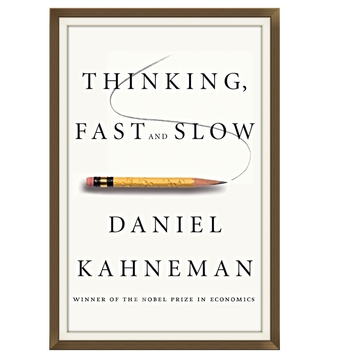](https://amzn.to/3MzQbqn)Thinking Fast and Slow, by Daniel Kahneman

Also, check these websites to learn more:

- **[Untools](https://untools.co/)**
- **[Farnam Street](https://fs.blog/mental-models/)**
- **[The Biases You Don’t Know You Have](https://hbr.org/2012/06/the-biases-you-dont-know-you-h) (HBR)**

And the **map of all cognitive biases**:

[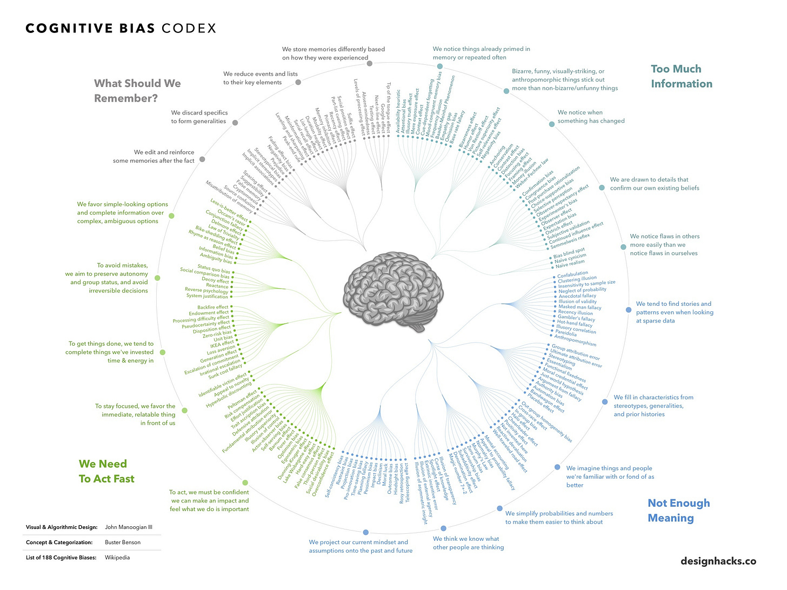](https://substackcdn.com/image/fetch/$s_!fZQS!,f_auto,q_auto:good,fl_progressive:steep/https%3A%2F%2Fsubstack-post-media.s3.amazonaws.com%2Fpublic%2Fimages%2F2605d101-2b92-409c-b52a-3d2a6f640961_2330x1748.jpeg)The map of all cognitive biases (source: Wikipedia)

---

# Bonus: How do you decide as Charlie Munger?

Charlie Munger, the vice chairman of Berkshire Hathaway and a prominent investor, died last year at the age of 99. He was famous, among other things, for his unique approach to decision-making.

[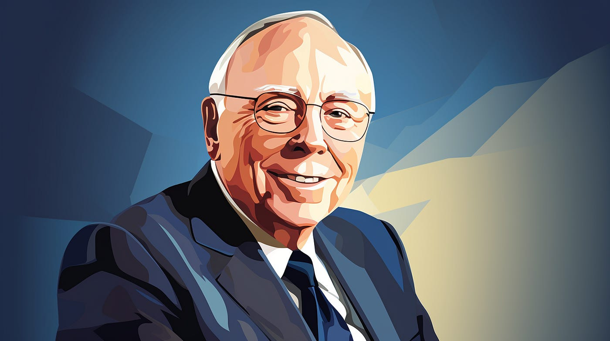](https://substackcdn.com/image/fetch/$s_!_4kd!,f_auto,q_auto:good,fl_progressive:steep/https%3A%2F%2Fsubstack-post-media.s3.amazonaws.com%2Fpublic%2Fimages%2F529b099f-5286-42bb-9da1-83cdf392d816_1400x785.png)

Here are some essential mental models he used:

## 1. Always Invert 🔄

Munger famously advocates for thinking backward (inversion). Instead of asking, "What can I do to achieve success?" he suggests asking, "*What can I avoid to prevent failure?*" This method helps identify potential pitfalls and forces you to look at the problem from a different perspective, uncovering solutions that may take time.

## 2. Learn from the errors of others 🤦‍♂️

He used to say, "*I became so avid a collector of instances of bad judgment that I paid no attention to boundaries between professional territories.*" This highlights how important it is to learn from the mistakes and experiences of those who came before us.

## 3. Circle of competence 🎯

He emphasized the importance of recognizing one's limitations and staying within areas of expertise. By understanding what you know and what you don't, you can avoid unnecessary risks and make better decisions. This principle encourages us to focus our efforts on domains where we possess significant knowledge and experience, thereby increasing the likelihood of success.

## 4. The Lollapalooza Effect 🎢

Munger introduced the idea of the Lollapalooza Effect, which occurs when multiple factors converge to produce a disproportionately large outcome. He believed understanding how different cognitive biases and tendencies interact is crucial for effective decision-making.

In addition to his broader principles, Munger also offered practical rules for decision-making, such as:

- **Don't sell anything you wouldn't buy yourself.**
- **Don't work for anyone you don't respect and admire.**
- **Work only with people you enjoy.**

Consider this before making your next decision.

> “*What you need is a latticework of mental models in your head. And, with that system, things gradually fit together in a way that chances cognition*.” - Charlie Munger (Poor Charlie’s Almanack)

---

## More ways I can help you

1. **[LinkedIn Content Creator Masterclass ✨](https://www.patreon.com/techworld_with_milan/shop/short-linkedin-content-creator-311232?utm_medium=clipboard_copy&utm_source=copyLink&utm_campaign=productshare_creator&utm_content=join_link).**In this masterclass, I share my proven strategies for growing your influence on LinkedIn in the Tech space. You'll learn how to define your target audience, master the LinkedIn algorithm, create impactful content using my writing system, and create a content strategy that drives impressive results.
2. **[Resume Reality Check"](https://www.patreon.com/techworld_with_milan/shop/resume-reality-check-311008?source=storefront)**[🚀](https://www.patreon.com/techworld_with_milan/shop/resume-reality-check-311008?source=storefront). I can now offer you a new service where I’ll review your CV and LinkedIn profile, providing instant, honest feedback from a CTO’s perspective. You’ll discover what stands out, what needs improvement, and how recruiters and engineering managers view your resume at first glance.
3. **[Promote yourself to 35,000+ subscribers](https://newsletter.techworld-with-milan.com/p/sponsorship-of-tech-world-with-milan)**by sponsoring this newsletter. This newsletter puts you in front of an audience with many engineering leaders and senior engineers who influence tech decisions and purchases.
4. **[Join My Patreon Community](https://www.patreon.com/techworld_with_milan)**: This is your way of supporting me, saying “thanks, " and getting more benefits. You will get exclusive benefits, including all of my books and templates (worth $100), early access to my content, insider news, helpful resources and tools, priority support, and the possibility to influence my work.
5. **1:1 Coaching:** [Book a working session with me](https://newsletter.techworld-with-milan.com/p/coaching-services). 1:1 coaching is available for personal and organizational/team growth topics. I help you become a high-performing leader and engineer 🚀.

---
[https://newsletter.techworld-with-milan.com/p/how-to-make-better-decisions-with#poll-211970](https://newsletter.techworld-with-milan.com/p/how-to-make-better-decisions-with#poll-211970)Loading...
---

Thanks for reading Tech World With Milan Newsletter! Subscribe for free to receive new posts and support my work.