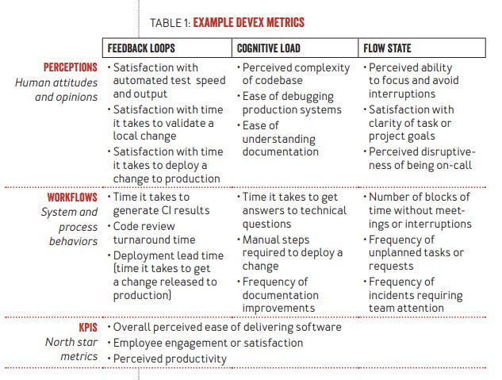
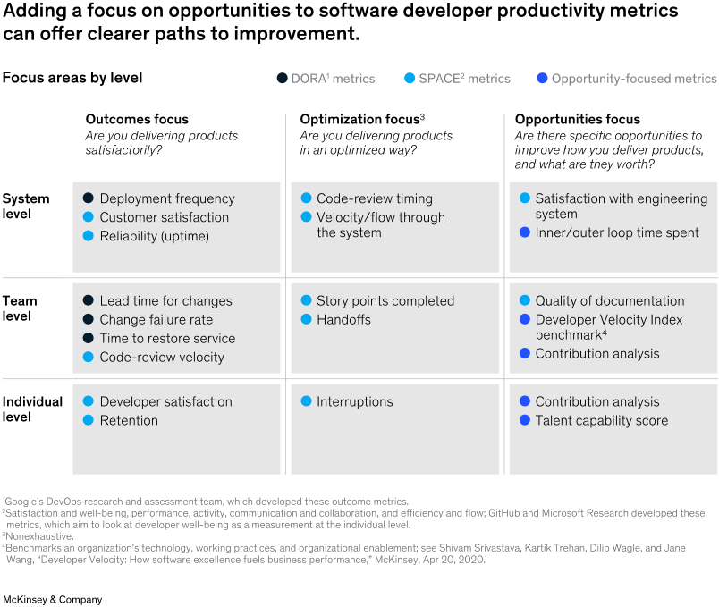
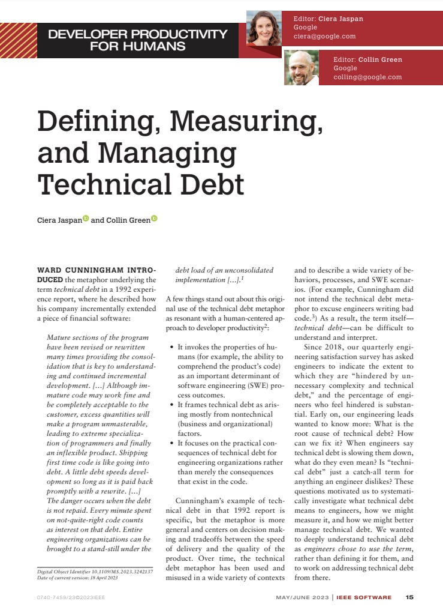

# How To Measure Developer Productivity?

This week’s issue brings to you the following:

- **DevEx: A New Method For Measuring Developer Productivity**
- **Measuring Software Developer Productivity by McKinsey**
- **Defining, Measuring, and Managing Technical Debt at Google**

So, let’s dive in.

---

## DevEx: A **New Method For Measuring Developer Productivity**

In the latest paper for ACM Queue by Abi Noda, Margaret-Anne Storey, Nicole Forsgren, and Michaela Geriler, called "**[DevEx: What Actually Drives Productivity](https://dl.acm.org/doi/10.1145/3595878),**" authors provided a framework for measuring and improving developer experience (DevEx).

What they found is that developers are happier when they feel more productive. So, they cannot deliver as much value as possible when they have obstacles. Different things cause a terrible developer experience, such as interruptions, poor tooling, unrealistic deadlines, working on low-value tasks, and more.

They identified three core dimensions of developer experience that have a direct effect on it:

1. **Feedback loops** - the speed and quality of responses to actions performed.
2. **Cognitive load** - the amount of mental processing required for a developer to perform a task
3. **Flow state** - a mental state in which a person performing an activity is fully immersed in a feeling of energized focus, full involvement, and enjoyment.

Three Core Dimensions of Developer Experience (Source: Abi Noda et al., 2023)

So, to create **DevEx metrics**, we can use their three core dimensions with two methods:

- **Perceptions** - Gathered through surveys.
- **Workflows** - Gathered from systems.

, for cognitive load for perceptions, we can ask how complex a codebase is or the ease of understanding documentation. On the workflow side, we can check the time it takes to get answers to technical questions or the frequency of documentation improvements.

Example DevEx Metrics (Abi Noda et al., 2023)

In **DevEx**, we should capture developer perceptions and their workflows. Picking the right KPIs is essential to track overall success.

To learn how to measure developer productivity using other methods, check my previous text on this topic.
[
Tech World With Milan NewsletterBuilding High-Performing TeamsIn this issue, we are going to talk about the following: How to build a high-performing team? The 5 Stages of Team Development How to handle dysfunctions in a team? Organizing teams by using Team Topologies How would you like to motivate your team? How to Measure Team Productivity by using different methods…Read more3 years ago · 23 likes · 4 comments · Dr. Milan Milanović](https://newsletter.techworld-with-milan.com/p/building-high-performing-teams?utm_source=substack&utm_campaign=post_embed&utm_medium=web)
---

## **Measuring Software Developer Productivity by McKinsey**

**[McKinsey has developed an approach](https://www.mckinsey.com/industries/technology-media-and-telecommunications/our-insights/yes-you-can-measure-software-developer-productivity)** that leverages surveys or existing data, such as backlog management tools, to measure software developer productivity. This method builds upon existing productivity metrics and aims to unveil opportunities for performance enhancements. This approach’s implementation has led to significant improvements, including reductions in product defects, enhanced employee experiences, and boosted customer satisfaction.

A nuanced system is essential for measuring developer productivity. There are three pivotal types of metrics to consider:

- **System Level Metrics:** These are broad metrics, like deployment frequency, that give an overview of the system's performance.
- **Team Level Metrics**: Given the collaborative nature of software development, team metrics focus on collective achievements. For instance, while deployment frequency can be a good metric for systems or teams, it's unsuitable for individual performance tracking.
- **Individual Level Metrics**: These zero in on the performance of individual developers.

Two sets of industry metrics have been foundational in this space. The first is the **DORA metrics**, developed by Google's DevOps research team, which are outcome-focused. The second is the **SPACE metrics**, created by GitHub and Microsoft Research, which emphasize developer well-being and optimization. McKinsey's approach complements these by introducing **opportunity-focused metrics**, offering a comprehensive view of developer productivity.

These metrics include the following:

- **Inner/outer loop time spent**: software development activities are arranged in the inner and outer loops. An inner loop includes activities such as coding, building, and testing, while an outer circle includes tasks developers must do to push their code to production: integration, release, and deployment. We want to maximize the time developers spend in the inner loop. Top tech companies aim for developers to spend up to 70% of their time making inner loops.
- **Developer Velocity Index benchmark**: This survey measures an enterprise’s technology, working practices, and organizational enablement and benchmarks them against peers.
- **Contribution analysis**: involves assessing contribution by individuals to a team’s backlog. Team leaders may be able to establish clear expectations for output with the help of this kind of understanding, which will enhance performance.
- **Talent capability:**score describes an organization's unique knowledge, skills, and abilities based on industry-standard capability maps. The "diamond" distribution of skill, with most developers in the middle range of competency, is what businesses should ideally aim towards.

Productivity metrics by McKinsey & Co

It's crucial to do everything correctly when measuring developer productivity. Simple metrics, like **lines of code or several code commits**, can be misleading and may lead to unintended consequences. For instance, **focusing solely on a single metric can incentivize poor practices**. It's essential to move beyond outdated notions and recognize the importance of measuring to improve software development.

> *Does this way of measuring developer productivity make sense to you? Reply to this newsletter or write in the comments your opinion.*

Here is a Kent Beck answer to McKinsey:
[Software Design: Tidy First?Measuring developer productivity? A response to McKinseyThe consultancy giant has devised a methodology it claims measures software developer productivity. They only measure activity, not productivity from a business perspective. And measuring activity comes with costs & risks they do not address. Here’s how we think about measurement. Part 1. (Gergely’s version of this post is…Read more3 years ago · 62 likes · 7 comments · Kent Beck and Gergely Orosz](https://tidyfirst.substack.com/p/measuring-developer-productivity?utm_source=substack&utm_campaign=post_embed&utm_medium=web)
---

## Defining, Measuring, and Managing Technical Debt at Google

In the **[latest paper](https://ieeexplore.ieee.org/document/10109339)** by Google Engineers, they researched how to define, measure, and manage Technical Debt. They use quarterly engineering satisfaction surveys to analyze the results.

1. **Definition of Technical Debt**

Google took an empirical approach to defining technical debt. They asked engineers about the types of technical debt they encountered and what mitigations would be appropriate to fix this debt. This resulted in a collectively exhaustive and mutually exclusive list of 10 categories of technical debt, including:

1. **Migration is needed or in progress**: This may be motivated by the need for code or systems to be updated, migrated, or maintained.
2. **Code degradation**: The codebase has degraded or not kept up with changing standards over time. The code may be in maintenance mode, needing updates or migrations.
3. **Documentation on project** and application programming interfaces (APIs): Information on your project’s work is hard to find, missing, or incomplete.
4. **Testing**: Poor test quality or coverage, such as missing tests or poor test data, results in fragility and flaky tests.
5. **Code quality**: Product architecture or project code must be better designed. It may have been rushed or a prototype/demo.
6. **Dead and abandoned code**: Code/features/projects were replaced or superseded but still need removal.
7. **The team needs more expertise**: This may be due to staffing gaps, turnover, or inherited orphaned code/projects.
8. **Dependencies**: Dependencies are unstable, rapidly changing, or trigger rollbacks.
9. **Migration could have been better executed** or abandoned: This may have resulted in maintaining two versions.
10. **Release process**: The rollout and monitoring of production need to be updated, migrated, or maintained.
2. **Measuring Technical Debt**

Google measures technical debt **through a quarterly engineering survey**. They ask engineers about which of these categories of technical debt have hindered their work. The responses to these surveys help Google identify teams that struggle with managing different types of technical debt. , they found that engineers working on machine learning systems face different types of technical debt compared to engineers who build and maintain back-end services.

They focused on code degradation, teams needing more expertise, and migrations being required or in progress. Then, they explored **117 metrics** proposed as indicators of one of these forms of technical debt—the results were that no single metric predicted reports of technical debt from engineers.
3. **Managing Technical Debt**

Over the last four years, Google has made a concerted effort to define better, measure, and manage technical debt. Some of the steps taken include:

1. **They are creating a technical debt management framework** to help teams establish good practices.
2. **Creating a technical debt management maturity model** and accompanying technical debt maturity assessment that evaluates and characterizes an organization's technical debt management process.
3. **We are organizing classroom instruction** and self-guided courses to evangelize best practices and community forums to drive continual engagement and sharing of resources.
4. **Tooling** that supports the identification and management of technical debt (for example, indicators of poor test coverage, stale documentation, and deprecated dependencies)

It's important to note that zero technical debt is not the goal at Google. The presence of deliberate, prudent technical debt reflects the practicality of developing systems in the real world. The key is to manage it thoughtfully and responsibly.

Defining, Measuring, and Managing Technical Debt

Read more about managing Technical Debt:
[
Tech World With Milan NewsletterHow To Deal With Technical DebtIn this issue, we are going to talk about the following: What Is Technical Debt? Types Of Technical Debt How to Measure Technical Debt? Strategies to Fight Technical Debt A Recommended Strategy To Deal With Technical Debt Tools to track Technical Debt…Read more3 years ago · 31 likes · 1 comment · Dr Milan Milanović](https://newsletter.techworld-with-milan.com/p/how-to-deal-with-technical-debt?utm_source=substack&utm_campaign=post_embed&utm_medium=web)
---

🎁 This week’s issue is sponsored by **[Product for Engineers](https://newsletter.posthog.com/?ref=techworld)**, **PostHog’s** *newsletter dedicated to helping engineers improve their product skills*. 

**[Subscribe for free](https://newsletter.posthog.com/?ref=techworld)** to get curated advice on building great products, lessons (and mistakes) from building **PostHog**, and research into the practices of top startups.

---

Thanks for reading the Tech World With Milan Newsletter! Subscribe for free to receive new posts and support my work.