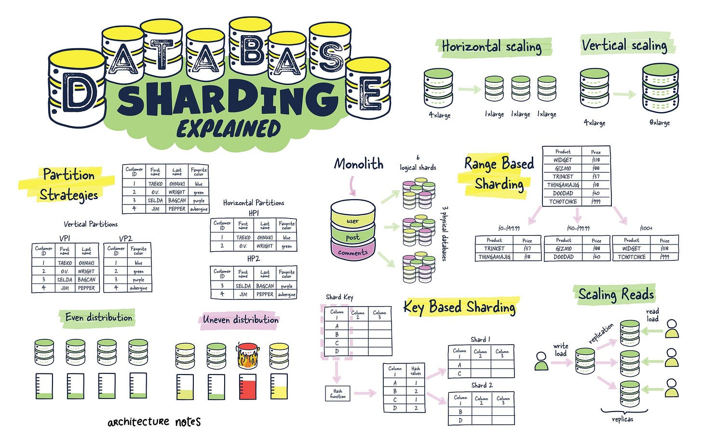
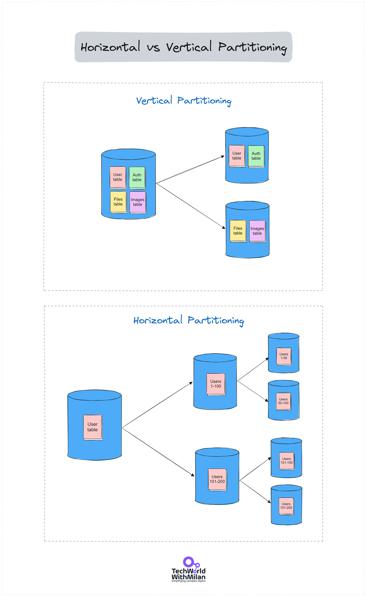
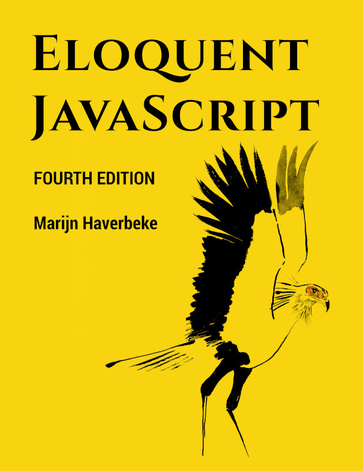

# How to scale databases

In this issue, we will discuss how to solve one of the most common software bottlenecks in production: **database scalability**. There are two types of scaling strategies: vertical and horizontal.

Also, we will see **how Figma scaled their Postgre database to almost infinite scalability** by using those approaches.

So, let’s dive in.

---

## How do we scale databases?

Databases usually consist of tables with columns and rows. Yet, traditional monolithic databases can become sluggish and cumbersome as they balloon in size. Database partitioning is a powerful technique for wrangling data and keeping databases running smoothly.

Database partitioning is the process of splitting a large table or database into smaller, more manageable chunks called partitions. This allows us to query only parts of the data, making it faster to load.

In general, we have two types of partitioning:

### Horizontal Partitioning (Sharding)

It splits tables by row, each partition containing the same schema but different rows. It is ideal for multi-tenant applications where data can be divided by customer or user for distributed computing or when data is too large to be stored in one DB.

There are different kinds of sharding:

- **Key-Based (Hash) sharding:** A shard is determined using a hash function on a specific key column within each record. This hash function uniformly distributes records across available shards. The main advantage is the even distribution of data and workload, but it can complicate queries that span multiple shards and make re-sharding.
- **Range-based sharding**divides data into shards based on the ranges of a particular key. For example, customer IDs ranging from 1 to 1000 might be stored in one shard, while 1001 to 2000 are stored in another. This approach simplifies queries that involve range operations but can lead to uneven data distribution and hotspots if the data isn't uniformly distributed across the ranges.
- **Directory-Based sharding:** This method uses a lookup table to map keys to their corresponding shards. It offers excellent flexibility, allowing for easy addition or removal of shards and straightforward re-sharding. However, it introduces a potential single point of failure in the lookup service and can become a performance bottleneck if not appropriately managed.
- **Geo-sharding:** distributes data based on geographic location. It aims to keep data physically closer to its users to reduce latency and improve compliance with local data regulations. This strategy benefits global applications serving users in distinct geographic regions. Balancing data distribution and ensuring efficient access across regions requires careful management.
- **Customer-based Sharding:** In multi-tenant architectures where each customer has potentially vastly different data sizes and usage patterns, customer-based sharding can be employed. This involves allocating a shard per customer or group of customers, optimizing for performance and isolation. While it offers high customization for serving large customers, it can lead to challenges in efficiently utilizing resources across shards.

When sharding, every DB server must be the same structurally, and data records must be divided in a sharded DB.

### Vertical Partitioning

It divides tables by column or table, separating frequently accessed columns from those less used, optimizing access times and cache efficiency. So, each table could be placed in a separate database.

Yet, database sharding is challenging. It's time-consuming because you must adjust many things, such as moving data and mapping queries. And it also costs money.

What are some good practices when you hit the issues with your DB:

1. **Vertical scaling** - first, add more power to your DB server (CPU, memory, etc.)
2. **Replication** - Create a read replica of your DB. This helps you improve reading performance, but you must also have caching.

If all of these cannot help, **then you do partitioning**:

🔸 Use **horizontal partitioning** for large tables where scalability and performance for specific queries are critical.

🔸 Use **vertical partitioning** when you have tables with many columns, but not all are accessed together frequently

Database Sharding explained (Credits: [Architecture notes - Mahdi Yusuf](https://architecturenotes.co/database-sharding-explained/))

> *If you want to learn more about SQL and databases, check this article:*
[
Tech World With Milan NewsletterHow To Learn SQL?In this issue, we talk about the following: How to Learn SQL? What is the Difference Between Inner, Left, Right, and Full Join? SQL Queries Run Order What is Query Optimizer? Top 20 SQL Query Optimization Techniques Tools & Resources…Read more3 years ago · 40 likes · 7 comments · Dr Milan Milanović](https://newsletter.techworld-with-milan.com/p/how-to-learn-sql?utm_source=substack&utm_campaign=post_embed&utm_medium=web)
---

## How Figma scaled their Postgres database to infinite scalability

In 2020, Figma still used a single extensive Amazon RDS database to meet their demands regarding metadata storage, such as permissions, file info, comments, etc. Yet, they observed 65% utilization during peak traffic due to the high volume. To solve this issue, they did a few tactical fixes, such as updating the DB to the most significant instance, creating multiple read replicas, and establishing a new DB for new use cases. Yet, they discovered this would only satisfy the need for a little volume.

What they did was a two-step process:

### Vertical Partitioning (2020)

First, [they investigated](https://www.figma.com/blog/how-figma-scaled-to-multiple-databases/) horizontal and vertical partitioning and decided on the latter based on related tables. Vertical partitioning stores tables and columns in a separate database or tables (such as Figma files or Organizations).

Yet, the process took work. They did the following:

1. **Identification of tables to partition.**In the first step, they found the tables with a significant portion of the workload that were not connected to others. They did this by attaching validators into Ruby ActiveRecord so that they could see which queries reference the same group of tables.
2. **Managing migration.** When they identified the tables, they needed to create a plan for migration without downtime. And they made a custom migration solution, which did the following:

1. Prepare client apps to query from multiple db partitions (by using PgBouncer)
2. Replicate tables from the original DB to a new DB
3. Pause activity on the original DB
4. Wait for DBs to sync
5. Reroute traffic to the new DB
3. **Logical replication.** In Postgres, they selected logical replication because it allows porting over a subset of tables and replicating to a database.

### **Horizontal Partitioning (2023)**

And this worked fine until the end of 2022, [when they found that some tables contained several terabytes and billions of rows](https://www.figma.com/blog/how-figmas-databases-team-lived-to-tell-the-scale/), which became too large for a single DB. They needed a better solution to minimize developer impact, scale transparently, make incremental progress, and maintain strong data consistency. The solution was **horizontal sharding** - breaking up a single table or group of tables and splitting the data across multiple physical database instances. A table can handle infinite shards at the physical layer once horizontally sharded at the application layer.

**Horizontal scaling** is much more complex than vertical scaling because it needs to improve reliability and consistency when the table is split among many physical tables. So, **they started with scaling a simple but high-traffic table**. The approach included sharding groups of related tables into colocations (called **colos**) with the same sharding key (where tables support cross-joins and complete transactions) and using logical sharding.

To reduce the risk of a horizontal sharding rollout, they tried to isolate the process of preparing a table at the application layer from the physical one. To enable this, they made “**logical sharding**” different from “physical sharding.” Once the table is logically shared, all reading and writing will happen as if the table is already horizontally shared. When this works properly, they would do a physical sharding.

Also, they built a **DBProxy query engine** that intercepts SQL queries and routes them to various Postgre databases. A query engine built into DBProxy can comprehend and run intricate queries sharded horizontally. Thanks to DBProxy, they could also incorporate functions like request hedging and dynamic load-shedding.

---

## Bonus: Free e-book “Eloquent JavaScript”

Currently in its 4th Edition, this is one of the best books on JavaScript, and it’s completely free.

Created by [Marijn Haverbeke](https://marijnhaverbeke.nl/), it guides you from basic to more advanced concepts of JavaScript, including building a few mini-projects.

In the book, you will learn:

- Values, types, and operators
- Program structure
- Functions
- Data structures
- Modules
- Higher-order functions
- The DOM
- Asynchronous programming
- Handling Events
- And more

Martin writes clearly and concisely; I always liked his style in previous editions.

You can read the entire book online or download it in various formats (PDF, EPUB, MOBI): [https://eloquentjavascript.net](https://eloquentjavascript.net/).

“[Eloquent JavaScript](https://eloquentjavascript.net/)” by Marijn Haverbeke

---

## More ways I can help you

1. **1:1 Coaching:** [Book a working session with me](https://newsletter.techworld-with-milan.com/p/coaching-services). 1:1 coaching is available for personal and organizational/team growth topics. I help you become a high-performing leader 🚀.
2. **[Promote yourself to 29,000+ subscribers](https://newsletter.techworld-with-milan.com/p/sponsorship-of-tech-world-with-milan)**by sponsoring this newsletter.

---

Thanks for reading Tech World With Milan Newsletter! Subscribe for free to receive new posts and support my work.