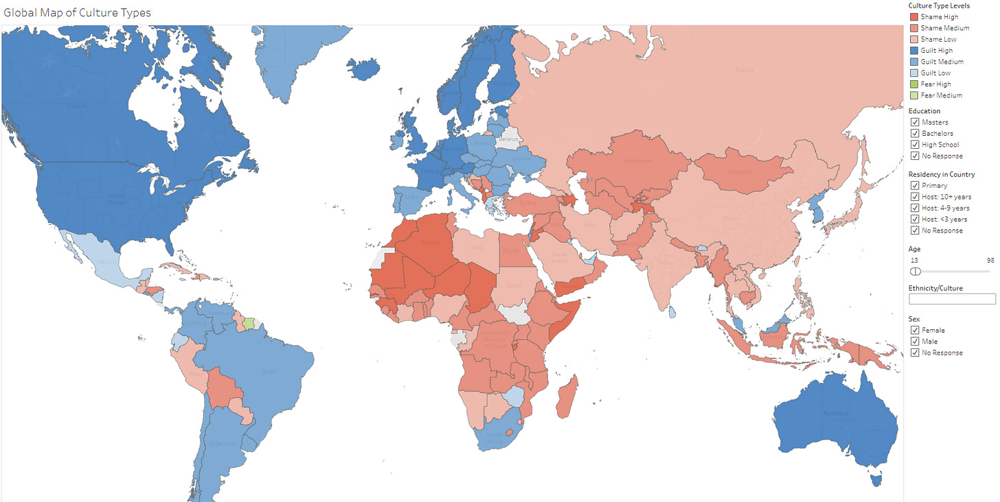
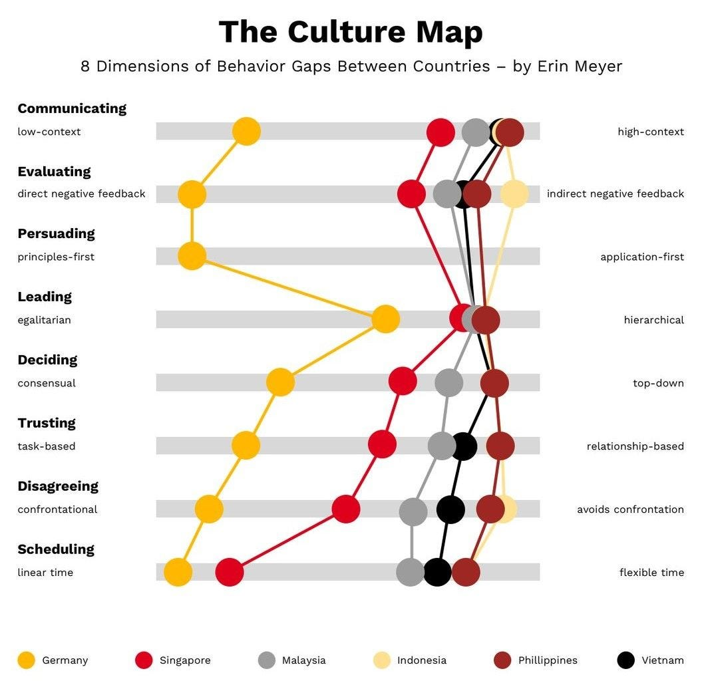
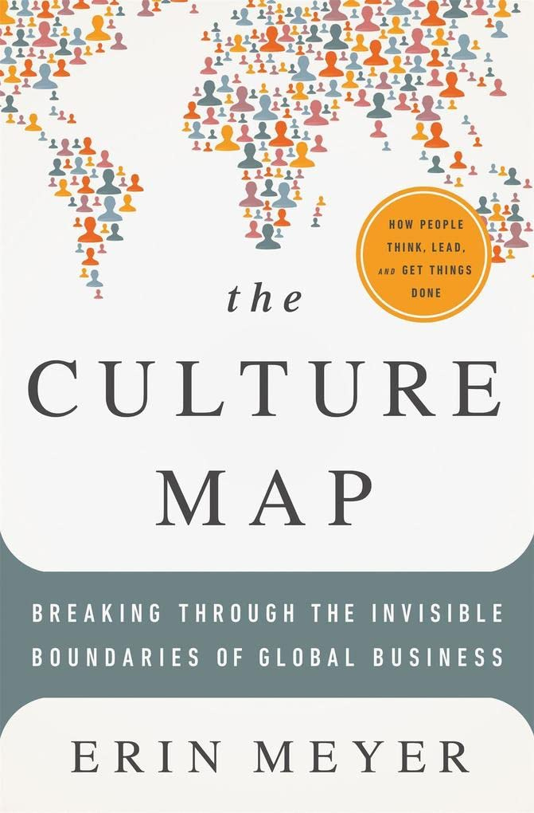
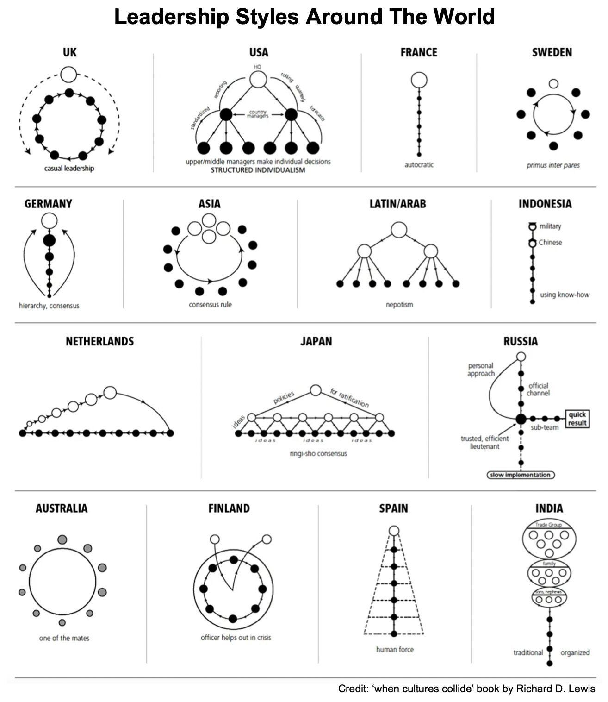

# How to work with diverse cultures

This week’s issue brings to you the following:

- **How to recognize different cultures**
- **How to work with diverse cultures**
- **Leadership styles around the world**
- **Dealing with Cultural Debt**

So, let’s dive in.

---

## How to recognize different cultures

Recognizing and understanding different cultural frameworks is imperative in today's globalized business environment. This awareness is particularly crucial in the technology sector, where diverse teams are the norm, and effective leadership hinges on navigating varied cultural landscapes.

Appreciating these cultural dimensions **allows leaders to communicate more effectively, resolve conflicts with sensitivity, and foster a more inclusive and productive workplace**.

**Dr. Mary Douglas** delved into how different societies perceive and respond to risks and social structures in her work on group and grid theory, particularly in the book "**[Natural Symbols](https://www.routledge.com/Natural-Symbols/Douglas/p/book/9780415138253)**," published in 1970. Her insights laid the foundation for further exploration into these cultural paradigms, especially around **Guilt/Innocence,** **Honor/Shame**, and **Fear/Power** as cultural categories.

### **Guilt/Innocence Cultures**

Guilt/Innocence cultures focus on **law and individual rights**, with actions typically categorized as right or wrong based on absolute principles. These cultures **value truth, evidence, fairness, justice,**and **personal integrity**. In the workplace, this manifests as an adherence to coding standards, ethical guidelines, and individual accountability. Leaders in such environments prioritize clear, objective criteria and encourage a culture of personal responsibility and transparency.

> Most **Western countries** (and Australia) have this culture.

### **Honor/Shame Cultures**

Honor/Shame cultures **prioritize social status**and **the reputation of the group** or family. Honor and shame are used to maintain societal or organizational balance. Actions in these cultures are influenced by their potential impact on the group's integrity, emphasizing maintaining face, respect, and communal harmony. This might involve group recognition over individual ones in a team setting, **avoiding public criticism,**and **respecting hierarchical relationships**. Leaders in these cultures must be adept at navigating social dynamics, ensuring that feedback and decisions uphold the group's dignity and honor.

> Most of the **Asia/African countries** have this culture.

### **Fear/Power Cultures**

Fear/Power cultures are characterized by a **dominant fear of the unknown** and a reliance on power dynamics to cope with uncertainties. In these cultures, individuals might seek power or protection from more powerful entities, and those in power often make decisions without much consultation. This translates to a **strict hierarchy**and **centralized decision-making** in the business context. Leaders in these settings are often seen as protectors or strong figures, and they must provide clear guidance and a sense of security to their team members.

> Some countries have this type of culture, such as certain **African countries,**parts of**Latin America (more traditional or rural areas),**certain **Asian countries,**and **the Middle East.**

**[Global Map of Culture Types](https://public.tableau.com/app/profile/jayson.georges/viz/GlobalMapofCultureTypesFINAL_1/GlobalMapofCultureTypes)** by Jayson Georges

---

## How to work with **diverse**cultures

You probably started to work in your country with a team where people come from the same cultural background. So, more or less, you've understood others very well. Yet, things become more complicated if you start working in international teams with people from other countries or continents. 

In her book "**The Culture Map: Breaking Through the Invisible Boundaries of Global Business,**" Erin Meyer guides readers through navigating the complexities of cross-cultural communication.

Here are the main points from the book:

1. **Communication**: Meyer explains that communication varies from explicit to implicit along a scale. Communication is precise, simple, and straightforward in direct cultures (like the US or Germany). In contrast, more implicit cultures (like Japan or Korea) rely heavily on context, and understanding comes from reading between the lines.
2. **Evaluating**: This scale ranges from direct negative feedback (found in cultures like Russia or France) to indirect negative feedback (typical in cultures like Japan or Thailand). Understanding this helps in delivering or interpreting criticism constructively.
3. **Persuading:** Cultures differ in how they are influenced. Some cultures are principle-first (they need to understand the why before the what - common in Russia or Italy), and others are application-first (prefer practical case evidence first - more common in the US or Canada).
4. **Leading:** Leadership can be hierarchical (a transparent chain of command, like in China or India) or egalitarian (a flat structure, like in Denmark or Sweden). It's essential to understand these differences to avoid clashes in team dynamics.
5. **Deciding**: Cultures have different decision-making processes: some are consensual (like Japan or Sweden), where decisions are made in groups and may take longer, and some are top-down (like in China or Nigeria), which are faster but may not involve everyone.
6. **Trusting**: In some cultures, trust is task-based (it's built through business-related activities, like in the US or UK), while in others, it's relationship-based (it's created through sharing meals, evening drinks, and visits at your home, like in China or Brazil).
7. **Disagreeing:** Cultures expressing disagreement range from confrontational (more common in cultures like France or Israel, where open disagreement is seen as positive) to avoiding confrontation (like in Japan or Indonesia, where harmony is crucial).

The Culture Map (Source: [German Accelerator](https://www.germanaccelerator.com/blog/asian-business-culture-1/))

If you want to learn more about it, I recommend reading **[Meyers’ book](https://amzn.to/3uzBPAz)**.

“[The Culture Map](https://amzn.to/3uzBPAz),” by Erin Meyer

---

## Leadership styles around the world

Understanding diverse leadership styles is critical to successful international collaborations. Richard D. Lewis, in his book "**[When Cultures Collide](https://amzn.to/412V2qn)**," offers a comprehensive guide on how different cultures approach leadership.

1. **The Linear-Active Leader (Western Europe, North America):** Linear-active leaders, common in Western Europe and North America, are **task-oriented**and **organized and** **prefer direct communication**. They are planners and value logic, efficiency, and punctuality. In these cultures, leadership is often about **setting clear goals, providing straightforward feedback,**and maintaining a structured approach to business.
2. **The Multi-Active Leader (Latin America, Southern Europe):** Conversely, multi-active leaders from Latin America and Southern Europe are more relationship-oriented. They **prioritize emotional expression, eloquence, and personal connections**. These leaders excel in motivating their teams, **communicating** persuasively, and are adept at multitasking and adapting to fluid situations.
3. **The Reactive Leader (East Asia)** Reactive leaders, often found in East Asian cultures, **emphasize listening, harmony, and respect**. They are contemplative, valuing courtesy and **indirect communication**to maintain group harmony. Leadership here is about **building consensus and showing respect for hierarchy**, and it often involves leading from behind.

As a leader in the global arena, the ability to adapt your style to different cultural contexts can lead to more effective management, smoother interactions, and more tremendous success in a multicultural environment.

Leadership styles around the world (“[When Culture Collide](https://amzn.to/412V2qn)” book by Richard D. Lewis)

---

## Dealing with Cultural Debt

Cultural debt refers to the cultural issues within a team or organization that can hinder productivity, collaboration, and overall success. It accumulates when communication problems, lack of diversity, or toxic behaviors persist.

Addressing cultural debt is essential for building effective teams and achieving long-term success. It fosters a **healthy work environment, promotes open communication, and addresses cultural issues** that impede progress.

Here are some examples of cultural debt:

- **Communication Gaps**: When team members or departments don't communicate effectively, it can lead to misunderstandings and delays. Address this by implementing clear communication channels, regular meetings, and encouraging open dialogue.
- **Lack of Diversity and Inclusion**: A lack of diversity can lead to a monolithic culture that stifles creativity and innovation. To tackle this, prioritize diversity and inclusion in your hiring processes and create an inclusive environment where all voices are heard and valued. In meetings, allow most quiet people to talk first, etc.
- **Toxic Behaviors**: Toxic behaviors such as bullying or harassment can create a hostile work environment. Implement strict anti-harassment policies, provide training on assertive communication, and take swift action when issues arise.
- **Burnout Culture**: Overemphasis on productivity at the expense of employee well-being leads to burnout. Policies promoting work-life balance, like flexible working hours or wellness programs, can address this.
- **Lack of Empathy**: When team members lack empathy for each other's challenges, it can harm collaboration. Promote empathy through team-building exercises, fostering a supportive atmosphere, and encouraging team members to understand each other's perspectives.
- **Blame Culture**: A culture of blame can stifle innovation and risk-taking. Shift the focus from blaming individuals to analyzing systemic issues when problems occur. Promoting a culture of accountability and learning, where mistakes are seen as opportunities for improvement.
- **Undervalued Feedback**: Not listening to employee feedback can lead to dissatisfaction and disengagement. Implementing regular feedback mechanisms and showing that you act on this feedback can help resolve this.
- **Lack of Leadership**: Train leaders to recognize and address cultural issues. Leadership plays a crucial role in shaping and maintaining a positive culture. Leaders need to know what type of organizational culture they're trying to build, as they have a multiplier effect on the organization.

Making a **deliberate decision** about the kind of organization you want to create from the beginning is the right way to reduce cultural debt.

Cultural Debt

---

## More ways I can help you

1. **1:1 Coaching:** [Book a working session with me](https://newsletter.techworld-with-milan.com/p/coaching-services). 1:1 coaching is available for personal and organizational/team growth topics. I help you become a high-performing leader 🚀.
2. **[Promote yourself to 19,000+ subscribers](https://newsletter.techworld-with-milan.com/p/sponsorship-of-tech-world-with-milan)**by sponsoring this newsletter.

---

Thanks for reading Tech World With Milan Newsletter! Subscribe for free to receive new posts and support my work.