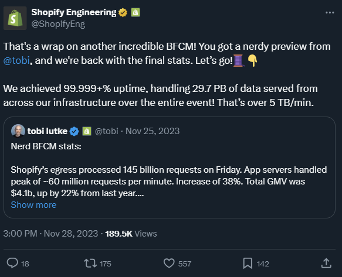
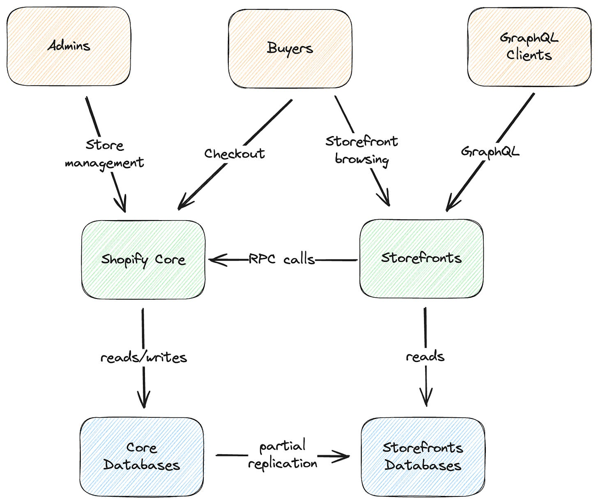
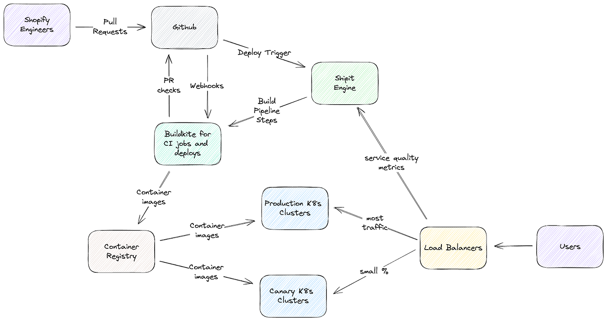
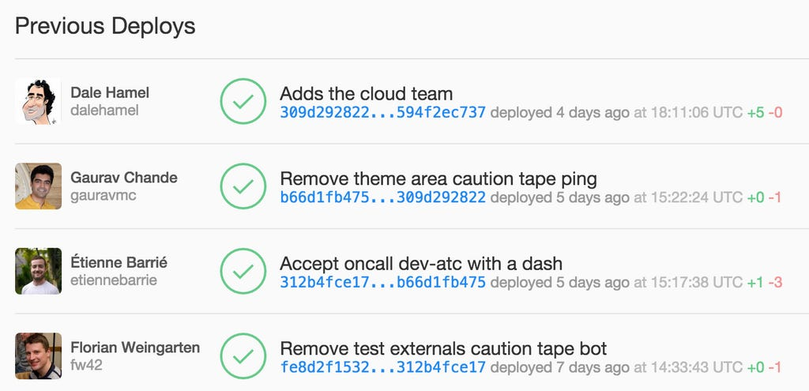

# Inside Shopify’s Modular Monolith

*An interview with Principal Engineer Oleksiy Kovyrin*

In my previous newsletter, I [wrote](https://newsletter.techworld-with-milan.com/p/stack-overflow-architecture#%C2%A7shopify-architecture) about Shopify and its impressive architecture. This time, I talked with [Oleksiy Kovyrin](https://www.linkedin.com/in/kovyrin), a Principal Engineer at [Shopify](https://www.shopify.com/), about their architecture, tech stack, testing, culture, and more.

In today’s issue, we cover the following:

1. **Who is Oleksiy?**
2. **What is the role of the Principal Engineer at Shopify?**
3. **What is Shopify's overall architecture?**
4. **What is Shopify's tech stack?**
5. **Is the monolith going to be broken into microservices?**
6. **How do they do testing?**
7. **How do they do deployments?**
8. **How do they handle failures in the system?**
9. **What challenges do they have working on right now?**

So, let’s dive in.

---

## 1.  Who is [Oleksiy](https://www.linkedin.com/in/kovyrin)?

I have spent most of my career in technical operations (system administration, later called DevOps, nowadays encompassed by platform engineering and SRE disciplines). Along the way, I worked at Percona as a MySQL performance consultant. Then I operated some of the largest Ruby on Rails applications in the world, all the while [following](https://shopify.engineering/) the incredible story of Shopify’s development and growth.

Finally, after decades of work in operations, when a startup I was at got acquired by Elastic, I decided to move into software engineering. After 5 years there, I needed a bigger challenge, which felt like the right moment to join Shopify.

I started with the Storefronts group (the team responsible for Storefront themes, all the related infrastructure, and the Storefront rendering infrastructure) at Shopify at the beginning of 2022. Two years later, I can confidently say that Shopify’s culture is unique. I**enjoy working with the team here due to the incredible talent density I have never encountered**. Every day, I am humbled by the caliber of people I can work with and the level of problems I get to solve.

[Oleksiy Kovyrin](https://www.linkedin.com/in/kovyrin), a Principal Engineer at [Shopify](https://www.shopify.com/)

## 2.  What is the role of the Principal Engineer at Shopify?

Before joining Shopify, I was excited about all the possibilities associated with the Principal Engineer role. Immediately, I was surprised at how diverse the Principal Engineering discipline was at the company. We have a range of engineers here, from extremely deep and narrow experts to amazing architects coordinating challenging projects across the company. Even more impressive is that you have a lot of agency in the shape of a Principal Engineer you will be, provided that the work aligns with the overarching mission of making commerce better for everyone. After 2 years with the company,**I found myself in a sweet spot of spending ~75% of my time doing deep technical work across multiple areas of Storefronts infrastructure, and the rest is spent on project leadership, coordination, etc.**

## 3.  The recent [tweet](https://twitter.com/ShopifyEng/status/1729500623773573265) by Shopify Engineering shows impressive results achieved by your system. What is Shopify's overall architecture?

The infrastructure at Shopify was one of the most surprising parts of the company for me. I have spent my whole career building large, heavily loaded systems based on **Ruby on Rails**. Joining Shopify and knowing upfront a lot about the amount of traffic they handled during Black Friday, Cyber Monday ([BFCM](https://bfcm.shopify.com/)), and flash sales, I was half-expecting to find some magic sauce inside. But the reality turned out to be very different:****the team here is extremely pragmatic when building anything. It comes from Shopify’s Founder and CEO [Tobi Lütke](https://twitter.com/tobi) himself: **if something can be made simpler, we try to make it so**. As a result, the whole system behind those impressive numbers is built on top of fairly common components: **Ruby, Rails, MySQL/Vitess, Memcached/Redis, Kafka, Elasticsearch, etc., scaled horizontally**.

Shopify Engineering Tweet about the amount of traffic they handled during Black Friday

What makes Shopify unique is the level of mastery the teams have built around those key components:**we employ [Ruby](https://shopify.engineering/shopify-ruby-at-scale-research-investment) core contributors** (who keep [making Ruby faster](https://shopify.engineering/ruby-yjit-is-production-ready)), Rails core contributors (improving Rails), **MySQL experts** (who know how to operate MySQL at scale), and **we contribute to and maintain all kinds of [open-source projects](https://shopify.engineering/shopify-open-source-philosophy) that support our infrastructure**. As a result, even the simplest components in our infrastructure tend to be deployed, managed, and scaled exceptionally well, leading to a system that can scale to many orders of magnitude over the baseline capacity and still perform well.

> *Another example of large scale app written in Ruby is [Stripe API](https://blog.nelhage.com/post/stripe-dev-environment/).*

## 4.  What is Shopify's tech stack?

Given that databases (and stateful systems in general) are the most complex components to scale, **we focus our scaling on MySQL first**. All shops on the platform are split into groups, each hosted on a dedicated set of database servers called a **[pod](https://shopify.engineering/a-pods-architecture-to-allow-shopify-to-scale)**. Each pod is wholly isolated from the rest of the database infrastructure, limiting the blast radius of most database-related incidents to a relatively small group of shops. Some more prominent merchants get their dedicated pods that guarantee complete resource isolation.

Over the past year, some applications [started relying on Vitess](https://shopify.engineering/horizontally-scaling-the-rails-backend-of-shop-app-with-vitess) to help with the horizontal sharding of their data.

On top of the database layer is a reasonably standard Ruby on Rails stack: **Ruby and Rails applications running on Puma**, using **Memcached**for ephemeral storage needs and **Elasticsearch**for full-text search. **Nginx + Lua** is used for sophisticated tasks, from smart routing across multiple regions to rate limiting, abuse protection, etc.

This runs on top of **Kubernetes hosted on [Google Cloud](https://shopify.engineering/shopify-infrastructure-collaboration-with-google)** in many regions worldwide, making the infrastructure extremely scalable and responsive to wild traffic fluctuations.

Check the full Shopify tech stack at [Stackshare](https://stackshare.io/shopify/e-commerce-at-scale-inside-shopifys-tech-stack).

A Pods Architecture To Allow Shopify To Scale (Source: [Shopify Engineering](https://shopify.engineering/a-pods-architecture-to-allow-shopify-to-scale))

> ### What are Pods exactly?
> 
> *The idea behind pods at Shopify is to split all of our data into a set of completely independent database (MySQL) clusters using shop_id as the sharding key to ensure resource isolation between different tenants and localize the impact of a “noisy neighbor” problem across the platform.*
> 
> *Only the databases are podded since they are the hardest component to scale. Everything else that is stateless is scaled automatically according to the incoming traffic levels and other load parameters using a custom Kubernetes autoscale.*

## 5. Is the monolith going to be broken into microservices?

Shopify fully embraces the idea of a **[Majestic Monolith](https://signalvnoise.com/svn3/the-majestic-monolith/)**—most user-facing functionality people tend to associate with the company is served by a single large Ruby on Rails application called “Shopify Core.” Internally, [the monolith is split into multiple components](https://shopify.engineering/deconstructing-monolith-designing-software-maximizes-developer-productivity) focused on different business domains. Many custom (later open-sourced) machinery have been built to [enforce coding standards](https://github.com/Shopify/tapioca), [API boundaries](https://github.com/Shopify/packwerk) between components, etc.

The rendering application behind all Shopify storefronts is completely separate from the monolith. This was one of the cases where it made perfect sense to split functionality from Core because it is relatively simple. Load data from a database, render Liquid code, and send the HTML back to the user – the absolute majority of requests it handles. **Given the amount of traffic on this application, even a small improvement in its efficiency results in enormous resource savings**. So, when it was initially built, the team set several strict constraints on how the code is written, what features of Ruby we prefer to avoid, how we deal with memory usage, etc. This allowed us to build a pretty efficient application in a language we love while carefully controlling memory allocation and the resources we spend rendering storefronts.

Shopify application components

In parallel with this effort, the Ruby infrastructure team (working on [YJIT](https://github.com/Shopify/yjit), among other things) **has made the language significantly faster with each release**. Finally, in the last year, we started rewriting parts of this application in Rust to improve efficiency further.

Answering your question about the future of the monolith, I think outside of a few other localized cases, most of the functionality of the Shopify platform will probably be handled by the Core monolith for a long time, given how well it has worked for us so far using relatively standard horizontal scalability techniques.

## 6. How do you do testing?

Our testing infrastructure is a **multi-layered set of checks that allows us to deploy hundreds of times daily while keeping the platform safe**. It starts with a set of tests on each application: your typical unit/integration tests, etc. Those are required for a change to propagate into a deployment pipeline (based on the [Shipit](https://github.com/Shopify/shipit-engine) engine, created by Shopify and open-sourced years ago.

Shopify overall infrastructure

During the deployment, a very important step is **canary testing**: a change will be deployed onto a small subset of production instances, and automation will monitor a set of key health metrics for the platform. If any metrics move in the wrong direction, the change is automatically reverted and removed from production immediately, allowing developers to figure out what went wrong and try again when they fix the problem. Only after testing a change on canaries for some time the deployment pipeline performs a full deployment. The same approach is used for significant schema changes, etc.

## 7. How do you do deployments?

All Shopify deployments are based on **Kubernetes**(running on [GCP](https://shopify.engineering/shopify-infrastructure-collaboration-with-google)), so each application is a container (or a fleet of containers) somewhere in one of our clusters. Our deployment pipeline is built on the **[Shipit](https://github.com/Shopify/shipit-engine) engine** (created by Shopify and open-sourced years ago). Deployment pipelines can get pretty complex, but it mostly boils down to building an image, deploying it to canaries, waiting to ensure things are healthy, and gradually rolling out the change wider across the global fleet of Kubernetes clusters.

Shipit also maintains the deployment queue and merges multiple pull requests into a single deployment to increase the pipeline's throughput.

Shipit open-source deployment tool by Shopify ([Source](https://shopify.engineering/introducing-shipit))

## 8. How do you handle failures in the system?

The whole system is built with many redundancy and horizontal auto-scaling (if possible), which helps prevent large-scale outages. But there are always big and small fires to handle. So, **we have a dedicated site reliability team responsible for keeping the platform healthy in the face of constant change and adversarial problems like bots and DDoS attacks**. They have built many automated tools to help us handle traffic flashes and, if needed, degrade gracefully. Some interesting examples: **they have automated traffic analysis tools helping them scope ongoing incidents down to specific pods, shops, page types, or traffic sources**; then the team can control the flow of traffic by pod or shop, re-route traffic between regions, block or slow down requests from specific parts of the world, prioritize particular types of traffic and apply anti-adversarial measures across our network to mitigate attacks.

Finally, **each application has an owner team** (or a set of teams) that can be paged if their application gets unhealthy. They help troubleshoot and resolve incidents around the clock (being a distributed company helps a lot here since we have people across many time zones).

## 9. What challenges are you working on right now in your team?

We have just finished a large project to increase the global footprint of our **Storefront rendering infrastructure**, rolling out new regions in Europe, Asia, Australia, and North America. The project required coordination across many different teams (from networking to databases to operations, etc.) and involved **building completely new tools for filtered database replication** (since we cannot replicate all of our data into all regions due to cost and data residency requirements), making changes in the application itself to allow for rendering without having access to all data, etc. This large effort has reduced latency for our buyers worldwide and made their shopping experiences smoother.

Next on our radar are further improvements in Liquid rendering performance, database access optimization, and other performance-related work.

— Thank you for your time, Oleksiy

> *Check **[the Shopify Engineering blog](https://shopify.engineering/)**, one of the best engineering blogs, for information on large-scale system architectures.*

---

## More ways I can help you

1. **1:1 Coaching:** [Book a working session with me](https://newsletter.techworld-with-milan.com/p/coaching-services). 1:1 coaching is available for personal and organizational/team growth topics. I help you become a high-performing leader 🚀.
2. **[Promote yourself to 30,000+ subscribers](https://newsletter.techworld-with-milan.com/p/sponsorship-of-tech-world-with-milan)**by sponsoring this newsletter.

---

Thanks for reading Tech World With Milan Newsletter! Subscribe for free to receive new posts and support my work.