# Learn fundamentals, not frameworks

We, developers, love new things, and most of us are early adopters. When something emerges, we rush to try it (hello Moltbot). We check tutorials, do “hello world” apps, and this feels good because we learned something new.

The problem is that most knowledge in our industry has a short lifespan. Most frameworks peak between 2 and 5 years. When you become really good at that technology, it could already become a legacy.

With the rise of AI code generators, it has accelerated much faster than before. People are vibe-coding with technologies they never learned properly.

On the other hand, people who invest in fundamentals can quickly adopt new technologies because they understand the underlying principles. So, instead of rushing to learn a new framework this month, we should **spend more time learning things that don’t change.**

In the rest of the article, we are going to talk about:

1. **Framework lifecycles really are short**. If you’ve been around long enough, you’ve watched popular frameworks rise, peak, and fade within a few years. The data clearly shows this: Frontend frameworks have a half-life measured in months.
2. **Why fundamentals matter**. Programming languages differ, but bad naming is bad everywhere. Frameworks change, but design patterns don’t. When your app has problems in production, the answer never comes from the docs. It comes from understanding how things actually work and learning from that.
3. **AI amplifies fundamentals and exposes their absence**. AI writes 41% of code today, but it can’t make architectural trade-offs or read between the lines of a business requirement. Without fundamentals, debugging AI-generated code is just guessing.
4. **Meet the Expert Generalist.** Every wave of automation was supposed to replace developers: compilers, cloud, and now AI. Instead, each one raised the bar. The developers who thrive aren’t prompt engineers, but generalists who understand systems, trade-offs, and intent.
5. **The 80/20 Rule of Learning**. Spend 80% of your learning time on fundamentals and 20% on frameworks. You’ll pick up frameworks on the job anyway. Nobody’s going to teach you distributed systems or clean architecture for you.

So, let’s dive in.

---

## [Multi-Agent Code Review That Catches Real Issues (Sponsored)](http://qodo.ai/blog/introducing-qodo-2.0-agentic-code-review?utm_source=tech-world-with-milan&utm_medium=newsletter&utm_campaign=qodo-2.0-launch)

*Code review's been stuck. Either it's slow (manual), noisy (AI tools), or misses critical things. Qodo 2.0 is different. With the highest precision & recall, it finds critical issues that other code review tools miss, while limiting noise. By learning from your codebase & PR history, Qodo provides fixes that developers actually use.*

[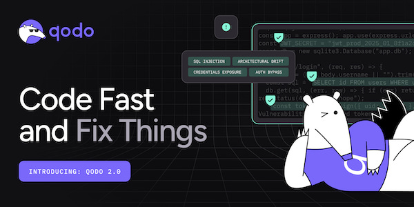](http://qodo.ai/blog/introducing-qodo-2.0-agentic-code-review?utm_source=tech-world-with-milan&utm_medium=newsletter&utm_campaign=qodo-2.0-launch)

[Learn how](http://qodo.ai/blog/introducing-qodo-2.0-agentic-code-review?utm_source=tech-world-with-milan&utm_medium=newsletter&utm_campaign=qodo-2.0-launch)

---

## 1. Framework lifecycles really are short

If you’ve been around this industry long enough, you’ll have witnessed many a framework come and go. Ever heard of frameworks like GWT, Apache Tapestry, Backbone.js, or Knockout.js? Yes, they were very popular back in the day, and you needed to read a lot of docs to understand them.

An [analysis by Stack Overflow](https://stackoverflow.blog/2018/01/11/brutal-lifecycle-javascript-frameworks/) of JavaScript framework traffic clearly shows this trend. The rise, peak, and gradual decline all occur within a couple of years. Around 2011, Backbone, Knockout, and Ember were the ‘it’ frameworks. By 2015, Angular 1.x was no longer supported, and Angular 2.0 required developers to rewrite their applications.

[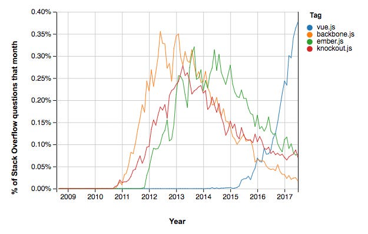](https://substackcdn.com/image/fetch/$s_!RvDb!,f_auto,q_auto:good,fl_progressive:steep/https%3A%2F%2Fsubstack-post-media.s3.amazonaws.com%2Fpublic%2Fimages%2Fbcc295eb-7be2-49b0-8dae-3d85671db671_625x397.png)% of Stack Overflow questions over the years (Source: [StackOverflow](https://stackoverflow.blog/2018/01/11/brutal-lifecycle-javascript-frameworks/))

There’s even a hierarchy of technology longevity: language choices last 10+ years, databases 7–10 years, backend frameworks 3–5 years, and frontend frameworks around 18 months. If you’re debating all of those equally, you’re just wasting time.

The data on the code half-life also confirms this. Erik Bernhardsson has [analyzed 26+ open-source projects](https://erikbern.com/2016/12/05/the-half-life-of-code) and calculated **a median half-life of 3.33 years**. Frontend frameworks such as Angular are at the very short end of this scale, at just 0.32 years, whereas Linux has a figure of 6.6 years. Again, the further up the stack you go, the shorter the lifespan becomes.

[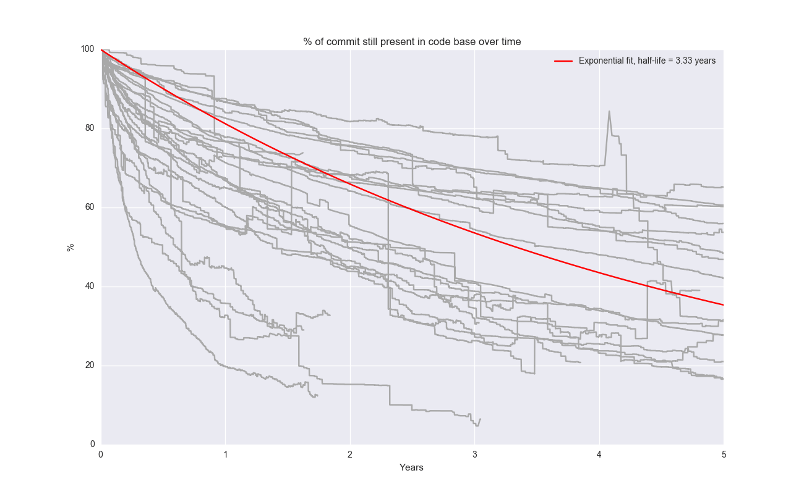](https://substackcdn.com/image/fetch/$s_!OPC3!,f_auto,q_auto:good,fl_progressive:steep/https%3A%2F%2Fsubstack-post-media.s3.amazonaws.com%2Fpublic%2Fimages%2F61e486ec-6d84-4d2a-9010-f7f8189d9863_1300x800.png)% of commits still present in the code base over time (Source: [Erik Bernhardsson blog](https://erikbern.com/2016/12/05/the-half-life-of-code))

## 2. Why fundamentals matter

When you understand fundamentals, you understand the principles and concepts on which various frameworks and programming languages work. This helps you become adaptable and flexible in programming, using various technologies, or when the framework you’re using fails to do something.

Programming languages differ, yet design smells are similar across them. Bad naming is bad in all languages. Frameworks are different, while*design patterns are similar*. Technological stacks differ, but the principles of concurrency, data structures, distributed systems, and clean architecture are similar.

A good understanding of fundamentals helps you use these frameworks in a more *efficient and effective manner*, since you also know how to make those frameworks suitable for what you need. You’re not just following a tutorial, but you are understanding what is happening under the hood.

Take, for instance, the web application that allows users to upload/share images. Let's suppose this web application was written using a popular web framework, such as Ruby on Rails. Maybe you vibe-coded it fast, and it works well at the start. But over time, as your user base grows, you hit performance issues. Now, what do you do? Identifying root cause is not easy, as you need to understand how your code works on the infrastructure, what is happening there, how to read logs (and understand them), etc. A developer who knows fundamentals can identify such a bottleneck and propose a solution, e.g., use CDN, optimize image shares, add (proper) caching, use a different kind of storage, etc.

So, the solution doesn’t come from the docs or coding agents. It comes from a deep understanding of how things work.

[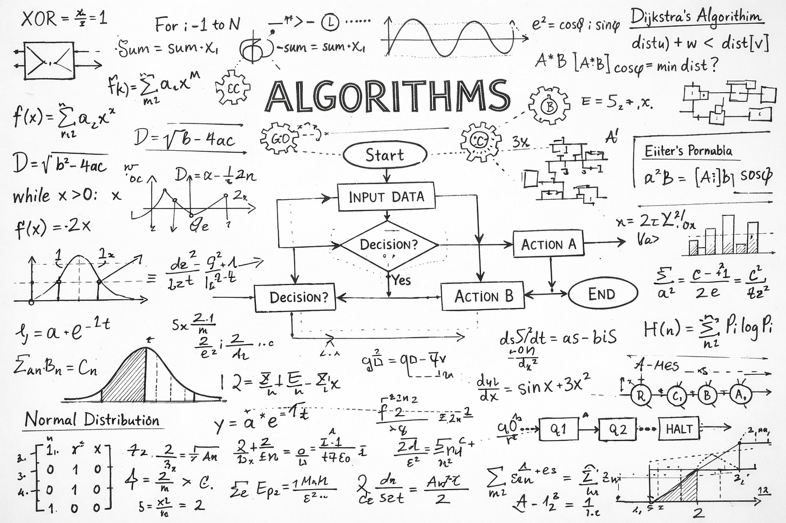](https://substackcdn.com/image/fetch/$s_!uXbw!,f_auto,q_auto:good,fl_progressive:steep/https%3A%2F%2Fsubstack-post-media.s3.amazonaws.com%2Fpublic%2Fimages%2F6038866e-b913-48a4-8b3b-ab37dfb9072c_1536x1024.png)Algorithms as fundamentals

> ### **Can you learn fundamentals through frameworks?**
> 
> *We should note that frameworks can be a good way to learn basic concepts, like when learning Ruby with Rails, you can learn about ACID, ORMS, etc. Learning a thing or two about functional programming with React too, or learning CSS with Bootstrap.*
> 
> *There is also the fact that nobody really does everything from first principles. You didn’t learn programming by reading papers by Turing. You learned it in a welcoming environment where you can experiment and get immediate feedback. The famous debate between [Knuth and McIlroy](https://leancrew.com/all-this/2011/12/more-shell-less-egg/) tells us everything we need to know. Don Knuth wrote a 10-page literate programming document from first principles for a word-frequency counter. Doug McIlroy solved it in a 6-line shell script using Unix tools. “If we did everything from first principles, then nothing would get done.”*
> 
> *And then of course there’s the deeper question: what exactly are “Fundamentals” anyway? Some will say it’s algorithms and math, others will point to software engineering, which encompasses design, testing, deployment, and lifecycle issues.*
> 
> *The distinction between “Fundamentals” and “Frameworks” is much less clear than we think.*

## 3. AI amplifies fundamentals and exposes their absence

With AI tools generating an [estimated 41% of all code today](https://www.secondtalent.com/resources/ai-coding-assistant-statistics/), you might think the fundamentals matter less. Why would we bother to understand what’s underneath if AI writes the code?

Because *AI writes code, but you own the responsibility*.

AI coding assistants are great for syntax, boilerplate code, and pattern suggestions. However, they’re bad with context. They don’t attend the meetings where the senior leadership team talks about cost vs. performance. They don’t understand that a customer service system has to be designed for five 9s, whereas the in-house dashboard can tolerate downtime. They can’t read between the lines when someone says the application has got to be fast, but really they mean “make it cheap.” They cannot connect the dots.

The [statistics](https://www.secondtalent.com/resources/ai-coding-assistant-statistics/) show the risks, too: **48% of AI-generated code is at high risk of security vulnerabilities**, and defects are 1.7 times more likely to be found in AI-generated code without proper review. Only 33% of developers trust AI-generated code completely. That means most AI code needs the same scrutiny as junior developer code. Someone has to understand it enough to catch what's wrong.

Debugging, reviewing, and validating AI code have thus become crucial skills, and you cannot do them without a strong foundation!

[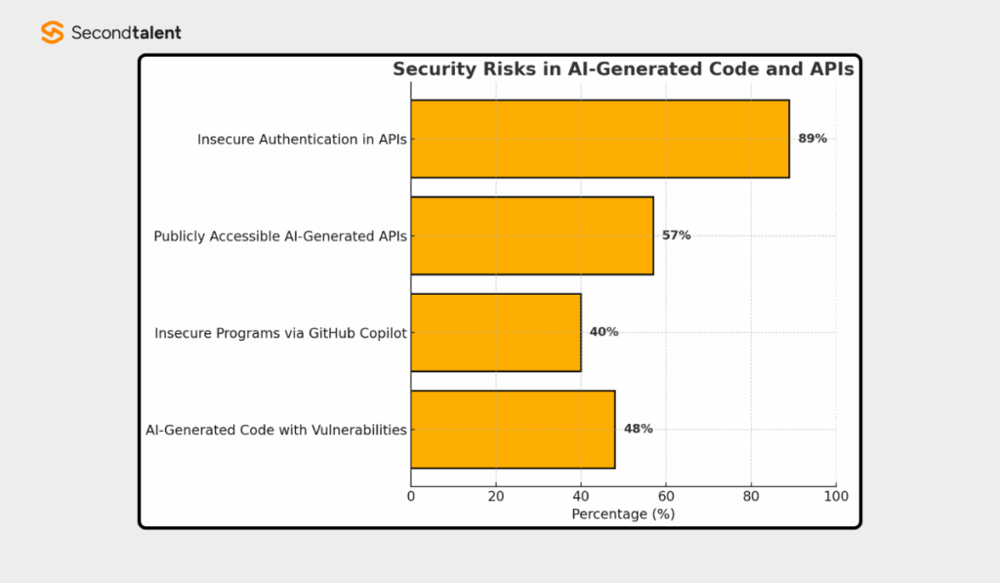](https://substackcdn.com/image/fetch/$s_!vThW!,f_auto,q_auto:good,fl_progressive:steep/https%3A%2F%2Fsubstack-post-media.s3.amazonaws.com%2Fpublic%2Fimages%2F5cccc8c4-7a6d-43e4-9a0f-23859b26b0ed_1024x597.png)Security risks in AI-Generated Code and APIs (Source: [Secondtalent](https://www.secondtalent.com/resources/ai-coding-assistant-statistics/))

Without fundamentals, debugging code written by an AI is almost impossible. You won’t be able to explain why a program is working, when a program will fail, or even be able to adjust a program to work for unknown scenarios. Your AI helper could help, but it also leads you to the wrong road, where the price of fixing it would be too high.

So, we can say that the most valuable developers in the age of AI are not those who can generate the best prompts. It is someone who knows what is happening behind the scenes. Someone who knows they can take output from AI and improve it, and secure it against long-term failure.

**AI without fundamentals is a liability.**

[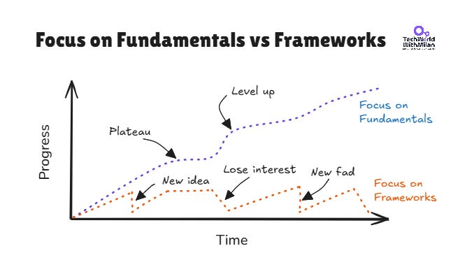](https://substackcdn.com/image/fetch/$s_!EcK1!,f_auto,q_auto:good,fl_progressive:steep/https%3A%2F%2Fsubstack-post-media.s3.amazonaws.com%2Fpublic%2Fimages%2F014efd3c-5c09-4a76-94c5-cee645393e44_668x382.png)When focus is on fundamentals vs when focus is on frameworks

## 4. Meet the Expert Generalist

Every great advance in program development has followed the same pattern. Early assembly-language programmers were told that the existence of compilers would leave them behind. Instead, it enabled them to develop at a much higher level of abstraction. The operations engineer was told that cloud computing would put their profession out of business. Instead, it has enabled an explosion of new projects, companies, and engineering jobs.

​This is the same with AI. **Lowering barriers to entry doesn’t eliminate the need for skills; it increases it.** As AI does more and more of the code, inevitably, there is less and less of the hard work left for humans: “understanding systems, making architectural decisions, making trade-offs, and expressing intent.”

This is well explained by **[the Jevons Paradox](https://en.wikipedia.org/wiki/Jevons_paradox)**. In 1865, economist William Jevons had observed something interesting: as steam engines became more efficient at burning coal, coal consumption went up, not down. Why? Efficiency unlocked new use cases. Suddenly, coal made economic sense for industries that had been unable to afford it before.

This effect is now showing in tech. As the costs of AI tokens dropped 10x, usage went up 100x. Companies now use more tokens per task because they can afford higher accuracy.

[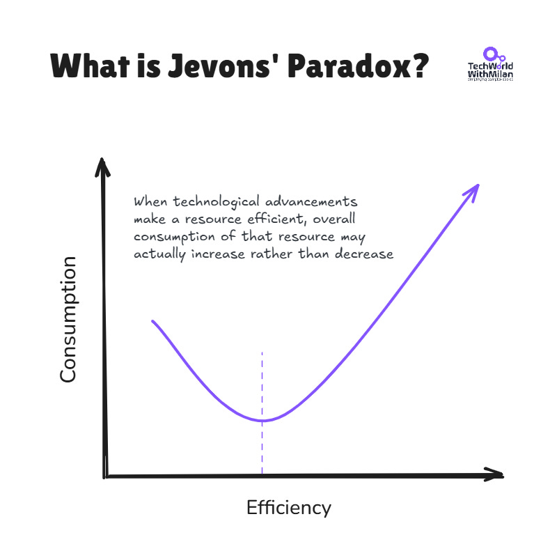](https://substackcdn.com/image/fetch/$s_!hGcy!,f_auto,q_auto:good,fl_progressive:steep/https%3A%2F%2Fsubstack-post-media.s3.amazonaws.com%2Fpublic%2Fimages%2Fe0dff7e2-e496-4a98-b5dd-d927fc6fe69e_790x791.png)The Jevons’ Paradox

As Renaissance scholars pioneered the integration of the arts, sciences, and engineering, developers who excel in this AI-enhanced world must reinvent themselves as polymaths, as Werner Vogels notes in his article “[The Dawn of the Renaissance Developer](https://thekernel.news/articles/dawn-of-the-renais)”. They realize that systems are living, dynamic environments that constantly change, affecting services, APIs, databases, infrastructure, and human interactions. They are masters of what they produce, in terms of quality, safety, and intent. They are also knowledgeable in areas where AI cannot assist.

That said, we need to become **Expert Generalists** by improving our curiosity, systems thinking, systems design, architecture, communication skills, ownership, business acumen, and more. Also, we need to become good at code verification and review, because when AI makes mistakes, we need to know how to handle them.

The “expert generalist” might be thought of as an engineer who can walk into a messy new problem, quickly understand the system, identify the right levers, and solve it without hand-holding, weeks later. Not a jack-of-all-trades, but a high-agency connector with depth in all the important areas.

[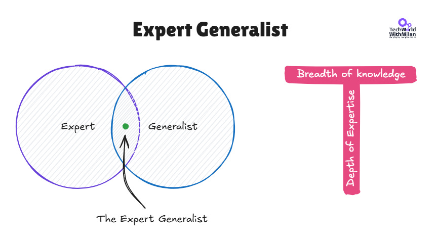](https://substackcdn.com/image/fetch/$s_!Or5G!,f_auto,q_auto:good,fl_progressive:steep/https%3A%2F%2Fsubstack-post-media.s3.amazonaws.com%2Fpublic%2Fimages%2F51fe41fb-153a-459f-bd11-f5348cf7571f_861x487.png)The Expert Generalist

## 5. The 80/20 Rule of Learning

So, how do you schedule your learning time to accomplish this? Well, there is a powerful heuristic to consider: 80 percent of your learning time should be spent on fundamental topics, and 20 percent on frameworks, libraries, and tools.

Why? Well, because you’ll probably end up learning all those frameworks on the job, dealing with real-world problems. Nobody will teach you patterns for distributed computing, clean code, and good system design on the job. That’s all on you.

[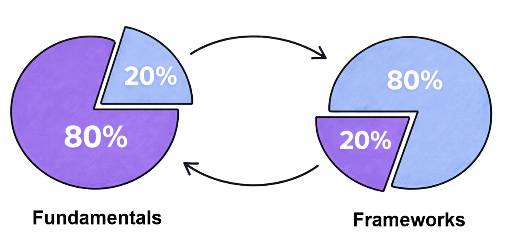](https://substackcdn.com/image/fetch/$s_!gJL8!,f_auto,q_auto:good,fl_progressive:steep/https%3A%2F%2Fsubstack-post-media.s3.amazonaws.com%2Fpublic%2Fimages%2F08ab24aa-b42b-4d4d-8f60-5198860ee0ed_1283x621.png)80% of the time to learn fundamentals, 20% for frameworks (following the Pareto Principle)

When you start to learn something, think about how the **Lindy Effect** affects it. This effect states that the longer something has been in use, the more likely it is to continue being used. C, SQL, HTTP, and REST are decades old, but still everywhere. That hot new framework will probably be gone in two years. So don't rush to learn every new tool.

Remember, time is your best filter. **Invest in fundamentals that transfer across jobs, teams, and domains**. Let the hype settle. What survives is worth learning.

[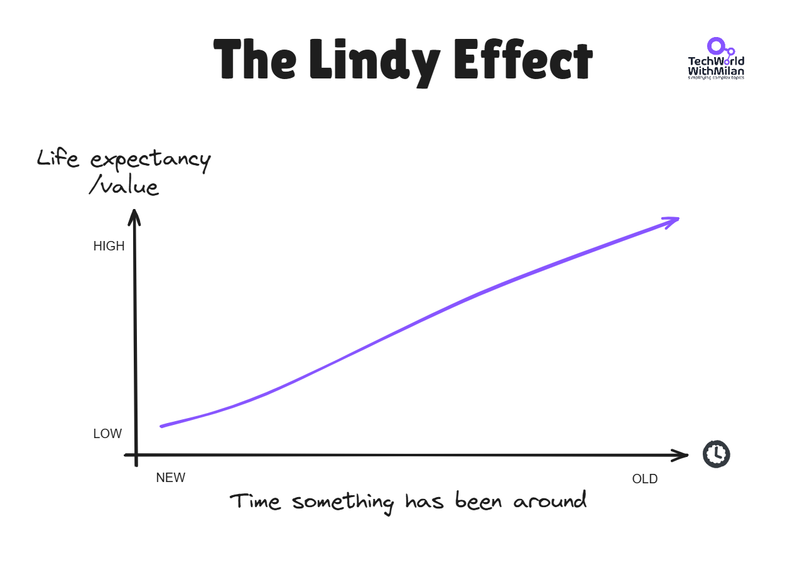](https://substackcdn.com/image/fetch/$s_!UOUP!,f_auto,q_auto:good,fl_progressive:steep/https%3A%2F%2Fsubstack-post-media.s3.amazonaws.com%2Fpublic%2Fimages%2F140fad01-a534-49c9-ad07-e8f7579026d3_1285x897.png)The Lindy Effect

So, when talking about the fundamentals, these are the basics that are worth your time reading about:

- **Algorithms**. The fundamentals of problem-solving. One should always be aware of time and space complexity when making trade-offs, whether or not you are coding a sorting algorithm.
- **Data Structures**. Understanding when to use a hash map, a tree, a queue, etc., is like the difference between writing code that works and writing code that works well.
- **Software Design & Architecture**. Patterns such as MVC, microservices versus monoliths, SOLID principles, and clean, modular code guide how to organize a system. A developer who can design clean abstractions and APIs can adopt any framework, since good design logic doesn’t change.
- **Design Patterns**. Frameworks come and go, but patterns like Observer, Strategy, and Factory seem ubiquitous. Once you recognize these, they seem to pervade all frameworks.
- **Distributed Computing Patterns**. In the age of Microservices and Cloud Native Applications, knowledge of the CAP Theorem, Eventual Consistency, and Fault Tolerance is vital.
- **Testing**. Knowing the ins and outs of writing good tests, the concept of test pyramids, and TDD gives you the courage to refactor and change code without fear.
- **System Design**. Arguably, the biggest value of this skill, and one that cannot be understated, begins at the senior level and beyond.
- **Clean Code**. Writing code that other humans (and future you) can understand. That skill is what compounds most over a career.

If you’re really serious about investing in fundamentals, the following books have stood the test of time and will continue to do so:

- **[The Pragmatic Programmer](https://amzn.to/4rBxtRp)** by David Thomas and Andrew Hunt is the classic guide to craftsmanship in software development. It’s about thinking about how to construct software, not just about writing it.
- **[Code Complete 2](https://amzn.to/45V26ZU)** by Steve McConnell: The bible of software construction. Pretty dense but very practical and applicable for any language and stack.
- **[Designing Data-Intensive Applications](https://amzn.to/4ajYqlU)** by Martin Kleppmann. It explains how distributed systems work, covering storage engines, replication, partitioning, transactions, and consistency models. Here you can learn why your database behaves the way it does and how to build systems that scale without falling apart. Check [my detailed review of the book](https://newsletter.techworld-with-milan.com/p/what-i-learned-from-the-book-designing).
- **[Design Patterns: Elements of Reusable Object-Oriented Software by the Gang of Four](https://amzn.to/4r5JajH)**. The original patterns book. Some patterns have fallen out of favor, but understanding them gives you a vocabulary for discussing design across any team or technology.
- **[Introduction to Algorithms](https://amzn.to/4a2DxN5)** by Cormen, Leiserson, Rivest, and Stein (CLRS)- The bible of algorithms. You don’t have to read it cover to cover, but it is worth keeping on your shelf and referring to it regularly.
- **[Clean Code](https://amzn.to/4kGM2kN)** by Robert C. Martin. Opinionated and sometimes controversial, but its core message about writing readable, maintainable code is universal.

[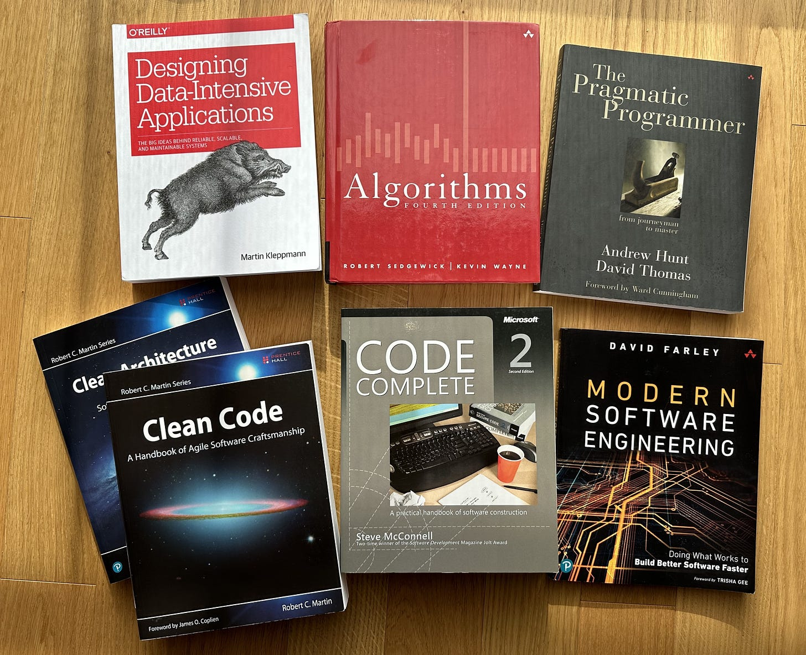](https://substackcdn.com/image/fetch/$s_!H07p!,f_auto,q_auto:good,fl_progressive:steep/https%3A%2F%2Fsubstack-post-media.s3.amazonaws.com%2Fpublic%2Fimages%2Fc16cb4c1-862b-49ab-b3f1-73b9ce6c2c36_3528x2871.jpeg)

Check my full book recommendations for the books that learn you fundamentals:
[
Tech World With Milan NewsletterLearn things that don't change Have you ever wondered why some technologies are still around, and some have disappeared? The Lindy effect tells me developers will still use C# and SQL when I retire. This concept in technology and innovation suggests that the future life expectancy of a non-perishable item is proportional to its current age. In other words…Read more2 years ago · 1127 likes · 24 comments · Dr Milan Milanović](https://newsletter.techworld-with-milan.com/p/learn-things-that-dont-change?utm_source=substack&utm_campaign=post_embed&utm_medium=web)
As well as my short book on **[100+ books that changed my life](https://newsletter.techworld-with-milan.com/p/100-books-that-changed-my-life)**.

## 6. Conclusion

The next time you feel tempted to spend your weekend learning the latest “hot” framework, take a step back and ask yourself: Will this be relevant in five years’ time?

Of course, frameworks come and go, and JavaScript has an overfilled graveyard of them. AI is churning out code by the minute, and while some developers are limited to programming strictly within the rules of their specific framework, they will soon be passed by. Not by AI, but by other developers who grasp what is actually happening under the hood.

Learn your frameworks, as it’s necessary to ship. But the actual meat should be the fundamentals. That’s all that carries across companies, teams, and over the decades. And they don’t expire.” **In an age when AI writes code for you, fundamentals are the only things that make you adaptable and resilient.**

Remember, frameworks will come and go, but the underlying principles of good design will always stay. Focus on fundamentals. They don't expire, and they make learning new tools much easier.

---

## Bonus: The Missing Semester of Your CS Education by MIT

Check this free course at MIT called “[The Missing Semester of Your CS Education](https://missing.csail.mit.edu/)” that covers topics no one ever tells you about: the shell, Git, debugging, profiling, continuous integration, and setting up a development environment.

The kind of skills that people use every single day, and that they had to figure out on their own.

All lectures are available online and have video recordings. It has been translated into 14 language varieties, including Serbian.

Worth bookmarking, whether you’re a junior dev or a senior engineer looking to fill in the gaps.

[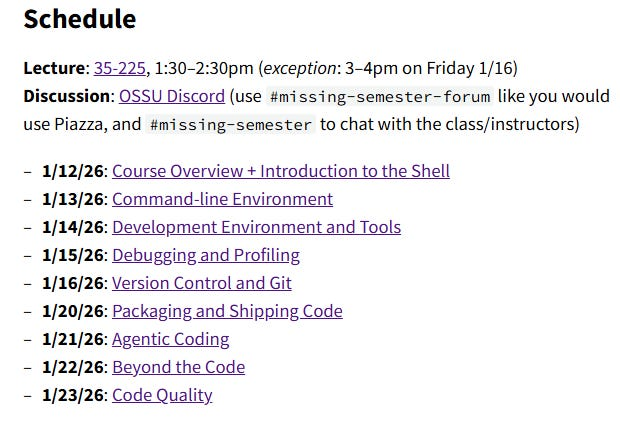](https://missing.csail.mit.edu/)

[The Missing Semester](https://missing.csail.mit.edu/)

---

## **More ways I can help you**

- **[📱 You Can Build A LinkedIn Audience](https://www.patreon.com/posts/you-can-build-143858069?source=storefront)** 🆕. The system I used to grow from 0 to 260K+ followers in under two years, plus a 49K-subscriber newsletter. You’ll transform your profile into a page that converts, write posts that get saved and shared, and turn LinkedIn into a steady source of job offers, clients, and speaking invites. Includes 6-module video course (~2 hours), LinkedIn Content OS with 50 post ideas, swipe files, and a 30-page guide. **[Join 300+ people](https://www.patreon.com/posts/you-can-build-143858069?source=storefront)**.
- [📚](https://www.patreon.com/techworld_with_milan/shop/ultimate-net-bundle-for-2025-1519389?utm_medium=clipboard_copy&utm_source=copyLink&utm_campaign=productshare_creator&utm_content=join_link)**[The Ultimate .NET Bundle 2025](https://www.patreon.com/techworld_with_milan/shop/ultimate-net-bundle-for-2025-1519389?utm_medium=clipboard_copy&utm_source=copyLink&utm_campaign=productshare_creator&utm_content=join_link)**. 500+ pages distilled from 30 real projects show you how to own modern C#, ASP.NET Core, patterns, and the whole .NET ecosystem. You also get 200+ interview Q&As, a C# cheat sheet, and bonus guides on middleware and best practices to improve your career and land new .NET roles. **[Join 1,000+ engineers](https://www.patreon.com/techworld_with_milan/shop/ultimate-net-bundle-for-2025-1519389?utm_medium=clipboard_copy&utm_source=copyLink&utm_campaign=productshare_creator&utm_content=join_link)**.
- [📦](https://www.patreon.com/techworld_with_milan/shop/premium-resume-package-1721454?utm_medium=clipboard_copy&utm_source=copyLink&utm_campaign=productshare_creator&utm_content=join_link)**[Premium resume package](https://www.patreon.com/techworld_with_milan/shop/premium-resume-package-1721454?utm_medium=clipboard_copy&utm_source=copyLink&utm_campaign=productshare_creator&utm_content=join_link)**. Built from over 300 interviews, this system enables you to quickly and efficiently craft a clear, job-ready resume. You get ATS-friendly templates (summary, project-based, and more), a cover letter, AI prompts, and bonus guides on writing resumes and prepping LinkedIn. **[Join 500+ people](https://www.patreon.com/techworld_with_milan/shop/premium-resume-package-1721454?utm_medium=clipboard_copy&utm_source=copyLink&utm_campaign=productshare_creator&utm_content=join_link)**.
- [📄](https://www.patreon.com/techworld_with_milan/shop/complete-tech-resume-reality-check-311008?utm_medium=clipboard_copy&utm_source=copyLink&utm_campaign=productshare_creator&utm_content=join_link)**[Resume reality check](https://www.patreon.com/techworld_with_milan/shop/complete-tech-resume-reality-check-311008?utm_medium=clipboard_copy&utm_source=copyLink&utm_campaign=productshare_creator&utm_content=join_link)**. Get a CTO-level teardown of your CV and LinkedIn profile. I flag what stands out, fix what drags, and show you how hiring managers judge you in 30 seconds. **[Join 100+ people](https://www.patreon.com/techworld_with_milan/shop/complete-tech-resume-reality-check-311008?utm_medium=clipboard_copy&utm_source=copyLink&utm_campaign=productshare_creator&utm_content=join_link)**.
- [✨](https://www.patreon.com/c/techworld_with_milan)**[Join My Patreon](https://www.patreon.com/c/techworld_with_milan)**[https://www.patreon.com/c/techworld_with_milan](https://www.patreon.com/c/techworld_with_milan)**[community](https://www.patreon.com/c/techworld_with_milan) and [my shop](https://www.patreon.com/c/techworld_with_milan/shop)**. Unlock every book, template, and future drop, plus early access, behind-the-scenes notes, and priority requests. Your support enables me to continue writing in-depth articles at no cost. **[Join 2,000+ insiders](https://www.patreon.com/c/techworld_with_milan)**.
- [🤝](https://newsletter.techworld-with-milan.com/p/coaching-services)**[1:1 Coaching](https://newsletter.techworld-with-milan.com/p/coaching-services)**. Book a focused session to crush your biggest engineering or leadership roadblock. I’ll map next steps, share battle-tested playbooks, and hold you accountable. **[Join 100+ coachees](https://newsletter.techworld-with-milan.com/p/coaching-services)**.

---

## **Want to advertise in Tech World With Milan? 📰**

If your company is interested in reaching founders, executives, and decision-makers, you may want to **[consider advertising with us](https://newsletter.techworld-with-milan.com/p/sponsorship-of-tech-world-with-milan)**.

---

## **Love Tech World With Milan Newsletter? Tell your friends and get rewards.**

We are now close to **50k subscribers** (thank you!). Share it with your friends by using the button below to get benefits (my books and resources).

[Share Tech World With Milan Newsletter](https://newsletter.techworld-with-milan.com/?utm_source=substack&utm_medium=email&utm_content=share&action=share)

[Track your referrals here](https://newsletter.techworld-with-milan.com/leaderboard).