# Learn things that don't change

*And take a look into books I recommend you to read in 2024. (34 books)*

Have you ever wondered why some technologies are still around, and some have disappeared? **The Lindy effect** tells me developers will still use C# and SQL when I retire. This concept in technology and innovation suggests that the future life expectancy of a non-perishable item is proportional to its current age. In other words, **the longer something has been in use, the longer it is likely to continue to be used**.

The concept was named after Lindy's Deli in New York City, where Nassim Nicholas Taleb popularized it in his book **[The Black Swan](https://amzn.to/4bBaXjY)**. According to Taleb, the Lindy effect evaluates the potential longevity of many things, including technologies, ideas, and cultures.

[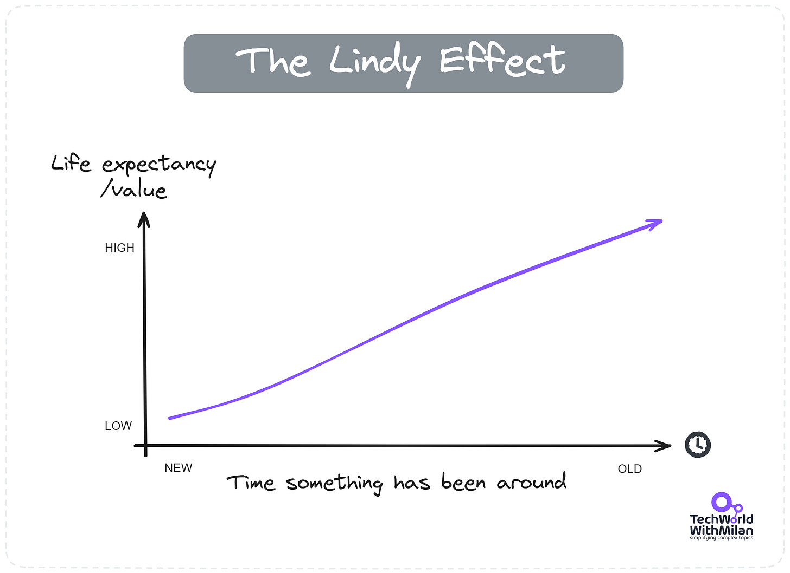](https://substackcdn.com/image/fetch/$s_!mFTP!,f_auto,q_auto:good,fl_progressive:steep/https%3A%2F%2Fsubstack-post-media.s3.amazonaws.com%2Fpublic%2Fimages%2Fb4200788-ed0b-4108-98b8-90f9e8a910fc_2643x1920.png)The Lindy Effect

We developers like to learn new stuff as soon as possible. That stuff consists mainly of new frameworks and tools (such as React, Angular, Spring, Web Forms, etc.). Yet, those frameworks usually have a short life, 2 to 5 years at their best. Instead of learning frameworks, which are needed to some extent,**we should focus more on learning fundamentals**.

Learning software development fundamentals allows developers to **understand the underlying principles and concepts** common across different frameworks and programming languages. This understanding allows for more flexibility and adaptability when working with new technologies or facing problems that a specific framework may take time to solve.

Additionally, a strong understanding of the fundamentals can **lead to more efficient and effective use of frameworks**, as the developer can better understand how to customize and extend them to meet specific needs.

Take **an example of a web application** that allows users to upload and share images, which is done, e.g., in Ruby on Rails and its functionalities for image processing. If the number of users increases, we could only work with performance issues if we know the framework well. Yet, if we understand the fundamentals of web development, we could identify bottlenecks and try different solutions, such as using CDN-s, optimizing image sizes, using various storage solutions, etc.

So, **which fundamentals do you learn**? Here are some:

- **Algorithms**
- **Data**
- **Clean Code**
- **SOLID Principles**
- **OO Programming**
- **Design Patterns**
- **Distributed Computing**
- **System Design**
- **And more.**

Try to learn those fundamentals by reading these books in the next section.

All the energy I put into learning those technologies 10-15 years ago continues to support my work today. Some things changed, but the fundamentals stayed the same and even improved.

So, try to **learn things that don’t change** (quote from Jeff Bezos). Focus on foundations, not frameworks. I've been doing this for two decades now.

---

## Books Every Software Engineer Must Read in 2024.

Last year, I wrote [a list of books](https://newsletter.techworld-with-milan.com/p/books-every-software-engineer-must) every developer needs to read. This year, I updated the list with new titles that I found interesting and important in different categories.

[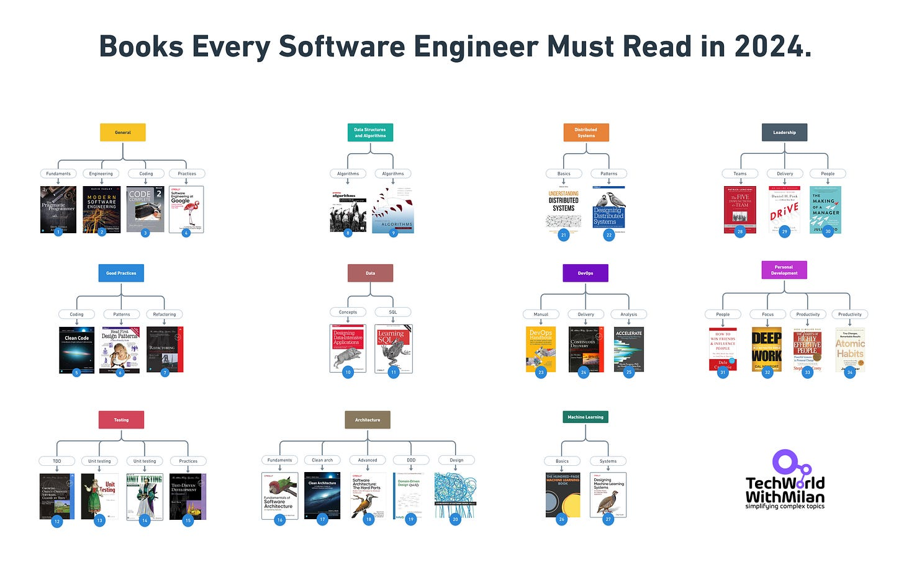](https://substackcdn.com/image/fetch/$s_!9N1A!,f_auto,q_auto:good,fl_progressive:steep/https%3A%2F%2Fsubstack-post-media.s3.amazonaws.com%2Fpublic%2Fimages%2Fcba05c59-8949-4114-a17d-3f7f8d482a67_7176x4464.png)Books to read in 2024. Infographics

Here is the list, separated by sections:

### General

**1. [The Pragmatic Programmer](https://www.amazon.com/Pragmatic-Programmer-journey-mastery-Anniversary/dp/0135957052?crid=KJ9J5I3C18P1&keywords=The+Pragmatic+Programmer&qid=1677334440&s=books&sprefix=the+pragmatic+programmer+,stripbooks-intl-ship,249&sr=1-1&linkCode=sl1&tag=milanmilanovi-20&linkId=cb719f22c07be4dc51294d6a5852a3f0&language=en_US&ref_=as_li_ss_tl)** by David Thomas and Andrew Hunt.

This book provides technical and professional practical advice for developers. It examines what it means to be a modern developer, covering topics ranging from personal responsibility and career development to architectural techniques. Although it was written in 1999, it remains valid in many aspects. The unique aspect of this book is that it teaches you pragmatically, offering a collection of tips to enhance the development process.

➡️ I wrote about the book **[here](https://www.linkedin.com/posts/milanmilanovic_technology-softwareengineering-programming-activity-7134133621166067712-_bGy?utm_source=share&utm_medium=member_desktop)**.

[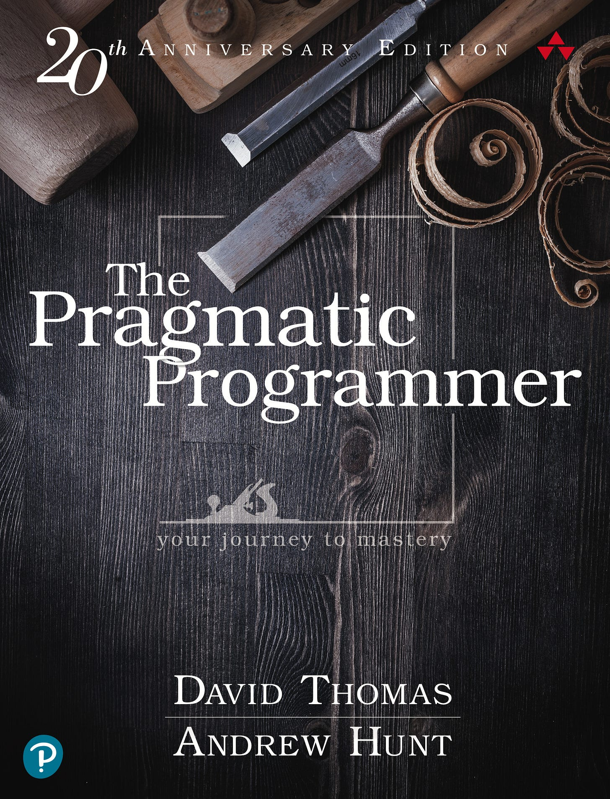](https://www.amazon.com/Pragmatic-Programmer-journey-mastery-Anniversary/dp/0135957052?crid=KJ9J5I3C18P1&keywords=The+Pragmatic+Programmer&qid=1677334440&s=books&sprefix=the+pragmatic+programmer+,stripbooks-intl-ship,249&sr=1-1&linkCode=sl1&tag=milanmilanovi-20&linkId=cb719f22c07be4dc51294d6a5852a3f0&language=en_US&ref_=as_li_ss_tlhttps://www.amazon.com/Pragmatic-Programmer-journey-mastery-Anniversary/dp/0135957052?crid=KJ9J5I3C18P1&keywords=The+Pragmatic+Programmer&qid=1677334440&s=books&sprefix=the+pragmatic+programmer+,stripbooks-intl-ship,249&sr=1-1&linkCode=sl1&tag=milanmilanovi-20&linkId=cb719f22c07be4dc51294d6a5852a3f0&language=en_US&ref_=as_li_ss_tl)

**2. [Modern Software Engineering](https://amzn.to/3kqZaQ6)** by David Farley

This book focuses on building great software, offering a solid framework to connect good practices such as Continuous Delivery (CD), Hexagonal Architecture, and Test-Driven Development with the main ideas in software engineering. He also writes about the history of software development and the ideas that have changed the industry.

[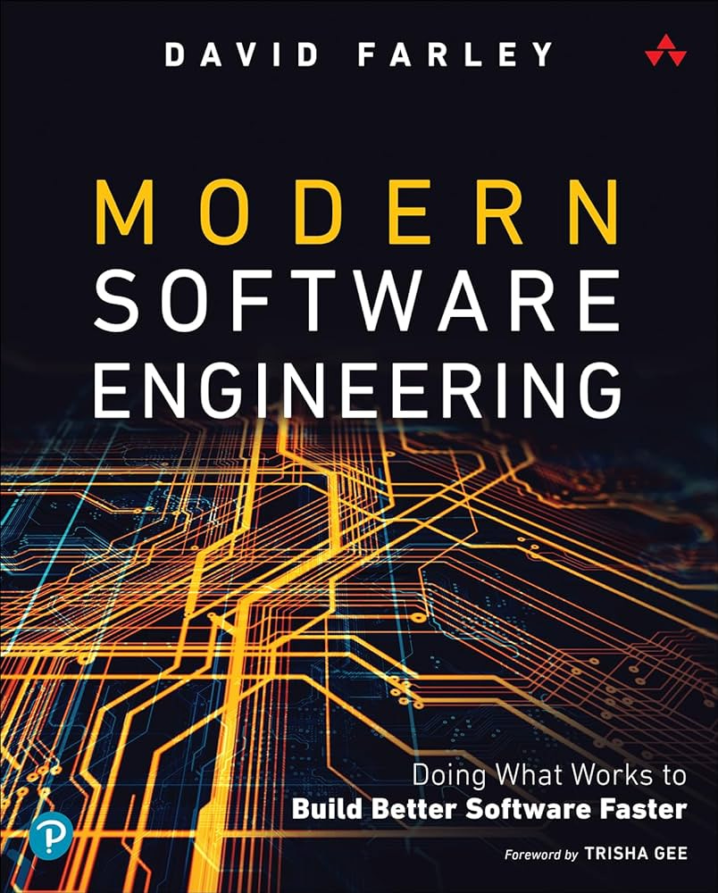](https://amzn.to/3kqZaQ6)

**3. [Code Complete: A Practical Handbook of Software Construction](https://amzn.to/3wH6FZf)**by Steve McConnell

Again, one of the books written more than 15 years ago is still valid today. It deals with design, coding, debugging, and testing. In more than 900 pages, the authors describe how to write programs for people first and then for computers second, how to divide your code into domains, and how to master the human qualities of top coders (humility, curiosity, and, most importantly, keeping your ego in check).

[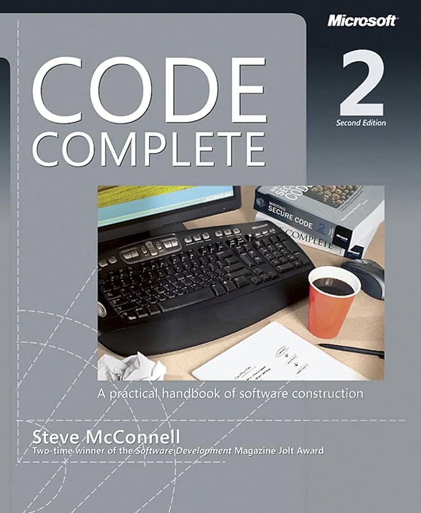](https://amzn.to/3UEQTWJ)

**4. [Software Engineering at Google](https://abseil.io/resources/swe-book)** - by Titus Winters, Tom Manshreck, and Hyrum Wright (Free Ebook)

The Software Engineering at Google book is not about programming, per se, but about the engineering practices employed at Google to maintain a sustainable and healthy codebase. In this book, you will learn the difference between software engineering and programming, why the Beyonce rule is essential, and how to shift left and properly test things. Additionally, you will learn why they are small and often downplay their importance.

➡️ I wrote about the book **[here](https://www.linkedin.com/posts/milanmilanovic_softwareengineering-programming-learning-activity-7138844709589860352-cXIX?utm_source=share&utm_medium=member_desktop)**.

[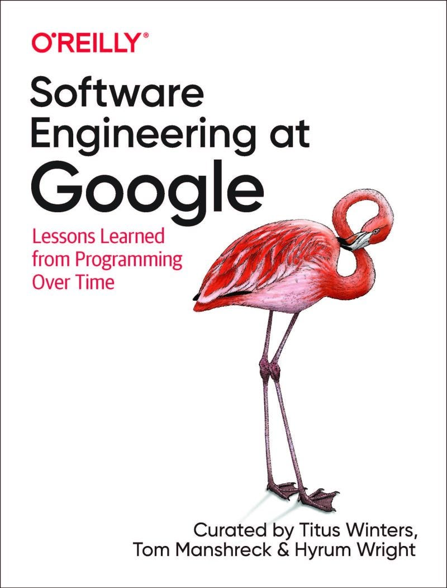](https://substackcdn.com/image/fetch/$s_!NYWG!,f_auto,q_auto:good,fl_progressive:steep/https%3A%2F%2Fsubstack-post-media.s3.amazonaws.com%2Fpublic%2Fimages%2F5fea5722-09a6-4474-b1fb-541256e4574b_800x1050.jpeg)

### Good Practices

**5. [Clean Code](https://amzn.to/3KyVoyV)** by Uncle Bob Martin.

It is one of the most excellent software development books ever. It was written to teach software engineers the principles of writing clean programming code. The book contains numerous examples illustrating how to refactor code for improved readability and maintainability. In addition, it includes chapters on common mistakes made by all types of programmers and chapters that explain the SOLID principles of object-oriented design.

[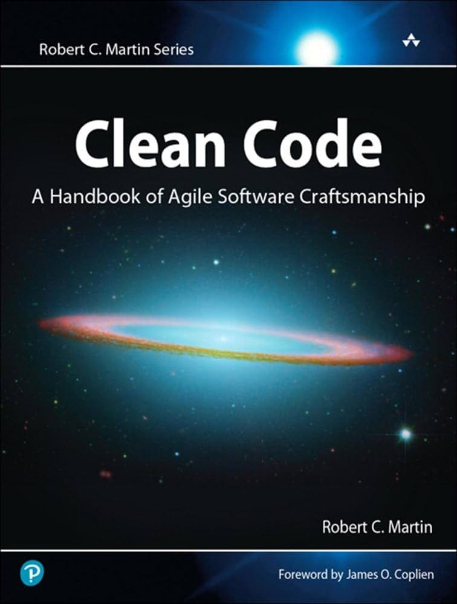](https://substackcdn.com/image/fetch/$s_!ulqT!,f_auto,q_auto:good,fl_progressive:steep/https%3A%2F%2Fsubstack-post-media.s3.amazonaws.com%2Fpublic%2Fimages%2F3316a096-df0a-4cc3-8427-24360a183bf5_756x1000.jpeg)

> *I recently gave a presentation on Clean Code development. You can look it up **[here](https://www.youtube.com/watch?v=Px80v8xLCrg&t=2s)**.*

**6. [Head First Design Patterns](https://amzn.to/3Kzq2YX)** by Eric Freeman.

The book describes the leading software design patterns for creating more flexible, elegant, and reusable designs without rediscovering design solutions. It is written in a similar style to the For Dummies series of books, making it easy for beginners to understand.

[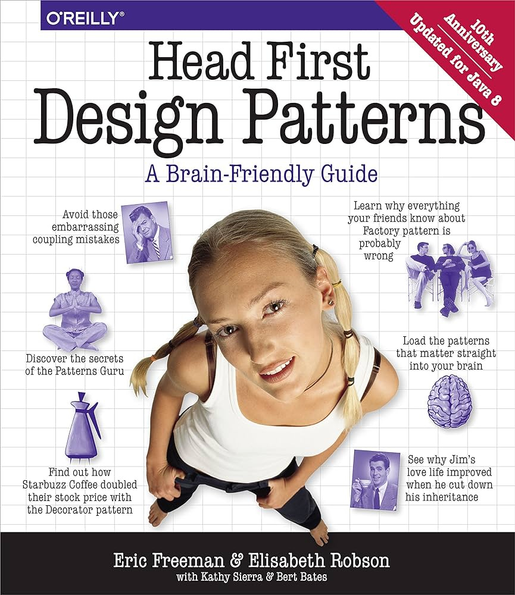](https://amzn.to/3Kzq2YX)

> ➡️*Take a look at my book “**[Design Patterns in Use](https://www.patreon.com/techworld_with_milan/shop/312304)**.”*

**7. [Refactoring](https://amzn.to/3m8bAgo)**by Martin Fowler.

In this book, Martin Fowler discusses ways to improve the design of existing code. Refactoring is the process of changing a software system that does not alter the code’s external behavior but improves its internal structure. In the 2nd edition of the book, Martin used JavaScript instead of Java, which was used in the 1st edition.

[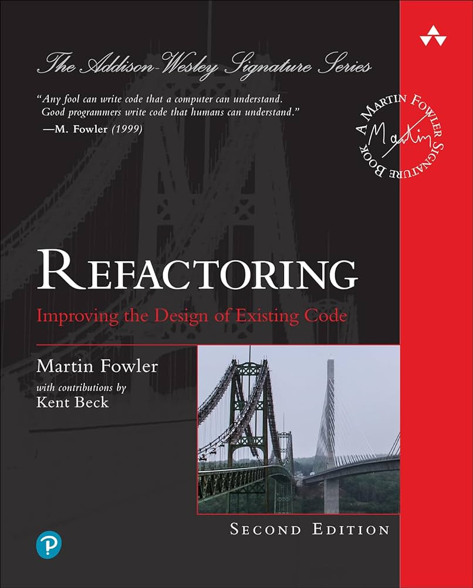](https://amzn.to/3m8bAgo)

### Data Structures and Algorithms

**8. [Grokking Algorithms](https://amzn.to/3ksUw4e)** by Aditya Bhargava.

It is an easy-to-understand book on applying standard algorithms to developers' daily practical problems. It begins with sorting and searching, then proceeds to data compression and artificial intelligence, accompanied by code samples in Python. Probably the best book to start your algorithm journey with.

[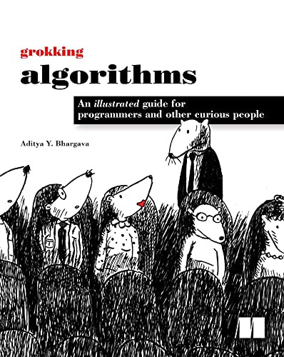](https://amzn.to/3ksUw4e)

**9. [Introduction to Algorithms](https://www.amazon.com/Introduction-Algorithms-fourth-Thomas-Cormen/dp/026204630X?crid=1LM7G3X1ECXIE&keywords=introduction+to+algorithms&qid=1675253683&s=books&sprefix=introduction+to+algorithms,stripbooks-intl-ship,185&sr=1-1&linkCode=sl1&tag=milanmilanovi-20&linkId=0bea5fe0ded3765ad9fa191e2528f539&language=en_US&ref_=as_li_ss_tl)**, by Thomas H. Cormen, Charles E. Leiserson, Ronald L. Rivest, Clifford Stein

It is one of the most famous books on in-depth algorithms (CLRS). It represents a comprehensive guide for all readers, from beginners to professionals. Each chapter is relatively self-contained and can be used as a unit of study. Algorithms are described in English and pseudocode, making them familiar even to someone who hasn’t done much coding.

[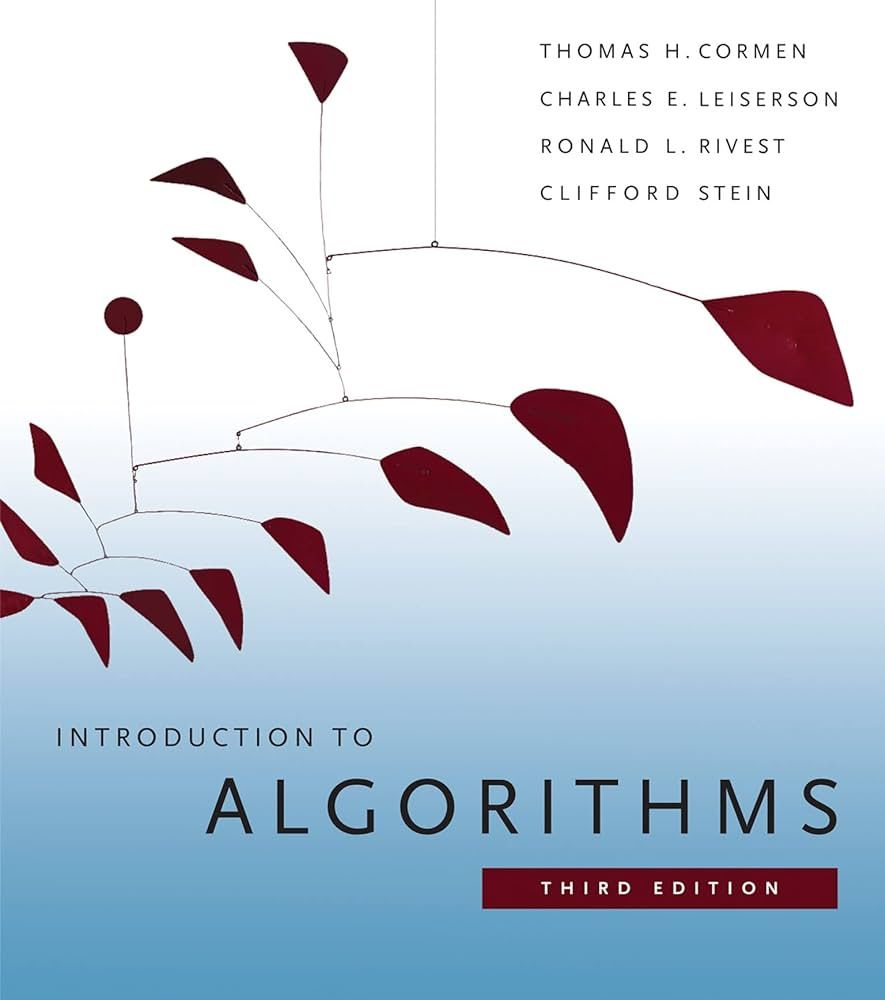](https://www.amazon.com/Introduction-Algorithms-fourth-Thomas-Cormen/dp/026204630X?crid=1LM7G3X1ECXIE&keywords=introduction+to+algorithms&qid=1675253683&s=books&sprefix=introduction+to+algorithms,stripbooks-intl-ship,185&sr=1-1&linkCode=sl1&tag=milanmilanovi-20&linkId=0bea5fe0ded3765ad9fa191e2528f539&language=en_US&ref_=as_li_ss_tl)

### Data

**10. [Designing Data-Intensive Applications](https://amzn.to/41uO65o)** by Martin Kleppman

The book describes advanced data concepts, including databases and data models, and provides a deep dive into distributed concepts, such as transactions, replication, and consistency. It is one of the most influential books in this category.

➡️ Read **[my review](https://newsletter.techworld-with-milan.com/p/what-i-learned-from-the-book-designing)** of the book.

[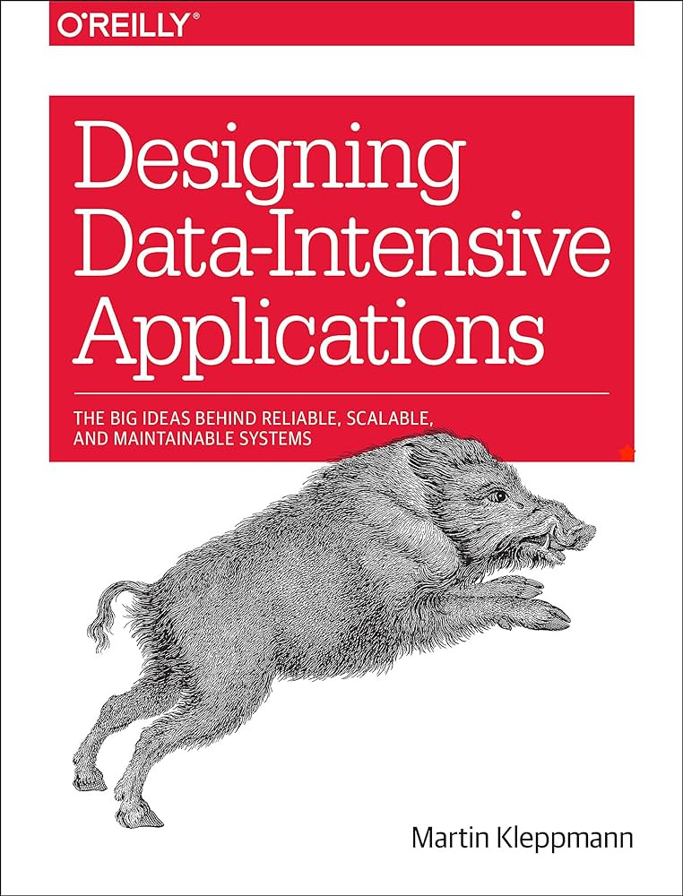](https://amzn.to/41uO65o)

**11. [Learning SQL](http://www.r-5.org/files/books/computers/languages/sql/mysql/Alan_Beaulieu-Learning_SQL-EN.pdf)** by Alan Beaulieu (Free Ebook)

This introduction to SQL will get you started quickly. The book will help you quickly understand all the essential SQL concepts, whether you need to create database applications, perform administrative tasks, or generate reports.

[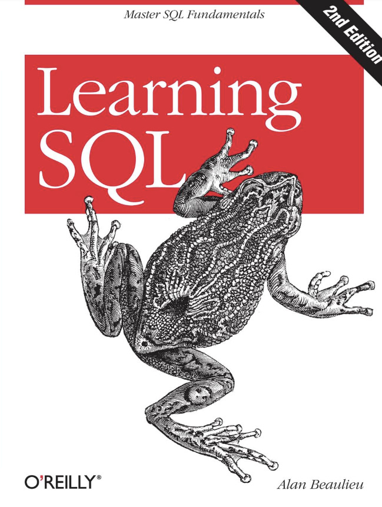](http://www.r-5.org/files/books/computers/languages/sql/mysql/Alan_Beaulieu-Learning_SQL-EN.pdf)

> *If you want to learn more about SQL, check out **[this text](https://newsletter.techworld-with-milan.com/p/how-to-learn-sql)**.*

### Testing

**12. [Growing OO Software by Tests](https://amzn.to/3xRVaeB)** by Steve Freeman.

The authors outline their procedures, design goals, and some equipment they use to complete the task. Next, you’ll understand how TDD functions on several levels through an extended worked example, utilizing tests to direct the code's features and object-oriented structure, and mock objects to identify and then define relationships between objects.

[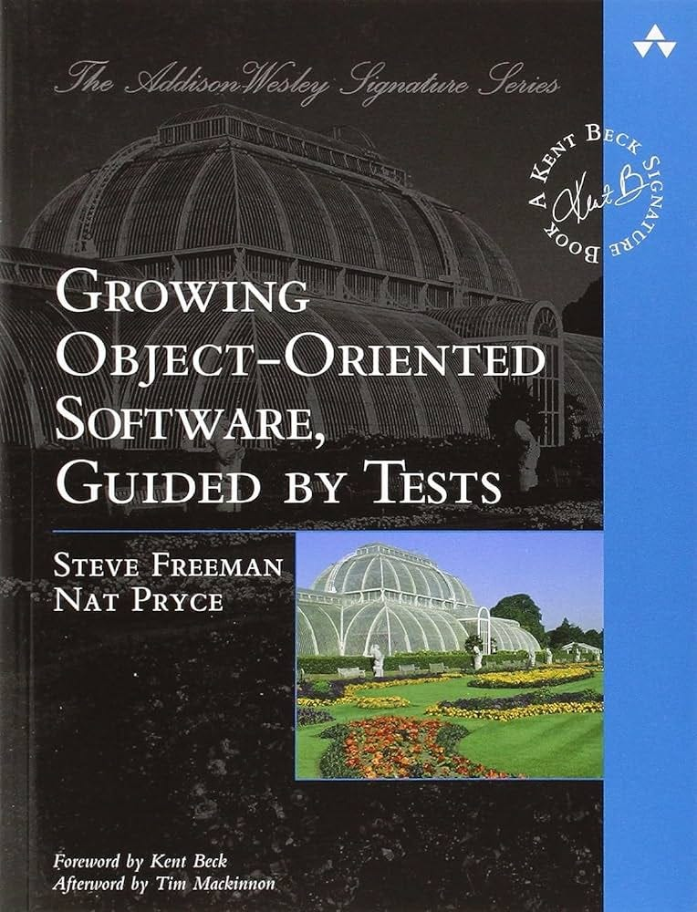](https://amzn.to/3xRVaeB)

**13. [Unit Testing Principles, Practices, and Patterns](https://amzn.to/3ZBZYAJ)** by Vladimir Khorikov.

The book demonstrates how to apply best practices to improve your unit tests. You'll learn how to identify which tests are working, which require restructuring, and which must be removed entirely.

[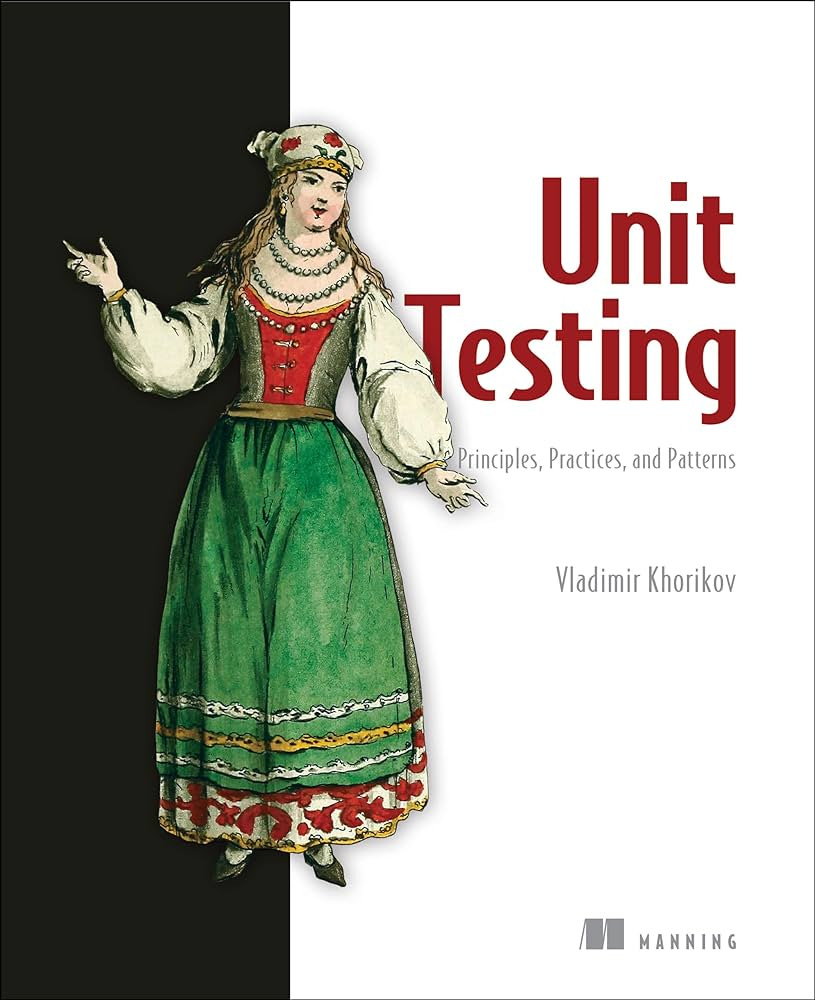](https://amzn.to/3ZBZYAJ)

**14. [The Art of Unit Testing](https://amzn.to/3kr7m2K)** by Roy Osherove.

This book focuses on unit testing, which is crucial for any developer to perform in order to deliver a high-quality piece of software. The book explains the core competencies for unit testing, how to scope it, and what to unit test.

[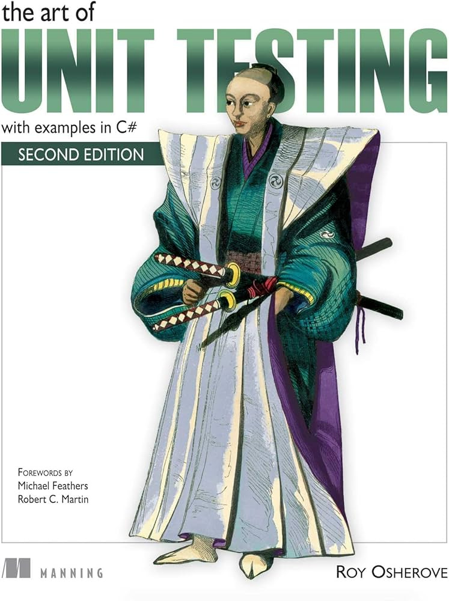](https://amzn.to/3kr7m2K)

**15. [TDD by Example](https://amzn.to/3EEHwiC)** by Kent Beck.

Test-Driven Development (TDD) is a software engineering technique that has proven effective over time. In this book, Kent Beck teaches programmers Test-Driven Development (TDD) by example.

[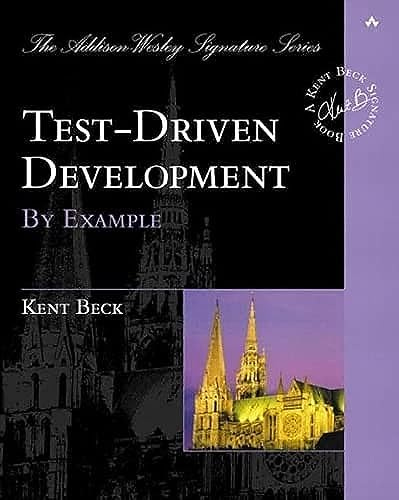](https://amzn.to/3EEHwiC)

### Software Architecture

**16. [Fundamentals Of Software Architecture](https://amzn.to/3xQ1EuD)** by Mark Richards and Neil Ford.

This book provides the first comprehensive examination of the various facets of software architecture. It covers architectural characteristics, patterns, component selection, diagramming and presenting architecture, evolutionary architecture, and many other topics for aspiring and practicing architects.

[![Fundamentals of Software Architecture: An Engineering Approach [Video]](images/3e734652-c919-4601-a4a7-582da9aa6f29_1200x630.png)](https://amzn.to/3xQ1EuD)

**17. [Clean Architecture](https://amzn.to/3ERwsPw)** by Uncle Bob Martin.

The book introduces the necessary disciplines and practices for software architects, utilizing design principles to address function, component separation, and data management. It demonstrates how to utilize various high-level structures for different types of applications and how to define appropriate boundaries and layers.

➡️ Read **[my text](https://newsletter.techworld-with-milan.com/p/what-is-clean-architecture)** on Clean architecture.

[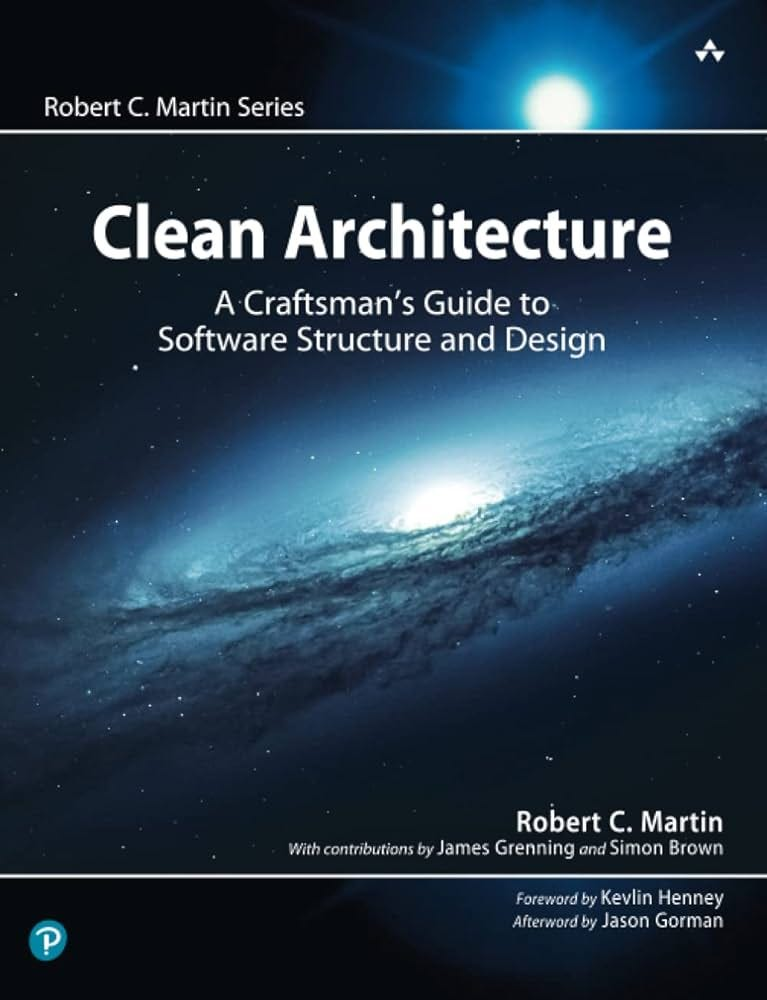](https://amzn.to/3ERwsPw)

**18. [Software Architecture The Hard Parts](https://amzn.to/3Zmg15r)** by Neal Ford, Mark Richards, Pramod Sadalage, and Zhamak Dehghani.

This book reveals how to select the proper architecture for various solutions, considering different compromises. You will learn to analyze trade-offs, document your decisions, and understand the complexities of breaking apart monolithic applications. It also shows how to handle data in a highly distributed architecture.

➡️ Read **[my review](https://newsletter.techworld-with-milan.com/p/what-i-learned-from-the-software)** of the book.

[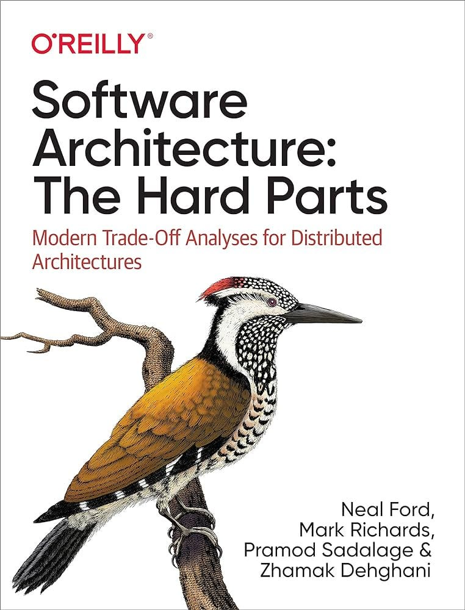](https://amzn.to/3Zmg15r)

**19. [Domain Driven Design Quickly](https://www.infoq.com/minibooks/domain-driven-design-quickly/)**by Abel Avram and Floyd Marinescu (Free Ebook).

This is probably the best book on Domain-Driven Design (DDD). It shows the DDD approach with concrete examples that build an actual project. It also explains the hexagonal architecture typically associated with Domain-Driven Design (DDD). It is a summary of Eric Evans's “**[Domain-Driven Design](https://amzn.to/3wmTPiV)**” book.

[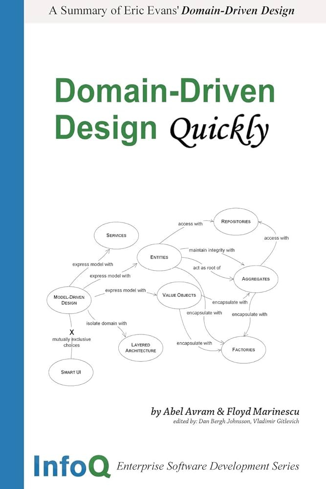](https://www.infoq.com/minibooks/domain-driven-design-quickly/)

**20. [A Philosophy of Software Design](https://amzn.to/3IopUZm)** by John Ousterhout.

This book explains how to break down complicated software systems into independently implementable pieces. Following this, it addresses philosophical concerns about approaching the software design process and provides a list of design guidelines to follow. The book also presents a list of warning signs for bad design. It is a great companion to Clean Code as it offers a different perspective.

➡️ Read **[my review](https://newsletter.techworld-with-milan.com/p/my-learnings-from-the-book-a-philosophy)** of the book.

[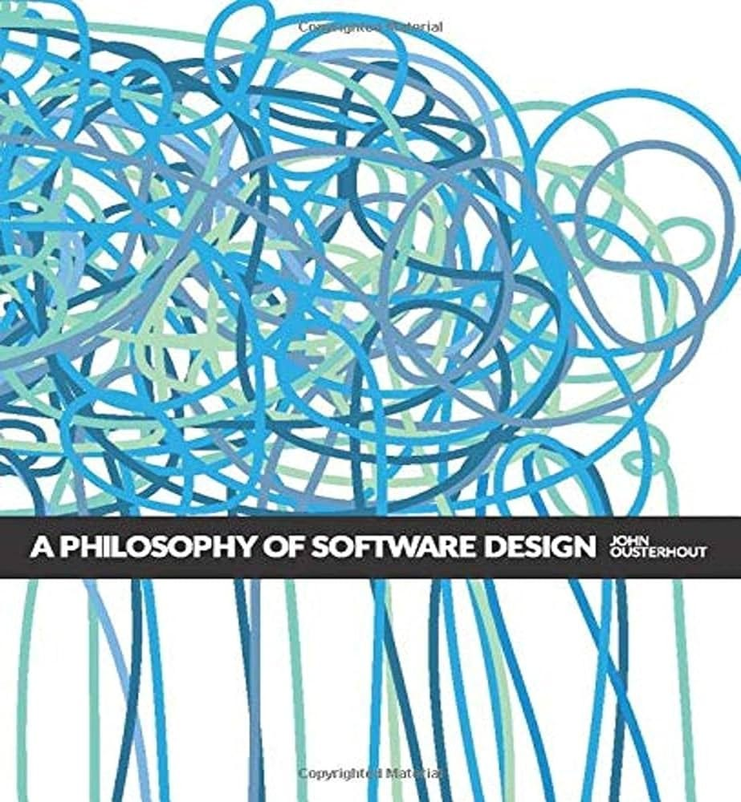](https://amzn.to/3IopUZm)

### Distributed Systems

**21. [Understanding Distributed Systems](https://amzn.to/3XZOFkG)** by Roberto Vitillo.

The book teaches the fundamentals of distributed systems. This book is a great introduction to distributed systems, covering the network stack, data consistency models, scalability and reliability patterns, and more.

[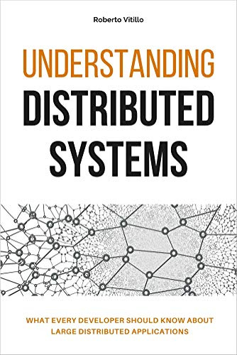](https://amzn.to/3XZOFkG)

**22. [Designing Distributed Systems](https://azure.microsoft.com/mediahandler/files/resourcefiles/designing-distributed-systems/Designing_Distributed_Systems.pdf)** by Brendan Burns (Free Ebook)

In this book, you will learn how patterns and reusable components enable the rapid development of reliable distributed systems, how to split your application into a group of containers on one machine using the sidecar, adapter, and ambassador patterns, and also to explore loosely coupled multi-node distributed patterns for replication, scaling, and communication between the components.

[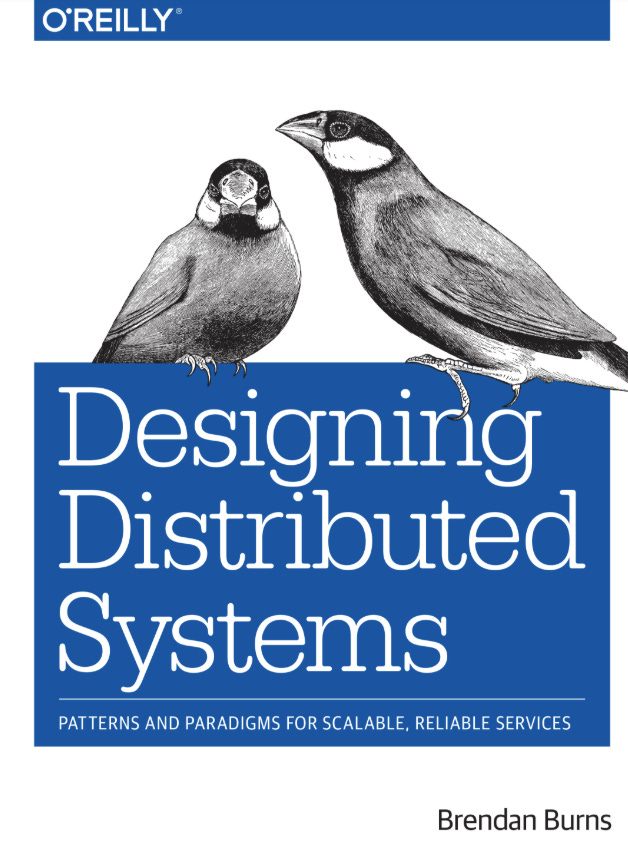](https://azure.microsoft.com/mediahandler/files/resourcefiles/designing-distributed-systems/Designing_Distributed_Systems.pdf)

### DevOps

**23. [DevOps Handbook](https://amzn.to/3m4iJ16)** by Gene Kim, Patrick Debois, John Willis, and Jez Humble.

The book is a continuation of The Phoenix Project. It attempts to define the guidelines for successful DevOps and dispel any lingering misconceptions about this subject. It is intended for everyone in the IT sector, from programmers to technology executives, and should be appealing to both seasoned practitioners and newcomers to DevOps.

[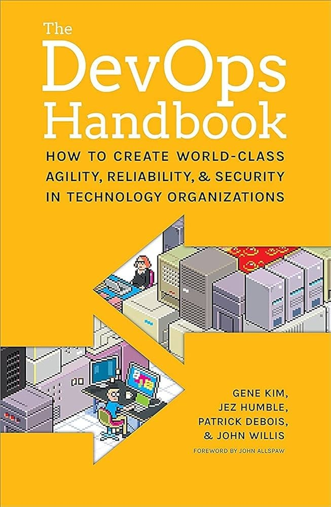](https://amzn.to/3m4iJ16)

**24. [Continuous Delivery](https://amzn.to/3ECoVUo)** by Jez Humble and David Farley.

The writers present the foundations of a quick, dependable, low-risk delivery procedure. They then introduce the "deployment pipeline," an automated mechanism for handling all changes from check-in to release. They then discuss the "ecosystem" required to support continuous delivery, including governance, infrastructure, data, and configuration management.

[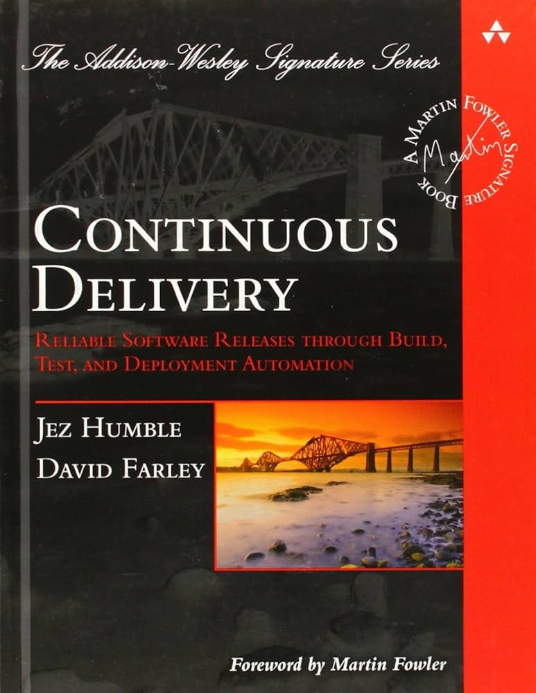](https://substackcdn.com/image/fetch/$s_!RMu_!,f_auto,q_auto:good,fl_progressive:steep/https%3A%2F%2Fsubstack-post-media.s3.amazonaws.com%2Fpublic%2Fimages%2F569ec174-1ea6-4f50-a4d0-2c32176d836f_773x1000.jpeg)

**25. [Accelerate](https://amzn.to/3StOug6)** by Nicole Forsgren, Jez Humble, and Gene Kim.

The authors examined what made successful technology organizations different from their less successful rivals. The book compiles years' worth of thorough research from State of DevOps Reports, which were based on 23,000 datasets from businesses worldwide. According to the study, four key metrics may be used to compare how organizations operate (Cycle Time, Deployment Frequency, Change Failure Rate, and Mean Time to Recovery).

[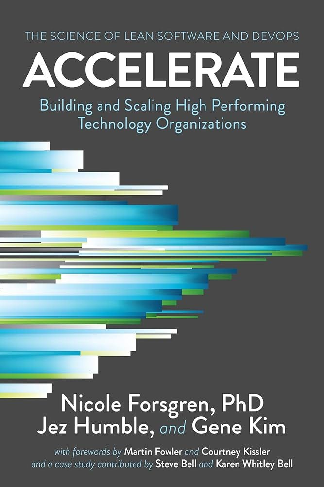](https://amzn.to/3StOug6)

> *Check more book recommendations from this category in my **[DevOps Roadmap for 2024](https://github.com/milanm/DevOps-Roadmap)**.*

### Machine Learning

**26. [The Hundred-Page Machine Learning Book](https://amzn.to/3Y1SIwN)** by Andriy Burkov

The author of this concise book provides a high-level overview of various machine learning topics that will be interesting to novices and prospective students who want to quickly learn about the breadth of opportunities offered by ML algorithms before delving more deeply into the subject.

[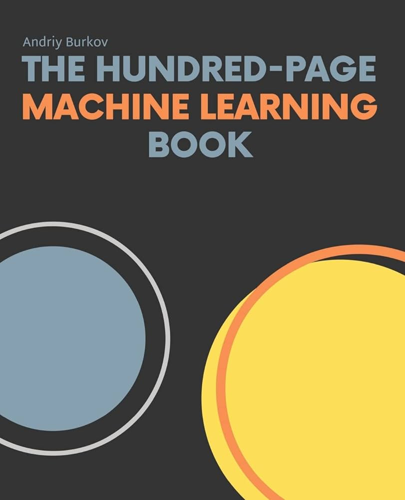](https://amzn.to/3Y1SIwN)

**27. [Designing Machine Learning Systems](https://amzn.to/3UGED8a)** by Chip Huyen

In this book, you will learn how to build and design holistic ML systems that are reliable, scalable, and maintainable. The author analyses each decision point in building such systems, from how to process and train data to which features to use and how to monitor them.

[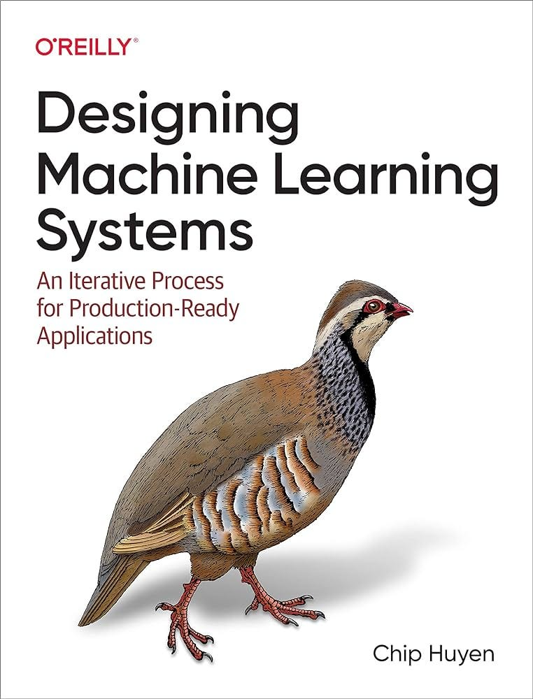](https://amzn.to/3UGED8a)

### Leadership

**28. [The Five Dysfunctions of a Team](https://amzn.to/3Z20fwW)** by Patrick Lencioni

This book explores different weaknesses that can undermine any team. Those weaknesses are Absence of Trust, Fear of Conflict, Lack of Commitment, Avoidance of Accountability, and Inattention to Results.

➡️ Read more about it in **[my text](https://newsletter.techworld-with-milan.com/i/115003073/how-do-you-handle-dysfunctions-in-a-team)**.

[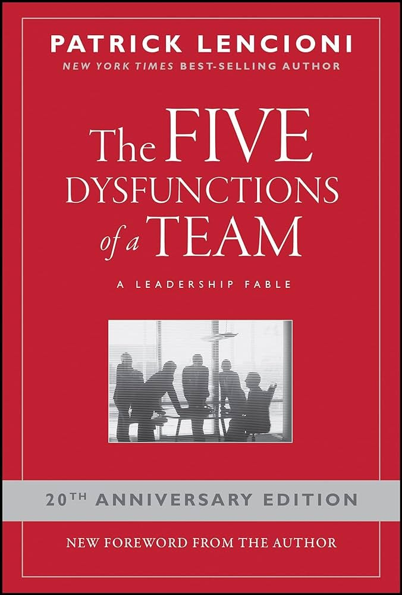](https://amzn.to/3Z20fwW)

**29. [Drive](https://amzn.to/3EZTALR)**by Daniel Pink

This book focuses on understanding what truly motivates people. Pink argues that traditional methods based on rewards and punishments (extrinsic motivators) are often ineffective. Instead, he proposes that the key to motivation lies in intrinsic factors: autonomy (control over work), mastery (opportunity to improve skills), and purpose (a sense of working towards something meaningful).

➡️ Read **[my text](https://newsletter.techworld-with-milan.com/i/115003073/how-would-you-like-to-motivate-your-team)** about the book.

[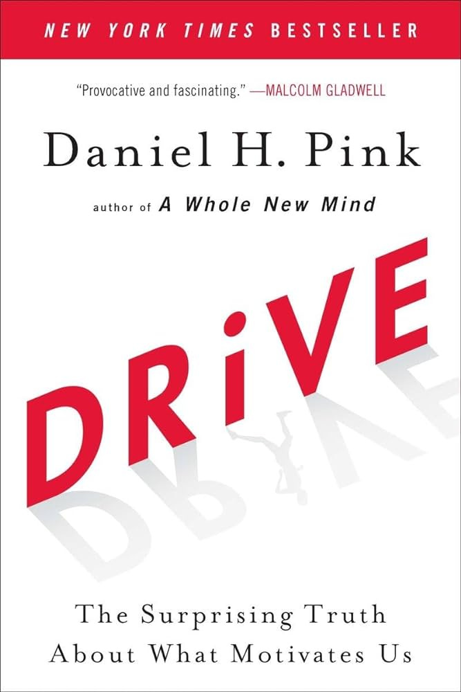](https://amzn.to/3EZTALR)

**30. [The Making of a Manager](https://amzn.to/3PB9Vvv)** by Julie Zhuo

This guidebook is designed for new managers, particularly those who are unprepared for the role. Zhuo, a former tech executive, shares her experiences of being thrust into a leadership position at a young age. The book emphasizes that great managers are developed, not born. It offers practical advice on managing a team, from shifting a mindset from individual contributor to supporting others, providing feedback, and delegating tasks.

[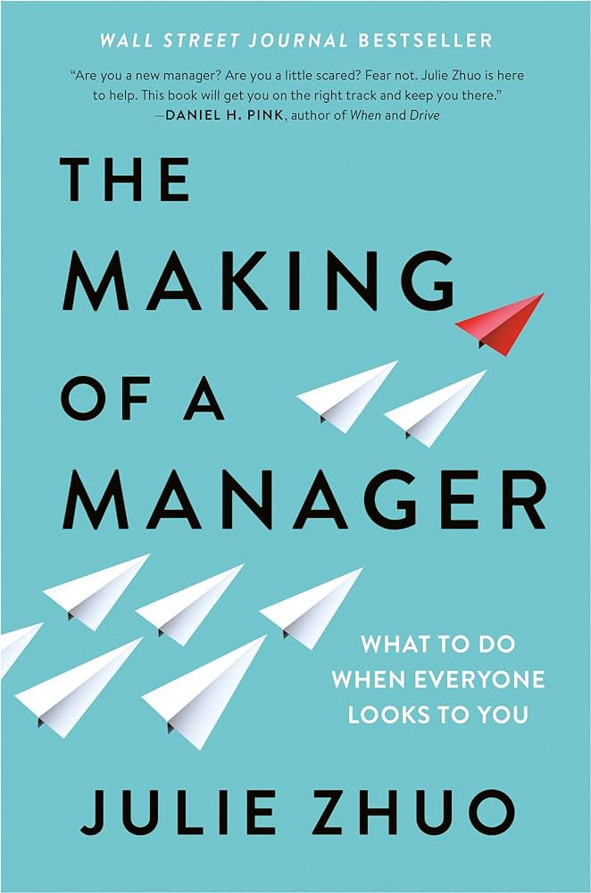](https://amzn.to/3PB9Vvv)

### Personal Development

**31. [How to Win Friends & Influence People](https://amzn.to/3V0j2cw)** by Dale Carnegie

This classic self-help book offers timeless principles for cultivating strong relationships and achieving your goals in life. It emphasizes the importance of being a good listener, showing genuine interest in others, and encouraging them to share their thoughts and experiences. The book also offers tips for praising others sincerely, avoiding arguments, and influencing people without causing resentment. It is one of the best books I've read and has had a profound influence on me and my relationships.

**32. [Deep Work](https://amzn.to/4a2y8mT)** by Cal Newport

Cal Newport's "Deep Work" argues that the ability to focus intensely on cognitively demanding tasks without distraction is becoming increasingly valuable in our information-overload world. The book highlights the benefits of deep work, like improved learning and performance, and offers concrete strategies to improve this skill. The author proposes various deep work scheduling philosophies, ranging from separating focused work from shallow tasks to integrating them into regular cycles. It is one of the most essential books for software engineers.

[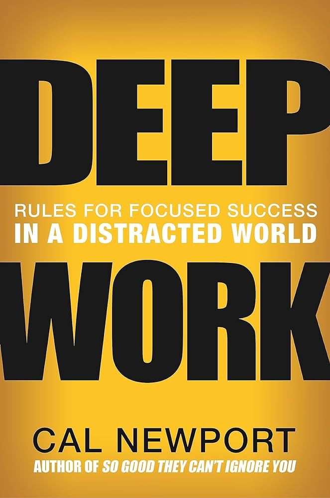](https://amzn.to/4a2y8mT)

**33. [The 7 Habits of Highly Effective People](https://amzn.to/4beN15V)** by Stephen R. Covey

In this book, Stephen Covey outlines a path to personal and professional success through seven core habits. The first three focus on taking the initiative, setting goals, and prioritizing tasks. The next three emphasize win-win solutions, empathetic communication, and collaboration. Finally, the last Habit stresses the importance of continuous self-improvement across all dimensions of life.

➡️ You can read more about the book in **[my review](https://newsletter.techworld-with-milan.com/p/the-habits-of-highly-effective-people?utm_source=publication-search)** (including the 8th Habit). It was one of the books that changed my life and career 10x.

[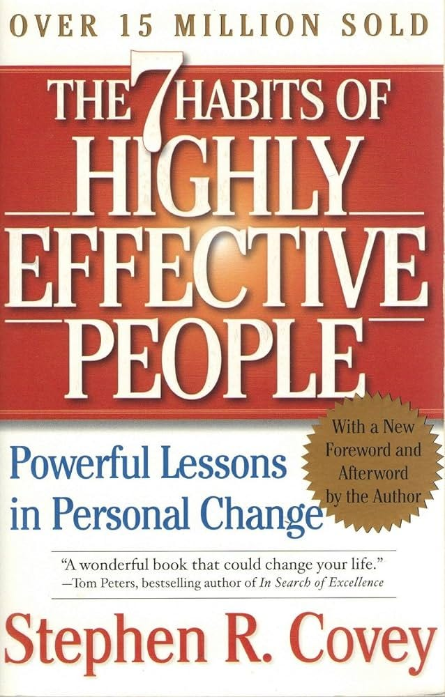](https://amzn.to/4beN15V)

**34. [Atomic Habits](https://amzn.to/3Kjody5)**by James Clear

Atomic Habits explores the science of habit formation and explains how small, consistent changes can lead to remarkable long-term results. The book provides a practical framework for establishing good habits and breaking bad ones, focusing on the "habit loop" and utilizing cues, cravings, responses, and rewards to create a system that transforms one's behavior. This book is a must-read for everyone!

[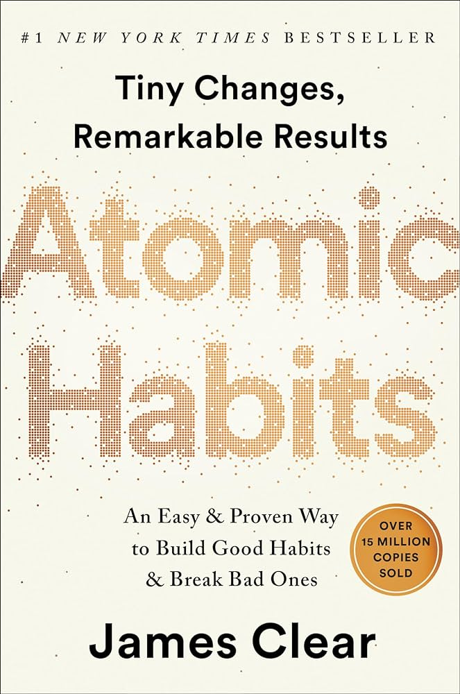](https://amzn.to/3Kjody5)

> ➡️*Check **[my book on setting and achieving goals](https://newsletter.techworld-with-milan.com/p/how-to-set-and-achieve-any-goal)** to improve your personal and professional life, where you can learn more about habits formation.*

Also, check my list of the most outstanding software development books of all time:
[
Tech World With Milan NewsletterThe Greatest Software Development Books of All TimeThere is a question that is often asked: should I read books to become a better developer? Usually, the question is yes and the reason for that is that the person who wrote the book wrote it when (s)he was the most invited to write it with the large knowledge base then. The only better option would be to work with that person, which is often not possibl…Read more3 years ago · 7 likes · Dr Milan Milanović](https://newsletter.techworld-with-milan.com/p/the-greatest-software-development?utm_source=substack&utm_campaign=post_embed&utm_medium=web)
Of course, you probably cannot read all of these books in a year (correctly), but you can **select from this list those most important to you in your current career/life situation and goals**.

[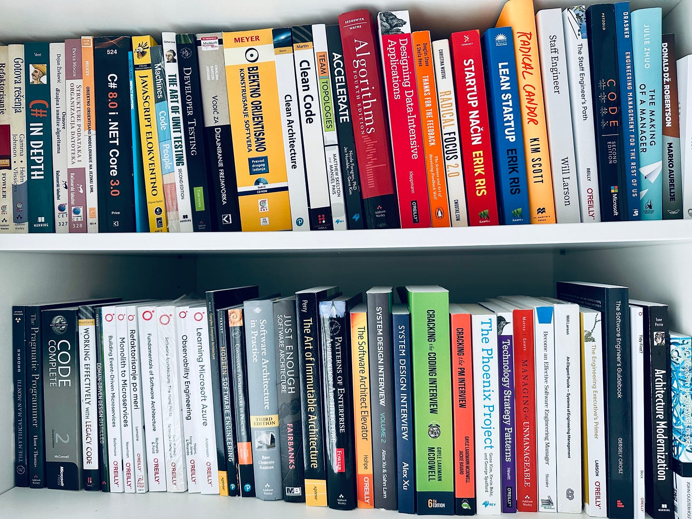](https://substackcdn.com/image/fetch/$s_!F_Cv!,f_auto,q_auto:good,fl_progressive:steep/https%3A%2F%2Fsubstack-post-media.s3.amazonaws.com%2Fpublic%2Fimages%2F8e0694d1-e279-4fc6-ada5-398cba3b9da0_4032x3024.jpeg)Part of my physical bookshelf (note that I mainly read ebooks these days)

> “*If you haven't read hundreds of books, you are functionally illiterate, and you will be incompetent because your personal experiences alone aren't broad enough to sustain you*.” ― Jim Mattis, [Call Sign Chaos: Learning to Lead](https://amzn.to/40myFh8)

Check also my favorite books on leadership:
[
Tech World With Milan Newsletter15 Best Leadership BooksThis is a reading guide for you as a leader to navigate and upgrade your leadership skills. It is a curated list of the best books on leadership that you can check and read during the holiday season. But it is not just a numbered list of books to read; it is a guide created by considering my selection from many books I’ve read and talked about with many…Read morea year ago · 51 likes · 8 comments · Dr Milan Milanović](https://newsletter.techworld-with-milan.com/p/15-best-leadership-books?utm_source=substack&utm_campaign=post_embed&utm_medium=web)
---

## More ways I can help you

- [📚](https://www.patreon.com/techworld_with_milan/shop/ultimate-net-bundle-for-2025-1519389?utm_medium=clipboard_copy&utm_source=copyLink&utm_campaign=productshare_creator&utm_content=join_link)**[The Ultimate .NET Bundle 2025](https://www.patreon.com/techworld_with_milan/shop/ultimate-net-bundle-for-2025-1519389?utm_medium=clipboard_copy&utm_source=copyLink&utm_campaign=productshare_creator&utm_content=join_link)** 🆕. 500+ pages distilled from 30 real projects show you how to own modern C#, ASP.NET Core, patterns, and the whole .NET ecosystem. You also get 200+ interview Q&As, a C# cheat sheet, and bonus guides on middleware and best practices to improve your career and land new .NET roles. **[Join 1,000+ engineers](https://www.patreon.com/techworld_with_milan/shop/ultimate-net-bundle-for-2025-1519389?utm_medium=clipboard_copy&utm_source=copyLink&utm_campaign=productshare_creator&utm_content=join_link)**.
- [📦](https://www.patreon.com/techworld_with_milan/shop/premium-resume-package-1721454?utm_medium=clipboard_copy&utm_source=copyLink&utm_campaign=productshare_creator&utm_content=join_link)**[Premium Resume Package](https://www.patreon.com/techworld_with_milan/shop/premium-resume-package-1721454?utm_medium=clipboard_copy&utm_source=copyLink&utm_campaign=productshare_creator&utm_content=join_link) 🆕**. Built from over 300 interviews, this system enables you to craft a clear, job-ready resume quickly and efficiently. You get ATS-friendly templates (summary, project-based, and more), a cover letter, AI prompts, and bonus guides on writing resumes and prepping LinkedIn. **[Join 500+ people](https://www.patreon.com/techworld_with_milan/shop/premium-resume-package-1721454?utm_medium=clipboard_copy&utm_source=copyLink&utm_campaign=productshare_creator&utm_content=join_link)**.
- [📄](https://www.patreon.com/techworld_with_milan/shop/complete-tech-resume-reality-check-311008?utm_medium=clipboard_copy&utm_source=copyLink&utm_campaign=productshare_creator&utm_content=join_link)**[Resume Reality Check](https://www.patreon.com/techworld_with_milan/shop/complete-tech-resume-reality-check-311008?utm_medium=clipboard_copy&utm_source=copyLink&utm_campaign=productshare_creator&utm_content=join_link)**. Get a CTO-level teardown of your CV and LinkedIn profile. I flag what stands out, fix what drags, and show you how hiring managers judge you in 30 seconds. **[Join 100+ people](https://www.patreon.com/techworld_with_milan/shop/complete-tech-resume-reality-check-311008?utm_medium=clipboard_copy&utm_source=copyLink&utm_campaign=productshare_creator&utm_content=join_link)**.
- [📢](https://www.patreon.com/techworld_with_milan/shop/short-linkedin-content-creator-311232?utm_medium=clipboard_copy&utm_source=copyLink&utm_campaign=productshare_creator&utm_content=join_link)**[LinkedIn Content Creator Masterclass](https://www.patreon.com/techworld_with_milan/shop/short-linkedin-content-creator-311232?utm_medium=clipboard_copy&utm_source=copyLink&utm_campaign=productshare_creator&utm_content=join_link)**. I share the system that grew my tech following to over 100,000 in 6 months (now over 255,000), covering audience targeting, algorithm triggers, and a repeatable writing framework. Leave with a 90-day content plan that turns expertise into daily growth. **[Join 1,000+ creators](https://www.patreon.com/techworld_with_milan/shop/short-linkedin-content-creator-311232?utm_medium=clipboard_copy&utm_source=copyLink&utm_campaign=productshare_creator&utm_content=join_link)**.
- [✨](https://www.patreon.com/c/techworld_with_milan)**[Join My Patreon](https://www.patreon.com/c/techworld_with_milan)**[https://www.patreon.com/c/techworld_with_milan](https://www.patreon.com/c/techworld_with_milan)**[Community](https://www.patreon.com/c/techworld_with_milan)**. Unlock every book, template, and future drop (worth over $100), plus early access, behind-the-scenes notes, and priority requests. Your support enables me to continue writing in-depth articles at no cost. **[Join 2,000+ insiders](https://www.patreon.com/c/techworld_with_milan)**.
- [🤝](https://newsletter.techworld-with-milan.com/p/coaching-services)**[1:1 Coaching](https://newsletter.techworld-with-milan.com/p/coaching-services)** – Book a focused session to crush your biggest engineering or leadership roadblock. I’ll map next steps, share battle-tested playbooks, and hold you accountable. **[Join 100+ coachees](https://newsletter.techworld-with-milan.com/p/coaching-services)**.

---

Thanks for reading Tech World With Milan Newsletter! Subscribe for free to receive new posts and support my work.