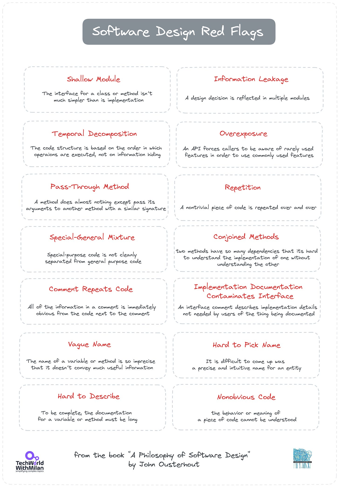

# My learnings from the book A Philosophy of Software Design

*And the answer to the question what is the most complex problem in Computer Sciences.*

I recently read "**[A Philosophy of Software Design](https://amzn.to/3IwzyK8)**" 2nd Edition by Prof. John Ousterhout, and this is my review.

If we think about **the most complex problems in Computer Science**, there are different thoughts on this. Is it problem-solving? Or maybe data structures and algorithms? Some believe it is software architecture.

Stanford University Professor of Computer Science John Ousterhout says it is a **decomposition problem.**In his book**“[A Philosophy of Software Design](https://amzn.to/3IwzyK8),”**he advocates that good software design means fighting complexity and recommends different strategies for dealing it. The book was initially published in 2018, and its second edition was released in 2021. (it's 180 pages, so it's a quick read.) Each chapter is short and to the point, like the entire book.

The book doesn’t focus on a specific programming language or framework but presents general software design ideas.

 **“**[A Philosophy of Software Design](https://amzn.to/3IwzyK8)” by John Ousterhout

## The things I liked about the book

I found some things valuable in this book, primarily in chapters 2 to 11.

### ✅ Fighting complexity

The author defines complexity as:

> *Complexity is anything related to the structure of a software system that makes it hard to understand and modify the system.*

The author uses this mathematical definition: “*A system’s complexity equals the sum of its parts’ complexities, weighted by how often developers interact with them*.“This means that the code we work on mainly contributes to the complexity.

Mathematical definition of complexity according to the book: A Philosophy of Software Design

He noted three symptoms of complexity:

- **Change amplifications**: A simple change requires code modifications in many different places
- **Cognitive load**: How much a developer needs to know to complete a task
- **Unknown unknowns**: When it's not clear which piece of code must be modified to complete a task.

There are two primary sources of complexity: **dependencies** (when code cannot be understood and changed in isolation) and **obscurity**(which occurs when vital information is not apparent).

And recommends two approaches for fighting complexity:

1. **Complexity elimination** — make code more straightforward and evident by eliminating some exceptional cases.
2. **Complexity encapsulation, or**shifting into somewhat independent modules, is often known as modular design. It allows programmers to work on a system without being immediately confronted with its intricacies.

### ✅ Classes should be deep, and interfaces simple

The famous David Parnas paper in 1970 ("[On the Criteria To Be Used In Decomposing Systems into Modules](https://dl.acm.org/doi/10.1145/361598.361623)") mentions that **we need simple interfaces but a lot of functionality inside a method or class**. We could typically see that we have shallow methods with only one line of code inside. He considers the most significant mistake too small and too shallow of classes. As an example, we can see (something he calls **classisitis**) in Java, we need two to three classes to read a simple file: `FileInputStream → BufferedInputStream`. More significant modules, generic interfaces, and classes encourage information hiding and reduce complexity.

Deep and Shallow Module

> *Note that this is a countrary suggestion to the one from the “**[Clean code](https://amzn.to/438oJrd)**” book of Uncle Bob Martin.*

In addition, the author mentions **a famous API design antipattern** involving overexposing internals, which later adds to an architecture debt.

### ✅ Design it twice

In Chapter 11, the author considered a perfect way of thinking about designing software, and that is **trade-offs**. It is doubtful that you will produce the best design from your first thoughts about it, but it would be much better to have multiple options to choose from and analyze which one is the best for your case. Or it can be a combination of different alternatives.

This approach can be used at different system levels, from interface selection to method implementation. For interfaces, we match closely the operations happening in higher-level software, while for implementations, the goals are simplicity and performance.

### ✅ Mindset (Strategic vs tactical programming)

Most people use a **tactical approach**, where the goal is to make something work. However, the result is a bad design with a lot of tech complexity, which usually results in spaghetti code. Complexity is not a single line but many lines in a project, which we overlook as a whole. We sometimes also create a feature we may not need (YAGNI). His recommendation is to take a **strategic approach** where the working code is not the only goal, but the goal should be great design, which simplifies development and minimizes complexity.

### ✅ Invest time in quality

What we usually see with startups is pressure to build products quickly, which can result in spaghetti code. But good code gives you more advantages. One of those is to hire great people who like to work with high-quality codebases. In addition, we need to make our development **10-20% slower**, and you will get it all back in the future (this also reduces tech debt). Try to **code and refactor in small steps.**

### ✅ Remove unnecessary errors

The author argues that if your code throws an exception, you force all callers of that code to know how to handle this exception. Yet, in many cases, callers don’t know what to do about the exception which is thrown. He says we should define our functionality so **[we never need to throw an exception](https://wiki.tcl-lang.org/page/Define+Errors+Out+of+Existence)**. We can do this by masking exceptions by detecting and handling them at a low level or aggregating them in a single piece of code at a higher level.

> *Java's*`String.substring()`*function serves as one illustration. An*`IndexOutOfBoundsException `*is raised if the higher index is greater than the string length or if, the lower index is less than zero. The caller must handle these conditions first before calling*`substring()`*. Alternatively, you can specify that it should return any characters in the string with an index that is less than endIndex and more than or equal to beginIndex.*

### ✅ Optimizations

In chapter 20, the author addresses the topic of **performance optimizations**. He says that if you try to optimize every statement for maximum speed, it will slow down development and create complexity. Still, if you ignore performance, it is easy to create a system with significant inefficiencies through the code (called the “death by a thousand cuts” scenario). The solution is in the middle, so we design things that are “naturally efficient” but also clean and simple to know which operations are expensive. We can understand this by running a series of micro-benchmarks.

**Fundamental optimizations** typically obtain the **most significant optimization improvements**. For instance, it can modify the data structure or algorithm or add a cache. You are trying to get to **this speedy optimal critical path**. To optimize the code and come as near to this ideal condition as feasible, the next step is to reorder it.

### ✅ **Choosing names**

In the book, the author says that Good names are a form of documentation:

- They make code easier to understand.
- They reduce the need for other documentation.
- They make it easier to detect errors.

The names **should be precise**, whereas a variable or method name that is too general and could be interpreted in various ways does not provide the developer with much information and increases the likelihood of the underlying entity being misused. Like reusing a common class, **consistent naming lessens cognitive load** by enabling readers to quickly draw assumptions when they see the name in a different context because they have already seen it in one.

> *If you want to learn more about good naming, I can recommend the book “**[Code Complete 2](https://amzn.to/48PSRZF)”**, as it give better and more details suggestions on this topic.*

## The things I disagree with

There are a few things I wouldn’t expect to have in such a book, namely:

### ❌ Code comments

I disagree with the excessive use of code comments, although the author mentions that we should use them only for what is not apparent. There are multiple chapters on code comments; even Chapter 15 has the title “**Write The Comments First**” (Comments-first development?). He states, “*Every class should have an interface comment, every class variable should have a comment, and every method should have an interface comment.*” This way of thinking introduces a lot of noise in the code. Such comments need to be constantly synced with the changes in the code. If the code is so complex, we need to comment on it; maybe we can rewrite it to be more straightforward and understandable.

I agree with the author that we should write comments if we have to explain something tricky (such as an algorithm or something similar) or non-obvious (why, not how).

He uses the **comments and documentation as synonyms** in many places, which I tend to disagree with. Documentation should be kept close to the code but not in the code itself.

### ❌ GOTO command

On page 68, the author mentions the GOTO command to eliminate duplication by refactoring the code so that we can escape from the nested code. This is a big surprise, as the GOTO command has been considered a terrible idea by most authors for decades now. It was one of the primary sources of making procedural/spaghetti code and the source of many unpredictable bugs.

### ❌ **Test-Driven Development (TDD) is considered harmful**

The author generally supports writing unit tests, which can catch problems during refactoring; he doesn’t like TDD. He contends that **TDD promotes tactical programming** by emphasizing implementing particular features rather than searching for the ideal design, which is better accomplished by viewing the development units as abstractions rather than features. When fixing defects that can be tested beforehand, he suggests adopting TDD so that the test may verify that the bug was fixed once the required adjustments have been made.

Although I’m also not a big fan of the TDD-only approach because it requires more discipline and a way of working/thinking, I cannot say it is harmful in any way. It can probably help you have better software design and software with fewer bugs.

## 👍 Recommendation

As a summary of this book, I would **recommend** it to:

- **Programmers new to software design:** It provides a solid foundation in core principles, making it a valuable starting point for understanding how to structure complex software systems. Yet, be careful, as it is hard for a junior developer to understand the complexity behind the task.
- **Developers looking to improve code maintainability and understandability:** The emphasis on modularity and evident interfaces resonates with those seeking to write clean and sustainable code.
- **To everyone who wants to balance the “[Clean code](https://amzn.to/48TEbIJ)” approach**, this book offers a bit different suggestions than Uncle Bob's in his book, such as deep functions vs. shallow functions, comments vs. no comments, etc. Generally, it is an excellent way to know both sides and make decisions independently.

I would not recommend it for:

- **Seasoned software architects seek an in-depth exploration of advanced software design concepts.**Software design often involves trade-offs. The book could benefit from a more nuanced discussion of the potential drawbacks of particular approaches and considerations for choosing the most suitable design for a specific context.
- **Developers working on legacy systems.** Many developers work on existing codebases. The book could be strengthened by including a section on applying these design principles to legacy systems, which often lack the structure advocated for. Most examples in the book are simple apps created during the university course (such as text editors), so they're far away from large, complex systems in the industry. A complementary book for this topic would be “[Working Effectively with Legacy Code](https://amzn.to/43d1Xyv).”

## 🔴 Software Design Red Flags

Here is the list of red flags from the book:

1. **Shallow module.** The interface for a class or method isn't much more straightforward than the implementation.
2. **Information leakage.** A design decision is reflected in multiple modules.
3. **Temporal decomposition**. The code structure is based on the order in which operations are executed, not on information hiding.
4. **Overexposure.** An API forces callers to be aware of rarely used features to use commonly used features.
5. **Pass-through method.** A method does almost nothing except pass its arguments to another method with a similar signature.
6. **Repetition.** A nontrivial piece of code is repeated over and over.
7. **Special-general mixture.** Special-purpose code is not cleanly separated from general-purpose code.
8. **Cojoined methods.** Two methods have so many dependencies that it's hard to understand the implementation of one without understanding the implementation of the other.
9. **Comments repeat code**. All the information in a comment is immediately apparent from the code next to the comment.
10. **Implementation documentation contamines interface**. An interface comment describes implementation details not needed by users of the thing being documented.
11. **Vague name.** The name of a variable or method is so imprecise that it doesn't convey much useful information.
12. **Hard to pick a name.**Developing a precise and intuitive name for an entity isn't easy.
13. **Hard to describe.** To be complete, the documentation for a variable or method must be extended.
14. **Nonobvious code.** The behavior or meaning of a piece of code cannot be understood.

Software Design Red Flags

I recommend "**[A Philosophy of Software Design](https://amzn.to/3IwzyK8)**” as one of the best books on software design. It emphasizes the importance of understanding complexity and the way to do strategic programming. The author's view on deep modules brings a new way of thinking, which is different from the standard approach in the industry ([Clean code](https://amzn.to/48TEbIJ)), and it makes sense for some kinds of problems. In addition, the author brings some valuable tools, such as identifying the “red flags” in the software design to reduce and manage complexity.

## BONUS: **A Philosophy of Software Design, John Ousterhout (Talks at Google)**

---

## More ways I can help you

1. **1:1 Coaching:** [Book a working session with me](https://newsletter.techworld-with-milan.com/p/coaching-services). 1:1 coaching is available for personal and organizational/team growth topics. I help you become a high-performing leader 🚀.
2. **[Promote yourself to 27,000+ subscribers](https://newsletter.techworld-with-milan.com/p/sponsorship-of-tech-world-with-milan)**by sponsoring this newsletter.

---

Thanks for reading Tech World With Milan Newsletter! Subscribe for free to receive new posts and support my work.