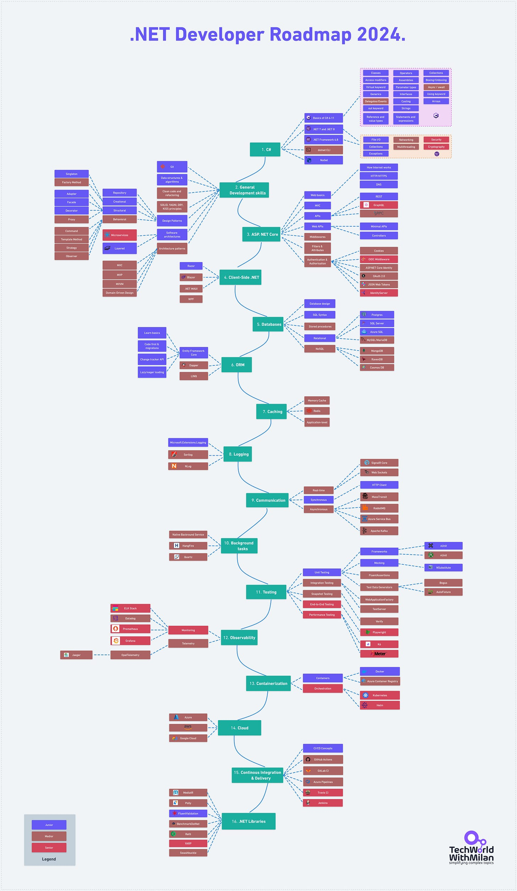

# .NET Developer Roadmap 2024.

This is a step-by-step guide to becoming a .NET Developer, with links to relevant learning resources and by seniority level.

---

## **[Postman's VS Code Extension (Sponsored)](https://marketplace.visualstudio.com/items?itemName=Postman.postman-for-vscode)**

*Postbot is now available across Postman with enhanced capabilities! The latest refresh of Postbot now offers a consistent, conversational interface available to you across your workspace. Learn how you can leverage Postbot throughout Postman to get contextual assistance.*

[Check it out!](https://blog.postman.com/meet-postbot-postmans-new-ai-assistant/)

---

## [Learning resources](https://github.com/milanm/DotNet-Developer-Roadmap#learning-resources)

### [1. C#](https://github.com/milanm/DotNet-Developer-Roadmap#1-c)

C# is a programming language developed by Microsoft. It's a go-to choice for building anything from desktop applications and games (using Unity) to cloud-based solutions and web services. With strong support for object-oriented programming and a rich library, it's designed to be easy and efficient.

You need to understand different **C# language features**, such as:

- Object-oriented programming (classes, objects, interfaces, inheritance, polymorphism)
- Variables, data types, and operators
- Reference and value types
- Control flow (conditionals, loops)
- Generics
- Exception handling
- Delegates and events
- Assemblies
- Collections
- Async and await for asynchronous programming

But also **.NET libraries and APIs** for:

- File I/O and serialization
- Collections and data structures
- Networking
- Multithreading and task parallelism
- Security and cryptography

**Resources**:

- [Microsoft Learn C#](https://dotnet.microsoft.com/en-us/learn/csharp).
- [Microsoft C# Fundamentals for Absolute Beginners](https://learn.microsoft.com/en-us/shows/c-fundamentals-for-absolute-beginners/).
- [Microsoft C# 101](https://learn.microsoft.com/en-us/shows/csharp-101/)
- [Udemy C# for Beginners - Coding From Scratch (.NET Core)](https://www.udemy.com/course/c-and-net-core-for-beginners/)
- [C# Basics for Beginners: Learn C# Fundamentals by Coding](https://www.udemy.com/course/csharp-tutorial-for-beginners/)
- Learn [dotnet CLI](https://docs.microsoft.com/dotnet/core/tools)
- [Learn.NET official Microsoft tutorials](https://dotnet.microsoft.com/en-us/learn)
- [Dot Net Perls](https://www.dotnetperls.com/s#c#) - Many code examples in C#
- [Become a Full-stack .NET Developer - Advanced Topics](https://www.pluralsight.com/courses/full-stack-dot-net-developer)
- Advanced concepts:

- [Async/Await](https://devblogs.microsoft.com/dotnet/how-async-await-really-works/) by Stephen Toub
- [Threading in C#](https://www.albahari.com/threading/) by Joseph Albahari

### [2. General Development Skills](https://github.com/milanm/DotNet-Developer-Roadmap#2-general-development-skills)

Mastering design patterns, clean code, and version control like Git enables you to write efficient, maintainable code that works and thrives in a team environment. It's the difference between being a coder and a skilled software engineer.

Here, you need to know different principles, such as:

**SOLID Principles**:

- Single Responsibility Principle (SRP)
- Open/Closed Principle (OCP)
- Liskov Substitution Principle (LSP)
- Interface Segregation Principle (ISP)
- Dependency Inversion Principle (DIP)

But also:

- DRY (Don't Repeat Yourself)
- KISS (Keep It Simple, Stupid)
- YAGNI (You Ain't Gonna Need It)
- Law of Demeter (LoD) or Principle of least knowledge
- Composition over Inheritance
- The Principle of least astonishment

**Resources**:

- Learn [Git](https://newsletter.techworld-with-milan.com/p/how-to-learn-git)
- Learn [HTTP(S) protocol](https://developer.mozilla.org/en-US/docs/Web/HTTP/Overview)
- Learn [Data Structures & Algorithms](https://amzn.to/3LTsZ6o)
- Learn [Clean Code](https://amzn.to/3Qdj91J)
- Learn [Refactoring](https://www.pluralsight.com/courses/refactoring-fundamentals) fundamentals
- Learn [Design Patterns from the book](https://amzn.to/3QcVQVS) or [video tutorials](https://www.pluralsight.com/paths/design-patterns-in-c)
- Learn [Main software design](https://newsletter.techworld-with-milan.com/p/main-software-design-principles-you) principles
- Learn [SOLID](https://www.pluralsight.com/courses/principles-oo-design) principles of OO Design in depth.
- Learn [Fundamentals of Software Architectures](https://amzn.to/3rEtJWh)
- Learn [Microservices](https://microservices.io/) and [DAPR](https://dapr.io/)

### [3. ASP.NET Core](https://github.com/milanm/DotNet-Developer-Roadmap#3-aspnet-core)

It is a cross-platform, high-performance framework developed by Microsoft for building web apps, APIs, and microservices. You can also run your apps on Windows, Linux, or macOS. It's engineered for flexibility and scalability with features like built-in dependency injection and a robust configuration system.

Here, you also need to know **web application fundamentals**, such as:

- HTML, CSS, and JavaScript for front-end development
- HTTP protocols, request/response model, and RESTful APIs
- Routing, middleware, authentication, and authorization
- Model-View-Controller (MVC) and Razor Pages patterns

**Resources**:

- [ASP.NET Core Fundamentals by Scott Alen](https://www.pluralsight.com/courses/aspnet-core-fundamentals) course
- [ASP.NET MVC 5 Fundamentals by Scott Alen](https://www.pluralsight.com/courses/aspdotnet-mvc5-fundamentals) course
- [Advanced ASP.NET Core 3.1 MVC](https://www.udemy.com/course/azure-devops-for-net-developer/) Udemy course
- [Pro ASP.NET Core 6](https://amzn.to/3RV3rcV) book
- APIs

- [REST](https://docs.microsoft.com/en-us/aspnet/core/tutorials/first-web-api)
- [GraphQL](https://graphql.org/)
- [gRPC](https://grpc.io/)
- Dependency Injection

- [Life Cycles](https://learn.microsoft.com/en-us/aspnet/core/fundamentals/dependency-injection)
- [Microsoft Extensions Dependency Injection](https://learn.microsoft.com/en-us/dotnet/api/microsoft.extensions.dependencyinjection?view=dotnet-plat-ext-7.0)
- [Autofac](https://autofac.org/)
- [Scrutor](https://github.com/khellang/Scrutor)
- [Application Settings & Configurations](https://docs.microsoft.com/en-us/aspnet/core/fundamentals/configuration)
- [Middlewares](https://docs.microsoft.com/en-us/aspnet/core/fundamentals/middleware)
- [Filters & Attributes](https://docs.microsoft.com/en-us/aspnet/core/mvc/controllers/filters)
- [Authentication](https://docs.microsoft.com/en-us/aspnet/core/security/authentication) or [this Reddit thread](https://www.reddit.com/r/dotnet/comments/we9qx8/a_comprehensive_overview_of_authentication_in/)
- [Authorization](https://docs.microsoft.com/en-us/aspnet/core/security/authorization/introduction)
- [IdentityServer](https://identityserver4.readthedocs.io/en/latest)
- [Auth0](https://auth0.com/)
- [OIDC](https://openid.net/connect)

### [4. Client-Side .NET](https://github.com/milanm/DotNet-Developer-Roadmap#4-client-side-net)

If you want to build UIs in .NET, you will need these frameworks. Razor is a template engine for creating dynamic HTML, while Blazor takes it up a notch, letting you build interactive web UIs using C# instead of JavaScript. MAUI is a Xamarin successor made for building cross-platform mobile apps.

**Resources**:

- [Razor](https://docs.microsoft.com/aspnet/core/mvc/views/razor)
- [Blazor](https://dotnet.microsoft.com/apps/aspnet/web-apps/blazor)
- [.NET MAUI](https://github.com/dotnet/maui)
- [WPF](https://learn.microsoft.com/en-us/dotnet/desktop/wpf/overview/?view=netdesktop-8.0)

### [5. Databases](https://github.com/milanm/DotNet-Developer-Roadmap#5-databases)

Good database design ensures efficient data storage and quick retrieval, making your app run smoother and scale easier. SQL, the go-to language for database interaction, gives you the power to query, update, and manage the data you've so carefully designed to store.

Here, you need to know:

- SQL Syntax
- Basics of Database design (normal forms, keys, relationships)
- The Difference Between Inner, Left, Right, and Full Join
- SQL Queries Execution Order
- What is Query Optimizer

**Resources**:

- [Database design](https://www.youtube.com/watch?v=ztHopE5Wnpc)
- [Learn SQL](https://newsletter.techworld-with-milan.com/p/how-to-learn-sql)
- Relational

- [SQL Server](https://www.microsoft.com/sql-server/sql-server-2019)
- [PostgreSQL](https://www.postgresql.org/)
- [MariaDB](https://mariadb.org/)
- [MySQL](https://www.mysql.com/)
- NoSQL

- [MongoDB](https://docs.microsoft.com/aspnet/core/tutorials/first-mongo-app)
- [RavenDB](https://github.com/ravendb/ravendb)
- [CosmosDB](https://docs.microsoft.com/azure/cosmos-db)
- Tools:

- [SQLFlow](https://sqlflow.gudusoft.com/#/) - a great tool to visualize SQL queries.

### [6. ORM](https://github.com/milanm/DotNet-Developer-Roadmap#6-orm)

Object-relational mapping (ORM) is like a translator between your object-oriented C# code and the relational database, eliminating the tedious task of writing SQL queries for basic CRUD operations. Using ORM frameworks like Entity Framework, you can manipulate data as objects in your code, making it more readable and maintainable. This speeds up development, minimizes errors, and lets you focus on complex business logic rather than wrestling with database syntax.

For **Entity Framework**, you need to know the following:

- DbContext and DbSet for managing database connections and querying data
- Code-First and Database-First approaches for defining data models
- Migrations for managing database schema changes
- Querying data using LINQ and raw SQL
- Tracking changes and saving data

**Resources**:

- [Entity Framework Core](https://learn.microsoft.com/en-us/ef/core)

- [Code First Migrations](https://learn.microsoft.com/en-us/ef/core/managing-schemas/migrations/?tabs=dotnet-core-cli)
- [Change Tracker API](https://learn.microsoft.com/en-us/ef/core/change-tracking/)
- [Lazy Eager Explicit Loading](https://learn.microsoft.com/en-us/ef/core/querying/related-data/)
- [Dapper](https://github.com/StackExchange/Dapper)
- [LINQ](https://www.dotnetnakama.com/blog/understanding-the-dot-net-language-integrated-query-linq/)

### [7. Caching](https://github.com/milanm/DotNet-Developer-Roadmap#7-caching)

Caching is like your app's personal short-term memory, storing frequently accessed data so it can be quickly retrieved without taxing your database. By reducing database load and speeding up data access, caching gives your app the competitive edge it needs to meet user demands for responsiveness and availability.

**Resources**:

- [Memory Cache](https://docs.microsoft.com/aspnet/core/performance/caching/memory)
- [Redis](https://redis.io/)
- Application-Level

- [Built-in](https://learn.microsoft.com/en-us/aspnet/core/performance/caching/response)
- [Output Caching](https://learn.microsoft.com/en-us/aspnet/core/performance/caching/output?source=recommendations)

### [8. Logging](https://github.com/milanm/DotNet-Developer-Roadmap#8-logging)

Logging captures runtime information, errors, and other crucial data that can help you quickly identify and fix issues, making your application more reliable and secure. Logging frameworks like NLog or Serilog integrate seamlessly into .NET, giving you a real-time diagnostic tool indispensable for monitoring application health, troubleshooting problems, and even gathering insights for future development.

**Resources**:

- [Serilog](https://github.com/serilog/serilog)
- [NLog](https://github.com/NLog/NLog)
- [Microsoft.Extensions.Logging](https://learn.microsoft.com/en-us/dotnet/core/extensions/logging)

### [9. Real-time communication](https://github.com/milanm/DotNet-Developer-Roadmap#9-real-time-communication)

Real-time communication technologies, like SignalR in the .NET ecosystem, enable these functionalities by maintaining a constant connection between server and client. They are used in interactive experiences, whether live chat, notifications, or real-time updates.

**Resources**:

- [SignalR Core](https://docs.microsoft.com/aspnet/core/signalr)
- [WebSockets](https://docs.microsoft.com/en-us/aspnet/core/fundamentals/websockets)
- [Socket.IO](https://github.com/doghappy/socket.io-client-csharp)

### [10. Background tasks](https://github.com/milanm/DotNet-Developer-Roadmap#10-background-tasks)

These services run tasks in the background, freeing up your application to focus on user interactions. Whether data processing, automated emails, or periodic clean-ups, background services ensure these tasks don't slow down or interrupt the user experience.

**Resources**:

- [Native BackgroundService](https://docs.microsoft.com/en-us/aspnet/core/fundamentals/host/hosted-services)
- [HangFire](https://github.com/HangfireIO/Hangfire)
- [Quartz](https://github.com/quartznet/quartznet)

### [11. Object Mapping](https://github.com/milanm/DotNet-Developer-Roadmap#11-object-mapping)

Their libraries automate the task of mapping between objects, eliminating the need for repetitive, error-prone manual mapping code. This boosts productivity and minimizes bugs, especially when dealing with complex models and DTOs (Data Transfer Objects).

**Resources**:

- [AutoMapper](https://github.com/AutoMapper/AutoMapper)
- [Mapster](https://github.com/MapsterMapper/Mapster)

### [12. Testing](https://github.com/milanm/DotNet-Developer-Roadmap#12-testing)

Unit tests focus on isolated pieces of your code, integration tests ensure different parts play well together, and end-to-end tests validate the entire user journey within your application. Together, they form a safety net, catching bugs early, simplifying debugging, and making your codebase robust and maintainable.

Here you need to know:

- Test frameworks (xUnit, NUnit, MSTest)
- Test runners and test explorers
- Asserts and test attributes
- Mocking libraries (Moq, NSubstitute, etc.)

**Resources**:

- [Unit Testing](https://www.pluralsight.com/courses/advanced-unit-testing)

- Frameworks

- [xUnit](https://xunit.net/)
- [NUnit](https://nunit.org/)
- [MSTest](https://docs.microsoft.com/dotnet/core/testing/unit-testing-with-mstest)
- Mocking

- [Moq](https://github.com/moq/moq4)
- [NSubstitute](https://github.com/nsubstitute/NSubstitute)
- Assertion

- [FluentAssertion](https://github.com/fluentassertions/fluentassertions)
- [Shouldly](https://github.com/shouldly/shouldly)
- Test Data Generators

- [Bogus](https://github.com/bchavez/Bogus)
- [AutoFixture](https://github.com/AutoFixture/AutoFixture)
- Integration Testing

- [WebApplicationFactory](https://docs.microsoft.com/aspnet/core/test/integration-tests)
- [TestServer](https://learn.microsoft.com/en-us/aspnet/core/test/integration-tests?view=aspnetcore-7.0)
- [Testcontainers](https://dotnet.testcontainers.org/)
- Snapshot Testing

- [Verify](https://github.com/VerifyTests/Verify)
- Behavior Testing

- [SpecFlow](https://github.com/techtalk/SpecFlow/tree/DotNetCore)
- End-to-End Testing

- [Playwright](https://playwright.dev/)
- Performance Testing

- [K6](https://github.com/grafana/k6)
- [JMeter](https://github.com/apache/jmeter)

### [13. Monitoring & Telemetry](https://github.com/milanm/DotNet-Developer-Roadmap#13-monitoring--telemetry)

These tools provide real-time insights into your application's performance, user behavior, and error rates, enabling you to address issues before they escalate into full-blown problems proactively.

- **Monitoring** focuses on the health and availability of services and systems, often triggering alerts for predefined conditions.
- **Telemetry** collects, processes, and transmits data from systems, enabling analysis of patterns, trends, and anomalies.

**Resources**:

- [Prometheus](https://github.com/prometheus/prometheus)
- [Grafana](https://github.com/grafana/grafana)
- [Datadog](https://www.datadoghq.com/)
- [ELK Stack](https://www.elastic.co/what-is/elk-stack)
- [OpenTelemetry](https://github.com/open-telemetry/opentelemetry-dotnet)
- [Jaeger](https://www.jaegertracing.io/)

### [14. Messaging](https://github.com/milanm/DotNet-Developer-Roadmap#14-messaging)

Messaging systems act as a middleman between different parts of your system, allowing them to communicate without being directly connected. This decouples your components, making scaling, maintaining, and adding new features easier. Plus, it improves fault tolerance—so if one part fails, it doesn't bring down the whole system.

**Resources:**

- [RabbitMQ](https://www.rabbitmq.com/tutorials/tutorial-one-dotnet.html)
- [MassTransit](https://github.com/MassTransit/MassTransit)
- [Azure Service Bus](https://docs.microsoft.com/azure/service-bus-messaging/service-bus-messaging-overview)
- [NServiceBus](https://learn.microsoft.com/en-us/azure/service-bus-messaging/build-message-driven-apps-nservicebus?tabs=Sender)

### [15. Containerization](https://github.com/milanm/DotNet-Developer-Roadmap#15-containerization)

Container solutions encapsulate your .NET application, libraries, and runtime into isolated containers. This enables consistency across multiple development and production environments, resolving dependency issues. With features like layered file systems, you can easily manage container images for ASP.NET, .NET Core, or other .NET services, optimizing build times and resource utilization.

**Resources:**

- [Docker](https://www.docker.com/)
- [Kubernetes](https://kubernetes.io/)

### [16. Cloud](https://github.com/milanm/DotNet-Developer-Roadmap#16-cloud)

Cloud providers provide a layer of APIs to abstract infrastructure and provision it based on security and billing boundaries. The cloud runs on servers in data centers, but the abstractions cleverly give the appearance of interacting with a single "platform" or extensive application. The ability to quickly provision, configure, and secure resources with cloud providers has been critical to the tremendous success and complexity of modern DevOps.

The most popular cloud providers in the market are **AWS** and **Azure**, as well as **Google Cloud**.

Here, you must know how to manage users and administration, networks, virtual servers, etc.

**Resources**:

- [AWS](https://aws.amazon.com/)
- [Azure](https://azure.microsoft.com/)
- [Google Cloud](https://cloud.google.com/)

### [17. Continuous Integration & Delivery (CI/CD)](https://github.com/milanm/DotNet-Developer-Roadmap#17-continuous-integration--delivery-cicd)

CI/CD automates the building, testing, and deployment stages into a streamlined, error-resistant pipeline. This means faster releases, bug fixes, and more time to focus on feature development.

Here you need to know how to:

- Build and deployment tools (MSBuild, dotnet CLI)
- Version control systems (Git, Azure DevOps)
- CI/CD platforms (GitHub Actions, Azure Pipelines, Jenkins, TeamCity)

**Resources**:

- [GitHub Actions](https://github.com/features/actions)
- [Gitlab CI](https://docs.gitlab.com/ee/ci)
- [Azure Pipelines](https://azure.microsoft.com/en-us/services/devops/pipelines)
- [Travis CI](https://travis-ci.org/)
- [Jenkins](https://www.jenkins.io/)
- [TeamCity](https://www.jetbrains.com/teamcity)

### [18. NET Libraries](https://github.com/milanm/DotNet-Developer-Roadmap#18-net-libraries)

Some useful .NET libraries:

- **[MediatR](https://github.com/jbogard/MediatR)** - Mediator pattern implementation in .NET
- **[Polly](https://github.com/App-vNext/Polly)** - Fault-handling library that allows expressing policies such as Retry and Circuit Breaker.
- **[Fluent Validation](https://github.com/JeremySkinner/FluentValidation)** - .NET validation library for building strongly typed validation rules.
- **[Benchmark.NET](https://github.com/dotnet/BenchmarkDotNet)** - .NET library for benchmarking.
- **[Newstonsoft.json](https://www.newtonsoft.com/json)** - High-performance JSON framework for .NET.
- **[Refit](https://github.com/reactiveui/refit)** - Turns your REST API into a live interface.
- **[YARP](https://microsoft.github.io/reverse-proxy/)** - Reverse proxy server.
- **[Swashbuckle](https://github.com/domaindrivendev/Swashbuckle.AspNetCore)** - Swagger tools for documenting APIs built on ASP.NET Core.

> ℹ️ Along with the roadmap presented here, there is a **living GitHub repo** with more info. Check it out **[here](https://github.com/milanm/DotNet-Developer-Roadmap)**.

---

## More ways I can help you

1. **[Patreon Community](https://www.patreon.com/techworld_with_milan)**: Join my community of engineers, managers, and software architects. You will get exclusive benefits, including all of my books and templates (worth 100$), early access to my content, insider news, helpful resources and tools, priority support, and the possibility to influence my work.
2. **[Sponsoring this newsletter will promote you to 33,000+ subscribers](https://newsletter.techworld-with-milan.com/p/sponsorship-of-tech-world-with-milan)**. It puts you in front of an audience of many engineering leaders and senior engineers who influence tech decisions and purchases.
3. **1:1 Coaching:** [Book a working session with me](https://newsletter.techworld-with-milan.com/p/coaching-services). 1:1 coaching is available for personal and organizational/team growth topics. I help you become a high-performing leader 🚀.

---

Thanks for reading Tech World With Milan Newsletter! Subscribe for free to receive new posts and support my work.