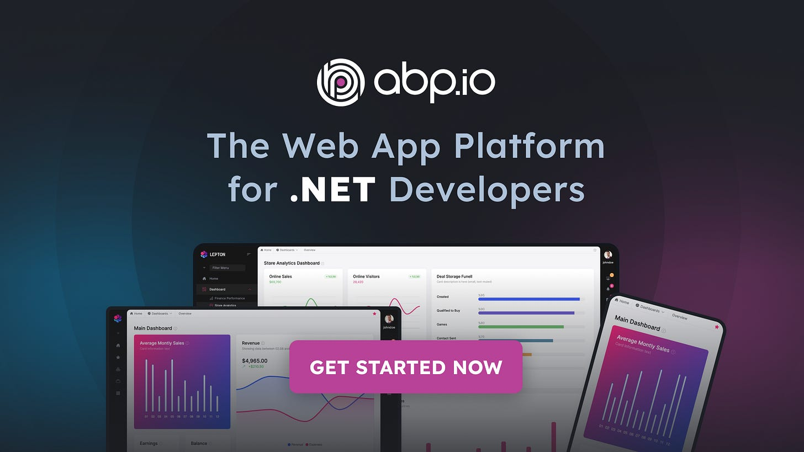
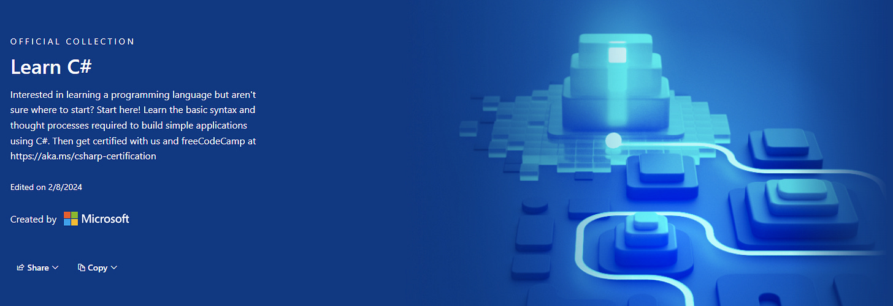
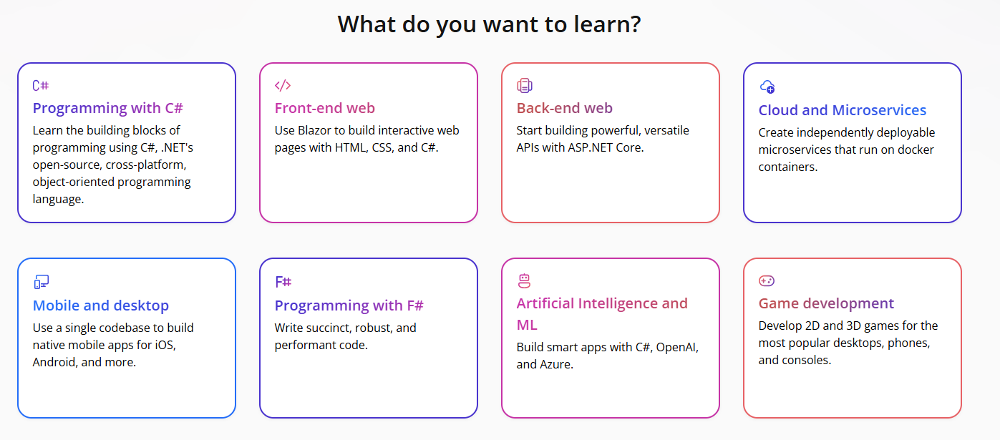
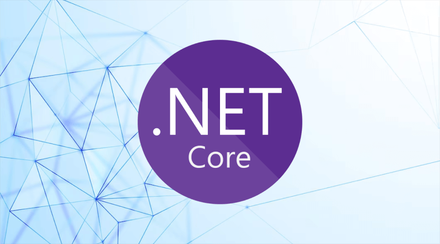
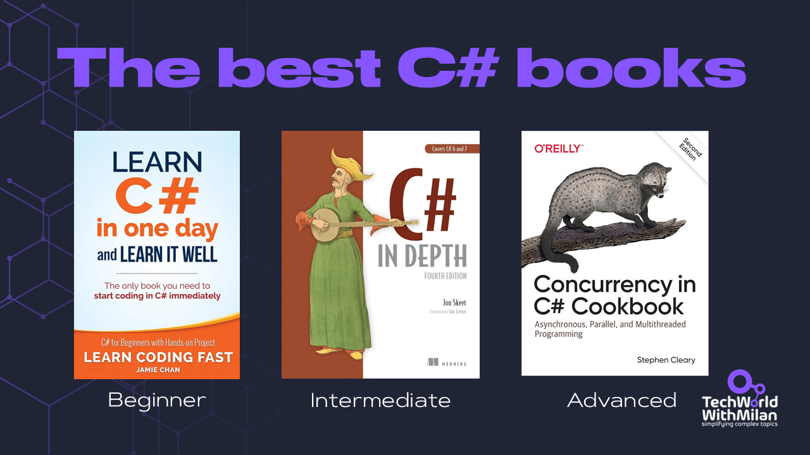
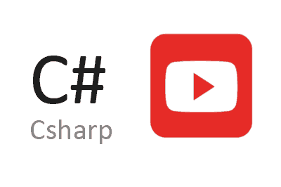
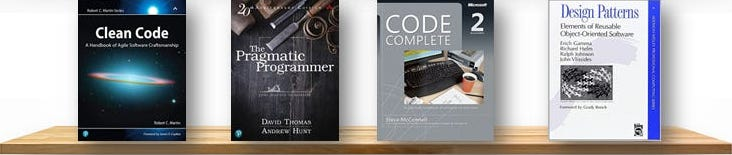
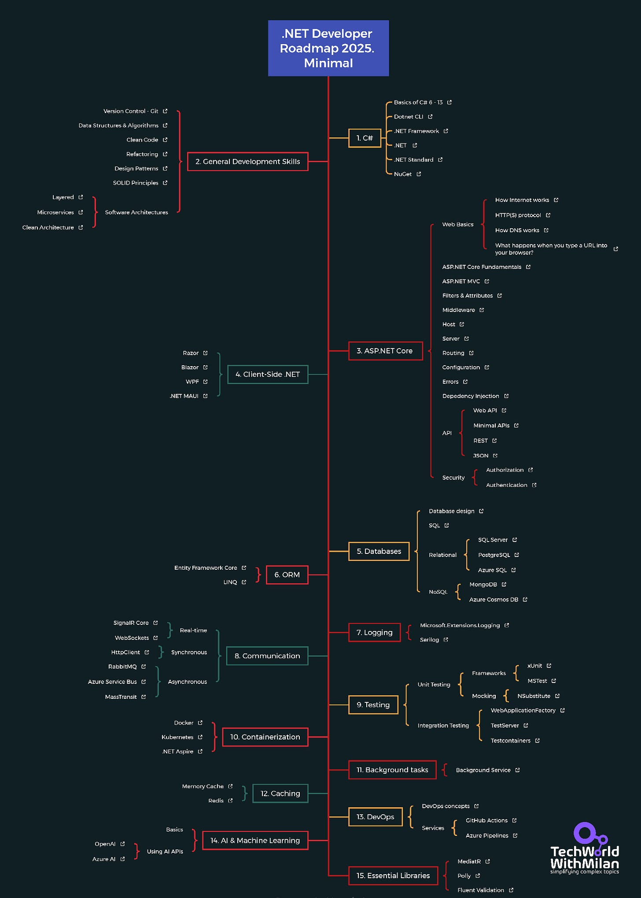

# Recommended learning resources for C# and .NET in 2025.

As of 2025, the .NET ecosystem continues to thrive, with .NET 9 bringing powerful updates and C# remaining a top choice for developers. In the recent [Stack Overflow Developer Survey 2024](https://stackoverflow.blog/2025/01/01/developers-want-more-more-more-the-2024-results-from-stack-overflow-s-annual-developer-survey/), .NET was the library most loved (outside the web)!

Finding the right resources is difficult if you want to become a full-stack or back-end developer in the Microsoft .NET stack or improve your knowledge. This curated list, updated for 2025, will guide you from beginner to advanced levels in C#, .NET, and ASP.NET.

So, let’s dive in.

---

## [ABP.IO: The Web App Platform for .NET Developers (Sponsored)](https://abp.io/?utm_source=newsletter&utm_medium=affiliate&utm_campaign=milanmilanovic_27Feb25)

*[ABP.IO](http://abp.io/) provides the infrastructure and tools to build business solutions using best practices and modern software architectures with .NET. It helps development with pre-built architectural patterns, enterprise-grade modules, and a rich ecosystem of tools, including ABP Studio. It also accelerates application development by offering features like multi-tenancy, domain-driven design, microservices support, and seamless UI integration.*

*This is an excellent opportunity to get started with [ABP.IO](http://abp.io/)! **Enroll now in live ABP training with a 33% discount, available for a limited time**, and learn best practices from ABP experts!*

[Check Now](https://abp.io/?utm_source=newsletter&utm_medium=affiliate&utm_campaign=milanmilanovic_27Feb25)

---

## 1. Learn C#

Start your journey with these carefully selected C# resources, ranging from beginner to advanced levels.

### Beginner-friendly resources:

- **[Microsoft Learn: C# Path](https://dotnet.microsoft.com/en-us/learn/csharp)**[https://dotnet.microsoft.com/en-us/learn/csharp](https://dotnet.microsoft.com/en-us/learn/csharp)- Free, interactive tutorials from Microsoft covering C# basics to advanced topics. Perfect for hands-on learners.

- **[C# Fundamentals for Absolute Beginners (Microsoft](https://learn.microsoft.com/en-us/shows/c-fundamentals-for-absolute-beginners/))** - A video series ideal for those new to coding.
- **[C# for Beginners](https://learn.microsoft.com/en-us/shows/csharp-for-beginners/)** - Scott Hanselman and .NET Distinguished Engineer David Fowler teach you C# from the ground up! (also check [Deep.NET](https://www.youtube.com/playlist?list=PLdo4fOcmZ0oX8eqDkSw4hH9cSehrGgdr1) and [dotnet](https://www.youtube.com/@dotnet/playlists) channel)
- **[C# Tutorial—Full Course for Beginners](https://www.youtube.com/watch?v=GhQdlIFylQ8)**- This freeCodeCamp 4h+ course will introduce you to all of the core concepts in C#.

- **[Udemy: C# for Beginners — Coding From Scratch (.NET Core)](https://www.udemy.com/course/c-and-net-core-for-beginners/)** - Focuses on core concepts with practical coding exercises.

- **[C# Basics for Beginners (Udemy)](https://www.udemy.com/course/csharp-tutorial-for-beginners/)** - A highly rated course by Mosh Hamedani.
- **[Exercism's C# Track](https://exercism.org/tracks/csharp)** - Hands-on exercises with mentor feedback (Free).

### Intermediate resources:

- **[Advanced C# Programming Course](https://www.youtube.com/watch?v=YT8s-90oDC0) -**A 15-hour course on the freeCodeCamp to learn advanced C# programming concepts.
- **[CodeWars C# Kata](https://www.codewars.com/kata/search/csharp)** - Progressive challenges to build problem-solving skills.

## 2. Learn .NET

Master the .NET platform with these official and advanced resources:

- **[Learn.NET](https://dotnet.microsoft.com/en-us/learn)** - Official tutorials covering .NET 9, cross-platform development, and cloud integration.
- **[Become a Full-stack .NET Developer - Advanced Topics (Pluralsight)](https://www.pluralsight.com/courses/full-stack-dot-net-developer)** - A comprehensive path by Mosh Hamedani.

## 3. **Learn ASP.NET**

Build web apps with these ASP.NET Core resources.

### Fundamentals:

- **[ASP.NET Core Fundamentals](https://www.pluralsight.com/courses/aspnet-core-fundamentals)** by Scott Alen: This course covers all the features you'll need to build your first application using ASP.NET Core.
- **[ASP.NET Core Full Course for Beginners](https://www.youtube.com/watch?v=AhAxLiGC7Pc)** by Julio Casal: A free YouTube course focusing on building a RESTful API for a game catalog backend
- **[ASP.NET Core - Cross-Platform Development (Udemy)](https://www.udemy.com/course/learn-aspnet-mvc-and-entity-framework/)**- Learn how to develop an ASP.NET Core application for any operating system using cross-platform tools and the dotnet CLI.

### Advanced Web Development:

- **[Pro ASP.NET Core 6: Develop Cloud-Ready Web Applications Using MVC, Blazor, and Razor Pages](https://amzn.to/3CRkRlP)**[https://amzn.to/3CRkRlP](https://amzn.to/3CRkRlP)- A book by Adam Freeman
- **[Minimal APIs in .NET](https://learn.microsoft.com/en-us/aspnet/core/fundamentals/minimal-apis)** - Building lightweight, performant APIs.
- **[Real-time ASP.NET with SignalR](https://learn.microsoft.com/en-us/aspnet/core/signalr/introduction)** - Building real-time web applications.
- **[gRPC in ASP.NET Core](https://learn.microsoft.com/en-us/aspnet/core/grpc/)** - Implementation guide for high-performance RPCs.
- **[ASP.NET Core Security](https://learn.microsoft.com/en-us/aspnet/core/security/)** - Comprehensive security and authentication patterns.

## 4. Books

Deepen your knowledge with these must-reads.

### Beginner

- **[Learn C# in One Day and Learn It Well](https://amzn.to/3S1WGV4)** - A concise, beginner-friendly book by Jamie Chan (the best for beginners)
- **[The C# Yellow Book](http://www.csharpcourse.com/)** by Rob Miles (the best book overall - free)
- **[The C# Player's Guide](https://amzn.to/4bb9h1u)**- A book by RB Whitaker that takes an interesting approach, humor, casual tone, and examples involving dragons and asteroids (with over 100 hands-on challenges)
- **[C# 13 and .NET 9 – Modern Cross-Platform Development Fundamentals](https://amzn.to/4k8peJT)**- One of the popular books on this topic, focused on beginner to intermediate programmers.

### Intermediate

- **[C# in Depth: Fourth Edition](https://amzn.to/3SikbdO)** - Jon Skeet’s masterpiece (the best for intermediate)
- **[C# 12 in a Nutshell: The Definitive Reference](https://amzn.to/3XcOGnN)**- A book by Joseph Albahari gives you a complete C# 12, top to bottom.
- **[ASP.NET Core in Action](https://amzn.to/4i1Gwqs)** by Andrew Lock. This book will teach you the latest ASP.NET Core applications and .NET patterns, including minimal APIs and minimal hosting.
- **[Dependency Injection Principles, Practices, and Patterns,](https://amzn.to/3DbaCsA)** by Mark Seeman and Steven van Deursen, is a solid book that teaches how to use DI to reduce hard-coded dependencies between application components.

### Advanced

- **[Concurrency in C# Cookbook](https://amzn.to/3Hlgmym)** - Stephen Cleary’s advanced guide to multitasking in C# (the best for advanced)
- **[Writing High-performance .NET Code](https://amzn.to/4gZCVYF)-** A book by Ben Watson demystifies the CLR, teaching you how and why to write code with optimum performance.
- **[Pro .NET Memory Management](https://amzn.to/3DpRTcJ)** by Konrad Kokosa - Understand .NET memory management internal workings, pitfalls, and techniques to avoid a wide range of performance and scalability problems in your software.

## **5. YouTube Channels**

Learn from top .NET creators:

- **[IAmTimCorey](https://www.youtube.com/user/IAmTimCorey)** - Practical tutorials on C#, .NET, and real-world projects.
- **[Programming with Mosh](https://www.youtube.com/user/programmingwithmosh)** - Clear, concise C# and ASP.NET lessons.
- **[Nick Chapsas](https://www.youtube.com/channel/UCrkPsvLGln62OMZRO6K-llg)** - Deep dives into .NET performance and modern practices.
- **[Milan Jovanovic](https://www.youtube.com/c/MilanJovanovicTech)** - Expert tips on clean architecture, .NET and APIs.
- **[Zoran Horvat](https://www.youtube.com/c/zh-code)** - Advanced C# design patterns and techniques.
- **[Nick Cosentino](https://www.youtube.com/@devleader)** - Many C# related videos for all levels, including beginners.

## **6. Learn good practices**

Master software engineering principles.

### **Essential reading:**

- **[Clean code](https://amzn.to/3HmB1lH)** - Robert C. Martin’s classic, still relevant for .NET in 2025.
- **[Code Complete, 2nd Edition](https://amzn.to/3Hqhlgx)** - Steve McConnell’s essential guide for developers.
- **[Design Patterns In Use (E-book)](https://www.patreon.com/techworld_with_milan/shop/design-patterns-in-use-e-book-312304)** - is an essential guide for software developers and designers who want to deepen their understanding of design patterns and their practical applications, with examples in C#.
- **[Why C#](https://newsletter.techworld-with-milan.com/p/why-csharp)** — A comprehensive overview of the C# programming language and its landscape.

### Advanced topics:

- **[Domain-Driven Design in C#](https://learn.microsoft.com/en-us/dotnet/architecture/microservices/microservice-ddd-cqrs-patterns/)** - Microsoft's guide to DDD.
- **[Advanced Unit Testing](https://www.pluralsight.com/courses/advanced-unit-testing)** - Learn how to make unit tests work for you instead of against you (and **[The Art of Unit Testing](https://www.manning.com/books/the-art-of-unit-testing-third-edition)** - Roy Osherove’s book).
- **[Master Design Patterns & SOLID Principles in C#](https://www.youtube.com/watch?v=rylaiB2uH2A)**- A 12-hour course on freeCodeCamp.
- **[Adaptive Code: Agile coding with design patterns and SOLID principles](https://amzn.to/4bfWL0Q)**- A book by Gary McLean Hall that teaches you how to code with the best practices.

Most crucial software development books

Check my full book recommendation:
[
Tech World With Milan NewsletterLearn things that don't change In this issue, we will try to understand why we should learn fundamentals rather than frameworks and what the effect of this is…Read more2 years ago · 702 likes · 17 comments · Dr Milan Milanović](https://newsletter.techworld-with-milan.com/p/learn-things-that-dont-change?utm_source=substack&utm_campaign=post_embed&utm_medium=web)
## **7. Additional materials**

Stay ahead with these 2025-focused extras:

- **[.NET Developer Roadmap 2025](https://github.com/milanm/DotNet-Developer-Roadmap)** - A minimal, clickable PDF roadmap updated for .NET 9 and beyond.
- **[Awesome .NET Libraries](https://github.com/quozd/awesome-dotnet)** - A GitHub collection of tools, frameworks, and software.
- **[.NET Architecture Guides (Microsoft)](https://dotnet.microsoft.com/en-us/learn/dotnet/architecture-guides)** - Best practices for microservices and cloud-native apps.creat

Here is the **minimal** **.NET Developer Roadmap for 2025**.

Minimal .NET Developer Roadmap for 2025

## Moving forward

Remember to choose resources that match your current skill level and learning style. The .NET ecosystem is vast, so focus on mastering fundamentals before moving to advanced topics. Regular practice and hands-on project work will help reinforce your learning.

Anything else to add? Write in the comments.

---

## **[Get my Ultimate .NET Bundle for 2025](https://www.patreon.com/techworld_with_milan/shop/ultimate-net-bundle-for-2025-1519389?utm_medium=clipboard_copy&utm_source=copyLink&utm_campaign=productshare_creator&utm_content=join_link)**

More than 500 pages of expert content—C#, .NET, ASP.NET Core, interview prep, best practices, and more.

**What’s inside:**

- ✅ 𝗔 𝗯𝗿𝗶𝗲𝗳 𝘄𝗮𝗹𝗸 𝘁𝗵𝗿𝗼𝘂𝗴𝗵 .𝗡𝗘𝗧 𝗲𝗰𝗼𝘀𝘆𝘀𝘁𝗲𝗺 – Understand the whole stack of .NET technologies (31 pages)
- ✅ 𝗠𝗼𝗱𝗲𝗿𝗻 𝗖# 𝗢𝘃𝗲𝗿𝘃𝗶𝗲𝘄 (𝗩𝗲𝗿𝘀𝗶𝗼𝗻𝘀 𝟲 𝘁𝗼 𝟭𝟯) – Stay ahead with more than 50 most important features every developer should know (51 pages)
- ✅ 𝗗𝗲𝘀𝗶𝗴𝗻 𝗣𝗮𝘁𝘁𝗲𝗿𝗻𝘀 𝘄𝗶𝘁𝗵 𝗖# – Learn industry best practices from most used patterns on real projects (53 pages)
- ✅ 𝟮𝟬𝟬+ 𝗵𝗮𝗻𝗱𝗰𝗿𝗮𝗳𝘁𝗲𝗱 .𝗡𝗘𝗧 𝗶𝗻𝘁𝗲𝗿𝘃𝗶𝗲𝘄 𝗾𝘂𝗲𝘀𝘁𝗶𝗼𝗻𝘀 & 𝗮𝗻𝘀𝘄𝗲𝗿𝘀 – From beginner to expert (122 pages)
- ✅ 𝗖𝗼𝗺𝗽𝗹𝗲𝘁𝗲 .𝗡𝗘𝗧 𝗥𝗼𝗮𝗱𝗺𝗮𝗽 𝗳𝗼𝗿 𝟮𝟬𝟮𝟱 – A structured learning path with (mostly free) resources (38 pages)
- ✅ 𝗔𝘂𝘁𝗵𝗲𝗻𝘁𝗶𝗰𝗮𝘁𝗶𝗼𝗻 𝗶𝗻 .𝗡𝗘𝗧 (A complete guide) – Learn best practices for securing apps (79 pages)

🔥 𝗘𝘅𝗰𝗹𝘂𝘀𝗶𝘃𝗲 𝗯𝗼𝗻𝘂𝘀𝗲𝘀:

- 🎁 𝗔𝗦𝗣.𝗡𝗘𝗧 𝗖𝗼𝗿𝗲 𝗯𝗲𝘀𝘁 𝗽𝗿𝗮𝗰𝘁𝗶𝗰𝗲𝘀 – Secure, scalable web apps for production (27 pages)
- 🎁 𝗠𝗮𝘀𝘁𝗲𝗿𝗶𝗻𝗴 𝗔𝗦𝗣.𝗡𝗘𝗧 𝗖𝗼𝗿𝗲 𝗺𝗶𝗱𝗱𝗹𝗲𝘄𝗮𝗿𝗲 – A practical guide to understanding all aspects of middleware (23 pages)
- 🎁 𝗖# 𝗣𝗿𝗼𝗴𝗿𝗮𝗺𝗺𝗶𝗻𝗴 𝗖𝗵𝗲𝗮𝘁 𝗦𝗵𝗲𝗲𝘁 (𝟮𝟬𝟮𝟱 𝗘𝗱𝗶𝘁𝗶𝗼𝗻) (73 pages)

This kind of package you cannot find anywhere. It is highly valuable for beginners and experienced developers to upgrade their careers.

[Buy here](https://www.patreon.com/techworld_with_milan/shop/ultimate-net-bundle-for-2025-1519389?utm_medium=clipboard_copy&utm_source=copyLink&utm_campaign=productshare_creator&utm_content=join_link)

(One-time payment. Lifetime access. Updates are free.)

---

## More ways I can help you

1. **📢 [LinkedIn Content Creator Masterclass](https://www.patreon.com/techworld_with_milan/shop/short-linkedin-content-creator-311232?utm_medium=clipboard_copy&utm_source=copyLink&utm_campaign=productshare_creator&utm_content=join_link).**In this masterclass, I share my strategies for growing your influence on LinkedIn in the Tech space. You'll learn how to define your target audience, master the LinkedIn algorithm, create impactful content using my writing system, and create a content strategy that drives impressive results.
2. **📄 [Resume Reality Check](https://www.patreon.com/techworld_with_milan/shop/resume-reality-check-311008?source=storefront)**. I can now offer you a service where I’ll review your CV and LinkedIn profile, providing instant, honest feedback from a CTO’s perspective. You’ll discover what stands out, what needs improvement, and how recruiters and engineering managers view your resume at first glance.
3. **💡 [Join my Patreon community](https://www.patreon.com/techworld_with_milan)**: This is your way of supporting me, saying “**thanks**," and getting more benefits. You will get exclusive benefits, including 📚 all of my books and templates on Design Patterns, Setting priorities, and more, worth $100, early access to my content, insider news, helpful resources and tools, priority support, and the possibility to influence my work.
4. 🚀 **1:1 Coaching:** [Book a working session with me](https://newsletter.techworld-with-milan.com/p/coaching-services). I offer 1:1 coaching for personal, organizational, and team growth topics. I help you become a high-performing leader and engineer.

---

Thanks for reading Tech World With Milan Newsletter! Subscribe for free to receive new posts and support my work.