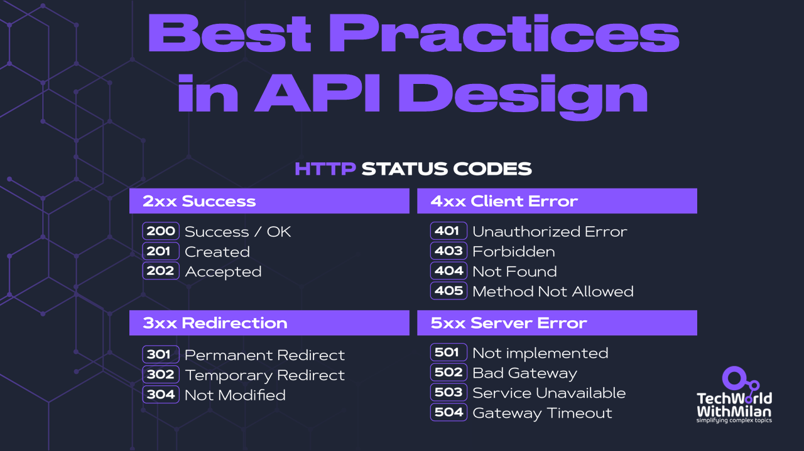
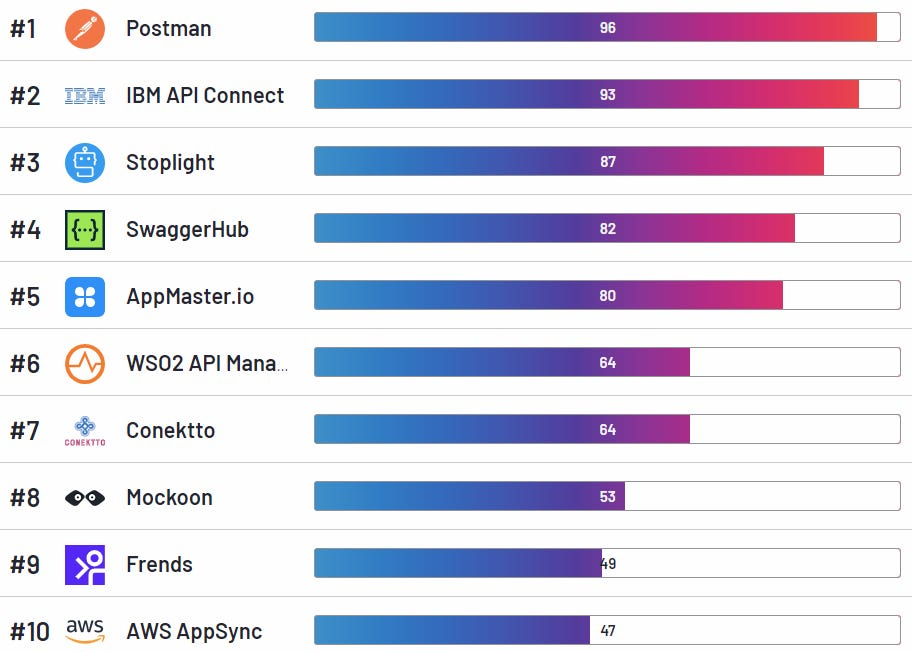

# REST API Design Best Practices

*...every developer need to know.*

## What is API?

The term "Application Programming Interface," or API, refers to a channel of communication between various software services. Applications that transmit requests and responses are referred to as clients and servers, respectively. 

There are different types of **API protocols:**

- **REST** - relies on a client/server approach that separates front and back ends of the API, and provides considerable flexibility in development and implementation.
- **RPC** - The remote procedural call (RPC) protocol is a simple means to send multiple parameters and receive results.
- **SOAP** - Supports a wide range of communication protocols found across the internet, such as HTTP, SMTP and TCP.
- **WebSocket** - Provides a way to exchange data between browser and server via a persistent connection.

Thanks for reading Tech World With Milan Newsletter! Subscribe for free to receive new posts and support my work.

## REST API Design

In our daily work as software engineers, the majority of us utilize or create REST APIs. The standard method of communication between the systems is through APIs. Therefore, it's crucial to properly build REST APIs to avoid issues in the future. A well-defined API should be **easy to work with, concise and hard to misuse**.

Here are some general recommendations:

### **1. Use nouns instead of verbs**

Verbs should not be used in endpoint paths. Instead, the pathname should contain the **nouns** that identify the object that the endpoint that we are accessing or altering belongs to.

For example, instead of using `/getAllClients` to fetch all clients, use `/clients`.

### **2. Use plural resource nouns**

Try to use the **plural form** for resource nouns, because this fits all types of endpoints.

For example, instead of using `/employee/:id/`, use `/employees/:id/`.

### **3. Be consistent**

When we say to be consistent, this means to be **predictable**. When we have one endpoint defined, others should behave in the same way. So, use the same case for resources, the same auth methods for all endpoints, use the same headers, use the same status codes, etc.

### **4. Keep it simple**

We should make naming all endpoints to be **resource-oriented**, as they are. If we want to define an API for users, we would define it as:

`/users`

`/users/124`

So, the first API gets all users and the second one gets a specific user.

### **5. User proper status codes**

This one is super important. There are many **HTTP status codes**, but we usually use just some of them. Don't use too many, but use the same status codes for the same outcomes across the API, e.g.,

- **200** for general success.
- **201** for successful creation.
- **202** for successful request.
- **204** for no content.
- **307** for redirected content.
- **400** for bad requests.
- **401** for unauthorized requests.
- **403** for missing permissions.
- **404** for missing resources.
- **5xx** for internal errors.

### **6. Don’t return plain text**

REST APIs should accept JSON for request payload and also respond with **JSON** because it is a standard for transferring data. Yet, it is not enough just to return a body with JSON-formatted string, we need to specify a Content-Type header too to be application/json. The only exception is if we’re trying to send and receive files between the client and server.

### **7. Do proper error handling**

Here we want to eliminate any confusion when an error occurs, so we need to handle errors properly and return a response code that indicates what error happened (from **400 to 5xx errors**). Along with a status code we need to return some details in the response body.

### **8. Have good security practices**

We want that all communication between a client and a server is protected, which means that we need to use **SSL/TLS all the time**, with no exceptions. Also, allow auth via API keys, which should be passed using a custom HTTP header, with an expiration day.

### **9. Use pagination**

Use pagination if our API needs to return a lot of data, as this will make our API future-proof. Use `page `and `page_size `is recommended here.

For example, `/products?page=10&page_size=20`

### **10. Versioning**

It is very important to version APIs **from the first version**, as there could be different users for our APIs. This will allow our users not to be affected by changes that we can do in the future. API versions can be passed through HTTP headers or query/path params.

For example, `/products/v1/4`

Also, don't forget to **document your APIs**, because API will be only good as its documentation. The docs should show examples of complete request/response cycles. Here we can use the **[OpenAPI](https://swagger.io/specification/)** definition as a source of truth.

## Tools

If you want to start developing APIs, check **[Swagger](https://swagger.io/)** and **[OpenAPI](https://swagger.io/specification/)** specifications, **[Postman](https://www.postman.com/)** or **[Stoplight](https://stoplight.io/)**. Check the full list [here](https://www.g2.com/categories/api-design?tab=highest_rated), created by G2:

Top 10 API Design Tools by G2

---

Thanks for reading Tech World With Milan Newsletter! Subscribe for free to receive new posts and support my work.