# How to Scale an App up to 10 Million Users on Azure

*A deep-dive into an Azure Solution Architecture.*

Growing an application from a small user base to a large one is a challenging task. The requirements for a system for a single user differ significantly from those serving millions.

How can we transition from a basic application to a service that can serve the globe? This article outlines the steps involved in scaling up an Azure-based system, starting from a single user and progressing to over 1 million users.

We will examine key principles, including statelessness, caching, auto-scaling, decoupling, observability, and database scaling, and demonstrate how Azure's cloud services are integrated at each stage.

By the end, you will have a clear roadmap for expanding a system using practical architectural strategies and proper decisions based on real-world expertise.

In particular, we will talk about scaling on Azure, stage by stage:

1. **Understanding Azure's Global Infrastructure**. Let’s start by understanding what Azure can offer to us.
2. **Single-user start.** A modular monolith on App Service + SQL, why to avoid premature microservices, and the importance of stateless code from day one.
3. **1,000 users.** Vertical scaling for quick wins, adding redundancy with multiple instances, introducing Redis + CDN for hot reads, and keeping latency predictable.
4. **10,000+ users.** Horizontal scaling with App Service autoscale, load balancing options (LB vs App Gateway vs Front Door), externalized session state, and first steps into read replicas.
5. **100k-500k users.** Designing for resilience with multi-AZ deployments, async messaging (Service Bus, Functions), selective microservice extraction, advanced caching patterns, and cost optimization.
6. **1M+ users.** Multi-region active-active with Front Door, trade-offs in consistency vs availability, sharding and polyglot persistence, full microservices orchestration, and event-driven architecture.

So, let’s dive in.

---

## [CodeRabbit: Free AI Code Reviews in CLI](https://coderabbit.link/techwithmilan)

*[CodeRabbit CLI](https://coderabbit.link/techwithmilan) is an AI code review tool that runs directly in your terminal. It provides intelligent code analysis, catches issues early, and integrates seamlessly with AI coding agents like Claude Code, Codex CLI, Cursor CLI, and Gemini to ensure your code is production-ready before it ships.*

- *Enables pre-commit reviews of both staged and unstaged changes, creating a multi-layered review process.*
- *Fits into existing Git workflows. Review uncommitted changes, staged files, specific commits, or entire branches without disrupting your current development process.*
- *Reviews specific files, directories, uncommitted changes, staged changes, or entire commits based on your needs.*
- *Supports programming languages including JavaScript, TypeScript, Python, Java, C#, C++, Ruby, Rust, Go, PHP, and more.*
- *Offers free AI code reviews with rate limits, allowing developers to experience senior-level reviews at no cost.*

[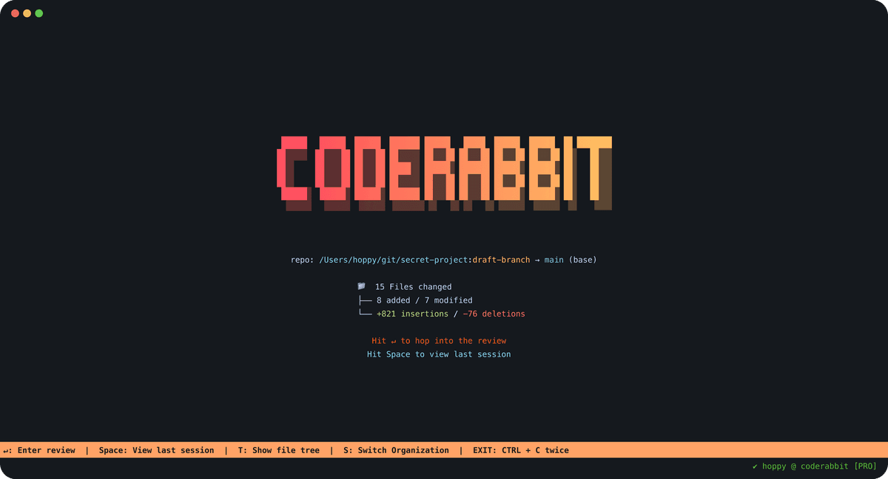](https://coderabbit.link/techwithmilan)

[Get started today](https://coderabbit.link/techwithmilan)

---

**[Sponsor this newsletter](https://newsletter.techworld-with-milan.com/p/sponsorship-of-tech-world-with-milan)**

## 1. Understanding Azure's Global Infrastructure

Before diving into architecture, you need to understand what Azure gives you in 2025. Azure operates **in over 70 regions worldwide and 400+ datacenters**, more than 400 data centers, surpassing any other cloud provider. Each region is a set of data centers deployed in a specific geographic location, such as Central US or Western Europe.

Each region contains **multiple availability zones** (more than 120), which are physically separate data centers within a 2ms latency of each other. This matters because your architecture decisions depend on these building blocks.

Azure's backbone network carries **200+ Tbps of traffic globally**. When you deploy in multiple regions, your traffic rides Microsoft's private network, not the public internet.

This difference alone can **cut latency by 30-50ms between regions**. Understanding this helps you make proper decisions about where to place services and how to route traffic.

The real power comes from **Azure's managed services**. Unlike 2010, when companies ran everything on VMs, modern Azure provides services that abstract away the complexity. [Azure SQL Database](https://azure.microsoft.com/en-us/products/azure-sql/database) handles replication, backups, and failover automatically, while [Cosmos DB](https://azure.microsoft.com/en-us/products/cosmos-db) guarantees 99.999% availability with single-digit millisecond latency globally.

These scaling decisions align with **[Azure's Well-Architected Framework](https://learn.microsoft.com/en-us/azure/well-architected/)**: reliability, performance, cost, operations, and security. We'll touch on each pillar throughout this journey, but focus on**practical implementation over theory**.

[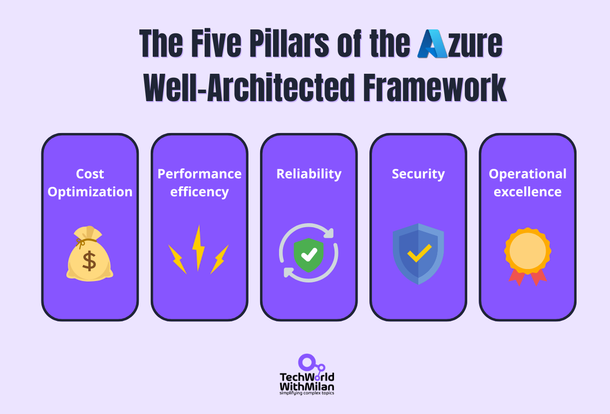](https://substackcdn.com/image/fetch/$s_!zyWr!,f_auto,q_auto:good,fl_progressive:steep/https%3A%2F%2Fsubstack-post-media.s3.amazonaws.com%2Fpublic%2Fimages%2Fe5bdb437-a2e7-42c7-9554-bc15ad8fe2b3_1222x831.png)The five pillars of the Azure Well-Architected Framework

Every architecture choice involves trade-offs: redundancy improves reliability but increases cost, and caching boosts performance but adds complexity.

Also, when we talk about Azure infrastructure, it’s useful to view the map of all **Azure regions**:

[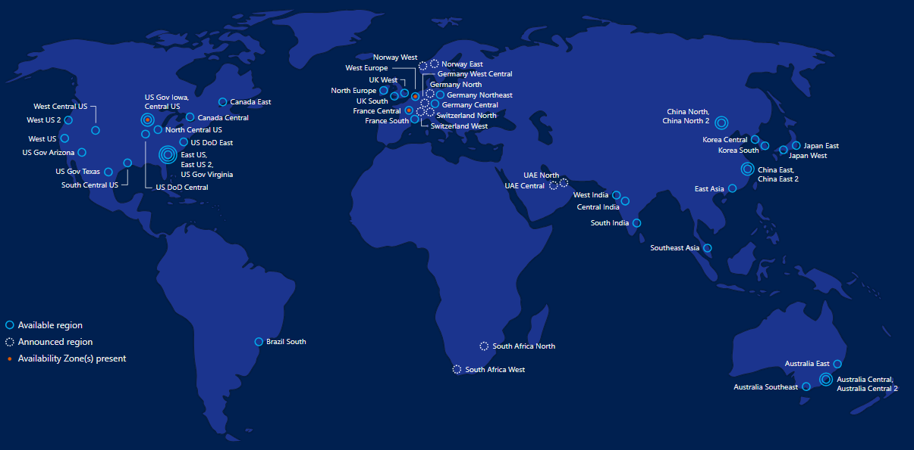](https://substackcdn.com/image/fetch/$s_!2W7k!,f_auto,q_auto:good,fl_progressive:steep/https%3A%2F%2Fsubstack-post-media.s3.amazonaws.com%2Fpublic%2Fimages%2F6f8bf1c5-9e04-423b-8ecc-7f9a43d6bfcd_1205x595.png)Azure [regions](https://azure.microsoft.com/en-us/explore/global-infrastructure/geographies/)

> ℹ️ *[Microsoft Datacenters](https://datacenters.microsoft.com/globe/explore/), as the animated globe.*

Also, Azure provides **services** that are inherently scalable. Here are the key services you'll use:

- **Compute**: [App Services](https://azure.microsoft.com/en-us/products/app-service) with autoscaling, [AKS clusters](https://azure.microsoft.com/en-us/products/kubernetes-service), [Azure Functions](https://azure.microsoft.com/en-us/products/functions) for serverless
- **Storage**: [Blob Storage](https://azure.microsoft.com/en-us/products/storage/blobs) for static content, [Azure SQL Database](https://azure.microsoft.com/en-us/products/azure-sql/database) with serverless scaling
- **Networking**: [Application Gateway](https://azure.microsoft.com/en-us/products/application-gateway), [Front Door](https://azure.microsoft.com/en-us/products/frontdoor), [CDN](https://azure.microsoft.com/en-us/products/cdn)
- **Caching**: [Azure Cache for Redis](https://azure.microsoft.com/en-us/products/cache)
- **Messaging**: [Service Bus](https://azure.microsoft.com/en-us/products/service-bus) for asynchronous processing
- **Monitoring**: [Azure Monitor,](https://azure.microsoft.com/en-us/products/monitor) [Application Insights](https://learn.microsoft.com/en-us/azure/azure-monitor/visualize/insights-overview)
- **Security**: [Azure WAF](https://azure.microsoft.com/en-us/products/web-application-firewall) (Front Door/Application Gateway) and [DDoS Protection](https://learn.microsoft.com/en-us/azure/ddos-protection/ddos-protection-overview)   (P1/P2)

Note that some services scale automatically (such as [Azure Functions](https://azure.microsoft.com/en-us/products/functions)), others require configuration (like [AKS autoscaling](https://learn.microsoft.com/en-us/azure/aks/cluster-autoscaler-overview)), and some necessitate architectural changes (moving from a monolith to microservices).

> *👉 Learn more about Azure here:*
[
Tech World With Milan NewsletterHow to learn Microsoft AzureThis week, we talk about the following…Read more3 years ago · 10 likes · Dr Milan Milanović](https://newsletter.techworld-with-milan.com/p/how-to-learn-azure?utm_source=substack&utm_campaign=post_embed&utm_medium=web)
## 2. Single User - Simple beginning

So, let’s start from the simplest case, we have only one user (or close to that). The biggest mistake engineers make in this case is **building it for an imagined scale**, such as millions of users. And this is very wrong.

**You don't need microservices for your first thousand users**. You don't need Kubernetes when a simple App Service works. Every architectural decision should be reversible and made based on actual, measured pain points.

Think of scaling like rebuilding a ship while sailing. You can't stop redesigning everything. You measure what's failing, fix that specific problem, then measure again. This iterative approach means you're always solving real problems, not imagined ones.

So, at the very start, **simplicity rules.** Especially if you’re a startup and want to go fast. With minimal load, you can run everything on a single server: the web application, database, and even a basic in-memory cache all live together.

For example, you might deploy an **[Azure App Service](https://azure.microsoft.com/en-us/products/app-service)** instance connected to a lightweight **[Azure SQL Database](https://azure.microsoft.com/en-us/products/azure-sql/database)** on the same machine or use an all-in-one VM. This monolithic setup is easy to develop and deploy, with no distributed complexities, no network calls between tiers.

However, a single-server design has obvious limitations. It’s a **single point of failure** – if that server goes down, your entire app goes offline. It also has a **fixed capacity**: one machine can handle only a limited number of requests and a finite amount of CPU/RAM.

In this early stage, these constraints are usually acceptable. The priority is rapid development and validation of the product, rather than over-engineering for scale.

That said, it’s still wise to code with an eye on future growth. **Statelessness** is key from day one, which means that we want to ensure the web server doesn’t store user session data or other persistent state locally. Instead, even with one server, plan to keep state in the database or a shared store.

This way, **adding more servers later won’t break user sessions**. Likewise, abstract your data access and use caching in code (e.g., in-memory objects) where sensible, knowing you can upgrade to a distributed cache later.

Regarding your first solution architecture, we will follow an approach called **[Evolutionary Architecture](https://www.thoughtworks.com/insights/decoder/e/evolutionary-architecture)**, which is a method of building software that evolves over time as business priorities change.

By following this approach, our initial app architecture should be a **[Modular Monolith](https://newsletter.techworld-with-milan.com/p/what-is-a-modular-monolith)**. This architecture allows us to create natural boundaries while keeping related code together. This will enable us to split and grow in the future.

Modular Monolith Architecture

Such an app can be deployed to one Azure App Service B2 instance ($55/month) running your application, one Azure SQL Database S1 tier (20 DTUs, ~$30/month), and (optionally) Azure Blob Storage for static files. Total monthly cost should be around $100-$200.

[StackOverflow ran on a single database server](https://newsletter.techworld-with-milan.com/p/stack-overflow-architecture) until it had 10 million monthly visitors. **Don't over-engineer early.**

The image below shows the simple Azure architecture for a small number of users:

[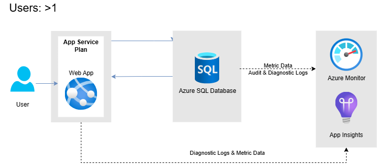](https://substackcdn.com/image/fetch/$s_!_Nal!,f_auto,q_auto:good,fl_progressive:steep/https%3A%2F%2Fsubstack-post-media.s3.amazonaws.com%2Fpublic%2Fimages%2Fbf29cf82-5d9c-45e6-b0d9-3e97986904fc_743x329.png)Basic single-server architecture on Azure

Also, we want to monitor everything, so we recommend adding [Application Insights](https://learn.microsoft.com/en-us/azure/azure-monitor/app/app-insights-overview) from day one.

Move beyond this setup when:

- Response times consistently exceed 500ms under normal load
- Database becomes the bottleneck (high CPU, long query times)
- You need better fault tolerance than a single region provides

> *👉 Learn more about **Modular Monolith** architecture:*
[
Tech World With Milan NewsletterWhat is a Modular Monolith?Microservices are popular for their scalability but come with complexity and operational overhead. They have become a big hype in the industry, and you can see microservices everywhere. On the other side, modular monolith offers a middle ground—keeping the simplicity of a monolith while allowing for future scalability. Here’s why it might be the right c…Read morea year ago · 154 likes · 10 comments · Dr Milan Milanović](https://newsletter.techworld-with-milan.com/p/what-is-a-modular-monolith?utm_source=substack&utm_campaign=post_embed&utm_medium=web)
## 3. 1,000 Users - Preparing for growth

When usage ramps up to hundreds or a few thousand users, problems with the single-server or a basic approach with minimal infrastructure begin to emerge. In particular, when response times exceed 500ms for 95th percentile requests, the database CPU consistently above 70%, or error rates exceed 0.1%. What could happen is that pages might load more slowly under peak load, or the database queries might become slow.

The first adjustments typically involve **vertical scaling** and basic tier separation, if you were on a one-machine setup.

### Vertical scaling

The quick fix for increased traffic is often to provide your server with more power – a larger VM size or a higher App Service tier with more CPU/RAM. Vertical scaling is easy; you don’t have to change your application architecture, just the hardware it runs on.

In Azure, you can ramp an Azure SQL Database to a higher performance tier or increase an App Service Plan to use more cores and memory, without downtime. And all apps working on that Service Plan will have more power.

[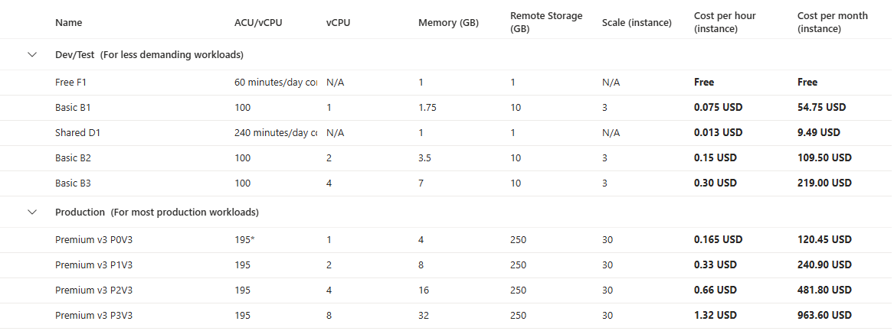](https://substackcdn.com/image/fetch/$s_!YB6f!,f_auto,q_auto:good,fl_progressive:steep/https%3A%2F%2Fsubstack-post-media.s3.amazonaws.com%2Fpublic%2Fimages%2Fbdf10a30-4a5d-42cc-91b2-ffc85dd3450d_1167x433.png)Azure App Service plan hardware

This can carry you through moderate traffic increases. **However, vertical scaling has its own inherent limitations and drawbacks**. There’s always a maximum size of machine available, and bigger instances get exponentially more expensive.

Yet, you still manage your costs easily.

> **ℹ️ Horizontal vs Vertical scaling**. *Vertical scaling (bigger machines) is simpler and sometimes unavoidable (you can’t horizontally partition everything easily, e.g., a complex SQL query might need one big DB server). Horizontal scaling (more, smaller machines) is usually the only way to handle truly large scale once vertical limits hit.*
> 
> *Horizontal scale gives you redundancy and can be cost-effective using many commodity instances instead of one giant server. But it comes with complexity: you need load balancers, data synchronization, and software to handle distributed work.*
> 
> [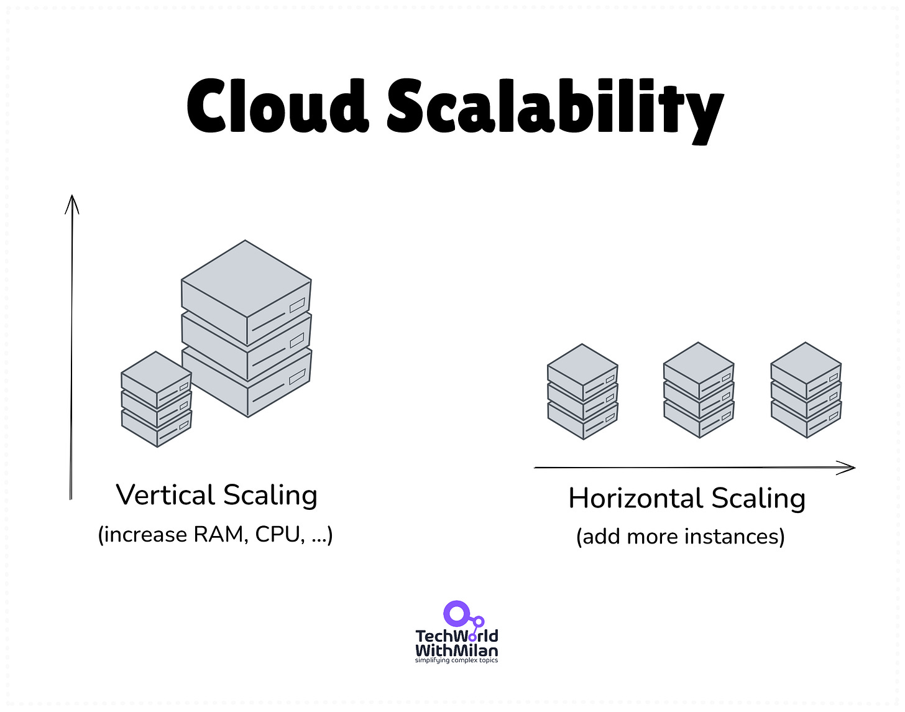](https://substackcdn.com/image/fetch/$s_!7cX-!,f_auto,q_auto:good,fl_progressive:steep/https%3A%2F%2Fsubstack-post-media.s3.amazonaws.com%2Fpublic%2Fimages%2Fc337cd81-8e39-41c9-90f5-04a256703bec_2260x1777.png)
> 
> ***A rule of thumb:** scale vertically to handle load until it becomes impractical or too expensive, then invest the engineering effort to scale horizontally.*

### Redundancy

At ~1k users, you’re close to needing redundancy. Here, you should start thinking about **load balancing** and additional instances, even if they are not fully required yet. Consider running two instances of the app behind an [Azure Load Balancer](https://learn.microsoft.com/en-us/azure/load-balancer/load-balancer-overview) or [Azure Application Gateway](https://learn.microsoft.com/en-us/azure/application-gateway/overview) for basic [active-passive redundancy](https://learn.microsoft.com/en-us/azure/well-architected/reliability/highly-available-multi-region-design).

Many teams at this stage run one active server and keep a second one ready to take over if the first fails (warm standby).[Azure App Service](https://azure.microsoft.com/en-us/products/app-service) can automatically maintain multiple instances and distribute traffic between them, effectively acting as a built-in load balancer.

You may also consider introducing a **basic cache** at this stage if your database is performing repeated, heavy reads. You can use an in-memory cache, or [Azure Cache for Redis](https://azure.microsoft.com/en-us/products/cache), which could be added to store frequently accessed data, reducing database load. A simple C2 standard instance (2.5GB, ~$160/month) can handle millions of requests.

[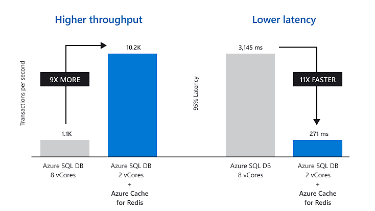](https://substackcdn.com/image/fetch/$s_!ypxx!,f_auto,q_auto:good,fl_progressive:steep/https%3A%2F%2Fsubstack-post-media.s3.amazonaws.com%2Fpublic%2Fimages%2Fe0c0488c-87dc-40c1-b5e9-45d381aeedc7_734x413.png)Azure Cache for Redis (source: Microsoft)

For example, if your app displays the same reference data to all users, caching it in Redis means the web app can fetch it from the cache in microseconds instead of querying the database each time.

Here is the Azure Architecture with [Azure Front Door](https://learn.microsoft.com/en-us/azure/frontdoor/front-door-overview) and [Application Gateway](https://learn.microsoft.com/en-us/azure/application-gateway/overview) for load balancing between two availability zones, each one holding an instance of an app. The Redis Cache and the database are shared among the instances. Here are are still in the same region, with low latencies.

[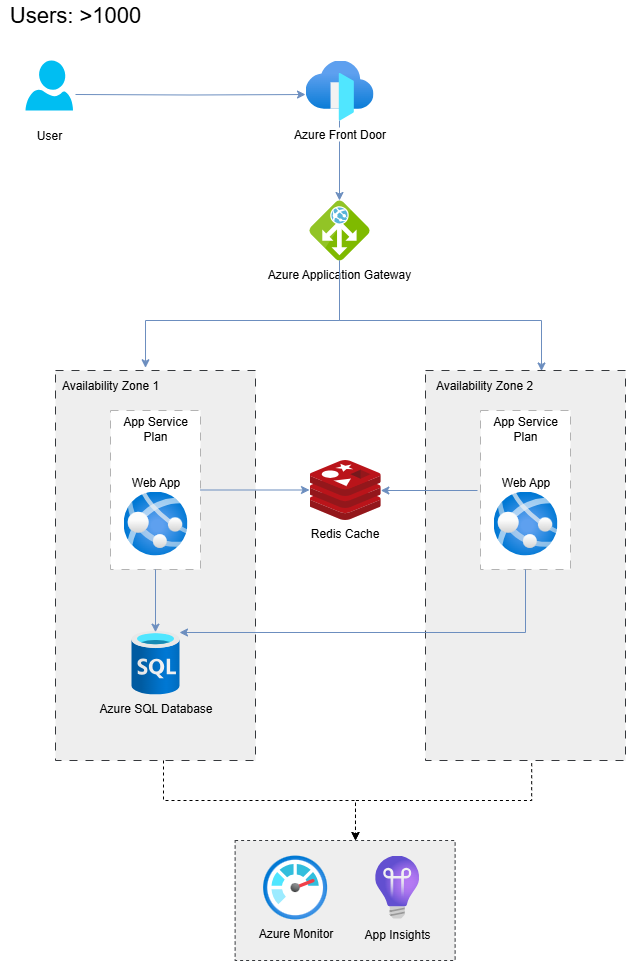](https://substackcdn.com/image/fetch/$s_!vIdM!,f_auto,q_auto:good,fl_progressive:steep/https%3A%2F%2Fsubstack-post-media.s3.amazonaws.com%2Fpublic%2Fimages%2Fbcf183ca-bf94-498c-a2ed-93568ffc2d91_626x961.png)Azure architecture with Redis Cache and two availability zones

> **➡️*****Load Balancer** is a service that distributes incoming traffic across many servers or resources. Usually, we have two or more web servers on the backend, and it **distributes network traffic between them**. Its primary purpose is to use resources optimally.*
> 
> *A more equal task allocation and increased capacity can enhance the system's responsiveness and reliability. There are three load balancers at a high level: hardware-based, cloud-based, and software-based.*

## 4. 10,000+ Users - Meet Horizontal Scaling

When traffic reaches the tens of thousands, you need to **scale out (horizontally)** – not just up. At this point, a single application server will struggle to keep up with concurrent users, regardless of the size of the VM or App Service Plan.

The solution is **horizontal scaling**, which means adding more servers to share the load. This is where true **load balancing** becomes critical.

In Azure, scaling out might mean increasing the instance count of your App Service (e.g., running 4 or 10 instances instead of one) or deploying your app on a cluster of VMs behind an [Azure Load Balancer](https://learn.microsoft.com/en-us/azure/load-balancer/load-balancer-overview).

Azure’s load balancing options include [Azure Load Balancer](https://learn.microsoft.com/en-us/azure/load-balancer/load-balancer-overview) at Layer 4 (TCP/SSL), [Azure Application Gateway](https://learn.microsoft.com/en-us/azure/application-gateway/overview) at Layer 7 (HTTP with features such as SSL offload and path-based routing), or [Azure Front Door](https://learn.microsoft.com/en-us/azure/frontdoor/front-door-overview) if you require global routing.

At 10k users (likely spread across regions), a typical setup might use an **[Azure Application Gateway](https://learn.microsoft.com/en-us/azure/application-gateway/overview) or [Azure Front Door](https://learn.microsoft.com/en-us/azure/frontdoor/front-door-overview)** to distribute incoming HTTP requests to a pool of identical app servers. The load balancer ensures that no single server is overwhelmed and also provides failover – if one instance goes down, traffic is automatically routed to the others.

When we discuss the web tier, it must be effectively scaled out to**be stateless**. This means that any given request can be directed to any server without issue. If you were careful in earlier stages, session state and user-specific data are already stored in a shared database or cache, rather than in memory on a single server.

Now you can run, say, 5 web servers and not care which one handles a login – they all connect to the same backend stores for data. In contrast, a stateful design (e.g., storing a session in process memory) would require “sticky sessions” (pinning a user to the same server), which hurts load distribution and failover.

With multiple web instances, configure **auto-scale rules** to handle variability. [Azure App Service Autoscale](https://learn.microsoft.com/en-us/azure/app-service/manage-automatic-scaling) can add or remove instances based on metrics like CPU usage, memory, or request queue length. For example, you might set it to add an instance if the CPU usage stays above 70% for 5 minutes, and remove one when it drops below 30%.

[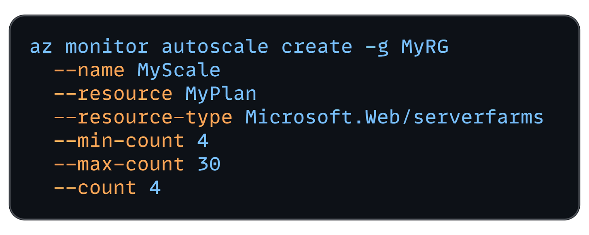](https://substackcdn.com/image/fetch/$s_!TdZF!,f_auto,q_auto:good,fl_progressive:steep/https%3A%2F%2Fsubstack-post-media.s3.amazonaws.com%2Fpublic%2Fimages%2Fca8e06a4-655e-4541-b68c-fe3ce1eb1fd6_1500x600.png)Azure CLI: Autoscale App Service Plan

This **elasticity** ensures that you use just the right number of servers for the current load, without the need for constant over-provisioning. And this is one of the main advantages of Cloud.

Also, if you haven’t already, **externalize session state** now – use[Azure Cache for Redis](https://azure.microsoft.com/en-us/products/cache) or a database to store user sessions, shopping carts, or other transient data that previously resided in memory. This way, when server X caches some user data and the next request goes to server Y, it can retrieve that data from the shared cache.

Here is the updated Azure architecture, which utilizes [Azure Front Door](https://learn.microsoft.com/en-us/azure/frontdoor/front-door-overview), [Application Gateway](https://learn.microsoft.com/en-us/azure/application-gateway/overview), [Redis Cache](https://azure.microsoft.com/en-us/products/cache), multiple app instances, and an [Azure SQL Database read replica](https://learn.microsoft.com/en-us/answers/questions/912341/azure-sql-server-database-read-only-copy) for improved read performance. We will explain the details in the next sections.

[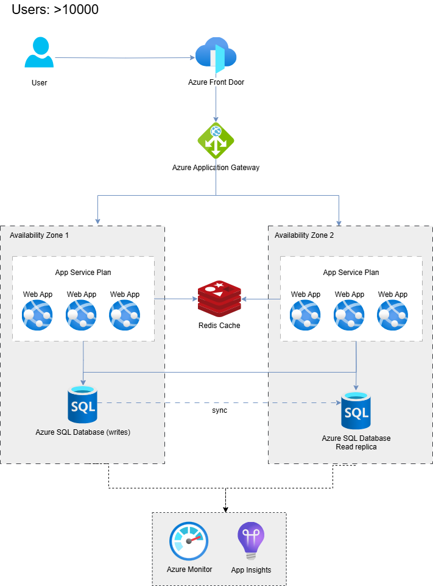](https://substackcdn.com/image/fetch/$s_!Sctr!,f_auto,q_auto:good,fl_progressive:steep/https%3A%2F%2Fsubstack-post-media.s3.amazonaws.com%2Fpublic%2Fimages%2Fa0e562e1-4542-4957-92f2-3561ad6a84b0_711x961.png)Load-balanced web tier with multiple stateless app servers behind Azure Load Balancer, shared Redis cache, and primary database with read-replica

### Caching

With 10k+ users, read traffic to your database can skyrocket. Every new page view or API call likely hits the database. This is the latest time to introduce a dedicated **caching layer** if you haven’t already. [Azure Cache for Redis](https://azure.microsoft.com/en-us/products/cache) is a natural choice.

The principle is simple: whenever your app reads some data that is expensive or frequently needed, store it in Redis. Subsequent requests first check the Redis cache: if the data is present (a cache hit), it is served in microseconds; if not, the database is queried (cache miss), and then **the cache** is populated for next time.

If done well, caching can drastically reduce database load and improve response times (studies show up to **~60% performance improvement from effective caching**).

Typical data to cache includes:

- Results of frequent read queries (e.g., trending items, user profiles)
- Computed results of expensive operations, and
- Static reference data.

But, be mindful of **[cache invalidation](https://en.wikipedia.org/wiki/Cache_invalidation)** – cached data that goes stale should be updated or evicted. [Azure Redis Cache](https://azure.microsoft.com/en-us/products/cache) supports features such as key expiration and data change notifications to help manage this.

> *“There are only two hard things in Computer Science: cache invalidation and naming things.” - Phil Karlton*

### Database scaling

At 10k+ users, your database might be feeling the pressure, especially for read-heavy workloads. When your database reaches 4TB (Azure SQL's limit), you need **database replication**, which involves either **horizontal sharding**or **vertical partitioning** (splitting the database by function or purpose).

On Azure, your primary strategy for scaling is to utilize **[Azure SQL Hyperscale,](https://learn.microsoft.com/en-us/azure/azure-sql/database/service-tier-hyperscale?view=azuresql)** which enables high availability prior to sharding. Hyperscale supports very large databases (~100 TB) and read scale-out.

[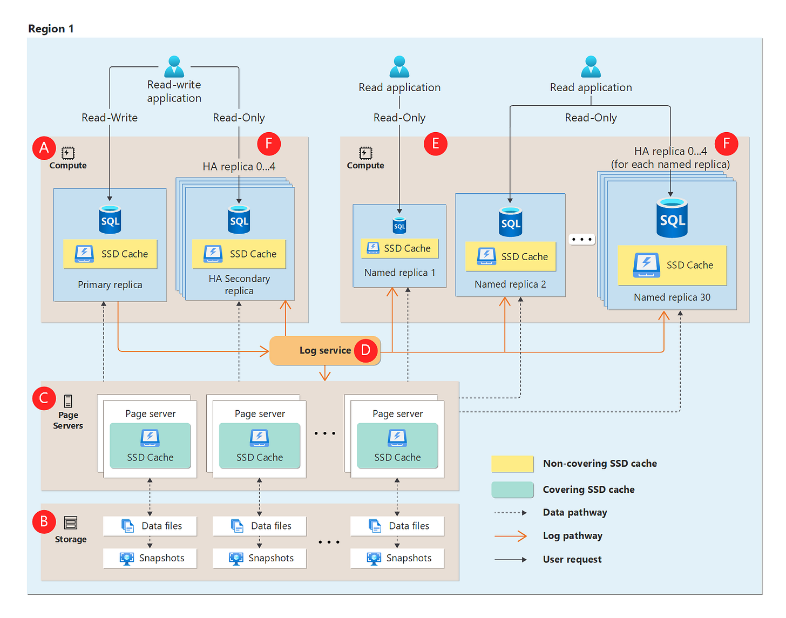](https://substackcdn.com/image/fetch/$s_!FyJA!,f_auto,q_auto:good,fl_progressive:steep/https%3A%2F%2Fsubstack-post-media.s3.amazonaws.com%2Fpublic%2Fimages%2F1b17e863-1599-469d-94a1-bd78dc7a0fbb_1688x1328.png)Azure SQL Hyperscale Architecture (source: [Microsoft](https://learn.microsoft.com/en-us/azure/azure-sql/database/hyperscale-architecture?view=azuresql))

Another strategy is **[read replicas](https://learn.microsoft.com/en-us/answers/questions/912341/azure-sql-server-database-read-only-copy)**. [Azure SQL Database](https://azure.microsoft.com/en-us/products/azure-sql/database) offers a [read scale-out feature](https://learn.microsoft.com/en-us/azure/azure-sql/database/read-scale-out?view=azuresql) in its premium tiers, where you get one or more read-only replicas to offload read queries. It is enabled by default on new Premium, Business Critical, and Hyperscale databases. Be warned here that **read replicas introduce replication lag**(typically 1-5 seconds). Never use them for operations that require immediate consistency, such as payment confirmations.

[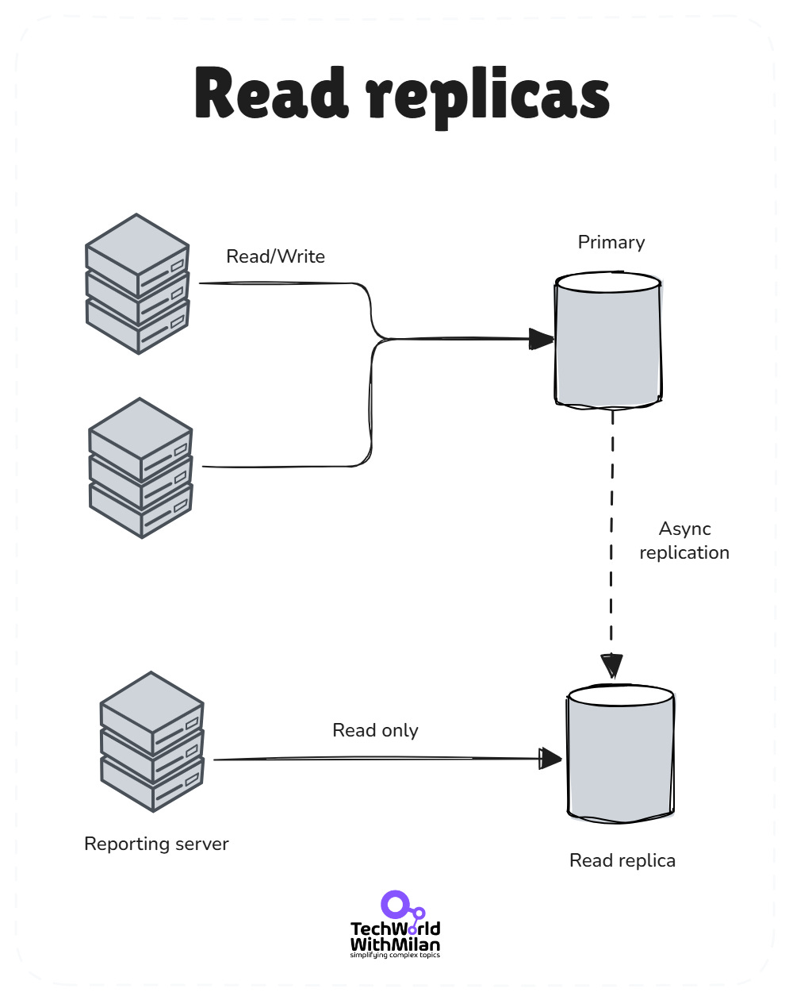](https://substackcdn.com/image/fetch/$s_!9EK-!,f_auto,q_auto:good,fl_progressive:steep/https%3A%2F%2Fsubstack-post-media.s3.amazonaws.com%2Fpublic%2Fimages%2F1ad96f3c-4faf-4354-98cb-b11d4b90098e_995x1260.png)Read replicas

Alternatively, you might use **[Azure SQL’s Active Geo-Replication](https://learn.microsoft.com/en-us/azure/azure-sql/database/active-geo-replication-overview?view=azuresql)** to create secondary readable copies in the same or different regions for distributing read traffic. If using [Cosmos DB](https://azure.microsoft.com/en-us/products/cosmos-db), it automatically handles scaling reads across regions.

The main idea here is to **let the primary database focus on writes, while one or more secondaries handle a significant portion of the read volume**. This improves throughput and provides some resilience (if a primary fails, a secondary can take over).

At this stage, **vertical scaling** of the database might still be part of the plan as well. You may scale up the Azure SQL instance to a higher tier for increased CPU/IO throughput, in addition to considering replicas.

The image below shows the difference between Horizontal and Vertical Partitioning.

[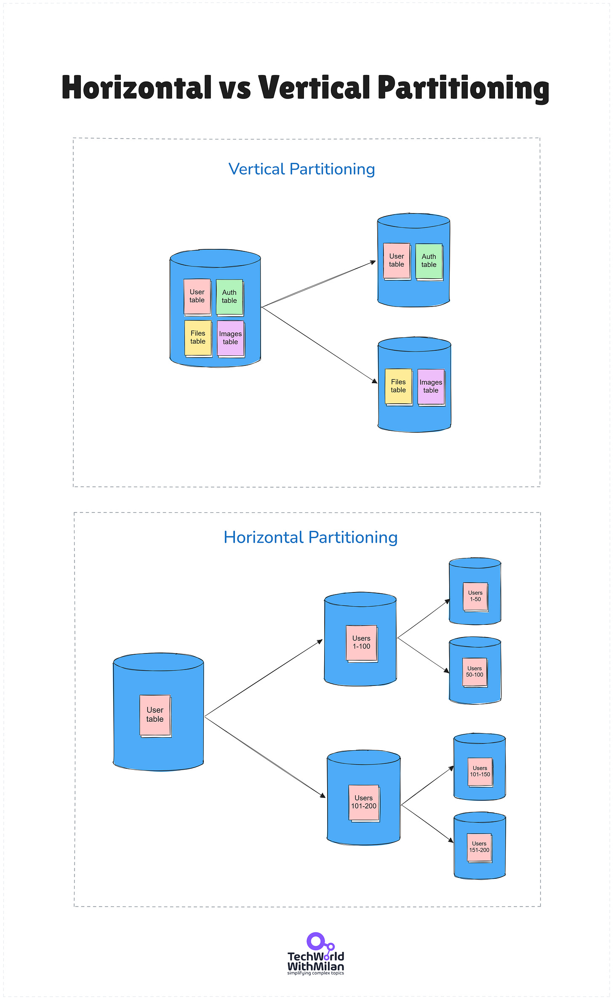](https://substackcdn.com/image/fetch/$s_!W1sy!,f_auto,q_auto:good,fl_progressive:steep/https%3A%2F%2Fsubstack-post-media.s3.amazonaws.com%2Fpublic%2Fimages%2Fe80fd68b-fb92-4f1b-8670-f1e765b5cb85_3517x5738.png)

> *👉  Read more on **how to scale databases**:*
> [
> Tech World With Milan NewsletterHow to scale databasesIn this issue, we will discuss how to solve one of the most common software bottlenecks in production: database scalability. There are two types of scaling strategies: vertical and horizontal…Read more2 years ago · 33 likes · Dr Milan Milanović](https://newsletter.techworld-with-milan.com/p/how-to-scale-databases?utm_source=substack&utm_campaign=post_embed&utm_medium=web)

## 5. 100,000-500,000 Users - Distributed systems and resilience

Half a million users is a significant scale, which most applications never reach. At this point, you likely have a globally used application or a very popular service in one region.

The architecture now moves from “just add more servers” to **re-architecting components** for scale, performance, and reliability. Several big changes typically occur around this stage:

### Multi-server and redundancy

By 100k users, every tier of the system needs redundancy and scaling. The web tier is already load-balanced – now you might be running dozens of instances across multiple **[Availability Zones](https://learn.microsoft.com/en-us/azure/reliability/availability-zones-overview)** for higher resiliency (Azure distributes your App Service or VM Scale Set across zones so that one data center outage doesn’t take out all instances).

The database tier should not be a single instance either. You need to implement **database replication** if you haven’t. In Azure SQL, consider adding [failover groups](https://learn.microsoft.com/en-us/azure/azure-sql/database/failover-group-configure-sql-db?view=azuresql)(with a secondary replica in another region, ready to take over in case the primary fails).

If you’re still on a single primary DB server, ensure you have at least one read replica or standby copy. Many applications transition to a **primary-replica** model, where all writes are directed to a single primary database, and multiple read replicas handle read queries.

This not only improves read throughput but also provides a fallback in case the primary database goes down – your app can switch to a replica (potentially in read-only mode) rather than experiencing total downtime.

Here is an example of Azure architecture, including two availability zones, a messaging queue ([Service Bus](https://azure.microsoft.com/en-us/products/service-bus)), serverless ([Azure Functions](https://learn.microsoft.com/en-us/azure/azure-functions/functions-overview)) for background processing, and [Redis Cache](https://azure.microsoft.com/en-us/products/cache).

[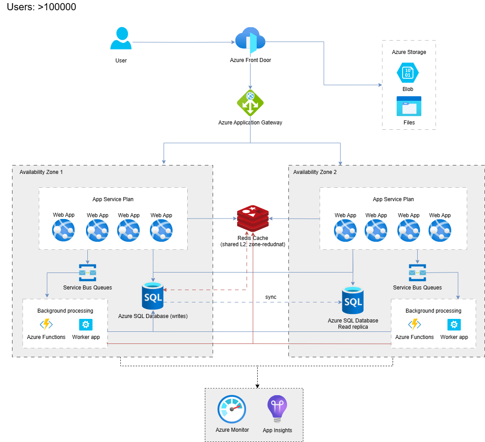](https://substackcdn.com/image/fetch/$s_!FM7R!,f_auto,q_auto:good,fl_progressive:steep/https%3A%2F%2Fsubstack-post-media.s3.amazonaws.com%2Fpublic%2Fimages%2F1ce47ab0-9275-4f0d-8638-6bfd4c93b45f_1088x991.png)Azure Multi-tier architecture with Azure Front Door and load balancer, multiple web servers across zones, Azure Cache for Redis, and a message queue

### Caching everywhere

We introduced a Redis cache earlier for database reads. At 100k+ users, caching extends further:

- **Content Delivery Network (CDN):** Offload static assets (images, CSS, JavaScript, videos) to a CDN like Azure CDN or Azure Front Door, caching. This serves users content from edge servers globally, reducing the load on your web servers and drastically improving load times for users in far-flung locations. With a CDN, a user in Europe loading your site that’s hosted in the US can get static files from a European edge node, shaving hundreds of milliseconds off the response. At this scale, *every millisecond matters* for user experience. The Front Door costs about $35/month, base, plus $0.008 per GB. For a million users, expect to pay $500-$ 1000 per month.
- **Application Cache Patterns:** Beyond simple key-value caching, consider more sophisticated techniques. For example, **distributed output caching** (storing full-rendered pages or API responses) or using an in-memory cache on each application instance for ultra-hot data, combined with a background sync/expiration strategy. Also, **browser caching** and cache headers become important – ensure your static content is cacheable by browsers and proxies.

To conclude, caching is a good scalability solution for growth, but it is not enough if we have a large number of messages to send or receive between nodes. And here is asynchronous messaging to save us.

[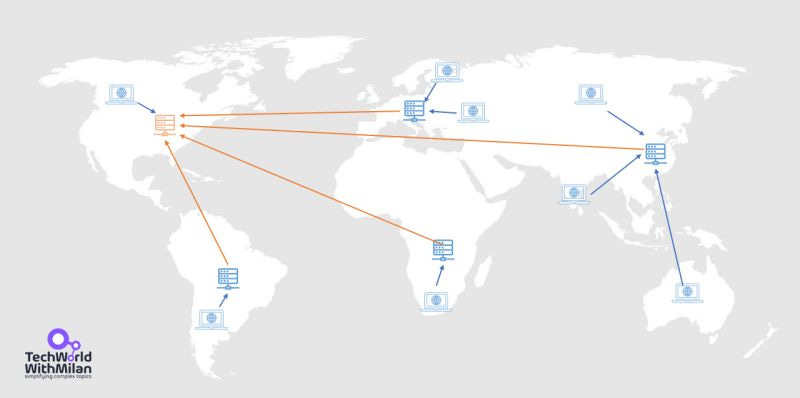](https://substackcdn.com/image/fetch/$s_!hnPO!,f_auto,q_auto:good,fl_progressive:steep/https%3A%2F%2Fsubstack-post-media.s3.amazonaws.com%2Fpublic%2Fimages%2F1ddaa657-6e63-44f9-9daf-4f1ee9e9cf95_800x398.jpeg)Content Delivery Network (CDN)

> *👉  Lern more about **how CDN works:***
> [
> Tech World With Milan NewsletterWhat is CDN?Have you ever wondered how fast Netflix is when streaming a movie to your house? There is one component that is very important here, and it is called CDN (Content Delivery Network). It is a network of servers that move data fast through the network using cache servers and edge servers in…Read morea year ago · 67 likes · 2 comments · Dr Milan Milanović](https://newsletter.techworld-with-milan.com/p/what-is-cdn?utm_source=substack&utm_campaign=post_embed&utm_medium=web)

### Decoupling with async messaging

Large systems often transition to **decoupled, asynchronous architectures** at this point. The idea is to break up the app’s functionality into components or services that communicate via messaging rather than direct calls. Why? Because it helps to isolate parts of the system and scale them independently, and it smooths out traffic spikes by queuing work.

A common approach is to introduce a **message queue or bus** (e.g., [Azure Service Bus](https://azure.microsoft.com/en-us/products/service-bus), [Azure Storage Queues](https://azure.microsoft.com/en-us/products/storage/queues), or [Azure Event Hubs](https://azure.microsoft.com/en-us/products/event-hubs)/[Event Grid](https://azure.microsoft.com/en-us/products/event-grid) for pub-sub).

[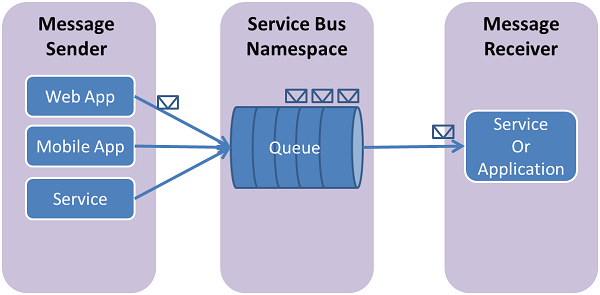](https://substackcdn.com/image/fetch/$s_!Z6Ep!,f_auto,q_auto:good,fl_progressive:steep/https%3A%2F%2Fsubstack-post-media.s3.amazonaws.com%2Fpublic%2Fimages%2F6e6c55f4-3566-415e-9d36-6c1765605cd2_600x295.png)Service Bus queue (source: [Microsoft](https://learn.microsoft.com/en-us/azure/service-bus-messaging/service-bus-quickstart-portal))

For example, suppose your app allows users to upload a photo, which you then process (such as resizing or filtering). At 100k+ users, processing that data inline (synchronously when they upload) could slow down response times and tie up web servers.

Instead, you let the web server quickly upload the photo to storage, drop a message onto a **queue** saying “*process this photo*,” and immediately respond to the user, “*Photo is being processed*”. A separate **worker process** (or [Azure Function](https://azure.microsoft.com/en-us/products/functions)) reads from the queue and handles the CPU-intensive image processing asynchronously (serverless).

This way, your front-end stays snappy even under heavy load – work is offloaded to background workers that can scale out independently. If processing jobs pile up, you can increase the number of consumers (workers) without affecting the web servers.

This **decoupling** via a message queue makes the system more resilient and scalable.

Azure provides multiple options here:

- **[Azure Functions](https://azure.microsoft.com/en-us/products/functions) + [Azure Queue storage](https://azure.microsoft.com/en-us/products/storage/queues)** for simple scenarios,
- **[Azure Service Bus](https://azure.microsoft.com/en-us/products/service-bus)** for more advanced messaging (guaranteed delivery, topics/subscriptions), or
- **[Azure Event Grid](https://azure.microsoft.com/en-us/products/event-grid)** for broadcast-style eventing.

Here is the image that depicts Azure messaging services selection, with typical use cases for each service.

[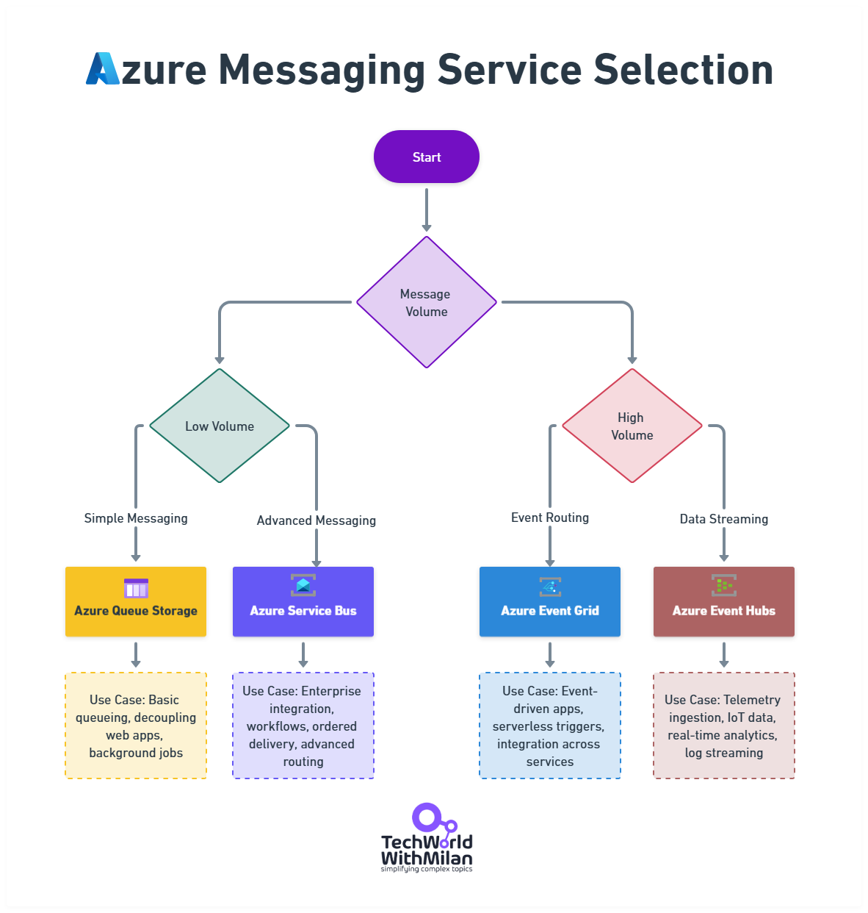](https://substackcdn.com/image/fetch/$s_!Z3yK!,f_auto,q_auto:good,fl_progressive:steep/https%3A%2F%2Fsubstack-post-media.s3.amazonaws.com%2Fpublic%2Fimages%2F83768ba3-0f4a-4217-89e5-7818a554407a_1182x1242.png)Azure Messaging Service Selection

In general, we should use **queues**for the following scenarios:

- Email notifications
- Processing uploaded files
- Image processing
- Report generation
- Any long-running tasks, such as batch operations

### Microservices and SOA

Along with asynchronous processing, many systems start breaking the monolith into **microservices** or at least distinct services around this stage. It might not be a full-fledged microservice architecture yet, but key domains of the application could become separate deployable units (for example, the user authentication service, the billing service, etc.).

The motivation is both **organizational** (different teams can own different services) and **technical** (each service can scale independently, and a problem in one service will not directly impact another).

Start by identifying natural boundaries, and Modular Monolith is already helping you with this. User management, product catalog, order processing, and notifications are obvious candidates. But here's the critical part: don't decompose everything at once. Extract one service, run it for a month, learn from the experience, and then extract the next.

[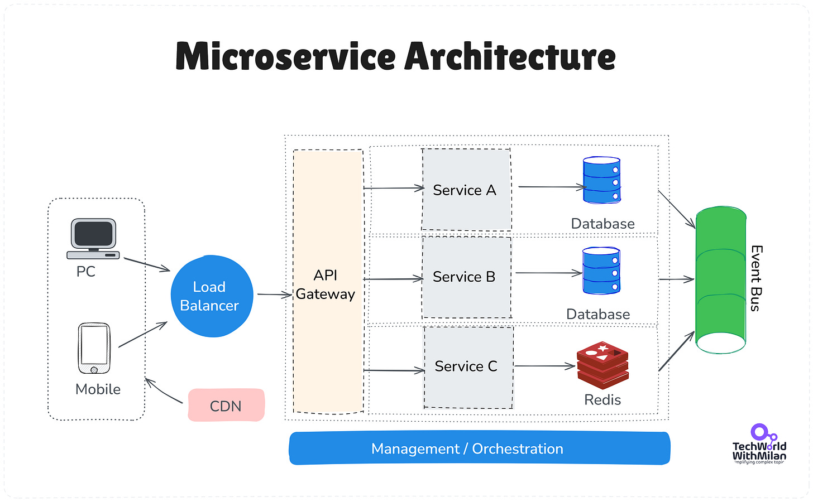](https://substackcdn.com/image/fetch/$s_!imQB!,f_auto,q_auto:good,fl_progressive:steep/https%3A%2F%2Fsubstack-post-media.s3.amazonaws.com%2Fpublic%2Fimages%2F590c0b42-e6df-4692-8894-3af66b44ebfb_3929x2429.png)Microservice Architecture

If you opt for this route on Azure, you have several options, including deploying services as separate Azure App Service applications, containerizing them and using **[Azure Kubernetes Service (AKS)](https://azure.microsoft.com/en-us/products/kubernetes-service), [Azure Container Instances](https://azure.microsoft.com/en-us/products/container-instances),** or **[Azure Container Apps](https://azure.microsoft.com/en-us/products/container-apps)**, or writing them as serverless functions. Azure Kubernetes Service in 2025 is mature. A production cluster with 3 nodes costs about $400/month and can run dozens of microservices.

Here is the short overview of Azure Container Service selection:

[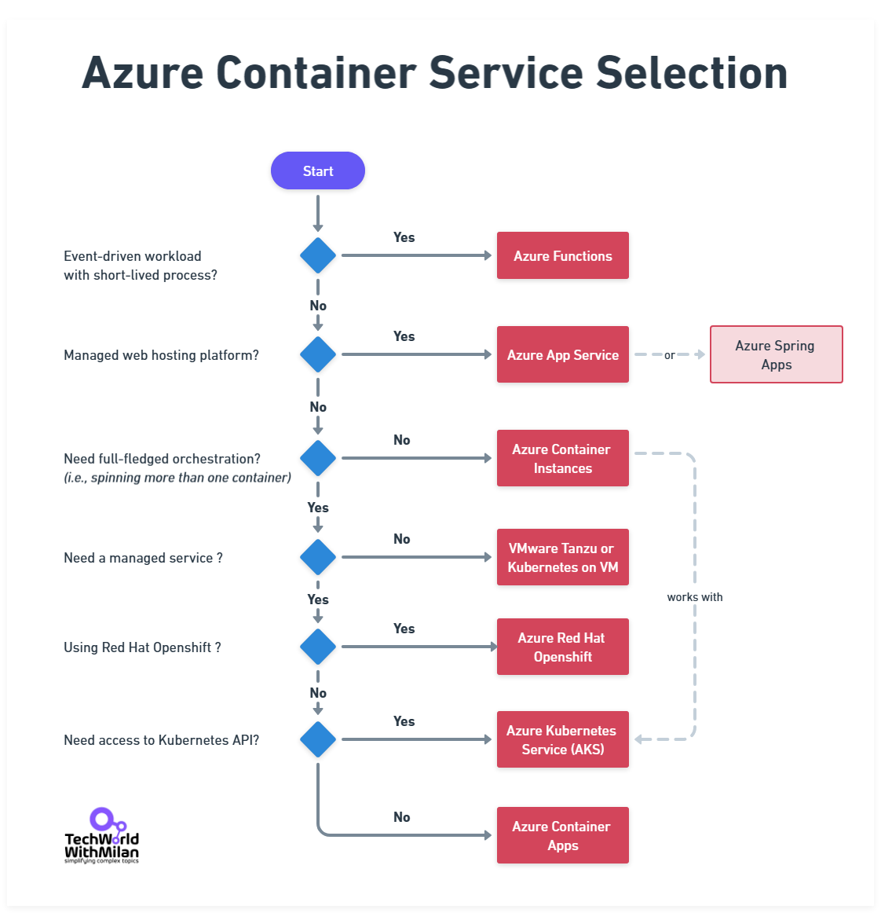](https://substackcdn.com/image/fetch/$s_!uG-4!,f_auto,q_auto:good,fl_progressive:steep/https%3A%2F%2Fsubstack-post-media.s3.amazonaws.com%2Fpublic%2Fimages%2Ff18b8ff6-8bc6-4833-bd5f-594541e28cd1_1122x1162.png)Azure Container Service Selection

The right choice depends on the complexity of each service and your team’s operational maturity with containers versus PaaS, but the key is the **service boundary** itself.

For instance, at 500k users, you might carve out your search functionality into its own service because it’s resource-intensive – that service could use [Azure Cosmos DB](https://azure.microsoft.com/en-us/products/cosmos-db) or [Azure AI Search](https://learn.microsoft.com/en-us/azure/search/search-what-is-azure-search) behind it.

> *👉  Read more about **Microservices**:*
> [
> Tech World With Milan NewsletterWhat is Microservice Architecture?Microservice architecture has revolutionized how companies build and scale software. Giants like Netflix and Amazon leverage it to deliver new features rapidly and efficiently. But what exactly is microservice architecture, and why does it matter…Read more2 years ago · 42 likes · 2 comments · Dr Milan Milanović](https://newsletter.techworld-with-milan.com/p/what-is-microservice-architecture?utm_source=substack&utm_campaign=post_embed&utm_medium=web)

### Observability and monitoring

With many moving parts, **observability** is crucial. At this scale, you should have comprehensive logging, metrics, and tracing in place. Azure’s **[Application Insights](https://learn.microsoft.com/en-us/azure/azure-monitor/app/app-insights-overview)** and **[Azure Monitor](https://learn.microsoft.com/en-us/azure/azure-monitor/fundamentals/overview)** become invaluable.

They can collect logs from all your App Service instances, track metrics such as request rates, CPU, and memory usage, and alert you to issues (e.g., if the 95th percentile response time exceeds a threshold).

Monitoring isn’t just for diagnosing outages. It helps you find performance bottlenecks before they impact all users. Organizations that actively monitor see significantly less downtime on average.

For example, you can set up Application Insights to ping your API endpoints from different regions and alert if the response time or error rate exceeds a specified limit.

You can also use **[distributed tracing](https://learn.microsoft.com/en-us/azure/azure-monitor/app/distributed-trace-data)** (which App Insights supports) to follow how a request flows through multiple services, which becomes important as microservices proliferate.

The general recommendations are to set up alerts for everything that matters:

- P99 latency > 500ms
- Error rate > 1%
- Cost anomaly > 20% daily
- Database DTU > 80%
- Queue depth > 10,000 messages

Here is the Application map view of the Application Insights.

[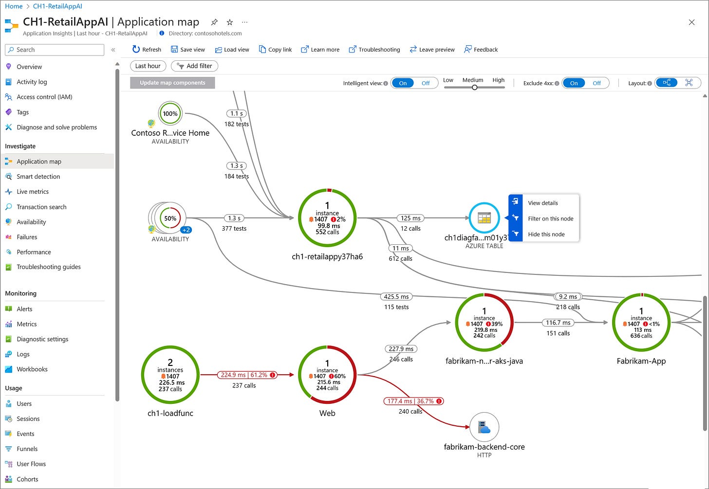](https://substackcdn.com/image/fetch/$s_!_6MZ!,f_auto,q_auto:good,fl_progressive:steep/https%3A%2F%2Fsubstack-post-media.s3.amazonaws.com%2Fpublic%2Fimages%2F1c6f689c-aeeb-4485-9523-09ad8e81e08b_2401x1658.png)Azure Application Insights (source: [Microsoft](https://learn.microsoft.com/en-us/azure/azure-monitor/app/app-insights-overview))

### Cost optimizations

At this level, we should also make cost optimizations, as our Cloud bill could be over $ 100,000 per month. Here are a few things you can do in Azure:

1. **Lifecycle policies for storage**. We can migrate old data from storage to lower-cost tiers, such as the Cool tier (which offers a 50% cost reduction) or the Archive tier (which offers a 95% cost reduction).
2. **Hybrid licensing benefits**. We can use reserved instances for a 70%+ discount for predictable workloads, or spot VMs for batch processing with a 90% discount.
3. **Using mixed compute pools**. Combine reserved instances for steady workloads with spot instances for batch jobs. This keeps critical workloads stable while letting you run flexible jobs at deep discounts.
4. **Reduce usage.**Optimize the amount and size of resources while maintaining the application's performance (e.g., trim instances, downsize storage, simplify services).
5. **Terminate idle resources**. Determine whether resources, such as instances, databases, or storage volumes, are underused or idle and terminate them.
6. **Right-sizing**. Adapt instance sizes to your applications' requirements.
7. **Shutdown resources during inactive periods**. Utilize automated procedures or schedules to deactivate non-essential resources when they are not in use.

[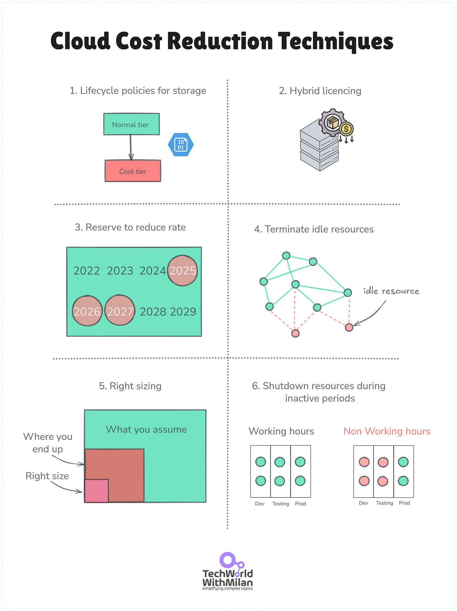](https://substackcdn.com/image/fetch/$s_!wRWL!,f_auto,q_auto:good,fl_progressive:steep/https%3A%2F%2Fsubstack-post-media.s3.amazonaws.com%2Fpublic%2Fimages%2F062f4423-357f-48a9-b62e-70ebea442cce_3574x4769.png)

Azure offers different tools that we can use in this regard, such as:

- **[Azure Pricing Calculator](https://azure.microsoft.com/en-us/pricing/calculator/)** (used to estimate the cost of Azure services).
- **[Azure Cost Analysis](https://learn.microsoft.com/en-us/azure/cost-management-billing/costs/quick-acm-cost-analysis)** (assists you in breaking down the specifics of your Azure spending)
- **[Azure Cost Alerts and Budgets](https://learn.microsoft.com/en-us/azure/cost-management-billing/costs/cost-mgt-alerts-monitor-usage-spending)**, where you can define certain cloud budgets and track expense thresholds.

Also, there is **[Azure Advisor](https://azure.microsoft.com/en-us/products/advisor)**, a tool that examines Azure idle resources and utilizes telemetry to provide helpful, customized recommendations for you.

[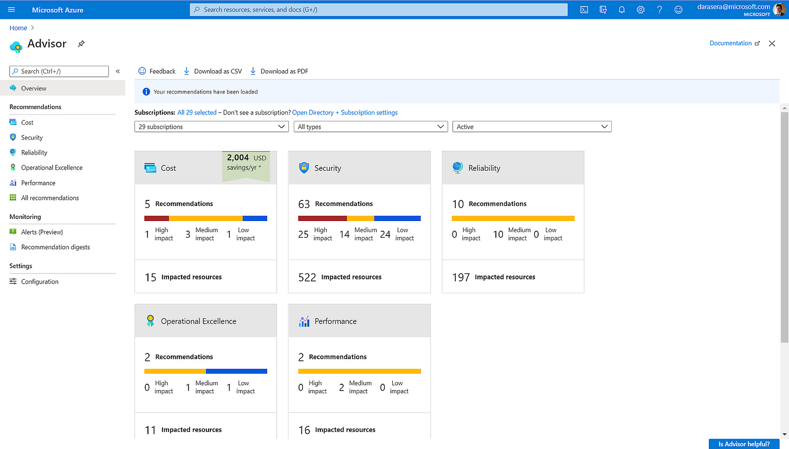](https://substackcdn.com/image/fetch/$s_!UySc!,f_auto,q_auto:good,fl_progressive:steep/https%3A%2F%2Fsubstack-post-media.s3.amazonaws.com%2Fpublic%2Fimages%2F2eba3ada-0f07-4a09-962b-c27d94a4aba3_2000x1142.png)Azure Advisor

Ultimately, what is important is to set budget alerts and monitor your spending on a daily basis. Do a review of bills weekly.

And assign cost centers to teams and **inform engineers of the cost implications of their decisions.**

### Database strategies

One hundred to half a million users will push even a beefy relational database. Beyond read replicas, you must be considering **horizontal** **sharding** at this point. This basically means splitting the database into multiple databases, each holding a subset of the data.

Sharding is a form of horizontal scaling for databases, where user accounts are divided into separate shards. For example, user accounts with IDs ending in 0-3 are assigned to “DB shard 0,” 4-7 to “DB shard 1,” and so on.

In particular, we have the following sharding strategies:

- **Lookup (directory / virtual shards).**Route `key → virtual shard → physical shard`. You can rebalance by remapping virtual shards without touching application code. Ideal for multi-tenant SaaS where a tenant’s data stays together. Cost: an extra hop and a directory that must stay highly available.
- **Range.**Group sequential keys on the same shard (time, alphabet, numeric ranges). Range scans and “last N” queries remain local and fast; cold ranges are archived cleanly. But it comes with a risk: hot ranges and heavier split/merge operations when the load bunches up.
- **Hash.**Hash the shard key to spread writes and storage evenly. Routing is deterministic and simple at the client or gateway. Yet, there is a tradeoff: related keys scatter, so ranges and joins fan out. Use consistent hashing with many virtual nodes to soften the rebalancing pain.

[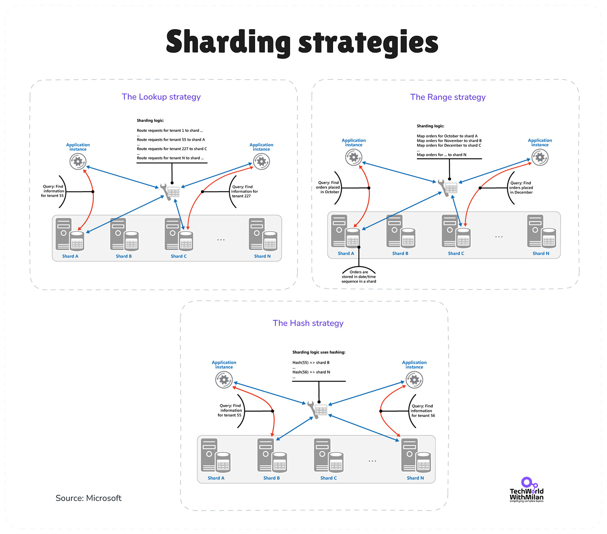](https://substackcdn.com/image/fetch/$s_!CbBu!,f_auto,q_auto:good,fl_progressive:steep/https%3A%2F%2Fsubstack-post-media.s3.amazonaws.com%2Fpublic%2Fimages%2F3a7d0c7a-80ac-4b66-9a45-ced6aef151f1_2291x2017.png)Sharding strategies (source: [Microsoft](https://learn.microsoft.com/en-us/azure/architecture/patterns/sharding))

Azure doesn’t automatically shard your SQL DB (except in Cosmos DB, which has partitioning built in), so you’d implement this at the application level or use libraries to help, which is not an easy task.

Note that sharding **adds complexity** (you have to route queries to the right shard, and you lose the ability to easily join across all data), so it’s usually a last resort when a single database can’t handle the write load or total data volume.

Another strategy is to **offload specific data** to specialized stores: For example, move user session storage or audit logs to a **NoSQL database** so they don’t burden your primary relational DB. **[Azure Cosmos DB](https://learn.microsoft.com/en-us/azure/cosmos-db/partitioning-overview)** can be utilized for tasks such as activity feeds, caching user profile copies globally, metadata/lookup tables, or storing large JSON documents, while orders and transactions are maintained in Azure SQL.

[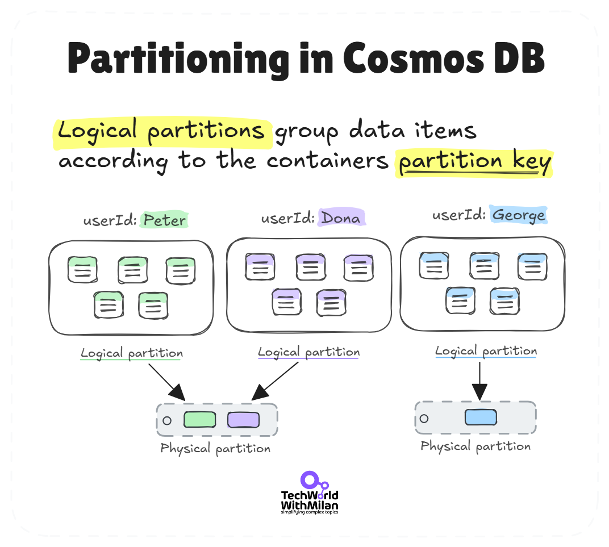](https://substackcdn.com/image/fetch/$s_!g08d!,f_auto,q_auto:good,fl_progressive:steep/https%3A%2F%2Fsubstack-post-media.s3.amazonaws.com%2Fpublic%2Fimages%2F4b809310-9991-48d4-bf2f-156fb5ced860_1072x963.png)Partitioning in Cosmos DB

> **🔀 Trade-off: SQL vs NoSQL (Relational vs Non-Relational):** *At this scale, your choice of database starts to matter for future growth. Traditional **SQL databases** (Azure SQL, PostgreSQL, etc.) are excellent for structured data and complex queries. They have decades of tooling and familiarity behind them and often suffice for a long time.*
> 
> ***NoSQL databases** (Azure Cosmos DB, Cassandra, MongoDB, etc.) offer schema flexibility and horizontal scaling from the get-go, but often at the cost of losing JOINs and sometimes consistency guarantees.*
> 
> *Many successful systems (even at millions of users) still rely on sharded or heavy-duty relational databases.*
> 
> *However, keep an eye on your **data access patterns**. If you foresee needing massive scale or have highly unstructured data, starting with a NoSQL service for certain parts (such as using Cosmos DB for a JSON document store) could pay off.*
> 
> *Often, a mix-and-match approach (**polyglot persistence**) is the healthiest: use SQL where data integrity and relationships are key, and NoSQL where you need big scale or schemaless flexibility.*
> 
> *To understand this topic better, read **[my review of the DDIA book](https://newsletter.techworld-with-milan.com/p/what-i-learned-from-the-book-designing)**:*
> [
> Tech World With Milan NewsletterWhat I learned from the book Designing Data-Intensive ApplicationsAfter two decades in software engineering, I thought I had a solid understanding of various topics, including NoSQL, Big Data, transactions, sharding, and more…Read more8 months ago · 661 likes · 27 comments · Dr Milan Milanović](https://newsletter.techworld-with-milan.com/p/what-i-learned-from-the-book-designing?utm_source=substack&utm_campaign=post_embed&utm_medium=web)

## 6. 1,000,000+ Users – Global scale

Reaching a million users is a hallmark of a truly large-scale system. At this stage, you’re likely serving users globally, and the architecture must handle **high concurrency, large data volumes, and multi-region deployments**.

The focus shifts to **globally distributed architecture** and fine-grained scaling of services.

### Multi-region deployment

With a million users (especially if many are active concurrently), a single region may not be sufficient for either capacity or latency. You’ll start deploying your system to **multiple Azure regions** (e.g., one in the Americas, one in Europe, one in Asia) to bring the service closer to users and provide redundancy.

**[Azure Front Door](https://learn.microsoft.com/en-us/azure/frontdoor/front-door-overview)** becomes extremely useful now. It’s a global entry point that can route each user’s request to the nearest region based on latency or geography. For example, a user in London will access the Europe deployment, someone in California will access the US West deployment, and so on.

This **significantly reduces latency** and balances the load across regions.

> ➡️ *Check the **modern latency pyramid numbers**:*
> 
> [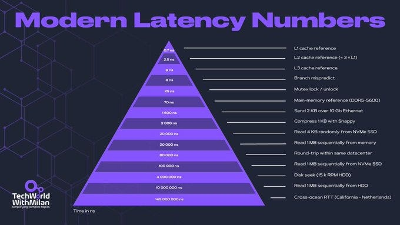](https://substackcdn.com/image/fetch/$s_!e15k!,f_auto,q_auto:good,fl_progressive:steep/https%3A%2F%2Fsubstack-post-media.s3.amazonaws.com%2Fpublic%2Fimages%2Fbdb98fb5-da88-4cfe-ad9b-8b2138211c7c_680x383.jpeg)Modern latency numbers

**[Azure Front Door](https://learn.microsoft.com/en-us/azure/frontdoor/front-door-overview)** also provides instant failover: if one region goes down, Front Door can automatically direct users to a healthy region. An alternative or complement is **[Azure Traffic Manager](https://learn.microsoft.com/en-us/azure/traffic-manager/traffic-manager-overview)**, which provides DNS-based routing to direct users to different region endpoints (see the bonus section for a better understanding of Azure Load Balancing options).

The Traffic Manager is slightly slower to fail over (due to DNS caching), but it can still function at other routing levels (e.g., for non-HTTP services). Often, Front Door is sufficient for most web applications, providing global load balancing and serving as a CDN/cache for static content as well.

Here is the Azure architecture for multi-region, active-active deployment with Azure Front Door routing traffic globally.

[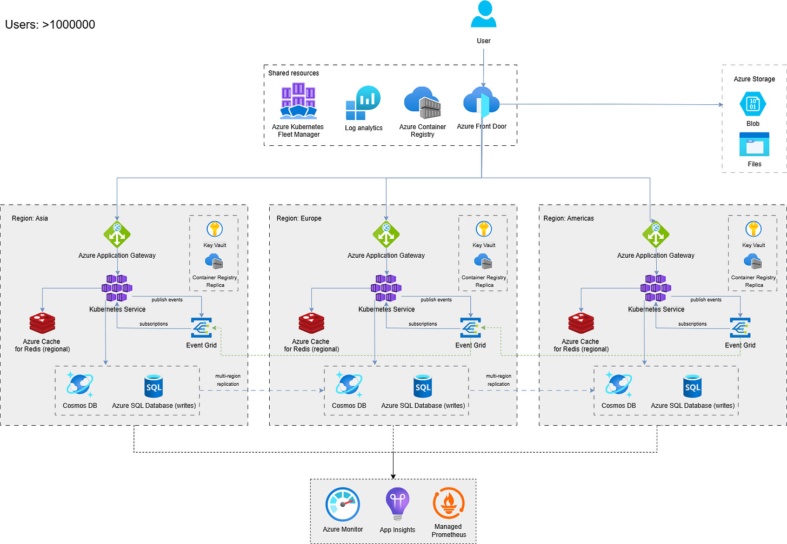](https://substackcdn.com/image/fetch/$s_!0MQ_!,f_auto,q_auto:good,fl_progressive:steep/https%3A%2F%2Fsubstack-post-media.s3.amazonaws.com%2Fpublic%2Fimages%2F0199af3a-57ec-4654-9340-627507922719_1462x1011.png)Multi-region active-active deployment with Azure Front Door routing traffic globally

### Data consistency issues

However, running in multiple regions introduces **challenges to data consistency**. The ideal scenario is *for **active-active*** regions, where both regions serve read and write traffic. But if you have a single primary database, you can’t easily write from two places without conflict.

Here, you face a trade-off in **consistency vs. availability**(more on this later). Azure offers **[Cosmos DB](https://azure.microsoft.com/en-us/products/cosmos-db),** which supports multi-region writes with tunable consistency (from strong to eventual). If your application can be built or refactored to use Cosmos DB for its main data, you can achieve multi-master writes. Here, users in each region write to their local Cosmos instance, and Cosmos syncs the data globally with the chosen consistency level.

This gives low write latency everywhere, at the cost of some complexity (and careful thinking about conflicts if using anything weaker than strong consistency).

If sticking with a relational database like Azure SQL, a common approach is *to use **active-passive*** with fast failover: for instance, designate one region as the write master (say US-East) and have a readable secondary in Europe (using geo-replication).

All writes go to US-East, and perhaps most reads as well, but European users read from the local replica for speed. In normal operation, Europe might still experience higher latency on writes (as they must go to the US), but reads are fast. **In the event of a failure of US-East, you can promote the EU replica to primary.**

This scenario is complex to handle in code (suddenly your write endpoint changes), but [Azure SQL’s failover groups](https://learn.microsoft.com/en-us/azure/azure-sql/database/failover-group-sql-db?view=azuresql) can automate the connection string routing on failover. The downside is that you’re not fully utilizing both regions for writes. One is mostly a hot standby for writes.

Another pattern is **partitioning by region**: essentially, sharding by geography – e.g., US users’ data is stored in the US database, and EU users’ data is stored in the EU database. The app routes user requests to the database of the relevant region. This avoids cross-region writes entirely.

However, if a region fails, the users’ data is not accessible until you either restore it from a backup elsewhere or have replication to another region. Often, a hybrid is used: partition data by region, but also replicate to a backup region for disaster recovery.

> **🔀Trade-off: Consistency vs Availability:** *A major architectural decision at a global scale is how you balance the CAP theorem concerns.*
> 
> *If you use Cosmos DB across regions, you might choose an **eventual consistency** mode to get high availability and partition tolerance, with the trade-off that two regions might see data diverge for a moment. If **strong consistency** is required (e.g., bank account balances), you might sacrifice some availability or route all writes to one region.*
> 
> *These are tough choices that architects must make because there’s no one-size-fits-all. Azure gives you the tools (from strongly consistent databases in one region to eventually consistent multi-region NoSQL) to pick your preference.*
> 
> *The guiding principle is to **know your domain**: which data can be eventually consistent and which absolutely cannot.*
> 
> *Often, a hybrid approach works (strong consistency for core transactions, eventual consistency for less critical data like analytics or caching).*
> 
> [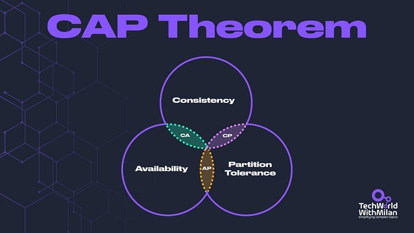](https://substackcdn.com/image/fetch/$s_!55BP!,f_auto,q_auto:good,fl_progressive:steep/https%3A%2F%2Fsubstack-post-media.s3.amazonaws.com%2Fpublic%2Fimages%2Fb5483163-f3a3-4a26-bf54-71c02e6e7c13_700x394.jpeg)

### Full microservices & domain decomposition

At 1 million users, it’s very likely that you have broken the system into multiple services. Here, you might be using an orchestrator like **[Azure Kubernetes Service (AKS)](https://azure.microsoft.com/en-us/products/kubernetes-service)** to run dozens of microservice containers. It is an Azure-managed service on top of Kubernetes.

Or you’ve gone serverless, with a suite of [Azure Functions](https://azure.microsoft.com/en-us/products/functions) and [Logic Apps](https://azure.microsoft.com/en-us/products/logic-apps) handling various components.

The architecture could be an elaborate **SOA (service-oriented architecture)** with APIs orchestrated by an API Gateway ([Azure API Management](https://azure.microsoft.com/en-us/products/api-management) service could sit in front of your microservice APIs to unify them and handle cross-cutting concerns like auth, rate limiting, etc.).

**Each service might have its own database** (often recommended to avoid contention and allow independent scaling). For example, the user profile service has its own Cosmos DB container, the orders service has its own SQL database, and the analytics service writes to its own data warehouse, among others.

This is the **microservices principle of single responsibility**, where each service manages its own data and logic. The benefit is that you remove the previous bottleneck of having a single giant database for everything, and each piece can scale out as needed.

The challenge is that you now have **distributed transactions** (which you often avoid by using eventual consistency and compensating actions) and a lot more moving parts to monitor.

Here is the overview of the overall Microservice architecture:

Complete Microservice Architecture Blueprint

> *👉 Learn more about **Microservice architectures**:*
> [
> Tech World With Milan NewsletterWhat is Microservice Architecture?Microservice architecture has revolutionized how companies build and scale software. Giants like Netflix and Amazon leverage it to deliver new features rapidly and efficiently. But what exactly is microservice architecture, and why does it matter…Read more2 years ago · 42 likes · 2 comments · Dr Milan Milanović](https://newsletter.techworld-with-milan.com/p/what-is-microservice-architecture?utm_source=substack&utm_campaign=post_embed&utm_medium=web)

### Event-driven architecture

With numerous services and a significant amount of data circulating, a central technique is **event-driven communication**. Instead of all services making synchronous API calls for every interaction (which creates a web of dependencies), services publish events (e.g., “UserRegistered”, “OrderPlaced”) to a message broker, and other services subscribe if they need to react.

**[Azure Event Grid](https://azure.microsoft.com/en-us/products/event-grid)** or **[Azure Service Bus](https://azure.microsoft.com/en-us/products/service-bus)** topics are great for this publish-subscribe model. For instance, when a new user registers, the user service saves the information to its database, then publishes a “UserRegistered” event. Other services, for example, the welcome email service, the analytics service, and perhaps a recommendation engine, all receive that event and perform their respective tasks (sending emails, logging analytics, building recommendations) independently.

This decoupling means the user service isn’t waiting on all those actions, and a failure in one doesn’t affect the main flow. It’s the logical extension of the async decoupling we started at 100k+ users, but at a wider scale across all microservices.

Note that event-driven architecture sounds elegant, services react to small “something happened” signals instead of direct calls. **But the trade-offs are real.** Message formats evolve over time, and even a tiny schema change can break downstream consumers if not managed carefully. Debugging becomes harder because there’s no straight call stack to follow; an event may vanish, get delayed, or trigger a cascade you can’t easily trace. Reliability also brings headaches: events may be lost or duplicated, unless you build for idempotency and dead-letter handling.

[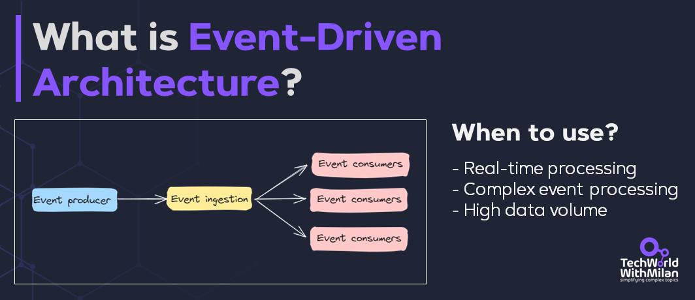](https://substackcdn.com/image/fetch/$s_!_ViB!,f_auto,q_auto:good,fl_progressive:steep/https%3A%2F%2Fsubstack-post-media.s3.amazonaws.com%2Fpublic%2Fimages%2Fb12bd597-f425-4321-ba27-77129907436d_1064x460.png)Event-Driven Architecture

### Observability at scale

Now your monitoring needs to be **smart**. It’s not feasible to manually watch dozens of dashboards; you need automated anomaly detection and alerting.

**[Azure Monitor](https://learn.microsoft.com/en-us/azure/azure-monitor/fundamentals/overview)** can integrate with Machine Learning to detect unusual patterns (e.g., sudden spikes in 5xx errors in a single service) and alert on call chains that exceed specified latencies.

Logging should be centralized (using [Azure Monitor](https://learn.microsoft.com/en-us/azure/azure-monitor/fundamentals/overview) or a third-party SIEM solution) to enable searching across services. Consider establishing **an SRE (Site Reliability Engineering) regime** of SLOs (Service Level Objectives) for key operations (such as login and checkout) and tracking error budgets. This is essentially a formal process for determining when to halt feature development and address reliability issues.

The tooling in Azure ([Application Insights](https://learn.microsoft.com/en-us/azure/azure-monitor/app/app-insights-overview), [Log Analytics](https://learn.microsoft.com/en-us/azure/azure-monitor/logs/log-analytics-overview), etc.) can support this, but it requires effort to configure the right telemetry. At 1 million users, any single-hour outage or performance blip can impact thousands of users and make headlines, so proactivity is crucial.

Azure Monitor (source: [Microsoft](https://learn.microsoft.com/en-us/azure/azure-monitor/fundamentals/overview))

## 7. Beyond 1M+ Users

Beyond a million users, you’re operating at **planet scale**. A very few systems reach this on their own (think of apps like Twitter, [Netflix](https://newsletter.techworld-with-milan.com/p/how-does-netflix-manage-to-show-you), or large SaaS platforms). At this level, all the principles discussed earlier become requirements, not options.

So, let’s recap and extend what a 1M+ user Azure architecture looks like:

- **Multi-region active-active architecture.**You will be deployed in multiple Azure regions, serving traffic concurrently. Azure Front Door or Traffic Manager routes users to the nearest region and handles failover in real-time. Every region is a full stack or a shard of your service.
- **Extensive redundancy and fault isolation.** Each service and tier has redundancy. You use Availability Zones within regions and multiple regions for geo-redundancy. You design the system such that even if an entire region or zone is down, the system remains up (possibly in degraded mode). Fault isolation techniques are used, for instance, you might partition users into multiple **scale units** such that each unit serves a subset of users end-to-end (to contain the blast radius of failures)
- **Sharded Data architectures.** If you haven’t yet, with over 1 million users, you likely need to **shard relational databases** or heavily utilize Cosmos DB. You could have dozens of SQL databases, each holding a slice of your data (e.g., by user ID range or customer tenant). You’ll need a way to route queries to the right shard (a common approach is a shard map or hashing function). The **complexity of managing many databases is high**, where automation is required (for deployment, migrations, monitoring each shard, etc.). Azure’s hyperscale and elastic pool features can help manage multiple databases, but application logic is often required as well.
- **Polyglot persistence.**Different data needs different storage. You’re likely using multiple types of databases: SQL for core business data, NoSQL (Cosmos DB, Table Storage) for big scale and quick lookups, perhaps a graph database for relationship data, a time-series database for analytics, etc. This ensures each part of your workload uses the optimal storage engine.
- **Edge computing and CDNs.**At this scale, even the central cloud regions might not be enough. You might push certain logic to the edge. Azure offers **Azure Edge Functions** (running functions at edge locations) and, of course, CDNs for content delivery. You ensure that as much processing as possible (especially for user experience) happens geographically close to users.
- **Automation and tooling:** Everything is automated: infrastructure-as-code (Azure Resource Manager/Bicep or Terraform templates) is a must to replicate environments across regions. Continuous deployment pipelines are in place for safe, frequent releases. You likely invest in chaos engineering, which is intentionally injecting failures (with tools or custom scripts) to test the system’s resilience.

Ultimately, **serving over 1 million users is a continuous process**. You don’t jump to this overnight, because it’s the accumulation of years of tuning and expanding. There is no “final architecture”, as you will continually refine based on new bottlenecks or new features.

The principles, however, remain consistent. A summary of the core principles that enable scaling into the millions: **keep the web tier stateless, build redundancy at every tier, cache aggressively, support multiple active data centers, offload static content to CDNs, scale databases via sharding or replication, split services by domain, and invest heavily in monitoring/automation.**

These ideas drive the world’s biggest architectures.

Here is the short recap of when you should scale your app:

[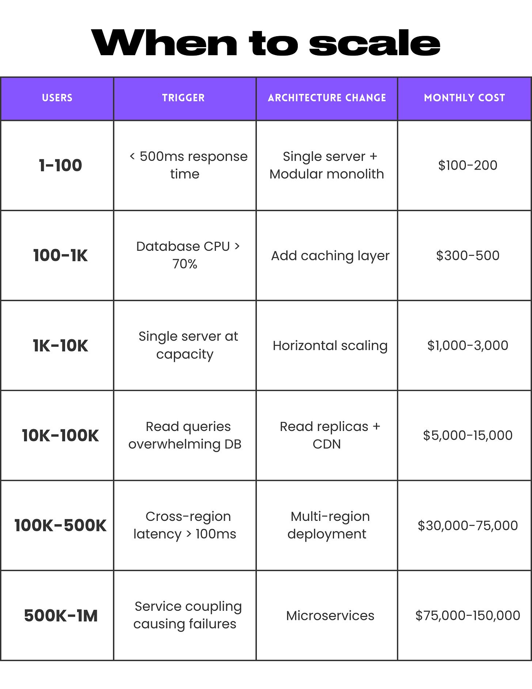](https://substackcdn.com/image/fetch/$s_!erZI!,f_auto,q_auto:good,fl_progressive:steep/https%3A%2F%2Fsubstack-post-media.s3.amazonaws.com%2Fpublic%2Fimages%2Fc84c44f5-4dd8-46eb-9031-4c72da954a2d_1545x2000.png)When to scale - a short decision matrix

## 8. Conclusion

We can say that the journey from one user to millions on Azure is about **evolution, not revolution**. At the start, simplicity and speed are your friends, which means a basic design to get you up and running.

As usage grows, you gradually **layer in complexity**: first separating concerns, then scaling out, then distributing across the globe and splitting into specialized components.

The art of architecture is about adding only what is needed, when it is needed, while keeping future needs in mind. Key milestones prompt key changes: a load balancer here, a cache there, partitioning data here, a new service there.

Through each stage, we applied fundamental design principles:

- **Statelessness** for web scalability
- **Horizontal scaling** for resilience
- **Caching** for performance
- **Auto-scaling** for elasticity
- **Decoupling** for independence
- **Observability** for insight, and
- **Data scaling techniques** (replication, sharding, NoSQL) for throughput.

Azure’s platform provides building blocks at every step, from App Service and Azure SQL for easy starts, to Azure Front Door and Cosmos DB for planetary scale. But tools alone don’t magically scale an app; architecture does.

Designing for millions of users means thinking **in a distributed** and **failure-first manner**: assume things will fail and design with backups and fallbacks. It means **embracing eventual consistency** where necessary and understanding the trade-offs (e.g., consistency vs. availability, simplicity vs. flexibility).

It also means constantly measuring and tuning. What works for 100k users might break at 1 million, so never stop testing and observing.

Ultimately, scaling to millions is challenging but achievable with a clear, stage-wise approach.

By evolving your architecture step by step and adhering to core principles, you can **turn a simple app into a globally scalable service**. The journey is long, but as an architect, it’s immensely rewarding to see your system handle growth gracefully.

Most importantly, you don't need hundreds of engineers. Instagram supported 30 million users with 13 engineers. Good architecture beats large teams every time.

**Start simple, measure everything, and scale what breaks.**

That's how you build for millions on Azure.

## Bonus: **Azure Cloud Services Cheat Sheet**

The image below provides an overview of the main Azure Cloud services in all key categories.

Azure Cloud Services Cheat Sheet

## Bonus 2: Azure Load Balancer Cheat Sheet

The image below shows a selection algorithm for an Azure Load Balancer solution.

[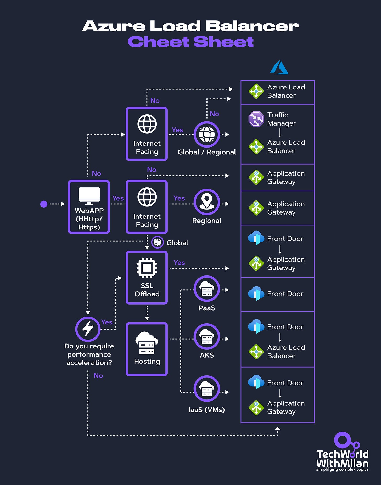](https://substackcdn.com/image/fetch/$s_!HkD1!,f_auto,q_auto:good,fl_progressive:steep/https%3A%2F%2Fsubstack-post-media.s3.amazonaws.com%2Fpublic%2Fimages%2F1efd896f-6cbc-4f06-bd57-86b478b08787_2091x2663.png)Azure Load Balancer Cheat Sheet

---

## **More ways I can help you:**

- [📚](https://www.patreon.com/techworld_with_milan/shop/ultimate-net-bundle-for-2025-1519389?utm_medium=clipboard_copy&utm_source=copyLink&utm_campaign=productshare_creator&utm_content=join_link)**[The Ultimate .NET Bundle 2025](https://www.patreon.com/techworld_with_milan/shop/ultimate-net-bundle-for-2025-1519389?utm_medium=clipboard_copy&utm_source=copyLink&utm_campaign=productshare_creator&utm_content=join_link)** 🆕. 500+ pages distilled from 30 real projects show you how to own modern C#, ASP.NET Core, patterns, and the whole .NET ecosystem. You also get 200+ interview Q&As, a C# cheat sheet, and bonus guides on middleware and best practices to improve your career and land new .NET roles. **[Join 1,000+ engineers](https://www.patreon.com/techworld_with_milan/shop/ultimate-net-bundle-for-2025-1519389?utm_medium=clipboard_copy&utm_source=copyLink&utm_campaign=productshare_creator&utm_content=join_link)**.
- [📦](https://www.patreon.com/techworld_with_milan/shop/premium-resume-package-1721454?utm_medium=clipboard_copy&utm_source=copyLink&utm_campaign=productshare_creator&utm_content=join_link)**[Premium Resume Package](https://www.patreon.com/techworld_with_milan/shop/premium-resume-package-1721454?utm_medium=clipboard_copy&utm_source=copyLink&utm_campaign=productshare_creator&utm_content=join_link) 🆕**. Built from over 300 interviews, this system enables you to craft a clear, job-ready resume quickly and efficiently. You get ATS-friendly templates (summary, project-based, and more), a cover letter, AI prompts, and bonus guides on writing resumes and prepping LinkedIn. **[Join 500+ people](https://www.patreon.com/techworld_with_milan/shop/premium-resume-package-1721454?utm_medium=clipboard_copy&utm_source=copyLink&utm_campaign=productshare_creator&utm_content=join_link)**.
- [📄](https://www.patreon.com/techworld_with_milan/shop/complete-tech-resume-reality-check-311008?utm_medium=clipboard_copy&utm_source=copyLink&utm_campaign=productshare_creator&utm_content=join_link)**[Resume Reality Check](https://www.patreon.com/techworld_with_milan/shop/complete-tech-resume-reality-check-311008?utm_medium=clipboard_copy&utm_source=copyLink&utm_campaign=productshare_creator&utm_content=join_link)**. Get a CTO-level teardown of your CV and LinkedIn profile. I flag what stands out, fix what drags, and show you how hiring managers judge you in 30 seconds. **[Join 100+ people](https://www.patreon.com/techworld_with_milan/shop/complete-tech-resume-reality-check-311008?utm_medium=clipboard_copy&utm_source=copyLink&utm_campaign=productshare_creator&utm_content=join_link)**.
- [📢](https://www.patreon.com/techworld_with_milan/shop/short-linkedin-content-creator-311232?utm_medium=clipboard_copy&utm_source=copyLink&utm_campaign=productshare_creator&utm_content=join_link)**[LinkedIn Content Creator Masterclass](https://www.patreon.com/techworld_with_milan/shop/short-linkedin-content-creator-311232?utm_medium=clipboard_copy&utm_source=copyLink&utm_campaign=productshare_creator&utm_content=join_link)**. I share the system that grew my tech following to over 100,000 in 6 months (now over 255,000), covering audience targeting, algorithm triggers, and a repeatable writing framework. Leave with a 90-day content plan that turns expertise into daily growth. **[Join 1,000+ creators](https://www.patreon.com/techworld_with_milan/shop/short-linkedin-content-creator-311232?utm_medium=clipboard_copy&utm_source=copyLink&utm_campaign=productshare_creator&utm_content=join_link)**.
- [✨](https://www.patreon.com/c/techworld_with_milan)**[Join My Patreon](https://www.patreon.com/c/techworld_with_milan)**[https://www.patreon.com/c/techworld_with_milan](https://www.patreon.com/c/techworld_with_milan)**[Community](https://www.patreon.com/c/techworld_with_milan) and [My Shop](https://www.patreon.com/c/techworld_with_milan/shop)**. Unlock every book, template, and future drop, plus early access, behind-the-scenes notes, and priority requests. Your support enables me to continue writing in-depth articles at no cost. **[Join 2,000+ insiders](https://www.patreon.com/c/techworld_with_milan)**.
- [🤝](https://newsletter.techworld-with-milan.com/p/coaching-services)**[1:1 Coaching](https://newsletter.techworld-with-milan.com/p/coaching-services)** – Book a focused session to crush your biggest engineering or leadership roadblock. I’ll map next steps, share battle-tested playbooks, and hold you accountable. **[Join 100+ coachees](https://newsletter.techworld-with-milan.com/p/coaching-services)**.

---

## **Want to advertise in Tech World With Milan? 📰**

If your company is interested in reaching an audience of founders, executives, and decision-makers, you may want to **[consider advertising with us](https://newsletter.techworld-with-milan.com/p/sponsorship-of-tech-world-with-milan)**.

---

## **Love Tech World With Milan Newsletter? Tell your friends and get rewards.**

We are now close to **50k subscribers** (thank you!). Share it with your friends by using the button below to get benefits (my books and resources).

[Share Tech World With Milan Newsletter](https://newsletter.techworld-with-milan.com/?utm_source=substack&utm_medium=email&utm_content=share&action=share)

[Track your referrals here](https://newsletter.techworld-with-milan.com/leaderboard).