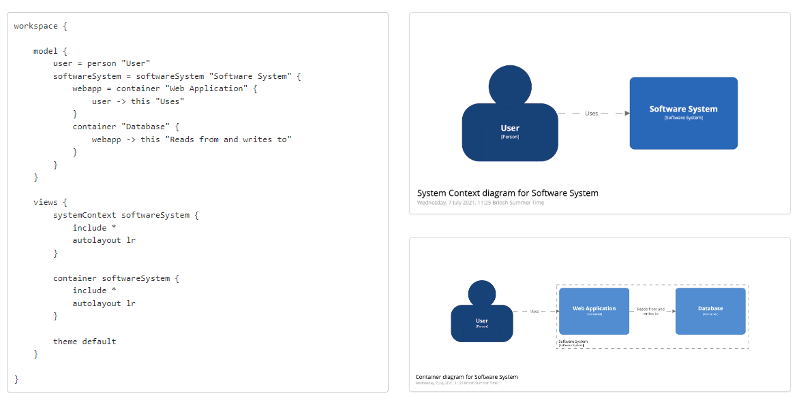
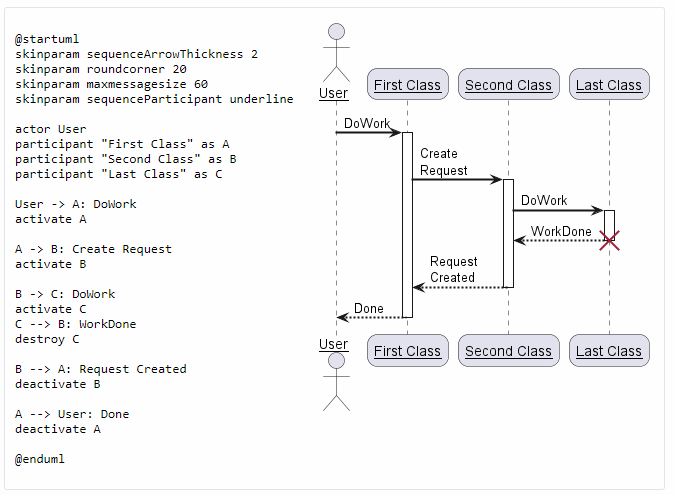
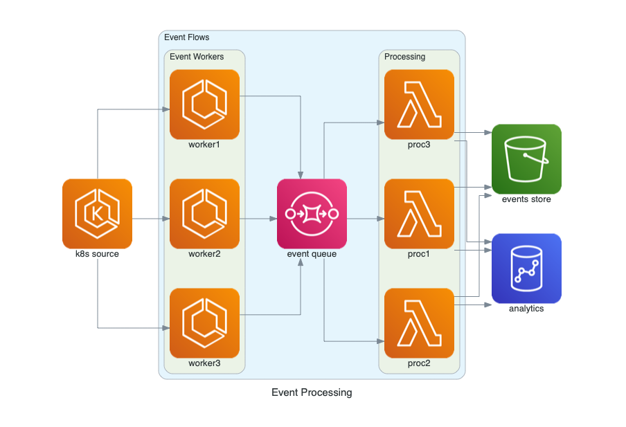
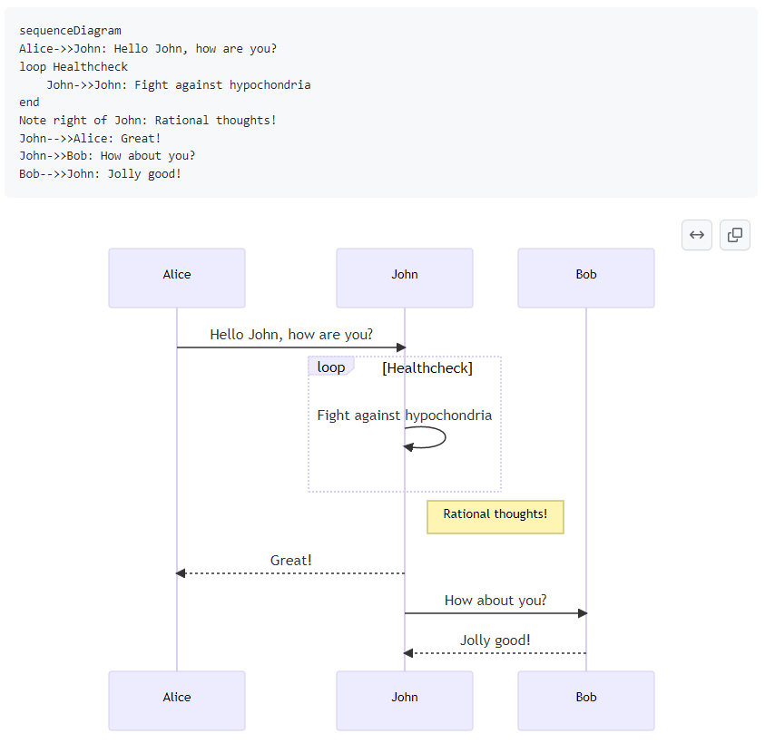
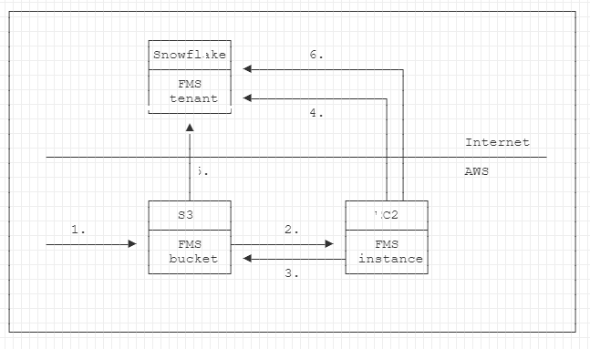
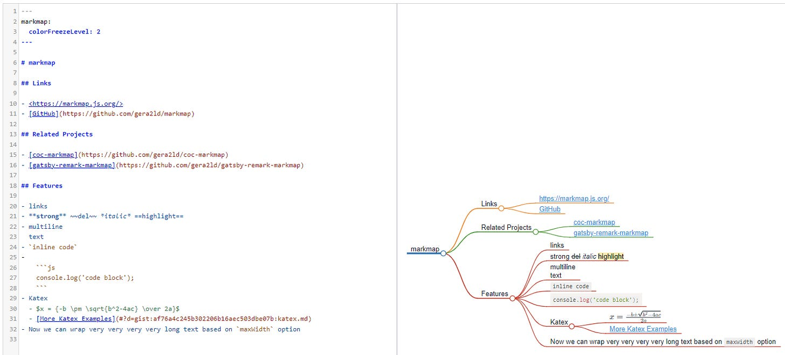
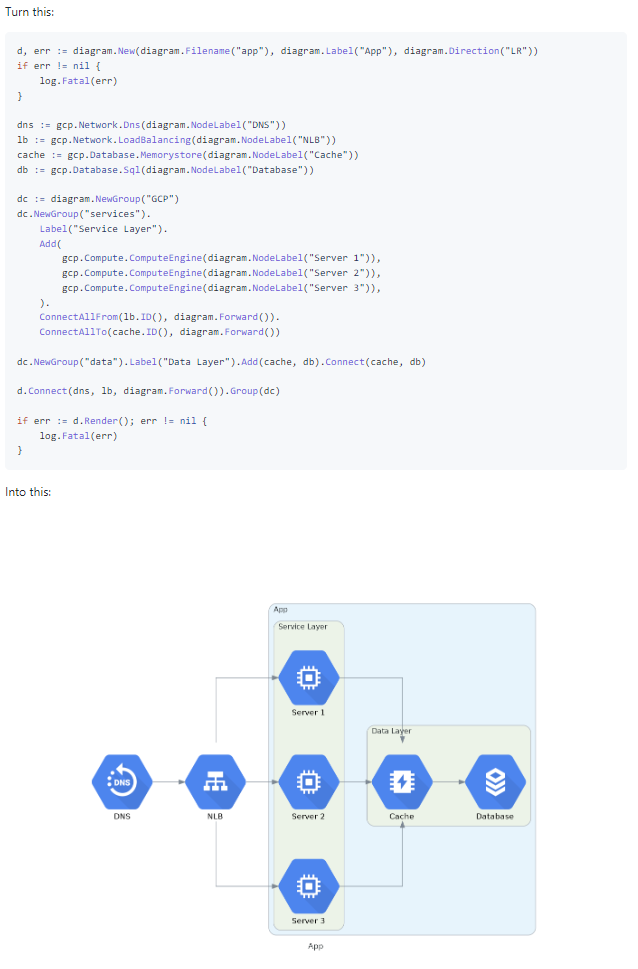
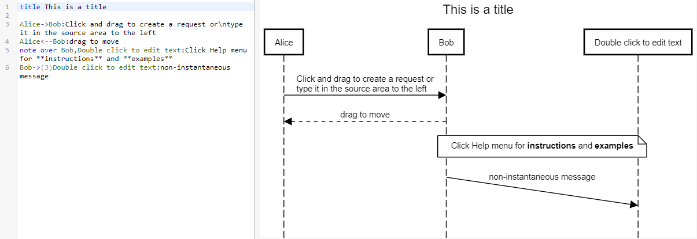
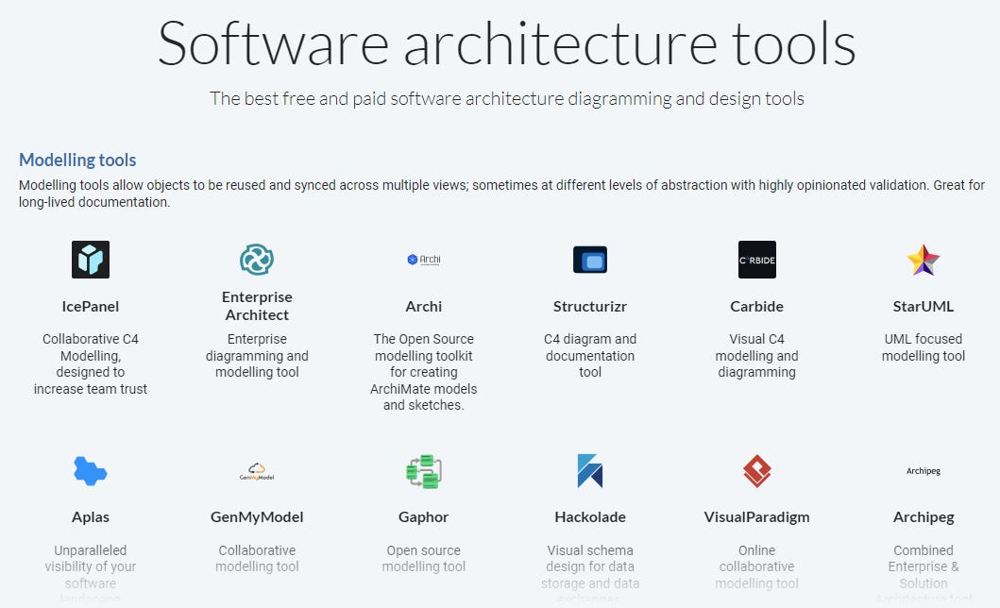

# Software Architecture As Code Tools

*An overview of architecture/diagrams as code tools*

We’re seeing more and more tools that enable you to create software architecture and other diagrams as code. The main benefit of using this concept is that the majority of the diagrams as code tools can be scripted and integrated into a built pipeline for generating automatic documentation.

The other benefit responsible for the growing use of diagrams as code to create software architecture is that it enables text-based tooling, which most software developers already use.

What are some existing tools for creating such diagrams?

1. **[Structurizr](https://structurizr.com/)**

Create multiple diagrams from a single **(C4) model**. It allows the creating of numerous diagrams from a single model using different tools and programming languages.

Structurizr

For C4 models, you can also use tools such as **[C4Sharp](https://github.com/8T4/c4sharp)**, a .net library for building diagrams as code.

1. **[PlantUML](https://plantuml.com/)**

It is an open-source tool that allows users to create diagrams from a plain text language. With PlantUML, you can make different kinds of UML and non-UML diagrams, too (Sequence, Class, Component, JSON data, Network, Gantt, etc.).

PlantUML

1. **[Diagrams](https://github.com/mingrammer/diagrams)**

Turn Python code into cloud system architecture diagrams. A new or current system design can also be explained or represented visually. The primary significant providers that Diagrams presently supports include **AWS, Azure, GCP, Kubernetes, Alibaba Cloud, Oracle Cloud**, etc.

Diagrams

4. **[Mermaid](https://github.com/mermaid-js/mermaid)**

Mermaid is a **JavaScript-based diagramming and charting tool** that uses Markdown-inspired text definitions and a renderer to create and modify complex diagrams. The primary purpose of Mermaid is to help documentation catch up with development.

Mermaid

1. **[ASCII editor](https://asciiflow.com/)**

ASCII Flow is a simple and easy-to-use online flowchart software that uses ASCII characters to create flowcharts. It allows users to create flowcharts by simply typing the diagram using ASCII characters and then converting it into a visual flowchart. It can create flowcharts, diagrams, and other types of visual diagrams.

ASCIIFlow

1. **[Markmap](https://markmap.js.org/)**

Markmap is a tool that allows you to create and edit mind maps. Markmap uses a technology called Markdown, which is a lightweight markup language, to create and edit mind maps.

Markmap

1. **[Go diagrams](https://github.com/blushft/go-diagrams)**

It is a similar tool to Diagrams but with Go as a diagramming language.

Go diagrams

1. **[SequenceDiagram.org](https://sequencediagram.org/)**

Sequencediagram.org is a tool that provides a simple online tool for creating and sharing UML sequence diagrams.

SequenceDiagram.org

Along with these diagrams as code tools, there are other **software architecture tools**, such as:

**Modeling tools:**

- [IcePanel](https://icepanel.io/)
- [Enterprise Architect](https://sparxsystems.com/)
- [Archi](https://www.archimatetool.com/)
- [Carbide](https://carbide.dev/)
- [StarUML](https://staruml.io/)

**Diagramming tools:**

- [Visio](https://www.microsoft.com/en-ca/microsoft-365/visio/flowchart-software)
- [LucidChart](https://www.lucidchart.com/pages/solutions/engineering)
- [Draw.io](http://draw.io/)
- [Cloudcraft](https://www.cloudcraft.co/)
- [Archium](https://archium.io/)
- [Excalidraw](https://excalidraw.com/)
- [CloudSkew](https://www.cloudskew.com/)

Check the complete list of tools here: [https://softwarearchitecture.tools/](https://softwarearchitecture.tools/).

Software architecture tools

---

Thanks for reading Tech World With Milan Newsletter! Subscribe for free to receive new posts and support my work.