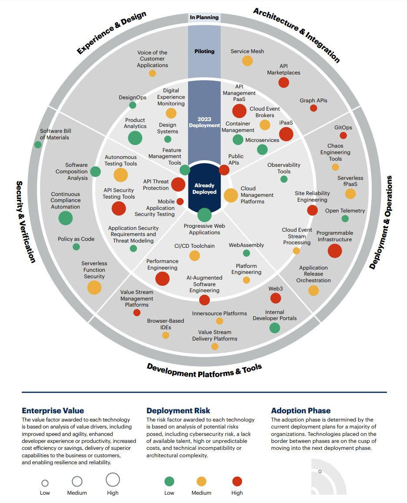
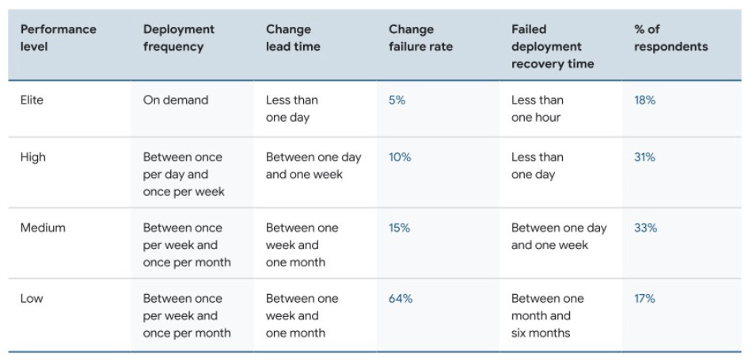
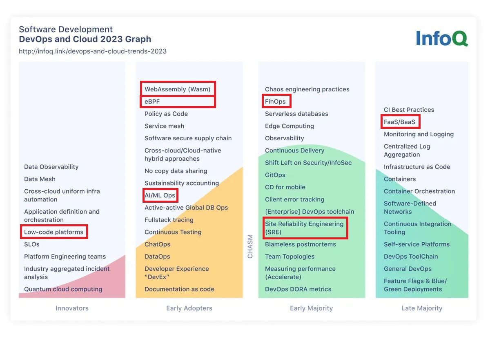
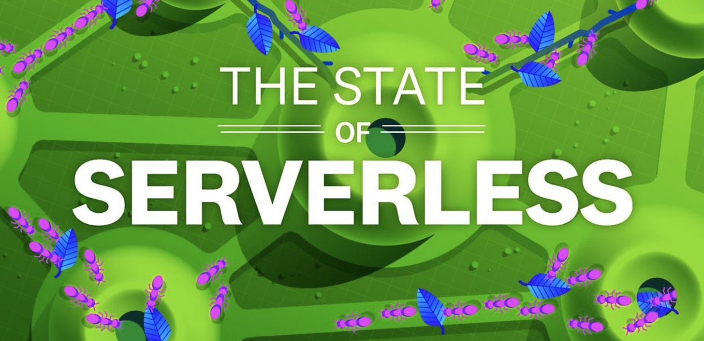
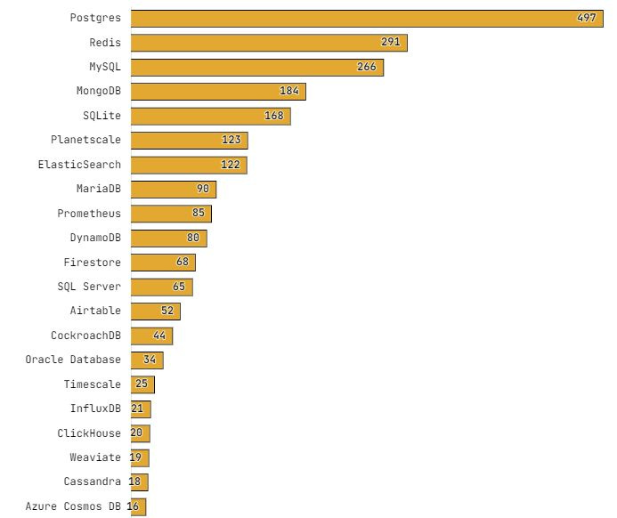

# The Trends #2: Software Development Trends 2023/2024 - Vol. 2.

At the start of 2024. we will look at the summary of**important software development trends**we observed in 2023. that will probably follow us in 2024. too. This is **the second** of [two-part](https://newsletter.techworld-with-milan.com/p/software-development-trends-20232024) newsletter issues on this topic.

In this issue, we will review the following:

- **2023 Technology Roadmap for Software Engineering by Gartner**
- **Accelerate State of DevOps Report 2023**
- **DevOps and Cloud InfoQ Trends Report**
- **State of Serverless 2023 by DataDog**
- **State of Cloud ☁️ 2023. by Pluralsight**
- **State of Databases in 2023. by Basedash**

So, let’s dive in.

---

## **[Postman Collections (Sponsored)](https://www.postman.com/collection/)**

*Postman Collections enable exceptional API organization. Postman Collections are groups of saved API requests that can be shared with others. These requests may represent a specific workflow, and they may also function as an API test suite. With collections, you can link related API elements together for easy editing, sharing, testing, and reuse.*

[Check it out!](https://www.postman.com/collection/)

---

## 2023 Technology Roadmap for Software Engineering by Gartner (October 2023.)

Gartner[surveyed more than 140 software engineering leaders](https://www.gartner.com/en/publications/2023-technology-adoption-roadmap-for-software-engineering) from significant companies about their strategies for mapping deployment risk, enterprise value, and deadlines for 47 prominent technologies and processes.

Here are the **key takeaways**:

1. **Value drivers**: Delivering superior capabilities and providing cost efficiency are the primary value drivers of software engineering technology adoption.
2. **[Risks:](https://www.gartner.com/en/publications/2023-technology-adoption-roadmap-for-software-engineering)** Software engineering leaders cite high or unpredictable costs and talent availability as the primary risk factors when adopting technologies. At the same time, price is a significant issue for more technologies, and talent availability risks are severe.
3. **Architectures:** Organizations deploy technologies to manage complex application architectures. In this area, 67% of the technologies are slated for deployment in 2023.
4. **Platform** Organizations invest in high-value platform technologies despite concerns about significant upfront costs. Leaders are implementing several platform technologies, such as cloud management platforms, API management PaaS, and iPaaS.
5. **Developer experience:** The top factors for technologies and techniques in the developer platforms and tools area are performance engineering, internal developer portals, and browser-based IDEs to improve developer experience or productivity.
6. **Security:** Organizations are adopting security and verification technologies to improve resilience and reliability throughout the SDLC. API threat protection is among the most valuable solutions that support stability and reliability.
7. **UX:** User experience and design technologies are low-risk ways to deliver value. In 2023, businesses intend to use various tools to assist with user experience and design.

We can see from the overview that technologies already implemented have a high value but low risk, such as **Progressive Web Applications** (PWA), while **Feature Management tools** have a bit less value. **Cloud management platforms** and **API threat protection** also bring more value.

2023 Technology Roadmap for Software Engineering by Gartner

---

## Accelerate State of DevOps Report 2023 (October 2023.)

DORA Research program [investigated more than 36,000 professionals](https://services.google.com/fh/files/misc/2023_final_report_sodr.pdf) from different organizations about the critical factors of high-performing organizations. They try to understand the relationship between ways of working and outcomes.

Here are the key findings in this year's report:

- **Teams with generative cultures perform 30% better.** It is a generative culture by Westrum, where people identify with the company mission and have a strong sense of ownership.
- **Teams that concentrate on the user perform 40% better.** Balanced teams work better than feature-driven teams.
- **Teams that review code more quickly do 50% better** regarding software delivery.
- **AI slightly chances measures of individual well-being** but has little to no impact on group-level outcomes.
- The effect that **technical capabilities have on organizational performance is amplified by high-quality documentation**. For instance, trunk-based development is predicted to have a 12.8x more significant influence on organizational performance.
- Employing a **public cloud increases infrastructure flexibility by 22%** compared to not doing so. This flexibility results in 30% improved organizational performance compared to rigid infrastructures.
- For organizational performance to reach its full potential, you need **excellent operational and software delivery performance.**
- **Burnout** is more prevalent in those who identify as underrepresented, such as **women** or those who self-identify as one gender. Several systemic and environmental variables most likely cause this effect.

Regarding performance levels, here are the results:

- **Elite performers** deploy on demand - 18%
- **High performers** deploy between once per day and once per week - 31%
- **Medium performers** deploy between once per week and once per month - 33%
- **Low performers** deploy between one week and one month - 17%

Software delivery performance (Accelerate State of DevOps Report 2023)

---

## DevOps and Cloud InfoQ Trends Report (July 2023.)

In the [latest report](https://www.infoq.com/articles/cloud-devops-trends-2023/) by **InfoQ**, we can see different trends in DevOps and Cloud Computing.

Here are the key insights:

- **Cloud innovation** has moved from a revolutionary to an evolutionary phase as workloads are migrated and re-architected. **Serverless technology** has seen a shift in adoption levels where it is becoming a common choice rather than a distinct architectural concept.
- **Artificial intelligence (AI) and Large Language Models (LLMs)**, such as GPT, may play a significant role in the cloud and DevOps areas by addressing cognitive overload and assisting with tasks like immediate management, ticketing systems, and code generation. Major cloud providers like Microsoft, Google, and AWS have integrated AI into their products and services.
- AI-based and ChatGPT-like products impact **low-code and no-code domains**, offering collaboration opportunities between business users and software engineering teams.
- **Platform engineering** is developing in a platform-as-a-service paradigm emphasizing simplification and value delivery. Platform engineering teams' responsibilities change from managing complicated infrastructure to providing services focusing on customer happiness.
- The industry has chosen **[OpenTelemetry](https://opentelemetry.io/)**[https://opentelemetry.io/](https://opentelemetry.io/)as the de facto standard for gathering metrics and event-based observability data. The standardized nature of it pushes vendors to innovate and optimize.
- The emphasis on **sustainability and green computing** influences architectural decisions to be effective and low carbon. Analyzing environmental effects and promoting sustainability efforts are essential tasks for Site Reliability Engineering (SRE) teams.

InfoQ DevOps and Cloud Trends Report 2023.

---

## State of Serverless 2023 by DataDog (August 2023.)

The [latest report](https://www.datadoghq.com/state-of-serverless/) by DataDog on serverless looked at data from over 20,000 of their customers who run their serverless workloads on their platform and in all primary cloud services.

Here are the insights:

1. **Major cloud providers continue to see significant serverless adoption.** 70% of AWS customers use serverless solutions.
2. **Google Cloud leads in fully managed container-based serverless adoption.** More than 66% of all serverless organizations use such solutions.
3. **Frontend development is the leading category of serverless platforms.** 62% use a frontend development platform like Vercel or Netlify, and 39% use edge compute offerings from Cloudflare and Fastly.
4. **Node.js and Python** remain dominant languages for AWS Lambda functions.
5. AWS Lambda function **cold starts in Java are two times longe**r than Python or Node.js
6. AWS Lambda use on ARM has **doubled** over the past year.
7. **Terraform** is the preferred AWS Lambda deployment tool among larger organizations.
8. 65% of organizations have **connected AWS Lambda functions to a VPC** (virtual private cloud)

The State of Serverless 2023. by DataDog

---

## State of Cloud ☁️ 2023. by Pluralsight (June 2023.)

The [latest State of Cloud report](https://www.pluralsight.com/resource-center/state-of-cloud-2023) surveyed more than 1,000 technologists and leaders in the United States, Europe, Australia, and India on the most current trends and challenges in cloud strategy.

According to the report, a significant multi-cloud skills gap is impeding organizations. The results highlight how vital cloud skill development is for businesses to ensure multi-cloud benefits exceed the risks.

Here are the key insights from the report:

1. **A hasty rush to multi-cloud**

More than 65% of companies already use multi-cloud environments in 2023, and another 20% report actively exploring an additional cloud platform for their cloud environment. Multicloud strategies are thus becoming more and more widespread.

However, many organizations need more resources to flourish and be equipped.

- **Only 20% of organizations have defined a cloud security strategy**, while another 28% are working to build one.
- To compound the problem, **only 9% have extensive experience with multiple cloud providers.**

The good news is that 71% of CEOs anticipate increases in their cloud budgets over the next 12 months, and 74% anticipate corresponding gains for cloud talent development.

1. **The need for multi-cloud skills development**

Businesses moving toward multi-cloud must engage in skill development, but where should they start? The following are the most in-demand talents and skill gaps for cloud employment in 2023, according to the report:

- **Artificial intelligence and machine learning skills** are the most in-demand cloud skills (23%) in 2023, up from 16% in 2023. In last year's report, data analytics skills were the most in-demand (33%), but fewer technologists (18%) ranked it as an in-demand skill in 2023.
- The most significant cloud skill gaps exist in **data, analytics, engineering, and storage** (42%), followed by security and governance (37%). In 2022, automation and DevOps were cited as the most glaring skills gaps (30%). Cloud practitioners must be proficient in these skill sets as data and AI-based solutions continue to rule the tech world.

State of Cloud 2023 by Pluralsight

---

## State of Databases in 2023. by Basedash (July 2023.)

In the [latest survey](https://stateofdb.com/) by Basedash and others, they researched the world of databases. More than 1k respondents from 96 countries voted on about 133 tools and techs. Although it is not a large sample, it shows trends to some extent.

Here are the results:

1. This year's respondents were almost unanimous in their preference for **SQL or SQL + NoSQL**, with very few expressing that if given the option, they would use NoSQL.
2. **Postgres** is this list's most well-known and widely used database, with Mongo and **MySQL** close behind. **Redis** is the second most popular despite being fourth in awareness.
3. Again, **Postgres** is the top pick for starting a new project, but many people have also shown interest in **Neo4j** and **Surreal**. Microsoft Access and Oracle DB were both near the bottom of the list.
4. **Postgres** also had the highest star rating, although **Planetscale** came in a close second, with many reviews to back them up. Notably, newer DBs like **Weavite**, **Surreal**, and **Timescale** were at the top of the scores.
5. **Prisma** is the most well-known, most used, and most currently in use ORM, but Supabase (while not a standalone ORM) is right behind with their client libraries.
6. **Microsoft’s Power BI** and **Tableau** outpace the competition regarding awareness but need to match that with current use from our respondents.
7. **Airtable** is the most well-known in the Internal and admin tools category. As internal tools, Retool and Django Admin are the most used tools in this category.
8. Regarding Data Warehouses, it's a **Biquery**, **Redshift**, and **Snowflake** game. All other tools or platforms are far from the same level of awareness or adoption.

Most popular Databases

---

## More ways I can help you

1. **1:1 Coaching:** [Book a working session with me](https://newsletter.techworld-with-milan.com/p/coaching-services). 1:1 coaching is available for personal and organizational/team growth topics. I help you become a high-performing leader 🚀.
2. **[Promote yourself to 20,000+ subscribers](https://newsletter.techworld-with-milan.com/p/sponsorship-of-tech-world-with-milan)**by sponsoring this newsletter.

---

Thanks for reading Tech World With Milan Newsletter! Subscribe for free to receive new posts and support my work.