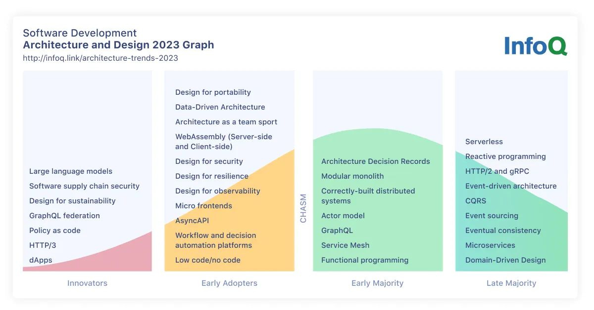
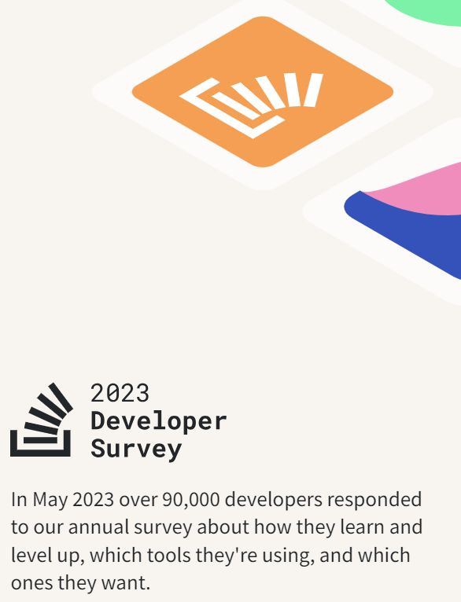
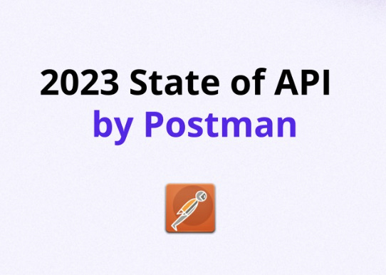
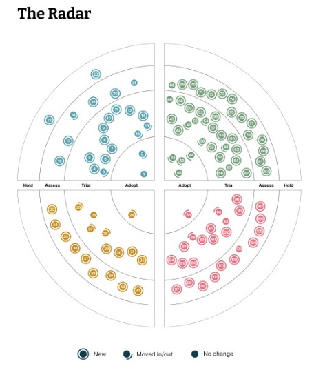
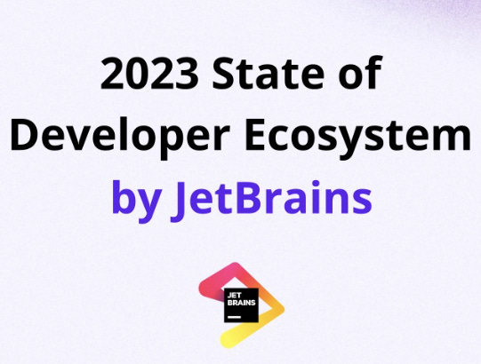

# The Trends #1: Software Development Trends 2023/2024 - Vol. 1.

At the start of 2024. we will look at the summary of**important software development trends**we observed in 2023. that will probably follow us in 2024. too. This will be the first of two newsletter issues on this topic.

In this issue, we will review the following:

- **Software Architecture InfoQ Trends Report 2023.**
- **Stack Overflow Developer Survey 2023.**
- **2023 State of the API Report by Postman**
- **ThoughtWorks Technology Radar - Volume 29.**
- **The State of Developer Ecosystem 2023 by JetBrains**

So, let’s dive in.

---

## **[Postman Collections (Sponsored)](https://www.postman.com/collection/)**

*Postman Collections enable exceptional API organization. Postman Collections are groups of saved API requests that can be shared with others. These requests may represent a specific workflow, and they may also function as an API test suite. With collections, you can link related API elements together for easy editing, sharing, testing, and reuse.*

[Check it out!](https://www.postman.com/collection/)

---

## Software Architecture InfoQ Trends Report (April 2023.)

In [the latest report by InfoQ](https://www.infoq.com/articles/architecture-trends-2023/), we got some new insights on Software Architecture and Design:

- **Design for Portability** is becoming more popular as architects can decouple business logic from implementation details because frameworks like Dapr emphasize a cloud-native abstraction model.
- **Large language models** will significantly influence, from enabling a new generation of low-code and no-code developers to understanding architectural trade-offs.
- In the upcoming years, **the Sustainability of software** will be a crucial design factor. As a result, improvements are being made to how the carbon footprints of software systems are measured and then reduced.
- **Architects** constantly seek ways to document better, explain, and comprehend decisions. Large language models might also be used in this field, functioning as forensic archaeologists to search through ADRs and git histories.

Also, some exciting changes to the graph: **Serverless** is now in the Late Majority, while **Architecture Design Records** (ADRs) entered the Early Majority. **Modular monoliths** are still a part of the Early Majority group.

Software Architecture InfoQ Trends Report - April 2023.

---

## Stack Overflow Developer Survey 2023. (June 2023.)

Guys from [Stack Overflow surveyed](https://survey.stackoverflow.co/2023/) more than 90,000 developers about how they learn and what programming languages and tools they use. Here are the results:

1. **Developer profile**

- Developers have **Bachelor's or Master's degrees** (>64%)
- Most developers **learn from online resources** (videos, blogs) > 80% and then books 51%
- The most used platforms are **Udemy** (66%), **Coursera** (35%), **Codeacademy** (24%), and **Pluralsight** (23%)
- 48% of respondents have been **coding for less than ten years**
- More than 33% of developers classify themselves as **full-stack developers**

1. **Technology**

- **JavaScript** is still the most popular programming language, followed by Python
- **SQL** is the third most used language
- We saw some technologies gain traction this year (**Bash/Shell, C, Ruby, Perl, and Erlang**)
- **PostgreSQL** is the most used database, followed by MySQL and SQLite.
- **AWS** is the most used cloud technology (49%), followed by **Azure** (26%) and **GCP** (24%)
- **Node.js** and **React.js** are the two most common web technologies all respondents use.
- **.NET (5+)** is again at the top of the list for other frameworks and libraries this year.
- **Docker** is the top-used other tool (53%), while npm is the second (49%)
- **Visual Studio Code** remains the preferred IDE (73%), followed by **Visual Studio** (28%)
- **Jira** and **Confluence** are the top two async tools among all developers
- **Erlang** is the highest-paid language to know
- We saw an **8% salary increase** in all main languages from the last year

1. **AI**

- 83% of respondents have used **ChatGPT** as a search tool
- AI is used for **writing code and debugging**
- **GitHub Copilot** is the pick for the most used AI developer tool (55%)

1. **Work**

- 70% of developers are **employed full-time**, while 16% are freelancers
- 42% work in **hybrid mode**, and 41% work remotely
- 40% of respondents work for an **organization that has less than 100 employees**
- Most Developers **code outside of work as a hobby** (70%)
- 90% of developers **interact with members outside their team** at least once per week
- 63% of developers **spend more than 30min a day** searching for answers or solutions to problems
- Most Developers report **having CI/CD, automated testing, and DevOps** available at their organization

Stack Overflow Developer Survey 2023.

---

## **2023 State of the API Report by Postman (June 2023.)**

More than [40,000 API professionals and developers were polled](https://www.postman.com/state-of-api)about issues like development priorities, API tools, and the future of APIs. The questions were updated this year to include pertinent information on API monetization and generative AI.

Here are the key findings:

1. **APIs are a moneymaker for most** - Nearly 2/3 of respondents claim that their APIs bring in money. 43% of the respondents stated that their APIs account for over a quarter of their business's income. Revenue was crucial in the financial services and advertising industries. It was ranked as the No. 2 indicator of a successful public API right after usage.
2. **API pricing increasingly matters** - Price is the primary factor, according to 47% of respondents, when determining whether to integrate with an API. In each of the previous two years, that number was 41% lower. Although other variables were given a higher priority, this result may indicate that API consumers are becoming more cost-conscious in the wake of the industry's downturn.
3. **Most API professionals use AI To help with coding** - Sixty percent of respondents claim to employ generative AI. Over half of them use it to identify faults in their code, and more than a third use AI to create new code. Building AI-powered apps came in first when developers were asked what kind of project they were most excited about in the upcoming year.
4. **The outlook for API investment has brightened** - Ninety-two percent of respondents—up from 89% last year—say that investments in APIs will increase or remain unchanged over the next 12 months. This growth may indicate that some people believe the worst of the technological sector's economic decline is behind us. However, fewer respondents anticipate reducing API investments this year.
5. **API security is improving, but some sectors have work to do** - For most responders, API security has improved, and incidents will happen less frequently in 2023. But certain industries performed worse than others. Participants in the poll said that monthly events happened at higher rates than normal in the automotive, educational, and retail sectors.
6. **The number of API-first leaders swells by almost half** - An increase from 8% in each of the previous two years to 11% of respondents who identified as leaders who prioritize APIs. This exclusive group performs exceptionally well across practically all metrics, including how rapidly APIs can be produced and quickly recovered after an API failure.

2023 State of API by Postman

---

## ThoughtWorks Technology Radar - Volume 29. (September 2023.)

In the latest Technology Radar [released in September by ThoughtWorks](https://www.thoughtworks.com/radar), we saw different themes emerging:

1. **AI-assisted software development:** AI-related topics dominated the conversation. There's a significant interest in using AI to assist in software development. Tools like GitHub Copilot, Tabnine, and Codeium were discussed. There's also excitement about open-source LLMs for coding.
2. **How productive is measuring productivity?** The industry has moved away from using lines of code as a measure of output. Instead, the focus is on engineering effectiveness. Tools such as DX DevEx 360 address this by focusing on the developer experience.
3. **A large number of LLMs:** Large language models (LLMs) form the basis for many modern breakthroughs in AI. The core competing ecosystems like OpenAI's ChatGPT, Google's Bard, and others were discussed.
4. **Remote Delivery workaround matures:** The pandemic's impact solidified complete remote or hybrid work as an enduring trend. Remote software development practices and tools have developed, with teams focusing on effective collaboration in a more distributed environment.

### Techniques

- **Adopt**: Design systems and a lightweight approach to RFCs.
- **Trial**: Accessibility-aware component test design, attack path analysis, automatic merging of dependency update PRs, and data product thinking for FAIR data, among others.
- **Assess**: Dependency health checks to counter package hallucinations, design system decision records, GitOps, and more.
- **Hold**: Ignoring OWASP Top 10 lists and web components for server-side-rendered (SSR) web apps.

### Tools

- **Adopt**: debt, Mermaid, Ruff, Snyk
- **Trial**: AWS Control Tower, Bloc, cdk-nag, Checkov, etc.

### Platforms

- **Adopt**: Colima is an alternative for Docker on macOS.
- **Trial**: CloudEvents, DataOps. live, Google Cloud Vertex AI, Immuta, etc.

### Languages and Frameworks

🔹 **Adopt**: Playwright
🔹 **Trial**: .NET Minimal API, Ajv, Armeria, AWS SAM, etc.

ThoughtWorks Technology Radar - Volume 29.

---

## The State of Developer Ecosystem 2023 by JetBrains (November 2023.)

In November, [JetBrains announced](https://blog.jetbrains.com/team/2023/11/20/the-state-of-developer-ecosystem-2023/) their new State of Developer Ecosystem 2023 report based on answers from 26,000 respondents.

Here are the key takeaways:

1. **AI usage**

- 77% of developers use **ChatGPT**, and 46% use **GitHub Copilot**
- Developers use it primarily **to ask general questions** and generate and explain the code

1. **Programming languages**

- In 2023, **Scala**, **Go**, and **Kotlin** developers ranked as the top three highest-paid
- JavaScript decreased in the last three years, giving space to **TypeScript**, while **SQL gained 3% in usage**.
- **Rust is ranked No. 1** when asked about migration to new languages, which aspire to replace C++ with its strict safety and memory ownership mechanisms. Yet, Python C/C++ still rules the embedded world
- Most **Kotlin** developers (66%) use the language for **Android** and server-side applications
- Also, **Objective-C is objetively retired**

1. **Developer background**

- For most people, reasonable **working hours and salary** are the most important, but you also need a feeling that you have achieved something
- Most professional goals are related to **learning new technologies and tools**
- Most of the developers have a **formal education** (70%)
- **Only 5% of developers are women**, which stays the same as in 2021
- Seniors become at the **age of 25 years**!
- **Architects are better paid than C-level**
- 70% said they **code for fun on weekends**

1. **Learning**

- Developers **mostly learn from documentation and APIs** (67%), blogs/forums (53%), and books (40%), and they spend around 3-8 hours per week.
- **Written content is still the most often used** for learning (53%), followed by video (45%).
- Yet, **75% said they had quit a program or course** before finishing it due to a lack of time or content needed to improve.
- Most respondents said they got IT news **primarily from social media, websites, and YouTube**.

1. **Wellbeing**

- More than half of respondents said they **don’t care about mental health**, while 34% said they use some psychological techniques on their own.
- Yet, **73% experienced burnout**, which is interesting compared to the previous statement and probably connected.
- **11% use medications** for mental health issues, while 9% visit a therapist

1. **Big Data**

- **Spark** is most used for batch processing, while **Spark Streaming** is used primarily for streaming
- **Airflow** is the most used orchestration tool
- **Data lakes are still primarily built using traditional relational databases**, and a  majority (64%) reported not using any engines for their data engineering tasks
- **59% don't use any testing framework**

1. **Databases**

- The most used databases are **MySQL(48%), MS SQL Server (40%), and PostgreSQL (39%)**, while popularity changes by region.
- The usage is also bound to programming language selection. E.g., **the share of MongoDB among Python users is 29.2%**, whereas its general share is 26.6%. PHP developers and MS SQL Server with C# developers mostly use MariaDB.

1. **Development**

- **61% use native tools for mobile development**, while 49% use cross-platform technologies (Flutter and React Native mostly).
- Only **33% use automatic static code analysis**.
- **82% use microservice architectural style!**
- 40% use **pair/mob programming**.

1. **DevOps and Cloud**

- **AWS** is used by 60%, and **Azure** by 25% of respondents
- 63% of developers use **Docker**

1. **Testing**

- Developers mostly write **unit tests (63%)**, then **integration (47%)**, and then **end-to-end and performance tests (~33%)**
- **Cypress** is much more used than **Playwright** (about a half)

2023 State of Developer Ecosystem by JetBrains

---

## More ways I can help you

1. **1:1 Coaching:** [Book a working session with me](https://newsletter.techworld-with-milan.com/p/coaching-services). 1:1 coaching is available for personal and organizational/team growth topics. I help you become a high-performing leader 🚀.
2. **[Promote yourself to 20,000+ subscribers](https://newsletter.techworld-with-milan.com/p/sponsorship-of-tech-world-with-milan)**by sponsoring this newsletter.

---

Thanks for reading Tech World With Milan Newsletter! Subscribe for free to receive new posts and support my work.