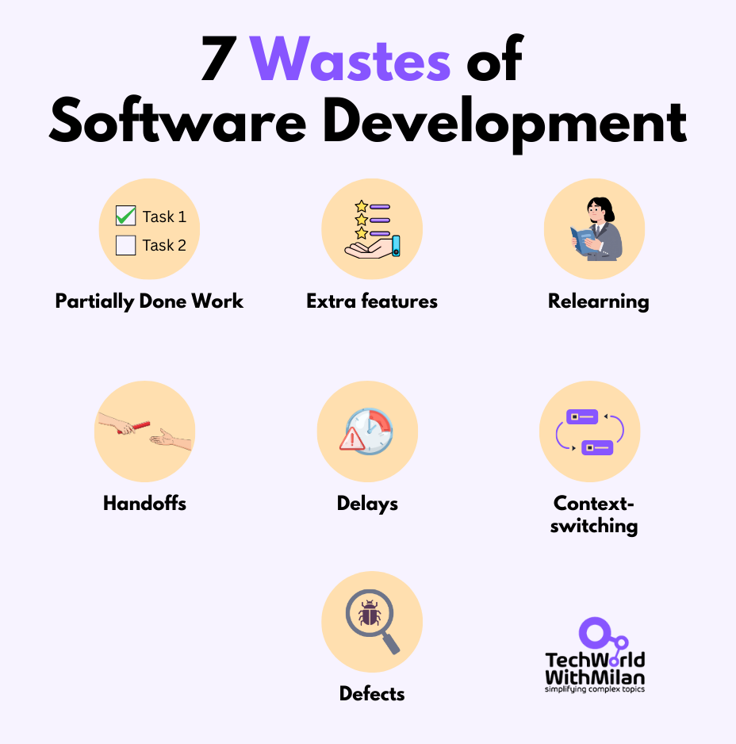
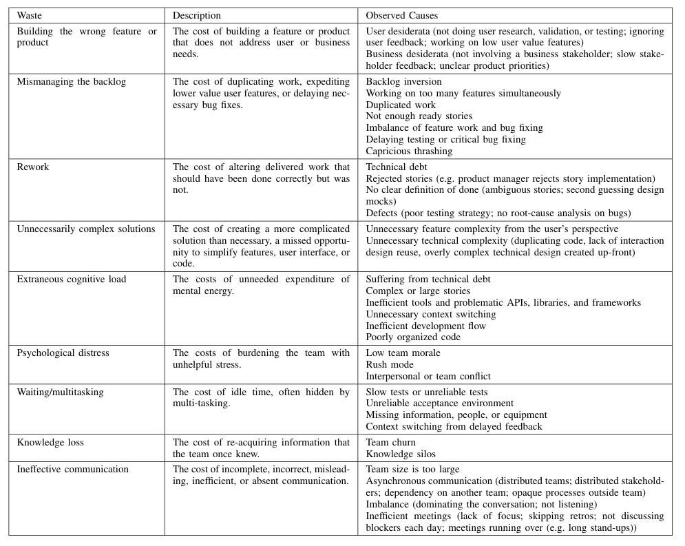
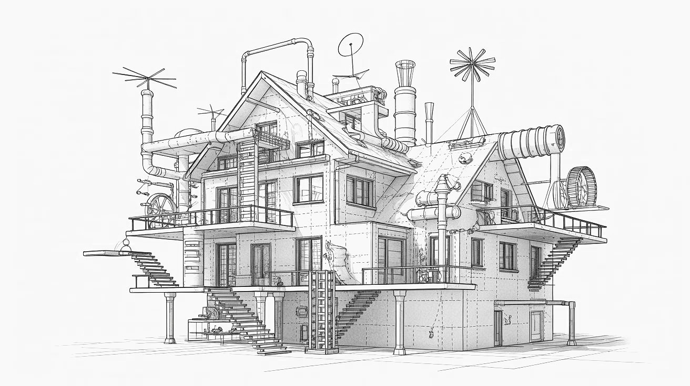
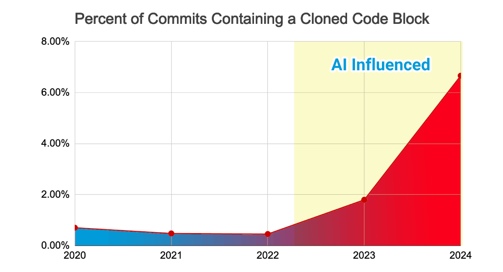
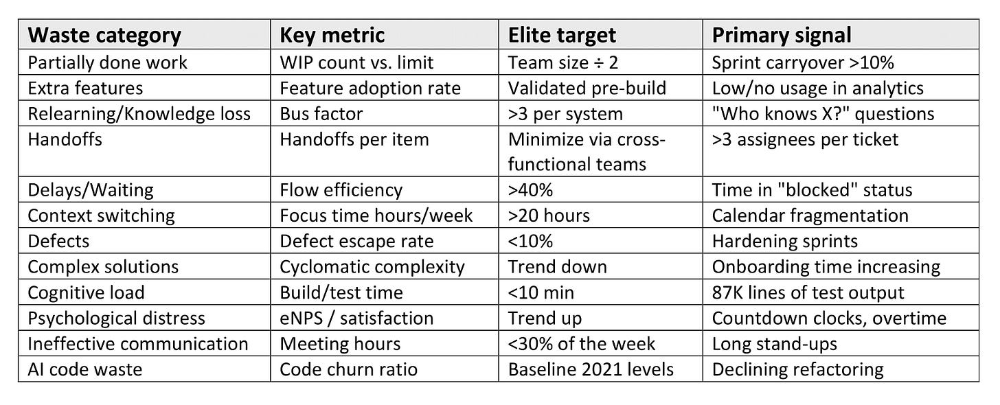
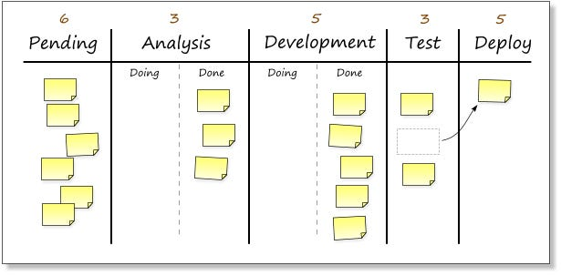
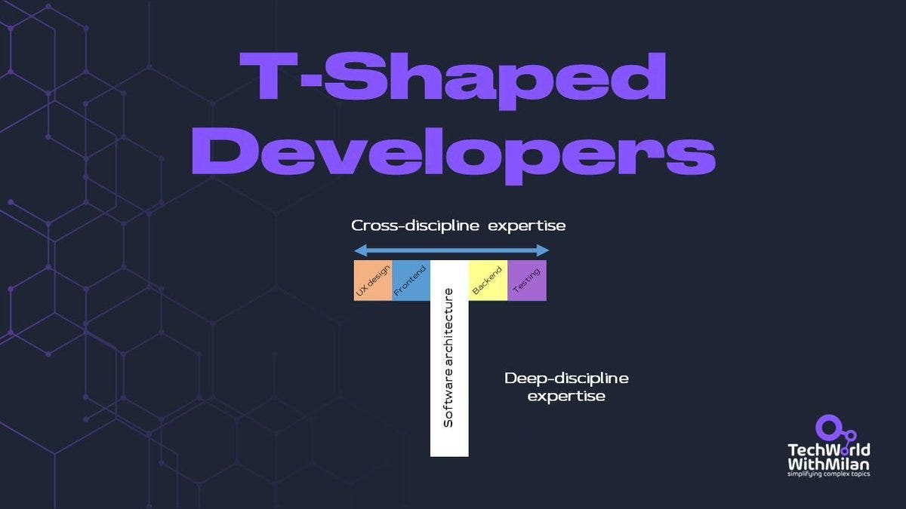

# Software Development Waste

Many of us can look back at a completed software project and think, *“If I’d known then what I know now, I’d have done much faster.”* This familiar feeling reveals just how much **waste** creeps into the software development process.

In lean thinking, *waste* is essentially any activity or output that adds no value from the customer’s perspective. In other words, it’s work that the user wouldn’t want to pay for.

Eliminating such waste has been a core principle of lean manufacturing since Toyota’s rise in the mid-20th century, and pioneers like Mary Poppendieck have shown how these lean principles apply to software development.

In this post, we’ll explore the classic “Seven Wastes” of software development and go beyond them, drawing on new insights from research and practice. Our goal is to help both engineers and managers identify waste in their workflows and share best practices to eliminate it, thereby improving productivity, quality, and team morale.

In particular, we are going to talk about:

1. **Seven Wastes of Software Development.** The traditional model of Poppendieck et al.’s work in Lean for Code. Deals with incomplete work, additional functionality, relearning, handoffs, waits, context switching, and defects.
2. **Beyond the Seven.** Sedano et al.’s work has provided further empirical validation, expanding the taxonomy to include nine types: wrong features, backlog mismanagement, over-engineering, cognitive load, psychological distress, communication, and code waste from AI-generated code.
3. **Practices to reduce waste**. How to make the waste visible with value stream mapping, control thrashing with WIP limits, keep from relearning through knowledge-sharing rituals, and eliminate handoffs with cross-functional teams.

So, let’s dive in.

---

## 1. Seven Wastes of Software Development

In **[Lean Software Development: An Agile Toolkit](https://amzn.to/4q3gN4V)** (2003) and later in **[Implementing Lean Software Development](https://amzn.to/4pGUyRH)** (2006), Mary and Tom Poppendieck identified seven categories of waste in software projects. These map closely to the original seven manufacturing wastes (like inventory, overproduction, defects, etc.) but are tailored to the realities of software work. **If you’re not creating real value, chances are you’re creating waste**.

The Poppendiecks’ seven wastes are:

1. **Partially done work.**Any work in progress that’s not usable by customers yet is effectively a *software inventory*. This could be code that’s been written but not integrated, tested, documented, or deployed. Such half-done work ties up effort without delivering value, may become obsolete, and creates uncertainty.
2. **Extra features.** Building features that aren’t really needed or used by end users (feature creep). Extra features cost money to develop, test, and maintain, while adding complexity and potential bugs to the system.
3. **Relearning.** The waste of knowledge loss when the team needs to relearn something that it previously knew. This usually comes from poor documentation or siloed expertise, where people don’t share or discuss knowledge. If a developer has to rediscover how to solve a problem that has previously been solved, or if new team members have to figure out what departed team members knew, then that’s relearning.
4. **Handoffs.** Each time work is transitioned from one person to another or from one team to another, there is always a chance that information will be lost or corrupted. This could mean throwing requirements over the wall to development, code to testing, or code to operations. Each time work is transitioned, there is a risk of miscommunication and delays.
5. **Delays.** All waiting is simply a waste. Waiting for approvers, for clarification, for a decision, for work from another team, for a build or test environment, for instance, is all delay and therefore waste. Each day a feature takes longer to deliver is a day its value is not delivered to the customer.
6. **Context switching.** That’s the productivity loss when people juggle multiple tasks or projects simultaneously. Every time a developer switches from one project or bugfix to another, there’s a high cost to getting their mind back into the context of that work.
7. **Defects.** Just like in manufacturing, a classic form of waste is defects or bugs, or quality issues. When a defect is noticed late, most likely by users or during a later testing phase, it results in rework: stopping new work, going back, fixing the issue, and likely redoing tests, among other steps. The cost of defects isn’t just the time to fix, but it is also the disruption to the team’s flow and, most importantly, the damage to customer trust.

These seven wastes, identified by the Poppendiecks, gave the software community a powerful lens for **seeing inefficiencies** in our processes. By mapping what we do to these categories, engineers and managers can start asking: *“Which of these wastes do we encounter daily, and how can we reduce them?”*

Once you become familiar with the “waste checklist,” you’ll spot waste everywhere, in unnecessary steps, avoidable rework, and time spent waiting or context-switching. The next step is figuring out how to eliminate it.

7 Wastes of Software Development by Mary and Tom Poppendieck

> “*The most successful development occurs when developers talk directly to customers or are part of business teams*” - Mary Poppendieck

## 2. Beyond the Seven: Modern Insights

The original seven wastes are not the only forms of waste in software development. As the industry has evolved, researchers and practitioners have observed **additional types of waste** that hinder software teams.

An empirical study by [Sedano](https://homepages.dcc.ufmg.br/~figueiredo/disciplinas/papers/icse17sedano.pdf)*[et al.](https://homepages.dcc.ufmg.br/~figueiredo/disciplinas/papers/icse17sedano.pdf)*[(2017)](https://homepages.dcc.ufmg.br/~figueiredo/disciplinas/papers/icse17sedano.pdf) spent over two years observing eight software projects and uncovered a broader taxonomy of nine wastes. Some overlap with the classic seven, but others extend into new dimensions of inefficiency.

According to their findings, software projects can waste effort through the following, as shown in the table below:

Types of Software Development Waste (Source: [Sedano et al., 2017](https://homepages.dcc.ufmg.br/~figueiredo/disciplinas/papers/icse17sedano.pdf))

Let’s unpack a few of these newer categories. The first and probably the most important one is **building the Wrong Feature/Product.**This is perhaps the ultimate waste of time, delivering something neither users nor the business actually need. It’s related to “extra features,” but goes deeper: it means whole features or even products were the *wrong thing* to build in the first place.

The next pressing problem is the **mismanagement of the Backlog**. This waste is associated with poor management of the work backlog. This can be a redundant set of work items, very frequent re-prioritizing of work items (commonly termed backlog thrash), or pursuing multiple tasks at the same time. This can also result from ignoring critical bug fixes.

One common waste we see in software projects is **over-engineering**. Over-engineering occurs when engineers develop a system that has a more complex architecture than is required to address the problem at hand. Maybe the code has been too abstract, the architecture too complex, or the feature's options too many.

An over-engineered house

The next important waste is **[Cognitive Load](https://github.com/zakirullin/cognitive-load)**. This is a reference to the effort your brain makes on things that don’t actually contribute to your project in the future. This is sometimes called “the tax your brain pays for messy code.” If a coder has to understand complex code to complete a task, they are using working memory to process it, which is extraneous cognitive load.

**Psychological distress**is a more human-centric type of waste. This one involves high stress and low morale that a team may experience. Some reasons for this type of waste could be unrealistic deadlines, pressure, or conflicts. When team members are demoralized, they become unproductive, which is a complete waste of the talent you have on your hands.

One of the key factors is **ineffective communication**. This type of waste comes from the cost of miscommunication or a lack of communication within and around the team. This may be a requirement that was not communicated well (resulting in rework) or a lack of communication within a team that works in silos. Sometimes key feedback is lost in asynchronous communication.

A new and emerging form of code waste over the last two years is **AI-generated code,** which doubles code churn. An analysis of 211 million lines of code by [GitClear](https://www.gitclear.com/ai_assistant_code_quality_2025_research) found that code churn doubled from 2021 to 2024 as AI coding assistants proliferated. Copy/pasted code increased from 8.3% to 12.3% while refactored/moved code dropped from 25% to under 10%. AI-generated code “resembles an itinerant contributor, prone to violate DRY-ness.”

Also, a [2025 METR study](https://metr.org/blog/2025-07-10-early-2025-ai-experienced-os-dev-study/) found that AI tools **slowed experienced developers by 19%** on familiar codebases.

AI-influenced code churn

It’s insightful to see how these nine observed wastes relate to the lean wastes. For instance, *knowledge loss* in this list is essentially the same as “relearning”, the loss of tacit knowledge due to team churn or silos.

*Waiting/multitasking*corresponds to delays. However, the inclusion of new concepts, such as psychological distress or ineffective communication, helps address issues of teamwork and communication that weren’t necessarily part of the original list of seven. Then the concept of AI-related waste is entirely new to us, and we have never encountered it.

Combining all frameworks yields an**extended taxonomy**:

Taxonomy of Software Development waste

The takeaway is that **waste hides in many forms**, from technical rework to human factors to process and planning glitches. Modern agile/lean practitioners often compile these into extended lists to help leaders systematically identify and fix waste in their organizations. The key is to continuously refine our awareness of waste and avoid being limited by a single static list.

## 3. Practices to reduce waste in Software Development

The challenge of identifying waste begins with waste identification. What must teams do to eliminate, at least minimize, these types of waste?

One, you want to **make this process visible**. You want to map the process from idea to deployed software and identify where the wait states, rework cycles, and handoffs occur. Where are the wait states in your process? Just like the value-stream mapping in the factories, you can do the same thing in your software process. Your team can look at this map, point to a spot, and say, “Oh, this step of the process feels like a time suck.”

Kanban board (Source: Kanban blog)

To prevent spending too much time on the incorrect or additional feature, you should practice rigorous prioritization and validation. **Adopt the MVP mentality**: “*The smallest thing that can deliver value, to get in the hands of the customer.*” Validate your approach through customer interviews, A/B testing, or a prototype to ensure you’re headed in the right direction before spending too much dev time.

After that, one would need to **limit multitasking and partially finished work by using WIP** at both the team and individual levels. Kanban boards can be a great tool here. If a column is at its limit, team members swarm to finish what’s in progress before starting new work. This encourages completion over starting new tasks and reveals bottlenecks (e.g., if “Waiting for QA” is always full, you have a quality process issue causing delay). By keeping WIP low, you’ll shorten delivery times and reduce the mental load on engineers. Little’s Law tells us that **high utilization creates long queues**(`Lead time = WIP / Throughput`), so don’t max people out at 100% all the time.

Another thing to remember is to prevent relearning and knowledge loss, create a culture of **continuous learning** and sharing. Tactics include:

- Pair programming (two heads solve and **remember** problems together)
- Regular lunch-and-learn sessions or guild meetings
- Internal wikis or knowledge bases for documentation
- Post-mortems for major incidents (to capture lessons learned).

When someone discovers an important fix or insight, encourage them to share it widely, perhaps with a quick demo or an internal blog.

Many handoffs and delays can be eliminated by restructuring teams. Instead of separate departments tossing work over the fence, move toward **cross-functional feature teams** that have all the skills needed (analysis, development, testing, ops) to deliver end-to-end.

Strive for T-shaped team members who, while having a specialty, can stretch to do basic tasks in other domains to avoid blocking the flow. In today's world, those are mostly full-stack engineers, as deep expertise is now much easier to gain with AI tools.

Many wastes (backlog, thrash, wrong features, defects, etc.) can be traced to **communication gaps**. This is either with stakeholders or within the team. Invest in practices that tighten feedback loops:

- Daily stand-ups to surface impediments
- Sprint reviews for obtaining feedback from stakeholders
- Retrospectives to reflect on what’s not working in the process

Encourage **open communication** so team members can raise issues early. Also, clearly communicate the requirements, for instance, by using acceptance criteria, examples, or prototypes to avoid misinterpretations that require rework.

When in doubt, a quick face-to-face (or video) conversation can save days of back-and-forth emails.

Finally, don’t forget the **human side.**Stop wasting morale and talent. In other words, avoid putting developers into constant context-switching or firefighting in “rush mode.” Sustain the pace to keep the team safe from burning out. A steady velocity is better than heroic spurts followed by crashes.

And don’t forget to celebrate successes while allowing failures to become learning opportunities (enforcing a no-blame culture).

> *Learn more about context-switching*:
[
Tech World With Milan NewsletterContext-switching is the main productivity killer for developersHave you ever wondered what the biggest productivity killer for developers is? There are many, but one stands out—and it’s often underestimated…Read morea year ago · 166 likes · 8 comments · Dr Milan Milanović](https://newsletter.techworld-with-milan.com/p/context-switching-is-the-main-productivity?utm_source=substack&utm_campaign=post_embed&utm_medium=web)
By keeping your team’s **psychological well-being** in mind, you are actually protecting productivity: reasonable work hours, support for learning, and psychological safety to speak up. A motivated, engaged team will naturally find and fix more waste in their own work, while a disengaged team might resign themselves to it.

## 4. Conclusion

In the end, we should note that **waste will always exist** in some form. We cannot eliminate all of it, but the goal is to hunt it down and remove it continuously.  For software teams, this means periodically reviewing how you work and asking, “Is this step really adding value? If not, how can we do it better or not do it at all?” Over time, minor improvements (automation here, a process tweak there, a bit of refactoring over there) compound into significantly faster and smoother delivery.

As a reminder, waste directly impacts efficiency, even morale. Time spent on non-value-added activities means time that’s not spent on innovation or on delivering quality. Engineers and managers must work together to help pinpoint areas of waste and prototype a possible solution. Where applicable, data will be used to identify areas that significantly affect productivity.

Once you know how to identify software development waste, you can apply the proper methods to eliminate it and end up with a better process that delivers value to customers much faster.

As Mary Poppendieck showed us, **software engineering can’t be viewed merely as a process of writing software, but as a process of removing the obstacles in the way of software creation.**

And remember not to suspend development for weeks to remove waste, as this could reduce morale and customer satisfaction. Some of the waste may not be worth removing. Stability is often more important than raw speed (unless you’re a high-growing startup).

Here’s to less waste and more value in your development journey!

---

## **More ways I can help you**

- **[📱 You Can Build A LinkedIn Audience](https://www.patreon.com/posts/you-can-build-143858069?source=storefront)** 🆕. The system I used to grow from 0 to 260K+ followers in under two years, plus a 49K-subscriber newsletter. You’ll transform your profile into a page that converts, write posts that get saved and shared, and turn LinkedIn into a steady source of job offers, clients, and speaking invites. Includes 6-module video course (~2 hours), LinkedIn Content OS with 50 post ideas, swipe files, and a 30-page guide. **[Join 300+ people](https://www.patreon.com/posts/you-can-build-143858069?source=storefront)**.
- [📚](https://www.patreon.com/techworld_with_milan/shop/ultimate-net-bundle-for-2025-1519389?utm_medium=clipboard_copy&utm_source=copyLink&utm_campaign=productshare_creator&utm_content=join_link)**[The Ultimate .NET Bundle 2025](https://www.patreon.com/techworld_with_milan/shop/ultimate-net-bundle-for-2025-1519389?utm_medium=clipboard_copy&utm_source=copyLink&utm_campaign=productshare_creator&utm_content=join_link)**. 500+ pages distilled from 30 real projects show you how to own modern C#, ASP.NET Core, patterns, and the whole .NET ecosystem. You also get 200+ interview Q&As, a C# cheat sheet, and bonus guides on middleware and best practices to improve your career and land new .NET roles. **[Join 1,000+ engineers](https://www.patreon.com/techworld_with_milan/shop/ultimate-net-bundle-for-2025-1519389?utm_medium=clipboard_copy&utm_source=copyLink&utm_campaign=productshare_creator&utm_content=join_link)**.
- [📦](https://www.patreon.com/techworld_with_milan/shop/premium-resume-package-1721454?utm_medium=clipboard_copy&utm_source=copyLink&utm_campaign=productshare_creator&utm_content=join_link)**[Premium resume package](https://www.patreon.com/techworld_with_milan/shop/premium-resume-package-1721454?utm_medium=clipboard_copy&utm_source=copyLink&utm_campaign=productshare_creator&utm_content=join_link)**. Built from over 300 interviews, this system enables you to quickly and efficiently craft a clear, job-ready resume. You get ATS-friendly templates (summary, project-based, and more), a cover letter, AI prompts, and bonus guides on writing resumes and prepping LinkedIn. **[Join 500+ people](https://www.patreon.com/techworld_with_milan/shop/premium-resume-package-1721454?utm_medium=clipboard_copy&utm_source=copyLink&utm_campaign=productshare_creator&utm_content=join_link)**.
- [📄](https://www.patreon.com/techworld_with_milan/shop/complete-tech-resume-reality-check-311008?utm_medium=clipboard_copy&utm_source=copyLink&utm_campaign=productshare_creator&utm_content=join_link)**[Resume reality check](https://www.patreon.com/techworld_with_milan/shop/complete-tech-resume-reality-check-311008?utm_medium=clipboard_copy&utm_source=copyLink&utm_campaign=productshare_creator&utm_content=join_link)**. Get a CTO-level teardown of your CV and LinkedIn profile. I flag what stands out, fix what drags, and show you how hiring managers judge you in 30 seconds. **[Join 100+ people](https://www.patreon.com/techworld_with_milan/shop/complete-tech-resume-reality-check-311008?utm_medium=clipboard_copy&utm_source=copyLink&utm_campaign=productshare_creator&utm_content=join_link)**.
- [✨](https://www.patreon.com/c/techworld_with_milan)**[Join My Patreon](https://www.patreon.com/c/techworld_with_milan)**[https://www.patreon.com/c/techworld_with_milan](https://www.patreon.com/c/techworld_with_milan)**[community](https://www.patreon.com/c/techworld_with_milan) and [my shop](https://www.patreon.com/c/techworld_with_milan/shop)**. Unlock every book, template, and future drop, plus early access, behind-the-scenes notes, and priority requests. Your support enables me to continue writing in-depth articles at no cost. **[Join 2,000+ insiders](https://www.patreon.com/c/techworld_with_milan)**.
- [🤝](https://newsletter.techworld-with-milan.com/p/coaching-services)**[1:1 Coaching](https://newsletter.techworld-with-milan.com/p/coaching-services)**. Book a focused session to crush your biggest engineering or leadership roadblock. I’ll map next steps, share battle-tested playbooks, and hold you accountable. **[Join 100+ coachees](https://newsletter.techworld-with-milan.com/p/coaching-services)**.

---

## **Want to advertise in Tech World With Milan? 📰**

If your company is interested in reaching founders, executives, and decision-makers, you may want to **[consider advertising with us](https://newsletter.techworld-with-milan.com/p/sponsorship-of-tech-world-with-milan)**.

---

## **Love Tech World With Milan Newsletter? Tell your friends and get rewards.**

We are now close to **50k subscribers** (thank you!). Share it with your friends by using the button below to get benefits (my books and resources).

[Share Tech World With Milan Newsletter](https://newsletter.techworld-with-milan.com/?utm_source=substack&utm_medium=email&utm_content=share&action=share)

[Track your referrals here](https://newsletter.techworld-with-milan.com/leaderboard).