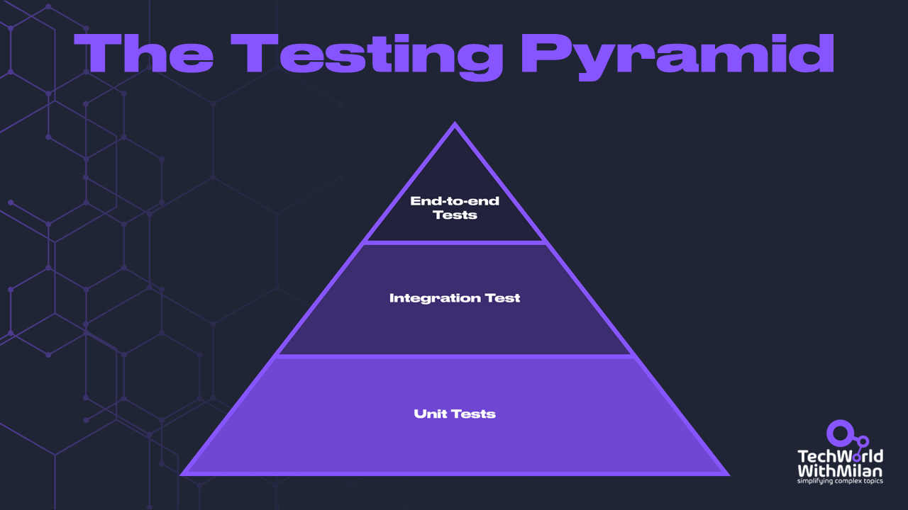

# Some important learnings from my 20 years of engineering life

When I started my journey as a software engineer two decades ago, **I couldn't have imagined the incredible evolution our field would have.** The IT industry has continuously progressed in different directions, from the rise of agile methodologies to the boom of cloud computing, from monolithic applications to microservices architectures, and back.

Yet, with this constant change, **I've discovered that certain fundamental principles remained. T**hese lessons have stood the test of time and become even more relevant in our increasingly complex world of software engineering.

In this post, **I'll share ten critical lessons I've learned over my 20-year career.** These principles have helped me navigate many projects, lead teams, and continuously grow professionally.

The lessons are:

1. **Don't do premature optimization**
2. **Think twice before writing code**
3. **Learn good practices**
4. **Make things simple and even simpler than that**
5. **Name things properly**
6. **Always test your code**
7. **Keep your time wisely. It is the most expensive thing you have.**
8. **Communicate, communicate, communicate**
9. **Don't just learn, do**
10. **Have a culture of documentation**

So, let’s dive in.

---

## **[Catio: Your Copilot for Tech Architecture (Sponsored)](https://catio.tech/)**

*Navigate the complexities of modern software engineering with **Catio**—your trusted copilot for tech architecture. With 24/7 AI-driven recommendations, real-time observability, and tailored and data-driven analysis, Catio empowers CTOs, architects, and engineering teams to make **smarter decisions** at every stage of the architecture lifecycle. Whether you're optimizing an existing tech stack, scaling your system efficiently, or elevating your tech architecture to establish yourself as a leader in your category, Catio helps you architect with confidence.*

***Ready to excel with your tech stack?***

[Learn More at Catio.tech](https://catio.tech/)

---

## 1. Don't do premature optimization

Remember [Donald Knuth](https://en.wikipedia.org/wiki/Donald_Knuth)'s famous quote: "*Premature optimization is the root of all evil (or at least most of it) in programming*." In the early days of my career, I fell into the trap of premature optimization more times than I'd like to admit. I once spent weeks creating a document management system for millions of users, only to find out later that we barely had a thousand visitors a month. Also, a few times, I implemented very sophisticated data access patterns that will allow us to support many databases, along with the main ones used. Of course, we never used any of the other databases.

This taught me an important lesson. **Since you will not replace that component with another one in the future, you probably won't need an abstraction now.** Instead, focus on writing simple code that efficiently solves the current problem.

**Premature optimization can lead to overengineered solutions** that are harder to maintain and understand. These solutions usually waste time and energy but will probably never be needed.

Generally, we should always follow **YAGNI, KISS, and DRY principles** in this order.

- **YAGNI** is the most important, as it says we should implement things when we need them, not when we think we might need them.
- **Keep it Simple, Stupid (KISS)**: Keeping code as simple and clear as possible. Simple code is easier to understand and maintain and less prone to errors.
- **Don’t Repeat Yourself (DRY)**: Avoid duplication in code, which can lead to inconsistencies and bugs. Yet, in some cases, we should have duplications, e.g., if we use shared logic in different places.

## 2. Think twice before writing code

As engineers, we always tend to solve all problems with code. Yet, during many years in the industry, I learned that sometimes the best solution involves no new code. This realization hit home during a project where we could eliminate an entire planned microservice by simply reconfiguring an existing system.

Before adding a new feature or function, ask yourself: *"Is this really necessary? Can we solve this problem without adding more code?*" Don't write if you're not sure you need that line of code. The most common mistake of great software engineers is optimizing code or processes that should not exist. **The best code is no code**. And this is true because **every line of code you write is a liability**. It needs to be maintained, tested, and potentially debugged. It also increases the cognitive load for other developers (including your future self) who need to understand the system.

Remember, **your goal is to solve problems and deliver value, not just to write code**. The simplest and most maintainable solution often involves writing less code, not more. Think like a **product-minded engineer, not a code monkey**.

So always **think twice, and code once**!

SpaceX reminds us that the best part is no part, and the best process is no process.

## 3. Learn good practices

Throughout my career, I've seen how adhering to good practices can dramatically improve code quality, team productivity, and project success rates. However, I've also learned that blindly following practices without understanding their context can be counterproductive.

When I say good practices, I mean:

- **Clean Code**. Read and apply Robert C. Martin's "[Clean Code](https://amzn.to/3ZTspxb)" principles to write more readable and maintainable code. Again, don’t follow it blindly; some things from the book still hold, and some don’t age well.
- **Design patterns**. Understand [Design patterns](https://www.patreon.com/techworld_with_milan/shop/design-patterns-in-use-e-book-312304?utm_medium=clipboard_copy&utm_source=copyLink&utm_campaign=productshare_creator&utm_content=join_link) and when to apply them appropriately. Also, don't force design patterns where they're not needed. I've seen projects become overly complex due to unnecessary use of patterns.
- **SOLID Principles**. Learn and apply the five SOLID principles of object-oriented design. These principles can guide you in creating more modular, flexible, and maintainable code. Yet, don’t be too rigid here, either.

- **Single Responsibility Principle** - A class or module should have only one reason to change, meaning it should have only one job or responsibility.
- **Open-Closed Principle** - Software entities should be open for extension but closed for modification, allowing the behavior to be extended without altering existing code.
- **Liskov Substitution Principle** - Objects of a superclass should be replaceable with objects of a subclass without affecting the program's correctness.
- **Interface Segregation Principle** - Clients should not be forced to depend on interfaces they do not use; instead, interfaces should be specific to client needs.
- **Dependency Inversion Principle** - High-level modules should not depend on low-level modules; both should depend on abstractions rather than concrete implementations.
- **Different software architecture styles**. Learn [various architectural patterns](https://newsletter.techworld-with-milan.com/p/what-are-the-main-api-architecture), such as microservices, monolithic, event-driven, etc., and understand the trade-offs of each style. For instance, microservices offer flexibility but introduce complexity in deployment and data consistency.

Remember, these practices are just tools you can use. Know when and how to apply them and when not. The key is understanding the principles behind these practices, not just following them in every situation.

## 4. Make things simple and even simpler than that

"*Make everything as simple as possible, but not simpler.*" This quote, often attributed to Albert Einstein, has guided my software design and problem-solving approach.

When building or designing our software, don't overcomplicate it. **Go with simple and easy-to-understand solutions.** We are in a very complex space here anyway. This means don’t use complex patterns or architectural styles if they are unnecessary. When doing something, always consider **whether you can achieve the same result with fewer moving parts.**

There are many benefits of simplicity:

- **Simpler code is easier to read, understand, and maintain.**
- **Simpler systems have fewer points of failure.**
- **Simplicity leads to faster development and easier debugging.**

Of course, we need to balance simplicity with functionality. We don't want to sacrifice necessary functionality only because of simplicity.

Simple code

## 5. Name things properly

Phil Karlton said, *“There are only two hard things in Computer Science: cache invalidation and naming things.”* I learned this the hard way. When writing code, we should always consider the reader because we spend most of our time reading that code, and that reader can be you in the future.

Good naming has a large impact on a codebase. It **reduces the cognitive load** for anyone reading the code (including your future self) and reduces Technical Debt. It also serves as a form of self-documentation, **making the code easier to understand** and maintain. It also helps prevent bugs by clarifying the purpose and behavior of code.

For example, instead of naming a function `processData()`, you can use more specific names like `calculateMonthlyRevenue()` or `validateUserInput()`. This will enable the reader to understand the intention of that function.

Some principles we can use for good naming:

- **Be specific and descriptive**: Names should convey the purpose or behavior of the entity.
- **Use consistent conventions**: Stick to a naming style throughout your codebase.
- **Avoid abbreviations** unless they're widely understood in your domain.
- Use **verbs** for functions/methods and **nouns** for classes/variables.
- **Be mindful of scope**: Use more descriptive names for things in more places.

Remember, code is read far more often than it is written. **Don't settle for the first name that comes to mind**. Always think from the reader’s perspective, will they understand what this name represents? Time choosing good names is an investment in your team's and future productivity.

## 6. Always test your code

In my early days, I viewed testing as something nice to have or  something to be done if time was left over. And that was a **big mistake**. This way of working produced many bugs and made many unsatisfied clients, which made us lose our credibility with them. No one wants to see bugs in the things they use, which also holds for the software.

We cannot afford untested code in our codebases. This means that some tests should cover every line of code, and we do this by following the **[Test Pyramid](https://martinfowler.com/bliki/TestPyramid.html)**. This means:

- Write **unit tests** for individual functions and methods. Keep them fast, independent, and deterministic.
- Implement **integration tests** to ensure different parts of your system work together correctly.
- Use **end-to-end (e2e) tests** to validate entire user workflows.

Treat the test code with the same care as the production code, keep it simple, and refactor it accordingly.

There are many benefits of testing your code:

1. **Catches bugs early** in the development cycle when they're cheaper to fix.
2. **Serves as living documentation** of how the system should behave.
3. **Enables confident refactoring** and feature additions.

Also, you can create a great software design by writing tests first and then refactoring it following **[Test-Driven Development (TDD)](https://amzn.to/47XgjFf)**. Start by writing a failing test, write the minimum code to make it pass, and finally refactor. This can lead to better-designed, more modular code.

When working with **untested legacy code**, add tests first and gradually increase test coverage as you modify or refactor the code.

In addition, always try to **automate your tests and integrate them into your CI/CD pipeline**. Aim for high test coverage ([60-80%](https://testing.googleblog.com/2020/08/code-coverage-best-practices.html)), but focus on critical paths and edge cases.

The Testing Pyramid

## 7. Keep your time wisely. It is the most expensive thing you have.

As I've progressed in my career, I've realized that effective time management is one of the most crucial skills for a software engineer. It's not just about being productive – it's about maintaining focus, avoiding burnout, and consistently delivering value.

There are a few things you can do to improve your time management:

- **Start your day by planning**: Spend 10-15 minutes outlining your priorities for the day.
- **Prioritize tasks (learn [Eisenhower matrix](https://newsletter.techworld-with-milan.com/i/115140651/prioritize-tasks-by-using-the-eisenhower-matrix))**. Categorize tasks based on urgency and importance to focus on what truly matters.
- **Use time-blocking**: Allocate specific time slots for different types of work. Put everything on the calendar.
- **Do 4 hours of [deep work](https://amzn.to/3TYcHgG) daily and focus on ONE thing**. Use techniques like the Pomodoro method to maintain focus. Set up "Do Not Disturb" modes during focused work periods on your devices.
- **Make one day in a week a non-meeting day**. Dedicate this day to deep work and complex problem-solving. Use this time for tasks that require uninterrupted concentration, like system design or tackling challenging bugs.
- **Learn to say no**. Don't commit to tasks or meetings that don't align with your priorities or attend meetings where you’re not needed.
- **Take regular breaks**: Short breaks can improve overall productivity.
- **Reflect and adjust**: Review your time management strategies regularly and adjust as needed. Use tools like [RescueTime](https://www.rescuetime.com/) or [Toggl](https://toggl.com/) to track your activities.

Read more about time management:
[
Tech World With Milan NewsletterHow to Be 10x More Productive I was always amazed by top performers. I wondered what they do and how they are much better than others. Then, I started researching and talking directly to some of them. I finally managed to get some top performers as my mentors and, in the end, became one of them. I learned that they are not better than others, but they use some techniques that help t…Read more3 years ago · 55 likes · 6 comments · Dr Milan Milanović](https://newsletter.techworld-with-milan.com/p/how-to-be-10x-more-productive?utm_source=substack&utm_campaign=post_embed&utm_medium=web)
And **[how to prioritize things](https://www.patreon.com/techworld_with_milan/shop/how-to-set-priorities-e-book-312292?utm_medium=clipboard_copy&utm_source=copyLink&utm_campaign=productshare_creator&utm_content=join_link)** properly.

Remember, the goal is not to work more hours but to make the most of your hours.

## 8. Communicate, communicate, communicate

During my career, I've seen great technical solutions fail due to poor communication and average solutions succeed because of excellent communication. **The ability to communicate effectively often separates good engineers from great ones**because it reduces misunderstandings and aligns everyone toward common goals.

How can you improve your communication?

- **Practice active listening:** Focus on understanding, not just responding. Listen for content, structure, and behind that (the whole picture).
- **Be clear and concise**: Avoid jargon when possible and get to the point. If you are struggling, prepare what you need to say before the meeting.
- **Always try to tailor your message to your audience**: Consider their technical background and interests. If you talk with Product or Business people, don’t discuss technical details too much.
- **Use visuals often**: Diagrams, flowcharts, and wireframes can convey ideas more effectively than words alone. I’m a big fan of this approach.
- **Follow up, always follow up!**Don’t let things keep hanging in the air. [Be proactive](https://newsletter.techworld-with-milan.com/p/the-habits-of-highly-effective-people); be an end-to-end owner of everything you do.

One way to improve your communication is to try **pair and mob programming**. Then, you don't need code reviews; you're collaboratively writing code with the same goal: improving your communication.

Also, don’t forget that more communication is always a good thing in the remote world. **So, if you’re in doubt, always over-communicate.**

## 9. Don't just learn, do

In software engineering, where there are so many things to know, both in breadth and depth, it is essential to constantly learn and apply new knowledge.

We need to be **intentional about our learning**. This means we want to learn something just before we need it because if we learn something now and don’t need it this year, we will probably forget most of it. Of course, it is good to track new stuff at some higher level so that you are informed enough.

So, my recommendation for learning new things is next:

- **Set regular learning time**, but always focus on practical application. Put it in your calendar as a blocker!
- When learning a new technology or concept**, challenge yourself to use it in a real project within a week**.
- **Share what you learn through blog posts, presentations, or mentoring other**s. Teaching is the best learning method.

Remember, the goal is not just to gain knowledge but to develop skills that can be applied to solve real-world problems.

Read more about **how you can learn anything**:
[
Tech World With Milan NewsletterHow to Learn Anything EfficientlyThis week’s issue brings to you the following…Read more3 years ago · 74 likes · 5 comments · Dr Milan Milanović](https://newsletter.techworld-with-milan.com/p/how-to-learn-anything-efficiently?utm_source=substack&utm_campaign=post_embed&utm_medium=web)
And **how you can become an expert in anything**:
[
Tech World With Milan NewsletterHow to become an expert in anything? Becoming an expert in software engineering or any other field isn't just about combining years of experience or learning the latest frameworks. It’s about navigating a structured journey of skill acquisition and deepening your understanding at every level…Read more2 years ago · 147 likes · 8 comments · Dr Milan Milanović](https://newsletter.techworld-with-milan.com/p/how-to-become-an-expert-in-anything?utm_source=substack&utm_campaign=post_embed&utm_medium=web)
Coding practice

## 10. Have a culture of documentation

In my early years, I often viewed documentation as something to be done after the "real work" of coding and usually very boring. After seeing many projects, **I see good documentation as a key part of the development process**.

Our projects have many types of documentation, such as API documents, architecture diagrams, user documents, readme files, and more. Each type plays an important role in the project's overall picture.

My recommendations on documentation in your projects are:

- **Keep your documentation close to your code (docs-as-code).** Use tools like Sphinx or Jekyll to generate documentation from your codebase.
- **Try to find a balance between the amount of documentation you need.** Over-documentation can be as problematic as under-documentation.
- **There is only one single source of truth here.** Avoid documentation in many places—the best place in the source code is close to the code the documentation explains.
- **Regularly update the documentation** to prevent it from becoming outdated.

Also, one good practice is to **include documentation in the definition of "done"** for any feature or project.

Remember, **good documentation is an investment in your project's future**. It helps new team members get up to speed quickly, reduces the bus factor, and can even help you understand your code months or years later (decreases [technical debt](https://newsletter.techworld-with-milan.com/p/how-to-deal-with-technical-debt)).

Read more about how to create proper architecture documentation in your projects:
[
Tech World With Milan NewsletterMastering the Art of Software Architecture DocumentationIn this newsletter, we will try to understand…Read more2 years ago · 112 likes · 2 comments · Dr Milan Milanović](https://newsletter.techworld-with-milan.com/p/documenting-software-architectures?utm_source=substack&utm_campaign=post_embed&utm_medium=web)
## What’s next?

Reflecting on these lessons from my two decades in software engineering, I'm surprised by how much our field has changed and how these fundamental principles have remained relevant. Perhaps the most important lesson is this: **our journey as software engineers involves continuous learning and adaptation all the time**. The technologies we use today may be obsolete tomorrow, but our ability to think critically, solve problems creatively, and work effectively with others will always be in demand.

These twenty years have taught me that software engineering is more than just a job—it's a craft and a mindset. **It's about solving problems, creating value, and continually pushing the boundaries of what we think we can do.** As you continue your career, I hope these lessons serve you as well as they have served me.

Remember, the code you write today could be running systems, powering businesses, or changing lives for years to come. **Approach each line with care, each problem with curiosity, and each collaboration with respect.** Here's to the next 20 years of learning, growing, and building amazing things together!

Good luck!

---

## More ways I can help you

1. **[LinkedIn Content Creator Masterclass ✨](https://www.patreon.com/techworld_with_milan/shop/short-linkedin-content-creator-311232?utm_medium=clipboard_copy&utm_source=copyLink&utm_campaign=productshare_creator&utm_content=join_link).**In this masterclass, I share my strategies for growing your influence on LinkedIn in the Tech space. You'll learn how to define your target audience, master the LinkedIn algorithm, create impactful content using my writing system, and create a content strategy that drives impressive results.
2. **[Resume Reality Check"](https://www.patreon.com/techworld_with_milan/shop/resume-reality-check-311008?source=storefront)**[🚀](https://www.patreon.com/techworld_with_milan/shop/resume-reality-check-311008?source=storefront). I can now offer you a new service where I’ll review your CV and LinkedIn profile, providing instant, honest feedback from a CTO’s perspective. You’ll discover what stands out, what needs improvement, and how recruiters and engineering managers view your resume at first glance.
3. **[Promote yourself to 35,000+ subscribers](https://newsletter.techworld-with-milan.com/p/sponsorship-of-tech-world-with-milan)**by sponsoring this newsletter. This newsletter puts you in front of an audience with many engineering leaders and senior engineers who influence tech decisions and purchases.
4. **[Join my Patreon community](https://www.patreon.com/techworld_with_milan)**: This is your way of supporting me, saying “thanks, " and getting more benefits. You will get exclusive benefits, including all of my books and templates on Design Patterns, Setting priorities, and more, worth $100, early access to my content, insider news, helpful resources and tools, priority support, and the possibility to influence my work.
5. **1:1 Coaching:** [Book a working session with me](https://newsletter.techworld-with-milan.com/p/coaching-services). 1:1 coaching is available for personal and organizational/team growth topics. I help you become a high-performing leader and engineer 🚀.

---
[https://newsletter.techworld-with-milan.com/p/some-important-learnings-from-my#poll-220746](https://newsletter.techworld-with-milan.com/p/some-important-learnings-from-my#poll-220746)Loading...
---

Thanks for reading Tech World With Milan Newsletter! Subscribe for free to receive new posts and support my work.