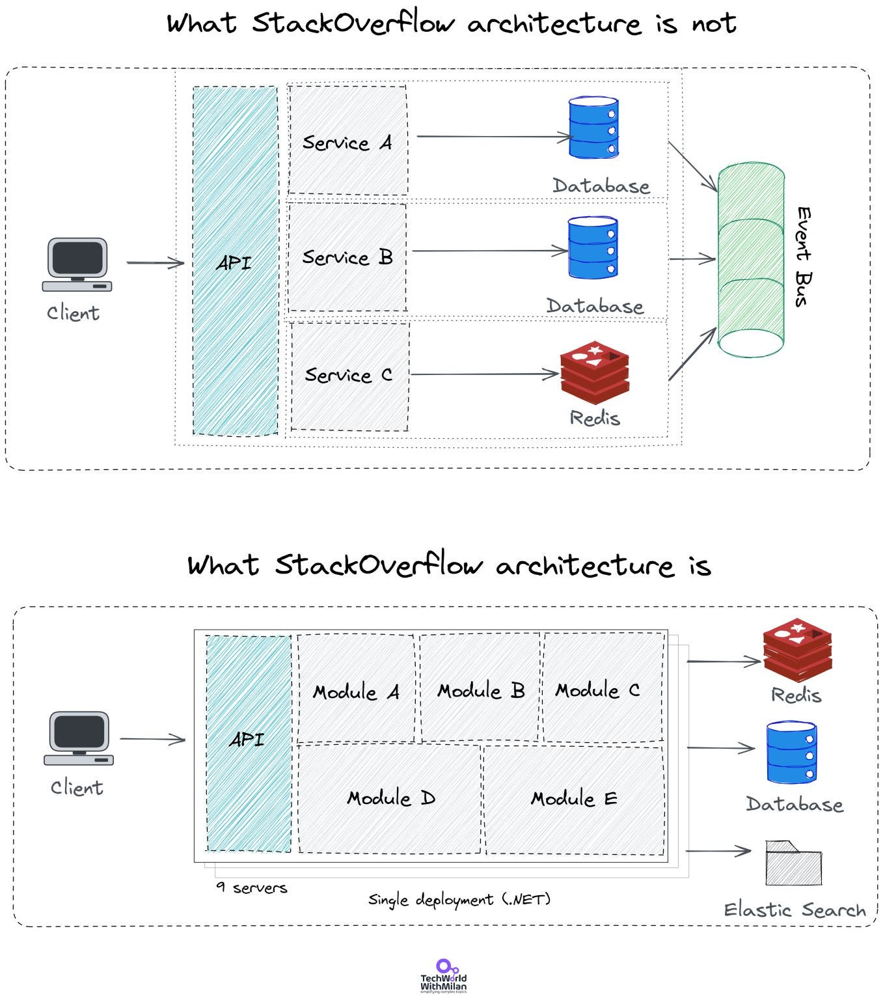
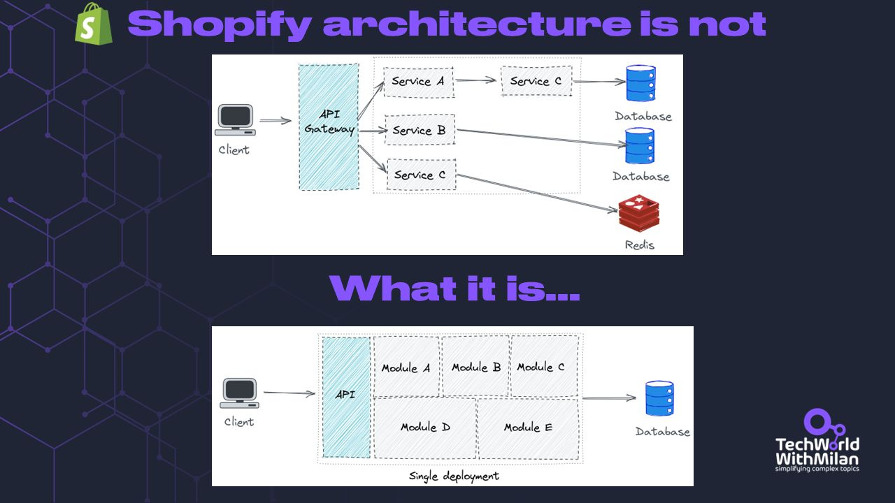
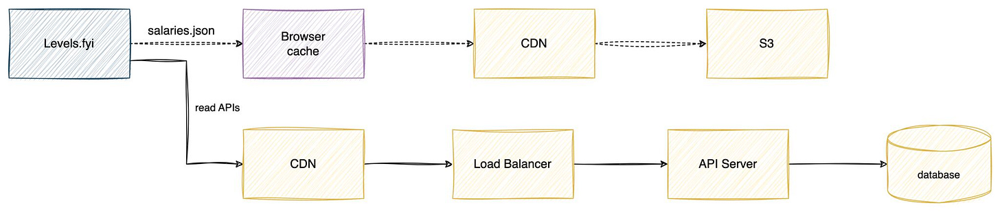

# Stack Overflow Architecture

*is not what you think it is.*

In this issue, we talk about:

- **Stack Overflow Architecture**
- **Shopify Architecture**
- **Levels.fyi Architecture**

So, let’s start.

---

In the [recent interview](https://hanselminutes.com/847/engineering-stack-overflow-with-roberta-arcoverde) with [Scott Hanselman](https://www.hanselman.com/), **[Roberta Arcoverde](https://twitter.com/rla4), Head of Engineering at Stack Overflow**, revealed the story about the architecture of Stack Overflow. They handle more than 6000 requests per second, 2 billion page views per month, and they manage to render a page in about 12 milliseconds. We imagine they use a microservice solution running in the Cloud with Kubernetes.

But the story is a bit different. Their solution is 15 years old, a giant**monolithic application running on-premise**. It is **a single application** on IIS which runs 200 sites. This single app is running on nine web servers and a single SQL Server (with the addition of one hot standby).

They also use **two levels of cache**, one on SQL Server with large RAM (1.5TB), where they have 30% of DB access in RAM, and two Redis servers (master and replica). Besides this, they have three tag engine servers and 3 Elastic search servers, which are used for 34 million daily searches.

All this is handled by a team of 50 engineers, who manage to **deploy to production in 4 minutes** several times daily.

Their **full tech stack** is:

- C# + [ASP.NET](http://asp.net/) MVC
- [Dapper ORM](https://github.com/DapperLib/Dapper)
- [StackExchange Redis](https://stackexchange.github.io/StackExchange.Redis/)
- [MiniProfiler](https://miniprofiler.com/)
- Jil JSON Deseliazier
- Exceptional logger for SQL
- Sigil, a .Net CIL generation helper (for when C# isn’t fast enough)
- NetGain, a high-performance web socket server
- [Opserver](https://github.com/opserver/Opserver), monitoring dashboard polling most systems and feeding from Orion, Bosun, or WMI.
- Bosun, backend monitoring system, written in Go

Stack Overflow Architecture

If you want to learn more about their architecture, there is a **[series of articles](https://stackexchange.com/performance, https://nickcraver.com/blog/2016/02/17/stack-overflow-the-architecture-2016-edition/)** from Nick Craver, one of the engineers from 2016. This is a bit outdated, but the architecture should be the same.

---

# Shopify Architecture

During Black Friday last year, Shopify managed to serve 1.27 million requests per second. And you probably think that such a large amount of requests can be only handled by some fancy microservices. The truth is a bit different.

Shopify uses a **modular monolith approach**, keeping all its code in one codebase but modularized. Monolithic architecture is the easiest one to understand and implement. Since monolithic design is simple to build and enables teams to move swiftly in the beginning, it can carry an application far to get their product in front of customers earlier.

There are many benefits to centralizing your application deployment and codebase maintenance. All functionality will be accessible in one folder; you only need to manage one repository. Additionally, it implies that one test and deployment pipeline must be maintained, which might save a lot of work. The ability to call into different components rather than relying on web service APIs is among the most alluring **advantaged of monolithic architecture** over several other services.

Shopify implemented one version of the modular monolith with **componentization in Ruby on Rails**. They organize a code base around real-world concepts (like orders, shipping, inventory, and billing), making it easier to label code and people who understand it. Each component is a mini Rails app (a module) that isolates business domains from one another. Each component claims sole ownership of the associated data and defines a straightforward, dedicated interface with domain boundaries communicated through a public API.

Check references [[1]](https://shopify.engineering/deconstructing-monolith-designing-software-maximizes-developer-productivity), [[2]](https://twitter.com/ShopifyEng/status/1597983918900510720).

# Levels.fyi Architecture

This is a story of **[Levels.fyi](https://www.levels.fyi/)**[,](https://www.levels.fyi/) who managed to scale to millions of users with only **Google Sheets as a backend**. They are a career site for professionals, which has 1-2 million unique user visits every month.

They wanted to move fast and focus on important things when they started, so they needed a backend. They**used a no-code approach with Google Forms + Google Sheets** (with the addition of AWS Lambda and API Gateway). This also enabled them to save developer time, reduce complexity and save infrastructure costs.

Yet, their architecture worked well for 24 months, but the user base has grown, and they started to have issues, so they decided to **move to a new backend with a database and API Server**. They duplicated the write query to their new database and read from the new API as that was ready, so Google Sheets was retired.

Check **[the full story](https://www.levels.fyi/blog/scaling-to-millions-with-google-sheets.html)**.

Levels.fyi architecture

To learn more about modular monoliths, check here:
[
Tech World With Milan NewsletterWhy should you build a (modular) monolith first?In recent years we have seen a significant increase in apps built using a microservices architecture. The main reason we select this approach is to have small teams working in isolation without having them trip over each other. Yet, this is an organizational problem, not a technical one. We can also build each service in different technology and scale i…Read more3 years ago · 26 likes · 2 comments · Dr. Milan Milanović](https://newsletter.techworld-with-milan.com/p/why-you-should-build-a-modular-monolith?utm_source=substack&utm_campaign=post_embed&utm_medium=web)
---

🎁 If you are interested in sponsoring one of the following issues and supporting my work while enabling this newsletter to be accessible to readers, check out the **[Sponsorship Tech World With Milan Newsletter](https://newsletter.techworld-with-milan.com/p/sponsorship-of-tech-world-with-milan)** opportunity Tech World With Milan Newsletter.

---

Thanks for reading Tech World With Milan Newsletter! Subscribe for free to receive new posts and support my work.