# The Developer's Guide to Working with Legacy Codebases

*or how do you eat an elephant?*

Have you ever started a new job and found yourself staring at a complex codebase, unsure of where to begin? You're not alone. Many of us have been there, trying to make sense of outdated code that still runs major parts of the business.

A 2024 Stack Overflow survey found that over **80% of developers regularly work with legacy code, making it a common challenge in our industry**. Most legacy software has its worth, as it is still in use and has loyal clients.

In the rest of the article, we'll talk about the typical problems you might face, like outdated technology, missing documentation, and enormous piles of technical debt. More importantly, **we'll share some practical steps to help you understand and navigate these old systems**.

We'll also look at advice from experts like Michael Feathers and explore how modern tools, including AI assistants like GitHub Copilot, can make life easier.

So, let’s dive in.

---

## Navigating legacy codebases

Let's say you've just joined a new team, and you're faced with a massive codebase that's been around longer than most of your colleagues. The documentation is old and was last updated in 2009. The original developers are no longer with us, yet this system continues to power critical business operations. How do you tackle this? According to a [2024 survey by Stack Overflow](https://survey.stackoverflow.co/2024/), over **80% of developers regularly work with legacy code**, making it a universal challenge in our industry.

Most of us have had the experience of working with a legacy codebase, or you're currently in this situation. The intensity of such expertise varies depending on several factors, such as the extent of the codebase, the quality of the code, whether it has tests, and whether there is someone within the company who can provide guidance.

There are different definitions of legacy code. Some say it's code inherited by a team or developer, code without tests, or even that "**code is legacy code as soon as it's written**." It usually refers to code still in use but may need to be fully understood, well-documented, or maintained by the current development team.

### Challenges when dealing with Legacy code

Legacy code usually has different challenges, such as:

- **Outdated technology or programming languages**. Legacy code may have been written using outdated technologies (no longer supported), doesn't follow modern practices, or programming languages that are no longer widely supported or maintained.
- **No documentation**. In some cases, legacy code may have inadequate or non-existent documentation, making it harder for developers to understand how it works or how to modify it without introducing new issues.
- **Large [Technical Debt](https://newsletter.techworld-with-milan.com/p/how-to-deal-with-technical-deb).** Legacy code often accumulates technical debt, which is the cost of additional work required to maintain or refactor the code to make it easier and more maintainable in the long term. Examples of technical debt are outdated libraries, convoluted logic, dead code, and more.
- **Integration problems.** Integrating legacy code with newer systems or technologies can be problematic, as it may rely on outdated APIs, libraries, or data formats.
- **Testing challenges.** Legacy code may need more adequate tests, making it difficult to ensure that modifications or integrations do not introduce new bugs or regressions.

Yet, in such a situation, we usually feel overwhelmed and don't even know where to start. The first step is to understand the code before doing anything about it.

[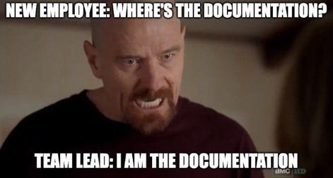](https://substackcdn.com/image/fetch/$s_!LGiM!,f_auto,q_auto:good,fl_progressive:steep/https%3A%2F%2Fsubstack-post-media.s3.amazonaws.com%2Fpublic%2Fimages%2F84f9d958-7c84-493a-9e2a-2ac00b361785_471x252.jpeg)

### The recommended approach to understanding legacy code

Here is how you can approach it:

#### 1. Read the technical documentation

Gather existing documentation, including architecture diagrams, code comments, and user manuals. Speak with team members with experience with the codebase to better understand its history, development choices, programming languages, and known issues. Try to understand the business side of the project and what this code is supposed to do.

> **👉 Recommended tools**:*Confluence, Draw.io for architecture diagrams, Notion for team documentation*

#### 2. Identify and analyze hotspots

**[Focus on](https://newsletter.techworld-with-milan.com/i/148446535/prioritize-technical-debt-with-hotspots)**[https://newsletter.techworld-with-milan.com/i/148446535/prioritize-technical-debt-with-hotspots](https://newsletter.techworld-with-milan.com/i/148446535/prioritize-technical-debt-with-hotspots)**[hotspots](https://newsletter.techworld-with-milan.com/i/148446535/prioritize-technical-debt-with-hotspots)**, i.e., parts of the code that are frequently changed, as this is where you will likely spend most of your time. Go and talk to users and your colleagues. Try to determine the business requirements and document everything. Ask your manager or team leader to assign you a bug fix or minor feature that will expose you to the codebase as early as possible or perform any activity with your teammates' such as pull request reviews that can throw you out there to learn the code base actively, rather than passively reading line by line.

> **👉 Useful tools**:*Git blame, [CodeScene for hotspot analysi](https://newsletter.techworld-with-milan.com/p/how-to-deal-with-technical-debt-in)s, [SonarQube for code quality metrics](https://newsletter.techworld-with-milan.com/p/enabling-high-quality-code-in-net)*

#### 3. Set up a development environment

Establish a local development environment that closely mimics the production setup. Ensure you can build and run the application locally, accessing the necessary databases, services, and configuration files. Always try what you did in the dev/test environment before pushing to production.

> **👉 Useful tools***: Docker for containerization, ELK Stack for logging, New Relic or Datadog for monitoring*

#### 4. Ensure you have all the necessary tools

Check the version control system for any history of changes to the files you touch. If you don't have it, the first step is to set it up. We need this to understand past changes and the reasoning behind them. Next, ensure you have a continuous integration and bug tracking system.

> **👉 Recommended stack**: *Git, Jenkins/GitHub Actions, Azure DevOps*

#### 5. Focus on entry points and critical functionalities

Identify the application's entry points, such as the primary method or initialization scripts. Trace the execution path from these entry points to understand the application's flow. Utilize debugging tools, such as IDEs, debuggers, and logging frameworks, to trace issues and gain a deeper understanding of the codebase.

> **👉 Debugging approach**: *Use logging frameworks, step-through debugging, and performance profiling tools*

#### 6. Identify dependencies and modules

Analyze the codebase to identify dependencies, libraries, and frameworks. Understand the purpose and function of each module or package in the system. Familiarize yourself with the main components and their interactions, and create a high-level map of the system's architecture.

> **👉 Useful tools**:*Structure101, JDepend for Java projects, npm-dependency-graph for JavaScript*

#### 7. Use feature flags

The purpose of [feature flags](https://newsletter.techworld-with-milan.com/p/what-are-deployment-patterns) here is to turn off your code if something goes wrong (i.e., rollback strategy), and it enables you to launch when you want to. With feature flags, you don't need to wait for the next (formal) release. Yet, be careful to clean them up because they introduce a new complexity (e.g., create a doc to track them).

[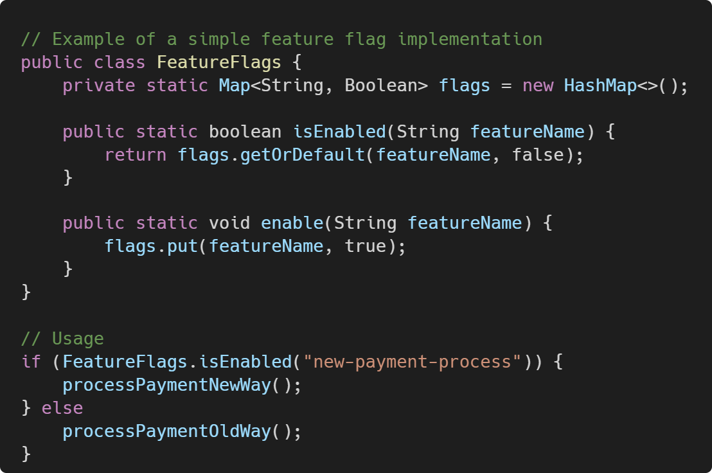](https://substackcdn.com/image/fetch/$s_!lcpK!,f_auto,q_auto:good,fl_progressive:steep/https%3A%2F%2Fsubstack-post-media.s3.amazonaws.com%2Fpublic%2Fimages%2F4a8cd3c9-35f2-4521-bbd3-08f0772e2cff_1108x736.png)An example of a feature flag in Java

#### 8. Write tests and refactor cautiously

Legacy codebases often lack adequate test coverage. **Don't touch anything untested**! Before making any changes, write unit and integration tests to ensure your modifications don't break existing functionality. When refactoring, start with small, incremental changes and avoid large-scale rewrites that might introduce new issues. This approach is called "[Strangler Fig](https://newsletter.techworld-with-milan.com/i/119851189/monolith-decomposition-strategy)".

If you find methods that are too long, break them down into new, shorter methods. You should also clean up dead code, remove magic numbers, and apply other Clean code principles.

Testing approach recommendation:

1. *Write characterization tests for existing behavior*
2. *Add unit tests for areas you plan to change*
3. *Implement integration tests for critical paths*
4. *Use mutation testing to verify test quality*

#### 9. Document your findings

As you explore the codebase, document your discoveries and insights. This documentation will help you and your team better understand the system and make future changes more efficiently.

In addition, if someone asks you for a complete rewrite of the app, say NO! Especially if it's bigger. Even with some valid reasons, it is usually a significant and unpredictable job.

> ***👉*****Recommended tools**: *[Architecture Decision Records (ADRs)](https://newsletter.techworld-with-milan.com/i/138309128/architectural-decision-records-adrs), Swagger for API documentation, README.md files in repositories.*

Learn more about how to document your software:
[
Tech World With Milan NewsletterMastering the Art of Software Architecture DocumentationIn this newsletter, we will try to understand…Read more2 years ago · 116 likes · 2 comments · Dr Milan Milanović](https://newsletter.techworld-with-milan.com/p/documenting-software-architectures?utm_source=substack&utm_campaign=post_embed&utm_medium=web)
#### 10. Perform regular code reviews

Code reviews can be done through comments on a pull request, in-person chat, or a remote video chat. You can do it with a fellow engineer, your engineering manager, or anyone familiar with that codebase. Learn how to do it properly here.
[
Tech World With Milan NewsletterHow To Do Code Reviews ProperlyWhy Do We Need to Do Code Reviews…Read more3 years ago · 40 likes · 3 comments · Dr Milan Milanović](https://newsletter.techworld-with-milan.com/p/how-to-do-code-reviews-properly?utm_source=substack&utm_campaign=post_embed&utm_medium=web)
#### Bonus: Focus on ONE thing

Remember to **[focus on one thing at a time](https://newsletter.techworld-with-milan.com/p/how-to-be-10x-more-productive)**. To prevent getting overwhelmed and lost in the mountain of code, I recommend first focusing on just one part of the codebase, understanding it, and then moving on to the next one.

Navigating legacy codebases

Read more about how to deal with Technical debt in legacy codebases:
[
Tech World With Milan NewsletterHow to deal with Technical Debt in legacy projects We have all been working on an existing project with many issues. All of those issues are more or less known to team members and are, to some extent, apparent problems in the development flow. The umbrella term for all of these issues is Technical Debt…Read morea year ago · 54 likes · 5 comments · Dr Milan Milanović](https://newsletter.techworld-with-milan.com/p/how-to-deal-with-technical-debt-in?utm_source=substack&utm_campaign=post_embed&utm_medium=web)
### Further reading

- "[Working Effectively with Legacy Code](https://amzn.to/3Ud4oh2)" by Michael Feathers
- "[Refactoring: Improving the Design of Existing Code](https://amzn.to/3C0DaUu)" by Martin Fowler
- "[Clean Code](https://amzn.to/3zVzH9p)" by Robert C. Martin

---

## Working effectively with legacy code

In his book “**[Working Effectively With Legacy Code](https://amzn.to/3Ud4oh2)**, " Michael Feathers discusses dealing with legacy software. Although the book is a bit dated (published in 2004), it contains some valuable techniques that remain relevant today. This book gives an overview of the approach to legacy code that we can use, focused incremental unit testing and refactoring to improve its testability and extensibility while implementing and delivering new functionality.

[Working Effectively With Legacy Code,](https://amzn.to/3Ud4oh2) Michael Feathers

The author defines legacy code as "**code without tests**." This implies that if the code doesn't have tests, it's challenging to ensure that changes to the code will only introduce unintended side effects or break existing functionality.

He lists four reasons to change software:

- **➕ Adding a feature**
- **🔧 Fixing a bug**
- **🛠️ Improving the design (i.e., refactoring)**
- **⚙️ Optimizing resource usage**

He says that regardless of how the code is altered, we must always uphold other behaviors we do not plan to change.

> ➡️*The most important rule when dealing with legacy code is to* ***go slow and be patient.***

### The Legacy Code Change Algorithm

The main contribution of this book is **the Legacy Code Change Algorithm**(first add tests and then make changes):

1. **Identify the legacy code you want to change**. Define a scope (**Seam**) for the target change or new code addition.
2. **Get that legacy code into a test harness and cover it with tests**. Break dependencies (very carefully and often without sufficient tests), get the targeted legacy code into a test harness, and cover targeted legacy code with characterization unit tests.
3. **Add new functionality with new tests** by using the Test-Driven Development (TDD) process.
4. **Refactor the rested code to remove duplication**, clean up, etc.

Like a good wine (Credits: [CommitStrip](https://www.commitstrip.com/en/2019/03/13/like-a-good-wine/?))

### Useful techniques

Michael Feathers suggests some valuable techniques to facilitate working with legacy code, namely:

- **🔍 Identify seams** (scope) to isolate code for testing.
- 🌱 Use **Sprout Methods and Classes** to add new functionality without disturbing existing code.
- 🔄 Apply **Wrap Methods and Classes** to modify behavior safely.
- 🧪 Write **Characterization Tests** to define and protect existing behavior.

So, let’s check examples of each of these techniques.

#### **1. Identifying Seams**

Find places in the code where you can change the behavior without modifying the code itself. Seams can be at the class, method, or function level and help you isolate parts of the code for testing and refactoring. This is important **as your original code was not written to be testable, so you will probably have some dependencies on 3rd parties** (such as Db or other similar external systems), and we need to break this dependency.

Suppose you have a legacy class `ReportGenerator` that reads data from a database and generates reports.

[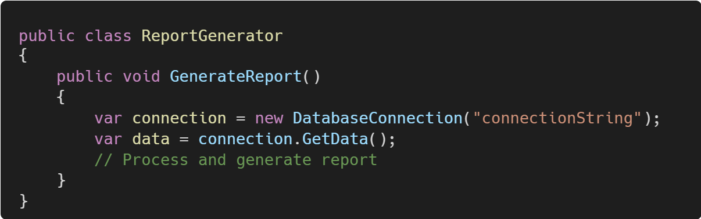](https://substackcdn.com/image/fetch/$s_!7jOe!,f_auto,q_auto:good,fl_progressive:steep/https%3A%2F%2Fsubstack-post-media.s3.amazonaws.com%2Fpublic%2Fimages%2Fc8dc1610-d041-47cf-9fde-c89a37eaa7a0_1206x378.png)

The direct dependency `DatabaseConnection` makes it hard to test `GenerateReport` without accessing the actual database. To create a seam, you can introduce an interface:

[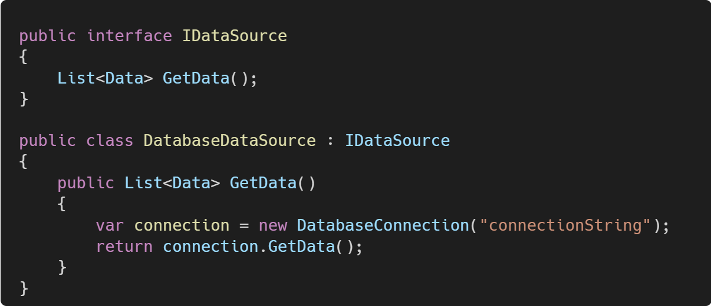](https://substackcdn.com/image/fetch/$s_!6b61!,f_auto,q_auto:good,fl_progressive:steep/https%3A%2F%2Fsubstack-post-media.s3.amazonaws.com%2Fpublic%2Fimages%2F4e6eda3f-84f8-4aec-83ed-11ccf50194cb_1206x520.png)

Modify `ReportGenerator` to depend on `IDataSource`:

[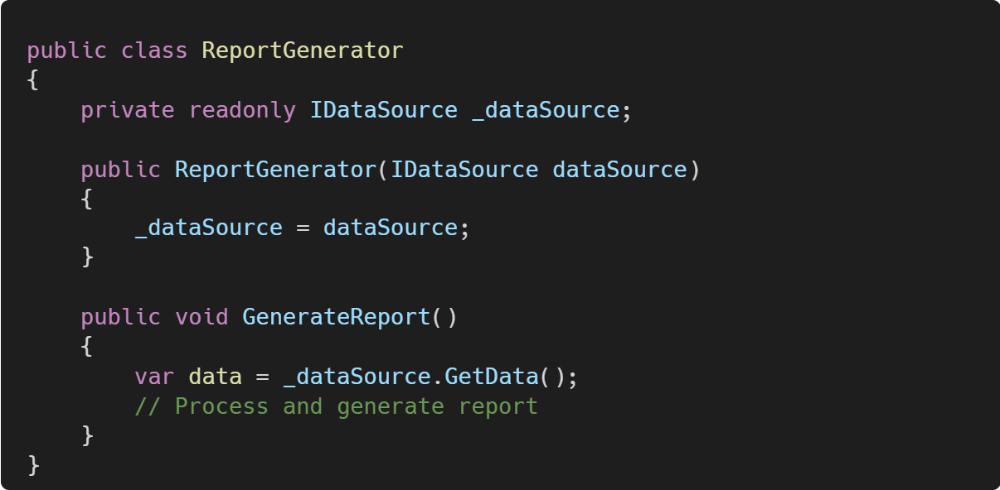](https://substackcdn.com/image/fetch/$s_!oCvE!,f_auto,q_auto:good,fl_progressive:steep/https%3A%2F%2Fsubstack-post-media.s3.amazonaws.com%2Fpublic%2Fimages%2Fde7771d9-b566-4954-83ad-f1c5ccaf0301_1206x592.png)

Now, in your tests, you can provide a mock or stub implementation of `IDataSource` that returns predefined data, allowing you to test `GenerateReport` without accessing the database.

[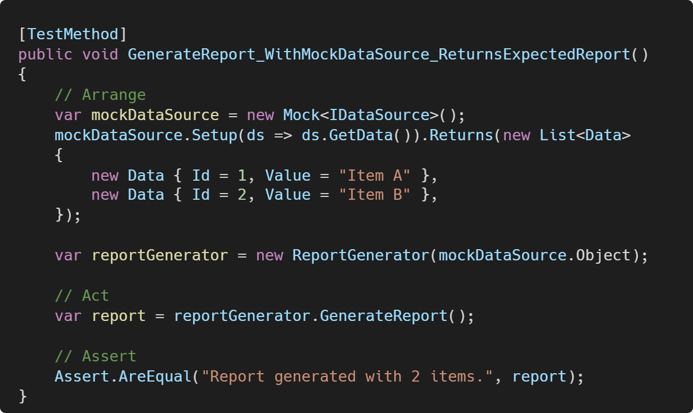](https://substackcdn.com/image/fetch/$s_!eoLM!,f_auto,q_auto:good,fl_progressive:steep/https%3A%2F%2Fsubstack-post-media.s3.amazonaws.com%2Fpublic%2Fimages%2F1337dabd-4216-4c7f-8117-be77e1f4a547_1232x736.png)

> “*A test is not a unit test if It talks to the database*.” - Michael Feathers

#### **2. Sprout method and Sprout class**

When adding new functionality, create a new method (Sprout method) or a new class (Sprout class) instead of modifying existing code. Unit tests it and identifies where to call that code from the existing code (**the insertion point**). Then, call your code from the legacy code.

Let's say we have a code like this:

[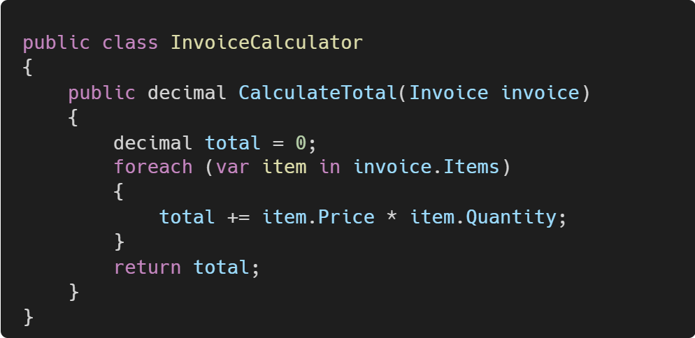](https://substackcdn.com/image/fetch/$s_!HWny!,f_auto,q_auto:good,fl_progressive:steep/https%3A%2F%2Fsubstack-post-media.s3.amazonaws.com%2Fpublic%2Fimages%2Fe08a4d38-4f5b-4a9a-a41f-c02e72da81d8_994x484.png)

Now, we need to add tax calculations. Instead of modifying the existing logic, we'll sprout **new methods**:

[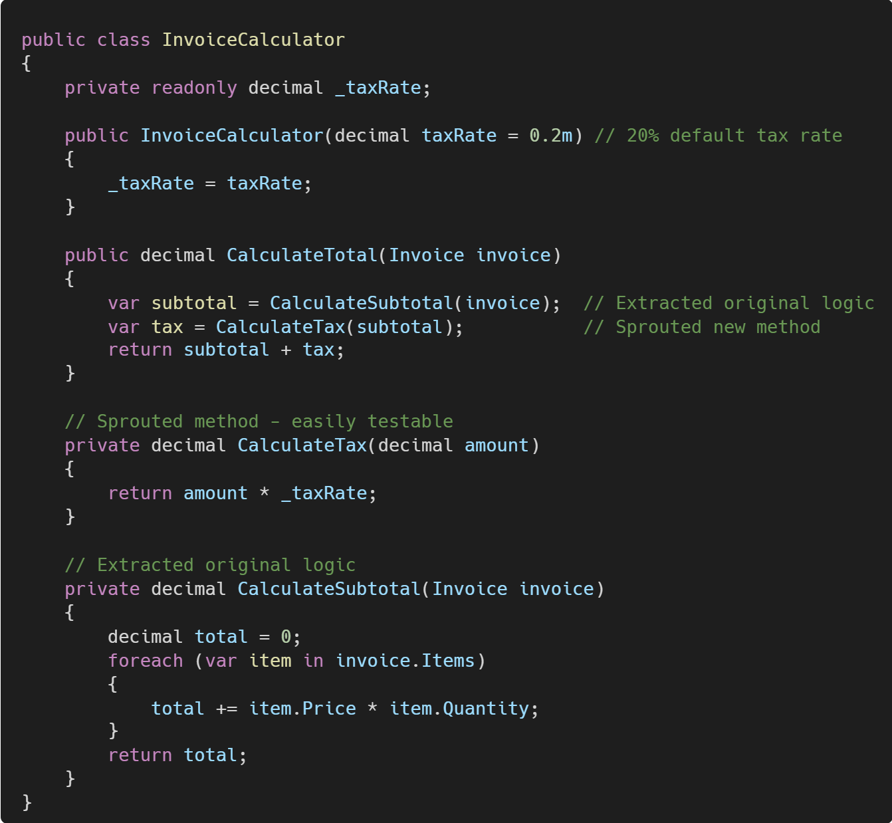](https://substackcdn.com/image/fetch/$s_!RFRv!,f_auto,q_auto:good,fl_progressive:steep/https%3A%2F%2Fsubstack-post-media.s3.amazonaws.com%2Fpublic%2Fimages%2Fd9aabf95-5c7a-40df-b8a3-8956b649bbec_1342x1238.png)

If the new functionality is more complex, you might extract it into a **Sprout Class**. Let's add a discount system to our invoice calculator:

[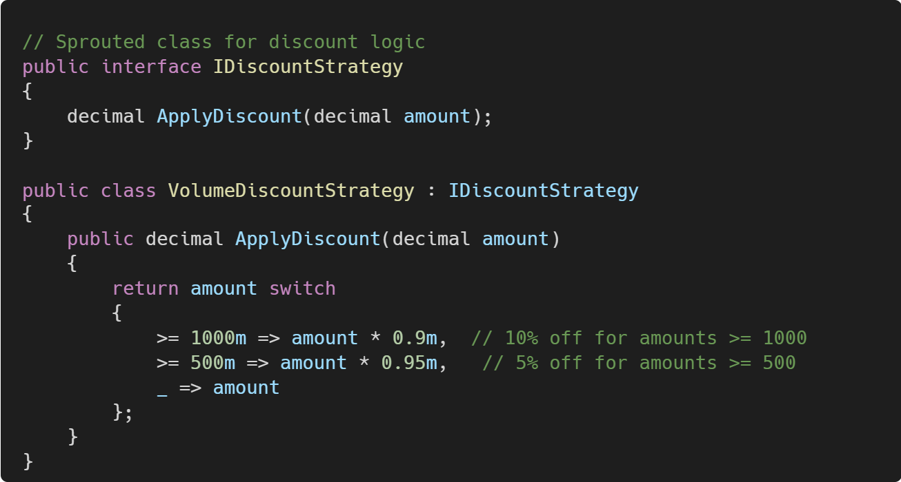](https://substackcdn.com/image/fetch/$s_!meLI!,f_auto,q_auto:good,fl_progressive:steep/https%3A%2F%2Fsubstack-post-media.s3.amazonaws.com%2Fpublic%2Fimages%2Fd38bae4e-6373-423e-a303-2818fe3c3138_1306x700.png)

Now, using the sprouted class looks like this:

[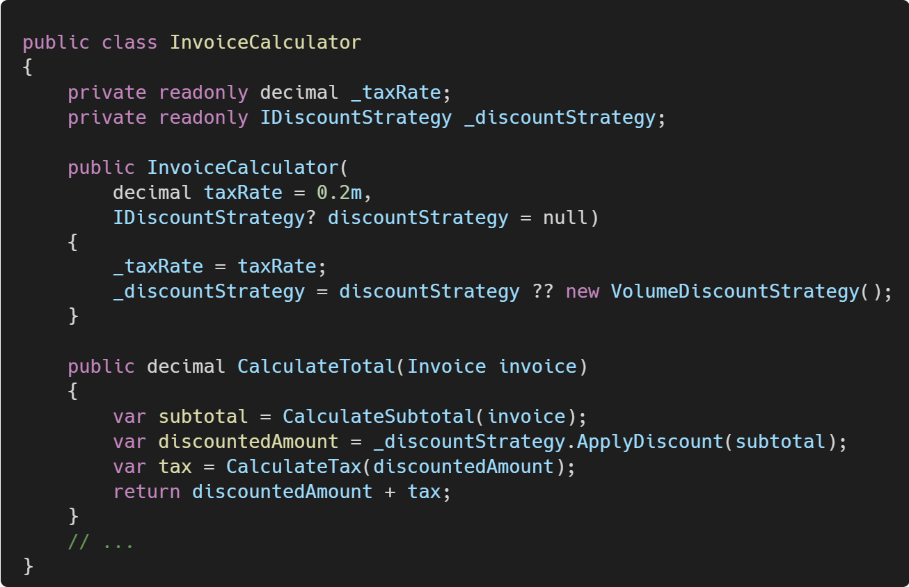](https://substackcdn.com/image/fetch/$s_!8hap!,f_auto,q_auto:good,fl_progressive:steep/https%3A%2F%2Fsubstack-post-media.s3.amazonaws.com%2Fpublic%2Fimages%2F4999d7e7-73ad-459f-bbf2-252be13a3074_1306x844.png)

#### **3. Wrap method and Wrap class**

When you need to modify the behavior of a method or class, create a new method or class that wraps the original one with the same signature. Rename the old method you want to wrap. Then, call the old method from the new method and put the new logic before/after the other method call.

Suppose you have a method `CalculatePrice` in a `PricingService` class:

[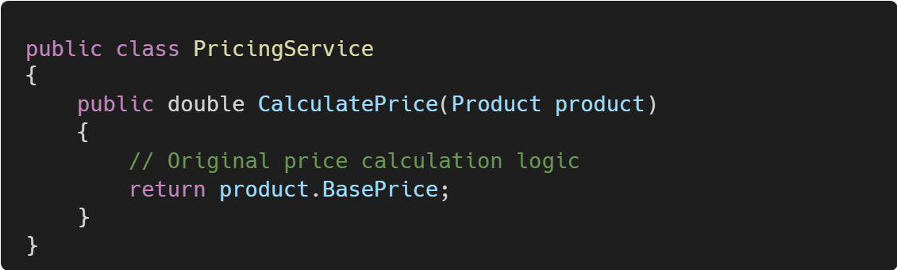](https://substackcdn.com/image/fetch/$s_!YDBw!,f_auto,q_auto:good,fl_progressive:steep/https%3A%2F%2Fsubstack-post-media.s3.amazonaws.com%2Fpublic%2Fimages%2F81b6923c-5a50-43e8-9d5a-0dedefca2461_1130x342.png)

You need to add discount calculation to this method.

[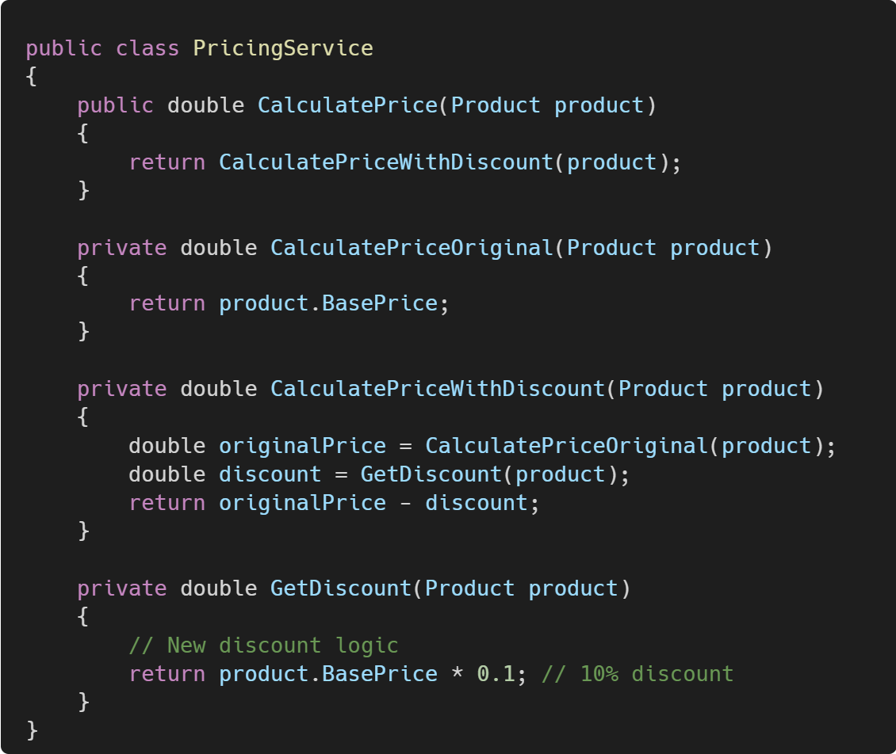](https://substackcdn.com/image/fetch/$s_!egoi!,f_auto,q_auto:good,fl_progressive:steep/https%3A%2F%2Fsubstack-post-media.s3.amazonaws.com%2Fpublic%2Fimages%2Fd9e665a4-52c9-47f7-bcbe-f9ff985c6772_1130x952.png)

By wrapping the original method, you've added new functionality while preserving the original behavior, which you can still access if needed.

If you need to modify or extend the behavior of an entire class, you can create a **wrapper class**:

[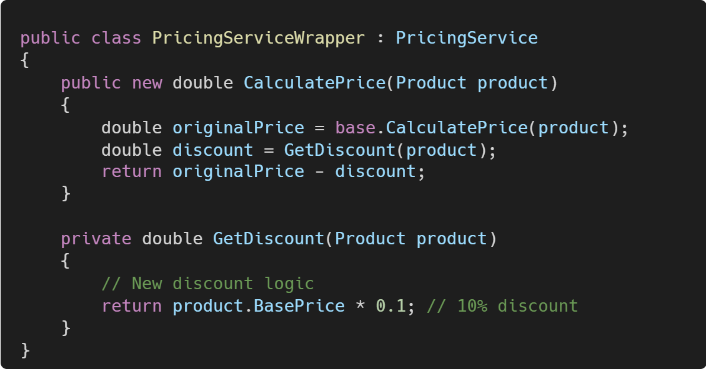](https://substackcdn.com/image/fetch/$s_!8mAD!,f_auto,q_auto:good,fl_progressive:steep/https%3A%2F%2Fsubstack-post-media.s3.amazonaws.com%2Fpublic%2Fimages%2F02b35e6c-555b-41bc-a918-e8ec190021e5_1130x592.png)

Now, you can use `PricingServiceWrapper` it wherever `PricingService` was used to add the discount functionality without altering the original class.

#### **4. Characterization tests**

Characterization tests define the existing behavior of code to protect against unintended changes. Instead of testing what the code is supposed to do, **you test what it currently does**. This is especially useful when dealing with complex legacy code where the intended **behavior is not well understood** and where we don’t want to write a complete set of unit tests but only to capture the current behavior of the code. This helps us because the **code's behavior will note changes after our changes**.

Let's look at a date formatting example that has some unclear business rules:

[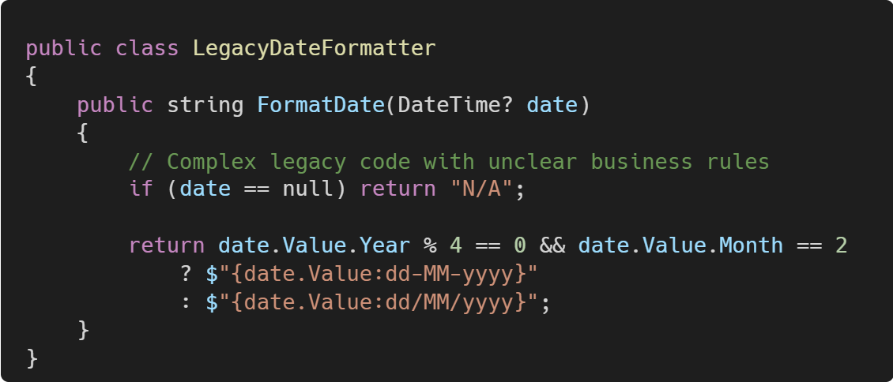](https://substackcdn.com/image/fetch/$s_!ecAG!,f_auto,q_auto:good,fl_progressive:steep/https%3A%2F%2Fsubstack-post-media.s3.amazonaws.com%2Fpublic%2Fimages%2F9cbf033c-c816-46f8-907c-334987b5e575_1130x484.png)

Let's write characterization tests to document the discovered behavior:

[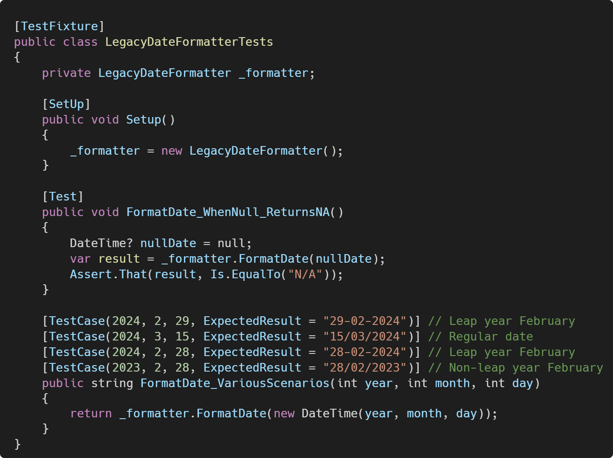](https://substackcdn.com/image/fetch/$s_!GIs4!,f_auto,q_auto:good,fl_progressive:steep/https%3A%2F%2Fsubstack-post-media.s3.amazonaws.com%2Fpublic%2Fimages%2F3a9a3465-5dd1-450b-a8e4-2a620c6949a7_1420x1060.png)

Through these tests, we found that:

1. Null dates return "N/A."
2. February dates in leap years use hyphens (-) as separators.
3. All other dates use forward slashes (/) as separators.

This documentation of legacy code behavior is essential, as it helps prevent us from making costly mistakes when modifying code we don’t know well.

### Conclusion

Working with legacy code can be challenging, but applying these techniques can incrementally improve your codebase.

Below is **my recommendation for the [Amazon store](https://amzn.to/3Ud4oh2) for the book**. Although it’s a bit older book and some sections are outdated, I still recommend it to every software engineer to read.

[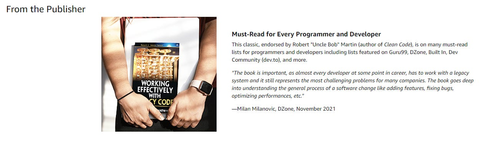](https://amzn.to/3Ud4oh2)

---

## Bonus: Using AI tools to navigate legacy codebases

Nowadays, you can utilize various AI tools to assist you in navigating legacy codebases, such as [GitHub Copilot](https://github.com/features/copilot). It can understand context from comments and code, helping you write code faster and with fewer errors. When dealing with legacy code, Copilot can:

- **Offer code completions** that align with existing patterns.
- **Suggest explanations** for unfamiliar code snippets.
- **Generate tests and documentation** for poorly documented code.

Here is an example of using Copilot Chat to improve your code ([source](https://github.com/features/copilot)).

How can you use it? First, you need to **install it** for different IDEs:

- **Visual Studio Code**: Install from the [VS Code Marketplace](https://marketplace.visualstudio.com/items?itemName=GitHub.copilot).
- **JetBrains IDEs**: Use the plugin from the [JetBrains Marketplace](https://plugins.jetbrains.com/plugin/17718-github-copilot).
- **Neovim**: Follow the instructions on the [GitHub Copilot Neovim repository](https://github.com/github/copilot.vim).

Then, you can use the following strategies to navigate through the code.

### 1. Map the territory

Use AI to understand unfamiliar code. Here are some examples you can try:

[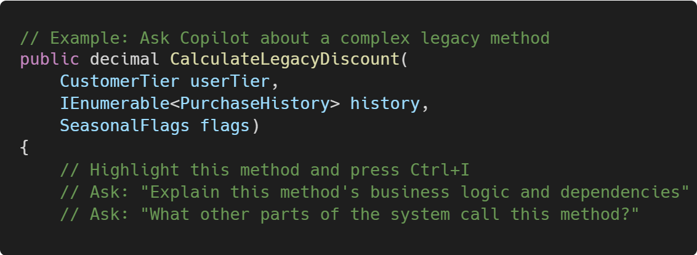](https://substackcdn.com/image/fetch/$s_!cWaT!,f_auto,q_auto:good,fl_progressive:steep/https%3A%2F%2Fsubstack-post-media.s3.amazonaws.com%2Fpublic%2Fimages%2Fb076b3f2-34c3-4125-818a-bf1a9d4498e0_1132x414.png)

### 2. Write Unit tests for code

Before diving in, let AI help you create safety nets:

[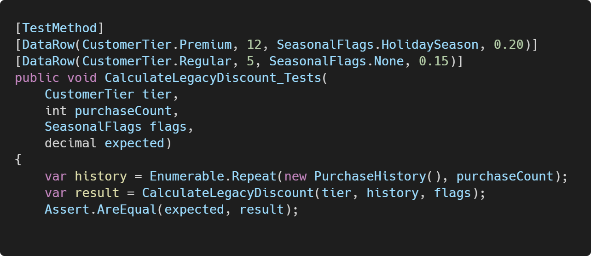](https://substackcdn.com/image/fetch/$s_!hvpf!,f_auto,q_auto:good,fl_progressive:steep/https%3A%2F%2Fsubstack-post-media.s3.amazonaws.com%2Fpublic%2Fimages%2F049830d0-a12c-4217-aa97-9f1d38354f72_1284x556.png)

### 3. Refactor code safely

We can ask Copilot to refactor or modernize code segments. You might have complex conditional logic that's hard to read, like this:

[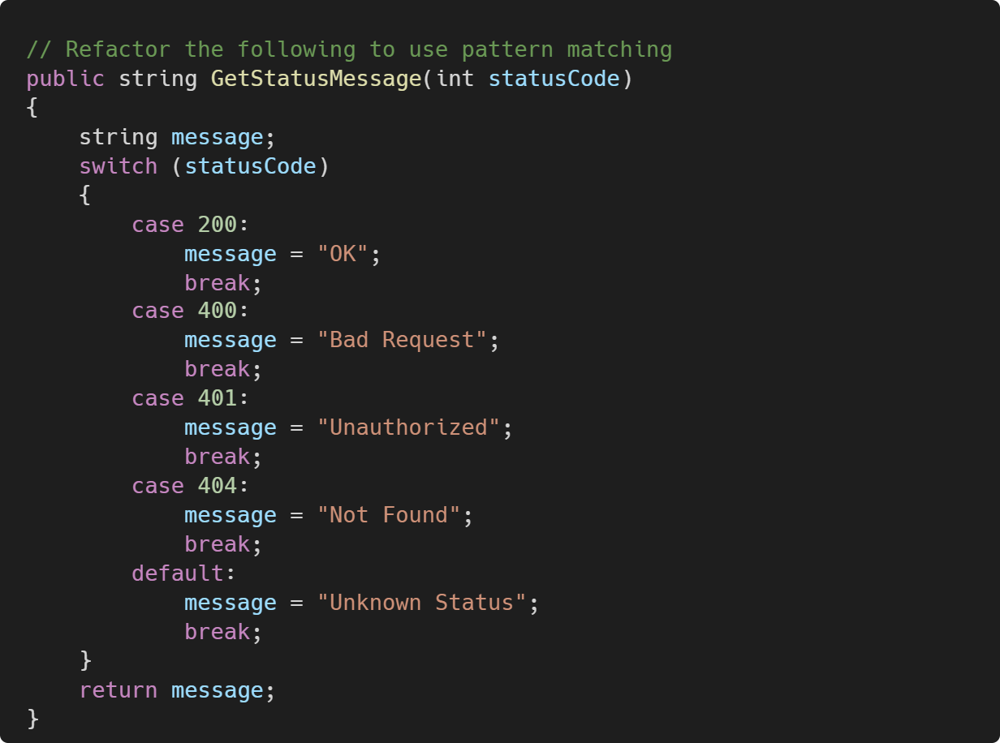](https://substackcdn.com/image/fetch/$s_!QJHj!,f_auto,q_auto:good,fl_progressive:steep/https%3A%2F%2Fsubstack-post-media.s3.amazonaws.com%2Fpublic%2Fimages%2Fc3d4049c-8583-46ba-a2c6-4afa2b82efa4_1232x916.png)

You can request Copilot to refactor using modern `switch` expressions in C#.

[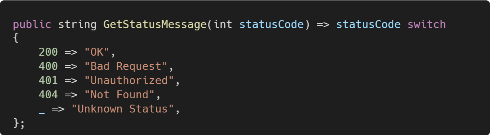](https://substackcdn.com/image/fetch/$s_!o-xI!,f_auto,q_auto:good,fl_progressive:steep/https%3A%2F%2Fsubstack-post-media.s3.amazonaws.com%2Fpublic%2Fimages%2F6ee1fce8-8a84-41d2-b70b-bec89800bbe4_1232x342.png)

### 4. Documentation generation

Ask AI to document the changes, which can be done outside the code. This is probably one of the most powerful features of AI tools, as it keeps the code and documentation in sync.

[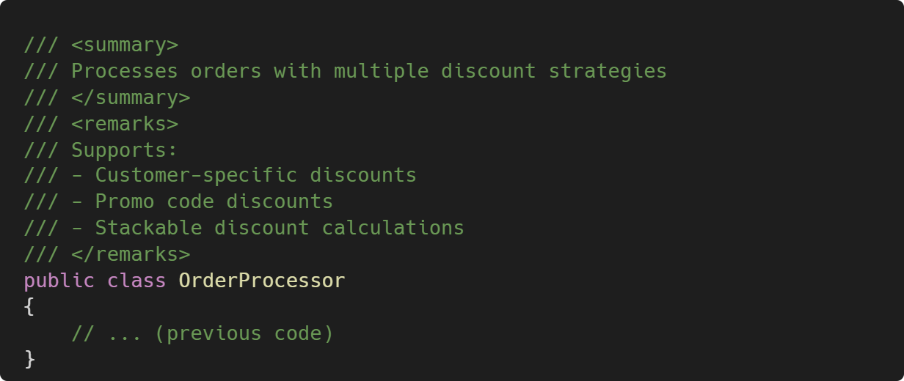](https://substackcdn.com/image/fetch/$s_!t2uj!,f_auto,q_auto:good,fl_progressive:steep/https%3A%2F%2Fsubstack-post-media.s3.amazonaws.com%2Fpublic%2Fimages%2F92eb4df3-bba7-4d2b-995b-7202a92ea9da_1232x520.png)

### Drawbacks of the AI approach

On the drawback side, we should **be careful when asking AI questions,** as they can produce bad results due to [hallucinations in LLM models](https://www.iguazio.com/glossary/llm-hallucination/), and then you need to ask them again, but to some extent, **they can help you get an idea of where to go**. There is a misconception that humans can completely replace pair programming with AI as a partner, which leads to overreliance on coding assistance ideas, code quality issues with generated code, and quicker codebase growth rates, as noted in the latest **[ThogughtWorks Technology Radar, Volume 31](https://www.thoughtworks.com/radar)**.

Also, what I currently **miss in AI tools such as GitHub Copilot** is a wider understanding of the codebase and consideration of business logic and dependencies when suggesting changes. When these tools better understand your codebase, docs, and more, they will generate phenomenal results. These results will help us **switch our focus from coding only to problem-solving**.

So, when we want to use LLMs for coding tasks, we should ask ourselves: **What problem do I want to solve,**and **is AI the best solution?** If the answer is yes, then use it. Also, considering that [these tools improve daily](https://youtu.be/yk9lXobJ95E?feature=shared), check them occasionally.

In conclusion, **AI tools like GitHub Copilot can aid in working with legacy code by providing instant insights, suggestions, and improvements**. While not a silver bullet for everything, integrating Copilot into your workflow can enhance productivity by 26%, according to [research from Princeton University, MIT, and Microsoft](https://papers.ssrn.com/sol3/papers.cfm?abstract_id=4945566).

---

## More ways I can help you

1. **[LinkedIn Content Creator Masterclass](https://www.patreon.com/techworld_with_milan/shop/short-linkedin-content-creator-311232?utm_medium=clipboard_copy&utm_source=copyLink&utm_campaign=productshare_creator&utm_content=join_link).**In this masterclass, I share my strategies for growing your influence on LinkedIn in the Tech space. You'll learn how to define your target audience, master the LinkedIn algorithm, create impactful content using my writing system, and create a content strategy that drives impressive results.
2. **[Resume Reality Check"](https://www.patreon.com/techworld_with_milan/shop/resume-reality-check-311008?source=storefront)**. I can now offer you a new service where I’ll review your CV and LinkedIn profile, providing instant, honest feedback from a CTO’s perspective. You’ll discover what stands out, what needs improvement, and how recruiters and engineering managers view your resume at first glance.
3. **[Promote yourself to 36,000+ subscribers](https://newsletter.techworld-with-milan.com/p/sponsorship-of-tech-world-with-milan)**by sponsoring this newsletter. This newsletter puts you in front of an audience with many engineering leaders and senior engineers who influence tech decisions and purchases.
4. **[Join my Patreon community](https://www.patreon.com/techworld_with_milan)**: This is your way of supporting me, saying “thanks, " and getting more benefits. You will get exclusive benefits, including all of my books and templates on Design Patterns, Setting priorities, and more, worth $100, early access to my content, insider news, helpful resources and tools, priority support, and the possibility to influence my work.
5. **1:1 Coaching:** [Book a working session with me](https://newsletter.techworld-with-milan.com/p/coaching-services). 1:1 coaching is available for personal and organizational/team growth topics. I help you become a high-performing leader and engineer 🚀.

---
[https://newsletter.techworld-with-milan.com/p/the-developers-guide-to-working-with#poll-225908](https://newsletter.techworld-with-milan.com/p/the-developers-guide-to-working-with#poll-225908)Loading...
---

Thanks for reading Tech World With Milan Newsletter! Subscribe for free to receive new posts and support my work.