# The Greatest Software Development Books of All Time

*... every software developer need to read (technology agnostic).*

A question is often asked: *should I read books to become a better developer*? Usually, the question is **yes,** and the reason is that the person who wrote the book wrote it when (s)he was **the most invited to write it** with the extensive knowledge base then. The only better option would be to work with that person, which is often impossible.

Yet, many people do not read enough, which means if you read books, you will be ahead of others by a few marks. However, when asking ***which books,*** you will get different answers from different people, as there are so many topics in the software engineering area.

During the years, I developed a routine of reading a lot of books, so taking into account my own experience, the experience of many peers I spoke with, as well as other sources that compiled similar lists [1][2][3][4][5] (some of them using analytics to calculate the score), I **compiled a list of the most outstanding books** that every software developer should read in one point in a career.

[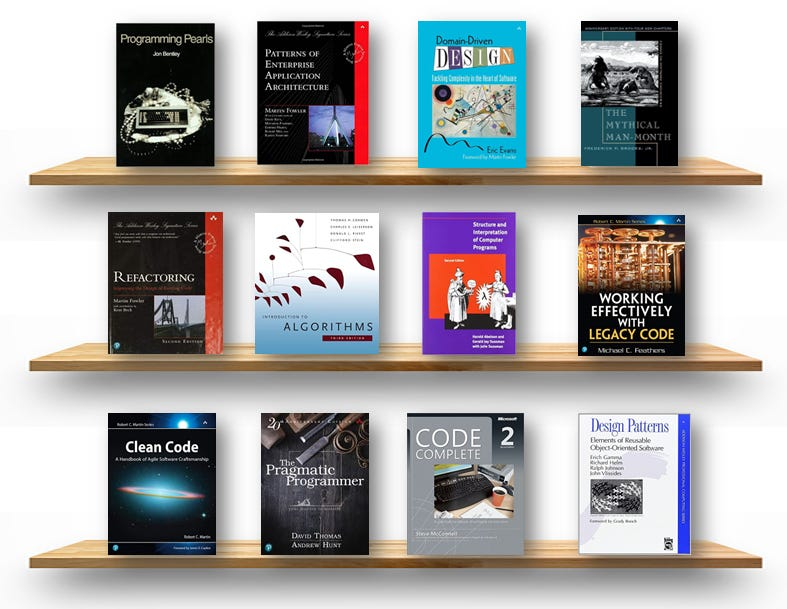](https://substackcdn.com/image/fetch/$s_!3r1T!,f_auto,q_auto:good,fl_progressive:steep/https%3A%2F%2Fsubstack-post-media.s3.amazonaws.com%2Fpublic%2Fimages%2Faf71eaf8-a0c2-490b-839e-4c927e6097a6_787x609.png)Software Engineering Bookshelf

To take a short note that just reading these books will not make you a great developer, for that you will need years of development, but you will **get insights into some guiding principles** that you could apply. In addition, by reading them, you will avoid making common mistakes in development.

This list is incomplete, as there are always some new and good books, but these have had the most impact on the careers of many software developers. Because they are mostly language-agnostic, they can be applied to any programming language.

## 1. [Clean Code](https://amzn.to/40iPuY5)

[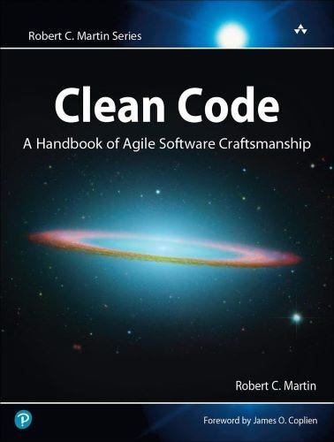](https://substackcdn.com/image/fetch/$s_!hoEq!,f_auto,q_auto:good,fl_progressive:steep/https%3A%2F%2Fsubstack-post-media.s3.amazonaws.com%2Fpublic%2Fimages%2F8bfd03b5-e38f-48b6-a8ec-996d32e3b08a_378x500.jpeg)Clean Code by Robert C. Martin

It is one of the most excellent software development books ever written by Uncle Bob Martin in 2008. It is written to teach software engineers the principles of writing clean programming code. There are a lot of examples inside, showing how to refactor code to be more readable and maintainable.

In addition, it includes chapters on common mistakes made by all kinds of programmers and chapters explaining the **SOLID principles of object-oriented design.** Although the book's examples are made in Java, they are equally helpful for other object-oriented programming languages.

In addition to this book, there are more books in the Uncle Bob series, such as [Clean Coder](https://amzn.to/3XVzvgP), [Clean Architecture](https://amzn.to/3WYt4IC), etc.

🔗 Link: [Amazon.com](https://amzn.to/40iPuY5)

## 2. [The Pragmatic Programmer](https://amzn.to/3wP7GLr)

[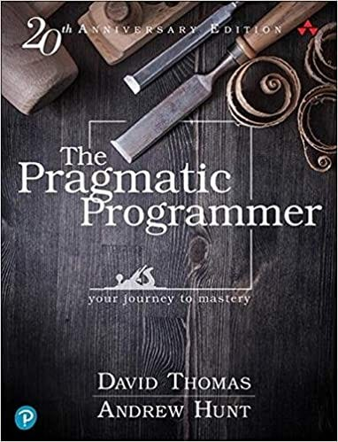](https://substackcdn.com/image/fetch/$s_!Ngmp!,f_auto,q_auto:good,fl_progressive:steep/https%3A%2F%2Fsubstack-post-media.s3.amazonaws.com%2Fpublic%2Fimages%2F2b3b67db-7a06-450f-b1a3-a1bfecfa5961_382x499.jpeg)Pragmatic Programmer

This book is filled with technical and practical advice for developers to improve. It examines what it means **to be a modern developer** by going through topics that range from personal responsibility and career development to architectural techniques. Even though it was written in 1999, it is still valid in many aspects, and there is an updated version (20th Anniversary) from 2019.

This book is unique because it teaches pragmatically and offers **tips to improve development**. The authors, for example, advise readers to learn one text editor and use it for everything. They also recommend using version-tracking software for even the smallest projects.

🔗 Link: [Amazon.com](https://amzn.to/3WmRhe8)

## 3. [Code Complete](https://amzn.to/3YgZzmi)

[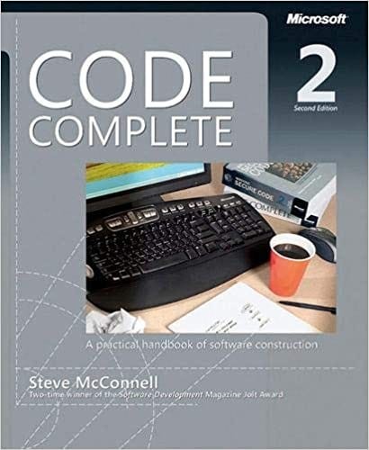](https://substackcdn.com/image/fetch/$s_!LXYs!,f_auto,q_auto:good,fl_progressive:steep/https%3A%2F%2Fsubstack-post-media.s3.amazonaws.com%2Fpublic%2Fimages%2F3d5ed48d-2d4c-483b-a34c-734f91f2df18_410x500.jpeg)Code Complete

Some people consider this book one of **the best practical guides to programming**, and it is strongly recommended for beginners. Again, one of the books written more than 15 years ago is still valid today. It deals with **design, coding, debugging, and testing**. In more than 900 pages, the authors describe how to write programs for people first and then for computers second, how to divide your code in terms of domains, and how to master the human qualities of top coders (humility, curiosity, and the most important, keep your ego in check).

🔗 Link: [Amazon.com](https://amzn.to/3YgZzmi)

## 4. [Design Patterns: Elements of Reusable Object-Oriented Software](https://amzn.to/3XM18Jj)

[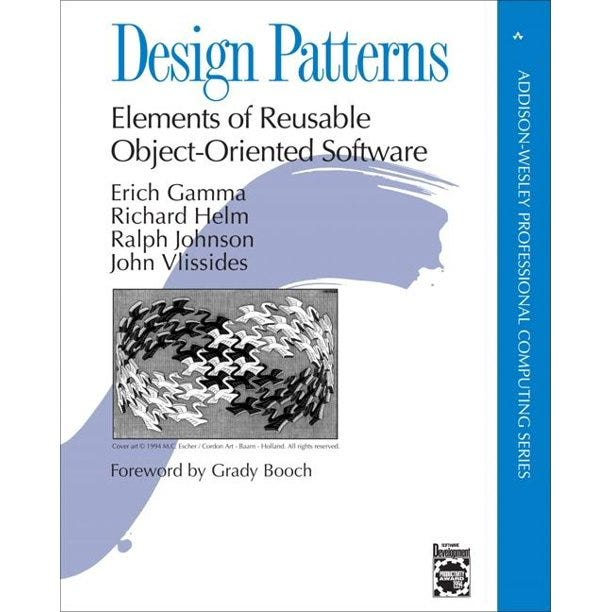](https://substackcdn.com/image/fetch/$s_!-pLy!,f_auto,q_auto:good,fl_progressive:steep/https%3A%2F%2Fsubstack-post-media.s3.amazonaws.com%2Fpublic%2Fimages%2F7e554aad-b477-4c26-bc54-560f7bb92ae0_612x612.jpeg)Design Patterns

Probably **the most famous and the oldest books** from this list (published in 1994.). It describes 23 software design patterns in three different categories to create more flexible, elegant, and reusable designs without having to rediscover the design solutions themselves. An idea for a design pattern as **a reusable form of a solution** to a design pattern was taken from the architect [Christopher Alexander](http://www.patternlanguage.com/ca/ca.html). It isa  must-read for an architect or developer of a complex system. The authors are often called the *Gang of Four (GoF)*. The book includes examples in C++ and Smalltalk.

🔗 Link: [Amazon.com](https://amzn.to/3XM18Jj)

> *Some people find it **hard to read**, so this book has an excellent alternative: **[Head First Design Patterns: A Brain-Friendly Guide](https://amzn.to/3YgYmLN).***

[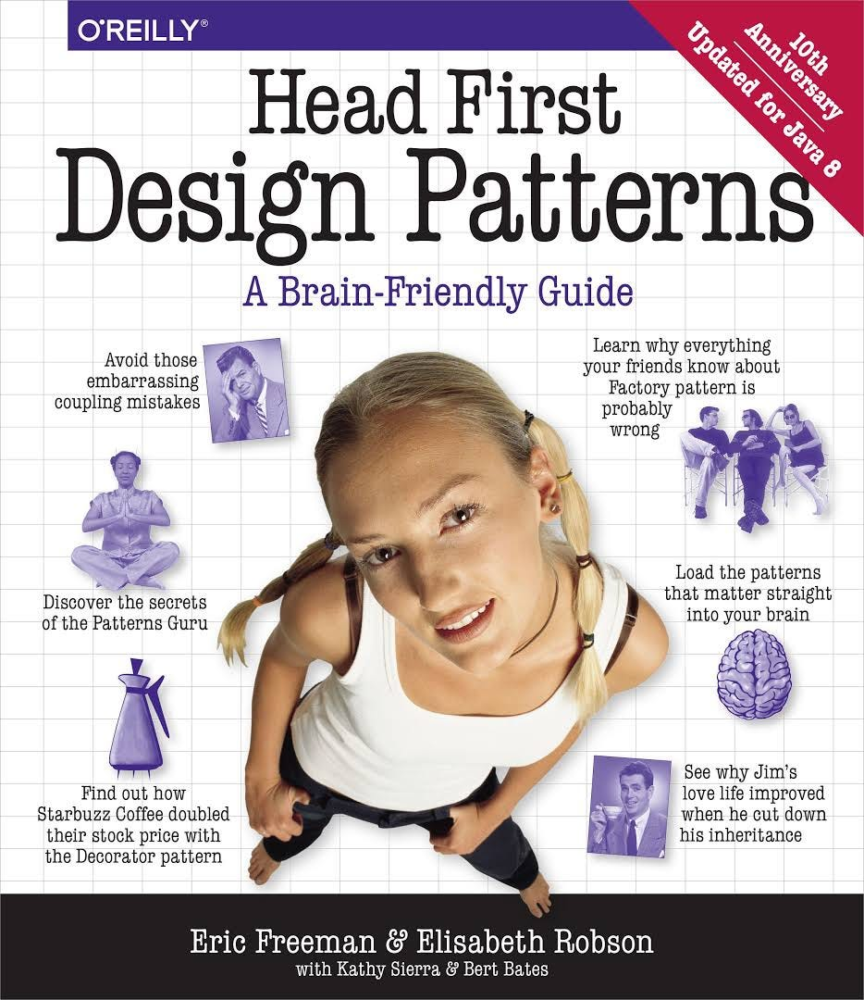](https://substackcdn.com/image/fetch/$s_!ZAD1!,f_auto,q_auto:good,fl_progressive:steep/https%3A%2F%2Fsubstack-post-media.s3.amazonaws.com%2Fpublic%2Fimages%2Fc0eefc5b-315a-4f81-80c0-dc16ff43008b_934x1080.jpeg)Head First Design Patterns

🔗 Link: [Amazon.com](https://amzn.to/3HqfB6J)

## 5. [Refactoring: Improving the Design of Existing Code](https://amzn.to/3HswNZe)

[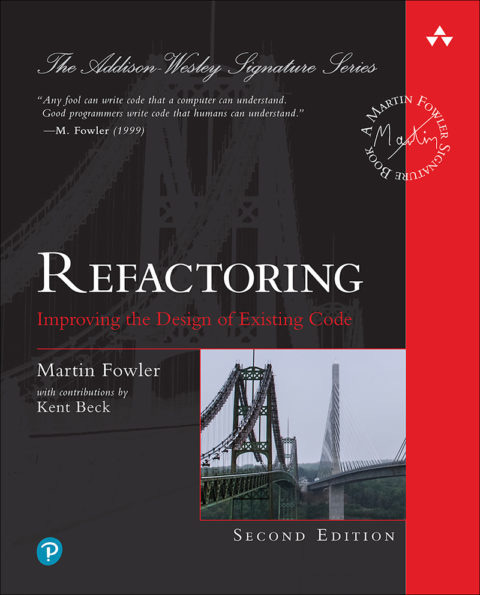](https://substackcdn.com/image/fetch/$s_!F7HD!,f_auto,q_auto:good,fl_progressive:steep/https%3A%2F%2Fsubstack-post-media.s3.amazonaws.com%2Fpublic%2Fimages%2Faa56be4c-8167-45bc-8e8f-afe47fe61c1a_480x595.jpeg)Refactoring

In this book, [Martin Fowler](https://martinfowler.com/) writes about improving the design of an existing code. It represents refactoring as **a process of changing a software system** in a way that does not alter the code's external behavior but improves its internal structure. Using refactoring as a technique, it's possible to take a bad design and rework it into a good one. The book has **a catalog of more than 40 proven refactorings** with details of when and why to use them. In the 2nd, the primary programming language used in the book is JavaScript, while the 1st edition used Java.

🔗 Link: [Amazon.com](https://amzn.to/3HswNZe)

## 6. [Introduction to Algorithms](https://amzn.to/40hDk1E)

[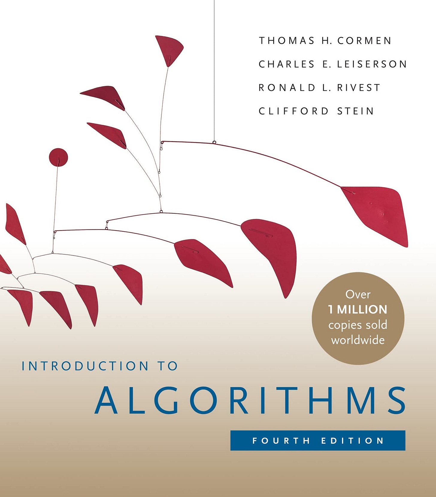](https://substackcdn.com/image/fetch/$s_!5025!,f_auto,q_auto:good,fl_progressive:steep/https%3A%2F%2Fsubstack-post-media.s3.amazonaws.com%2Fpublic%2Fimages%2Fc798d20c-7cc0-4a08-8eb5-4a3f1fda363d_1536x1750.jpeg)Introduction to Algorithms

It is one of the most famous books on **in-depth algorithms**(**CLRS**). It represents a comprehensive guide to all readers, from beginners to professionals. Each chapter is relatively self-contained and can be used as a unit of study. Algorithms are **described in English and pseudocode**, so one can be familiar even with someone who didn’t do much coding. It could be said that it's more a theoretical book than a practical one. The book covers **data structures, fast algorithms, graph theory, computational geometry**, and much more.

🔗 Link: [Amazon.com](https://amzn.to/40hDk1E)

Another great alternative is the **[Algorithms book](https://amzn.to/3Hp2Mtl)** by Robert Sedgewick and Kevin Wayne, widely used in colleges and universities worldwide.

[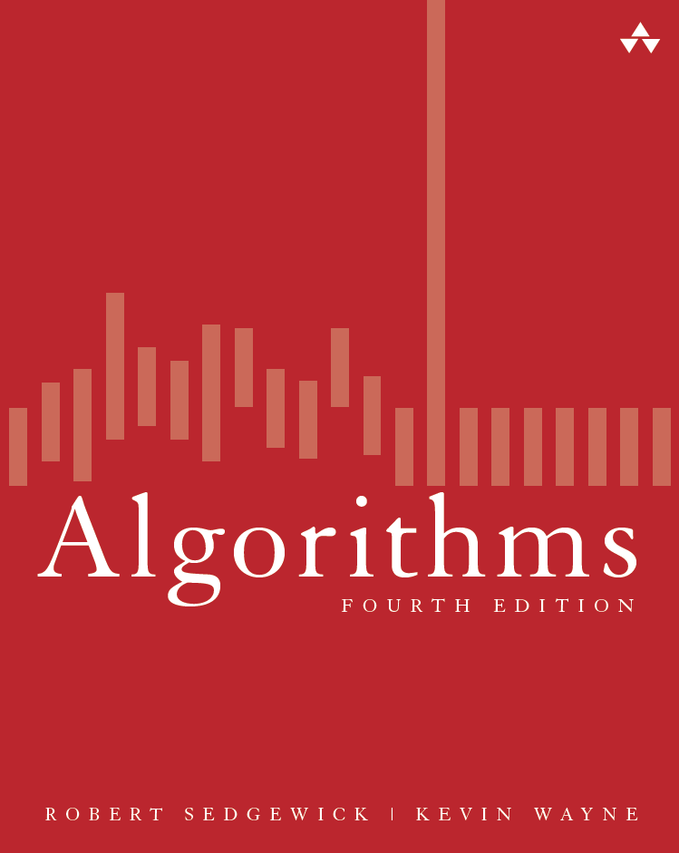](https://substackcdn.com/image/fetch/$s_!X6L0!,f_auto,q_auto:good,fl_progressive:steep/https%3A%2F%2Fsubstack-post-media.s3.amazonaws.com%2Fpublic%2Fimages%2Fed4df3a2-df4f-4043-b434-3a3fba8906c4_749x941.png)Algorithms

🔗 Link: [Amazon.com](https://amzn.to/3wJdIgD)

## 7. [Structure and Interpretation of Computer Programs](https://amzn.to/3wN33Bw)

[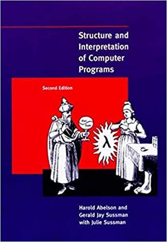](https://substackcdn.com/image/fetch/$s_!NIJl!,f_auto,q_auto:good,fl_progressive:steep/https%3A%2F%2Fsubstack-post-media.s3.amazonaws.com%2Fpublic%2Fimages%2F42d5a851-b12e-40d8-b484-0e209af84627_345x499.jpeg)Structure and Interpretation of Computer Programs

This book is one of the best books for learning programming **fundamentals** (also known as **SICP**). It represents a fundamental course in tech programming at **MIT** and uses **Scheme** to show different programming concepts. The book explains the four best-known paradigms of programming languages: **imperative, logic-based, object-oriented, and applicative programming**.

🔗 Link: [Amazon.com](https://amzn.to/3wN33Bw)

## 8. [Working Effectively with Legacy Code](https://amzn.to/40hGum2)

[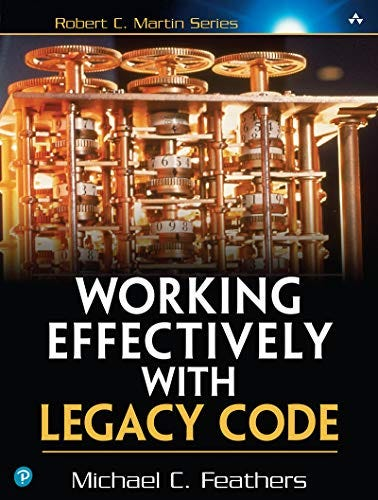](https://substackcdn.com/image/fetch/$s_!Zyre!,f_auto,q_auto:good,fl_progressive:steep/https%3A%2F%2Fsubstack-post-media.s3.amazonaws.com%2Fpublic%2Fimages%2Ff0d4a0af-7c77-4afd-a7b1-0f2ea64c0afe_378x500.jpeg)Working Effectively with Legacy Code

In this book, Michael Feathers offers different strategies **for dealing with large and untested legacy code bases**. The book is essential, as almost every developer has to work with a legacy system at some point in their career. Legacy systems still represent one of the most challenging problems for many companies.

The book goes deep into understanding the general process of a software change, like **adding features, fixing bugs, optimizing performances**, etc. In addition, it will teach you how to get legacy code ready for **testing** and identify where the code needs changes. Examples in the book are written in C, C++, C#, and Java.

🔗 Link: [Amazon.com](https://amzn.to/40hGum2)

## 9. [Programming Pearls](https://amzn.to/3YdTCXv)

[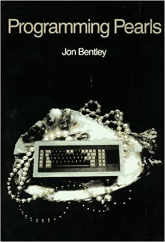](https://substackcdn.com/image/fetch/$s_!WGze!,f_auto,q_auto:good,fl_progressive:steep/https%3A%2F%2Fsubstack-post-media.s3.amazonaws.com%2Fpublic%2Fimages%2F7a2b1f56-a63c-491a-bd04-83436948ddcb_325x474.jpeg)Programming Pearls

The book represents one of **the most influential books** that help a person to think as a programmer. Every concept in the book is covered with practical problems and various solutions. The book challenges readers to understand **the core concepts in memory, CPU, and algorithms** and gradually increment difficulties rather than answering immediately. “Programming Pearls” is a bit different from the others in this list, and it represents a solid way to teach problems of **data structures and algorithms**, especially searching, sorting, etc.

🔗 Link: [Amazon.com](https://amzn.to/3YdTCXv)

## 10. [Patterns of Enterprise Application Architecture](https://amzn.to/3RpoXEq)

[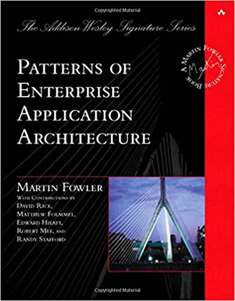](https://substackcdn.com/image/fetch/$s_!jMpl!,f_auto,q_auto:good,fl_progressive:steep/https%3A%2F%2Fsubstack-post-media.s3.amazonaws.com%2Fpublic%2Fimages%2F21b28fe4-02bf-46dd-ba63-4ff73e467aea_389x499.jpeg)Patterns of Enterprise Application Architecture

One more book on this list is by a productive author, [Martin Fowler,](https://martinfowler.com/) specializing in **enterprise application development**. The book teaches various concepts, such as whether you are correctly **layering your application**, whether you know the different **presentational designs** available (MVC, MVVM, templates), how you are **accessing your data**, etc.

Martin provides over **40 patterns** to solve common problems while architecting enterprise applications. The book includes many UML diagrams and Java and C# code examples. However, since it is from 2002, it lacks some modern concepts, such as REST, JSON, or cloud.

🔗 Link: [Amazon.com](https://amzn.to/3RpoXEq)

# Honorable mentions

In addition to the top 10 most excellent software development books, many more good books are not easy to exclude from this list. Here are some of them that I would strongly recommend reading:

- **[Designing Data-Intensive Applications:](https://amzn.to/3wMpHKs)**[https://amzn.to/3wMpHKs](https://amzn.to/3wMpHKs)**[The Big Ideas Behind Reliable, Scalable, and Maintainable Systems](https://amzn.to/3wMpHKs)** is one of the best books on data-intensive applications. It describes concepts such as databases and data models and takes a deep dive into distributed concepts such as transactions, replication, consistency, etc.
- **[Software Architecture in Practice](https://amzn.to/3Dw2OhS)**is one of the best books on software architecture. It goes through main software quality attributes, then through different case studies (US air traffic control system and a software product line used to build submarines). It also introduces the topic of architectural evaluation (using two frameworks, ATAM and the CBAM).
- **[The Art of Computer Programming](https://amzn.to/3jpOy3x)**, written by a famous computer scientist from Stanford University, [Prof. Donald Knuth](https://www-cs-faculty.stanford.edu/~knuth/). This book is very popular and highly praised by many of the top programmers in the world for its combined mathematical exactness and outstanding humor throughout the chapters.
- **[Cracking the Coding Interview](https://amzn.to/3XTMgZz)** is highly recommended to anyone who wants or needs to take coding interviews. The author explains how to look for hidden details in questions, break problems into small chunks, and improve one's understanding of concepts. In addition, the book provides 189 real interview questions and solutions.
- **[Enterprise Integration Patterns](https://amzn.to/3WWjshJ)** is a book by Gregor Hohpe and Bobby Woolf that describes how applications exchange data and communicate. It encompasses messaging patterns, components, and real-life examples of how a banking system would be designed.
- **[Object-Oriented Software Construction](https://amzn.to/3WW7zbA)** is a book by Bertrand Meyer, and even though it was written in the early 2000s, it will teach you the best engineering practices behind software construction. The author describes for the first time what design by contract is.
- **[The Art of Unit Testing](https://amzn.to/3RpZWsw)**. This book focuses on unit testing as a crucial step for any developer to deliver a good piece of software. It explains the core competencies of unit testing, including how to scope it and what to unit test.
- **[The Mythical Man-Month](https://amzn.to/3Dx1fAo)** discusses productivity, tackling the myth that the time taken by one engineer can be equally divided if you hire more engineers to do the job. It also discusses handling project delivery delays, communicating efficiently as a project leader, and managing project iteration.
- **[Domain-Driven Design: Tackling Complexity in the Heart of Software](https://amzn.to/3Hsxthv)** addresses how to translate the process into the software. It described a method for someone who doesn’t write software and how one communicates about a process to translate it into a software system.
- **[The Phoenix Project: A Novel about IT, DevOps, and Helping Your Business Win](https://amzn.to/3WU4Qze)** is a narrative about a fictional company transitioning to the DevOps model from an older, less integrated model of working. It discusses challenges in coordinating operations and development and how to bridge that gap.

# References

[1] [20 Most-Recommended Books for Software Developers](https://dev.to/awwsmm/20-most-recommended-books-for-software-developers-5578)

[2] [10 Best Programming Books You Should Know](https://hackr.io/blog/best-programming-books)

[3] [Top 10 Books That Every Programmer Must Read Once](https://www.geeksforgeeks.org/top-10-books-that-every-programmer-must-read-once/)

[4] [The 10 Best Software Engineering Books in 2019](https://devconnected.com/the-10-best-software-engineering-books-in-2019/)

[5] [Amazon.com - Computer & Technology Books](https://amzn.to/3RnOEVS)

---

Thanks for reading Tech World With Milan Newsletter! Subscribe for free to receive new posts and support my work.