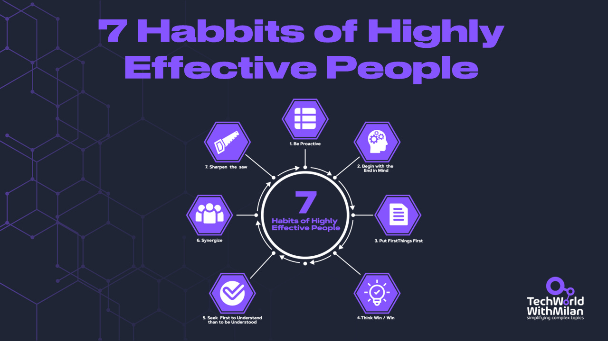
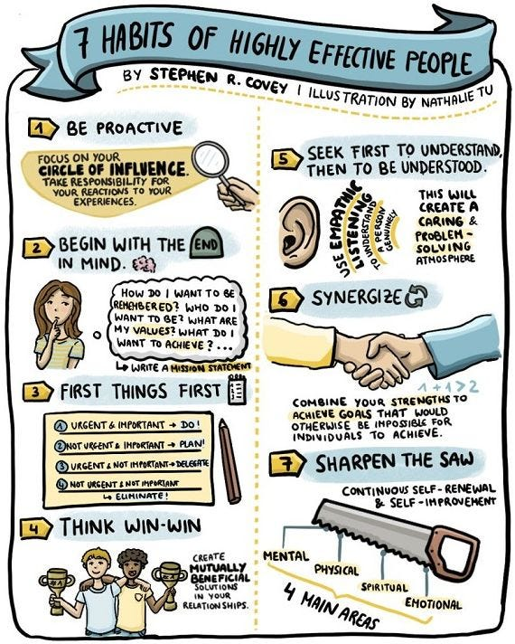
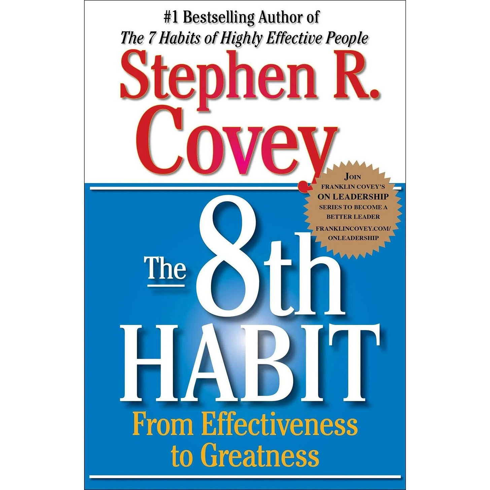

# The habits of highly effective people

After 25 years of dealing with successful people in business, universities, and relationship settings, Stephen R. Covey noticed that great achievers were frequently troubled by emptiness. To comprehend why, he read self-help, self-improvement, and popular psychology books from the past 200 years. Here, he observed a striking historical disparity between **two kinds of success**.

According to Covey, **developing your character rather than your personality is the key to long-term success**. More than what we say or do, who we are speaks volumes. A set of guiding principles is the foundation for the "Character Ethic." According to Covey, most religious, social, and ethical systems uphold these ideas as self-evident and timeless. They are applicable everywhere.

Covey’s seven habits are composed of the primary principles of character upon which happiness and success are based. **[The 7 Habits of Highly Effective People](https://amzn.to/48wU9sA)** puts forward a principle-centered approach to personal and interpersonal effectiveness.

7 Habits of Highly Effective People

Here are the 7 habits:

**1. Be Proactive:** Take initiative and responsibility for your actions. Don't blame others or circumstances; focus on what you can influence.

**2. Begin with the End in Mind:** Define clear, personal, and professional goals. Visualize the outcomes you desire, shaping your actions toward achieving them.

**3. Put First Things First:** Prioritize tasks based on importance, not urgency. Invest time in activities that align with your core values and goals.

**4. Think Win-Win:** Seek mutually beneficial solutions in interactions. It's not about being nice; it's about being effective, valuing and respecting others.

**5. Seek First to Understand, Then to Be Understood:** Listen empathetically. Understanding others' perspectives can significantly improve relationships and problem-solving.

**6. Synergize:** Combine people's strengths through teamwork to achieve goals no individual could. Value differences and leverage them for collective success.

**7. Sharpen the Saw:** Regularly renew and enhance yourself in four areas: physical, mental, social/emotional, and spiritual. This habit ensures longevity and effectiveness in your other habits.

Following these habits represents one of the important elements in career growth I always recommend, especially if you aim to become a **top performer** in your organization.

The 7 Habits of Highly Effective People (Credits: Nathalie Tu)

---

## **The 8th Habit**

In his book “The 7 Habits of Highly Effective People,” Steven Covey discusses important principles distinguishing successful people from others. Yet, many people don't know that he wrote a follow-up book called “**[The 8th Habit: From Effectiveness to Greatness](https://amzn.to/3TBd418)**”, which clarifies Covey's earlier declaration that "Interdependence is a higher value than independence."

This means **finding one’s own “voice” and inspiring others to discover theirs is essential**. According to Covey, 𝘁𝗵𝗲 𝟴𝘁𝗵 𝗵𝗮𝗯𝗶𝘁 is the need for people to move beyond effectiveness to greatness.

The 8th Habit consists of **four parts**:

1. **Finding Your Voice:** It emphasizes the importance of discovering one's unique talents, passions, and abilities and then using these to make a difference in the world. Covey calls this the "sweet spot," where an individual's passion and skills intersect with the world's needs. The best way to find what you’re talented at or what you enjoy doing is to find someone else you admire (in terms of mentality).
2. **Inspiring Others to Find Their Voice:** Covey explains that authentic leadership involves helping others discover their voice and encouraging them to use it to impact the world positively.
3. **Empowering Others:** Covey emphasizes that authentic leadership involves empowering others to take ownership and responsibility for their own lives and work and fostering an environment of trust, respect, and collaboration.
4. **Aligning Everything to Achieve Results:** Covey concludes that the ultimate goal of the 8th habit is to align everything in our lives, including our personal and professional goals, with a higher purpose focused on making a positive difference in the world.

If we apply the same to **organizations**, it encourages organizations to empower their employees, foster a culture of trust and collaboration, and align everything within the organization towards a higher purpose focused on making a positive impact in the world. This can lead to increased employee engagement, productivity, and satisfaction, as well as improved organizational performance and results.

The 8th Habit: From Effectiveness to Greatness, by Stephen R. Covey

---

Thanks for reading Tech World With Milan Newsletter! Subscribe for free to receive new posts and support my work.