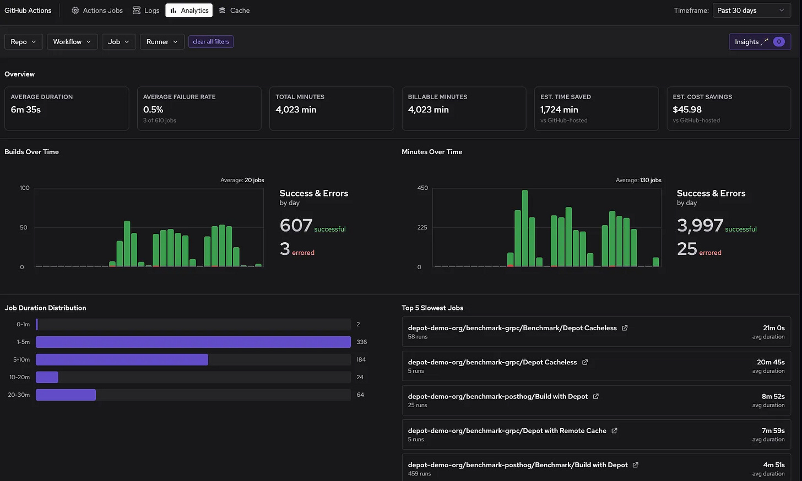
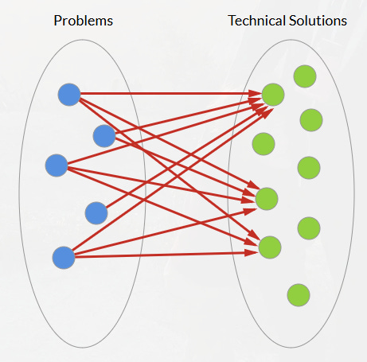
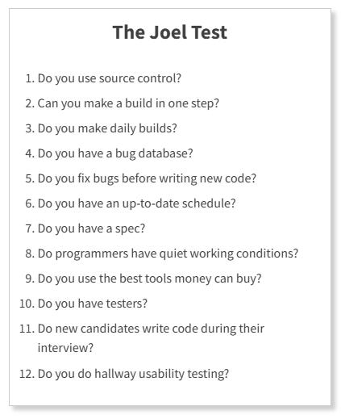
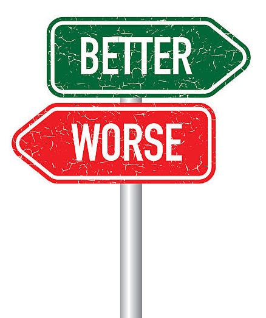
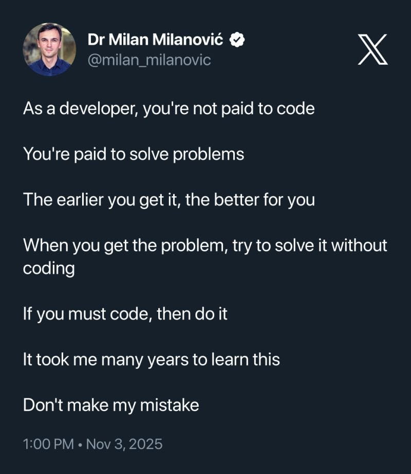
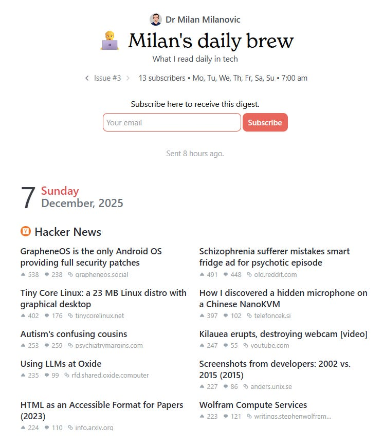

# 10 software essays that changed how I think

Over the years, I’ve read a handful of software essays that fundamentally changed my engineering mindset. **Each one delivered a lesson that shifted my perspective, from technology choices, architecture, coding practices, and even my career.**

Below, I share the most impactful essays I learned from each. These range **from pragmatic engineering advice to philosophical insights**, but all influenced how I think and work as an engineer and leader.

I hope that by reflecting on what I learned, you might find these lessons helpful too (and perhaps be inspired to read the original essays if you haven’t).

Here they are, in no particular order:

1. **Choose Boring Technology** (2015) by Dan McKinley
2. **Parse, Don’t Validate** (2019) by Alexis King
3. **Things You Should Never Do, Part I** (2000) by Joel Spolsky
4. **The Majestic Monolith** (2016) by David Heinemeier Hansson (DHH)
5. **The Joel Test** (2000) by Joel Spolsky
6. **How to Design a Good API and Why It Matters** (2007) by Joshua Bloch
7. **The Rise of “Worse is Better”** (1989) by Richard P. Gabriel
8. **The Grug-Brained Developer** (2022) by Carson Gross
9. **Software Quality at Top Speed** (1996) by Steve McConnell
10. **Don’t Call Yourself a Programmer** (2011) by Patrick McKenzie
11. **Bonus:** **How To Become a Better Programmer by Not Programming** (2007) by Jeff Atwood

So, let’s dive in.

---

## [GitHub Actions analytics - what’s actually happening (Sponsored)](https://fandf.co/3KJu9UB)

*You’re running GitHub Actions, but you don’t know which jobs are slow, why they’re failing, or if that optimization you shipped actually worked.*

*Depot’s new GitHub Actions analytics gives you performance trends, resource utilization, and job-level insights across all your workflows. Track duration changes over time, spot jobs maxing out CPU or memory, and get specific recommendations on which runners to upgrade or downgrade.*

*Filter by repo, workflow, or job. Click into individual runs to see logs and metrics. See exactly which jobs waste resources and which ones need more power.*

[Check out the analytics](https://fandf.co/3KJu9UB)

---

**[Sponsor this newsletter](https://newsletter.techworld-with-milan.com/p/sponsorship-of-tech-world-with-milan)**

## 1. [Choose Boring Technology (2015) by Dan McKinley](https://mcfunley.com/choose-boring-technology) 🔗

Early in my career, I was easily caught up in the “next big thing” or [shiny object syndrome](https://en.wikipedia.org/wiki/Shiny_object_syndrome): the latest frameworks, databases, or tools. **[Dan McKinley’s](https://mcfunley.com/choose-boring-technology)*****[Choose Boring Technology](https://mcfunley.com/choose-boring-technology)*** was a revelation that permitted me*to ignore the hype cycle,*basically.

McKinley argues that every team has a limited number of “**innovation tokens**” to spend on new technology, so you must spend them wisely. In other words, innovation is a scarce resource; use it where it truly differentiates your product, and **use proven, reliable tech for everything else**.

McKinley’s advice is to favor technologies with well-understood failure modes and decades of documentation, the “boring” choices like MySQL, Postgres, Cron, etc., which are boring *because* they work so well.

He says that when choosing a tool, *“**the best tool is the one that occupies the ‘least worst’ position for as many of your problems as possible**,”* since keeping a system running reliably in the long term far outweighs any short-term development convenience.

Choosing the best tool for the job (Source: [Dan McKinley’s](https://mcfunley.com/choose-boring-technology)*[Choose Boring Technology](https://mcfunley.com/choose-boring-technology))*

After reading McKinley’s message, I started to think differently about new tech stacks. I stopped feeling guilty about using “boring” languages and frameworks (who said “legacy”?). Instead of trying every new JavaScript library or cloud service, I now double down on a few stable choices that I know inside out.

This has **made me a faster and more effective engineer**.

My projects have fewer surprise issues, onboarding new team members is easier (because the stack is common and well-documented), and we spend less time fighting our tools.

“Choose Boring Technology” taught me that *innovation is a budget; spend it where it counts*. Don’t waste it on reinventing the wheel. Use boring tech for most things so you can **innovate where it truly matters** (in your product’s unique domain).

It’s a lesson in pragmatism that has improved both my productivity and my team’s.

## 2. [Parse, Don’t Validate (2019) by Alexis King](https://lexi-lambda.github.io/blog/2019/11/05/parse-don-t-validate/) 🔗

This essay is about leveraging static types to build more robust software. **[Alexis King’s](https://lexi-lambda.github.io/blog/2019/11/05/parse-don-t-validate/)*****[Parse, Don’t Validate](https://lexi-lambda.github.io/blog/2019/11/05/parse-don-t-validate/)*** changed how I think about handling input data in *any* language.

The core idea is simple but profound: whenever you validate data, **instead of returning an error or a boolean flag, write a function that*****parses*****the data into a richer type**. By doing so, you make invalid states unrepresentable in your program.

Before this essay, I approached input checking with a defensive mindset.

For example, a reports endpoint with query params:

`GET /reports?from=2025-01-01&to=2025-12-31&limit=500000`

In a “validate” style, I’d add helpers like `validateRange(from, to)` and `validateLimit(limit)`, then keep passing `string`/`int` deeper. One missed guard later, an unbounded `limit` hits production, and the database eats a massive query.

King describes this pattern as pushing invalid data forward and relying on repeated checks (“**shotgun parsing**”).

The fix comes from flipping the flow: parse once at the boundary into a richer type, then run the rest of the system on that type.

So instead of “validate + keep primitives”, I parse into a `ReportQuery` value object:

- `DateRange` guarantees `from ≤ to` and enforces a maximum span
- `PageSize` guarantees `1…1000`
- Core code accepts only `ReportQuery`, never raw params

Now invalid states cannot enter the domain model, so a forgotten validation cannot happen, there’s nowhere for raw `limit` or raw dates to flow.

Instead of littering checks everywhere, I now think in terms of designing data types that enforce those checks at construction.

## 3. [Things You Should Never Do, Part I (2000) by Joel Spolsky](https://www.joelonsoftware.com/2000/04/06/things-you-should-never-do-part-i/) 🔗

Early in my career, I fell into the trap Joel Spolsky describes in **“[Things You Should Never Do: Part I](https://www.joelonsoftware.com/2000/04/06/things-you-should-never-do-part-i/).”** Namely, I have wanted to rewrite a messy legacy codebase from scratch, more than once. Spolsky’s essay stopped me in my tracks and probably saved me from disastrous rewrites.

The key lesson is: **never throw away working code and start over**. The old code might be ugly, but it includes years’ worth of bug fixes and hard-earned knowledge.

If you rewrite from scratch, you are *throwing away all that knowledge* and likely reintroducing bugs that were solved long ago.

Joel Spolsky, Co-founder of Stack Overflow and Trello

Spolsky uses Netscape as the example. They famously decided to rewrite Navigator from the ground up, and in the years it took, Internet Explorer ate their lunch. Joel explains that *old code appears messy* to new eyes because “**it’s harder to read code than to write it**”.

Every experienced engineer looks at a large codebase and sees some complex parts and thinks they could do it better. But those parts often exist for very valid reasons: each weird bit might be a fix for a specific user bug, a workaround for an OS quirk, a performance tweak.

As Joel writes:

> *“That two-page function that grew warts is full of bug fixes; each fix took weeks of real-world usage to discover and days to fix… If you throw away the code and start over, you throw away all that knowledge and all those fixes”*.

I realized I had been underestimating the value of legacy code. We can say that **legacy code generates revenue, and that is true**.

After reading this essay, I changed my approach. When encountering a legacy module, I resist the urge to make big bang changes. Instead, I **refactor iteratively**, improve it piece by piece, write tests around it, and slowly modernize it.

In this regard, we should not forget also what Fred Brooks taught us in his 1975 book “**[The Mythical Man Month](https://amzn.to/3XFvXB6)**”.

> *An architect’s first work is apt to be spare and clean. He knows he doesn’t know what he’s doing, so he does it carefully and with great restraint. As he designs the first work, frill after frill and embellishment after embellishment occur to him. These get stored away to be used ‘next time.’ Sooner or later the first system is finished, and the architect, with firm confidence and a demonstrated mastery of that class of systems, is ready to build a second system.*
> 
> *This second is the most dangerous system a man ever designs. When he does his third and later ones, his prior experiences will confirm each other as to the general characteristics of such systems, and their differences will identify those parts of his experience that are particular and not generalizable. The general tendency is to over-design the second system, using all the ideas and frills that were cautiously sidetracked on the first one.*

[The Mythical Man Month](https://amzn.to/3XFvXB6) by Fred Brooks

## 4. [The Majestic Monolith (2016) by David Heinemeier Hansson (DHH)](https://signalvnoise.com/svn3/the-majestic-monolith/) 🔗

Around 2015-2016, microservices were all the rage. Everyone was breaking apart monolithic applications into dozens of tiny services. I’ll admit I was swept up in the “microservices mania” for a while, until I read **[DHH’s](https://signalvnoise.com/svn3/the-majestic-monolith/)*****[The Majestic Monolith](https://signalvnoise.com/svn3/the-majestic-monolith/)***.

This essay was a contrarian breath of fresh air at a time when it seemed every system *had* to be as distributed as Netflix or Amazon.

DHH’s message:

> *Not every problem needs microservices; in fact, most don’t.*

For the majority of products (especially with small teams), a well-structured **monolith** is not only good enough, but it’s also actually a **better choice** than a distributed mess of services.

Monolith at the Swiss National Expo in 2002, built by Jean Nouvel

One line that stuck with me was DHH’s reference to the #1 rule of distributed computing: “**Don’t distribute your computing if you can avoid it**!” Every time you split a process into separate services, you introduce a world of complexity, network calls, fallible connections, synchronization challenges, deployment and DevOps overhead, and so on.

DHH argues (persuasively) that **microservice architectures make sense for huge companies with thousands of engineers working on independent components**,  *not* for the average product team of 5, 10, or even 50 developers.

Copying the architecture of Google or Amazon when you’re not operating at their scale is essentially **cargo culting**.

DHH in [Ruby on Rails: The Documentary](https://www.youtube.com/watch?v=HDKUEXBF3B4)

The “[Majestic Monolith](https://signalvnoise.com/svn3/the-majestic-monolith/)” essay gave me the confidence to push back on reflexive microservices adoption. DHH not only defends monoliths but also *celebrates* them: he urges embracing the monolith with pride and *making it majestic*.

A monolith done right, with clear modular boundaries but deployed as a single integrated system, has enormous advantages for a small team. It’s simpler to develop, test, deploy, and understand. There’s one database (usually), one deployable, and one place to look if something goes wrong.

The essay gave me the phrase **“You are not Amazon”** as a gentle reminder, i.e., design for *your* scale and complexity, not somebody else’s.

> ➡️ *Read more about **Modular Monoliths**:*
[
Tech World With Milan NewsletterWhat is a Modular Monolith?Microservices are popular for their scalability but come with complexity and operational overhead. They have become a big hype in the industry, and you can see microservices everywhere. On the other side, modular monolith offers a middle ground—keeping the simplicity of a monolith while allowing for future scalability. Here’s why it might be the right c…Read morea year ago · 154 likes · 10 comments · Dr Milan Milanović](https://newsletter.techworld-with-milan.com/p/what-is-a-modular-monolith?utm_source=substack&utm_campaign=post_embed&utm_medium=web)
## 5. [The Joel Test (2000) by Joel Spolsky](https://www.joelonsoftware.com/2000/08/09/the-joel-test-12-steps-to-better-code/) 🔗

Sometimes significant insights come in simple packages.[https://www.joelonsoftware.com/2000/08/09/the-joel-test-12-steps-to-better-code/](https://www.joelonsoftware.com/2000/08/09/the-joel-test-12-steps-to-better-code/)**[The Joel Test](https://www.joelonsoftware.com/2000/08/09/the-joel-test-12-steps-to-better-code/)** is one of those. In a short blog post, Joel Spolsky presented *12 yes-or-no questions* to quickly assess the health of a software team and process.

It’s basically a checklist:

It’s a quick test that takes about 3 minutes and gives you a gut feel for how good a team is. And you know what? It **works.** I’ve used the Joel Test in every team I’ve joined (or led) as a starting diagnostic, and it has *never* failed to identify gaps or dysfunctions almost immediately.

After using this test multiple times, I’ve essentially internalized it as a guiding principle for team practices. When I became a team lead, I introduced my team to the Joel Test in one retro. We were about 8/12 at the time; we identified the four “No” answers and worked on them over the next quarter.

The improvement reflected in our output: we had fewer bugs, onboarded new devs faster, and generally felt more in control.

Joel suggests that a score of 12 is perfect, 11 is acceptable, and any score below 10 indicates serious problems.

It’s a quick **litmus test**. Of course, it’s not complete; there are things it doesn’t cover (like code quality, architecture, etc.). But it covers the essentials of *software engineering hygiene*.

## 6. [How to Design a Good API and Why It Matters (2007) by Joshua Bloch](https://research.google.com/pubs/archive/32713.pdf) 🔗

As I grew from writing small scripts to designing libraries and services for others to use, I realized how **critical yet complex API design is**. **Joshua Bloch’s talk/essay*****“[How to Design a Good API and Why it Matters](https://research.google.com/pubs/archive/32713.pdf)”*** became my API design bible. It fundamentally changed how I design and evaluate interfaces.

Bloch’s core messages can be distilled into a few rules:

- **Public APIs, like diamonds, are forever.** You get one chance to get it right, so put in the effort up front. This taught me that once you publish an API (whether a library method, a service endpoint, etc.), it’s hard to change because users start to depend on it.
- **APIs should be easy to use and hard to misuse.** It means a good API makes the everyday things simple and the wrong things difficult or impossible. For example, if a class shouldn’t be created directly, provide a factory or builder to guide usage instead of leaving foot-guns lying around.
- **Good naming and documentation are part of API design.** Bloch said “names matter” and that every API is a little language on its own. If I can’t come up with a clear name for a method, that’s often a sign that the method’s purpose isn’t clear, or that it's doing too much.

After reading Bloch’s guidance, I started doing something new: **API reviews**. Whenever we design a new module or service interface, I’ll gather a couple of engineers (sometimes from other teams) and simulate API usage before we implement it.

We basically pretend to be the consumer of our API: is it obvious how to instantiate this? Does the workflow make sense? Are we exposing too much that could be misused? This practice has caught many issues early.

One more thing Bloch highlighted is thinking about **evolution**: A good API should be extensible in the future (where possible). This influenced me to design with “future-proofing” in mind. For example, using interface types instead of concrete classes if I suspect we might want to change the implementation later, or reserving unused enum values for future expansion, etc.

And critically, it taught me to **avoid breaking changes**. If an API needs to change, try to do so by adding new methods or endpoints rather than changing the contracts of existing ones. Because once people depend on it, breaking it will cause pain.

> ➡️ Learn more about APIs
[
Tech World With Milan NewsletterHow to learn API?Our daily work as software engineers involves creating or utilizing these APIs. Creating well-designed REST APIs is crucial; not only should they be easy to work with and concise, but they should also be well-designed against misuse to prevent future issues…Read morea year ago · 241 likes · 4 comments · Dr Milan Milanović](https://newsletter.techworld-with-milan.com/p/how-to-learn-api?utm_source=substack&utm_campaign=post_embed&utm_medium=web)
## 7. [The Rise of “Worse is Better” (1989) by Richard P. Gabriel](https://www.dreamsongs.com/RiseOfWorseIsBetter.html) 🔗

This essay comes from the world of Lisp in the late ’80s. Still, **Richard Gabriel’s “[The Rise of Worse is Better](https://www.dreamsongs.com/RiseOfWorseIsBetter.html)”** contains a timeless software philosophy that influenced my approach to architecture and product design. The premise is that *“worse” solutions often beat “better” ones in the real world*, where “worse” and “better” have specific meanings.

In Gabriel’s terms, the **“MIT approach”** to design (aka *“the Right Thing”*) values completeness, consistency, and correctness, aiming for an ideal system.

On the other side, the **“New Jersey approach”** (*“worse is better”*) values simplicity and practicality, even if the solution is incomplete or slightly less elegant.

The interesting claim Gabriel makes is that the New Jersey style (examples are Unix and C) tends to **win in the marketplace** over the MIT style (classic Lisp machines), because simpler systems get adoption and can evolve. In contrast, perfect ones often never leave the lab.

This was eye-opening for me. It explained many historical outcomes: why C and Unix (with all their flaws) dominated, while more “perfect” systems fell by the wayside. Unix/C was simple enough to port to small machines, easy to understand (well, relatively speaking), and satisfied *just enough* requirements to be useful.

Once widely adopted, they could be gradually improved. As Gabriel put it, **a software system that’s 50% ideal but widely used will spread and, over time, maybe grow to 90% of the perfect**. Whereas a system that tries to be 100% ideal from the start often never gets there, or gets there too late, after the “worst” solution has eaten the world.

Understanding “worse is better” changed my attitude toward seeking perfection. I am, by nature, someone who likes elegant and perfect solutions. But I’ve seen in my experience that a simple solution that’s *good enough* today beats a perfect solution delivered next year.

“[The Rise of Worse is Better](https://www.dreamsongs.com/RiseOfWorseIsBetter.html)” basically taught me that **sometimes, good enough is not just good enough, it’s actually the optimal strategy** for long-term success.

Simplicity has its own quality. In a world of limited time and resources, a simple system that people can use and adapt will often outcompete a “perfect” system that’s perpetually in development.

## 8. [The Grug Brained Developer (2022) by Carson Gross](https://grugbrain.dev/) 🔗

This one is a bit different. It uses a caveman-style character (“Grug”) who shares simple but surprisingly helpful programming advice. **“[The Grug-Brained Developer](https://grugbrain.dev/)”** might be written in a playfully sarcastic style, but it hit me with some very real truths about over-engineering and complexity.

The central theme is that**modern developers often make things far too complex for no good reason**, and that a “grug brain” (simple, caveman-like thinking focused on fundamentals) can usually produce better outcomes.

[The Grug-Brained Developer](https://grugbrain.dev/)

One of the funniest and most insightful parts is where Grug identifies the **“Eternal Enemy”**: Complexity. *“Complexity*is *bad. Say again: **complexity is** **terrible**.”* This refrain is both amusing and accurate. It explains in plain language what many of us have learned the hard way - every unit of complexity in your codebase or system is an opportunity for things to go wrong (and for developers to get confused).

Grug’s advice often boils down to *“say no”* to unnecessary changes, features, or abstractions. I laughed at how he puts it: “No, grug not build that abstraction.” It’s a caricature, but honestly, it made me more comfortable pushing back.

As I’ve grown into senior roles, I’ve found that one of the most valuable things you can do is **protect the codebase from unnecessary complexity**, whether that means not adopting a trendy new microframework or avoiding a premature microservice split (see *Majestic Monolith* above).

Another thing the Grug essay validated is the importance of **iteration and emergent design**. There’s a section where Grug talks about not factoring or abstracting too early. Instead, build things simply until you truly understand the problem, then refactor as needed.

The “grug” approach is to make something tangible first (even if it's not perfectly abstract), then evolve it as you identify clear pain points.

## 9. [Software Quality at Top Speed (1996) by Steve McConnell](https://stevemcconnell.com/articles/software-quality-at-top-speed/) 🔗

Steve McConnell’s article **“[Software Quality at Top Speed](https://stevemcconnell.com/articles/software-quality-at-top-speed/)”** changed how I work. It showed me that clean code and fast delivery aren’t opposites. The usual thinking is that if you want to go fast, you cut corners on quality, skip tests, skip design, crank out code, and fix issues later.

McConnell (the author of the famous book “[Code Complete](https://amzn.to/4rEpILD)”), backed by data, argues the opposite: **higher quality leads to faster development**. In his words, projects with the lowest defect rates also have the shortest schedules. When I first read that, it was almost counterintuitive, but the more I thought about it and saw it in real projects, the more it rang true.

[![Code Complete, 2nd Edition [Book]](images/fa795deb-4aa0-4bdc-b20f-7ce225df34f1_1200x630.jpeg)](https://substackcdn.com/image/fetch/$s_!aVTO!,f_auto,q_auto:good,fl_progressive:steep/https%3A%2F%2Fsubstack-post-media.s3.amazonaws.com%2Fpublic%2Fimages%2Ffa795deb-4aa0-4bdc-b20f-7ce225df34f1_1200x630.jpeg)Steve McConnell's book [Code Complete](https://amzn.to/4rEpILD)

The article cites studies (such as those from IBM and Capers Jones) showing that **poor quality is a significant cause of schedule overruns** and even project cancellations.

Basically, every bug is a time thief. When you rush and introduce defects, you will inevitably pay the time back (with interest), debugging, retesting, and firefighting in production.

McConnell gave concrete examples: a team under pressure might cut design and code review time to “save time,” but they end up spending *more* time later in test/fix cycles or rewriting buggy components.

One interesting anecdote from the article was the cost of a shortcut, a scenario in which a team hacked in a feature to meet a deadline, only to have it bite them hard a couple of months later, requiring a significant rework. McConnell broke down how the supposed shortcut meant they spent *more* overall time: first building the hack, then debugging the problems it caused, then ripping it out and doing it properly anyway.

McConnell also emphasizes practices like **code reviews, design reviews, and automated testing** as high-leverage activities. For example, code inspections can remove a large percentage of defects early, dramatically reducing the test/debug burden.

As McConnell notes, projects that achieve>95% bug removal before release tend to meet their schedules and keep customers happy.

That became a sort of quality bar for me: aim to catch everything virtually *before* it goes out the door.

## 10. [Don’t Call Yourself a Programmer (2011) by Patrick McKenzie](https://www.kalzumeus.com/2011/10/28/dont-call-yourself-a-programmer/) 🔗

This essay by Patrick McKenzie (better known as patio11) was less about coding and more about how to **frame my career and value** as a software engineer. McKenzie’s core argument: *“Programmer” as a job title can pigeonhole you as a commodity in the eyes of businesses.* It’s better to describe yourself in terms of the business value you create, not the specific activities you do.

He wrote that calling yourself a programmer sounds to business people like *“anomalously high-cost peon who types some mumbo-jumbo into a computer”*, essentially, someone potentially replaceable or outsourceable.

That stung, but I realized he was right. Non-technical execs often don’t understand what coding is; they know it’s expensive and wish they had less of it. And here we come proudly wearing the label “Programmer.”

McKenzie suggests that instead, you present yourself as *“someone who increases revenue or reduces costs”*, the coding is incidental to that. This was a revelation to me. It shifted my perspective from **skills-centric** (“I know X language, I can build Y”) to **value-centric** (“I solve Z problem for businesses, which saves them $N or helps them gain M customers”).

I started rewriting my resume, LinkedIn, and even how I spoke in interviews or performance reviews. For example, instead of saying “*Implemented a .NET service to process e-commerce transactions*,” I would say “*Built an online payment solution that processed $10M in transactions in the first year, increasing our company’s revenue by 5%.*”

This essay also introduced me to the concept of **Profit centers vs. cost centers** in a company and helped me understand the kind of company I work for. Programmers are typically seen as cost centers (a necessary expense), whereas roles like sales or trading are profit centers (they directly generate revenue). And this especially holds for service companies.

McKenzie’s point is that if you can align yourself with profit by working on projects that directly drive revenue or by being the go-to person for solutions that save money, you put yourself in a much stronger career position.

## 11. Bonus: [How To Become a Better Programmer by Not Programming (2007) by Jeff Atwood](https://blog.codinghorror.com/how-to-become-a-better-programmer-by-not-programming/) 🔗

When I first saw the title of Jeff Atwood’s blog post **“[How To Become a Better Programmer by Not Programming](https://blog.codinghorror.com/how-to-become-a-better-programmer-by-not-programming/),”** I did a double-take. Not programming? Isn’t the whole mantra “practice, practice, practice”? But Atwood’s piece makes an important point: after a certain baseline of coding skill, *what differentiates great developers isn’t just more coding, it’s the “everything else”*.

In other words, **to truly improve, you have to broaden your skills beyond writing code**.

Jeff Atwood blog - aka [Coding Horror](https://blog.codinghorror.com/)

Bill Gates is quoted as saying that after 3-4 years of programming, you kind of plateau in pure coding ability. Additional years don’t necessarily make you *much* better at algorithmically coding.

Atwood (and Gates) suggest that to get better after that, **you need to understand the context around the code: the users, the domain, the collaboration with others, the design,** etc. Jeff writes, *“the only way to become a better programmer is by not programming” - put down the IDE and broaden your perspective*.

I used this in a few concrete ways:

- I started **learning more about the business domain** I was working in. Instead of seeing that as someone else’s job, I engaged more with product managers, attended customer feedback sessions, and learned the industry's vocabulary (becoming more **product-minded as an engineer**).
- I put more effort into **communication and people skills**. Jeff highlights that great engineers often excel at bridging engineering with other areas, such as marketing and customer service. This nudged me to volunteer to present engineering plans to various departments, mentor juniors, or coordinate more with QA and Ops.
- I **diversified my technical interests**. I started reading more about design, UX, and even fields like graphic design or systems thinking. I’m a backend engineer primarily, but I've dabbled in front-end work and studied some data science concepts, not to master them all, but to broaden my horizons.

Atwood’s essay essentially told me: *get out of the coding bubble.* I can attest that following this advice has made me a much better developer in the holistic sense. I’ve seen developers who only code and ignore everything else; they often hit a ceiling.

They might be great at cranking out features, but those features might miss the mark, be hard to integrate, or they might struggle to work in a team.

On the other hand, developers who spend time not coding, thinking, discussing, and learning about the world end up making more impactful contributions when they do code.

> *➡️ Another great post from Jeff that impacted me is “**[The Best Code is No Code At All](https://blog.codinghorror.com/the-best-code-is-no-code-at-all/)**” (2007), where he states what every experienced developer knows but hates admitting: code is a liability, not an asset. Every line you write creates a future maintenance burden. Every new feature multiplies the surface area for bugs.*
> 
> *The essay opens with Rich Skrenta’s observation that code rots, requires maintenance, and has bugs that need to be found. But Atwood goes deeper: **the problem isn’t the code, it’s us.** Developers love writing code. We solve every problem with more code. This instinct is our enemy.*
> 
> *Wil Shipley’s framework makes the tradeoffs explicit. Every coding decision balances brevity, features, speed, time spent, robustness, and flexibility. These dimensions oppose each other. The answer? Start with brevity. Increase other dimensions only as testing requires.*

On [X](https://x.com/milan_milanovic/status/1985331129046724618)

---

## 12. Conclusion

These essays, each in its own way, have shaped my philosophy and approach to software development. If you haven’t read some of these, I highly recommend them. They might change how you think about software, too.

Ultimately, the common thread in all of them is a kind of *wisdom beyond code*: whether it’s about avoiding hype, making invalid states impossible, learning from old code, right-sizing architecture, managing complexity, investing in quality, or stepping back to see the bigger picture. They speak to the craft and culture of creating good software.

Each essay gave me insight that I carry into my daily work. Together, they form a toolkit of principles I wish I had known from the start.

I hope sharing them (and what I learned) gives you something valuable to take away, too.

**Happy coding, and happy not-coding!**

---

## 📰 What I read daily (you can subscribe to it too!)

I use Mailbrew to pull my daily reading into one place: Hacker News, Product Hunt, Reddit, and a few tech blogs I follow. It’s basically my morning scan of what’s happening in tech.

I kept it private until now, but figured I’d open it up for my readers. If you want to see what I’m reading each day, [here’s the link](https://app.mailbrew.com/milanm/milans-daily-brew-1ByzL1TGwggS).

Milan’s daily brew

---

## **More ways I can help you**

- **[📱 You Can Build A LinkedIn Audience](https://www.patreon.com/posts/you-can-build-143858069?source=storefront)** 🆕. The system I used to grow from 0 to 260K+ followers in under two years, plus a 49K-subscriber newsletter. You’ll transform your profile into a page that converts, write posts that get saved and shared, and turn LinkedIn into a steady source of job offers, clients, and speaking invites. Includes 6-module video course (~2 hours), LinkedIn Content OS with 50 post ideas, swipe files, and a 30-page guide. **[Join 300+ people](https://www.patreon.com/posts/you-can-build-143858069?source=storefront)**.
- [📚](https://www.patreon.com/techworld_with_milan/shop/ultimate-net-bundle-for-2025-1519389?utm_medium=clipboard_copy&utm_source=copyLink&utm_campaign=productshare_creator&utm_content=join_link)**[The Ultimate .NET Bundle 2025](https://www.patreon.com/techworld_with_milan/shop/ultimate-net-bundle-for-2025-1519389?utm_medium=clipboard_copy&utm_source=copyLink&utm_campaign=productshare_creator&utm_content=join_link)** 🆕. 500+ pages distilled from 30 real projects show you how to own modern C#, ASP.NET Core, patterns, and the whole .NET ecosystem. You also get 200+ interview Q&As, a C# cheat sheet, and bonus guides on middleware and best practices to improve your career and land new .NET roles. **[Join 1,000+ engineers](https://www.patreon.com/techworld_with_milan/shop/ultimate-net-bundle-for-2025-1519389?utm_medium=clipboard_copy&utm_source=copyLink&utm_campaign=productshare_creator&utm_content=join_link)**.
- [📦](https://www.patreon.com/techworld_with_milan/shop/premium-resume-package-1721454?utm_medium=clipboard_copy&utm_source=copyLink&utm_campaign=productshare_creator&utm_content=join_link)**[Premium resume package](https://www.patreon.com/techworld_with_milan/shop/premium-resume-package-1721454?utm_medium=clipboard_copy&utm_source=copyLink&utm_campaign=productshare_creator&utm_content=join_link) 🆕**. Built from over 300 interviews, this system enables you to quickly and efficiently craft a clear, job-ready resume. You get ATS-friendly templates (summary, project-based, and more), a cover letter, AI prompts, and bonus guides on writing resumes and prepping LinkedIn. **[Join 500+ people](https://www.patreon.com/techworld_with_milan/shop/premium-resume-package-1721454?utm_medium=clipboard_copy&utm_source=copyLink&utm_campaign=productshare_creator&utm_content=join_link)**.
- [📄](https://www.patreon.com/techworld_with_milan/shop/complete-tech-resume-reality-check-311008?utm_medium=clipboard_copy&utm_source=copyLink&utm_campaign=productshare_creator&utm_content=join_link)**[Resume reality check](https://www.patreon.com/techworld_with_milan/shop/complete-tech-resume-reality-check-311008?utm_medium=clipboard_copy&utm_source=copyLink&utm_campaign=productshare_creator&utm_content=join_link)**. Get a CTO-level teardown of your CV and LinkedIn profile. I flag what stands out, fix what drags, and show you how hiring managers judge you in 30 seconds. **[Join 100+ people](https://www.patreon.com/techworld_with_milan/shop/complete-tech-resume-reality-check-311008?utm_medium=clipboard_copy&utm_source=copyLink&utm_campaign=productshare_creator&utm_content=join_link)**.
- [✨](https://www.patreon.com/c/techworld_with_milan)**[Join My Patreon](https://www.patreon.com/c/techworld_with_milan)**[https://www.patreon.com/c/techworld_with_milan](https://www.patreon.com/c/techworld_with_milan)**[community](https://www.patreon.com/c/techworld_with_milan) and [my shop](https://www.patreon.com/c/techworld_with_milan/shop)**. Unlock every book, template, and future drop, plus early access, behind-the-scenes notes, and priority requests. Your support enables me to continue writing in-depth articles at no cost. **[Join 2,000+ insiders](https://www.patreon.com/c/techworld_with_milan)**.
- [🤝](https://newsletter.techworld-with-milan.com/p/coaching-services)**[1:1 Coaching](https://newsletter.techworld-with-milan.com/p/coaching-services)**. Book a focused session to crush your biggest engineering or leadership roadblock. I’ll map next steps, share battle-tested playbooks, and hold you accountable. **[Join 100+ coachees](https://newsletter.techworld-with-milan.com/p/coaching-services)**.

---

## **Want to advertise in Tech World With Milan? 📰**

If your company is interested in reaching founders, executives, and decision-makers, you may want to **[consider advertising with us](https://newsletter.techworld-with-milan.com/p/sponsorship-of-tech-world-with-milan)**.

---

## **Love Tech World With Milan Newsletter? Tell your friends and get rewards.**

We are now close to **50k subscribers** (thank you!). Share it with your friends by using the button below to get benefits (my books and resources).

[Share Tech World With Milan Newsletter](https://newsletter.techworld-with-milan.com/?utm_source=substack&utm_medium=email&utm_content=share&action=share)

[Track your referrals here](https://newsletter.techworld-with-milan.com/leaderboard).