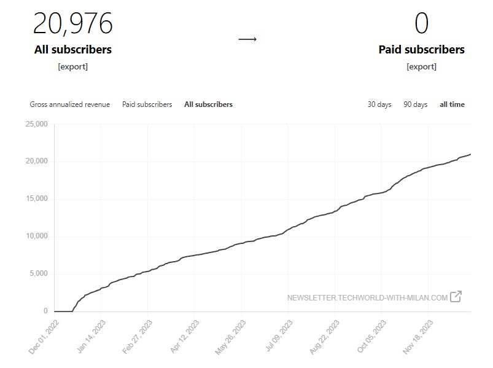
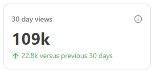
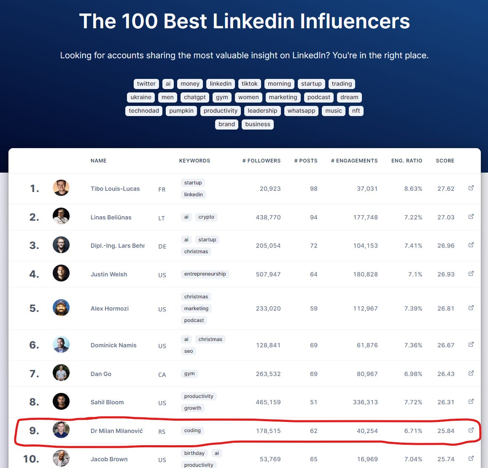

# The Tech World With Milan Newsletter in 2023.

*with you!*

This year was **the start of the newsletter** for me after a few years of writing a blog on my private website. More or less at the same time, I started to write more on networks such as LinkedIn or Twitter, and those platforms are shown as not optimal for writing because you cannot bookmark them properly, and the texts are lost very fast, as well as the max length constraint and formatting which is cumbersome.

Yet, I liked that with the social networks, you're constrained with your writing, so everything we write needs to **be simplified and digested**. Even though many people like longer content, my approach is to provide both types, depending on the subject.

This year, **I released 47 free newsletter issues**, and this one is number 48. I released it every Thursday, and in addition to that, I sent a few direct issues to my readers, which are not available in the Substack. You will notice that I’m not focused only on one area or topic, representing **my diverse experience and interests after 20 years in the industry**.

Let’s give some highlights:

## 1. Growth to 21,000 subscribers

This was an excellent growth for Tech World With Milan; taking that, I started to write at the end of January this year. When I began to write, it was hard to say where we would get at the end of the year, and 21,000 (actual) subscribers say it is a decent job! I got subscribers **across 48 US states and 167 countries worldwide**, which is impressive!

Tech World With Milan Subscribers

Also, this month, this newsletter exceeded **100k views** for the first time!

## 2. No. 1 LinkedIn Influencer in Coding

I finished this year in the number 9 spot of all LinkedIn influencers and **No. 1 in coding**! I also had **70M** views of my articles, and with Twitter (**34M+**) and this newsletter (**775K+**), I had **more than 100M views** **this year**. I currently have almost **[180,000 followers](https://www.linkedin.com/in/milanmilanovic/)**there.

[The 100 Best LinkedIn Influencers by Taplio](https://taplio.com/influencers)

## 3. Long-term cooperation with Postman

As one of my goals is to keep this newsletter open, the friends from Postman supported me in this journey. Thank you guys!

Also, I have occasional support from some other companies, such as SonarSource, Infobip, Tyk, and more.

## 4. Most popular articles

My post is a popular article from 2023. were:

- **[Books Every Software Engineer Must Read in 2023](https://newsletter.techworld-with-milan.com/p/books-every-software-engineer-must)**. - I analyzed the most impactful books every software developer should read this year, and it was significantly received. This article added the previous one about **[the greatest software development books](https://newsletter.techworld-with-milan.com/p/the-greatest-software-development)** ever.
- **[What Are Deployment Patterns?](https://newsletter.techworld-with-milan.com/p/what-are-deployment-patterns)** - In this article, I described some of the most used deployment patterns you could use to introduce new features to users, such as canary releases, blue/green deployments, feature toggles, A/B testing, and dark launches.
- **[.NET Developer Roadmap 2023.](https://newsletter.techworld-with-milan.com/p/net-developer-roadmap-2023)** - This is one of the bigger things I worked on this year, and it represents the most comprehensive .NET Developer roadmap on the market, per seniority level.
- **[How to Become a Great Software Engineer](https://newsletter.techworld-with-milan.com/p/how-to-become-a-great-software-engineer)** - In this article, I analyzed some important skills software engineers need, concrete technical knowledge, and engineering practices to follow.
- **[Stack Overflow Architecture](https://newsletter.techworld-with-milan.com/p/stack-overflow-architecture)** - I analyzed the architecture of some big monolithic systems on the market: Stack Overflow, Shopify, and Levels.fyi. The article details how they cope with scalability and other important aspects of distributed monoliths.
- **[How To Do Code Reviews Properly](https://newsletter.techworld-with-milan.com/p/how-to-do-code-reviews-properly)** - This article discusses one of the essential steps in the software development lifecycle: code reviews. We dig into what to check in code reviews, some good practices that can be used, and some alternative approaches.

The Best Software Engineering Books for 2023.

## 5. My personal favorites

Here are the articles that I enjoyed the most:

- **[Building High-Performing Teams](https://newsletter.techworld-with-milan.com/p/building-high-performing-teams)** - In this article, we discussed how to build great teams, from hiring and building trust to handling dysfunctions in a team and motivating them.
- **[Why should you build a (modular) monolith first?](https://newsletter.techworld-with-milan.com/p/why-you-should-build-a-modular-monolith)** - This article tackled the microservice-bloatware approach, where we see the massive amount of microservice-backed projects, and the justification for selecting this architectural style is usually missing.
- **[All Estimations Are Wrong, But None Are Useful](https://newsletter.techworld-with-milan.com/p/all-estimations-are-wrong-but-none)** - Here, we discussed one of the trickiest problems in the Agile world today - estimations. Why estimations are only forecast, why they fail, and how to improve them.
- **[Your software architecture is as complex as your organization](https://newsletter.techworld-with-milan.com/p/your-architecture-is-complex-as-your) -**This article discusses Conway’s Law, which says that an organization's structure influences the structure of a software system. This law can explain why some complex organizations could create microservice architectures while startups tend to create monoliths.
- **[How to Fight Impostor Syndrome](https://newsletter.techworld-with-milan.com/p/how-to-fight-impostor-syndrome)** - The article introduces some important cognitive biases, such as Impostor syndrome and its counterpart, the Dunning-Kruger Effect, and how they impact our daily work and careers.
- **[How to Learn Anything](https://newsletter.techworld-with-milan.com/p/how-to-learn-anything-efficiently)** - We analyzed essential learning techniques, such as the Feynman and Spaced repetition method, and other essential concepts for efficiently storing and using our knowledge.

The Five Stages of Team Development, according to Tuckman

## 6. Interviews

This year, I managed to interview five great people:

- **[What is the Fractional CTO role?](https://newsletter.techworld-with-milan.com/p/what-is-the-fractional-cto-role)** - An interview with Marc van Neerven about the Fractional CTO role.
- **[Becoming a Software Engineer at Microsoft](https://newsletter.techworld-with-milan.com/p/becoming-a-software-engineer-at-microsoft)** - An interview with [Mihailo Joksimovic](https://open.substack.com/users/50409894-mihailo-joksimovic?utm_source=mentions), a senior software engineer, discusses his path to Microsoft.
- **[Becoming a Staff-Level Engineer at Big Tech](https://newsletter.techworld-with-milan.com/p/how-to-become-a-staff-level-engineer)** - In this issue, I discussed a path to Staff Engineer at Instagram with [Ryan Peterman](https://open.substack.com/users/38830210-ryan-peterman?utm_source=mentions).
- **[What are Feature Factories?](https://newsletter.techworld-with-milan.com/p/what-are-feature-factories)** - This issue discussed the feature factories in today's Agile teams with [Maarten Dalmijn](https://open.substack.com/users/113230631-maarten-dalmijn?utm_source=mentions), who is a thought leader on this topic.
- **[Becoming a Tech Lead at Google](https://newsletter.techworld-with-milan.com/p/becoming-a-tech-lead-at-google)** - Here [Irina Stanescu](https://open.substack.com/users/4332862-irina-stanescu?utm_source=mentions) describes the path to becoming a tech lead at Google.

Becoming a Tech Lead at Google with Irina Stanescu

## 7. New structure

During the year, I introduced **[learning tracks](https://newsletter.techworld-with-milan.com/p/learning-tracks)** representing different interest categories for my readers. Each tracks multiple topics, and each topic has one or more articles for that topic. Currently, I have four learning tracks:

- **[Software Engineering](https://newsletter.techworld-with-milan.com/i/136274190/software-engineering)**with 41 articles.
- **[Product Development](https://newsletter.techworld-with-milan.com/i/136274190/product-development)**with 5 articles.
- **[Leadership](https://newsletter.techworld-with-milan.com/i/136274190/leadership)** with 8 articles.
- **[Personal Growth](https://newsletter.techworld-with-milan.com/i/136274190/personal-growth)** with 15 articles.

## 8. Even more

Some of my articles are distributed to other mediums, such as:

- **[Golem.de](https://karrierewelt.golem.de/blogs/karriere-ratgeber/wie-man-effizient-lernt-und-alles-dauerhaft-behalt-1-2)** in German.
- **[ShiftMag](https://shiftmag.dev/author/milanmilanovic/)** from Croatia.
- **[RedHat](https://www.redhat.com/architect/it-architecture-design-2022)**blog.
- And more to come references.

## In the end

I can say that this year was great, and I will prepare many more surprises for you in the new year, remaining completely **free of charge**!

I want to **thank you for the support**you sent to me 🙏. I worked hard to deliver quality content every week, even though writing this newsletter is not my primary job.

I wish you all the best in the New Year🎄!

Stay strong!

Milan

##