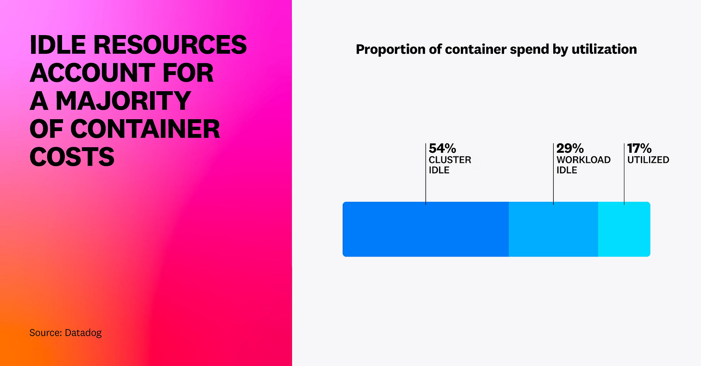
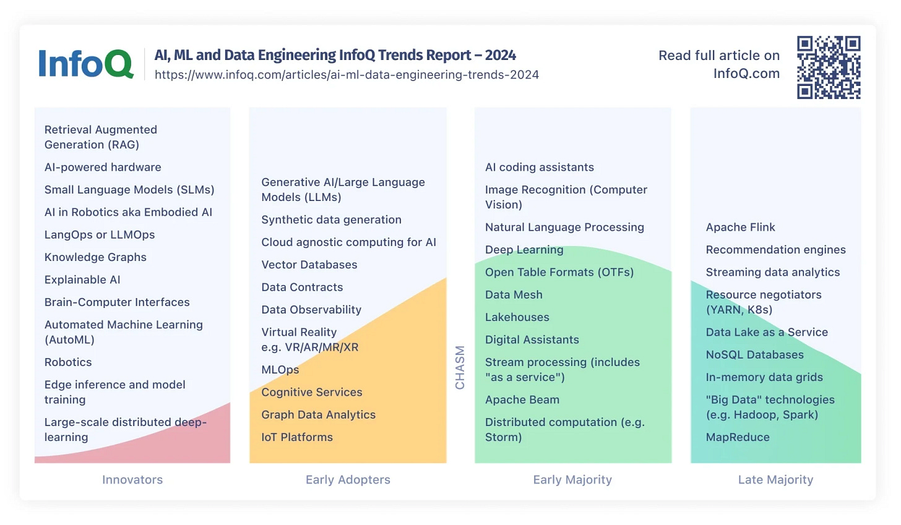
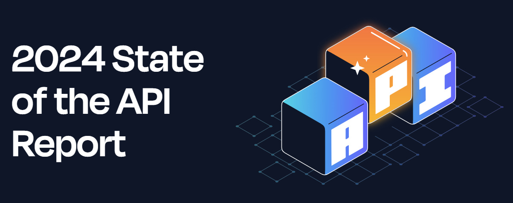
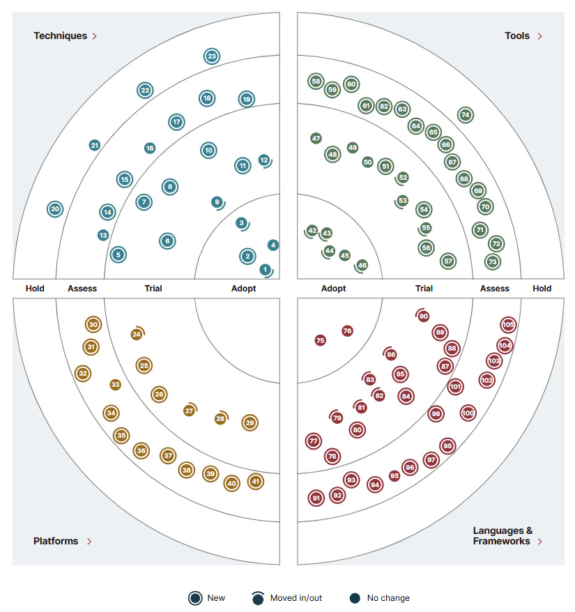

# The Trends #5: 25% of new code is generated by AI

In today’s issue, we will discuss a few trends and industry reports from this year. Namely:

1. **The State of Cloud Costs 2024.**
2. **AI, ML, and Data Engineering Trends - September 2024.**
3. **Over 25% of Google’s code is now written by AI**
4. **2024 State of the API Report by Postman**
5. **ThoughtWorks Technology Radar - Volume 31.**

So, let’s dive in.

---

## [Use Rider 2024.3 for FREE for Non-Commercial Development (Sponsored)](https://www.jetbrains.com/rider/?utm_campaign=rider_free&utm_content=site&utm_medium=cpc&utm_source=milanmilanovict_newsletter_3)

*Check out the latest Rider 2024.3 version with support for .NET 9, the new Windows Forms designer, advanced debugging capabilities, and more. The whole Rider’s feature set is now available for free for non-commercial development!*

[Download and start today](https://www.jetbrains.com/rider/?utm_campaign=rider_free&utm_content=site&utm_medium=cpc&utm_source=milanmilanovict_newsletter_3)

---

## **📄 Key industry insights from all reports**

- **Accelerated adoption of AI technologies**. Organizations increasingly integrate AI into their workflows, significantly impacting software development and infrastructure. Google's revelation that over **25% of their new code is generated by AI systems** shows this trend.
- **Challenges in resource optimization and Cloud cost management.** Despite increased investment in cloud infrastructure, many organizations face significant inefficiencies. Over **80% of container spend is associated with idle resources**, highlighting poor resource utilization. Furthermore, **83% of organizations still use outdated EC2 instance types**, incurring higher costs, and only **67% of enterprises are utilizing available cloud service discounts**.
- **APIs as strategic revenue drivers**. APIs are evolving into strategic assets that drive revenue: **62% of respondents report working with revenue-generating APIs**, indicating the maturation of the API-as-a-product approach (Postman's "2024 State of the API Report").
- **Rise of new programming languages and platforms.** Rust is becoming the systems programming language of choice due to its performance and safety features (ThoughtWorks Technology Radar). At the same time, WASM enables complex applications to run within browser sandboxes, promoting portable, cross-platform development.

---

## 1. The State of Cloud Costs 2024. ☁️

Datadog's latest report, "**[State of Cloud Costs 2024,](https://www.datadoghq.com/state-of-cloud-costs/)**" provides exciting insights into the current trends and challenges organizations face in managing their cloud costs.

Some key findings are:

1. **GPU instances take 14% of compute costs.** There has been a 40% increase in spending on GPU instances over the past year. This growth is primarily driven by the increasing adoption of AI and large language models (LLMs), which rely heavily on the parallel processing capabilities of GPUs. The most widely used type of GPU-based instance, the G4dn, is also the least expensive. This suggests that many organizations are still in the experimentation phase with AI and applying these instances to early efforts in adaptive AI, machine learning inference, and small-scale training.
2. **Over 80% of container spend is spent on idle resources.** Another significant trend in the report is the increasing use of containers, which now account for up to 35% of EC2 compute spend, up from 30% a year ago. However, this growth comes with a caveat: 83% of container costs are associated with idle resources, with 54% of this spend being on cluster idle and 29% on workload idle. This highlights the need for organizations to optimize their container usage and avoid overprovisioning cluster infrastructure.
3. **Outdated technologies are widely used.** Despite the advancements in cloud technology, the report finds that 83% of organizations still use previous-generation EC2 instance types, which cost more than their newer counterparts. This suggests that many organizations are still in the process of modernizing their infrastructure.
4. **Organizations are not using discounts.** Many cloud service providers offer commitment-based discounts on their offerings; for instance, AWS provides discount programs for Amazon SageMaker, Amazon EC2, Amazon RDS, and other services. However, just 67% of enterprises are taking advantage of these discounts, a decrease from 72% the previous year.
5. **Green technologies are on the rise.** Businesses using Arm-based instances typically spend 18% of their EC2 compute budget on them, double what they did a year ago. Arm-based instance types frequently offer superior performance at a lower cost and consume up to 60% less energy than comparable EC2s.

Idle resources account for a majority of container costs ([State of Cloud Costs 2024](https://www.datadoghq.com/state-of-cloud-costs/)**)**

---

## 2. AI, ML, and Data Engineering Trends - September 2024.

InfoQ recently released a [new AI, ML, and Data Engineering trends analysis](https://www.infoq.com/articles/ai-ml-data-engineering-trends-2024/).

Here are the main points from the report:

1. **Shift towards open-source models.** The future of AI is bright, with a significant shift towards open and accessible models. This trend, championed by companies like Meta, holds the potential to democratize AI technology, making it more inclusive and innovative.
2. **Retrieval-augmented generation (RAG) techniques are becoming important**. Not only are they gaining importance, but they are revolutionizing how organizations handle large language models (LLMs). RAG techniques are paving the way for a safer and more productive AI landscape by enabling more efficient and secure data handling.
3. **AI-integrated hardware is on the rise**. There is a growing emphasis on AI-powered hardware, including GPUs and PCs explicitly designed for AI tasks, such as NVIDIA’s GeForce RTX and AI-powered PCs like Apple M4. These hardware are expected to significantly enhance the performance of AI applications, making them faster and more efficient.
4. **Small Language models (SLMs) will see more adoption**. The future of AI is not just about large and complex models. There is a growing interest in Small Language Models (SLMs), which are more suited for edge computing and can operate effectively on smaller devices. This opens up a world of possibilities for various applications, making the future of AI even more exciting.
5. **AI Agents will see increasing usage.** The adoption of AI agents, such as coding assistants, is rising, particularly in corporate environments. These tools are designed to enhance productivity and streamline development processes. Gihub’s Copilot, Microsoft Teams’ Copilot, DevinAI, Mistral’s Codestral, and JetBrains’ local code completion are some examples of AI agents.
6. **AI Safety and Security will become more important**. Ensuring safety and security in AI applications becomes paramount as AI technologies advance. Organizations are encouraged to adopt self-hosted models and open-source solutions to bolster security frameworks. This is crucial to prevent misuse of AI and protect against potential threats such as data breaches and algorithmic biases.
7. **LangOps/LLMOps is an important part of the LLM lifecycle.** It is crucial to manage LLMs post-deployment. LangOps, or LLMOps, focuses on best practices for supporting and maintaining language models in production environments.

The report includes, as usual, trends graph categorizing technologies based on their adoption stages:

- ➡️ **Innovators**: New entrants include RAG and AI-integrated hardware. These technologies are expected to see significant development over the next year.
- ➡️ **Early Adopters**: Generative AI and LLMs have moved into this category, reflecting their growing acceptance and use in various applications.
- ➡️ **Early Majority**: AI coding assistants and image recognition technologies are gaining traction, indicating their broader adoption in corporate settings.

InfoQ AI, ML, and Data Engineering Trends Report - September 2024

---

## 3. Over 25% of Google’s code is now written by AI

During Google's [third-quarter earnings call at Google I/O 2024](https://blog.google/inside-google/message-ceo/google-io-2024-keynote-sundar-pichai/#gemini-era), CEO Sundar Pichai revealed that more than 25% of the company's new code is created by AI systems, with human engineers reviewing and accepting the contributions. "*This helps our engineers to do more and move faster,*" Pichai stated, emphasizing the boost in productivity and efficiency.

Google's usage of AI-generated code reflects a broader trend in the software development industry. According to the 2024 Stack Overflow Developer Survey, **over 76% of developers are using or planning to use AI tools in their development process this year**. AI coding assistants like GitHub Copilot, launched in 2021, have popularized AI-assisted coding by providing code suggestions and generating new code from natural language instructions.

While AI-assisted coding offers numerous benefits, such as increased productivity and the ability to handle routine coding tasks, it has also raised questions about potential risks. Concerns include introducing **difficult-to-detect bugs and errors and overreliance on AI-generated solutions**, especially with junior developers.

The integration of AI into coding practices has its challenges. Studies have shown that developers **using AI assistants may introduce more bugs into their code while believing it is more secure**. This paradox highlights the need for skilled human oversight to ensure code quality and security.

Yet, with all the technological advantages in previous decades, even from low-level languages such as Assembler to high-level languages and using OO programming, similar questions and debates over the future role of human developers arose.

From all the recent trends, we can see that AI is a good to great helper, but it can still produce bad code and is also very focused on a narrow context without understanding the whole codebase.

Nevertheless, it is an exciting trend that will enable us developers to work faster and more efficiently.

Sundar Pichai, CEO of Google and Alphabet

---

## 4. 2024 State of the API Report by Postman

Folks from **[Postman](https://www.postman.com/)** recently released a [new State of API report](https://www.postman.com/state-of-api/2024/), and over 5,600 developers contacted them to express their opinions.

What are the critical trends in API development?

1. **The shift from code-first to API-first.** Currently, every application contains between 26 and 50 APIs, so 74% of respondents use an API-first approach, up from 66% in 2023.
2. **Collaboration challenges are still relevant**. Despite speedier production, developers continue to confront challenges while cooperating on APIs. Issues with documentation, complex requests, and confusing variables can all cause delays in public and private API integration. While 58% of developers rely on internal docs, only 39% say that inconsistent docs are the main roadblock. In addition, 44% of developers dig through source code to understand APIs, and 43% rely on colleagues to explain them.
3. **Gateways are everywhere.** Almost 30% of API authors utilize numerous gateways, highlighting the challenge of managing APIs in varied ecosystems. Using several gateways can hinder API discovery and monitoring.
4. **APIs are revenue drivers.** 62% of respondents report working with revenue-generating APIs. This indicates the emergence of the API-as-a-product approach, in which APIs are conceived, developed, and promoted as strategic assets.
5. **The AI landscape is diversified.** AI bots like ChatGPT are quickly becoming popular and are expected to improve human-computer interaction. Quality APIs are essential for staying ahead in modern software, as AI alone cannot enhance productivity.
6. **APIs are now a top target for malicious software.** Even though most responses use an API-first approach, 27% do not use API key vault security technologies, whereas those that do prefer AWS Key Management (28%) and Azure Key Vault (24%).
7. **API ownership.** The process of creating and managing APIs varies based on the organizational structure. According to 48% of respondents, demand-driven API creation is the development team's responsibility, while the same percentage say that a central team oversees API strategy and governance.

Postman 2024 State of the API Report

---

## 5. ThoughtWorks Technology Radar - Volume 31.

A new volume of [ThoughtWorks Technology Radar](https://www.thoughtworks.com/radar), a twice-per-year report on the latest technology trends, techniques, and tools, is just released.

What we can see from the latest report:

1. **Coding assistance antipatterns.** The use of generative AI in development has led to antipatterns like overconfidence in AI-generated code, the mistaken belief that AI can replace human pair programming, and code quality issues due to brute-force solutions. Developers should reinforce good engineering practices, such as unit testing and architectural fitness functions, to ensure AI enhances rather than complicates their codebases.
2. **Rust is rising fast.** Rust has become the systems programming language of choice, praised for its performance and safety. It is often used to replace older utilities or improve ecosystem performance, earning it the reputation of being "blazingly fast." Its well-liked ecosystem of tools and libraries has garnered high regard among developers.
3. **The gradual rise of WASM**. WebAssembly (WASM) is gaining traction by enabling complex applications to run within browser sandboxes, making previously native-only applications embeddable in browsers. With support from all major browsers, WASM opens up exciting possibilities for portable and cross-platform development.
4. **The Cambrian explosion of generative AI tools.** There's been an explosive growth of tools supporting generative AI and language models, facilitating the engineering of AI-driven products. While these tools may not meet all initial hype, they enable the practical use of generative AI, and this chaotic yet innovative growth is expected to continue.

In more detail:

### **🛠️ Techniques**

🔹 **Adopt**: 1% canary, Component testing, Continuous deployment, Retrieval-augmented generation (RAG)

🔹 **Trial**: Domain storytelling, Fine-tuning embedding models, Passkeys, Using GenAI to understand legacy codebases

🔹 **Assess**: AI team assistants, Dynamic few-shot prompting, Observability 2.0

🔹 **Hold**: Complacency with AI-generated code, Replacing pair programming with AI

### **🔧 Tools**

🔹 **Adopt**: Bruno, K9s, Visual regression testing tools, Wiz

🔹 **Trial**: AWS Control Tower, CCMenu, ClickHouse, Devbox, LinearB, Spinnaker, Unleash

🔹 **Assess**: Astronomer Cosmos, Cursor, GitButler, Mise, Mockoon, Raycast, Warp, Zed

### **💻 Platforms**

🔹 **Adopt**: Databricks Unity Catalog, FastChat, Langfuse, Qdrant

🔹 **Assess**: Azure AI Search, Elastisys Compliant Kubernetes, FoundationDB, Golem, Iggy, SpinKube

### 📚 **Languages and Frameworks**

🔹 **Adopt**: dbt, Testcontainers

🔹 **Trial**: CAP, Databricks Asset Bundles, Instructor, Kedro, LiteLLM, Medusa

🔹 **Assess**: Apache XTable, DeepEval, Flutter for Web, Microsoft Autogen, Score, Ragas, Pingora

ThoughtWorks Technology Radar, Volume 31 (October 2024.)

---

## More ways I can help you

1. **[LinkedIn Content Creator Masterclass](https://www.patreon.com/techworld_with_milan/shop/short-linkedin-content-creator-311232?utm_medium=clipboard_copy&utm_source=copyLink&utm_campaign=productshare_creator&utm_content=join_link).**In this masterclass, I share my strategies for growing your influence on LinkedIn in the Tech space. You'll learn how to define your target audience, master the LinkedIn algorithm, create impactful content using my writing system, and create a content strategy that drives impressive results.
2. **[Resume Reality Check"](https://www.patreon.com/techworld_with_milan/shop/resume-reality-check-311008?source=storefront)**. I can now offer you a new service where I’ll review your CV and LinkedIn profile, providing instant, honest feedback from a CTO’s perspective. You’ll discover what stands out, what needs improvement, and how recruiters and engineering managers view your resume at first glance.
3. **[Promote yourself to 38,000+ subscribers](https://newsletter.techworld-with-milan.com/p/sponsorship-of-tech-world-with-milan)**by sponsoring this newsletter. This newsletter puts you in front of an audience with many engineering leaders and senior engineers who influence tech decisions and purchases.
4. **[Join my Patreon community](https://www.patreon.com/techworld_with_milan)**: This is your way of supporting me, saying “**thanks**," and getting more benefits. You will get exclusive benefits, including all of my books and templates on Design Patterns, Setting priorities, and more, worth $100, early access to my content, insider news, helpful resources and tools, priority support, and the possibility to influence my work.
5. **1:1 Coaching:** [Book a working session with me](https://newsletter.techworld-with-milan.com/p/coaching-services). 1:1 coaching is available for personal and organizational/team growth topics. I help you become a high-performing leader and engineer 🚀.

---

Thanks for reading Tech World With Milan Newsletter! Subscribe for free to receive new posts and support my work.