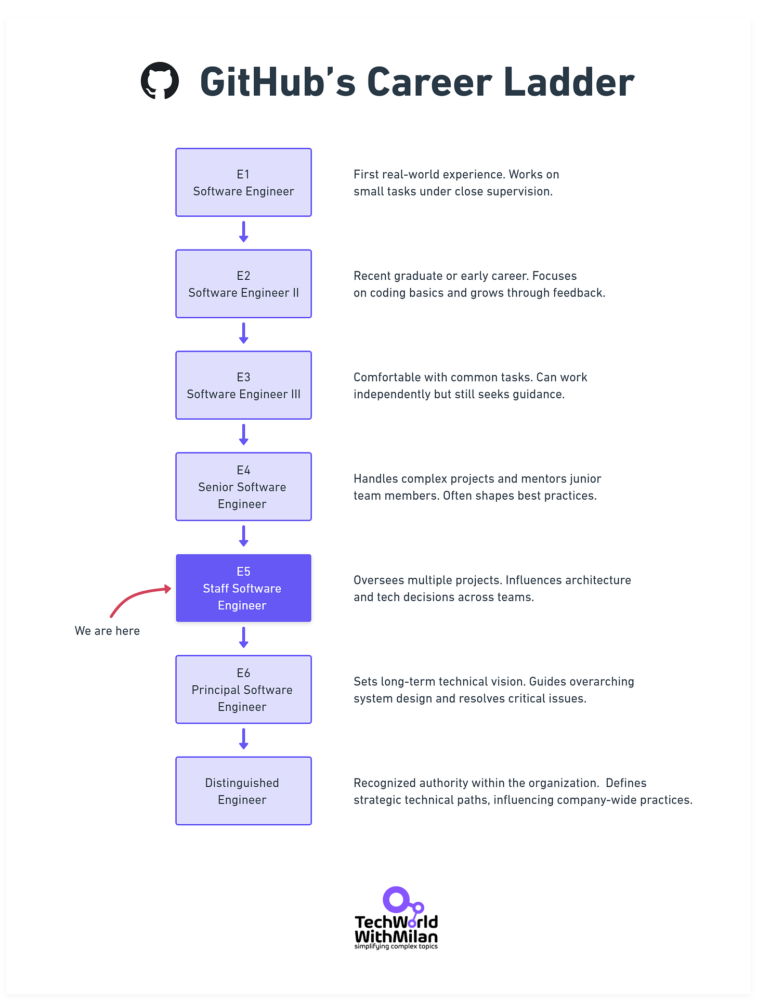
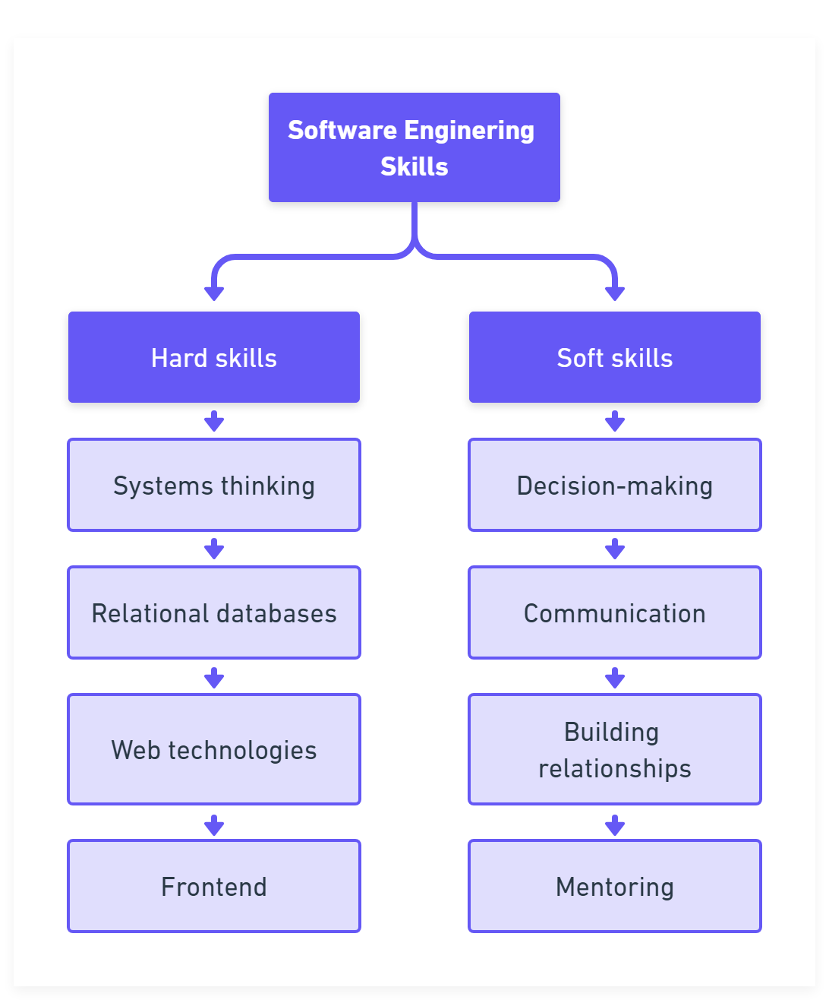
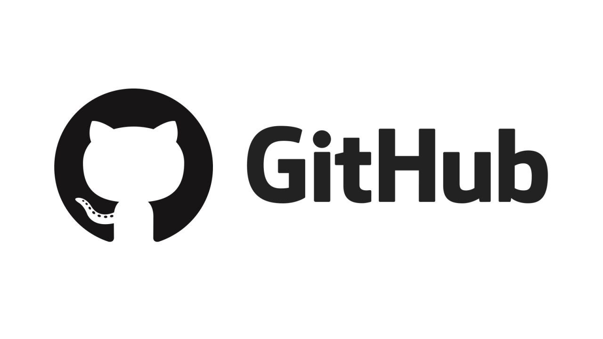
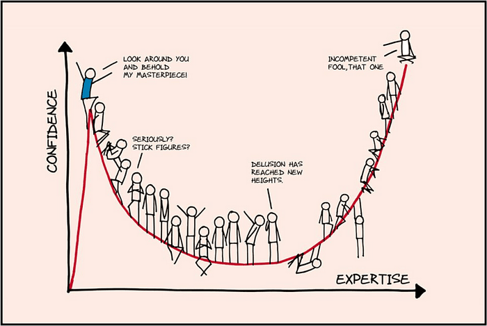
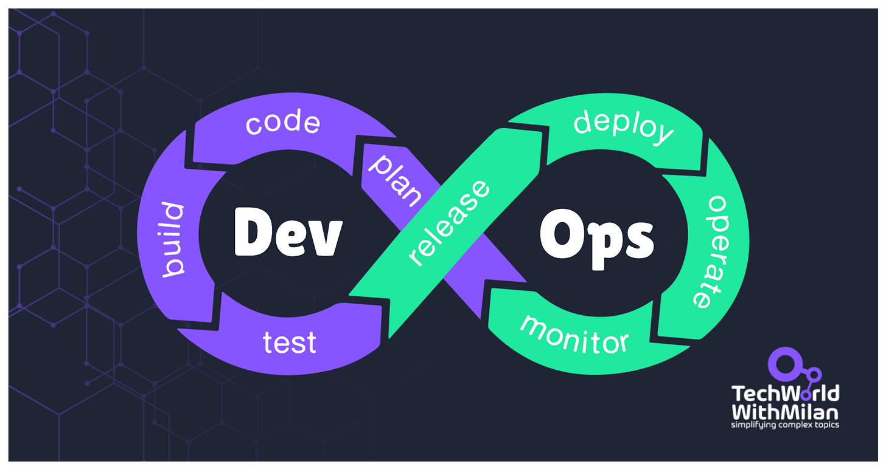
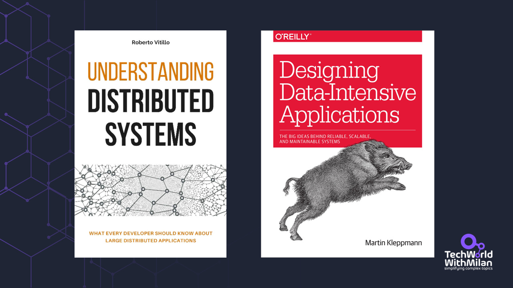

# Thinking like a Staff Engineer at Big Tech with Sean Goedecke

*An interview with Sean Goedecke, Staff Software Engineer at GitHub.*

In today’s newsletter, I’m featuring a conversation with **[Sean Goedecke](https://www.seangoedecke.com/)**, a Staff Software Engineer at GitHub who has reached the Staff level twice in his career. Sean’s insights on technical leadership, goal alignment, and practical project delivery provide a no-nonsense look at what it takes to excel in big tech environments.

Here’s a glimpse of what we cover:

- **Key lessons in shipping large-scale projects and why keeping leadership informed matters**
- **Balancing top-notch technical skills with selective soft-skill usage**
- **Strategies for standing out in high-stakes company initiatives**
- **The trade-offs behind key architectural decisions in SaaS development**
- **Navigating career growth and promotions in remote or distributed teams**

If you aim for a more significant impact in your engineering career, you’ll find much to explore in this conversation.

Enjoy the interview!

---

## 1. Tell me a bit about yourself. Who is Sean Goedecke?

I’m a software engineer at GitHub, working on various AI products. I’ve been in the industry for about ten years, primarily at sizable American tech companies, where I've been involved in standard SaaS web development. I don’t have a traditional computer science background. I hold a degree in mathematics and an MA in moral philosophy, which have equipped me well for the kind of careful, rigorous thinking required in this field.

I’d always enjoyed programming as a hobby, so when it became clear that there were no jobs in academic philosophy, I applied for a software engineering internship at Zendesk. **Over five years, I worked my way up to a staff engineer role, then changed jobs to GitHub** (I came in as a senior and have since been promoted back up to staff).

I’ve been blogging extensively recently, and my posts have reached a larger audience than expected. In particular, I wrote a very popular post about **[how I ship projects](https://www.seangoedecke.com/how-to-ship/)**. You can find the rest of my posts at [https://www.seangoedecke.com/](https://www.seangoedecke.com/).

I live in Australia, but my manager and half my team are based in America, so I have a work environment spread across time zones (and cultures!), which can be pretty interesting. And a personal fact: I have two greyhounds, Daisy and Ringo, who I love wholeheartedly.

Sean Goedecke, Staff Software Engineer at GitHub

> “***[The default state of a project is to not ship](https://www.seangoedecke.com/how-to-ship/)**[: to be delayed indefinitely, cancelled, or to go out half-baked and burst into flames.](https://www.seangoedecke.com/how-to-ship/)*” - Sean Goedecke

## 2. You’ve reached the Staff Engineer level twice. What key experiences or skills helped you get there each time?

The primary meta-level skill involved is **being very intentional about your goals** and how you plan to get there. In my experience, you can get promoted to senior roles by just putting your head down and doing good work, but to go further than that, you have to **figure out what gets people promoted to staff+ at your company** and actively work towards that. For my promotions, I was heavily involved in writing and editing my promo packet, building relationships with key managers and engineers, ensuring I could lead high-profile projects, and so on.

One thing I did a lot was to put my hand up to **work on projects that were important to the company**. For instance, at GitHub, I volunteered to join a temporary team investigating a high-priority reliability issue, which let me work with many staff+ engineers. Later on, I was able to ask those engineers to write short testimonials for my promo packet, which was a key part of the process.

Regarding specific skills, **I’m good at getting projects over the line**, which has become necessary for the work that goes into a staff promo packet. The decision-makers at big tech companies care about project shipping, so if you can demonstrate your ability to do that smoothly, you get put on more key projects. It’s also been a good way for me to get to know my skip-level manager (and their manager, etc), which is useful when they make the final call on my staff promotion.

Working on a high-profile company initiative is a unique experience. The fact that there are so many stakeholders and so much pressure means that the day-to-day is chaotic, **everything feels like a giant mess, and almost nobody understands end-to-end what’s going on.** I’ve gotten to run the engineering side (or one of the engineering sides) of these many times. It’s not easy, but if you can bring some calmness and clarity to a situation like that - and get it shipped successfully - that buys a lot of credit with decision-makers at the company.

GitHub’s Career Ladder

## 3. Which technical skills are essential for a successful Staff Engineer?

One caveat: **There are many ways to be a successful staff engineer**. Some are more like VPs, with official or unofficial direct reports. Others are deep technical experts on one topic and work only on that topic. I’m only speaking about the kind of staff engineer I am, which is more of a floating project-lead type.

**The most important technical skill is fitting lots of context in your head (cognitive load)**. For instance, in a complicated project launch you must be able to wrap your head around the actual dependency tree of what-needs-to-ship-when: to identify the next piece of work, or to remind a key team of what they have to do, or to catch a problem where two critical pieces both think they’re blocked on each other. That requires a solid grasp of the technical elements (services, feature flags, database migrations and records, API endpoints, etc).

[![What truly matters in software development isn't following trendy practices—it's minimizing mental effort for other developers.
I've witnessed numerous projects where brilliant developers created sophisticated architectures using cutting-edge patterns and microservices. Yet when new team members attempted modifications, they struggled for weeks just to grasp how components interconnected. This cognitive burden drastically reduced productivity and increased defects. Ironically, many of these complexity-inducing patterns were implemented pursuing "clean code."
The essential goal should be reducing unnecessary mental strain. This might mean:

Fewer, deeper modules instead of many shallow ones
Keeping related logic together rather than fragmenting it
Choosing straightforward solutions over clever ones

The best code isn't the most elegant—it's what future developers (including yourself) can quickly comprehend.
When making architectural decisions or reviewing code, ask: "How much mental eff](images/72623f5b-105b-46de-b2b1-0087173bd295_800x590.jpeg)](https://substackcdn.com/image/fetch/$s_!fd0D!,f_auto,q_auto:good,fl_progressive:steep/https%3A%2F%2Fsubstack-post-media.s3.amazonaws.com%2Fpublic%2Fimages%2F72623f5b-105b-46de-b2b1-0087173bd295_800x590.jpeg)Cognitive load is what matters ([Source](https://minds.md/zakirullin/cognitive))

You can’t just focus on the specific element you’re working on and trust that someone else has the big technical picture. **If you’re leading the project**, **it’s your job to grasp the big picture**. In my experience, projects where nobody is doing this almost always fail.

In terms of general skills: in my neck of the woods, I’d say you have to be **very comfortable with relational databases, have a good intuitive understanding of HTTP and whatever server architecture your main app is using** (for me, that’s Unicorn), **and enough frontend to be able to fix bugs and build new UI** in whatever framework you’re using (for me, that’s React). That’s a pretty basic list by design - I don’t think you need to be a coding wizard to be a successful staff engineer, just a strong systems thinker.

Most crucial software engineering skills, according to Sean Goedecke

## 4. In your experience, which soft skills have been most valuable in advancing your career to a Staff Engineer role?

The most valuable soft skill I’ve developed is **being very selective about what battles I pick** and being enthusiastic instead of reluctant when I decide not to choose a struggle. It’s easy to invest in every technical decision, but doing that isn’t a good way to deliver value to the company (which is your job at any level, but most explicitly as a staff engineer). If the decision will work, it’s usually better to smile and endorse it than to nitpick. That way, you can make it stick when you have to dig your heels in.

Other critical soft skills:

- **Writing short updates and work summaries** for an executive audience, with minimal technical detail
- **Bridging the gap between technical and non-technical communicators** when needed (e.g., engineers and product)
- **Reassuring people who are panicking about the state of the project** (in complex enough projects, many people will panic at one time or another)

**Soft skills are more critical at the staff level than other levels, but I don’t think they’re more vital than technical skills.** If you get the key technical decisions wrong for your leading projects, those projects will fail, no matter how good your soft skills are. If you don’t understand what’s going on at a technical level, you won’t be able to communicate it, no matter how good your soft skills are.

## 5. What were your biggest challenges while advancing to a Staff Engineer position?

I had to go through a few reorgs while trying to be promoted, which is a giant pain (particularly at the staff+ level)**. When your skip-level manager changes, you have to start building that relationship up all over again**, which can be frustrating when your old skip was on board with your promotion. Even if you get along well with them, it just takes more time and adds risk: for instance, they might get along well with you but not your direct manager, which can also be a big problem.

I’d recommend **taking full advantage of your skip-level 1:1s in this situation.** A new skip-level manager is usually desperate for reliable technical information. If you can present yourself as someone willing to answer any technical question without judgment, you can sometimes rapidly build a strong relationship.

## 6. What are some less-known characteristics of good engineers?

Strong engineers have a **towering internal confidence that they can dig in and work out when faced with a tricky problem**. The nature of software development is that you’re hopelessly confused most of the time. It helps to believe right down to your bones that you’ll be able to solve the problem eventually.

Another is that **[strong engineers tend to think in tradeoffs](https://www.seangoedecke.com/what-makes-strong-engineers-strong/) instead of having strong opinions about what’s “good” and “bad**.” Most high-level technical decisions have pros and cons. For instance, working in a monolithic codebase increases the blast radius of some bugs and can make deployments and coordination harder. Still, it removes a class of potential distributed system problems and makes refactoring across modules much more manageable.

Confidence vs expertise (source: [Dunning-Kruger Effect](https://www.businesstimes.com.sg/opinion-features/features/not-so-blissful-ignorance-dunning-kruger-effect-work))

> *Learn more about [the Dunning-Kruger Effect](https://newsletter.techworld-with-milan.com/p/how-to-fight-impostor-syndrome) and how to deal with it.*

## 7. How do you ensure your work aligns with the company's goals and delivers impact?

First, **I read the official company goal**s and the regular updates from my VP/director, etc., posts in Slack. That might seem obvious, but **many engineers don’t even do that.** I also explicitly ask my managers and skip levels questions like “*What’s top-of-mind for you right now?*” Managers will happily answer questions like that—in my experience, they want you to know their goals.

**I also try to pay attention to the vibes**. If my skip-level manager asks me many questions about a project, I assume it’s essential. If they seem disengaged, I think there’s a higher-priority issue. I produce a lot of screenshots and video demos, and I pay close attention to how they’re received. For instance, if the reaction is “cool, but what about X?” That’s evidence that X is more important to the company than the specific thing I’ve demoed.

Finally, as a general rule, **I try not to have too many of my own goals in a high-priority project.** If I’m personally invested in teams using Rails templates instead of React, for instance, that could lead me to make decisions that set the project up for failure if React is what’s genuinely needed. There’s often just not enough room to satisfy my goals and meet the company’s goals simultaneously.

## 8. Could you share a significant technical challenge from your early career that taught you an important lesson?

Early at Zendesk, I shifted our team’s main service from an on-the-metal deployment to Kubernetes. It was a gnarly enough setup that this was a genuinely difficult task, and at the time, I had minimal familiarity with k8s or operational work in general. I made many big mistakes (for instance, I didn’t set our Unicorn config properly for the k8s setup and initially deployed to production with a single worker). It taught me what it looks like when things go wrong at scale: **how metrics will lie to you, why understanding the system end-to-end is critical to understanding the problem, and so on.**

Since then, I’ve firmly believed**that how your code runs in production is your responsibility as an engineer.** That’s now the mainstream view, which is nice ([DevOps movement](https://github.com/milanm/DevOps-Roadmap))!

DevOps movement (check my [DevOps learning roadmap for 2025](https://github.com/milanm/DevOps-Roadmap))

## 9. How has your approach to evaluating and solving technical problems evolved from your senior engineer days to your current role as a Staff Engineer?

Technically, my fundamental approach hasn’t changed. **I still try to understand the system end-to-end, pack as much context into my head as possible, and then pick the most pragmatic solution.** (That’s usually the solution with the fewest moving parts or that will ruffle the fewest feathers with other stakeholders.) I’ve certainly gotten better at that: I can pack more context, and I’ve seen more systems, which helps me get up to speed on new ones faster.

The most significant change is something I mentioned earlier in a few places. As a senior engineer, I had many of my stylistic preferences and goals (for instance, I was obsessive about [keeping interfaces as small as possible](https://newsletter.techworld-with-milan.com/p/my-learnings-from-the-book-a-philosophy)). **I was much more emotionally invested in how systems were built**. Now, I try to adopt the organization's preferences, and I don’t mind how a system is built as long as it’s stable, maintainable, functioning, and so on.

## 10. When building your technical foundation, which areas of computer science and engineering proved most crucial to master?

I must say, **distributed systems and databases**. Why distributed systems? The most complex problems in SaaS web development are scale-related issues that require you to reason about **large, out-of-sync distributed systems**. To this day, my favourite bug I ever solved was an issue where requests were going to a different host while a new DNS record was being propagated. The asset signatures on that host differed slightly from those on the new host.

Why databases? **Because I/O with the database is almost always the bottleneck for SaaS web dev** (at least, if you’re doing it right), there’s enormous mileage in understanding what’s going on. Here’s a simple example: You’ll probably always work in companies that separate their database write nodes from their read replicas. Reading from the replicas is faster and safer but exposes you to replication lag. Depending on the feature you’re working on, you’ll have to do one or the other.

Two excellent books on distributed systems and data-intensive applications ([recommended by Milan](https://newsletter.techworld-with-milan.com/p/learn-things-that-dont-change))

## 11. From your experience, what’s the key to successfully delivering projects at Big Tech companies?

The main thing is **a ruthless focus on [actually shipping](https://www.seangoedecke.com/how-to-ship/)** - delivering projects is too hard to make it your second or third priority. You must constantly consider what prevents you from completing the project and how to remove those blockers.

It’s also critical to understand **what successfully delivering a project means**. It doesn’t mean getting code into production. What it means is making the decision-makers at your company happy with the project, i.e., fulfilling whatever vision they have in their heads about what the project should be. So a big part of your time should be spent figuring out what goals they want to achieve.

Of course, you must be technically strong enough to make it happen and solve all the problems. However, **many engineers focus on the “technically strong” part and neglect everything else**.

## 12. What did you learn about influence and leadership from your first time leading a major technical initiative without direct authority?

I remember a time in my early career when I ran a front-end UI migration and botched the handoff. I had to move on to another project, and my UI code was *mostly* there. Of course, the last 10% is the hardest, especially when handing it off to someone new to the area. The whole thing ended up being a disaster.

I learned that **people will (understandably) assume that you’ve covered all the details,** **even when you try to communicate otherwise,** so you’d better have them covered.

Influencing others without authority (Designed by [Freepik](https://support.freepik.com/s/article/Attribution-How-when-and-where?language=en_US&_gl=1*1y302c7*_gcl_au*OTc3NjM2NDQuMTczODY3NDY2NQ..*_ga*MTgwMDUxNjgwNy4xNzM4Njc0NjY1*_ga_QWX66025LC*MTc0MTQ2MDExMC4zLjEuMTc0MTQ2MDIzOC4xNi4wLjA.))

> “*The only way on earth to influence other people is to talk about what they want and show them how to get it*” - Dale Carnegie

## 13. How do you balance mentoring and growing other engineers with staying technically sharp in a remote-first environment like GitHub?

I think this sort of thing should happen organically. **You should work on projects with more junior engineers, and as part of that, you should naturally involve them in your decisions and help them make their own choices**. I try to be available for ad-hoc quick video calls and work “in the open” (i.e., writing frequent updates and plans as issue comments everyone can read). That’s good practice for remote work, anyway.

I’ve seen many junior engineers I’ve worked with grow into strong senior engineers, so it doesn’t seem like I’m holding them back.

## 14. How do you stay current with fast-evolving technology, and what methods do you use for continuous learning?

I read a lot of blogs and articles[—Hacker News](https://news.ycombinator.com/), [Lobsters,](https://lobste.rs/) and so on. One thing **I make a deliberate effort to do is read the paper behind the article**. For AI, I’ve read most of the key papers myself. Even if I only understand 80% (or less), getting the content directly and not through blogs or tweets is still valid.

I also find that **writing blogs and code myself is excellent for learning**. I’m a big fan of toy projects (for instance, I reimplemented [Karpathy’s nanogpt](https://github.com/karpathy/nanoGPT) in Node.js and Ruby). That’s especially good at helping me wrap my head around the mathematical parts of AI papers. A complex expression often resolves to a few straightforward lines of code.

> *Learn more about the computer science papers every software engineer should read:*
[
Tech World With Milan NewsletterComputer Science Papers Every Developer Should ReadThe foundations of modern software engineering were built on some high-impact research papers. From the algorithms powering most apps today to the databases storing data, many technologies we use daily emerged from academic publications. While these papers might initially seem complex, they offer important insights that can transform your approach to so…Read morea year ago · 129 likes · 9 comments · Dr Milan Milanović](https://newsletter.techworld-with-milan.com/p/computer-science-papers-every-developer?utm_source=substack&utm_campaign=post_embed&utm_medium=web)
## 15. Which emerging trends should software engineers focus on to stay ahead in the coming years?

**AI, obviously!** Get good at using chat models, understand the fundamental tradeoffs, and figure out what’s involved in [building around LLM APIs](https://www.seangoedecke.com/how-i-use-llms/). A lot of this stuff is unintuitive to normal software engineers because AIs are bad at things computers are usually good at and vice versa.

Aside from AI, there’s a **[big shift from cool new technologies to boring, effective ones](https://boringtechnology.club/)**. Java and Ruby on Rails are experiencing a resurgence, MySQL is suddenly cool again, and everyone is trying to use SQLite in production.

---

## 🎁 Promote your business to 350K+ tech professionals

Get your product in front of **more than 350,000+ tech professionals** who make or influence significant tech decisions. Our readership includes senior engineers and leaders who care about practical tools and services.

Ad space often books up weeks ahead. If you want to secure a spot, **[contact me](https://milan.milanovic.org/#contact)**.

Let’s grow together!

[Sponsor Tech World With Milan](https://newsletter.techworld-with-milan.com/p/sponsorship-of-tech-world-with-milan)

---

## More ways I can help you

1. **📢 [LinkedIn Content Creator Masterclass](https://www.patreon.com/techworld_with_milan/shop/short-linkedin-content-creator-311232?utm_medium=clipboard_copy&utm_source=copyLink&utm_campaign=productshare_creator&utm_content=join_link).**In this masterclass, I share my strategies for growing your influence on LinkedIn in the Tech space. You'll learn how to define your target audience, master the LinkedIn algorithm, create impactful content using my writing system, and create a content strategy that drives impressive results.
2. **📄 [Resume Reality Check](https://www.patreon.com/techworld_with_milan/shop/resume-reality-check-311008?source=storefront)**. I can now offer you a service where I’ll review your CV and LinkedIn profile, providing instant, honest feedback from a CTO’s perspective. You’ll discover what stands out, what needs improvement, and how recruiters and engineering managers view your resume at first glance.
3. **💡 [Join my Patreon community](https://www.patreon.com/techworld_with_milan)**: Be first to know what I do! This is your way of supporting me, saying “**thanks**," and getting more benefits. You will get exclusive benefits, including 📚 all of my books and templates on Design Patterns, Setting priorities, and more, worth $100, early access to my content, insider news, helpful resources and tools, priority support, and the possibility to influence my work.
4. 🚀 **1:1 Coaching:** [Book a working session with me](https://newsletter.techworld-with-milan.com/p/coaching-services). I offer 1:1 coaching for personal, organizational, and team growth topics. I help you become a high-performing leader and engineer.

---

Thanks for reading Tech World With Milan Newsletter! Subscribe for free to receive new posts and support my work.