# The Trends #8: Developers use AI more, but they trust it much less

*And what are six architectural shifts are reshaping how teams build software.*

*The Trends covers the signals that matter in software development and AI adoption. Spot something worth sharing? Send me a message.*

In today’s issue, we cover:

1. **84% of developers use AI, but trust is plummeting.** Stack Overflow's 2025 survey reveals the paradox: AI usage jumped 8% while trust dropped 10 points. The "almost right" code problem is creating a hidden productivity tax that's worse than broken code.
2. **LLMs hit mainstream adoption faster than expected.** InfoQ's latest trends report shows large language models jumped from early adopter to late majority in just 18 months. Six architectural shifts are reshaping how teams build software.
3. **GenAI tools have matured beyond code generation.** ThoughtWorks' Technology Radar shows coding assistants now drive full implementations through chat interfaces. But they're warning against replacing human oversight with AI confidence.
4. **AI's biggest use case isn't what you'd expect.** Harvard research reveals therapy and companionship topped coding as GenAI's primary application in 2025. The shift from technical to emotional needs signals something deeper about human nature.
5. **Which jobs will be affected by AI.** A study from Microsoft shows the 40 jobs most affected by AI and the 40 least affected.

So let’s dive in.

---

## [JetBrains Junie is your coding agent designed to handle tasks autonomously (Sponsored)](https://jb.gg/junie-in-rider-252)

*Meet Junie, your new AI coding agent, now available in JetBrains Rider, the world’s most loved IDE for .NET and game development. Junie doesn’t just assist — it works alongside you. Use Code mode for delegating coding tasks or Ask mode for brainstorming features or new solutions.*

[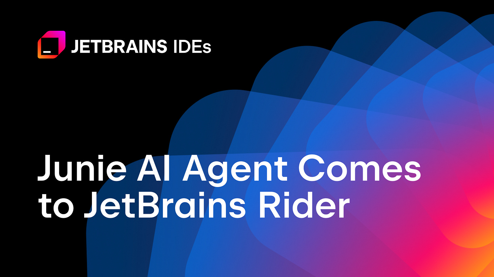](https://jb.gg/junie-in-rider-252)

[Download Junie for Rider here](https://jb.gg/junie-in-rider-252)

---

**[Sponsor this newsletter](https://newsletter.techworld-with-milan.com/p/sponsorship-of-tech-world-with-milan)**

## 1. 84% of developers use AI, yet most don’t trust it

The recent **[Stack Overflow 2025 survey](https://survey.stackoverflow.co/2025/)** reveals some interesting trends in software development. Over 49,000 programmers from 177 countries voted this year.

The majority of developers **now use or plan to use AI tools (84%), jumping from 76% in 2024**. Half of all professional developers use AI daily.

[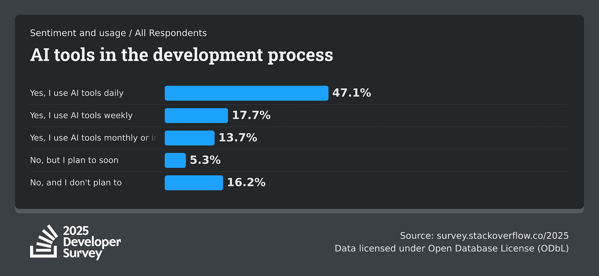](https://substackcdn.com/image/fetch/$s_!Gn_D!,f_auto,q_auto:good,fl_progressive:steep/https%3A%2F%2Fsubstack-post-media.s3.amazonaws.com%2Fpublic%2Fimages%2F38a05067-6c6f-4527-936e-8ba86bddba00_2400x1110.png)AI tools in the development process (Source: [Stack Overflow 2025 Developer Survey](https://survey.stackoverflow.co/2025))

But the trust numbers tell a different story. **Only 33% trust AI accuracy, down from 43% last year.** Just 3% report "high trust" in AI output.

Professional developers are the most skeptical; only 2.6% highly trust AI results, while 20% actively distrust them.

[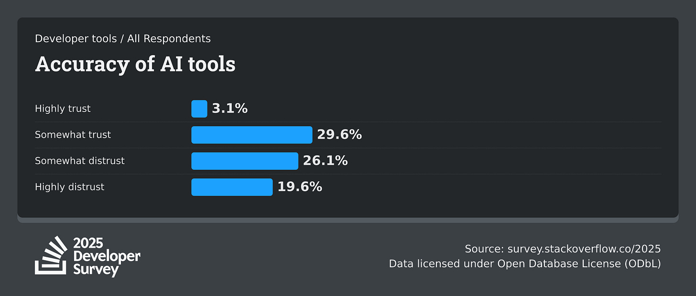](https://substackcdn.com/image/fetch/$s_!lsAq!,f_auto,q_auto:good,fl_progressive:steep/https%3A%2F%2Fsubstack-post-media.s3.amazonaws.com%2Fpublic%2Fimages%2F41a6a5ad-2e0c-4d46-9dd0-9da5d78b51fd_2400x1020.png)Accuracy of AI tools (Source: [Stack Overflow 2025 Developer Survey](https://survey.stackoverflow.co/2025))

Positive sentiment dropped from over 70% in 2023-2024 to just 60% this year.

**So, we can say that developers use AI because it's everywhere, not because they believe in it.**

### Python accelerates while JavaScript stays at the top

Python saw **a massive 7% increase from 2024 to 2025**, continuing over a decade of steady growth. This surge reflects Python's dominance in AI, data science, and backend development.

JavaScript remains the most-used language, but Python is closing the gap fast.

The shift shows how AI development is reshaping language preferences across the industry.

[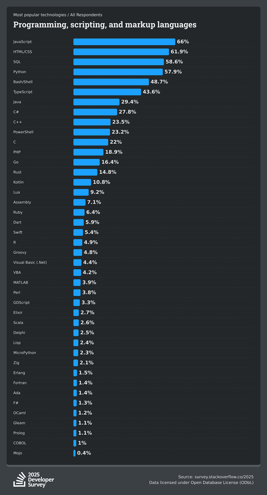](https://substackcdn.com/image/fetch/$s_!Xt3p!,f_auto,q_auto:good,fl_progressive:steep/https%3A%2F%2Fsubstack-post-media.s3.amazonaws.com%2Fpublic%2Fimages%2F66552581-2dec-4ce2-a5cd-6f09245d72b2_2400x4440.png)Programming, scripting, and markup languages (Source: [Stack Overflow 2025 Developer Survey](https://survey.stackoverflow.co/2025))

### PostgreSQL and Docker dominate infrastructure choices

PostgreSQL tops both "worked with" and "want to work with" database categories, cementing its position as the go-to choice for serious development work.

MySQL and SQLite follow, but PostgreSQL's momentum is clear.

SQLite is in 3rd place as one of the most popular embedded databases.

Oracle is used by only 10% of developers.

[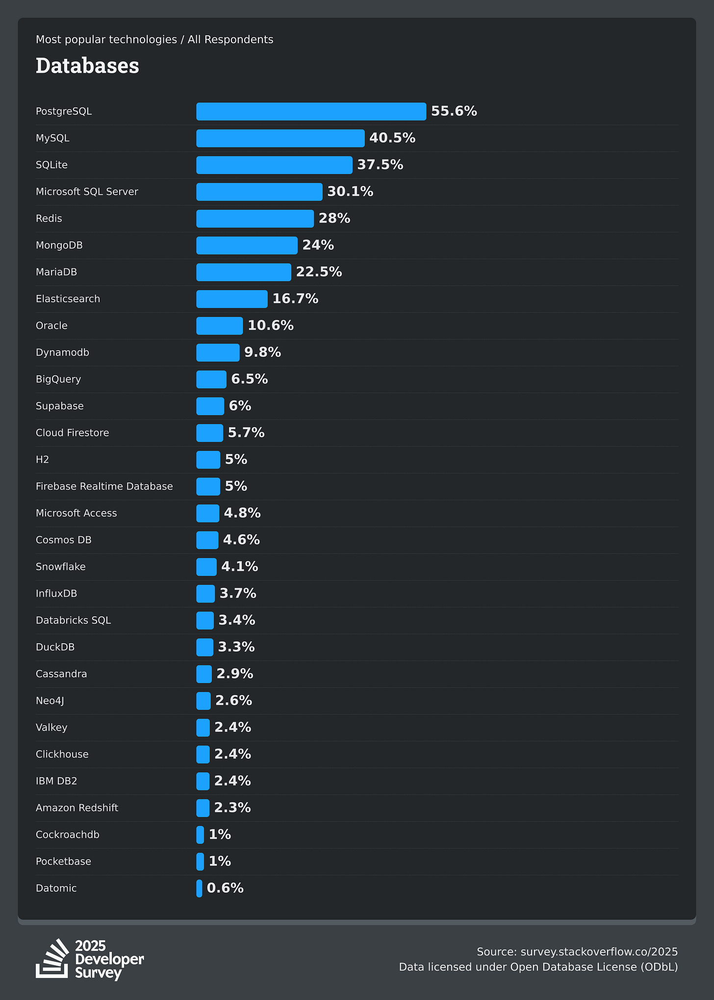](https://substackcdn.com/image/fetch/$s_!91Bp!,f_auto,q_auto:good,fl_progressive:steep/https%3A%2F%2Fsubstack-post-media.s3.amazonaws.com%2Fpublic%2Fimages%2F6c338472-b918-42f4-a0fd-f52c55c4f9ef_2400x3360.png)Databases (Source: [Stack Overflow 2025 Developer Survey](https://survey.stackoverflow.co/2025))

**Docker leads the tooling pack at 71%**, showing containerization is now standard practice. AWS, Azure, and Google Cloud remain the big-three platforms, with no significant shifts in cloud dominance.

The data shows infrastructure choices are stabilizing around proven, reliable technologies rather than chasing the latest trends.

[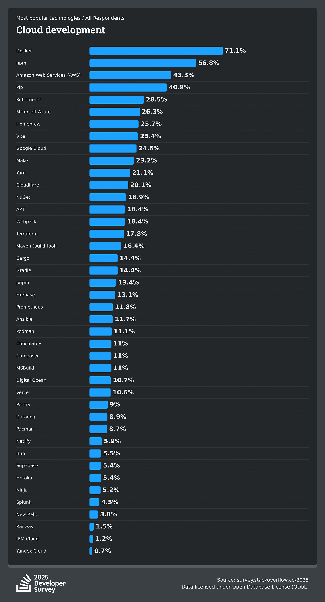](https://substackcdn.com/image/fetch/$s_!bu8k!,f_auto,q_auto:good,fl_progressive:steep/https%3A%2F%2Fsubstack-post-media.s3.amazonaws.com%2Fpublic%2Fimages%2F97cf93fe-95ca-41f3-abe2-b4f66c3f867a_2400x4440.png)Cloud Development (Source: [Stack Overflow 2025 Developer Survey](https://survey.stackoverflow.co/2025))

### AI code that is “almost right” creates a hidden productivity tax

66% of developers struggle with AI solutions that are close but miss the mark.

This creates a worse problem than broken code, as it requires plausible solutions that require significant developer intervention to become production-ready.

45% say debugging AI-generated code takes more time than writing it themselves.

**The "almost right" phenomenon disrupts workflows more than obviously broken code because developers must analyze what's wrong and how to fix it.**

We can see that AI tools promise productivity gains but create new categories of technical debt.

[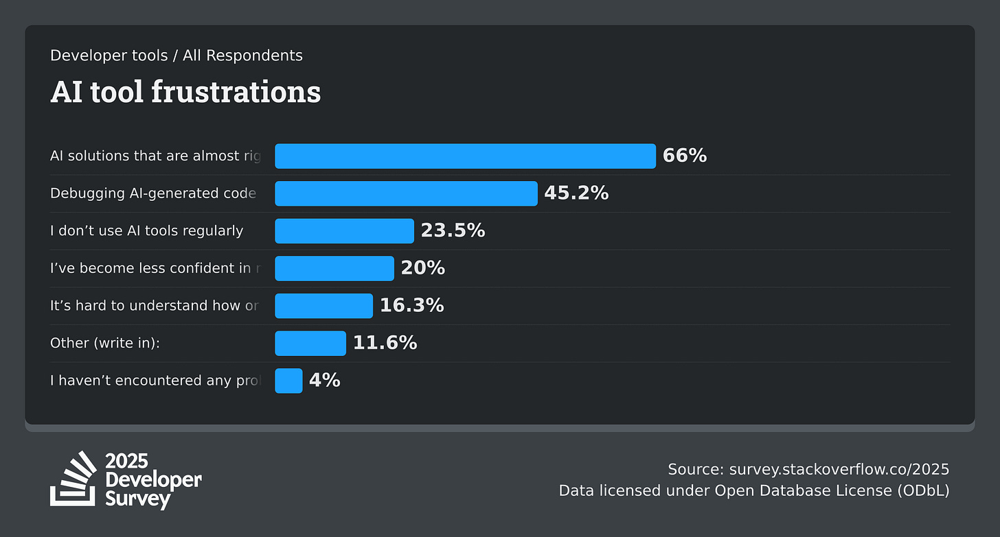](https://substackcdn.com/image/fetch/$s_!ubMx!,f_auto,q_auto:good,fl_progressive:steep/https%3A%2F%2Fsubstack-post-media.s3.amazonaws.com%2Fpublic%2Fimages%2F813f12b1-c3f3-40a5-aa88-034ce3df89a3_2400x1290.png)AI tools frustrations (Source: [Stack Overflow 2025 Developer Survey](https://survey.stackoverflow.co/2025/))

> *We could saw that recently when folks from Microsoft enabled Copilot AI agent on the .NET runtime project, creating a PR, but there seem to be [many errors and misunderstandings](https://t.co/tOOAzlBllt). Read the discussion on [Reddit](https://t.co/T7PR3AtYCP).*
> 
> [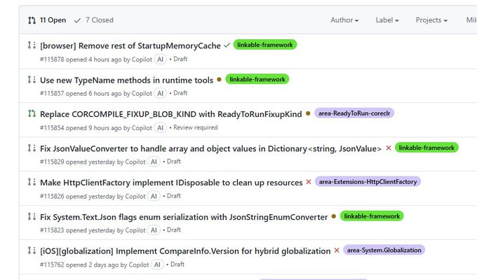](https://substackcdn.com/image/fetch/$s_!443r!,f_auto,q_auto:good,fl_progressive:steep/https%3A%2F%2Fsubstack-post-media.s3.amazonaws.com%2Fpublic%2Fimages%2Fe4af7191-098b-4aea-898c-c1d43df532d0_680x400.jpeg)

The most commonly used AI models are OpenAI with 81% and Claude Sonnet with 43%.

[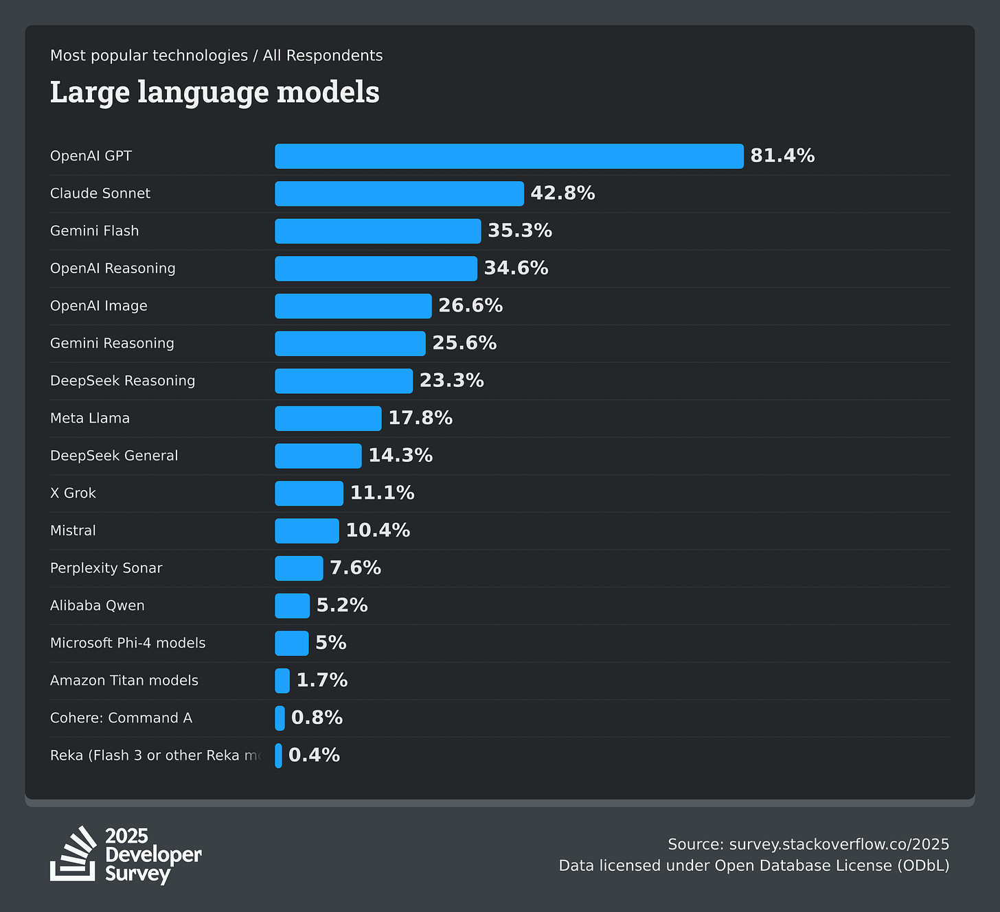](https://substackcdn.com/image/fetch/$s_!2WLY!,f_auto,q_auto:good,fl_progressive:steep/https%3A%2F%2Fsubstack-post-media.s3.amazonaws.com%2Fpublic%2Fimages%2Fff928b2e-242b-4c32-9520-90dc83f4e678_2400x2190.png)Large Language Models in use (Source: [Stack Overflow 2025 Developer Survey](https://survey.stackoverflow.co/2025/))

> ℹ️ *What we find that Claude Sonnet 4 models works better for coding in the most cases than OpenAI models currently.*

### Security and privacy concerns kill adoption faster than anything else

Privacy and security concerns rank as the top reason developers abandon technologies, followed by prohibitive pricing and better alternatives. This applies universally across all developer segments.

The data shows developers prioritize trust over features. Lack of AI features ranks dead last (9th) in reasons to reject a technology.

Security beats shiny new capabilities every time.

[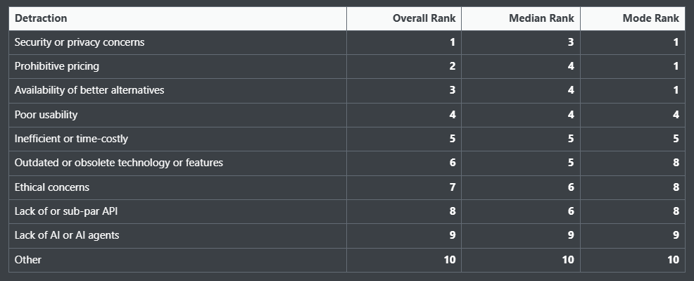](https://substackcdn.com/image/fetch/$s_!eiqc!,f_auto,q_auto:good,fl_progressive:steep/https%3A%2F%2Fsubstack-post-media.s3.amazonaws.com%2Fpublic%2Fimages%2F95ece52b-ca37-475a-8e59-73d9bd3bac8d_986x399.png)How you lose interest in tech tools (Source: [Stack Overflow 2025 Developer Survey](https://survey.stackoverflow.co/2025/))

### Developers’ happiness is barely up

**24% of developers report being happy at work**, up from 20% last year. The improvement likely stems from targeted salary increases in key roles, though pay gaps persist significantly.

[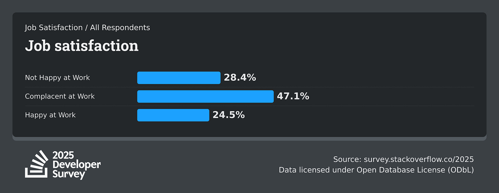](https://substackcdn.com/image/fetch/$s_!Rudh!,f_auto,q_auto:good,fl_progressive:steep/https%3A%2F%2Fsubstack-post-media.s3.amazonaws.com%2Fpublic%2Fimages%2F8165337c-ea6c-473e-a83e-d6c78e07b93f_2400x930.png)Job satisfaction (Source: [Stack Overflow 2025 Developer Survey](https://survey.stackoverflow.co/2025/))

Senior executives and engineering managers report **median salaries of $130K+**, while founders, architects, and product managers report median salaries of $92K-$104K.

**Experience matters less than title structure.**

[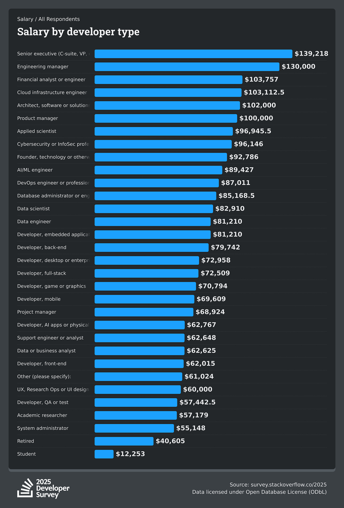](https://substackcdn.com/image/fetch/$s_!vfoc!,f_auto,q_auto:good,fl_progressive:steep/https%3A%2F%2Fsubstack-post-media.s3.amazonaws.com%2Fpublic%2Fimages%2F8d66022f-9e5a-430b-8dd8-297e95b11892_2400x3540.png)Salary by developer type (Source: [Stack Overflow 2025 Developer Survey](https://survey.stackoverflow.co/2025/))

Nearly **one-third of developers work remotely**, with 45% in the US working fully remote.

Geography still determines access to flexible work arrangements.

[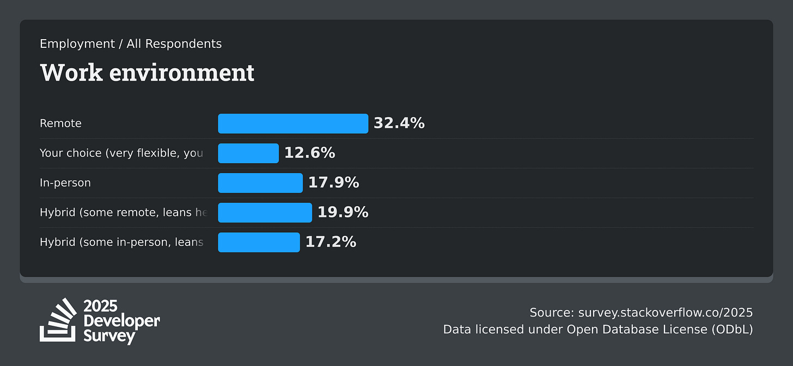](https://substackcdn.com/image/fetch/$s_!xkwb!,f_auto,q_auto:good,fl_progressive:steep/https%3A%2F%2Fsubstack-post-media.s3.amazonaws.com%2Fpublic%2Fimages%2Fed6f95a6-ad13-42f1-9918-d31b809668ec_2400x1110.png)Work environment (Source: [Stack Overflow 2025 Developer Survey](https://survey.stackoverflow.co/2025/))

## 2. Large language models (LLMs) jumped from early adopter to late majority

InfoQ’s editors mapped sixteen themes onto Moore’s adoption curve in the latest **[Software Architecture InfoQ Trends Report - April 2025](https://www.infoq.com/articles/architecture-trends-2025/)**.

Six matters most right now for architects and senior engineers:

1. **Agentic AI & Small Language Models (Innovator)**. Architects are shifting attention from monolithic LLMs to specialised, lighter models that run locally or at the edge. Bundling these models into autonomous “agents” lets teams isolate tasks and upgrade components without retraining an entire stack.
2. **Retrieval-Augmented Generation (Early Adopter).** RAG has become the default pattern for making AI output from reliable source data. Systems are now designed so that domain data can be indexed, embedded, and refreshed quickly, making contextual retrieval part of the architecture.
3. **AI-Assisted Development (Early Majority)**. Coding assistants have overtaken traditional low-code tools. They boost delivery speed, but raise new concerns: prompt quality, API misuse, and code consistency. Architects must embed guidelines and automated checks so AI-generated contributions meet existing standards.
4. **Green Software (Innovator)**. Efficiency ≠ sustainability. Cost reduction alone no longer satisfies sustainability goals. Teams track where and when workloads run, aiming to shift computing to regions and times that favor renewable energy.
5. **Privacy Engineering (Innovator)**. Privacy is a central concern in the design process. Before any model or service ships, architects ask what data travels over the wire, how long it is kept, and whether it could feed future models.
6. **Socio-Technical Architecture (Early Adopter)**. Complex systems must reflect the people who build and run them. Teams adopt lightweight decision records (ADRs), decentralised ownership, and internal platforms that remove architects as bottlenecks. The result is faster, context-aware decisions and architectures that evolve properly.

[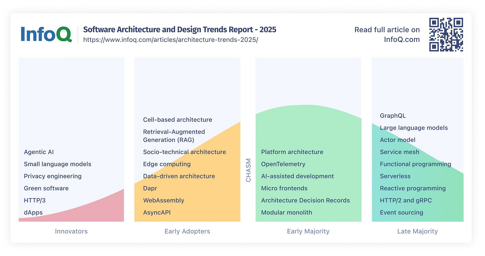](https://substackcdn.com/image/fetch/$s_!rO6u!,f_auto,q_auto:good,fl_progressive:steep/https%3A%2F%2Fsubstack-post-media.s3.amazonaws.com%2Fpublic%2Fimages%2F86b82412-1af3-477a-8bcf-11826cacbdef_2400x1270.jpeg)InfoQ Software Architecture and Design Trends Report - 2025

## 3. GenAI shapes today's software development

ThoughtWorks has just released **[Volume 32 of its Technology Radar](https://www.thoughtworks.com/en-th/about-us/news/2025/thoughtworks-technology-radar-highlights-genai-s-impact-and-key-)**, which provides insights into emerging technology trends, techniques, and tools.

What stands out in this latest report:

### Supervised agents in coding assistants

Coding assistants now go beyond generating snippets, allowing developers to drive implementation directly from AI chat interfaces. Tools like Cursor, Cline, and Windsurf enable developers to modify code, execute commands, and fix errors, all from within their IDE.

While promising, caution is advised to avoid complacency with AI-generated code.

**Human oversight remains essential despite impressive results.**

### Evolving observability

Observability practices are adapting to the complexity of distributed systems. We're seeing dedicated tools for LLM monitoring (Weights & Biases Weave, Arize Phoenix, Helicone), AI-assisted observability, and the growing adoption of OpenTelemetry.

Primary tools like Alloy, Tempo, and Loki now support **OpenTelemetry**, creating a more standardized landscape for monitoring complex systems.

### R in RAG

The retrieval component of Retrieval-Augmented Generation (RAG) is growing rapidly.

New approaches include corrective **RAG, Fusion-RAG, Self-RAG, and FastGraphRAG.**

These innovations improve how LLMs access and leverage relevant information.

## Taming the data frontier

The focus has shifted from the volume of big data to effectively managing rich, complex data.**Data product thinking is emerging as a framework** for applying product management principles to analytics.

This approach is crucial for organizations that leverage unstructured data for AI applications and analytics.

In more detail:

**Techniques:**

- ✅ **Adopt**: Data product thinking, Fuzz testing, Software Bill of Materials, Threat modeling
- 🧪 **Trial**: API request collection as API product artifact, Architecture advice process, GraphRAG, Model distillation
- 🔍 **Assess**: AI-friendly code design, AI-powered UI testing, Structured output from LLMs
- 🛑 **Hold**: AI-accelerated shadow IT, Complacency with AI-generated code, Replacing pair programming with AI

**Platforms**:

- ✅ **Adopt**: GitLab CI/CD, Trino
- 🧪 **Trial**: ABsmartly, Dapr, Grafana Alloy, Grafana Loki, Grafana Tempo, Railway
- 🔍 **Assess**: Arize Phoenix, Graphiti, Helicone, Humanloop, Reasoning models, Supabase

**Tools:**

- ✅ **Adopt**: Renovate, uv, Vite
- 🧪 **Trial**: Claude Sonnet, Cline, Cursor, D2, Metabase, NeMo Guardrails, Software engineering agents
- 🔍 **Assess**: AnythingLLM, Gemma Scope, Jujutsu, OpenRouter, System Initiative, Windsurf, YOLO

**Languages and Frameworks**:

- ✅ **Adopt**: OpenTelemetry, React Hook Form
- 🧪 **Trial**: Effect, Hasura GraphQL engine, LangGraph, MarkItDown, Module Federation, Prisma ORM
- 🔍 **Assess**: .NET Aspire, Browser Use, CrewAI, FastGraphRAG, Gleam, PydanticA
- 🛑 **Hold**: Node overload

[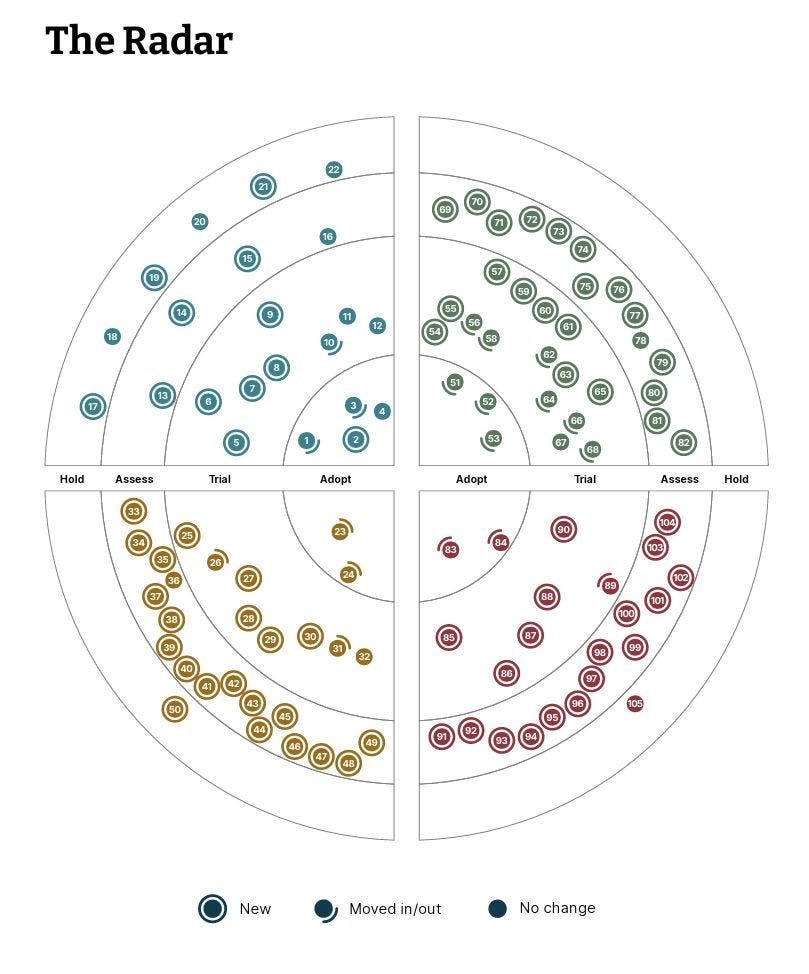](https://substackcdn.com/image/fetch/$s_!VnBO!,f_auto,q_auto:good,fl_progressive:steep/https%3A%2F%2Fsubstack-post-media.s3.amazonaws.com%2Fpublic%2Fimages%2F6cf9ad00-be0c-46af-9e9c-7bdbad141d7f_809x974.jpeg)The Thoughtworks Technology Radar, [Volume 32](https://www.thoughtworks.com/en-th/about-us/news/2025/thoughtworks-technology-radar-highlights-genai-s-impact-and-key-)

## 4. How are people really using Gen AI in 2025?

When we talk about the latest AI adoption, in [the latest HBR article](https://hbr.org/2025/04/how-people-are-really-using-gen-ai-in-2025), we can see that we have moved from primarily technical applications to emotional ones.

**The top use case for** **gen AI in 2025 is therapy/companionship**, with "organizing my life" and "finding purpose" rounding out the top three. This marks a significant shift toward using AI for self-actualization beyond just coding.

Here are the key takeaways from the research:

1. **Therapy/companionship has become the No. 1 use case**, replacing technical applications. This is primarily visible in China.
2. **Personal and professional support represents 31% of all use cases**.
3. **Users are developing better prompting skills** and more skepticism about AI ethics.
4. **Companies are deploying specialized AI agents** across their workforce.

[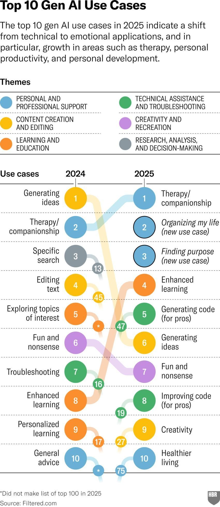](https://substackcdn.com/image/fetch/$s_!-2WP!,f_auto,q_auto:good,fl_progressive:steep/https%3A%2F%2Fsubstack-post-media.s3.amazonaws.com%2Fpublic%2Fimages%2F5cb2c0d0-847b-4faa-a2ba-f3f5291f5f2d_850x1957.jpeg)Top 10 Gen AI Use Cases (source: [HBR](https://hbr.org/2025/04/how-people-are-really-using-gen-ai-in-2025))

This shift reveals something interesting about human nature. When given powerful technology, we ultimately use it to meet our deepest needs: connection, meaning, and self-improvement.

While we should **remain cautious about AI replacing genuine human interaction**, I'm encouraged by how people find creative ways to use these tools for personal growth.

> ➡️ *One interesting prompt you can try for finding your purpose, if you use the paid version, is: "What are things you think I'm not aware of about myself?".*

## 5. **Which jobs will be affected by AI**

Microsoft just released [a study](https://arxiv.org/pdf/2507.07935) showing the 40 jobs most affected by AI and the 40 least affected.

They analyzed 200,000 real-world interactions with Bing Copilot AI to identify which occupations AI already affects today, not tomorrow’s predictions.

**Where AI is already making an impact:**

- Language and communication roles (translators, writers, editors)
- Information-focused jobs (sales reps, customer support, PR)
- Knowledge-intensive tasks (data analysts, historians, political scientists)

[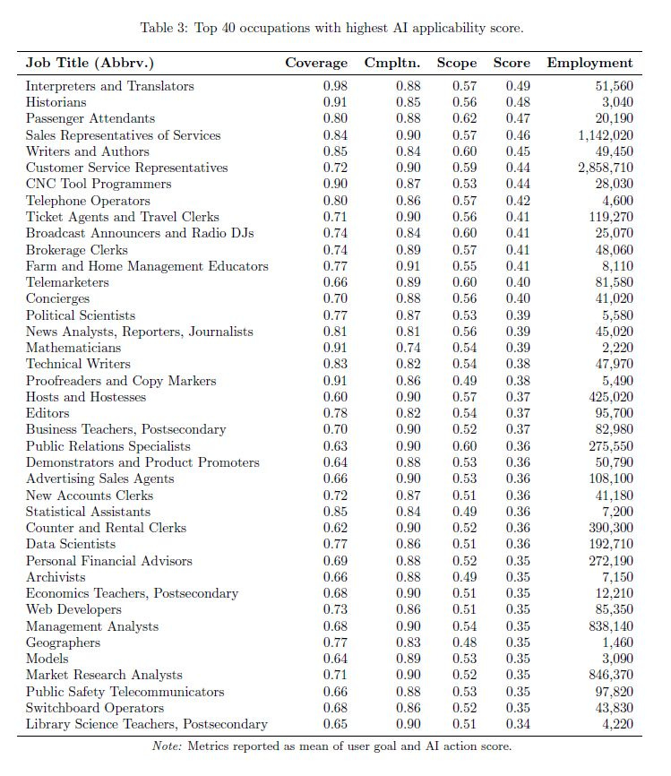](https://substackcdn.com/image/fetch/$s_!GATu!,f_auto,q_auto:good,fl_progressive:steep/https%3A%2F%2Fsubstack-post-media.s3.amazonaws.com%2Fpublic%2Fimages%2Ff2a67122-7e9a-4e79-9bc6-e1e3d3fecd91_749x866.jpeg)Top 40 occupations with the highest AI applicability score

**Jobs AI isn’t reaching yet:**

- Physically demanding roles (construction, plant operators)
- Hands-on health workers (phlebotomists, nursing assistants)
- Manual labor (roofers, dishwashers)

[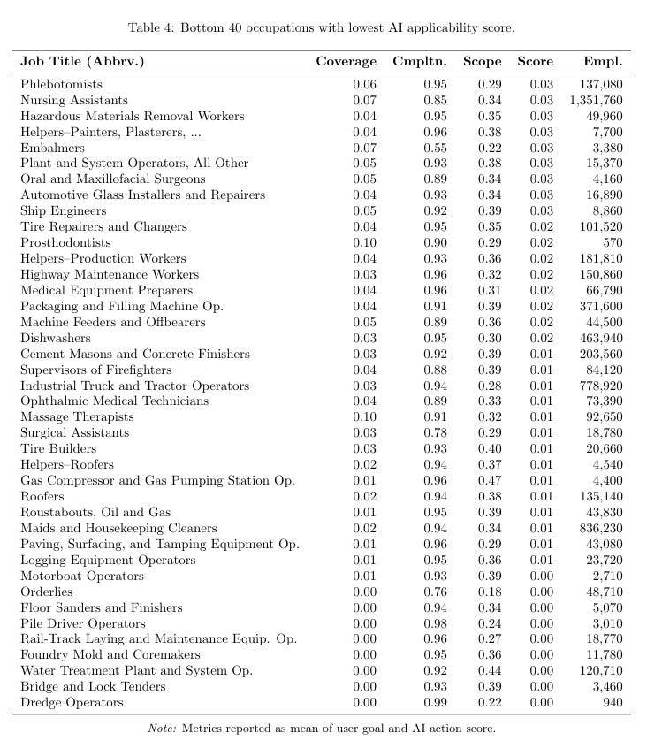](https://substackcdn.com/image/fetch/$s_!lw_c!,f_auto,q_auto:good,fl_progressive:steep/https%3A%2F%2Fsubstack-post-media.s3.amazonaws.com%2Fpublic%2Fimages%2Fc393d127-8aba-4ab4-9a56-62d442e999d7_749x855.png)Bottom 40 occupations with the lowest AI applicability score

AI is strongest at tasks involving writing, information gathering, and communication.

But it's weaker at handling real-world physical tasks. As the godfather of AI, Geoffrey Hinton recently said, a plumber will be the best job that AI will not replace.

AI augments far more than it fully automates.

This is not about complete job loss. However, it demonstrates how activities are already shifting quietly, and if your career relies on language, the transition has already begun.

---

## **More ways I can help you:**

- [📚](https://www.patreon.com/techworld_with_milan/shop/ultimate-net-bundle-for-2025-1519389?utm_medium=clipboard_copy&utm_source=copyLink&utm_campaign=productshare_creator&utm_content=join_link)**[The Ultimate .NET Bundle 2025](https://www.patreon.com/techworld_with_milan/shop/ultimate-net-bundle-for-2025-1519389?utm_medium=clipboard_copy&utm_source=copyLink&utm_campaign=productshare_creator&utm_content=join_link)** 🆕. 500+ pages distilled from 30 real projects show you how to own modern C#, ASP.NET Core, patterns, and the whole .NET ecosystem. You also get 200+ interview Q&As, a C# cheat sheet, and bonus guides on middleware and best practices to improve your career and land new .NET roles. **[Join 1,000+ engineers](https://www.patreon.com/techworld_with_milan/shop/ultimate-net-bundle-for-2025-1519389?utm_medium=clipboard_copy&utm_source=copyLink&utm_campaign=productshare_creator&utm_content=join_link)**.
- [📦](https://www.patreon.com/techworld_with_milan/shop/premium-resume-package-1721454?utm_medium=clipboard_copy&utm_source=copyLink&utm_campaign=productshare_creator&utm_content=join_link)**[Premium Resume Package](https://www.patreon.com/techworld_with_milan/shop/premium-resume-package-1721454?utm_medium=clipboard_copy&utm_source=copyLink&utm_campaign=productshare_creator&utm_content=join_link) 🆕**. Built from over 300 interviews, this system enables you to craft a clear, job-ready resume quickly and efficiently. You get ATS-friendly templates (summary, project-based, and more), a cover letter, AI prompts, and bonus guides on writing resumes and prepping LinkedIn. **[Join 500+ people](https://www.patreon.com/techworld_with_milan/shop/premium-resume-package-1721454?utm_medium=clipboard_copy&utm_source=copyLink&utm_campaign=productshare_creator&utm_content=join_link)**.
- [📄](https://www.patreon.com/techworld_with_milan/shop/complete-tech-resume-reality-check-311008?utm_medium=clipboard_copy&utm_source=copyLink&utm_campaign=productshare_creator&utm_content=join_link)**[Resume Reality Check](https://www.patreon.com/techworld_with_milan/shop/complete-tech-resume-reality-check-311008?utm_medium=clipboard_copy&utm_source=copyLink&utm_campaign=productshare_creator&utm_content=join_link)**. Get a CTO-level teardown of your CV and LinkedIn profile. I flag what stands out, fix what drags, and show you how hiring managers judge you in 30 seconds. **[Join 100+ people](https://www.patreon.com/techworld_with_milan/shop/complete-tech-resume-reality-check-311008?utm_medium=clipboard_copy&utm_source=copyLink&utm_campaign=productshare_creator&utm_content=join_link)**.
- [📢](https://www.patreon.com/techworld_with_milan/shop/short-linkedin-content-creator-311232?utm_medium=clipboard_copy&utm_source=copyLink&utm_campaign=productshare_creator&utm_content=join_link)**[LinkedIn Content Creator Masterclass](https://www.patreon.com/techworld_with_milan/shop/short-linkedin-content-creator-311232?utm_medium=clipboard_copy&utm_source=copyLink&utm_campaign=productshare_creator&utm_content=join_link)**. I share the system that grew my tech following to over 100,000 in 6 months (now over 255,000), covering audience targeting, algorithm triggers, and a repeatable writing framework. Leave with a 90-day content plan that turns expertise into daily growth. **[Join 1,000+ creators](https://www.patreon.com/techworld_with_milan/shop/short-linkedin-content-creator-311232?utm_medium=clipboard_copy&utm_source=copyLink&utm_campaign=productshare_creator&utm_content=join_link)**.
- [✨](https://www.patreon.com/c/techworld_with_milan)**[Join My Patreon](https://www.patreon.com/c/techworld_with_milan)**[https://www.patreon.com/c/techworld_with_milan](https://www.patreon.com/c/techworld_with_milan)**[Community](https://www.patreon.com/c/techworld_with_milan) and [My Shop](https://www.patreon.com/c/techworld_with_milan/shop)**. Unlock every book, template, and future drop, plus early access, behind-the-scenes notes, and priority requests. Your support enables me to continue writing in-depth articles at no cost. **[Join 2,000+ insiders](https://www.patreon.com/c/techworld_with_milan)**.
- [🤝](https://newsletter.techworld-with-milan.com/p/coaching-services)**[1:1 Coaching](https://newsletter.techworld-with-milan.com/p/coaching-services)** – Book a focused session to crush your biggest engineering or leadership roadblock. I’ll map next steps, share battle-tested playbooks, and hold you accountable. **[Join 100+ coachees](https://newsletter.techworld-with-milan.com/p/coaching-services)**.

---

## **Want to advertise in Tech World With Milan? 📰**

If your company is interested in reaching an audience of founders, executives, and decision-makers, you may want to **[consider advertising with us](https://newsletter.techworld-with-milan.com/p/sponsorship-of-tech-world-with-milan)**.

---

## **Love Tech World With Milan Newsletter? Tell your friends and get rewards.**

Share it with your friends by using the button below to get benefits (my books and resources).

[Share Tech World With Milan Newsletter](https://newsletter.techworld-with-milan.com/?utm_source=substack&utm_medium=email&utm_content=share&action=share)

[Track your referrals here](https://newsletter.techworld-with-milan.com/leaderboard).