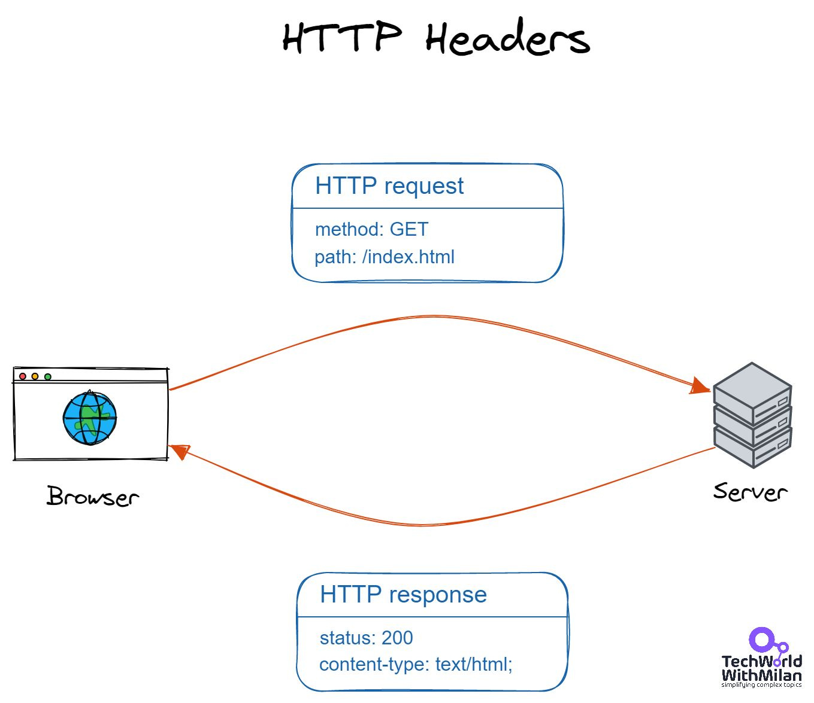
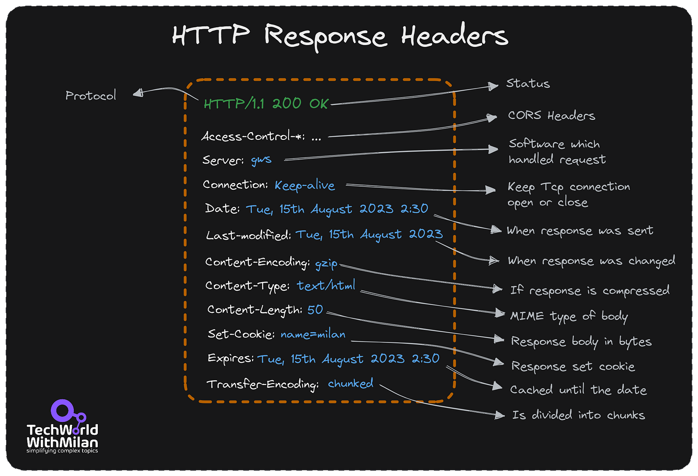
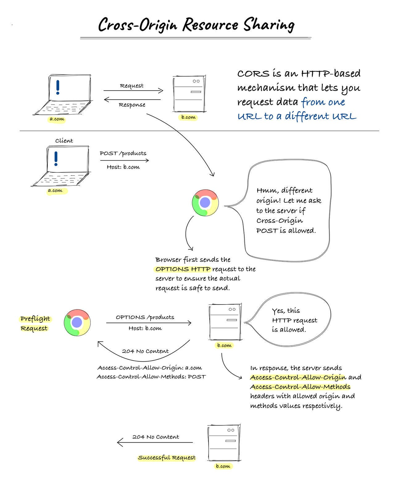
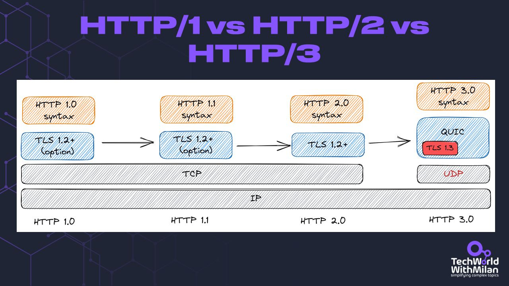

# Understanding REST Headers

This week’s issue brings to you the following:

- **Understanding REST Headers**
- **What is Cross-Origin Resource Sharing (CORS)?**
- **What are the differences between HTTP/1, HTTP/2 and HTTP/3 protocols**

So, let’s dive in.

---

## **Understanding REST Headers**

The Hypertext Transfer Protocol (HTTP) header is a component of HTTP and transmits extra data during HTTP requests and responses. The server uses the HTTP header and the browser to share metadata about the document and the data sent to the browser by the web server called the website.

There is a variety of data in the REST headers that can be used to trace problems as they arise. As they show the meta-data related to the API request and response, HTTP Headers play a significant role in the API request and response. Headers contain data for:

1. **Request and Response Body**
2. **Request Authorization**
3. **Response Caching**
4. **Response Cookies**

Also, to the categories mentioned above, HTTP headers contain information about different HTTP connection types, proxies, etc. Most headers maintain connections between clients, servers, and proxies; thus, testing is unnecessary.

HTTP Headers

In general, we have **request and response headers**. We set a request header when sending a request to an API and get some headers with a response. The standard header structure is named **name:value**, but it can have many values separated using a comma.

Some **standard headers** are:

- **Authorization**: which contains the client's authentication information for the requested resource.
- **Accept-Charset**: This header instructs the server which character sets the client accepts and is charged with the request.
- **Content-Type**: This field specifies the response's media type (text/html or text/JSON), which will aid the client in processing the response’s body.
- **Cache-Control**: The client may keep and reuse a cached response for the duration specified by the Cache-Control header. The server sets this policy for this response.

HTTP Response Headers

> *You can check the [docs](https://developer.mozilla.org/en-US/docs/Web/HTTP/Headers) and [HTTP protocol specs](https://developer.mozilla.org/en-US/docs/Web/HTTP/Overview) to learn more about HTTP headers.*

---

## What is Cross-Origin Resource Sharing (CORS)?

Browsers use CORS to prevent websites from requesting data from different URLs. A browser request includes an origin header in the request message. The browser allows the request if it gets to the server of the exact origin; if not, it blocks it.

We can deal with CORS issues on the backend. Cross-origin requests require that the values for origin and **Access-Control-Allow-Origin** in the response headers match, and the server sets it. When you add an origin to the backend code, the CORS middleware only permits this URL to communicate with other origins and be utilized for cross-origin resource requests.

There are two ways to fix CORS issues:

1. **Configure the backend to Allow CORS.**

A server can allow all domains with **Access-Control-Allow-Origin: ***. This turns off the same-origin policy, which is not recommended. Another option would be to allow only a particular domain, e.g., **Access-Control-Allow-Origin: https://somedomain.com**.
2. **Use a Proxy Server**

We can use a proxy server to call external APIs. It acts as middleware between the client and the server. If a server doesn't return the proper headers defined by CORS, we can add them to the proxy.

CORS (Image credits: RapidAPI)

---

## The differences between HTTP/1, HTTP/2 and HTTP/3 protocols

HTTP (the Hypertext Transfer Protocol) is an application protocol used for communicating over the World Wide Web since its introduction in 1989. The first stable version of **HTTP/1.1** was released in 1997 by the IETF. Since then, it has become the de facto norm for online communication. HTTP utilizes a few simple methods to send and receive information between computers. The two most common methods are GET and POST.

Yet, the Internet has changed a lot since 1997. and it demands more from **HTTP/1.1.** We now have rich websites, HD videos, etc. And we want all pages to load quickly, have better security, etc. HTTP/1 protocol had many issues, such as HOL problems, long HTTP headers, opening many TCP connections for more resources, etc. All this asked for a revision of this protocol, and IETF was published in 2015. a new version, called **HTTP/2**, which is the current version.

**HTTP/2**introduces header field compression and permits many concurrent exchanges on the same connection, allowing for more effective use of network resources and decreased latency. It employs effective coding for HTTP header data and permits the interleaving of request and response messages over the same connection. Additionally, it enables request prioritization, enabling more crucial recommendations to finish faster and enhancing performance.

As a result, fewer TCP connections can be used than with HTTP/1.x, making the resulting protocol more network-friendly. This results in longer-lasting connections and reduced competition with other flows, which improves the use of the network's capacity. Finally, **HTTP/2** **supports binary message framing**, allowing more effective message processing.

However, there were some issues with **HTTP/2**, such as TCP head-of-line blocking. Other notable problems with **HTTP/2** include the Stream Reuse Attack and the Security Risk of **HTTP/2** Flow Control.

The updated HTTP protocol, **HTTP/3**, was introduced in August 2020 and is based on the QUIC network protocol. This new version of HTTP was introduced to enhance **HTTP/2** by sending encrypted data over UDP and seeks to make many significant advancements. **HTTP/3** isn't meant to replace HTTP/2 completely; rather, it's intended to improve speeds when utilized in specific circumstances. **HTTP/2** can always be used as a backup if **HTTP/3** isn't available.

HTTP/1 vs HTTP/2 vs HTTP/3 protocols

---

Thanks for reading Tech World With Milan Newsletter! Subscribe for free to receive new posts and support my work.