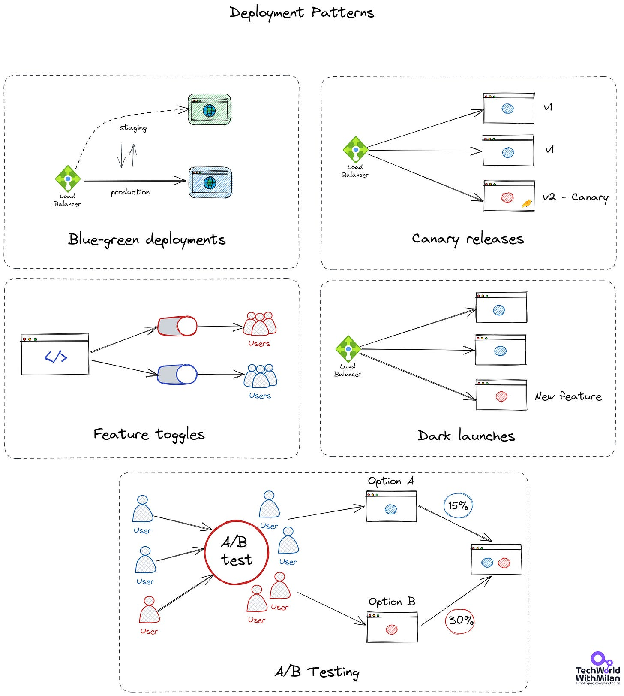
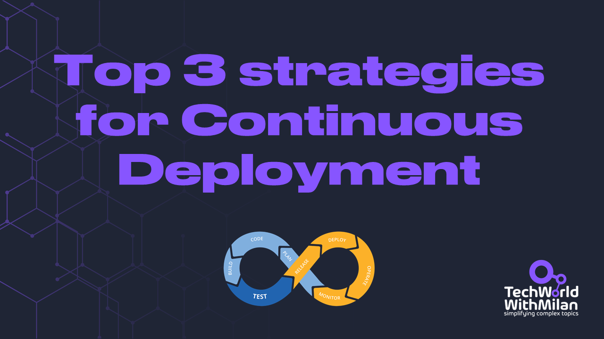

# What Are Deployment Patterns?

Deployment patterns are automated methods of introducing new application features to your users. Your ability to cut downtime depends on the deployment style you use. Some patterns also let you roll out extra functionality. Doing this allows you to test new features with a small group of users before making them available to everyone.

We have different options for deployment patterns:

1. **Canary releases**

A canary release is a method of spotting possible issues before they affect all consumers. Before making a new feature available to everyone, the plan is only to show it to a select group of users. We monitor what transpires after the feature is available in a canary release. If there are issues with the release, we fix them. We transfer the canary release to the actual production environment once its stability has been established.

Canary releases represent one of the main enablers of continuous deployments.
2. **Blue/green deployments**

Here we have run two similar environments simultaneously, lowering risk and downtime. These surroundings are referred to be blue and green. Only one of the environments is active at any given moment. A router or load balancer that aids in traffic control is used in a blue-green implementation. The blue/green deployment also provides a quick means of performing a rollback. We switch the router back to the blue environment if anything goes wrong in the green environment.

Another variant of blue/green deployments is **red/black deployments**. The red version is live in production. We deploy the black version to one or more servers. When a Black version is operational, you switch the router to move all traffic to it. If there is an error, you revert it. What is the difference with blue/green deployments is while in blue/green deployments, both versions may be getting requests at the same time temporarily, in red/black, only one of the versions is getting traffic at any time.

Red/black deployments is a newer term than blue/green, used by different companies nowadays, and could be used as a synonym.
3. **Feature toggles**

Here we can turn a switch on/off with feature toggles at runtime. We may roll out new software without exposing our users to any other brand-new or modified functionality. When we build new functionality, we can use feature toggles to enable continuous deployments by splitting releases from deployments.
4. **A/B testing**

Two versions of an app are compared using A/B testing to see which one performs better. An experiment is like A/B testing. In A/B testing, we randomly present users with two or more page versions. Then, we use statistical analysis to determine which variant is more effective in achieving our objectives.
5. **Dark launches**

In a "dark launch," we introduce a new feature to a select group of users rather than the general public. These users must be aware that they are helping us test the functionality. We need to point out the new functionality to them. It is nicknamed a "dark launch" for this reason. Users are introduced to the program to get feedback and test its effectiveness.

Deployment Patterns

# Top 3 Most Important Strategies For Continuous Deployment

During software development, one of our main goals is that have working software at the end of each cycle (as noted in the [Agile Manifesto](https://agilemanifesto.org/)). In traditional software development, we usually do this around releases. We implement some features, test them and release them in some cadence. But, this is not optimal, as we want to push our features more frequently to users. This also enables us to make more minor releases, making it easier to test and faster to develop.

While Continuous Integration means that developers can merge their code changes to the same branch or repository, Continues Deployment means more maturity. It automates the release of a production-ready code to production automatically.

As we know, this could be a cumbersome process. To achieve this, we need to separate between deployments and releases.

For this, we can use the following strategies:

1. **Feature Flags**

Feature flags or toggles turn on or off some functions in the code without deploying a new code. It is a form of an if statement that checks whether this feature is enabled. They allow us to gradually roll out new functionality to our users and allow developers to work on short-lived branches.

An example of a feature flag.

`if (featureFlags.IsEnabled("show-this-touser", ourUser)) {`

`    // this should be shown to the user`

`}`

Here we should remember to remove feature flags after go-live; we know that a feature is stable enough.
2. **Blue/Green Deployments**

We can use this kind of deployment to deploy our new version of an application to one environment but not to another, where some subset of users can test it. To implement blue/green deployments, we can use Load balancers to switch between these environments. After testing, we can reroute all our users to only one environment.
3. **Use Permission Systems**

In this option, we can select one group of users with permission to access a new feature to test it by assigning permission to a feature(s). After testing is done, we can add that feature to all users.

If we want to enable Continuous Deployment, we need to rely heavily on well-designed **test automation**, which allows us to be positive that our deployed code is working correctly.

Some popular **[CI/CD tools](https://github.com/milanm/DevOps-Roadmap)** are Jenkins, Azure DevOps, CircleCI, GitLab, etc.

To learn more about it, check the book **[Continuous Delivery: Reliable Software Releases through Build, Test, and Deployment Automation](https://amzn.to/3qW7nys)** by Jez Humble and David Farley.

Strategies for Continuous Deployment

---

## More ways I can help you

1. **[Patreon Community](https://www.patreon.com/techworld_with_milan)**: Join my community of engineers, managers, and software architects. You will get exclusive benefits, including all of my books and templates (worth 100$), early access to my content, insider news, helpful resources and tools, priority support, and the possibility to influence my work.
2. **[Sponsoring this newsletter will promote you to 33,000+ subscribers](https://newsletter.techworld-with-milan.com/p/sponsorship-of-tech-world-with-milan)**. It puts you in front of an audience of many engineering leaders and senior engineers who influence tech decisions and purchases.
3. **1:1 Coaching:** [Book a working session with me](https://newsletter.techworld-with-milan.com/p/coaching-services). 1:1 coaching is available for personal and organizational/team growth topics. I help you become a high-performing leader 🚀.

---

Thanks for reading Tech World With Milan Newsletter! Subscribe for free to receive new posts and support my work.