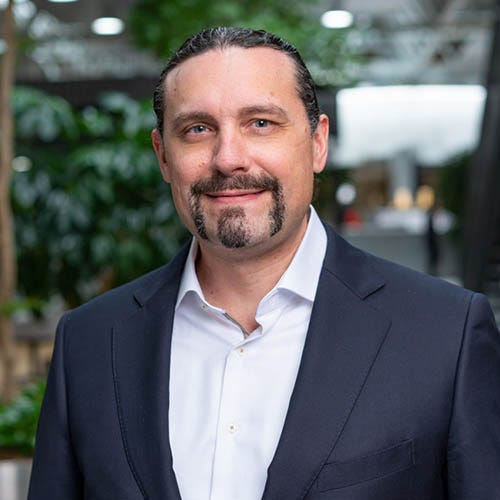
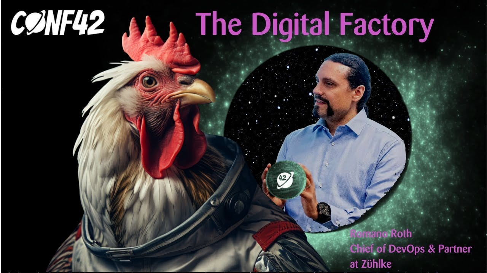
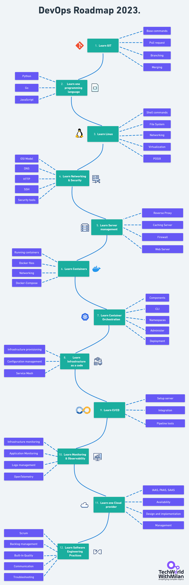

# What are Digital Factories ?

*a talk with Romano Roth, DevOps Thought Leader.*

We will discuss Digital Factories with Romano Roth, DevOps Thought Leader, in this issue.

---

## **[Postman's VS Code Extension (Sponsored)](https://marketplace.visualstudio.com/items?itemName=Postman.postman-for-vscode)**

*Postbot is now available across Postman with enhanced capabilities! The latest refresh of Postbot now offers a consistent, conversational interface available to you across your workspace. Learn how you can leverage Postbot throughout Postman to get contextual assistance.*

[Check it out!](https://blog.postman.com/meet-postbot-postmans-new-ai-assistant/)

---

So, let’s start.

## 1. Romano’s short biography

I'm [Romano Roth](https://www.linkedin.com/in/romanoroth/), Chief of DevOps and Partner at [Zühlke](https://www.zuehlke.com/en). My journey with Zuhlke began 21 years ago. Over the years, I've evolved from an expert software engineer and software architect to a consultant. Throughout this journey, one question has always fueled my passion:**How can we continuously deliver value while ensuring quality and automation?**

When the DevOps movement began to gain momentum, I was naturally drawn to it. Today, I’m one of the organizers of the monthly [DevOps Meetup in Zürich](https://www.meetup.com/de-DE/DevOps-Meetup-Zurich/) and president of [DevOps Days Zürich](https://www.devopsdays.ch/), an annual conference part of the global DevOps movement. DevOps isn't just a professional interest; it's my passion. That’s why I’ve my own [YouTube channel](https://www.youtube.com/c/RomanoRoth), where I've curated over 100 videos centered on DevOps, architecture, and leadership.

Romano Roth (credits Zühlke)

## 2. What is DevOps for you?

DevOps is a mindset, a culture, and a set of technical practices. It provides communication, integration, automation, and close cooperation among all the people needed to plan, develop, test, deploy, release, and maintain a product.

In short: **Bringing People, Process, and Technology together to continuously deliver value!**

DevOps

## 3. What are the significant challenges with DevOps?

There are multiple challenges:

**Cultural Resistance:** One of the biggest challenges is changing the organizational culture. DevOps requires shifting from traditional siloed roles to a collaborative approach with shared responsibility. This can be met with resistance from teams used to working in siloed organizations.

**Cognitive Load:** Numerous technical practices and tools exist for various stages of the DevOps lifecycle, from ideation over continuous integration over continuous deployment to release on demand. Integrating and maintaining all these technical practices and tools to develop great products can be challenging.

**Scaling DevOps**: What works for a small team or a single project might not work for an entire organization. Scaling DevOps practices while maintaining speed and reliability is a significant challenge.

Modern Software Development

## 4. Is Continuous deployment an essential part of the DevOps process?

Continuous deployment is a significant aspect of DevOps, but whether it's "essential" depends on the organization's goals and maturity. In the DevOps philosophy, **the emphasis is on automating and streamlining the software delivery process**, and continuous deployment facilitates this by automatically deploying every change that passes through the pipeline into production.

However, some organizations might opt for continuous delivery, where changes are automatically prepared for a release in the staging environment but require manual approval for deployment. The choice often depends on the business requirements, risk tolerance, and the criticality of the application. In essence, while continuous deployment exemplifies the ideals of DevOps, **it's not mandatory for all organizations to adopt this DevOps practice**.

Continuous Deployment (CD)

## 5. How can we scale DevOps?

Scaling DevOps, especially in larger organizations, requires a strategic approach beyond tools and technologies. Here are some considerations to scale DevOps effectively:

- **Cultural Transformation**: Foster a collaborative environment that values learning from failures.
- **Standardization**: Adopt consistent tools and processes across teams to maintain uniformity.
- **Automation**: Streamline operations by automating tasks from ideation over continuous integration over continuous deployment to release on demand.
- **Modular Architecture**: Utilize architecture styles like microservices to reduce interdependencies.
- **Metrics**: Use metrics to measure performance, identify bottlenecks, and drive continuous improvement.
- **Continuous Training**: Invest in ongoing skill development to ensure team members have the necessary skills to work in a DevOps environment.
- **Feedback Loops**: Establish efficient channels for feedback to identify and address issues quickly.
- **Decentralized Decision-making**: Empower teams to make decisions locally, reducing the need for top-down approvals and speeding up the development process.
- **Pilot Programs**: Test and refine DevOps practices through specific pilot projects.
- **Collaboration Platforms**: Use tools that enhance team communication like GitLab, GitHub, and Azure DevOps….
- **Regular Reviews**: Continuously assess and adjust DevOps practices as the organization grows and changes.

## 6. Is Platform Engineering the same as DevOps?

Platform Engineering and DevOps are not the same, but they are closely related and often overlap in many organizations.

**DevOps** is a mindset, a culture, and a set of technical practices. It provides communication, integration, automation, and close cooperation among all the people needed to plan, develop, test, deploy, release, and maintain a product and deliver continuous value to the customer.

**Platform engineering** is designing and building toolchains and workflows that enable self-service capabilities for product teams that deliver continuous value to the customer.

**Platform engineering** uses **DevOps** practices, which enables product teams to do DevOps.

Platform Teams

## 7. What is a Digital Factory?

Throughout my work on various projects across diverse industries and clients, I've observed that **many companies share common challenges and objectives**. I think they all want to build great products, have a faster time to market, and be more efficient. And what they want is to **build up a digital factory**.

At the top of a company, you find the board of directors and the executive board. They shape the company's vision, mission, and strategy. All big ideas are prioritized in a **portfolio kanban**. The board prioritizes these ideas and gives product management the most important and promising ideas. For example, *building drones carrying heavy weight increases the market share*. The product management takes that idea and defines what features are needed for such a drone. Such a drone, for example, needs to have modified software, bigger batteries, and better engines. They give these features down to the teams. The existing teams have started to work on those features. For the new engine, a new team needs to be established. For that, **the platform engineering team will provide a standardized continuous delivery environment** so that that team can start right away. All the parts get assembled, and the drones can now be continuously delivered to the customers.

The teams constantly monitor the drones. **Telemetry and business data are collected**, like how many drones we have sold and customer satisfaction. These metrics are fed back to the portfolio level, where this information informs the board's future decisions.

With that, the company focuses efficiently on the most critical and strategic tasks and can quickly adapt to new market needs.

The Digital Factory

## 8. How can we implement Digital Factory?

To build a digital factory, you need a holistic approach.

**Architecture:**Design architectures that align with your technology strategy, ensuring adaptability, scalability, and flexibility.

**DevOps:** Utilize Platform Engineering to design and build toolchains and workflows that enable self-service capabilities for product teams to enable them to make quality and do DevOps.

**Data:**Streamline data pipelines for timely, actionable insights. Harness data science to extract value to inform decision-making.

**Customer experience:**Place user feedback at the heart of product development. Aim for a seamless end-to-end experience.

**Agile Programme Delivery:**Adopt a multi-team organization to optimize workflows and performance. Continuous discovery, coupled with transparent reporting, drives growth.

**Product Management for Maximized Value:**Connect the strategy with the execution. Align product initiatives with the company goals. Continuously refine management practices and leverage feedback for prioritization.

Holistic Approach

## 9. What about people? What are the challenges in working with clients and developers?

In the digital age, companies face many challenges, especially those still operating under traditional waterfall-style software delivery processes. Here are, in my opinion, the most important ones:

**Cultural Hurdles:**A primary challenge lies in transforming the organizational culture. DevOps demands a transition from siloed roles to a unified, collaborative model with shared responsibility. Such a shift can face opposition from teams accustomed to siloed organizations.

**Cognitive Load on Teams:** The flood of new information, knowledge, processes, and tools can overwhelm teams, stretching their mental capacity and affecting productivity. Managing this cognitive load is crucial to ensure units can effectively adapt and maintain optimal performance.

**Trust and Psychological Safety:** Building trust within teams, especially to and from management, is pivotal for open communication and learning. Without that, organizations will not change and grow.

If you want to learn more about Digital Factories, you can check Romano’s presentation from the **[Conf42 Platform Engineering 2023](https://www.youtube.com/watch?v=UE8mSt55xHw):**

---

## Bonus: DevOps Roadmap 2023.

Check the DevOps 2023 Roadmap, which Romano and I created.

See the full roadmap, with learning resources **[in the repo](https://github.com/milanm/DevOps-Roadmap)**.

---

## More ways I can help you

1. **1:1 Coaching:** [Book a working session with me](https://newsletter.techworld-with-milan.com/p/coaching-services). 1:1 coaching is available for personal and organizational/team growth topics. I help you become a high-performing leader 🚀.
2. **[Promote yourself to 17,000+ subscribers](https://newsletter.techworld-with-milan.com/p/sponsorship-of-tech-world-with-milan)**by sponsoring this newsletter.

---

Thanks for reading Tech World With Milan Newsletter! Subscribe for free to receive new posts and support my work.