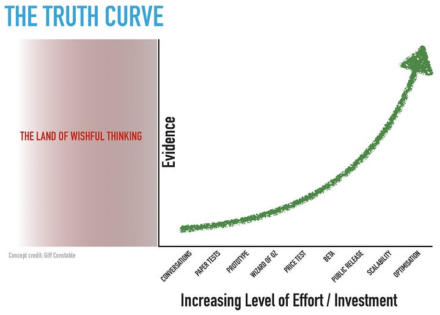

# What are Feature Factories?

*And how you can recognize if you work in one of them.*

In this issue, we talk with **[Maarten Dalmijn](https://www.dalmyn.com/)**, an expert in Product Management, Agile, and Scrum, and the thought leader for Feature Factories.

---

## 1. Introduction

Hi! I’m ***Maarten Dalmijn**,* and I help companies beat the Feature Factory worldwide as a consultant. Before advising companies, I worked at many award-winning start-ups and scale-ups in Product Management.

I write a [weekly newsletter on Product Management](https://mdalmijn.com/), Agile, and Scrum called *Maarten’s Newsletter*. I recently published a book, *[Driving Value with Sprint Goals](https://amzn.to/3EBjLI1),*****in the Mike Cohn Series of Addison-Wesley.

Maarten Dalmijn

## 2. What are Feature Factories?

**A  Feature Factory is a company that focuses on churning out as many features as possible.** And once a feature is done, they immediately move on to the next Feature. Nobody looks back to see whether the feature made an impact. This happens because people believe all features are guaranteed to deliver value; hence, the main problem is getting features out the door swiftly and reliably. **The mantra of a Feature Factory: more features are always better.** Life is great if we keep our Feature Factory humming and reliably churning out features. But is that true? Are more features always better?

> The concept is similar to [Feature creep](https://en.wikipedia.org/wiki/Feature_creep) (added by Milan).

I always say that delivering a feature is like telling a joke: it doesn’t matter unless it makes people laugh. That’s why comedians have tryouts and check which jokes produce laughs in the audience instead of trying to tell as many jokes as possible. The same logic applies to delivering features: more isn’t necessarily better.

**Delivering more features isn’t the point; it’s about how we improve the lives of our users** and enable them to do something they weren’t able to do before. Suppose we can do that with fewer features, great. That’s even better.

Every feature means you’re growing your codebase and adding more complexity, so you’ll have to maintain it and exert effort to keep it working. **Having many features will act as an anchor that slows you down** and increases the time-to-market of future features. You must ensure that the added features pull their weight and add value. Otherwise, you’re producing Feature Parasites that only cost upkeep and bring nothing to the table except trouble.

In a Feature Factory, you will constantly introduce Feature Parasites that do not add value and introduce clutter to your product.

## 3. What are some indicators that we are working in a Feature Factory?

Since the assumption is that features are guaranteed to deliver value, the main focus is getting them out of the door as quickly as possible and providing timelines. You can see this clearly by looking at the roadmap, which focuses on features and timelines. If feature delivery timelines are not met, then people get angry.

**In meetings, nobody talks about the customer**. We only talk about how the feature will work instead of how this will constantly help introduce **Feature Parasites** that do not add to customer or user progress in their lives. Nobody checks whether the feature made a difference for our customers when delivered. Because of this, features rarely get removed, and we are always adding more features, ultimately slowing product development down and making the product more difficult to adopt and use for our users.

There is **no discovery process**. When someone has an idea for a feature, we start coding and building it instead of talking to customers and figuring out their struggles and what they’re trying to achieve.

Companies that work as feature factories also need more motivation. Writing beautiful code for something that people will only use is motivating. It feels like you’re running in a hamster wheel and exerting much effort to get nowhere. Nobody likes that. People want to come to work with the feeling they will make a difference for the company and improve people’s lives.

## 4. What can we do to leave this factory?

Instead of the default conclusion of building something, we should first gather evidence. We can illustrate this by looking at the truth curve:

The Truth Curve (Credits: Giff Constable)

The more evidence we have that something will be valuable, the more effort we can invest. Imagine we have an idea for a new feature, and then we should start with quick and cheap things like talking to users, doing paper tests, or making low-fidelity prototypes. Then, as we gain more evidence and a better understanding of what they want to achieve, we start doing more expensive and slower things like coding something.

In Product Management, this is called **Discovery**: doing experiments to increase confidence that what we deliver will be valuable. As the name implies, it’s not something you can do in your head, and you have to talk or interact with users to figure out what’s going on in their minds.

**The biggest problem is your stakeholders because you have to take them on this journey.** It’s challenging to eradicate the belief that features are not guaranteed to deliver value. The best way of doing this is by discussing magnificent ideas we’ve offered in the past that did not result in the outcomes we sought. Remember, you can only do this if there is a safe environment because if it’s too political, it will immediately backfire and become a blame game.

## 5. What can we do if our product hasn’t been launched yet?

Walk the truth curve and make discoveries. Do cheap things that increase understanding and give a better picture of what your users want to achieve in the product. What can make this incredibly difficult is that a roadmap has been committed with precise timelines, so there is zero incentive to complete discovery. The focus is shifted towards the delivery of features.

Without discovery, you’re trying to go for a hole-in-one while blindfolded, which means you will often fail. And then, you will have a bloated codebase requiring massive changes to accommodate the user’s needs. In such a situation, making progress can be extremely expensive and slow.

## 6. Are feature factories only related to Scrum or not?

Feature Factories are prevalent with or without Scrum. In my experience, it mainly concerns stakeholders’ belief that features are guaranteed to deliver value. Scrum does make running a feature factory pretty easy, with a long Product Backlog of features and churning out features every two weeks.

Feature factory could look like a real factory (Credits: Unsplash)

## 7. We have seen a lot of critiques on Scrum lately; what is your view on it?

The Scrum world seems like a cultish bubble, and developers’ growing sentiment is that they must work in a certain way as the Scrum Framework dictates. The ever-increasing critique of genuine Scrum makes me incredibly sad because the primary purpose of Scrum as an incomplete framework should be to empower developers to discover better ways of working. At the moment, it seems to be mostly frustrating them.

**Scrum often disempowers developers** **by forcing them to work in a specific way** they don’t want to work in with many required meetings. To me, it’s more important that developers decide how they work than being forced to work in a specific way.

Discovering better ways of working is something we have to cultivate and cherish because Scrum is a purposefully incomplete framework. Even if you do Scrum perfectly, it’s still perfectly undone. That’s why the intent of Scrum is for the developers to discover their way of working.

We must enrich Scrum with how the Scrum Framework dictates we want to work to deliver the most value. If this doesn’t happen because we’re suffocating experimentation by forcing developers to work in a way they don’t want to, then we’re missing the point.

**If we can’t trust developers to experiment with Scrum, we can’t trust them to experiment outside of Scrum.**

---

Thanks for reading the Tech World With Milan Newsletter! Subscribe for free to receive new posts and support my work.