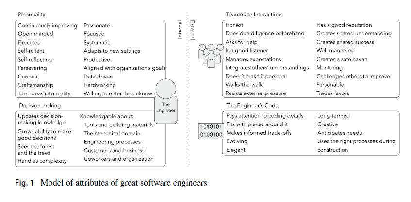
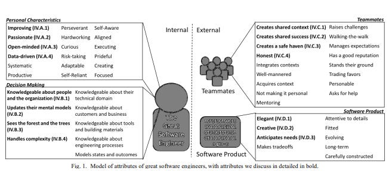

# What distinguishes great software engineers?

*What we can conclude from two research papers on this topic by Microsoft*

We all want to know the main characteristics of great software engineers and how to become one. The same question researchers from Microsoft tried to answer by analyzing their employees and internal practices in the two research papers. We will try to understand the conclusions and what we can do to become one.

So, let’s dive in.

---

In a recent research paper by Microsoft researchers [1], the authors tried to understand what distinguishes great engineers from ordinary ones. They conducted one of the most extensive studies, surveyed 1,926 engineers, architects, and technical fellows, and asked them about the importance of 54 attributes of great engineers.

They identified four groups of attributes:

- **Personalities** - here are attributes such as passion or curiosity.
- **Decision-making** - This group of attributes includes assessing the current situation, identifying alternative courses of action, and gauging probabilistic outcomes.
- **Teammate interactions** - These attributes include being reasonable, influencing others, communicating effectively, and building trust.
- **The Engineers’ code** - this group of attitudes includes those bound to the beauty of the software they produce

Model of attributes of great software engineers (Source: [1])

After the analysis, here are the top five attributes that distinguish great engineers:

1. **Being a competent coder** - Without code, there is no software, so great software engineers must be able to write good code. Such engineers pay attention to coding details and are mentally capable of handling complexity.
2. **Maximizing Current Value of Work** - Great engineers set themselves apart by considering the context of their software product and optimizing their current activities while accounting for potential future expenses and benefits. This includes considering long-term and anticipated needs and thoroughly analyzing the problem.
3. **Practicing Informed Decision-Making** - Great engineers set themselves apart by following the appropriate procedures to arrive at well-informed judgments. When they say decision-making, they mean mainly "information gathering."
4. **Enabling Others to Make Decisions Efficiently** - Great engineers set themselves apart by simplifying the tasks of others and assisting them in making decisions more effectively—or, at the very least, by preventing them from getting worse.
5. **Continuously Learning** - They discovered that the capacity to acquire new technical abilities can be just as crucial as, if not more so than, mastery of existing ones.

Regarding negative ratings, they were personal favors and hardworking. Informants think that having to work longer than eight hours a day could be a sign of inadequate planning or unsustainable software engineering techniques.

---

## What Makes a Great Software Engineer by Microsoft

In a research paper from 2015. [2][3], the same group of researchers from Microsoft and the University of Washington asked 59 experienced engineers what makes engineers and great software engineers.

They run a series of interviews, trying to figure out:

- **What do expert software engineers think are the attributes of great software engineers?**
- **Why are these attributes necessary for software engineering?**
- **How do these attributes relate to each other?**

Researchers divided the 53 qualities of a successful software engineer into two groups: internal and external. These are further divided into decision-making, personal characteristics, and impact on colleagues and software products—that is, the nature of your code.

Model of attributes of great software engineers (Source: [2][3])

### **1. Personal Characteristics**

Personal qualities pertain to one's own identity. According to interviewees, these cannot be acquired in the job. Yes, they were strengthened and enhanced, but not learned.

- **Improving**—Unsatisfied with the status quo, they constantly look to improve themselves, their product, and their surroundings.
- **Passionate** — intrinsically interested in the area they are working in (i.e., not just in it for extrinsic rewards like a paycheck).
- **Open-minded** — willing to judiciously let new information change how they think.
- **Data-driven** — taking and evaluating their actions and software measurements, often relative to expectations.

### 2. Decision making

Your decision-making style is based on your ability to integrate context, probability, and an awareness of how your choices will manifest in reality. Knowing things from books is insufficient.

- **Knowledgeable about people and the organization** - Figuring out who can help you, what they know, and who can provide the necessary context are all essential skills. This is particularly important for larger companies.
- **Sees the forest and the trees** - Considering circumstances at various abstraction levels. Technical specifics, market trends, the company's mission, and operational requirements. What effect does each have on the work you do?
- **Updates their mental models** - Keeping up-to-date their mental models through evaluating changes in their context
- **Handles complexity** - Able to grasp and reason about complex and intertwining ideas

### 3. Teammates

Software development is a team sport; thus, how you lead and collaborate with your team counts.

- **Creates shared context**—Modifying your message to fit the other person's comprehension allows you to operate from the same starting point.
- **Creates shared success** - Enabling success for everyone involved, possibly involving personal compromises.
- **Creates a haven**—a safe space where engineers can learn and improve from mistakes and situations without negative consequences.
- **Honest** - Be truthful and have integrity with your actions and words.

### 4. Software product

This part includes software engineering and how we craft code and solve problems.

- **Elegant** - Simple and intuitive.
- **Creative** - Original solutions based on knowledge of the situation, existing solutions, and their shortcomings.
- **Anticipate** **needs**—Software that operates continuously and changes its configuration with little assistance is regarded as excellent. However, it cannot be made so future-proof that it significantly hinders current speed.

From here, we can conclude that great software engineers are those who:

- **Are proficient in programming and system design**
- **Have strong problem-solving skills and creativity**
- **Are effective communicators and collaborators**
- **Understand software quality and how to achieve it**
- **Know how to work under pressure and manage time effectively**
- **Have attention to detail**
- **Knows best practices in software engineering**
- **Constantly learn new technologies**

---

## References:

[1] - Li, P.L., Ko, A.J. & Begel, A. “[What distinguishes great software engineers?](https://doi.org/10.1007/s10664-019-09773-y)” *Empir Software Eng* 25, 322–352 (2020).

[2] - Li, P.L, Ko, A.J. & Zhu, J. “[What Makes A Great Software Engineer?](https://faculty.washington.edu/ajko/papers/Li2015GreatEngineers.pdf)“, 2015 IEEE/ACM 37th IEEE International Conference on Software Engineering

[3] -  Li, P.L, Ko, A.J. & Zhu, J. “[What Makes A Great Software Engineer? The appendix](https://www.microsoft.com/en-us/research/uploads/prod/2019/03/Paul-Li-MSR-Tech-Report.pdf)”, 2015 IEEE/ACM 37th IEEE International Conference on Software Engineering

---

## More ways I can help you

1. **1:1 Coaching:** [Book a working session with me](https://newsletter.techworld-with-milan.com/p/coaching-services). 1:1 coaching is available for personal and organizational/team growth topics. I help you become a high-performing leader 🚀.
2. **[Promote yourself to 31,000+ subscribers](https://newsletter.techworld-with-milan.com/p/sponsorship-of-tech-world-with-milan)**by sponsoring this newsletter.

---

Thanks for reading Tech World With Milan Newsletter! Subscribe for free to receive new posts and support my work.