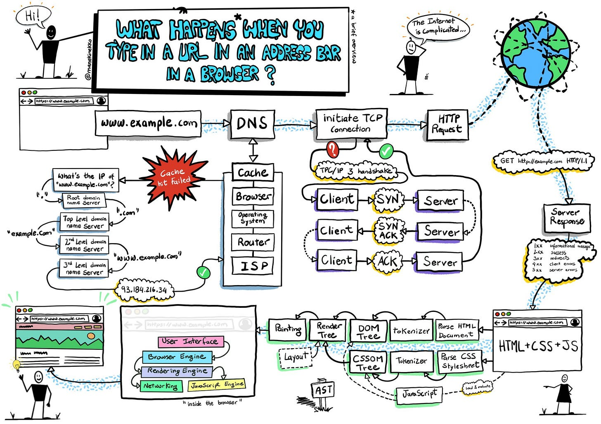
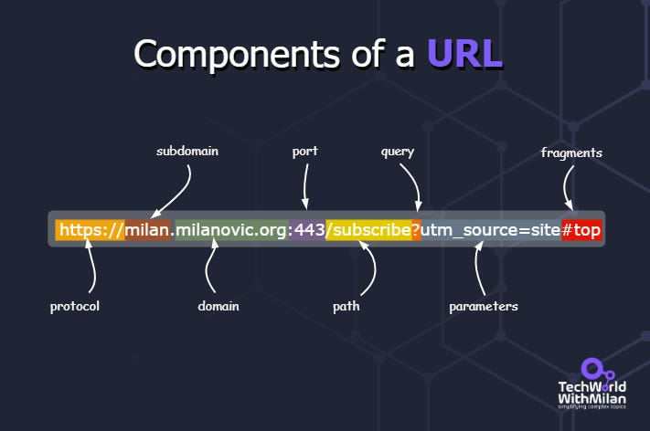
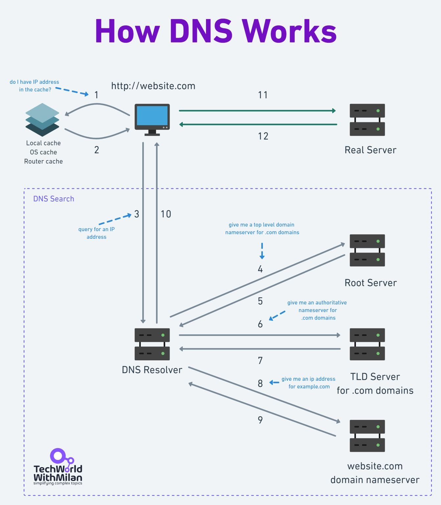

# What happens when you type a URL into your browser?

The process involves the browser, your computer’s operating system, your internet service provider, the server where you host the site, and the services running on that server.

1. **You type https://somewebsite.com/page in your browser and press Enter.**

Here, https:// is a scheme that tells the browser to connect to the server using TLS. [somewebsite.com](http://somewebsite.com/) is the site's domain name, pointing to a specific server IP address. And /page is a path to the resource you need.
2. **The browser looks up the IP address for the domain.**

After you’ve typed the URL into your browser and pressed enter, the browser needs to figure out which server on the Internet to connect to. It must look for the IP address of the server hosting the website using the domain you typed to accomplish that. DNS lookup is used to do this. Here, it determines whether we can locate it in the cache; if not, DNS must search domain name servers from the root to the third level.
3. **The browser initiates a TCP connection with the server.**

Transmission control protocol, more formally known as TCP, is used throughout the public Internet routing infrastructure to route packets from a client browser request through the router, the Internet service provider, through an Internet exchange to switch ISPs or networks, and finally to find the server with the IP address to connect to. This is an inefficient route to take to get there. Instead, many websites employ a CDN to cache static and dynamic material closer to the browser.
4. **The browser sends the HTTP request to the server.**

Now that the browser is connected to the server, it complies with the HTTP(s) protocol's requirements for communication. The browser sends an HTTP request to the server for the page's contents. The body, headers, and request line of an HTTP request are all present. The server can determine what the client wants to do using the information in the request line.
5. **The server processes the request and sends back a response.**

The server accepts the request and determines how to handle it depending on the data in the request line, headers, and body. The server receives the material at this URL for the GET /page/ HTTP/1.1 requests, builds the response, and then delivers it back to the client with an HTTP status code.
6. **The browser renders the content.**

After receiving the server's response, the browser examines the response headers for instructions on rendering the resource. The Content-Type header informs the browser that an HTML resource was received in the response body.

What happens when you type in a URL in a browser? (Credits: @manekinekko)

---

## Components of a URL

URL stands for Uniform Resource Locator. It is a reference (an address) to a resource on the internet. A URL is the most common Uniform Resource Identifier (URI) type.

A URL typically includes:

- **The protocol** (e.g., http, https)
- **Subdomain**: it comes before the domain and is optional. It's used to organize different sections of the website.
- **Domain name**: the server's location that stores the website or resource. This is used in place of the server's IP address for readability.
- **The path to the resource**, separated by a slash (/)
- **The parameters**: are used to send additional info to the server. Starts with "?" and consists of key-value pairs (?a=b).
- **Fragment/anchor**: this is optional and comes after the "#." It is used to bookmark a specific section of the resource.

Components of a URL

---

## How DNS works?

What happens when you type https://website.com into your browser and press Enter? How do we get an IP address of a web page? You should know if you're a web developer or DevOps/platform engineer.

The first thing that needs to be done is to translate this text-based domain into a machine-adapted numerical IP address. This is the role of a DNS server, and it acts as a phonebook of the Internet.

Here is what happens under the hood. Four servers deliver an IP address to the client: recursive resolvers, root nameservers, TLD nameservers, and authoritative nameservers. The steps are following:

1. **HOSTS file**

Before looking in the DNS resolver cache, the client will look into the Hosts file. Host files are text files that map domain names to IP addresses.
2. **DNS Resolver**

If the server is not found in the HOSTS file, when the users enter https://website.com into the browser, this request hits the DNS Resolver. This server interacts with other DNS servers to find the correct IP address.
3. **Root nameserver**

Now, the DNS Resolver contacts Root Servers (13 of them), which are controlled by various organizations and delegated by ICANN. They handle requests for top-level domains (TLD). If a Root server cannot find results in its records or zone files, it will find a record for the .com TLD and give the requesting entity the name server's address for .com addresses.
4. **TLD Server**

Next, the DNS Resolver queries the TLD Server, which responds with an IP address of the domain's authoritative nameserver.
5. **Authoritative nameserver**

After the query to a domain's authoritative nameserver, he will return the IP address of the origin server. In the final step, DNS Resolver passes the origin Server IP address back to the client, which the client can use to access the webpage requested in the first place.

Also, what could happen if DNS is returned from the **cache** to improve load times? DNS records can be cached in different locations. By default, modern web browsers cache DNS records for a set time. In the next step, the operating system can cache DNS records, too, then router and ISP at the end. If the IP address is not found in the cache, the search with DNS resolver begins.

How DNS Works

If you want to learn DNS **interactively**, try this:

- [https://messwithdns.net/](https://messwithdns.net/)
- [https://howdns.works/ep1/](https://howdns.works/ep1/)

https://howdns.works/

---

This week’s issue is sponsored by **[Product for Engineers](https://newsletter.posthog.com/?ref=techworld)**, **PostHog’s** *newsletter dedicated to helping engineers improve their product skills*. 

**[Subscribe for free](https://newsletter.posthog.com/?ref=techworld)** to get curated advice on building great products, lessons (and mistakes) from building **PostHog**, and research into the practices of top startups.

---

Thanks for reading Tech World With Milan Newsletter! Subscribe for free to receive new posts and support my work.