# What I learned from the book Software Engineering at Google

*And what you can apply from today.*

When I first picked up *Software Engineering at Google*, I expected another Big Tech flex, with a set of practices that only make sense if you have a billion users and 30,000 engineers. But I was wrong. The lessons in this book are universal and apply whether you’re on a team of 5 or 5,000.​ It draws on 2 decades of experience from an organization that runs **2+ billion lines of code** and changes **25 million lines per week**.

The book isn’t about programming, per se. It’s about the good engineering practices that Google has used over the years and decades to keep a healthy codebase.

In particular, it is about what happens after you write the code: how you evolve it, share it, test it, and eventually delete it.

Here’s what I learned:

- **Software Engineering ≠ Programming.** Programming is writing code. Engineering is asking what happens to that code over the next decade, and who pays the price when it breaks.
- **Hyrum’s Law and the Beyoncé Rule.** Every observable behavior of your system becomes someone’s dependency, whether you documented it or not. The fix? Test everything you care about, or don’t complain when it breaks.
- **Shift Left.** A bug caught in your editor costs seconds. The same bug in production costs your reputation. Google learned this the hard way with GWS in 2005.
- **Code Review Is Not a Bug Filter.** Most teams use it to catch bugs. Google uses it to transfer knowledge, enforce ownership, and keep a billion lines of code from turning into a mess. The mechanics are simple. The discipline behind them is not.
- **Don’t Use Mocking Frameworks.** Mocks test how something was done, not what actually happened. Google’s pendulum swung hard, and many engineers now avoid mocking frameworks entirely.
- **Small Frequent Releases.** A 3-line deploy is easy to debug, but a 50-commit mega-release is a weekend ruined. DORA research proves this isn’t just intuition.
- **Upgrade Dependencies Early and Often.** A patch bump is a coffee break. Three major versions behind is a quarter-long migration project. The math always favors staying current.
- **Measuring Productivity.** Google’s GSM framework (Goals, Signals, Metrics) prevents you from measuring what’s easy instead of what matters.
- **The Culture Chapters.** Psychological safety beats 10x developers. The genius myth is toxic. And “because I said so” is a leadership failure.
- **What Doesn’t Work, Even at Google.** Dependency management gave the authors nightmares. SemVer is an estimate, not a guarantee. And yes, the Google product graveyard is ironic.
- **Now What?** Here is a filter to decide which of these ideas actually fit your team and which don’t.

So, let’s dive in.

---

## [Your AI Writes Code Faster Than You Can Review It (Sponsored)](https://www.qodo.ai/?utm_source=dr_milan_newsletter&utm_medium=newsletter&utm_campaign=br_qodo-2026)

Code review is the bottleneck — slow, inconsistent, and noisy. Qodo is a multi-agent *AI code review platform built to surface real issues, not noise. Specialized agents reason with the full codebase and PR history context. Benchmarked #1 in precision and recall. Now with rules that auto-discover your standards, enforce them in every PR, and measure adoption.*

[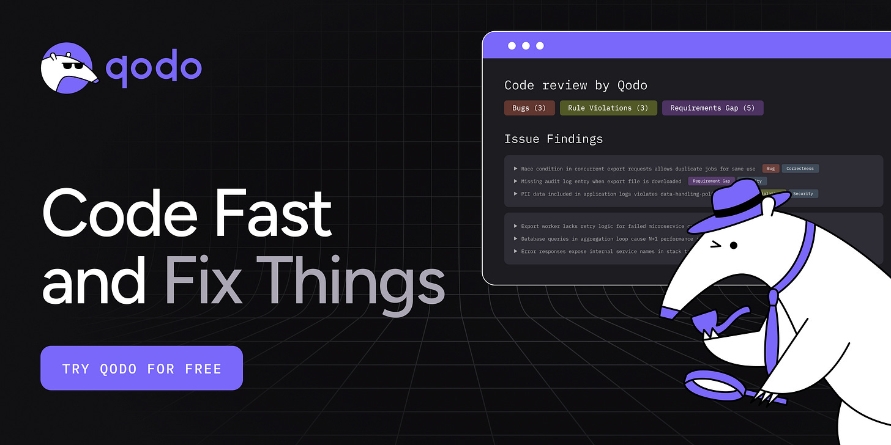](https://www.qodo.ai/?utm_source=dr_milan_newsletter&utm_medium=newsletter&utm_campaign=br_qodo-2026)

[Try Qodo free](https://www.qodo.ai/?utm_source=dr_milan_newsletter&utm_medium=newsletter&utm_campaign=br_qodo-2026)

---

## 1. **Software Engineering ≠ Programming**

This is the core message of the entire book. Titus Winters described it in [Chapter 1](https://abseil.io/resources/swe-book/html/ch01.html#software_engineering_versus_programming), and it changed how I think about my work. In general, we use terms like programming and engineering in the same or similar context, yet I always felt that this is not the same.

**Programming** is about producing code. You take a task and write code to solve it. You get the tests green, you ship them, and you move on.

**Software engineering** is what happens before and after that. It’s when you take that piece of code and start asking questions like:​

- Why are we doing this at all?
- How does this impact our users?
- How will this code evolve as requirements change?
- How does this scale, not just technically, but organizationally?

As Titus Winters puts it: *“Software engineering is programming integrated over time.”* That little phrase carries enormous weight. It means every line of code has a lifespan, and your job as an engineer is to think about the full cost of that lifespan, not just the fun part where you write it.

A quick script for a Black Friday marketing page? That’s programming. The payment system that will process millions of transactions over the next decade? That demands engineering.​

[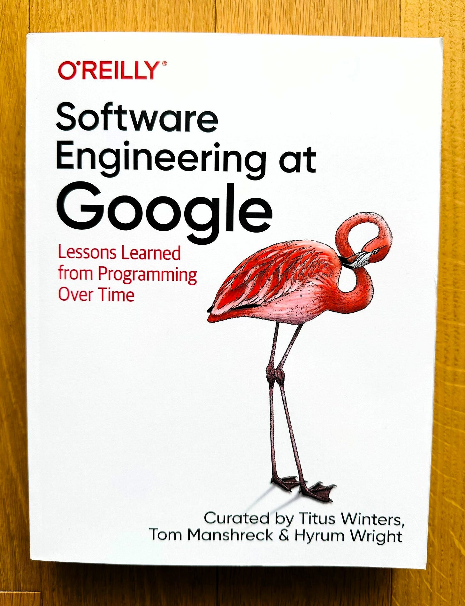](https://substackcdn.com/image/fetch/$s_!mB5y!,f_auto,q_auto:good,fl_progressive:steep/https%3A%2F%2Fsubstack-post-media.s3.amazonaws.com%2Fpublic%2Fimages%2F061e6e7a-7be9-44fc-b1d3-73b8909394c7_2643x3443.jpeg)[Software Engineering at Google](https://abseil.io/resources/swe-book) (Curated by: Titus Winters, Tom Manshreck & Hyrum Wright)

## 2. **Hyrum’s Law and the Beyoncé Rule**

These two concepts are my favorites from the book, and they come up together for a good reason.

### **Hyrum’s Law**

It is probably the book's most cited concept. Named after [Hyrum Wright](https://www.linkedin.com/in/hyrum-wright) (one of the book’s curators), the law states:

> ***With a sufficient number of users of an API, it does not matter what you promise in the contract: all observable behaviors of your system will be depended on by somebody.***

This sounds theoretical until it bites you. The classic example is hash iteration order. The Java `HashMap` API explicitly states that no orderings are guaranteed, but when Google attempted to update Java versions (which varied hash orderings), many tests failed. The engineers had written tests with assertions using `containsElementInOrder()` on `HashMap` outputs. Some people had even used hash iteration order as an inefficient random number generator. Google’s solution was defensive randomization, which means they altered their JDK to vary the hash iteration order each time it ran, making it impossible to rely on the unspecified behavior. Python and Go did this independently. So, we can learn from here that pointing fingers at engineers won’t fix the issue. It will make it impossible to make the mistake instead.

Hyrum’s Law applies outside the Google bubble. In 2024, [Recall.ai released a change that prepended a colon to S3 URL paths](https://www.recall.ai/blog/encountering-hyrums-law-in-the-wild). This is a completely valid character in a URL. The customers’ apps were broken because a transitive dependency (the yarl library) auto-normalized URLs by URL-decoding “safe” characters, which invalidated the S3 signature. No one had parsed the URLs directly. The dependency three levels deep had established an implicit contract.

[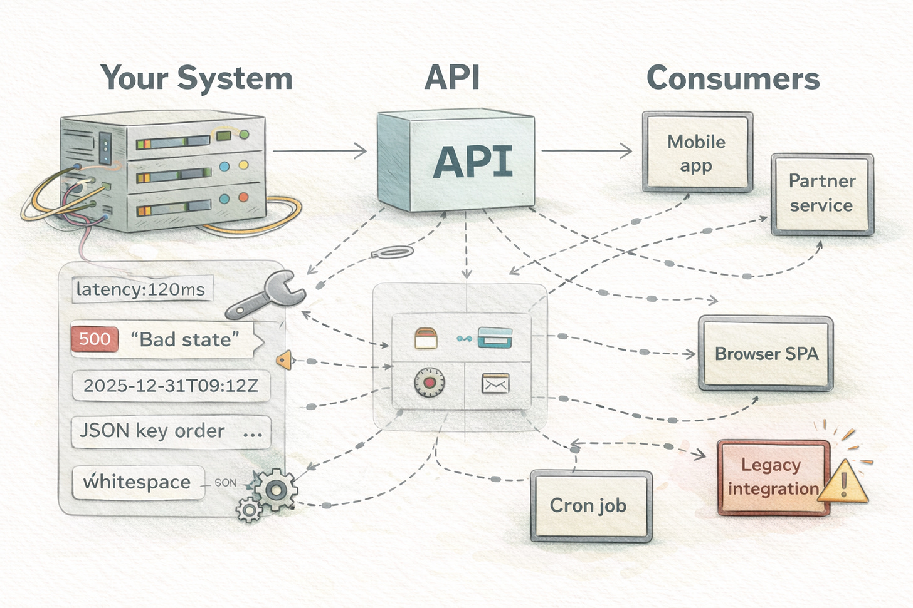](https://substackcdn.com/image/fetch/$s_!T2WW!,f_auto,q_auto:good,fl_progressive:steep/https%3A%2F%2Fsubstack-post-media.s3.amazonaws.com%2Fpublic%2Fimages%2Fe89b5ec1-e885-4d6b-b2c9-2ab46c6f4ce0_1536x1024.png)Hyrum’s Law

Hyrum’s Law is essentially *the software version of entropy*. You can mitigate it, but you can never fully eliminate it. The more users you have, the more your *implicit* interface, the behavior nobody documents but everyone depends on, grows alongside your explicit one. This is why backward compatibility is so hard and why breaking changes are so expensive at scale.

### **The Beyoncé Rule**

This rule says it simply: If you liked it, you should have put a test on it.

Let’s say that you fix a small bug’s not a big deal. But Joe from the billing team had been relying on that bug to make his code work. Now Joe’s stuff is broken. Who’s at fault?​

The Beyoncé Rule says: *if Joe liked that behavior, he should have written a test for it.*When your fix breaks his test, you see it immediately: “Oh, gotta fix Joe’s code too.” And because Joe tested everything he cares about, you can fix his code without needing to understand all its gnarly details.​

We introduced these practices in our projects, so when a bug is reported with a fix, we first write tests to prove that the bug was fixed. The test methods comment section included the Jira ticket number, so we could track it back to the bug itself.

[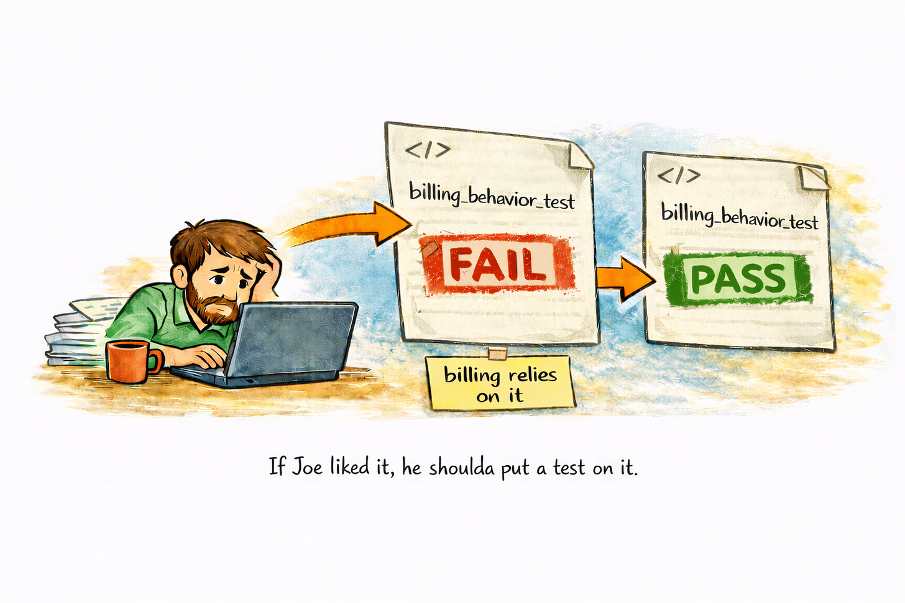](https://substackcdn.com/image/fetch/$s_!knum!,f_auto,q_auto:good,fl_progressive:steep/https%3A%2F%2Fsubstack-post-media.s3.amazonaws.com%2Fpublic%2Fimages%2F2c712876-a184-403d-9c53-4c834383a7c8_1536x1024.png)The Beyoncé Rule

The deeper lesson here is about **shared ownership**. In a large codebase, anyone might touch your code. Tests become a communication mechanism. They tell the rest of the organization what behaviors matter to you. Without tests, you’re relying on tribal knowledge, and that doesn’t scale.

## 3. **Shift Left**

This concept is simple but powerful: **the earlier you find a mistake, the cheaper it is to fix.**

Google Web Server (GWS), the Google Search engine infrastructure, was in a crisis state in 2005. More than 80% of the production pushes resulted in user-impacting bugs that had to be rolled back. The tech lead made it mandatory for the engineers to automate the testing of new code. Bugs were reduced by half within a year, despite record numbers of new changes. Today, GWS has tens of thousands of tests and releases every day with very few customer-visible failures.

This clearly explains [Google’s testing philosophy](https://abseil.io/resources/swe-book/html/ch11.html). The book encourages a strongly lean test pyramid:

- ~80% small (unit) tests
- ~15% medium (integration) tests
- ~5% large (end-to-end) tests

[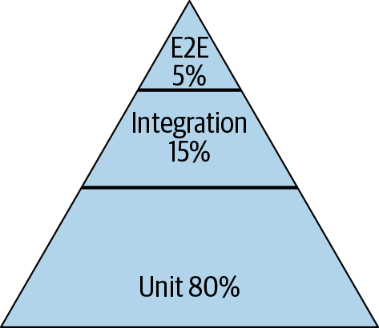](https://substackcdn.com/image/fetch/$s_!fNis!,f_auto,q_auto:good,fl_progressive:steep/https%3A%2F%2Fsubstack-post-media.s3.amazonaws.com%2Fpublic%2Fimages%2Feadb0b65-ac1d-4cd5-bfc4-3229cd1c7a02_473x410.png)Google’s version of Mike Cohn’s test pyramid (Source: [Software Engineering at Google book](https://abseil.io/resources/swe-book/html/ch11.html))

Most importantly, Google tests are divided by size (resource usage), not the traditional unit/integration categorization. Small tests run in a single process, a single thread, and without any I/O, network, or disk access. Medium tests may use multiple processes on localhost. Large tests can run across machines. The important characteristics being optimized are speed and determinism.

Flaky tests get special mention. With Google’s *0.15% flakiness level*, even a monorepo of that size still yields thousands of flakes per day. The book states that with ~1% flakiness, tests become useless altogether – engineers stop caring about them and begin to ignore failures.

[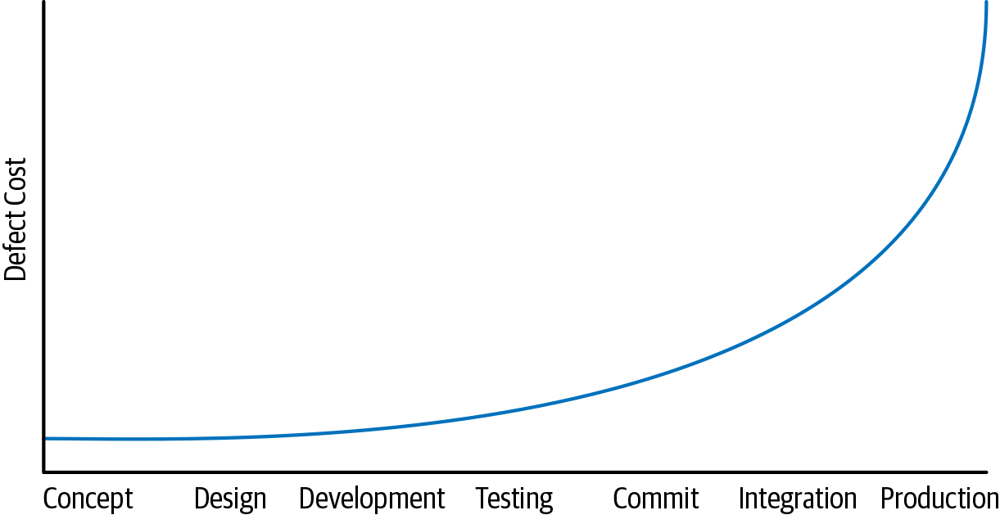](https://substackcdn.com/image/fetch/$s_!UYSo!,f_auto,q_auto:good,fl_progressive:steep/https%3A%2F%2Fsubstack-post-media.s3.amazonaws.com%2Fpublic%2Fimages%2F1c12a2f7-e7b3-4dcc-b24a-f034d5c8d5ac_1221x629.png)Timeline of the developer workflow (Source: [Software Engineering at Google book](https://abseil.io/resources/swe-book/html/ch01.html#shifting_left))

Three cultural interventions distributed testing throughout Google. New employee orientation classes introduced testing as best practice – within two years, engineers trained in testing outnumbered the pre-testing culture:

- “**[Test Certified](https://mike-bland.com/2011/10/18/test-certified.html)**,” a five-level biannual program, encouraged 1,500+ projects to adopt testing procedures through a public dashboard that generated social pressure.
- “**[Testing on the Toilet](https://testing.googleblog.com/2007/01/introducing-testing-on-toilet.html)**” is a one-page testing advice posted in stalls starting in April 2006. They evolved into what the authors describe as “the longest-running and most profound impact of any of the testing initiatives.”

[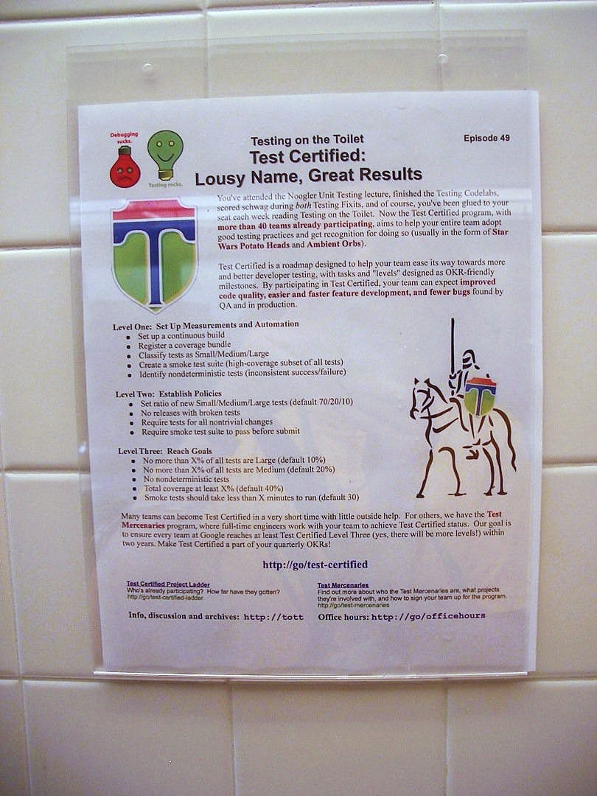](https://substackcdn.com/image/fetch/$s_!-HOp!,f_auto,q_auto:good,fl_progressive:steep/https%3A%2F%2Fsubstack-post-media.s3.amazonaws.com%2Fpublic%2Fimages%2F35961818-9aec-4759-9cfb-5ede9f57c3ce_810x1080.jpeg)Testing on the Toilet practice at Google (Source: [Mike Bland](https://mike-bland.com/2011/10/25/testing-on-the-toilet.html))

In practical terms, *shifting left* means adding many quality checkpoints into the development process:

- **Static analysis** happens in your editor. It finds typos, wrong function calls, and type mismatches in real time. Cost to fix: seconds.
- **Unit tests** take a few seconds to run. They verify your code does what you think it does. Cost to fix: minutes.
- **Integration tests** take a few minutes. They validate that your system’s components work together and can catch edge cases that unit tests miss. Cost to fix: an hour or so.
- **Code review** takes a few hours. It’s a human-powered quality gate that answers the question: Does this follow team norms? Is the approach sensible? This is also one of the best mechanisms for knowledge sharing on any team. Cost to fix: maybe half a day.
- **QA** takes hours or days. Everything works together as expected? Cost to fix: days, maybe a week.
- **Users in production** will find everything you missed, and expose you to edge cases you never thought possible. Cost to fix: potentially enormous, both technically and reputationally.

The further right you go, the more expensive the fix becomes. This is why Google invests so much in static analysis tools such as [Tricorder](https://abseil.io/resources/swe-book/html/ch20.html), fast unit-test infrastructure, and pre-submit checks that run before code is even submitted for review. The hope is to find as much as possible before a human ever has to look at it.​

[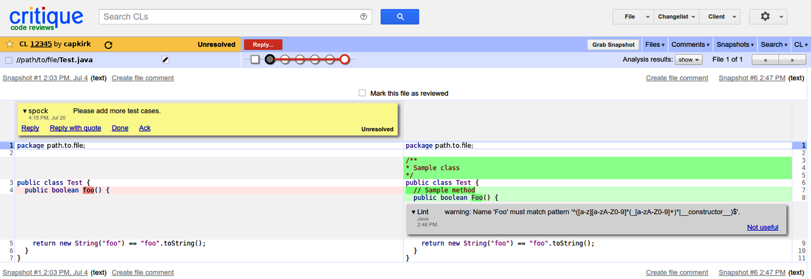](https://substackcdn.com/image/fetch/$s_!9nxc!,f_auto,q_auto:good,fl_progressive:steep/https%3A%2F%2Fsubstack-post-media.s3.amazonaws.com%2Fpublic%2Fimages%2F6aaba70c-d5d4-43d4-9444-6708febea6c8_1440x498.png)Critique’s diff viewing, showing a static analysis warning from Tricorder in gray (Source: [Software Engineering at Google book](https://abseil.io/resources/swe-book/html/ch20.html))

## 4. Don’t Use Mocking Frameworks

Chapter 13 in the book about [test doubles](https://abseil.io/resources/swe-book/html/ch13.html) is one of the most surprising in its recommendations: *always choose real implementations over fakes and stubs, and use mocking only as a last resort*. When mocking frameworks first came to Google, they “seemed like a hammer fit for every nail.” It was easy to write very focused tests. However, the price was paid later on, as tests became “something that required constant effort to maintain while rarely finding bugs.” The pendulum has now swung far in the other direction, with many Google engineers choosing not to use mocking frameworks at all.

The underlying issue with mocks is that they test how something was done, not what happened as a result. A test for a payment processor might check that the `pay()` method was called with the correct arguments in a mocked test, but it can’t tell you if the payment actually went through. A fake is a lightweight implementation that keeps track of state, allowing you to call `processPayment()` and then check `getMostRecentCharge()` to see what actually happened. Google went so far as to include an `@DoNotMock` annotation in their [ErrorProne static analysis tool](https://github.com/google/error-prone). When an API is mocked tens of thousands of times throughout the codebase, it “severely constrains the API owner’s ability to make changes,” because mocks are used in tests that violate the API contract in ways that real implementations and fakes simply can’t.

Here is the example with a mock:

[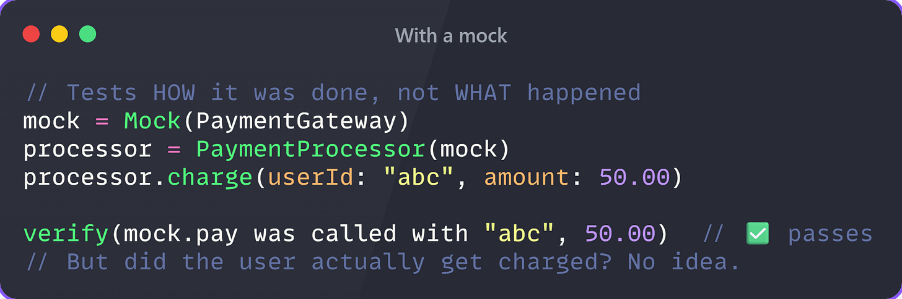](https://substackcdn.com/image/fetch/$s_!QVbV!,f_auto,q_auto:good,fl_progressive:steep/https%3A%2F%2Fsubstack-post-media.s3.amazonaws.com%2Fpublic%2Fimages%2Fc8a228f1-ac61-4a75-8b56-f23e778d1952_1914x636.png)

Now the same test with a fake:

[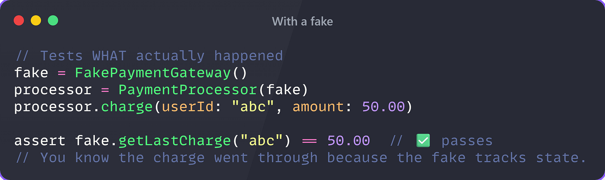](https://substackcdn.com/image/fetch/$s_!dVoG!,f_auto,q_auto:good,fl_progressive:steep/https%3A%2F%2Fsubstack-post-media.s3.amazonaws.com%2Fpublic%2Fimages%2F50230d0f-f15e-4c6b-9a56-ce7f1f9b5071_2124x636.png)

Now imagine this mock repeated 10,000 times across your codebase. Every refactor that changes *how* `pay()` it works breaks all of them, even if the payment still works perfectly.

The trade-off is that fakes must be invested in. The team that owns the real implementation should maintain the fake, using contract tests that verify against both. If there are only a few consumers, it may not be worth writing a fake. But for popular APIs, the boost to productivity is huge.

Here is an overview of mocks, stubs, and fakes:

[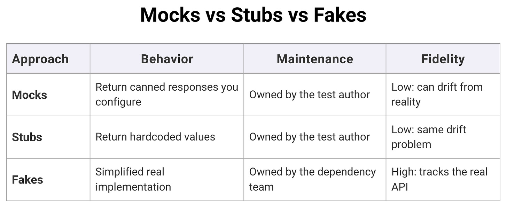](https://substackcdn.com/image/fetch/$s_!cAGJ!,f_auto,q_auto:good,fl_progressive:steep/https%3A%2F%2Fsubstack-post-media.s3.amazonaws.com%2Fpublic%2Fimages%2F4ab87339-8fc0-4bd7-87e5-4f6a5481866f_1528x628.png)Mocks vs Stubs vs Fakes

## **5. Code Review Is Not a Bug Filter**

Most teams treat code review as a quality gate. Someone checks your logic, clicks approve, and the change ships. That’s not what Google does, and the gap matters more than you’d think.

The book is explicit: checking code correctness is **not** the primary benefit Google gets from code review. The bigger payoffs are comprehension, knowledge sharing, and long-term maintainability. A change that succeeds but that no one else can understand is already a problem. Code that can’t be understood can’t be changed, and code that can’t be changed can’t be maintained.

[The process](https://abseil.io/resources/swe-book/html/ch19.html#critique_googleapostrophes_code_review) is more formalized than most teams think: a peer LGTM (is this correct and understandable?), an owner sign-off (is this right for this part of the codebase?), and a readability approval (does it follow language standards?). One person can play all three roles, and often does. But breaking them out is important. Each role examines a different aspect, so no one reviewer has to grapple with the whole thing at once.

The code review flow (Source: [Software Engineering at Google book](https://abseil.io/resources/swe-book/html/ch19.html#critique_googleapostrophes_code_review))

Two things make the entire system tick. Changes remain at 200 lines, and feedback is provided within 24 working hours. A third of Google’s changes affect a single file. Small changes are carefully read, but big changes are just skimmed. It’s just human nature, and Google designed the system to work with it, not against it.

The quote that has stuck with me the most is this: “*If you’re writing it from scratch, you’re doing it wrong.*” **Code is a liability.** Every line of code is a maintenance burden for the future. Code review is where this reality gets enforced, not as a punishment, but as a forcing function that just slows you down enough to ask yourself: does this need to exist, does it make sense to someone else, and will it hold up in two years?

[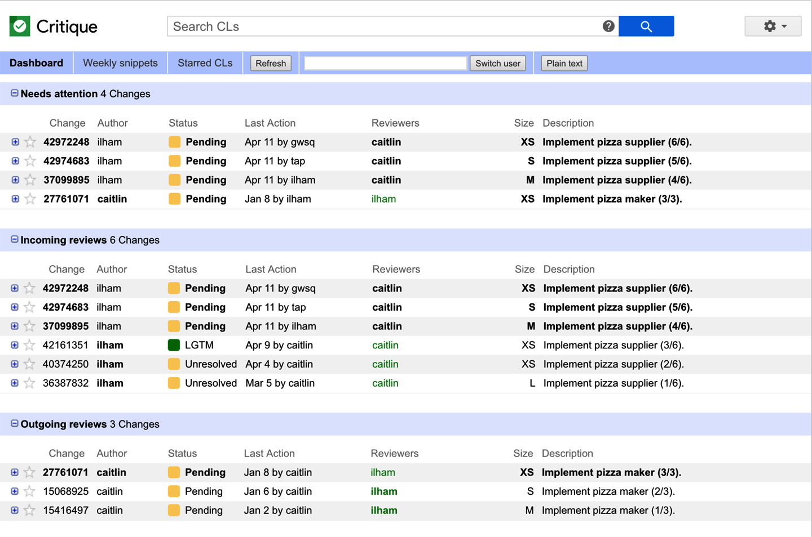](https://substackcdn.com/image/fetch/$s_!G9Dz!,f_auto,q_auto:good,fl_progressive:steep/https%3A%2F%2Fsubstack-post-media.s3.amazonaws.com%2Fpublic%2Fimages%2F791000ee-8127-4766-83c1-147d9a1fb7c1_1440x954.png)Google Critique tool (Source: [Software Engineering at Google book](https://abseil.io/resources/swe-book/html/ch19.html#critique_googleapostrophes_code_review))

On the human side, the book is clear: **“You are not your code**.” It is only natural to feel a sense of ownership over something you have created. The instant you submit code for review, the code no longer belongs to you. Every comment in a code review is a thing that needs to be done, not a criticism of the code. Even if you do not agree with a comment, explain why and ask the person to take another look at the code.

The book closes the chapter with five practices worth keeping on your wall:

- **Be Polite and Professional.** If something looks wrong, ask first. Don’t assume it’s a mistake. You might be missing context. And if you’re the author, treat every comment as a TODO, not a verdict.
- **Write Small Changes.** A 200-line diff gets read. A 2,000-line diff gets approved. Keep changes focused on a single issue, and the feedback you get back will actually be useful.
- **Write Good Change Descriptions.** The first line of your description shows up in email subjects, code search results, and future debugging sessions. “Fix bug” tells nobody anything. Write one sentence explaining what changed and why.
- **Keep Reviewers to a Minimum.** One reviewer is almost always enough. More reviewers means slower turnaround and diffuse responsibility. If you need a second opinion, ask for it explicitly.
- **Automate Where Possible.** Static analysis, formatting, test coverage, anything a machine can catch shouldn’t need a human reviewer’s attention. Save that attention for the decisions that actually require judgment.

## **6. Small Frequent Releases**

A small release is easier to manage, understand, and revert. That’s the lesson. But it’s astonishing how many teams still batch up weeks of work into a giant deploy, then spend the next three days debugging what went wrong.

The logic is simple: when something breaks in production, a small release makes it obvious which change caused the problem. A giant release with 50 commits? Good luck finding the problem.

Google also tracks velocity in *commits per second* company-wide. To maintain this, they have invested in CI/CD infrastructure that makes it easy to deploy small changes. Feature flags enable them to separate “deploying code” from “turning on a feature,” so they can deploy code continuously even if the feature is not ready for end-users.

The research by [DORA (DevOps Research and Assessment)](https://dora.dev/) confirms this with data: teams that perform continuous delivery, with daily or hourly releases, achieve superior results across all fronts: speed, quality, stability, and developer satisfaction.

[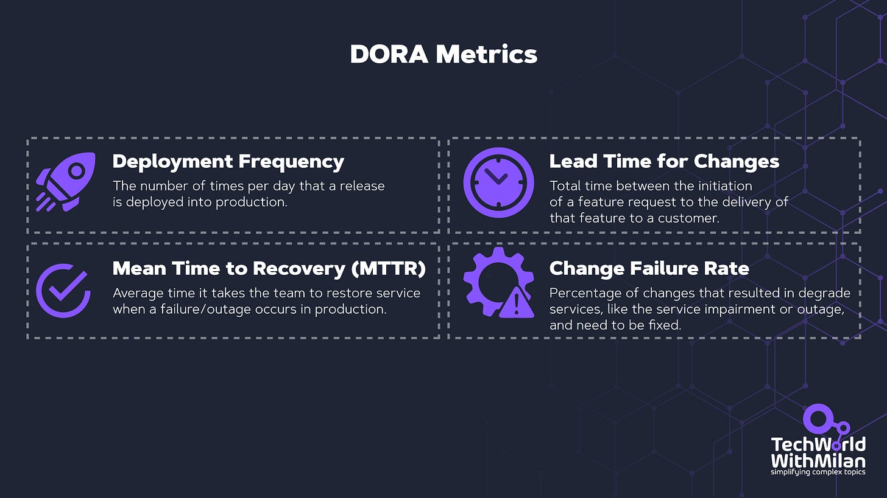](https://substackcdn.com/image/fetch/$s_!vV_D!,f_auto,q_auto:good,fl_progressive:steep/https%3A%2F%2Fsubstack-post-media.s3.amazonaws.com%2Fpublic%2Fimages%2F4e026c1a-181b-4061-a98f-57cb3e4968e9_1920x1080.png)DORA Metrics

Titus Winters explicitly [references DORA](https://abseil.io/resources/swe-book/html/ch16.html#release_branches)'s work as providing *causal, rather than merely correlative,* evidence that trunk-based development and continuous delivery lead to better technical outcomes.

## **7. Upgrade Dependencies Early, Fast, and Often**

Same thing as releases, but for your third-party code.

Upgrading from version 4.5.8 to 4.5.9 is no big deal. It’s a patch version update, a quick test run, and you’re done. Upgrading from version 4.5.8 to 4.8.0 might need a few changes, some deprecated APIs, and a config change, but it’s doable in an afternoon.

But upgrading from 4.5.8 to 7.0.0? Oh boy, it’s gonna hurt. Even if all the intermediate versions were backward-compatible, the sheer difference can still be huge. The implicit interfaces (Hyrum’s Law strikes again!) have changed so much that it’s a project in itself to upgrade.

The book is clear about this: “**The hardest unsolved problem in software engineering is dependency management**.” [Google’s monorepo system](https://research.google/pubs/why-google-stores-billions-of-lines-of-code-in-a-single-repository/) is a big help in this regard, but for the rest of us, the best solution is simple: keep your dependencies as up to date as possible. Smaller, more frequent updates are always cheaper than larger, less frequent migrations.

One powerful insight from the book: **the expert should make the update, not the consumer**. If you deprecate a function, don't just tell everyone "please upgrade." They won't. You go into their code and make the update yourself. You're the expert on what needs to change; you'll do it fast. Everyone else has to context-switch, read the migration guide, find time in their sprint... it'll never happen.

## 8. Measuring productivity is a must

[Chapter 11](https://abseil.io/resources/swe-book/html/ch07.html) deserves its own section because the framework it introduces is the **Goals/Signals/Metrics (GSM) framework**. This is one of the most immediately useful tools in the entire book.

Before measuring anything, Google's research team asks a series of triage questions: Is this worth measuring? Will the result change a decision? Does the decision-maker trust the type of data we'll produce? If the answer to any of these is "no," they don't waste the effort. This alone is a radical idea in an industry obsessed with metrics.

**The GSM Framework**

When measurement *is* worthwhile, they structure it in three layers:

- **Goal**: The desired end result, phrased without reference to any specific metric. (”Engineers write higher-quality code.”)
- **Signal**: How you’d know you’ve achieved the goal, what you’d *like* to measure, even if you can’t. (”Engineers report learning from the process.”)
- **Metric**: A measurable proxy for the signal, what you *actually* measure. (”Proportion of engineers reporting they learned about four relevant topics, via survey.”)

The power of GSM is that it prevents the *streetlight effect*, measuring what’s easy to measure rather than what matters. By starting with goals and working down, you ensure that your metrics trace back to something meaningful.

[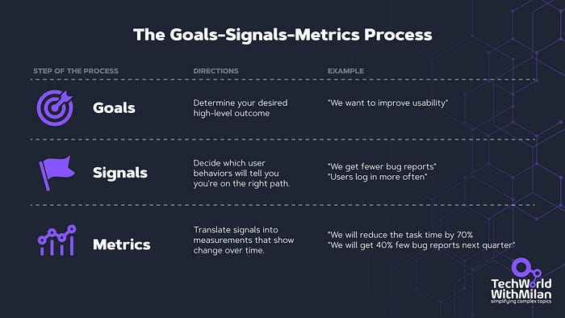](https://substackcdn.com/image/fetch/$s_!zDCw!,f_auto,q_auto:good,fl_progressive:steep/https%3A%2F%2Fsubstack-post-media.s3.amazonaws.com%2Fpublic%2Fimages%2Fe45c754a-1de2-4a1f-a39c-5b5a5c1a1f80_700x394.png)The Goals-Signals-Metrics Process

**QUANTS: The Five Dimensions**

Google’s research team divides productivity into five components to ensure that improving one dimension doesn’t quietly degrade another:

- **Quality of code**: What is the quality of the code produced?
- **Attention of engineers**: Can engineers reach a flow state? Are they distracted?
- **iNtellectual complexity**: How much cognitive load does a task require?
- **Tempo and velocity**: How fast can engineers complete their work?
- **Satisfaction**: How happy are engineers with their tools, products, and work?

The book's sharpest warning concerns individual measurement: **"If productivity metrics are used for performance reviews, engineers will be quick to game the metrics, and they will no longer be useful."**The only way to make these measurements work is to measure aggregate effects, never individuals. Google's productivity research team includes behavioral economists specifically to understand incentive structures and prevent Goodhart's Law from corrupting their data.

One surprising finding: "It has routinely been our experience at Google that when the quantitative and qualitative metrics disagree, it was because the quantitative metrics were not capturing the expected result."

The critical takeaway: **if a measurement isn’t actionable, it isn’t worth taking**. After every research study, Google’s team prepares a list of concrete recommendations: a new tool feature, a documentation improvement, a process change. If the result can’t drive an action, the measurement was wasted.

## 9. **The Culture Chapters: The Stuff Nobody Wants to Talk About**

The [first several chapters of the book](https://abseil.io/resources/swe-book/html/part2.html) address culture: teamwork, knowledge sharing, psychological safety, and leadership. As Titus Winters noted in his [GOTO talk](https://www.youtube.com/watch?v=7zZ0u5aClAg), software engineering has always been about two things: **time and people**. We teach engineers to code on their own, but once they join a team, it becomes a team sport.

Some ideas that resonated with me:

- **The Genius Myth is toxic.** True success is achieved through team effort, not by a single 10x developer. The Genius Myth is just another manifestation of our **insecurity**. The book cites [Project Aristotle](https://rework.withgoogle.com/intl/en/guides/understanding-team-effectiveness), Google’s famous study that discovered psychological safety is the most critical component of an effective team.​ Read here why and how this impacts engineering teams:
[
Tech World With Milan NewsletterWhy do some engineering teams consistently outperform others?What makes a great team stand out? It’s not just technical skills or years of experience—it’s something deeper. Over two decades, I’ve seen how some teams thrive while others struggle, and the difference often comes down to how people interact, communicate, and support each other. Building a high-performing team requires more than just assembling talent…Read morea year ago · 44 likes · 3 comments · Dr Milan Milanović](https://newsletter.techworld-with-milan.com/p/why-do-some-engineering-teams-consistently?utm_source=substack&utm_campaign=post_embed&utm_medium=web)
- **“Because I said so” is a leadership failure.** If there’s disagreement, explain your reasoning. Lead people to a change in decision-making through teaching, not authority. As leaders, we always have power and authority, but we should not enforce it. From my experience, knowledgeable people are more likely to work with leaders who are facilitators ([servant leaders](https://newsletter.techworld-with-milan.com/p/are-you-aware-that-you-should-use?utm_source=publication-search)) rather than authoritarians.
- **Ask dumb questions.** Titus describes chairing a C++ standards subcommittee and deliberately asking naive questions to ensure everyone in the room had truly re-learned the material before voting. Modeling that it’s OK to not know things creates a culture where people actually learn.​
- **Delegate to the most junior person who can handle it** (with appropriate oversight). This is a direct counter to Fred Brooks's “surgical team” model. The team grows, and the senior engineers get freed up to tackle the next impossible thing.​
- **The reason most teams don’t fail because of bad code is that they lack trust.**We can go back far enough in any team conflict, and you’ll find a crack in one of three things: **humility** (you believe your way is the only way), **respect** (you stopped caring about the person, not just the work), or **trust** (you’d rather do it yourself than let someone else drive).
- **Learn from your mistakes by documenting them**. When something bad happens, like an incident, create a postmortem. A postmortem isn’t about blame, but about recording the truth while it’s still hot. Inside, we should include the entire timeline, the actual root cause (not something generic like “human error”), and finish with action items that have real people and real deadlines. The lessons section is where most teams skimp. That’s a problem. That’s the part that makes the next incident shorter.

Taking all of this into account will lay the foundations on which your team can create significant value and not lose control when things get hard.

## 10. What the authors admit doesn't work, even at Google

Titus Winters is remarkably clear about the book’s limitations. In a [GOTO podcast](https://www.youtube.com/watch?v=7zZ0u5aClAg)interview, he describes the dependency management chapter as giving him “literal nightmares”: there are many ideas about what doesn’t work, but no clear, cheap, scalable solution. His guiding principle: **“I prefer any number of version control problems over a single dependency management problem.”** The book’s critique of semantic versioning is pointed: [SemVer](https://semver.org/) is fundamentally an *estimate*, not a proof of compatibility. A major version bump due to a breaking change in the function Bar falsely blocks upgrades for consumers who only use the function Foo. And patch versions, supposedly safe, routinely violate Hyrum’s Law.

[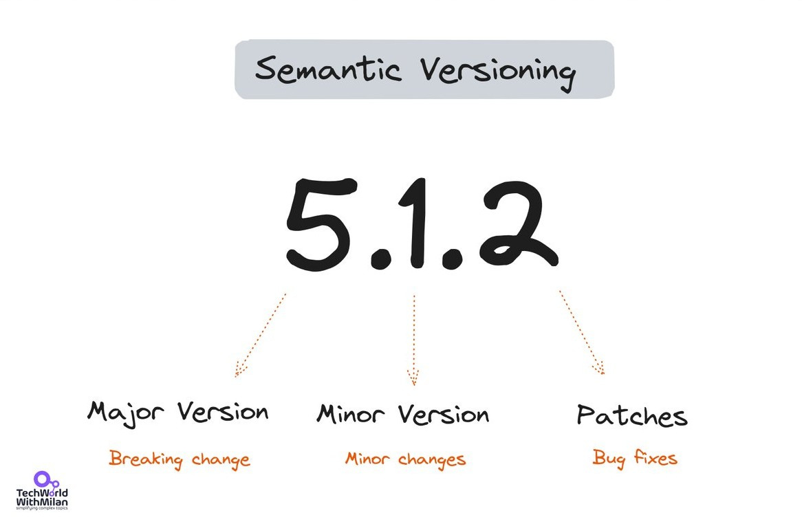](https://substackcdn.com/image/fetch/$s_!P_g7!,f_auto,q_auto:good,fl_progressive:steep/https%3A%2F%2Fsubstack-post-media.s3.amazonaws.com%2Fpublic%2Fimages%2F7ca70cbc-3908-45c6-8a3c-99ff282daed4_1166x765.jpeg)Semantic Versioning

Winters also admits the culture chapters are “a little bit aspirational”; they don’t perfectly describe Google’s reality. Critics note the irony of Google recommending “don’t release things without a plan to support them long-term” while maintaining a notorious [product graveyard](https://killedbygoogle.com/).

[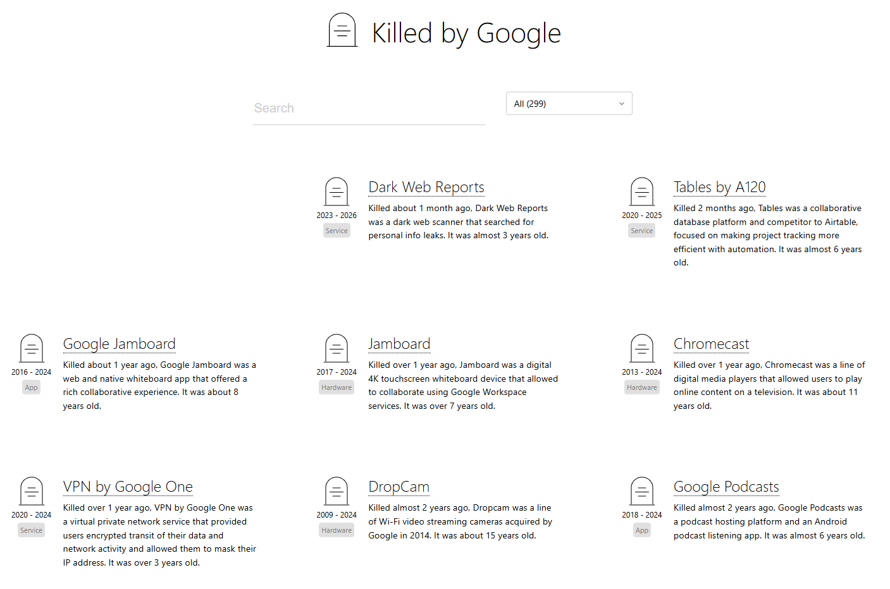](https://substackcdn.com/image/fetch/$s_!NKUS!,f_auto,q_auto:good,fl_progressive:steep/https%3A%2F%2Fsubstack-post-media.s3.amazonaws.com%2Fpublic%2Fimages%2F8136a13b-37bc-45ec-b27a-e3c28172ac29_1407x932.png)[Google Graveyard](https://killedbygoogle.com/)

On the **what I missed side**, we can say that one of the book’s “real weaknesses” is its rare provision of empirical evidence for its claims beyond “it works for Google.” With this, the book would have had much greater value than it does.

## 11. **Practical Takeaways You Can Apply Tomorrow**

Not every Google practice translates to every organization. The authors themselves are explicit about this: *don’t blindly copy what Google does*. Understand the *why* behind their methods and adapt the *what* to your context.

That said, here’s what’s universally actionable:

- **Write tests for everything you care about.** The Beyoncé Rule works at any scale.
- **Review the process, not just the code.** Define who gives sign-off on correctness, ownership, and readability on your team. If one person is doing all three for every change, that's a bottleneck.
- **Invest in your build system and CI pipeline.** The ROI compounds over time.
- **Ship smaller, more frequently.** Whatever your current release cadence is, try halving it.
- **Keep dependencies fresh.** Set up Dependabot or Renovate and stop ignoring those PRs.
- **Replace mocks with fakes where possible.** Your test suite will thank you.
- **Measure with intent.** Use the GSM framework before creating any new dashboard or metric.
- **Treat documentation like code.** Review it, maintain it, deprecate it when it’s stale.
- **Create psychological safety on your team.** It’s the foundation on which everything else is built.

The book is available for free at **[abseil.io/resources/swe-book](https://abseil.io/resources/swe-book/html/toc.html)**, and it’s one of the best investments of reading time for any software engineer or tech lead.

---

## Bonus: The Top 100 Software Engineering Books on Goodreads

I analyzed the top 100 software engineering books on [Goodreads](https://www.goodreads.com/), and here are the results.

- **The most-read book isn’t the highest-rated.** The Phoenix Project has 49,000+ ratings at 4.26. Clean Code has 23,000+ at 4.36. “Designing Data-Intensive Applications” beats both with a 4.7 and only 10,000 ratings.
- **Old books still deliver.** K&R’s “The C Programming Language” (1978) has a rating of 4.44. “Structure and Interpretation of Computer Programs” (1984) scores 4.47. The classics aren’t nostalgia, they’re still the standard.
- **System design content is rising fast.** Alex Xu’s System Design Interview books both rank in the top 15. Five years ago, these didn’t exist.
- **The bottom of the list is telling.** “Effective DevOps” sits at 3.41. Some architecture pattern books hover around 3.7. High expectations, mixed execution.

The full visualization shows all 100 books ranked by rating, color-coded from green (4.7) to red (3.4).

Here is **[the full list](https://gist.github.com/milanm/e3394edf78145445cf9f6b85e0e00ea8)**.

[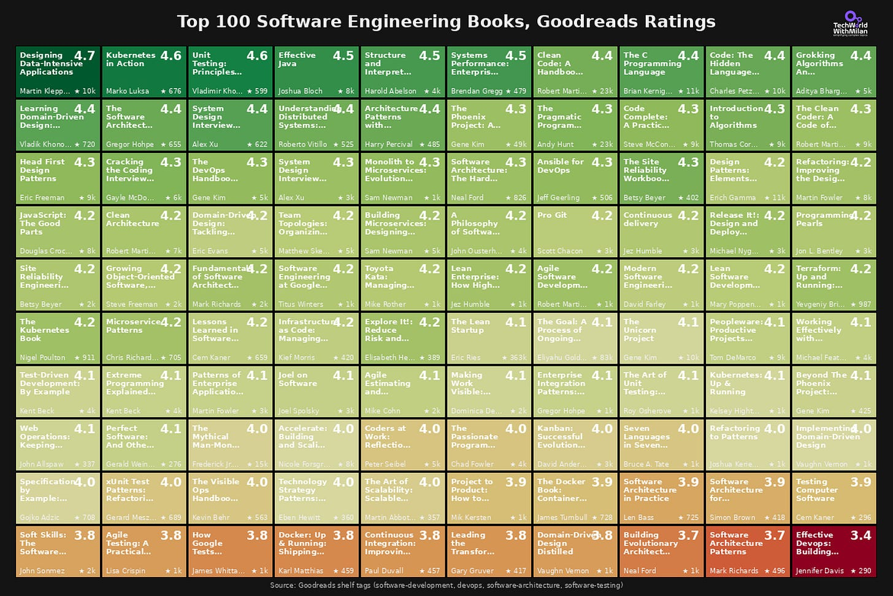](https://substackcdn.com/image/fetch/$s_!HpeW!,f_auto,q_auto:good,fl_progressive:steep/https%3A%2F%2Fsubstack-post-media.s3.amazonaws.com%2Fpublic%2Fimages%2F628e4686-672b-47d4-9027-9626da227a98_2340x1566.png)Top 100 Software Engineering Books, Goodreads Ratings

---

## **More ways I can help you**

- **[📱 You Can Build A LinkedIn Audience](https://www.patreon.com/posts/you-can-build-143858069?source=storefront)** 🆕. The system I used to grow from 0 to 260K+ followers in under two years, plus a 49K-subscriber newsletter. You’ll transform your profile into a page that converts, write posts that get saved and shared, and turn LinkedIn into a steady source of job offers, clients, and speaking invites. Includes 6-module video course (~2 hours), LinkedIn Content OS with 50 post ideas, swipe files, and a 30-page guide. **[Join 300+ people](https://www.patreon.com/posts/you-can-build-143858069?source=storefront)**.
- [📚](https://www.patreon.com/techworld_with_milan/shop/ultimate-net-bundle-for-2025-1519389?utm_medium=clipboard_copy&utm_source=copyLink&utm_campaign=productshare_creator&utm_content=join_link)**[The Ultimate .NET Bundle 2025](https://www.patreon.com/techworld_with_milan/shop/ultimate-net-bundle-for-2025-1519389?utm_medium=clipboard_copy&utm_source=copyLink&utm_campaign=productshare_creator&utm_content=join_link)**. 500+ pages distilled from 30 real projects show you how to own modern C#, ASP.NET Core, patterns, and the whole .NET ecosystem. You also get 200+ interview Q&As, a C# cheat sheet, and bonus guides on middleware and best practices to improve your career and land new .NET roles. **[Join 1,000+ engineers](https://www.patreon.com/techworld_with_milan/shop/ultimate-net-bundle-for-2025-1519389?utm_medium=clipboard_copy&utm_source=copyLink&utm_campaign=productshare_creator&utm_content=join_link)**.
- [📦](https://www.patreon.com/techworld_with_milan/shop/premium-resume-package-1721454?utm_medium=clipboard_copy&utm_source=copyLink&utm_campaign=productshare_creator&utm_content=join_link)**[Premium resume package](https://www.patreon.com/techworld_with_milan/shop/premium-resume-package-1721454?utm_medium=clipboard_copy&utm_source=copyLink&utm_campaign=productshare_creator&utm_content=join_link)**. Built from over 300 interviews, this system enables you to quickly and efficiently craft a clear, job-ready resume. You get ATS-friendly templates (summary, project-based, and more), a cover letter, AI prompts, and bonus guides on writing resumes and prepping LinkedIn. **[Join 500+ people](https://www.patreon.com/techworld_with_milan/shop/premium-resume-package-1721454?utm_medium=clipboard_copy&utm_source=copyLink&utm_campaign=productshare_creator&utm_content=join_link)**.
- [📄](https://www.patreon.com/techworld_with_milan/shop/complete-tech-resume-reality-check-311008?utm_medium=clipboard_copy&utm_source=copyLink&utm_campaign=productshare_creator&utm_content=join_link)**[Resume reality check](https://www.patreon.com/techworld_with_milan/shop/complete-tech-resume-reality-check-311008?utm_medium=clipboard_copy&utm_source=copyLink&utm_campaign=productshare_creator&utm_content=join_link)**. Get a CTO-level teardown of your CV and LinkedIn profile. I flag what stands out, fix what drags, and show you how hiring managers judge you in 30 seconds. **[Join 100+ people](https://www.patreon.com/techworld_with_milan/shop/complete-tech-resume-reality-check-311008?utm_medium=clipboard_copy&utm_source=copyLink&utm_campaign=productshare_creator&utm_content=join_link)**.
- [✨](https://www.patreon.com/c/techworld_with_milan)**[Join My Patreon](https://www.patreon.com/c/techworld_with_milan)**[https://www.patreon.com/c/techworld_with_milan](https://www.patreon.com/c/techworld_with_milan)**[community](https://www.patreon.com/c/techworld_with_milan) and [my shop](https://www.patreon.com/c/techworld_with_milan/shop)**. Unlock every book, template, and future drop, plus early access, behind-the-scenes notes, and priority requests. Your support enables me to continue writing in-depth articles at no cost. **[Join 2,000+ insiders](https://www.patreon.com/c/techworld_with_milan)**.
- [🤝](https://newsletter.techworld-with-milan.com/p/coaching-services)**[1:1 Coaching](https://newsletter.techworld-with-milan.com/p/coaching-services)**. Book a focused session to crush your biggest engineering or leadership roadblock. I’ll map next steps, share battle-tested playbooks, and hold you accountable. **[Join 100+ coachees](https://newsletter.techworld-with-milan.com/p/coaching-services)**.

---

## **Want to advertise in Tech World With Milan? 📰**

If your company is interested in reaching founders, executives, and decision-makers, you may want to **[consider advertising with us](https://newsletter.techworld-with-milan.com/p/sponsorship-of-tech-world-with-milan)**.

---

## **Love Tech World With Milan Newsletter? Tell your friends and get rewards.**

Share it with your friends by using the button below to get benefits (my books and resources).

[Share Tech World With Milan Newsletter](https://newsletter.techworld-with-milan.com/?utm_source=substack&utm_medium=email&utm_content=share&action=share)

[Track your referrals here](https://newsletter.techworld-with-milan.com/leaderboard).