# What I learned from the book Designing Data-Intensive Applications

*Most engineers skim DDIA. I read it twice, and here’s why it rewired my mental model.*

With 2 decades of experience in software engineering, I consider myself knowledgeable across a range of topics, including NoSQL databases, Big Data, transactions, sharding, and more.

However, my eye-opening read was Martin Kleppmann’s “[Designing Data-Intensive Applications](https://amzn.to/3ZX4uMv)” (DDIA), which introduced me to concepts related to these technologies and systems.

This (still) popular book (often called the “*Big Ideas Behind Reliable, Scalable, and Maintainable Systems*”) bridges theory and practice to explain **how data systems work and why**.

In this article, we will cover the following:

1. **Introduction**. Explains why “Designing Data-Intensive Applications” matters and how rereading it clarified its core ideas to me.
2. **The things I liked about the book**. In this section, I show the book’s clear breakdown of reliability, scalability, maintainability, data models, and storage engines, and the importance of weighing trade-offs.
3. **The things I didn’t like**. Here we note gaps in the book, such as outdated examples, theory-heavy coverage, and the breadth-over-depth trade-off that can overwhelm readers.
4. **Recommendation**. Identifies who will gain the most (mid-career engineers, architects, tech leads) and who may struggle (new devs, theory-averse readers).
5. **Conclusion.** Here we summarize the mental models and decision frameworks you gained, positioning DDIA as a must-read reference for designing reliable data systems.
6. **Bonus: Key takeaways & principles**. Finally, we made DDIA into a quick-hit list of design rules and trade-offs you can reference during architecture and code reviews.

So, let’s dive in.

---

**[Sponsor this newsletter](https://newsletter.techworld-with-milan.com/p/sponsorship-of-tech-world-with-milan)**

## 1. Introduction

This is one of the books everyone will say is a great read, but often, behind that, there is a wall of silence. I have always wondered whether people really read the book or didn’t understand it well.

I first read it in 2018. And I was almost finished, but some parts were tricky to grasp. Then, in 2023. I decided to re-read it properly and take notes. This text is primarily based on the notes I took at the time (see the reference section).

DIA is not just another tech book; it’s essentially a **foundational guide to data systems**. Kleppmann begins by reminding us what matters in the world of distributed systems: building applications that are **reliable**, **scalable**, and **maintainable** for the long run.

The book then explores different types of databases, distributed systems, and data processing to help you understand their strengths, weaknesses, and trade-offs.

As I read, I often found myself nodding along and saying, *“Ah, that’s why this design is the way it is!”* Each chapter presents key concepts, ranging from data models and storage engines to replication and stream processing.

By the end, I not only had refreshed my knowledge of things I use daily (like **SQL vs. NoSQL databases** or **Apache Kafka**), but also gained a more principled way of thinking about distributed systems.

[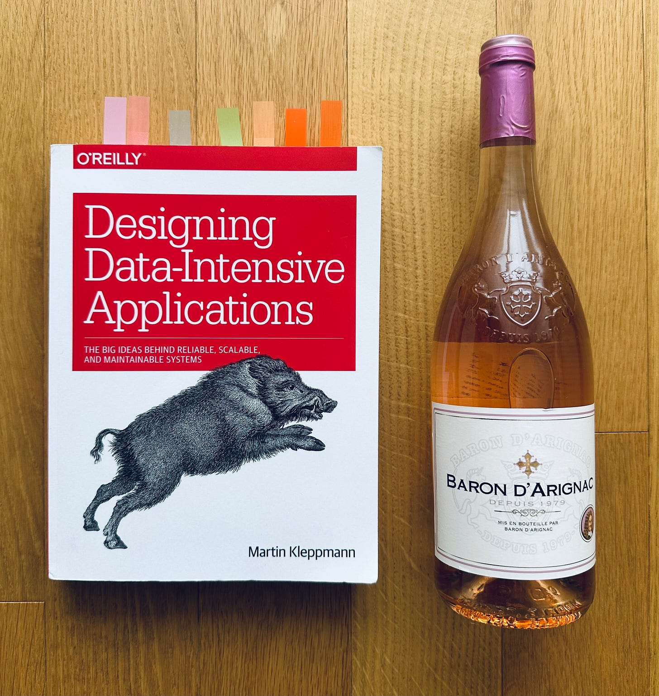](https://amzn.to/3ZX4uMv)[Designing Data-Intensive Application](https://amzn.to/3ZX4uMv)s by [Martin Kleppmann](https://martin.kleppmann.com/)

## 2. **The things I liked about the book**

Each of these subsections highlights what resonated most with me.

### **Distributed systems foundations are explained in detail**

One thing I appreciated immediately was that the book **starts with fundamentals**. It defines three critical concerns for any system: **reliability**, **scalability**, and **maintainability**.

1. **Reliability** means your system continues to work correctly even when things go wrong (hardware fails, bugs occur, humans err).
2. **Scalability** is a system's ability to handle increased load efficiently and effectively.
3. **Maintainability** refers to the system's ease of *management* and evolution by engineers over time. All of these are designed from the start.

[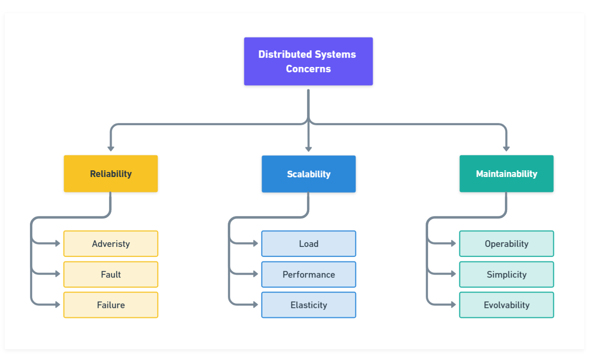](https://substackcdn.com/image/fetch/$s_!WfMt!,f_auto,q_auto:good,fl_progressive:steep/https%3A%2F%2Fsubstack-post-media.s3.amazonaws.com%2Fpublic%2Fimages%2Fbc784e06-84e5-446b-b583-f6b3c3ad9f76_1417x852.png)Distributed Systems Concerns

Kleppmann further divides the maintainability guidelines into the following principles for design:

- **Operability**. Make life easier for Ops teams with effective monitoring and automation.
- **Simplicity**. Reduce complexity by preventing accidental complexity.
- **Evolvability**. The system should be easily extensible to accommodate new requirements.

This is a good reminder that “**building for change**” is just as important as dealing with current traffic conditions.

I also appreciated the section on **performance metrics**. While average latency is something the book could have simply explained without reference to its own experience or research, it is helpful to know why it is important to care about percentiles like median (p50), 95th percentile, or 99th percentile response time.

For instance, if the 99th percentile latency is 2 seconds, that means that 1 out of every 100 users will have had to wait at least 2 seconds to access the service, even if the average latency was low. This focus on distribution rather than just the “average” case, and the tool of **rolling percentiles** we use to monitor performance, made me question how we discuss performance.

[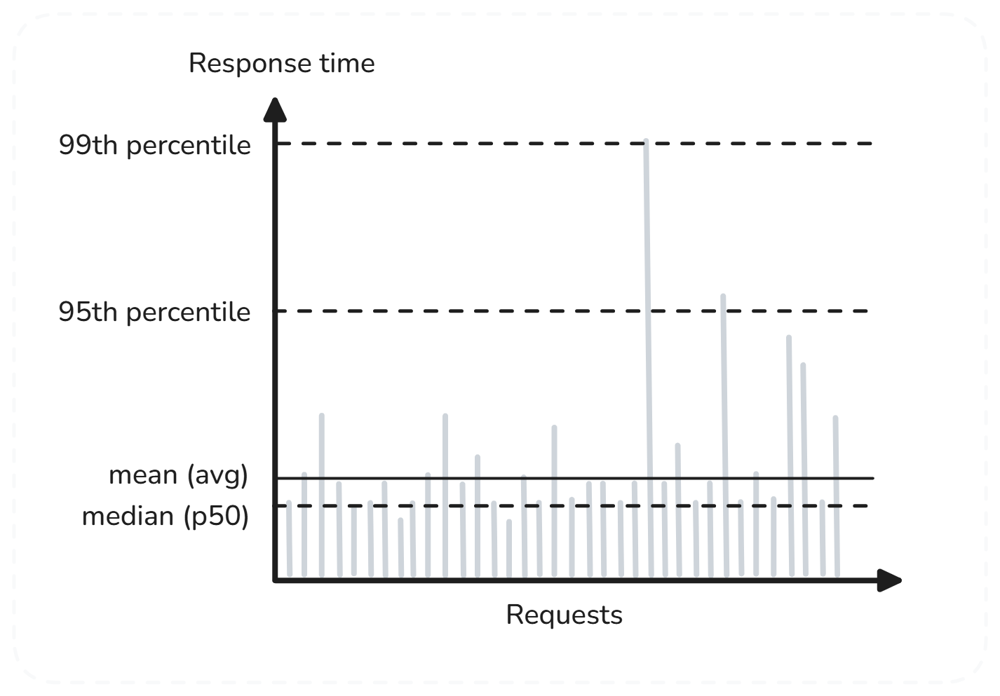](https://substackcdn.com/image/fetch/$s_!0Gy1!,f_auto,q_auto:good,fl_progressive:steep/https%3A%2F%2Fsubstack-post-media.s3.amazonaws.com%2Fpublic%2Fimages%2F97ff63b7-80d7-4a37-91ab-11de8131024d_1426x993.png)Response times for a sample of 100 requests to a service (approx., based on the book Figure 1-4)

Finally, a minor but essential lesson: **the book constantly highlights*****trade-offs***. There’s no free lunch – every design decision (say, a cache for speed or a schema for data quality) has downsides. By keeping reliability, scalability, and maintainability goals in mind, you can reason more clearly about these trade-offs.

> ➡️*This mindset of **evaluating trade-offs** is probably the most significant meta-learning I gained from the DDIA book.*

### Data models we use daily

Having worked with SQL and NoSQL databases, I found DDIA’s treatment of data models to be at once a refresher and an eye-opener: **it compares the traditional relational model with the newer document and graph models in a very balanced way.**

The takeaway? Use a data model that reflects your data access pattern. **Relational databases are well-suited to complex queries** and many-to-many relationships through joins and normalized schemas. If the data is very interconnected, like social networks, a graph database is a natural fit and can ease those traversals.

If your data is highly interconnected (think social networks), a **graph database** is a natural fit and can simplify those traversals.

On the other hand, if your data is self-contained and primarily comprises documents, such as user profiles or blog posts with comments, **a document database** may be more convenient.

Document databases offer **schema flexibility and efficiently load entire records**, making reads faster for document-shaped data. That was an interesting point to gather: if your app typically loads an entire document, such as a user profile with all its nested information, at once, a document store can eliminate join overhead and be more performant.

An example of one MongoDB document:

[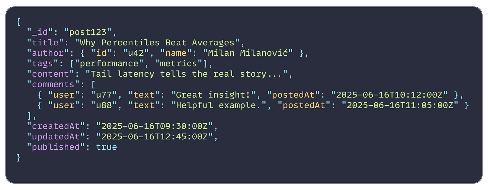](https://substackcdn.com/image/fetch/$s_!cFra!,f_auto,q_auto:good,fl_progressive:steep/https%3A%2F%2Fsubstack-post-media.s3.amazonaws.com%2Fpublic%2Fimages%2Faa26e50b-3e15-42fc-b1cd-0810b6764e25_2793x1092.png)Example [MongoDB document](https://www.mongodb.com/): a blog post with nested author and comments fields.

Here are the most used data models and their respective database types:

- **📄 Document databases** (e.g., MongoDB, CouchDB) lack join capabilities, so they *struggle with many-to-many data*, so you might end up doing those joins at the application level (complex).
- **🗄️ Relational databases** have schemas (schema-on-write), which provide consistency, but that rigidity led to the rise of **NoSQL** when developers wanted more agile schemas. DDIA discusses the concept of **impedance mismatch**, which refers to the mismatch between the objects in application code and the tables in an SQL database. Many developers, including myself, have felt this pain, and it’s why **Object-Relational Mappers (ORMs)** exist. The document model (e.g., JSON storage) can reduce this mismatch because the stored data more closely resembles in-memory structures. But again, trade-offs: schema flexibility can turn into “schema *chaos*” if you’re not careful with data quality.
- 🕸️ The book also explores less common models, such as **Graph databases** (E.g., [Neo4j](https://neo4j.com/) and [Titan](http://espeed.github.io/titandb/)), and explains when they’re helpful (if many-to-many relationships are common). Facebook, for example, maintains a single graph with many different types of vertices and edges. Their vertices represent people, locations, events, check-ins, and user comments, while edges indicate which people are friends.

In summary, *Designing Data-Intensive Applications* provided me with proper reasoning about database types: **choose your database not based on hype, but rather on how your application uses the data**.

This means that if you need ACID transactions with lots of complex joins, **relational databases** are still a safe bet. If you need flexible schemas or write workloads with eventual consistency, a document or **key-value storage solution** may work better for you. If you need to represent complex relationships, a **graph data model** can eliminate lots of code.

Here is the comparison table:

[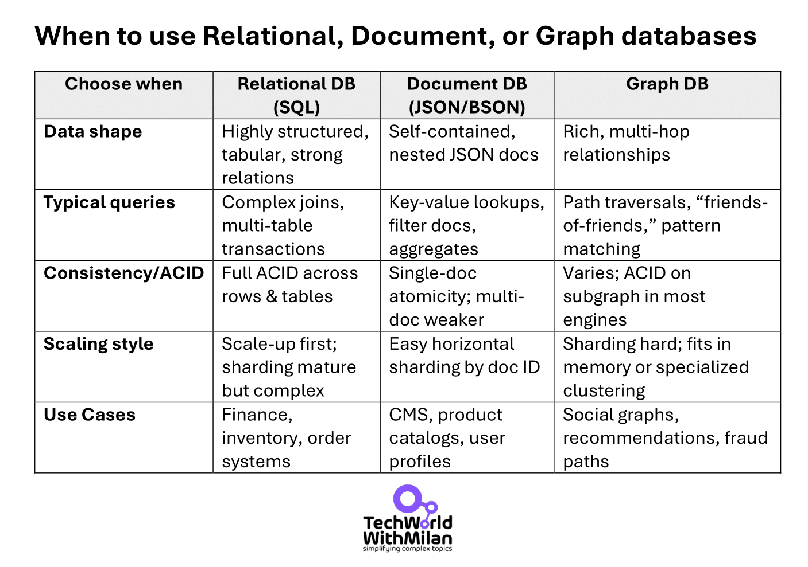](https://substackcdn.com/image/fetch/$s_!iQia!,f_auto,q_auto:good,fl_progressive:steep/https%3A%2F%2Fsubstack-post-media.s3.amazonaws.com%2Fpublic%2Fimages%2F6fe372a9-c9b4-4d1c-834a-0e37ca8e81b3_1407x989.png)

It was helpful to hear the pros and cons in one presentation, with examples. (Incidentally, it is interesting to note in this text how current technologies are blurring: SQL databases support JSON columns, while NoSQL databases support SQL queries.)

The image below shows **the current types of databases**:

[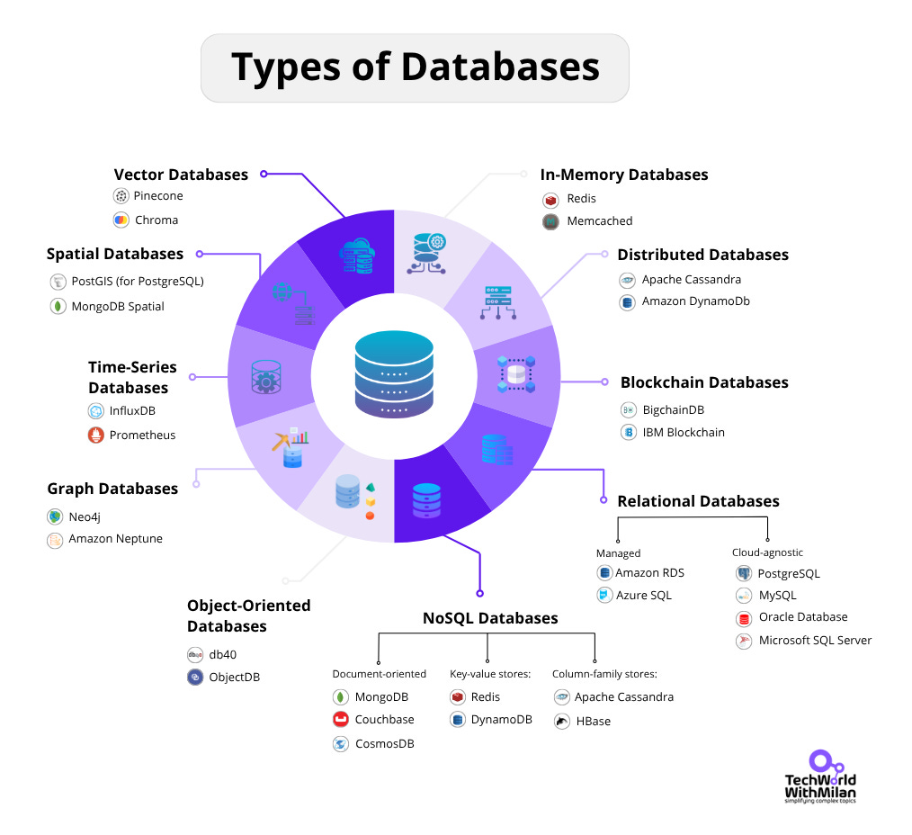](https://substackcdn.com/image/fetch/$s_!Qiui!,f_auto,q_auto:good,fl_progressive:steep/https%3A%2F%2Fsubstack-post-media.s3.amazonaws.com%2Fpublic%2Fimages%2F39f46b3b-d18c-4daf-9900-4ad729ccf037_1014x928.png)Types of Databases

### Storage engines

One of my favorite learnings was **how databases store and index data internally**. If you’ve ever wondered why *Cassandra* or *RocksDB* behaves differently from *PostgreSQL*, the book’s explanation of storage engines is gold.

It characterizes the two dominant indexing approaches: **The B-tree** indexes used by most relational databases versus the **Log-Structured Merge-trees (LSM-trees)**, used by many modern NoSQL databases.

**B-trees** store data in fixed-size blocks (pages) and maintain those pages in a sorted tree structure on disk. They are **optimized for read performance**, and lookups and range scans perform very well since the tree is balanced and shallow.

Most databases (such as [SQL Server](https://www.red-gate.com/simple-talk/databases/sql-server/database-administration-sql-server/sql-server-storage-internals-101/), Oracle, MySQL/InnoDB, and PostgreSQL) and most searching and retrieval applications lean heavily on indexing structures for this very reason. However, **writes to B-trees can be a bit slower because inserting a new record may involve multiple disk writes to store the data** and update parent index pages. Small random writes are typically very I/O intensive.

> **➡️*****[SQLite](https://sqlite.org/)**, for example, [includes B-trees for each table and index in the database](https://jvns.ca/blog/2014/10/02/how-does-sqlite-work-part-2-btrees/). For indexes, the key saved on a page is the index's column value, and the value is the row ID where it may be found. For the table B-tree, the key is the row ID, and I believe the value is all the data in that row.*

**LSM-trees**, on the other hand, are designed for high write throughput. They cache writes in RAM and always append their data in bulk to disk rather than in place. They maintain their data in sorted files (in [SSTables](https://www.scylladb.com/glossary/sstable/) format), which are then **merged** in the background as needed.

Such is the write sequentiality in **LSM-based storage engines, they are incredibly fast during writes** (due to reduced disk seek times, as they write in sequential order). The disadvantage is that they may be comparatively slower during reads, because data corresponding to a given key might be spread across many files that haven’t been merged yet; this is overcome in LSM-based systems using structures such as **[Bloom filters](https://en.wikipedia.org/wiki/Bloom_filter)**.

The book notes a simple rule of thumb: *“B-trees enable faster reads, whereas LSM-trees enable faster writes.”*

The image below illustrates the differences between B-Trees and LSM-Trees, along with the database engines that utilize them.

[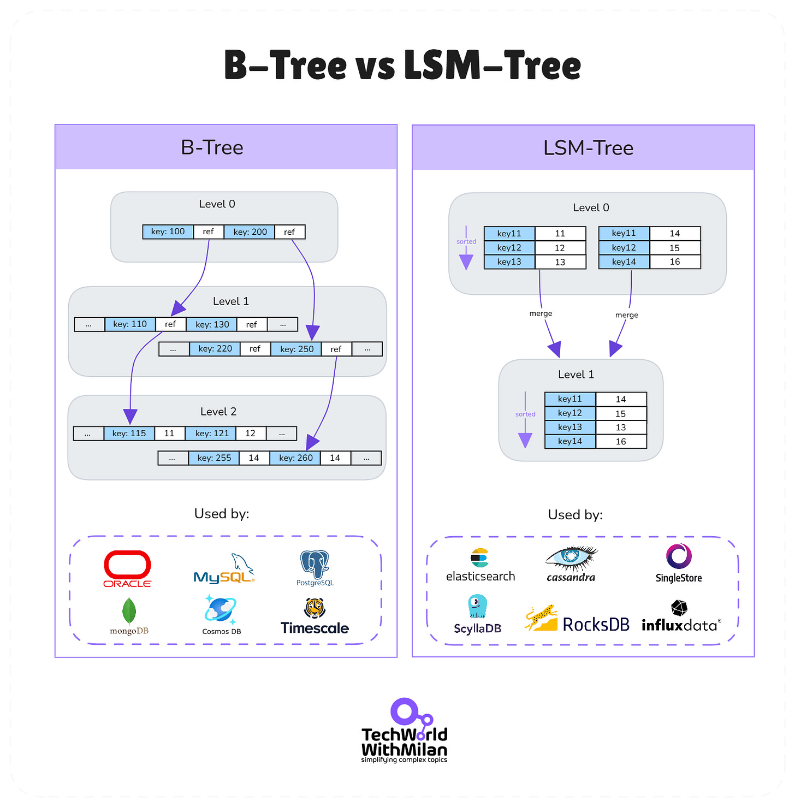](https://substackcdn.com/image/fetch/$s_!PCBo!,f_auto,q_auto:good,fl_progressive:steep/https%3A%2F%2Fsubstack-post-media.s3.amazonaws.com%2Fpublic%2Fimages%2F523aaf9f-2d01-480b-b1a5-dc94bc932e10_1520x1543.png)**B-Tree vs. LSM-Tree**: B-trees (used in MySQL, PostgreSQL, etc.) favor quick reads with in-place updates, while LSM-trees (used in Cassandra, RocksDB, etc.) favor fast sequential writes and background compaction

This was interesting because it explains why something like **[Apache Cassandra](https://cassandra.apache.org)** chooses an LSM-tree architecture. Cassandra’s storage engine is based on log-structured merges. It writes to an in-memory table and an append-only log, then periodically flushes sorted data to disk and compacts it in the background.

This design achieves excellent write performance on commodity hardware, as Cassandra emphasizes, at the cost of read amplification (reads must check multiple SSTable files).  Hence, [Cassandra](https://cassandra.apache.org/doc/latest/cassandra/architecture/storage-engine.html) and [CockroachDB](https://www.cockroachlabs.com/docs/stable/architecture/storage-layer) use Bloom filters and data summaries to maintain fast reads.

> ➡️ **What are Bloom filters?** *A Bloom filter is a compact, probabilistic data structure that allows fast checking if an element is in a set. Because it stores only bits, it needs far less memory than a full set and provides constant-time lookups. Yet it can occasionally produce false positives.*
> 
> [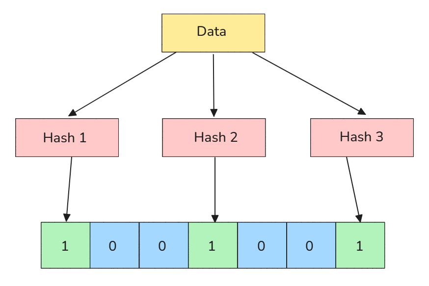](https://substackcdn.com/image/fetch/$s_!Zf9t!,f_auto,q_auto:good,fl_progressive:steep/https%3A%2F%2Fsubstack-post-media.s3.amazonaws.com%2Fpublic%2Fimages%2Ff5a21979-696d-4b04-ac64-041c98a96a00_874x583.png)Bloom filters

Meanwhile, a traditional RDBMS like [PostgreSQL](https://www.postgresql.org) updates data pages in place on disk (B-tree), which can be slower for a burst of random writes but makes reads simple (each piece of data has one home).

The book also discusses other [indexing structures](https://sqlity.net/en/2445/b-plus-tree/) (hash indexes, secondary indexes, full-text indexes, etc.), but the B-tree vs LSM-tree was the big takeaway for me.

It’s a classic example of trade-offs: **LSM-trees achieve writes faster by turning random writes into sequential writes, at the cost of more complex reads and background compaction work**. B-trees trade off some write performance to make reads as efficient as possible with one-disc seek to find a record.

Now I understand why a database like **[RocksDB](https://rocksdb.org)** (an embeddable key-value store developed by Facebook, based on LSM trees) is favored for write-heavy workloads, or why *Cassandra* can handle high ingest rates. In contrast, MySQL might struggle without caching.

> 📝*The book also covers **storage engine optimizations** like how some DBs use **copy-on-write B-trees** or **append-only** techniques to improve consistency, and how **compression** and **buffer caches** come into play.*
> 
> 📗 *A good further reading on this topic is the book "**[Database Internals](https://amzn.to/4kFTqvV)**" by Alex Petrov. Petrov's book provides the implementation details that Kleppmann omits.*

### Designing for evolvability: Schemas and Data flow

Another aspect I appreciated is the coverage of **data encoding and schema evolution** (from Chapter 4). The book discusses formats such as JSON, XML, and binary protocols (Thrift, Protocol Buffers, Avro), as well as the need for **backward and forward compatibility** when services communicate or when data is stored long-term.

It shows how using explicit schemas and versioning can make applications **forward-compatible** (e.g., new code can still read old messages, and vice versa). I learned the value of **schema registries** and format evolution – for instance, how [Avro’s](https://avro.apache.org)approach, with a writer schema and reader schema, allows data to be interpreted even as the schema evolves, as long as the changes are compatible.

Why is this in a book about data-intensive apps? Because **data outlives code**. If you deploy an update that changes how data is structured, you can’t just invalidate all old data or require everything to update in lockstep.

The table below compares JSON, XML, and Binary formats.

[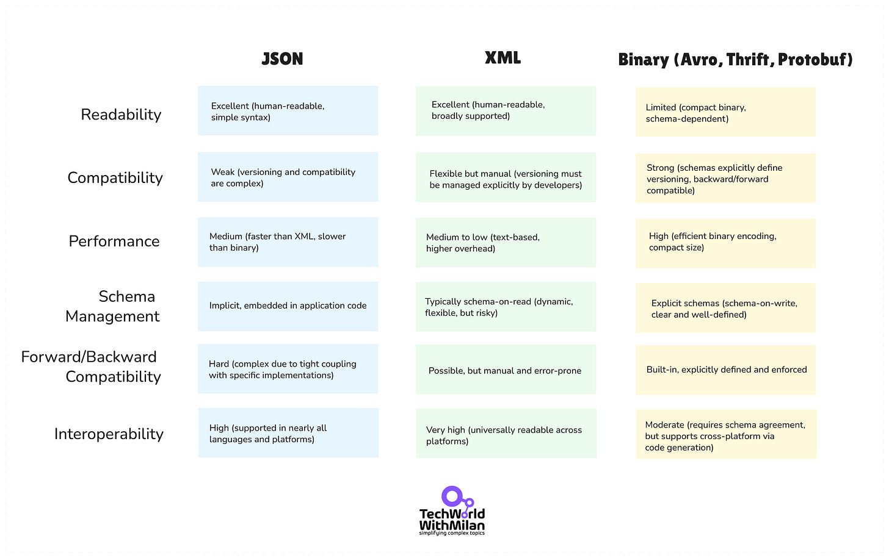](https://substackcdn.com/image/fetch/$s_!F6tb!,f_auto,q_auto:good,fl_progressive:steep/https%3A%2F%2Fsubstack-post-media.s3.amazonaws.com%2Fpublic%2Fimages%2F8e62db59-847a-4096-8f06-bb1571c462b5_3133x1968.png)JSON vs XML vs Binary formats

### Distributed systems concepts 🔗

The second part of this book (Part II) **delves deeply into distributed data systems, which fascinate me as an architect**.  It discusses replication, partitioning (also known as sharding), transactions, and consistency models.

There are a number of things that can be learned from this, as this is the heart of the book; therefore, I will select a number of things that caught my attention:

#### Replication strategies

DDIA describes how to implement data replication across multiple nodes for fault tolerance and scaling reads. It covers **leader-follower or single-leader replication**, where one node acts as the leader or primary for handling write operations, and another set of nodes serves as followers or replicas.

It is used in many systems (PostgreSQL, MySQL, MongoDB, and so on). It provides a consistent ordering of writes (since only one leader writes them).

I liked how the book described the **trade-off between synchronous replication and asynchronous replication.** Synchronous replication means the leader waits until followers acknowledge write operations, whereas in asynchronous replication, the leader lags behind the followers and remains highly available.

It was a good refresher about why we sometimes see lag in replication and stale reads for followers.

[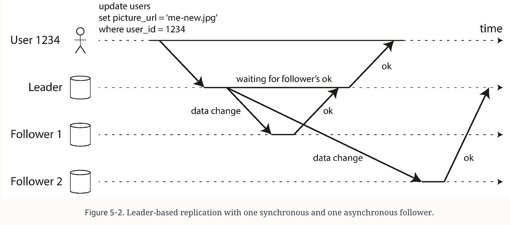](https://substackcdn.com/image/fetch/$s_!fiKB!,f_auto,q_auto:good,fl_progressive:steep/https%3A%2F%2Fsubstack-post-media.s3.amazonaws.com%2Fpublic%2Fimages%2F2b411645-fc7f-4c7c-9195-7bbfd2b5ddc3_1680x744.png)Leader-based replication (Credits: Author)

The book also covers **multi-master setups** (where multiple nodes can accept writes).   This may be helpful for geographically distributed databases (where each data center has a local leader) and for some offline-enabled apps.

Nonetheless, it entails the giant pain of **write conflicts**, where two leaders might accept conflicting writes at the same time. The DDIA describes how to address write conflicts and concludes that, while a multi-leader replication strategy fulfills its requirements, it will rarely be justified.

I gained insight into why systems like PostgreSQL and MongoDB use single-leader replication by default, while multi-leader scenarios like Active-Active remain largely relegated to special use cases or custom-built apps (for example, in Google Docs’ collaboration features).

Towards the end of Chapter 5, the author also discusses leaderless replication. This is the model used by [Cassandra](https://aws.amazon.com/keyspaces/what-is-cassandra/) and [Voldemort](https://github.com/voldemort/voldemort): there is no single leader; any replica can accept writes, and they use **quorum for consistency**.

The book describes how **quorum reads/writes** work: e.g., with *N* replicas, you might require any *W* of them to acknowledge a write and *R* of them to respond to a read, such that *W + R > N* ensures at least one up-to-date copy is read. This yields ***eventual consistency***, a concept that the book explains in great detail.

[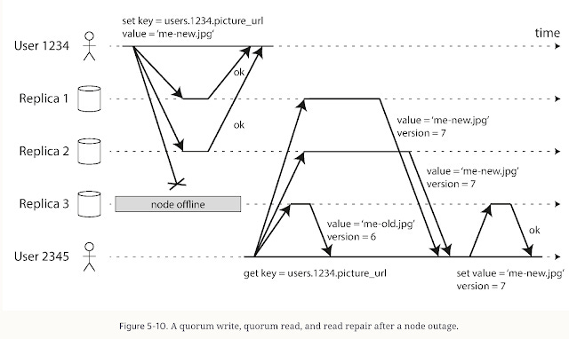](https://substackcdn.com/image/fetch/$s_!rEWt!,f_auto,q_auto:good,fl_progressive:steep/https%3A%2F%2Fsubstack-post-media.s3.amazonaws.com%2Fpublic%2Fimages%2Faabae476-49cd-40a3-a946-e48169e255f4_640x382.png)A quorum write (Credits: Author)

I also found the discussion of **sloppy quorums. I hinted at handoffs,** interesting (where writes can be accepted by fewer nodes than the quorum to ensure high availability, at the cost of increased inconsistency risk). Sloppy quorums are particularly useful for increasing write availability.

All in all, it demystified how systems like Cassandra achieve high availability and write throughput by sacrificing strict consistency. The trade-off: you, the developer, now have to consider consistency issues (such as read-repair and tombstones).

Eventual consistency as a comic book ([Source](https://www.dupuis.com/imbattable/bd/imbattable-tome-1-justice-et-legumes-frais/70978))

#### Sharding (Partitioning)

The book covers **partitioning** data across nodes to handle large data sets. It details two central partitioning schemes: **range partitioning** (each shard handles a contiguous key range) and **hash partitioning** (keys are hashed to shards).

**Range partitioning** can lead to hotspots if data isn’t uniform (e.g., all recent timestamps go to one shard), whereas hashing usually distributes load more evenly at the cost of losing locality (you can’t easily do range queries without touching many shards).

The image below shows the difference between Range and Hash partitioning.

[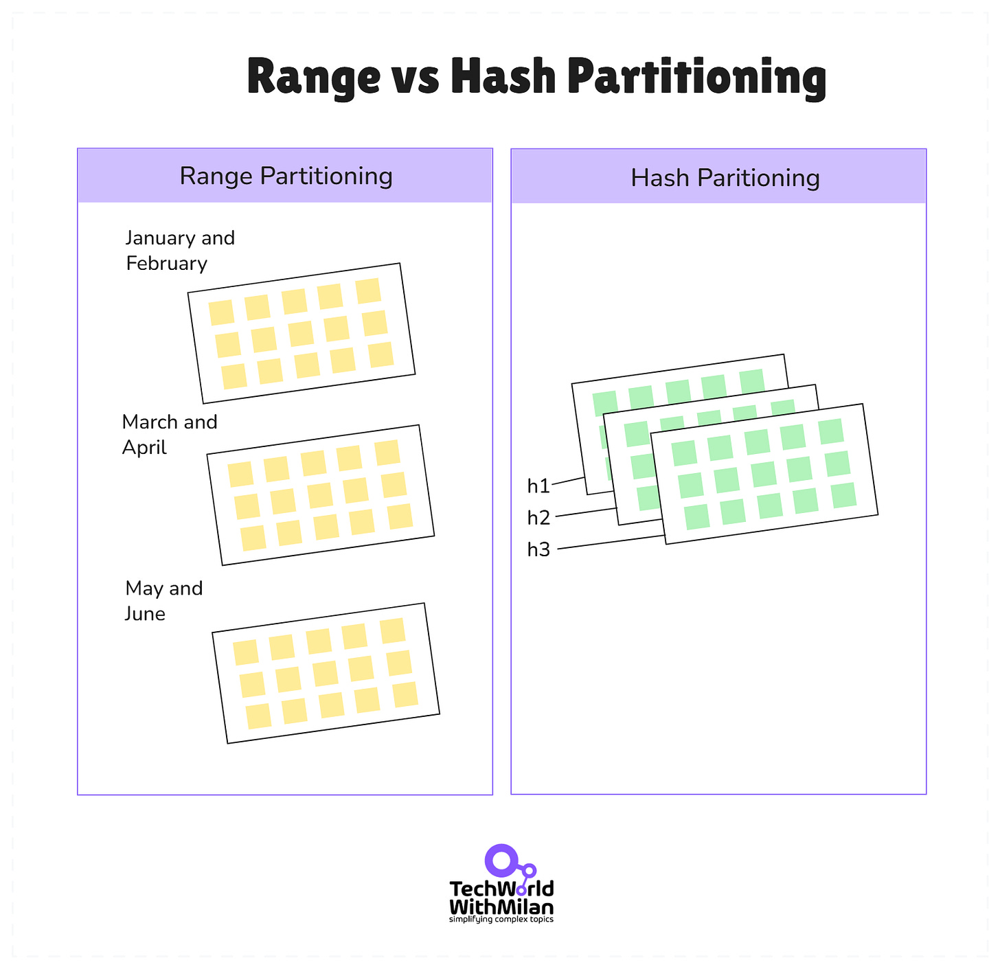](https://substackcdn.com/image/fetch/$s_!ULpP!,f_auto,q_auto:good,fl_progressive:steep/https%3A%2F%2Fsubstack-post-media.s3.amazonaws.com%2Fpublic%2Fimages%2Fd2ff93f3-8a46-4965-b090-74c8403817bb_1575x1526.png)Range vs Hash partitioning

An “aha” moment for me was the explanation of how *secondary indexes* work in a sharded database. Either each shard maintains a local index (and a query must scatter to all shards), or you have a distributed index structure that itself must be partitioned. It’s a tricky problem, and it has given me even more respect for systems like [Elasticsearch](https://www.elastic.co/elasticsearch) or [MongoDB,](https://www.mongodb.com/) which provide secondary indexes on sharded data.

The key lesson is that **sharding is essential for scalability. Still, it adds complexity**, from determining the right partition key to rebalancing shards when a node is added, to handling multi-shard queries (scatter/gather).

#### Transactions and consistency models

In distributed systems, concepts like **consistency models,** **linearizability, serializability, snapshot isolation,** and the famous **CAP theorem** often confuse engineers. DDIA did a great job clarifying these.

If you’ve spent significant time building or designing database-backed systems, transactions are likely something you've both loved and hated. Chapter 7 of *Designing Data-Intensive Applications* addresses the role of transactions in distributed systems.

People often say you must abandon transactions to achieve performance or scalability, but Kleppmann argues that’s not true. While multi-object transactions can be challenging in distributed settings, transactions themselves remain critical for many correctness guarantees.

Transactions are usually explained in terms of database **ACID properties**:

- **Atomicity**.  Events within a transaction all occur, or none do.
- **Consistency**. The database is maintained in a “valid state,” although it's typically the application that defines what "valid" means.
- **Isolation**. Concurrent transactions don't interfere with or see each other's partial results.
- **Durability**. Once committed, the data is persisted and recoverable.

Almost all storage engines support **single-object atomicity and isolation**, usually using write-ahead logging and locking. The real complexity lies in **multi-object transactions**, particularly across partitions, which is why many distributed databases avoid them.

[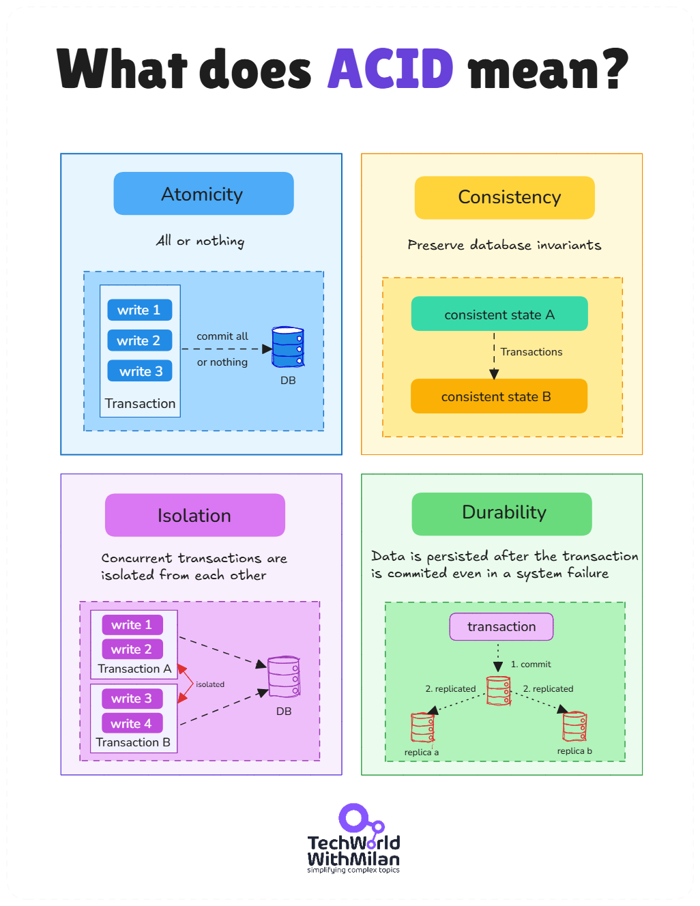](https://substackcdn.com/image/fetch/$s_!73Da!,f_auto,q_auto:good,fl_progressive:steep/https%3A%2F%2Fsubstack-post-media.s3.amazonaws.com%2Fpublic%2Fimages%2Fcd0889e2-d170-496b-b0d1-39725974e662_1026x1328.png)ACID transactions

To improve performance, many databases don’t guarantee complete isolation out of the box. Instead, they provide weaker guarantees, such as Read Committed or Snapshot Isolation:

- **Read Committed Isolation**. Only defends against basic problems, such as dirty reads and dirty writes, but provides no protection against more subtle ones, such as read skew (where different queries in a transaction see different snapshots of committed data).
- **Snapshot Isolation**. A consistent point-in-time snapshot mitigates many of the problems associated with read skew. However, even snapshot isolation isn’t perfect; it cannot completely defend against all concurrency anomalies, such as lost updates or write skew.

Common **race conditions** Kleppmann points out include the

- **Lost Updates**. When concurrent transactions overwrite each other's updates. Solutions range from atomic increment operations to explicit locks (`SELECT ... FOR UPDATE`), or optimistic concurrency controls, such as compare-and-set.

[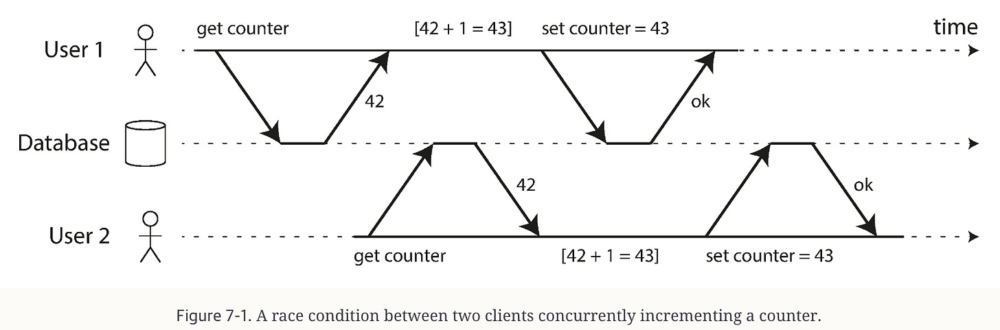](https://substackcdn.com/image/fetch/$s_!UDyQ!,f_auto,q_auto:good,fl_progressive:steep/https%3A%2F%2Fsubstack-post-media.s3.amazonaws.com%2Fpublic%2Fimages%2F3983155f-b2b3-4d84-8211-22d991676a1d_1670x552.png)A race condition between two clients concurrently implementing a counter (Credits: Author)
- **Write Skew and Phantom Reads**. Subtle problems arising from concurrent updates with erroneous business logic result. Serializable isolation levels are required here.

Though lower isolation levels can improve performance, they come with tricky concurrency bugs that are notoriously difficult to discover and debug. Kleppmann emphasizes the need for the highest isolation level, namely **Serializable isolation**.

There are various ways to achieve serializable isolation:

- **Actual serial execution**. Just execute transactions one at a time in a single thread. Surprisingly effective on modern hardware with fast in-memory databases and short transactions, but does not saturate a single CPU.
- **Two-Phase Locking (2PL)**. Relies heavily on shared and exclusive locks to ensure transaction integrity. This protocol is quite robust, but it can cause performance bottlenecks because of lock contention and deadlocks.
- **Serializable Snapshot Isolation (SSI)**. This is another quite new optimistic method of concurrency control. SSI doesn’t block immediately; it checks for conflicts only when transactions commit. So there are fewer unnecessary aborts. This was proposed in [Michael Cahill’s PhD](https://dl.acm.org/doi/10.1145/1620585.1620587) thesis in 2008.

[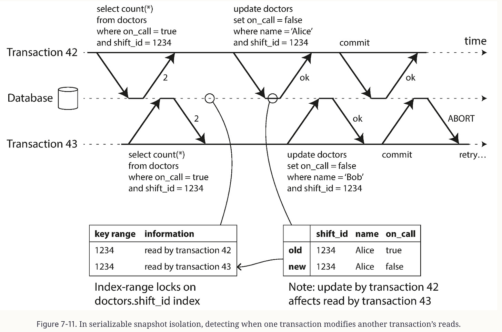](https://substackcdn.com/image/fetch/$s_!B9ng!,f_auto,q_auto:good,fl_progressive:steep/https%3A%2F%2Fsubstack-post-media.s3.amazonaws.com%2Fpublic%2Fimages%2F2bf95cfb-d956-4595-bf19-4e4cbf4d68f9_1706x1130.png)Seriazible Snapshot Isolation (Credits: Author)

The image below shows consistency models and isolation levels.

[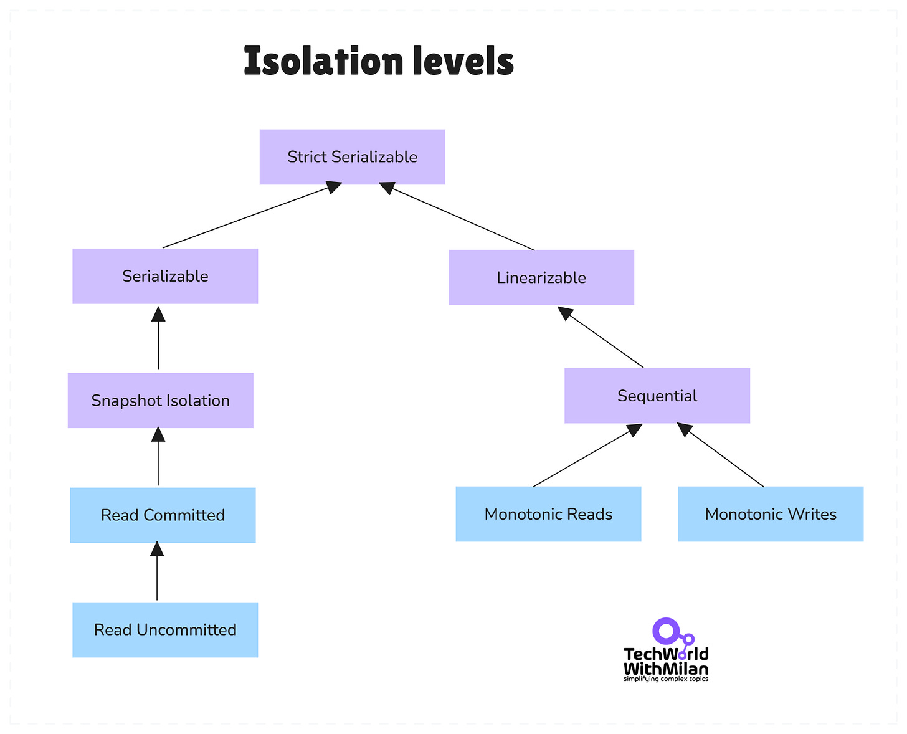](https://substackcdn.com/image/fetch/$s_!HCM3!,f_auto,q_auto:good,fl_progressive:steep/https%3A%2F%2Fsubstack-post-media.s3.amazonaws.com%2Fpublic%2Fimages%2F08551a60-04ae-45c4-bf96-5d2923178993_1757x1421.png)Isolation levels (Read more **[here](https://sergeiturukin.com/2017/06/29/eventual-consistency.html)**and **[here](https://jepsen.io/consistency/models)**)

Chapter 9 explains that **linearizability** (usually called “strong consistency”) is essentially the guarantee that every operation appears to execute atomically in some global order - it’s what you’d want for something like “read-after-write” always to return the latest write.

However, achieving linearizable reads across distributed replicas incurs a performance and availability cost (**[the CAP theorem](https://en.wikipedia.org/wiki/CAP_theorem)**: you trade availability under partitioning for linearizability). The book uses CAP to explain why systems like Dynamo prioritize availability and partition tolerance over consistency, whereas systems like ZooKeeper prioritize consistency over availability.

[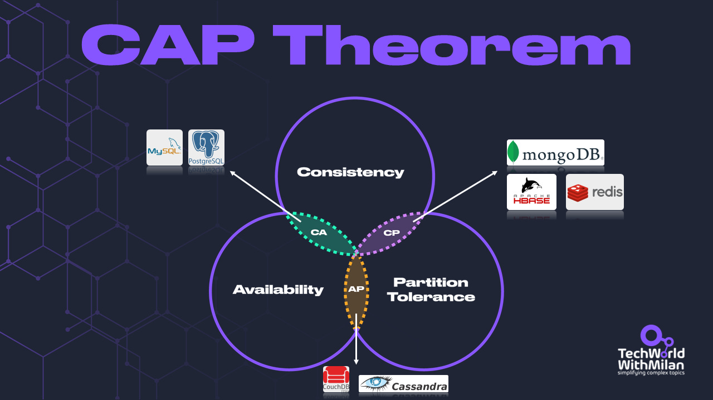](https://substackcdn.com/image/fetch/$s_!aLCj!,f_auto,q_auto:good,fl_progressive:steep/https%3A%2F%2Fsubstack-post-media.s3.amazonaws.com%2Fpublic%2Fimages%2F5e86cab9-9a33-46fe-a78c-6a1eb0688c8d_1280x720.png)The CAP Theorem

> ℹ️ **What is [CAP Theorem](https://en.wikipedia.org/wiki/CAP_theorem)?***CAP theorem is an important term in distributed systems and databases in general. CAP theorem is composed of the acronym CAP, where C stands for “Consistency,” A stands for “Availability,” and P stands for “Partition Tolerance.” These are characteristics that can be attained in distributed systems. However, the CAP theorem says that it is impossible to achieve all three characteristics simultaneously in a distributed system. For instance, let’s consider building a system that ensures all reads see the latest write (Consistency) and still functions even if the network fails (Partition Tolerance).*
> 
> ➡️ *Check the authors’ critiques of the CAP theorem in [this article](https://arxiv.org/abs/1509.05393).*

It also distinguishes **serializability** (an isolation property for transactions) from linearizability (a consistency property for reads and writes on single objects). A subtle point that many, including myself, weren’t super clear on before.

The treatment of **consensus algorithms** (such as [Raft](https://raft.github.io/) and [Paxos](https://www.scylladb.com/glossary/paxos-consensus-algorithm/)) was also approachable.

By the end, I had a better intuitive sense of how leaders are elected and why distributed systems require consensus for tasks like atomic commits.

#### **Troubles with Distributed Systems**

One of the chapters I found especially valuable addresses common problems in distributed systems. We know that distributed systems promise scalability, reliability, and high availability; however, anyone who has built one also knows they have many challenges.

Kleppmann calls this out directly: unlike single-node systems (which typically either work entirely or fail), distributed systems can experience **partial failures**, where parts of the system break while the rest continue to work, often unpredictably.

Here are the key insights and lessons from this chapter:

- **Faults, Partial Failures, and Nondeterminism**. Distributed systems are fundamentally nondeterministic. Nodes can fail silently, networks can drop messages, and software can behave unpredictably. Partial failures aren't just common, they're the norm. This unpredictability makes building distributed systems inherently more difficult.
- **Networks are unreliable (and always will be)**. The reality of modern networks is that they're asynchronous packet networks. That means messages sent between nodes come with **no delivery guarantees**; packets can be delayed, dropped, or duplicated. Usually, we handle these problems with timeouts and chaos testing (as seen on [Netflix’s Chaos Monkey](https://netflix.github.io/chaosmonkey/)).
- **Clocks are unreliable.**The next important, subtle topic: clocks in different nodes become desynchronized. Kleppmann explains the two types of clocks succinctly:

- **Time-of-day clocks** (wall-clock time):  Such clocks can rewind and advance irregularly due to [NTP adjustments](https://en.wikipedia.org/wiki/Network_Time_Protocol), making them unsuitable for timing tasks or event sequencing.
- **Monotonic clocks**: They never move backward, making them perfect for timing the duration of things like request or response timeouts.

If precise synchronization is crucial (e.g., ordering transactions globally), tools like **[Google's TrueTime API](https://static.googleusercontent.com/media/research.google.com/en//archive/spanner-osdi2012.pdf)**, used in **[Spanner](https://cloud.google.com/spanner)**, become critical; however, they're also costly and complex. Therefore, it is essential not to blindly trust timestamps across nodes; if your logic relies on precise timing, you're likely to encounter trouble.
- **Leader election**. Many distributed systems rely on electing a "leader" node to coordinate operations. But there is a challenge. Due to network partitions or delayed messages, multiple nodes may simultaneously think they’re the leader, a dreaded situation known as "**split-brain**." The book recommends using **fencing tokens** to mitigate this. This is addressed in the book through the adoption of fencing token techniques, in which each time the leader is elected, a new token is shared with Konsensus nodes, rendering old leaders increasingly useless.

[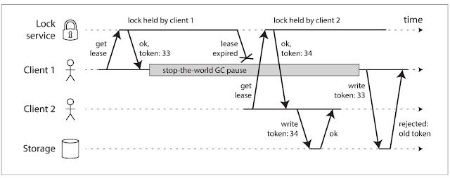](https://substackcdn.com/image/fetch/$s_!qeab!,f_auto,q_auto:good,fl_progressive:steep/https%3A%2F%2Fsubstack-post-media.s3.amazonaws.com%2Fpublic%2Fimages%2F6a904b9f-1b70-4a22-adf9-33a354c90660_640x254.png)Check-write problem that fencing tokens solve (Credits: Author)
- **Byzantine faults**. The normal assumption in most distributed systems is that nodes will act honestly and function correctly, or fail. Kleppmann goes further and considers a more challenging case known as “Byzantine faults,” in which nodes act maliciously or corrupt each other's data. A system that needs resilience against Byzantine faults typically relies on so-called **Byzantine Fault Tolerant (BFT) algorithms,** which incur high costs and system complexity.

> *"A system is Byzantine fault-tolerant if it continues operating correctly even when some nodes lie."*
- **Correctness in distributed algorithms.** Lastly, the chapter introduces two characteristics that can help in understanding accuracy in distributed algorithms:

- **Safety (”nothing bad happens”):**This must always hold. For example, the fencing tokens must be distinct.
- **Liveness ("something good eventually happens")**: For example, "eventually receiving a response." Liveness may have conditions, e.g., provided a network partition eventually heals.

Violations of safety can have disastrous, irreparable effects; violations of liveness might have temporary, repairable consequences. When choosing or developing algorithms, it’s critical to have a full grasp of these differences, aiming for rigour (safety) and pragmatism (liveness) in equal measures.

> *This chapter reminds me a lot of the **Fallacies of Distributed Computing**. Read more about it **[here](https://newsletter.techworld-with-milan.com/i/148912953/fallacies-of-distributed-computing)**.*

[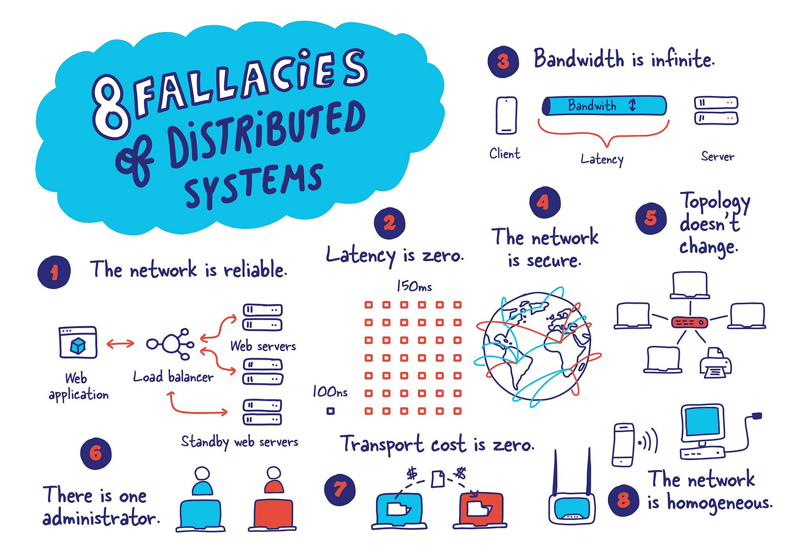](https://substackcdn.com/image/fetch/$s_!k4rj!,f_auto,q_auto:good,fl_progressive:steep/https%3A%2F%2Fsubstack-post-media.s3.amazonaws.com%2Fpublic%2Fimages%2F40e449e3-86c6-417a-ade1-277497182c28_2000x1414.jpeg)8 Fallacies of Distributed Systems (Credits: Mahdi Yusuf)

### The power of streams

The last part of DDIA focuses on **derived data** and data processing pipelines, specifically, **batch processing** (similar to Hadoop) and **stream processing** (similar to Kafka or Spark Streaming). I found this section highly pertinent to the current trend of real-time data pipelines in our field.

Kleppmann discusses the batch and stream models very effectively, stating that, at a basic level, many data systems can be reduced to **logging**.

- **Batch processing.** The book uses *MapReduce* and the Unix tool philosophy to explain batch jobs. Batch processing operates on large data sets but doesn’t provide immediate results – it’s about throughput over latency. For example, a nightly job might aggregate log files into a report. We measure batch jobs by**throughput (records per second) or by total time to process a dataset**. One superb example in the book is constructing a simple data pipeline with Unix pipes (grep, sort, etc.) and showing how that inspires distributed frameworks like Hadoop’s MapReduce. The key points are that batch jobs **read from a data source, process data in bulk, and output to another**location; these jobs are often scheduled to run periodically. They are great for large-scale analytics where a few minutes or hours of delay is acceptable.
- **Stream processing.** In contrast, stream processing processes data **event-by-event** in real time (or near real time). Instead of processing a million records after the fact, a stream processor processes events *continuously* as they occur (e.g., user actions on a website to update a real-time dashboard or trigger alerts). The benefit is **low latency** – you don’t have to wait for a scheduled job, you get insights or trigger actions immediately. However, stream processing is typically more complex to implement reliably (you deal with issues like exactly-once processing, out-of-order events, etc., which the book does touch on). Note that the book's presentation of exactly-once semantics is overly simplified.

What I loved is how the book ties stream processing to the earlier concepts. For instance, the log abstraction reappears: **a database’s change log can be viewed as a stream of events**. This is the idea behind **Change Data Capture (CDC)**, where changes in a database are captured and streamed to other systems for processing.

[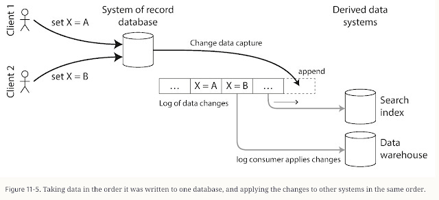](https://substackcdn.com/image/fetch/$s_!jtP8!,f_auto,q_auto:good,fl_progressive:steep/https%3A%2F%2Fsubstack-post-media.s3.amazonaws.com%2Fpublic%2Fimages%2F5a2334d6-5941-4caf-b2ed-0ed09489e9d8_640x292.png)Change Data Capture process (Credits: Author)

Kleppmann gives an example: you can stream database updates to a search index or cache, rather than batch-syncing them occasionally. This is essentially how systems like **[Debezium](https://debezium.io/)** or **[LinkedIn’s Databus](https://github.com/linkedin/databus)** work. It blurs the line between “database” and “stream”: the replication log of your DB is feeding a real-time pipeline.

Similarly, the book describes **[Event Sourcing](https://martinfowler.com/eaaDev/EventSourcing.html)** – an architectural pattern where **state changes are logged as immutable events,** and the current state is derived by replaying the event log. Many modern systems (especially in fintech and CQRS architectures) use this pattern, and DDIA gives it context: it’s another flavor of the general **idea of treating your data as streams of events**.

The image below shows an example of the Event Sourcing pattern.

[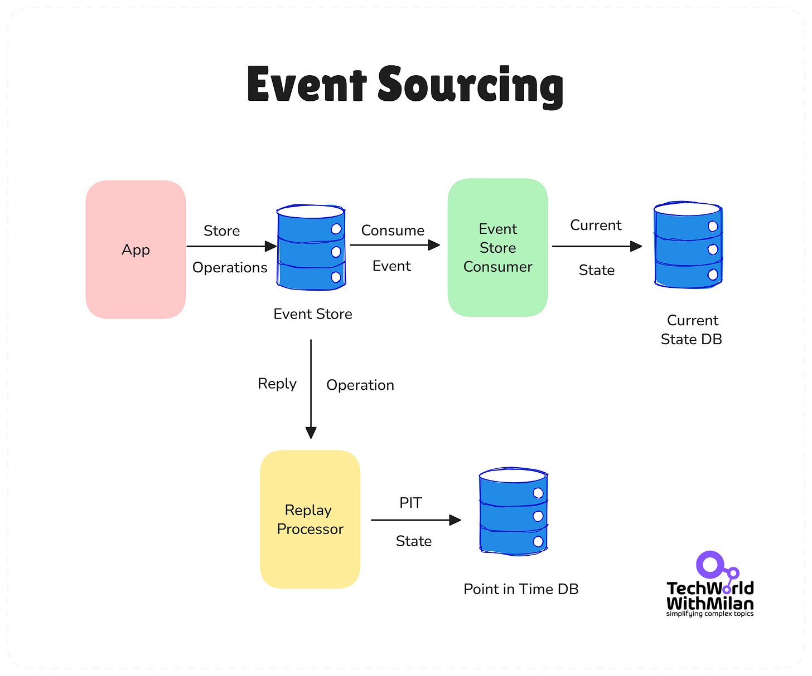](https://substackcdn.com/image/fetch/$s_!5qO-!,f_auto,q_auto:good,fl_progressive:steep/https%3A%2F%2Fsubstack-post-media.s3.amazonaws.com%2Fpublic%2Fimages%2Fa8e03f37-8c99-4b92-b67c-eeb024a23740_2145x1789.png)Event Sourcing

In addition, the book focuses on challenges, including handling out-of-order events in streams and addressing backpressure when producers outpace consumers. These were tackled conceptually.

It also provides details on the supporting tools, such as **message brokers** (**[RabbitMQ](https://www.rabbitmq.com/)**[https://www.rabbitmq.com/](https://www.rabbitmq.com/)and **[ActiveMQ](https://activemq.apache.org/)**), in contrast to log-based message brokers (**[Apache Kafka](https://kafka.apache.org) and** **[Amazon Kinesis](https://aws.amazon.com/kinesis/)**).

> ➡️ **Kafka** *is cited as a distributed log that enables high-throughput event processing. It would have been great to discuss stream processing engines in more detail (the book emerged just ahead of the mainstream recognition of Apache Flink, etc.).*
> 
> 💡*Fun fact: one of the book’s reviewers is **Jay Kreps (creator of Kafka)**, who praised how it “bridges the gap between theory and practice.”*

[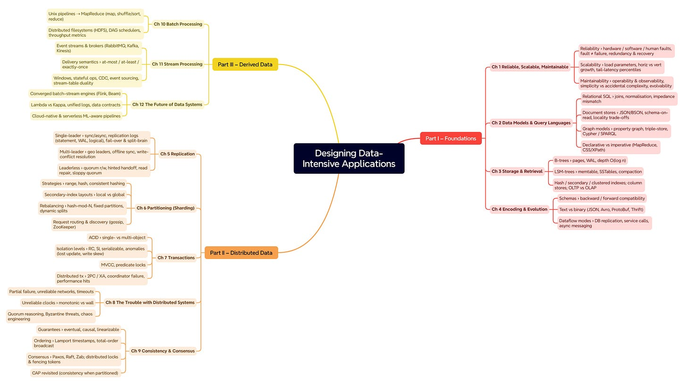](https://substackcdn.com/image/fetch/$s_!gaEy!,f_auto,q_auto:good,fl_progressive:steep/https%3A%2F%2Fsubstack-post-media.s3.amazonaws.com%2Fpublic%2Fimages%2Fc5b33167-d4c9-4c43-b589-2014d1e4ffcd_6619x3678.png)Designing Data-Intensive Applications Book Map

## **3. The things I didn’t like**

There are no flawless books. Though I highly recommend DDIA, I have a few concerns regarding its **limitations and shortcomings**:

### **Outdated examples**

The first edition of this book was published in 2017, but since then, technology has advanced further. For instance, there’s mention of Apache Kafka, which is today one of the central building blocks of many of the data systems described in this book. Examples from the book are up to 2016, which is almost a decade old for our field.

The more recent developments in cloud data warehouses, serverless architectures, stream processing (Flink), or data lakes are excluded. **The ideas in DDIA remain valid over time**, yet some details, such as technology or version numbers, in this case from 2025, appear slightly outdated. I am aware that the author maintains [updated versions](https://martin.kleppmann.com/) (and a [second edition is underway](https://www.oreilly.com/library/view/designing-data-intensive-applications/9781098119058/)).

Event mesh architectures and advanced CQRS implementations have become mainstream, with companies adopting "shock absorber" patterns and standardized event versioning strategies that build on DDIA's foundational concepts.

Still, the book itself does not include discussions of topics such as Kubernetes or the latest NewSQL or Vector databases, etc. It occasionally made me wonder, *“What about tool X that came out after 2019?”*

### **A lot of theory, less hands-on**

Depending on your learning style, this can be a pro or con. The book leans toward **conceptual explanations** over step-by-step tutorials or code. You won’t find ready-to-run examples or guidance on tuning a specific database.

For instance, it explains how a log-structured storage works in principle, but not how to configure Cassandra’s compaction strategy. I enjoyed the theory, but some readers might be hoping for a “how to build a scalable system” playbook with concrete recipes. DDIA is more like a textbook or reference – it gives you the mental models, not ready-to-use solutions.

**Chapter 9 (on consistency and consensus) is especially overloaded,** representing the book's most significant weakness, as it attempts to cover an entire semester of distributed systems content in a single chapter.

[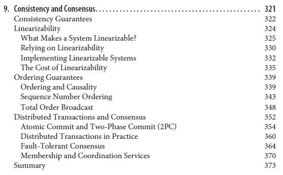](https://substackcdn.com/image/fetch/$s_!VKGL!,f_auto,q_auto:good,fl_progressive:steep/https%3A%2F%2Fsubstack-post-media.s3.amazonaws.com%2Fpublic%2Fimages%2F6910a812-5e3a-47f0-b581-66898cbdd0e5_556x344.png)Chapter 9 (DDIA book)

### **Breadth over depth**

The book is ambitiously broad, covering everything from low-level storage engines to high-level distributed algorithms. Sometimes I wondered **whether the author wanted to write about distributed systems or database engines**, since those are systems at entirely different levels of abstraction.

Also, some topics don’t delve too deeply. Each chapter could probably be a book in its own right (indeed, there are entire books on consensus algorithms or specific databases). For example, the section on **distributed transactions** introduces 2PC but doesn’t delve into newer approaches, such as SAGAs or specific cloud implementations.

I sometimes expected more details on challenging issues (such as exactly-once stream processing mechanisms or deeper performance case studies) or on events that point to simple implementations. The flip side is that the book stays focused and doesn’t get bogged down; however, readers expecting a deep dive into any single area might need to supplement with other resources.

### **Density**

This wasn’t a big issue for me, but I’ll note that DDIA is **long (500+ pages)** and dense with information. It’s not light bedtime reading for sure. The writing is clear, but it’s a lot to absorb - I had to read it in chunks and found myself re-reading some sections to understand it correctly (and take notes).

In terms of style, it’s pretty direct and matter-of-fact (it *is* an engineering book, after all). A bit more narrative or real-world case studies could add some spice.

If you already know a topic well, those parts might feel slow; if it’s new to you, you might need to pause and digest. Some parts I also needed to re-read and understand better.

In short, it’s a **comprehensive reference**, but not exactly a page-turner. Be prepared to invest some effort.

Despite these points, none of them are deal-breakers. The “outdated” aspects primarily concern examples (the principles remain solid). And the theoretical nature of the book is by design - it’s actually what makes it stay relevant years later.

[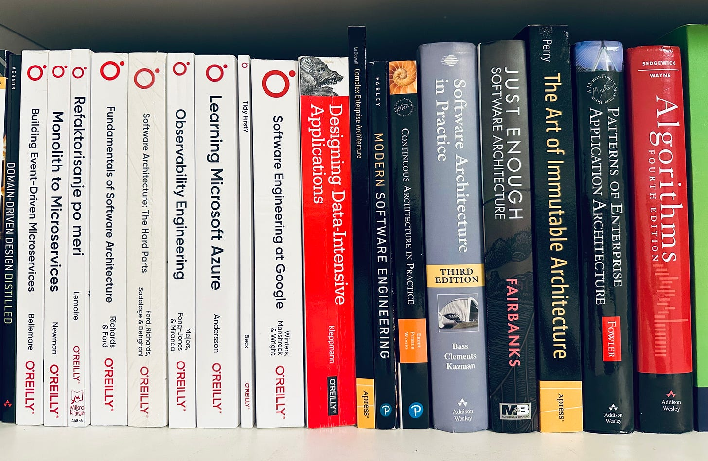](https://substackcdn.com/image/fetch/$s_!53Bj!,f_auto,q_auto:good,fl_progressive:steep/https%3A%2F%2Fsubstack-post-media.s3.amazonaws.com%2Fpublic%2Fimages%2F815ad30c-03b8-4e74-9014-e6d06969a5c6_4032x2631.jpeg)Part of my bookshelf

### Missing migration strategies

The book neither covers live migration scenarios nor topics like handling migrations with acceptable downtime, nor unnoticeable migrations using middleware components. Since migrations in real-world systems are common practice, they should be included in this book.

### Operational and monitoring gaps

The operational issues related to the system’s deployment are selectively addressed. Issues with operating the system may include replication errors, which are selectively addressed. The issue of updating the system schema is also addressed selectively. Data replication in the system is an important issue.

Furthermore, there is additional information on backup, restore, RPO/RTO that I did not consider for the whole system.

## **4. Recommendation**

To summarize this book, I offer the following recommendation.

### Who should read it

In summary, I **recommend** this book to **experienced software engineers, architects, and tech leads** (3-8 years of experience) who build or work with data-intensive systems. If you deal with databases, distributed systems, or large-scale data pipelines in your job, you’ll likely find significant value here.

Even if you have years of experience, DDIA will connect the dots and explain concepts deeply (it certainly did for me). I’d say it’s *essential reading* if you aspire to design systems at scale – it gives you a vocabulary and framework to make smarter decisions.

In my opinion, it is an excellent reference book for **prep and self-education**. If you’re preparing for a systems design interview or transitioning into a more architecture-focused role, it will level up your understanding.

### Who might not enjoy it

This is certainly **not the best book for developers or students without prior significant experience with distributed systems or databases**. Parts of it are indeed likely to be well above the heads of those who do not already understand concepts such as SQL versus NoSQL, or who do not have a basic understanding of computing systems. A determined beginner will still learn a great deal, but plan to look up unfamiliar terms and reread sections.

It can also be a bit demanding to trace too many references for full comprehension, with each chapter containing 30-50 references, making access more difficult for engineers transitioning into the domain from other categories.

If you’re looking for **immediate, practical how-tos (e.g., “How do I set up a Kubernetes cluster for Kafka?”)**, You won't find them here. It’s neither a cookbook nor a vendor-specific guide. And, if your work is far removed from data systems (say you’re a pure front-end developer or a data scientist focusing on modeling), you might not need this level of systems detail in your daily work.

Lastly, anyone who dislikes theory or is short on time for reading might struggle – the book requires your full attention.

In summary, DDIA is **not a lightweight overview**; it’s for those who want to *gain a deep understanding of* data system design. If that’s you, you’ll love it.

Here is a visual overview of**[my notes from the book](https://milan-milanovic.notion.site/Designing-Data-Intensive-Applications-Notes-by-Dr-Milan-Milanovic-1ac22f7b9a5f80eda8a0ebff46919989)**.

[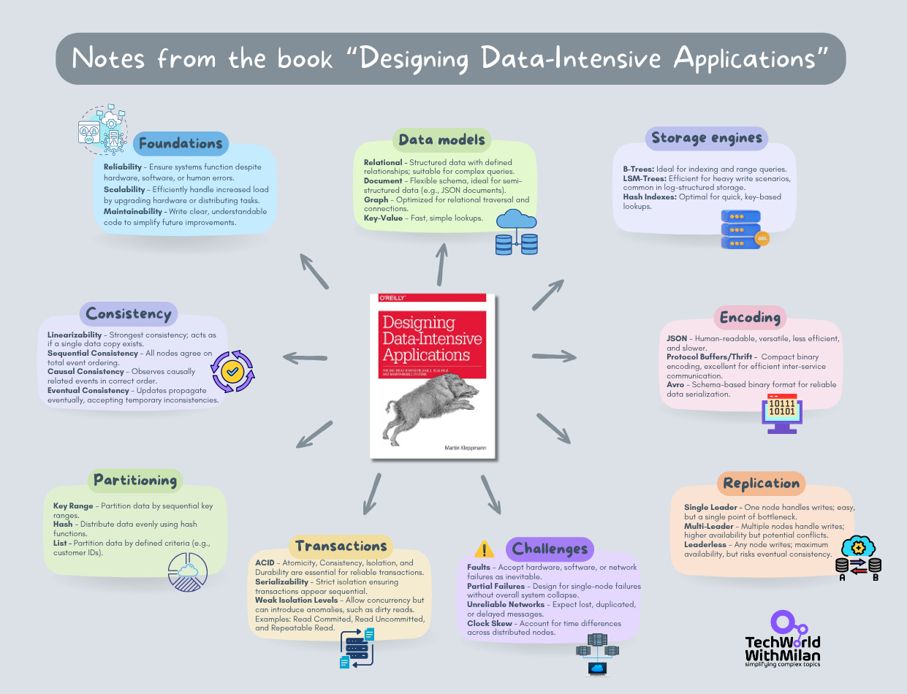](https://substackcdn.com/image/fetch/$s_!GKmH!,f_auto,q_auto:good,fl_progressive:steep/https%3A%2F%2Fsubstack-post-media.s3.amazonaws.com%2Fpublic%2Fimages%2F49052127-c868-4522-b120-f8a81995065b_1241x950.png)[Notes](https://milan-milanovic.notion.site/Designing-Data-Intensive-Applications-Notes-by-Dr-Milan-Milanovic-1ac22f7b9a5f80eda8a0ebff46919989) from the book “[Designing Data-Intensive Applications](https://amzn.to/3ZX4uMv)” by [Martin Klepmann](https://martin.kleppmann.com/)

## 5. Conclusion

In summary, the book gave me a more precise mental map of distributed data system design. It connects the dots between theory and real systems: e.g., how **Kafka’s** design of a replicated log is essentially a leader-based replication under the hood, or how **Cassandra’s** eventual consistency model is an implementation of leaderless quorum replication.

I came away with a deeper understanding of *why* specific systems make the choices they do. It’s now easier for me to reason about questions like *“Do we need a distributed transaction across services, or can we get away with eventual consistency?”* or *“Should we prefer a single primary database with failover, or a multi-region multi-master setup?”* because I can weigh the pros and cons more concretely (latency vs consistency vs complexity, etc.).

Those are some of the key points I carry away from *Designing Data-Intensive Applications*. The book both validated what I’d learned through experience *and* taught me new ways to think about problems I hadn't yet encountered.

**If you’re serious about building systems that handle lots of data, high traffic, or complex distributed workflows, this book is a must-read.** It packs a decade’s worth of hard-earned lessons (and research results) into one volume.

I know I’ll be reaching for it again, whether to double-check something about consistency models or to help decide between technologies for a new project.

For that sake, I created **a cheat sheet** below that you can use.

## **6.**Bonus: Key takeaways (Cheat Sheet) **📌**

Here are some key learnings that I noted from the book:

1. **🔧 Design for failure**. Assume things will fail. Use replication, retries, and graceful degradation. Faults aren't bugs; they're normal. Ensure there is no single point of failure.
2. **⏱️ Measure what matters (latency vs throughput).**Don't rely on averages, watch percentile latencies (p95, p99). Users notice the slowest requests, not averages. Optimize for latency or throughput clearly, based on your goals.
3. **🧩 Choose the right data model.**Match databases to your data:

- **🗄️ Relational DB** for complex joins and transactions.
- **📄 Document DB** for flexible schemas and self-contained records (like JSON).
- **🕸️ Graph DB** for highly interconnected data.
4. **⚙️ Understand your storage engine.**Pick carefully between:

- **🌳 B-tree databases** (Postgres, MySQL): great for fast reads, slower writes.
- **📝 LSM-tree databases** (Cassandra, RocksDB): excellent write performance, slower reads.
5. **🧭 Replication**. There are three replication models:

- **👑 Single-leader:** Simple, consistent, easy failover (standard default).
- **🌐 Multi-leader:** Complex, useful for multi-region writes, but challenging for conflict resolution.
- **🛡️ Leaderless:** Flexible, high availability, eventual consistency.

Clearly understand consistency-latency tradeoffs and have a failover plan.
6. **🗂️ Partitioning and data distribution:**

- **#️⃣ Hash partitioning:** Even distribution, fast point lookups, but poor range queries.
- **📏 Range partitioning**is suitable for range queries, but it risks creating hotspots.

Be careful with cross-shard operations. Automate rebalancing and choose partition keys wisely.
7. **🔒 Use transactions wisely**. Transactions (ACID) ensure correctness but add complexity in distributed systems. Avoid using distributed transactions unless necessary; use simpler alternatives, such as sagas, for cross-service workflows.
8. **📩 Embrace Event-Driven architecture (when appropriate)**. Use event logs (e.g., Kafka) to decouple services. Event-driven architectures improve scalability and simplify integration. Be prepared to handle eventual consistency.
9. **🛠️ Maintainability: simplicity and evolvability**. Keep systems as simple as possible. Prioritize observability, good metrics, and clear logs. Utilize schema versioning and implement backward-compatible changes to facilitate easier evolution over time.
10. **⚖️ Always weigh trade-offs**. No single perfect solution exists. Identify what you're optimizing (consistency vs. availability, latency vs. throughput, simplicity vs. performance). Make intentional, context-aware trade-offs rather than defaulting blindly.

[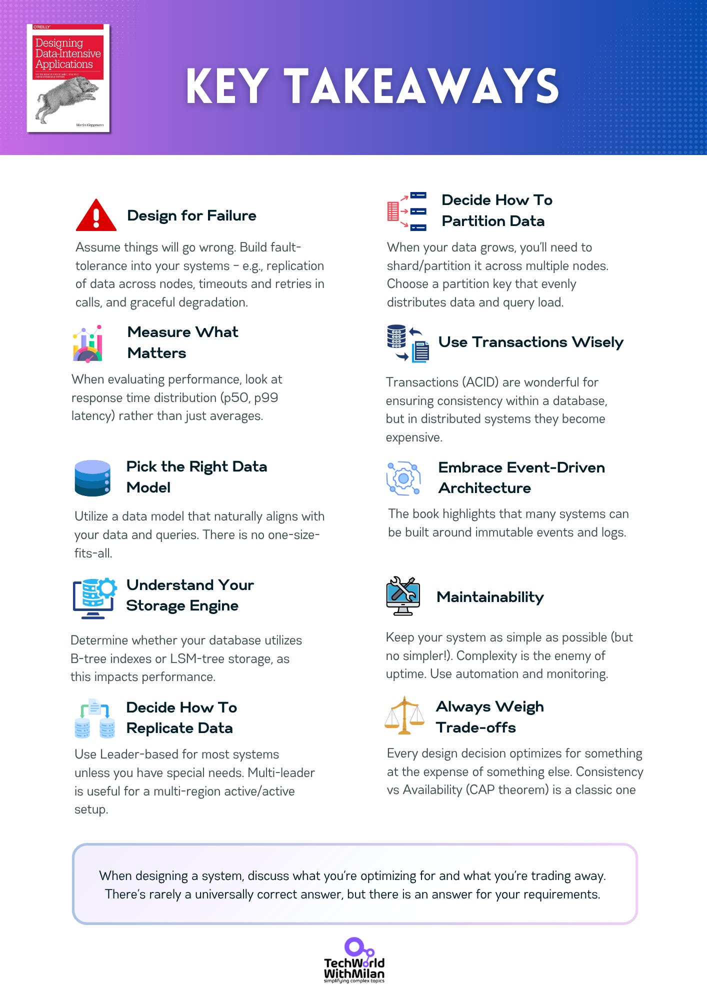](https://substackcdn.com/image/fetch/$s_!QJ_o!,f_auto,q_auto:good,fl_progressive:steep/https%3A%2F%2Fsubstack-post-media.s3.amazonaws.com%2Fpublic%2Fimages%2F242c47ea-6481-4ff9-a3e2-59c02fb2a623_1414x2000.png)Key takeaways from the book

Have you read DDIA? Tell me your biggest ‘aha’ below.

## 7. References

Further references can be found on:

1. **Martin Klepman's** [course](https://martin.kleppmann.com/2020/11/18/distributed-systems-and-elliptic-curves.html) on distributed systems and [YouTube channel,](https://www.youtube.com/@kleppmann) where he fills in the gaps from the book.
2. **Martin Kleppmann**, *[Designing Data-Intensive Applications: The Big Ideas Behind Reliable, Scalable, and Maintainable Systems](https://dataintensive.net/).*O’Reilly Media, 2017.
3. **Literature References**for the book. The [GitHub repo](https://github.com/ept/ddia-references) by **Martin Kleppmann**.
4. **Martin Kleppmann**, Chris Riccomini. *[Designing Data-Intensive Applications: The Big Ideas Behind Reliable, Scalable, and Maintainable Systems](https://www.oreilly.com/library/view/designing-data-intensive-applications/9781098119058/), 2nd edition,*O’Reilly Media, January 2026 (expected).
5. **My notes from the book** **in Notion**: [Link](https://milan-milanovic.notion.site/Designing-Data-Intensive-Applications-Notes-by-Dr-Milan-Milanovic-1ac22f7b9a5f80eda8a0ebff46919989?source=copy_link).
6. **[Knowledge refresher](https://milan-milanovic.notion.site/Knowledge-refresher-21722f7b9a5f80f69bfaf6a19c7bf9bd)** about the book, based on [my notes](https://milan-milanovic.notion.site/Designing-Data-Intensive-Applications-Notes-by-Dr-Milan-Milanovic-1ac22f7b9a5f80eda8a0ebff46919989?source=copy_link) (and as Anki cards).
7. **Alex Petrov**, *[Database Internals: A Deep Dive into How Distributed Data Systems Work](https://amzn.to/44n6Aaf)*. O’Reilly Media, 2019.
8. **Roberto Vitillo**, *[Understanding Distributed Systems: What every developer should know about large distributed applications](https://amzn.to/4kYkred)*, 2021.

---

## **More ways I can help you:**

- [📚](https://www.patreon.com/techworld_with_milan/shop/ultimate-net-bundle-for-2025-1519389?utm_medium=clipboard_copy&utm_source=copyLink&utm_campaign=productshare_creator&utm_content=join_link)**[The Ultimate .NET Bundle 2025](https://www.patreon.com/techworld_with_milan/shop/ultimate-net-bundle-for-2025-1519389?utm_medium=clipboard_copy&utm_source=copyLink&utm_campaign=productshare_creator&utm_content=join_link)** 🆕. 500+ pages distilled from 30 real projects show you how to own modern C#, ASP.NET Core, patterns, and the whole .NET ecosystem. You also get 200+ interview Q&As, a C# cheat sheet, and bonus guides on middleware and best practices to improve your career and land new .NET roles. **[Join 1,000+ engineers](https://www.patreon.com/techworld_with_milan/shop/ultimate-net-bundle-for-2025-1519389?utm_medium=clipboard_copy&utm_source=copyLink&utm_campaign=productshare_creator&utm_content=join_link)**.
- [📦](https://www.patreon.com/techworld_with_milan/shop/premium-resume-package-1721454?utm_medium=clipboard_copy&utm_source=copyLink&utm_campaign=productshare_creator&utm_content=join_link)**[Premium Resume Package](https://www.patreon.com/techworld_with_milan/shop/premium-resume-package-1721454?utm_medium=clipboard_copy&utm_source=copyLink&utm_campaign=productshare_creator&utm_content=join_link) 🆕**. Built from over 300 interviews, this system enables you to craft a clear, job-ready resume quickly and efficiently. You get ATS-friendly templates (summary, project-based, and more), a cover letter, AI prompts, and bonus guides on writing resumes and prepping LinkedIn. **[Join 500+ people](https://www.patreon.com/techworld_with_milan/shop/premium-resume-package-1721454?utm_medium=clipboard_copy&utm_source=copyLink&utm_campaign=productshare_creator&utm_content=join_link)**.
- [📄](https://www.patreon.com/techworld_with_milan/shop/complete-tech-resume-reality-check-311008?utm_medium=clipboard_copy&utm_source=copyLink&utm_campaign=productshare_creator&utm_content=join_link)**[Resume Reality Check](https://www.patreon.com/techworld_with_milan/shop/complete-tech-resume-reality-check-311008?utm_medium=clipboard_copy&utm_source=copyLink&utm_campaign=productshare_creator&utm_content=join_link)**. Get a CTO-level teardown of your CV and LinkedIn profile. I flag what stands out, fix what drags, and show you how hiring managers judge you in 30 seconds. **[Join 100+ people](https://www.patreon.com/techworld_with_milan/shop/complete-tech-resume-reality-check-311008?utm_medium=clipboard_copy&utm_source=copyLink&utm_campaign=productshare_creator&utm_content=join_link)**.
- [📢](https://www.patreon.com/techworld_with_milan/shop/short-linkedin-content-creator-311232?utm_medium=clipboard_copy&utm_source=copyLink&utm_campaign=productshare_creator&utm_content=join_link)**[LinkedIn Content Creator Masterclass](https://www.patreon.com/techworld_with_milan/shop/short-linkedin-content-creator-311232?utm_medium=clipboard_copy&utm_source=copyLink&utm_campaign=productshare_creator&utm_content=join_link)**. I share the system that grew my tech following to over 100,000 in 6 months (now over 255,000), covering audience targeting, algorithm triggers, and a repeatable writing framework. Leave with a 90-day content plan that turns expertise into daily growth. **[Join 1,000+ creators](https://www.patreon.com/techworld_with_milan/shop/short-linkedin-content-creator-311232?utm_medium=clipboard_copy&utm_source=copyLink&utm_campaign=productshare_creator&utm_content=join_link)**.
- [✨](https://www.patreon.com/c/techworld_with_milan)**[Join My Patreon](https://www.patreon.com/c/techworld_with_milan)**[https://www.patreon.com/c/techworld_with_milan](https://www.patreon.com/c/techworld_with_milan)**[Community](https://www.patreon.com/c/techworld_with_milan)**. Unlock every book, template, and future drop (worth over $100), plus early access, behind-the-scenes notes, and priority requests. Your support enables me to continue writing in-depth articles at no cost. **[Join 2,000+ insiders](https://www.patreon.com/c/techworld_with_milan)**.
- [🤝](https://newsletter.techworld-with-milan.com/p/coaching-services)**[1:1 Coaching](https://newsletter.techworld-with-milan.com/p/coaching-services)** – Book a focused session to crush your biggest engineering or leadership roadblock. I’ll map next steps, share battle-tested playbooks, and hold you accountable. **[Join 100+ coachees](https://newsletter.techworld-with-milan.com/p/coaching-services)**.

---

Thanks for reading Tech World With Milan Newsletter! Subscribe for free to receive new posts and support my work.