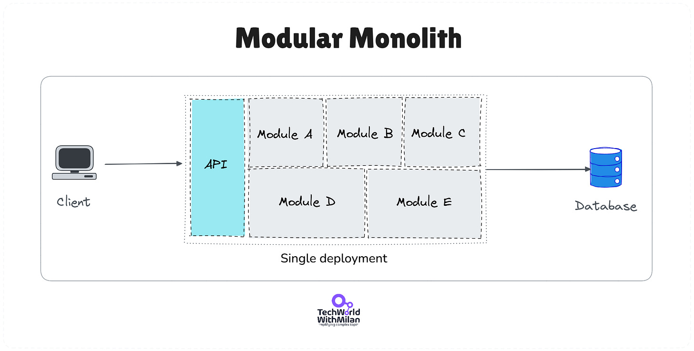
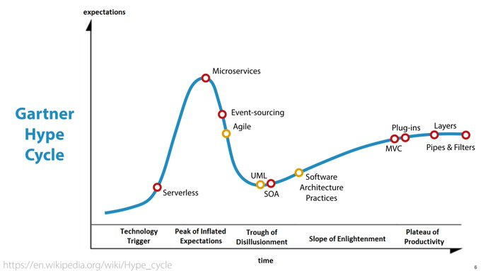
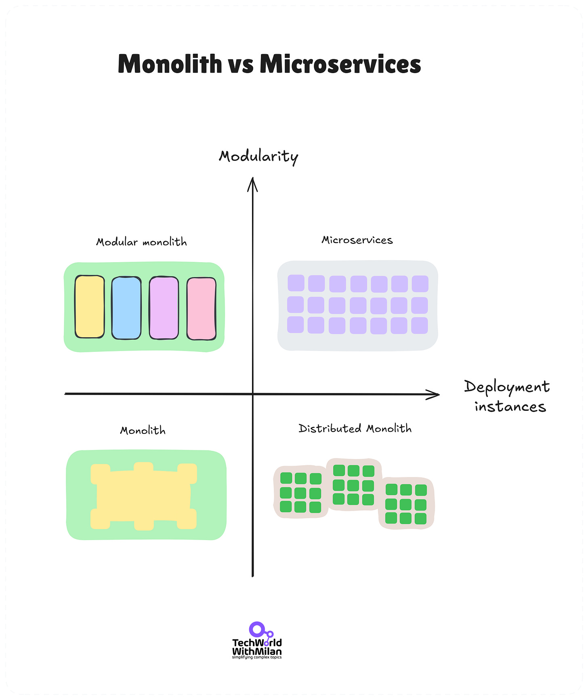
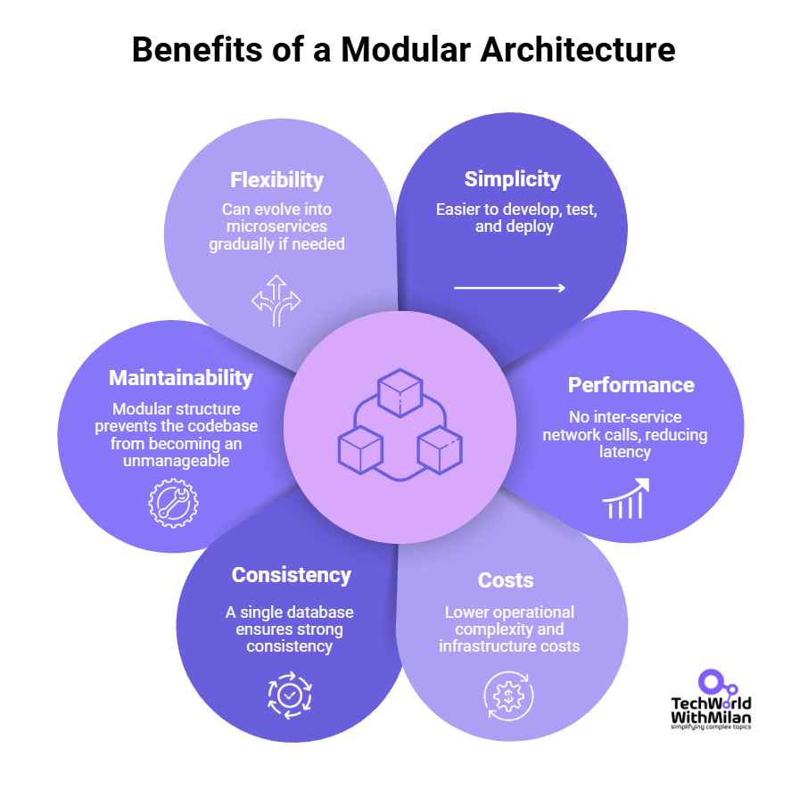
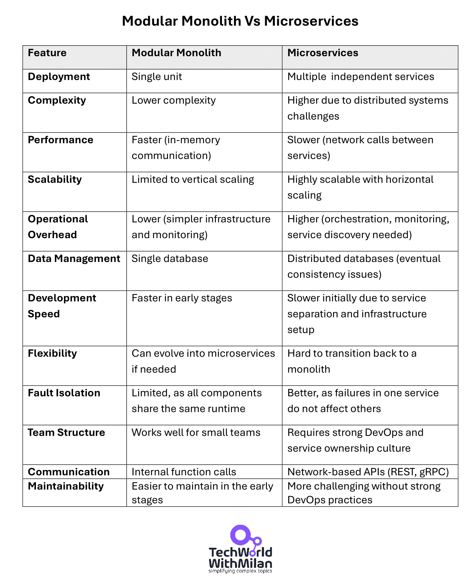
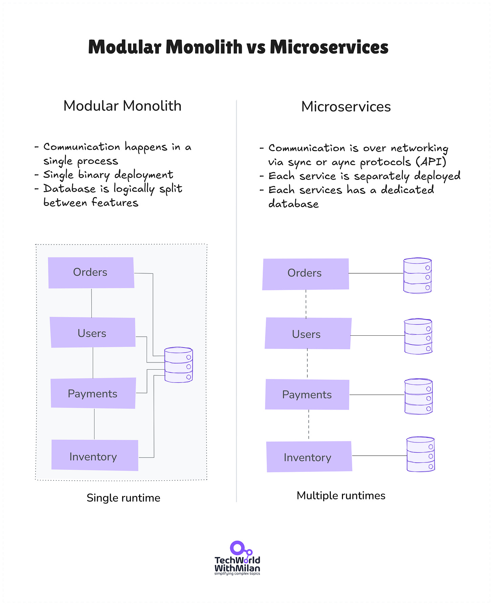

# What is a Modular Monolith?

*Microservices are dead, monoliths are the future!*

Microservices are popular for their scalability but come with complexity and operational overhead. They have become a big hype in the industry, and you can see microservices everywhere. On the other side, **modular monolith** offers a middle ground—keeping the simplicity of a monolith while allowing for future scalability. Here’s why it might be the right choice for your next project.

A **modular monolith** enables teams to build and deploy a single application while keeping the code clean, maintainable, and modular. It allows for quick development cycles while ensuring long-term system evolution, making it an ideal starting point for many projects, especially for startups.

So, let’s learn more about the modular monolith architecture.

---

## [WeAreDevelopers World Congress (Sponsored)](https://www.wearedevelopers.com/world-congress?utm_source=paid_partner&utm_medium=cpp&utm_campaign=techworldwithmilan&utm_content=newsletter_ad_1)

*Join WeAreDevelopers World Congress, the world’s leading event for developers, from 9-11 July 2025 in Berlin. WeAreDevelopers is welcoming 15,000+ developers and 500+ speakers for an unforgettable event this summer. **Use our exclusive discount code “WWC25_Milan” for 10% off on Congress Pass.***

*The speaker line-up includes:*

- *Thomas Dohmke, CEO of GitHub*
- *Scott Chacon, CEO and Co-Founder of GitButler, Co-Founder of GitHub*
- *Angie Jones, VP, Developer Relations at Block*
- *Alejandro Saucedo, Director of Engineering, Science, and Product at Zalando*
- *Paul Adams, CPO at Intercom*

[Secure your spot](https://www.wearedevelopers.com/world-congress?utm_source=paid_partner&utm_medium=cpp&utm_campaign=techworldwithmilan&utm_content=newsletter_ad_1)

---

## 1. What is Monolithic Architecture?

A **monolithic architecture** is a traditional software design approach in which all application components—UI, business logic, and database access—are bundled into a single deployable unit. While monoliths are initially simple to develop and deploy, they often become difficult to scale and maintain as the project's complexity grows.

In a monolithic application, components are tightly coupled and share the same memory space and resources. While this approach offers simplicity in development and deployment, it can become complex to maintain as the application grows (sometimes called a “[big ball of mud](https://en.wikipedia.org/wiki/Anti-pattern#Big_ball_of_mud)”).

Monolith at the Swiss National Exp in 2002, built by Jean Nouvel

## 2. What are Modular Monoliths?

A **modular monolith** is an evolution of the traditional monolith. It structures the application into independent modules with well-defined boundaries while retaining a single deployable unit.

Each module encapsulates a specific business capability, including its data models, business logic, and interfaces. Modules communicate via well-defined APIs, improving cohesion while minimizing dependencies.

Unlike a traditional monolith, a modular monolith:

- ✅  Ensures **low coupling** and **high cohesion** between modules
- ✅  Uses clear **interfaces** for communication between modules
- ✅  Allows **independent development and testing** of modules
- ✅  It can be **gradually evolved** into a microservices architecture if needed

This approach combines monoliths' simplicity with microservices' structural benefits, making it a good option for many teams.

The image below shows the simplified structure of a typical modular monolith.

Modular Monolith

## 3. How a Modular Monolith works

A modular monolith organizes code into distinct **modules** or **bounded contexts** following [domain-driven design (DDD)](https://en.wikipedia.org/wiki/Domain-driven_design) principles. Each module is responsible for a specific functionality, minimizing dependencies on others.

### Key design principles:

- **🔒 Encapsulation**: Each module encapsulates a specific business capability. Modules interact through well-defined interfaces, preventing tight coupling.
- **👨‍💻 Independent development**: Teams can work on separate modules without affecting the entire codebase.
- **🚧 Strict boundaries**: While sharing the same database instance, each module maintains its tables or schemas, preventing direct data access across module boundaries. There is no direct database access across modules; each module has its own repository and service layer.
- **📜 Clear interface contracts**: Modules communicate through well-defined APIs, similar to how microservices interact but without the network overhead.

### Example structure:

For an e-commerce platform, a modular monolith might have the following modules:

- **🛒 Orders Module** - Handles order processing.
- **💳 Payments Module** - Processes transactions.
- **📦 Inventory Module** - Tracks stock availability.

Module organization

Each module has its business logic, database tables (or schemas), and public APIs within the monolith.

> ⚠️***Avoid designing a [Distributed Monolith](https://newsletter.techworld-with-milan.com/i/119851189/what-is-a-distributed-monolith)**—a system where services are separated but still tightly coupled, leading to the worst of both worlds.*

## 3. Why should you build a (Modular) Monolith first?

In recent years, we have seen a significant increase in apps built using a microservices architecture—we may even say **it was hype** (see the image below). This approach is often chosen because small teams can work in isolation, reducing coordination overhead. Additionally, microservices allow teams to use various technologies and scale services independently.

Architectural styles on the Gartner hype curve (Author: [Robert Smallshire](https://youtu.be/9e3lflYhNd8?t=734) at NDC)

However, the **microservices approach introduces several disadvantages**. Maintaining and diagnosing issues becomes significantly more complex, requiring sophisticated logging, tracing, and distributed monitoring solutions. Additionally, many organizations experience **“microservice bloatware**,” where considerable service fragmentation leads to unnecessary complexity without many benefits.

Another **common misconception is that every scalable application needs microservices**. However, unless a company operates at the scale of Netflix, the [overhead of microservices can outweigh the benefits](https://newsletter.techworld-with-milan.com/i/148912953/fallacies-of-distributed-computing). For most organizations, managing distributed systems, handling service communication failures, and coordinating deployments add unnecessary complexity.

On the other hand, **monoliths have often been unfairly criticized as legacy systems or tightly coupled architectures**. While poorly designed monoliths can become unmanageable, a well-structured monolith—particularly a **modular monolith**—can be highly maintainable and scalable.

**A well-architected modular monolith can provide all the benefits of a scalable and maintainable system while avoiding the pitfalls of microservices**. This approach allows teams to focus on building a robust product without dealing with the unnecessary operational complexity of a distributed system. A modular monolith can gradually evolve into microservices if needed, making it a **safer and more pragmatic starting point**.

As Martin Fowler [said](https://martinfowler.com/bliki/MonolithFirst.html) it best:

> *"You shouldn't start a new project with microservices, even if you're sure your application will be big enough to make it worthwhile.​"*

👉 Read more about it:
[
Tech World With Milan NewsletterWhy should you build a (modular) monolith first?In recent years, we have seen a significant increase in apps built using a microservices architecture. We selected this approach mainly because small teams work in isolation without having them trip over each other. Yet, this is an organizational problem, not a technical one. We can also build each service using different technologies and scale it indep…Read more3 years ago · 40 likes · 2 comments · Dr Milan Milanović](https://newsletter.techworld-with-milan.com/p/why-you-should-build-a-modular-monolith?utm_source=substack&utm_campaign=post_embed&utm_medium=web)
## 4. Characteristics of a Modular Monolith

A good modular monolith follows these principles:

- 🧩 **Modularity:** The system is divided into self-contained modules with clear responsibilities.
- 📁 **Shared codebase:** All modules reside in a single repository, enabling consistency in coding standards and dependency management.
- 📈 **Scalability and maintainability:** The architecture supports growth while keeping maintenance overhead low.
- 🔄 **Flexibility:** Modules can be developed, tested, and evolved independently within the monolith.
- 🚧 **Explicit boundaries:** Modules communicate via well-defined APIs, avoiding implicit dependencies.
- ➡️ **Strict dependency management** involves ensuring that dependencies flow in one direction. This can be enforced using [architecture tests](https://newsletter.techworld-with-milan.com/p/how-do-you-test-your-software-architecture), which automatically verify module boundaries and prevent unintended coupling, reducing long-term maintenance risks.

Monolith vs Modular Monolith vs Microservices

## **5. Benefits of a Modular Monolith**

There are several benefits of using Modular Monlith architecture:

- ✅ **Simplicity** – Easier to develop, test, and deploy compared to distributed architectures.
- ✅ **Performance** – No inter-service network calls, reducing latency.
- ✅ **Costs**- Lower operational complexity and infrastructure costs.
- ✅ **Consistency** – A single database ensures strong consistency without distributed transactions.
- ✅ **Maintainability** – Modular structure prevents the codebase from becoming an unmanageable monolith.
- ✅ **Flexibility** – Can evolve into microservices gradually if needed.

But, there are also a few drawbacks we need to be aware of:

- ❌ **Single deployment unit** – A single bug or failure can impact the system.
- ❌ **Scaling limitations** – While modular, it still runs as a single process, limiting the independent scaling of modules.
- ❌ **Growing complexity** – Without discipline, modular monoliths can degrade into tightly coupled systems over time.
- ❌ **Tech stack limitations**- Technology stack decisions affect the entire application.

Benefits of a Modular Architecture

## **6. Modular Monolith vs Microservices**

Why does choosing between monolithic and microservices matter? The architecture you pick **directly impacts how your team ships features, how easy it is to scale, and how it fits your business needs**. It's not only a technical consideration; it's a bigger question considering your broader system requirements.

For example, if you're building a simple online store, a monolithic approach might mean having one codebase with modules for products, orders, payments, and user accounts in the same repository and deployed as a single application. In contrast, a microservices approach would separate each area—products, orders, payments, and accounts—into distinct services, each with its repository, deployment pipeline, and scaling rules.

#### **When to choose a Modular Monolith?**

- 👥 If your team is small to medium-sized.
- 🚀 If you need to develop and iterate quickly (e.g., startup).
- 📊 If you don’t require independent module scaling.
- 🤔 If your organization lacks experience with distributed systems.

A detailed comparison between the two approaches is given in the table below:

Modular Monolith Vs. Microservices

> 👉*Learn more about how organizational structure impacts your selection of architecture:*
[
Tech World With Milan NewsletterYour software architecture is complex as your organizationThis week’s issue brings to you the following…Read more2 years ago · 30 likes · 1 comment · Dr Milan Milanović](https://newsletter.techworld-with-milan.com/p/your-architecture-is-complex-as-your?utm_source=substack&utm_campaign=post_embed&utm_medium=web)
## **8. When to move to microservices?**

Despite its benefits, **a modular monolith may eventually face limitations**.

- 📈 Businesses should consider transitioning to microservices **when independent scaling becomes necessary**, allowing different system parts to scale separately.
- **🚀 Deployment flexibility** is another reason to migrate, as microservices enable teams to release updates independently.
- **👥 Microservices can benefit large development teams working on the same codebase** by reducing merge conflicts and increasing development speed.
- ⚠️ Companies needing **high availability and fault isolation** may also prefer microservices to prevent a failure in one service from affecting the entire system.
- **📜 Regulatory and compliance needs** may further push organizations toward microservices.

Transitioning should be incremental—starting with high-impact modules that most benefit from decoupling.

Modular Monolith vs Microservices

> 👉 *Check the most important [monolith decomposition strategies](https://newsletter.techworld-with-milan.com/i/119851189/monolith-decomposition-strategy).*

Learn more about Microservice architecture:
[
Tech World With Milan NewsletterWhat is Microservice Architecture?Microservice architecture has revolutionized how companies build and scale software. Giants like Netflix and Amazon leverage it to deliver new features rapidly and efficiently. But what exactly is microservice architecture, and why does it matter…Read more2 years ago · 33 likes · Dr Milan Milanović](https://newsletter.techworld-with-milan.com/p/what-is-microservice-architecture?utm_source=substack&utm_campaign=post_embed&utm_medium=web)
## 9. Modular Monoliths and Technical Debt

Technical debt is often framed as something to avoid, but in reality, it’s a tool—something to be managed, not eliminated. A **modular monolith is an approach that balances short-term development speed with long-term maintainability.**

Many companies eventually break apart their monolithic architecture into microservices, but that doesn’t mean starting with a monolith is a mistake. Forcing microservices too early can be a form of **premature optimization**, or we can even say that **microservices are Technical Debt**.

A monolith simplifies deployment, versioning, and scaling in a product's early stages. It allows teams to move fast, iterate quickly, and refine their architecture based on actual product needs **rather than possible future scalability concerns**.

Over time, the capacity to develop new features decreases

Every system accumulates technical debt through outdated dependencies, shifting frameworks, or evolving business needs. The key is to **borrow technical debt strategically**—taking on short-term inefficiencies to gain speed but ensuring a plan to pay it down later.

A modular monolith helps control this debt by **centralized complexity within well-defined boundaries.** Unlike microservices, where technical debt can spread across multiple services, a modular monolith contains it within individual modules, making it easier to refactor or extract services later when needed.

The right time to migrate to microservices isn’t when you fear a scaling issue years down the road—it’s when maintaining the monolith becomes a real bottleneck. Migrating a codebase when a new framework or language version appears can be a mistake, but waiting too long can be just as costly. **The challenge is finding that balance**—and modular monoliths allow teams to evolve their architecture at the right time rather than being locked into an overly complex design from day one.

> “*A complex system that works is invariably found to have evolved from a simple system that worked. A complex system designed from scratch never works and cannot be patched to make it work. You have to start over with a working simple system*.” - Gall’s law, in his book [Systemantics](https://amzn.to/41lQ35R).

Learn more about how to deal with Technical Debt:
[
Tech World With Milan NewsletterHow To Deal With Technical DebtIn this issue, we are going to talk about the following…Read more3 years ago · 42 likes · 1 comment · Dr Milan Milanović](https://newsletter.techworld-with-milan.com/p/how-to-deal-with-technical-debt?utm_source=substack&utm_campaign=post_embed&utm_medium=web)
## 10. Real-world examples of Modular Monolith

Several successful companies have effectively implemented modular monoliths:

- **👉  [Shopify](https://www.shopify.com/)**: Despite being a large-scale e-commerce platform, Shopify maintained a modular monolith for many years. Their approach focused on clear module boundaries and careful dependency management, allowing them to scale efficiently while maintaining development speed.

Read more about it:
[
Tech World With Milan NewsletterInside Shopify’s Modular MonolithIn my previous newsletter, I wrote about Shopify and its impressive architecture. This time, I talked with Oleksiy Kovyrin, a Principal Engineer at Shopify, about their architecture, tech stack, testing, culture, and more…Read more2 years ago · 32 likes · Dr Milan Milanović](https://newsletter.techworld-with-milan.com/p/inside-shopifys-modular-monolith?utm_source=substack&utm_campaign=post_embed&utm_medium=web)
- **👉 [Basecamp](https://basecamp.com/)**: The team behind Basecamp has been a vocal advocate for monolithic architectures. Their latest version, Basecamp 3, uses a modular monolith approach, demonstrating how well this architecture can work for sophisticated project management tools. Read **[more](https://signalvnoise.com/svn3/the-majestic-monolith/)** about it.
- **👉 [StackOverflow](https://stackoverflow.com/)**: The whole website is implemented as a giant****monolithic application running on-premise. It is **a single application** on IIS which runs 200 sites. This single app is running on nine web servers and a single SQL Server (with the addition of one hot standby).

Read more about it:
[
Tech World With Milan NewsletterStack Overflow ArchitectureIn this issue, we talk about…Read more3 years ago · 28 likes · 3 comments · Dr Milan Milanović](https://newsletter.techworld-with-milan.com/p/stack-overflow-architecture?utm_source=substack&utm_campaign=post_embed&utm_medium=web)
These examples show that modular monoliths can scale successfully when implemented with proper architectural principles and discipline. The key is not the application size but how well it's organized and maintained.

## References

- 🔗 "[Modular Monoliths](https://www.youtube.com/watch?v=kbKxmEeuvc4)" talk at Devoxx by Simon Brown (2016).
- 🔗 [The Modular Monolith - a Practical Alternative to Microservices](https://www.youtube.com/watch?v=nuHMlA3iLjY) Devoxx talk by Victor Rentea
- 🔗 [Introducing Service Weaver: A Framework for Writing Distributed Applications](https://opensource.googleblog.com/2023/03/introducing-service-weaver-framework-for-writing-distributed-applications.html) by Google
- 🔗 "[MonolithFirst](https://martinfowler.com/bliki/MonolithFirst.html)” by Martin Fowler
- 🔗 [Kamil Grzybek's "Modular Monolith: A Primer](https://www.kamilgrzybek.com/design/modular-monolith-primer/)
- 🔗 [Evolutionary Architecture by example repo](https://github.com/evolutionary-architecture/evolutionary-architecture-by-example)
- 🔗 Modular Monolith templates: [.NET](https://github.com/kgrzybek/modular-monolith-with-ddd), [Node.js](https://github.com/Sairyss/domain-driven-hexagon), [Java](https://github.com/ddd-by-examples/library), [Go](https://github.com/ThreeDotsLabs/wild-workouts-go-ddd-example).
- 🔗 [Modular Monolith Architecture](https://awesome-architecture.com/modular-monolith/) references
- 🔗 [How modular can your monolith go?](https://microservices.io/post/architecture/2023/07/31/how-modular-can-your-monolith-go-part-1.html)
- 🔗 [Head First Software Architecture](https://amzn.to/42MQOWU) book by Raju Gandhi, Mark Richards, and Neal Ford.
- 🔗 [Practical Modular Monolith, built with .Net 9, DDD, CQRS, Vertical Slice Architecture, Event-Driven Architecture, and the latest technologies](https://github.com/meysamhadeli/booking-modular-monolith).

## Conclusion

A **modular monolith** balances simplicity and scalability, offering an excellent starting point for most teams. It avoids the operational complexity of microservices while keeping future flexibility open. It can gradually evolve into a distributed architecture without premature complexity if necessary.

The key takeaway? **Start simple and optimize later.**

Most projects' safest, most pragmatic choice starts with a modular monolith.

> *Monoliths are good enough for almost everything. Microservices need justification.*

---

## 🎁 Promote your business to 350K+ tech professionals

Get your product in front of **more than 350,000+ tech professionals** who make or influence significant tech decisions. Our readership includes senior engineers and leaders who care about practical tools and services.

Ad space often books up weeks ahead. If you want to secure a spot, **[contact me](https://milan.milanovic.org/#contact)**.

Let’s grow together!

[Sponsor Tech World With Milan](https://newsletter.techworld-with-milan.com/p/sponsorship-of-tech-world-with-milan)

---

## More ways I can help you

1. **📢 [LinkedIn Content Creator Masterclass](https://www.patreon.com/techworld_with_milan/shop/short-linkedin-content-creator-311232?utm_medium=clipboard_copy&utm_source=copyLink&utm_campaign=productshare_creator&utm_content=join_link).**In this masterclass, I share my strategies for growing your influence on LinkedIn in the Tech space. You'll learn how to define your target audience, master the LinkedIn algorithm, create impactful content using my writing system, and create a content strategy that drives impressive results.
2. **📄 [Resume Reality Check](https://www.patreon.com/techworld_with_milan/shop/resume-reality-check-311008?source=storefront)**. I can now offer you a service where I’ll review your CV and LinkedIn profile, providing instant, honest feedback from a CTO’s perspective. You’ll discover what stands out, what needs improvement, and how recruiters and engineering managers view your resume at first glance.
3. **💡 [Join my Patreon community](https://www.patreon.com/techworld_with_milan)**: This is your way of supporting me, saying “**thanks**," and getting more benefits. You will get exclusive benefits, including 📚 all of my books and templates on Design Patterns, Setting priorities, and more, worth $100, early access to my content, insider news, helpful resources and tools, priority support, and the possibility to influence my work.
4. 🚀 **1:1 Coaching:** [Book a working session with me](https://newsletter.techworld-with-milan.com/p/coaching-services). I offer 1:1 coaching for personal, organizational, and team growth topics. I help you become a high-performing leader and engineer.

---

Thanks for reading Tech World With Milan Newsletter! Subscribe for free to receive new posts and support my work.