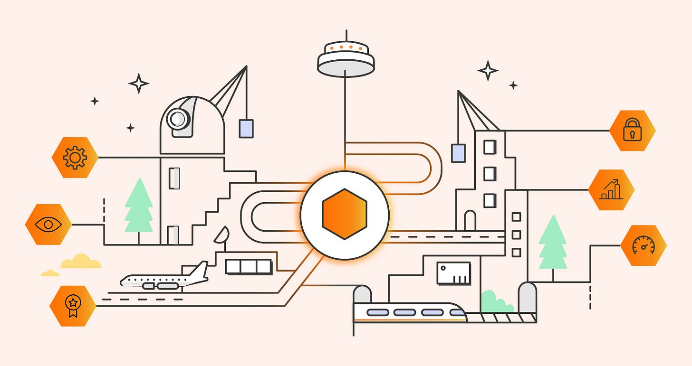
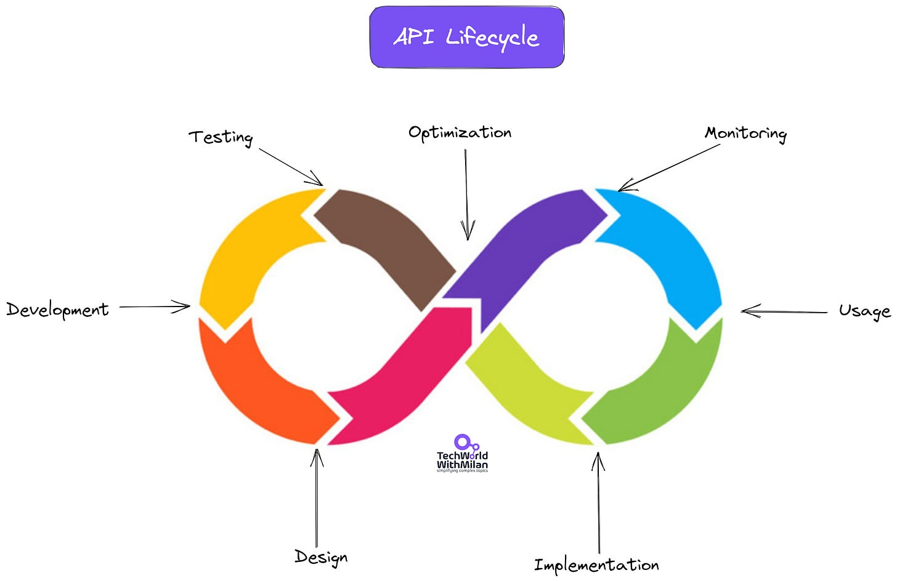
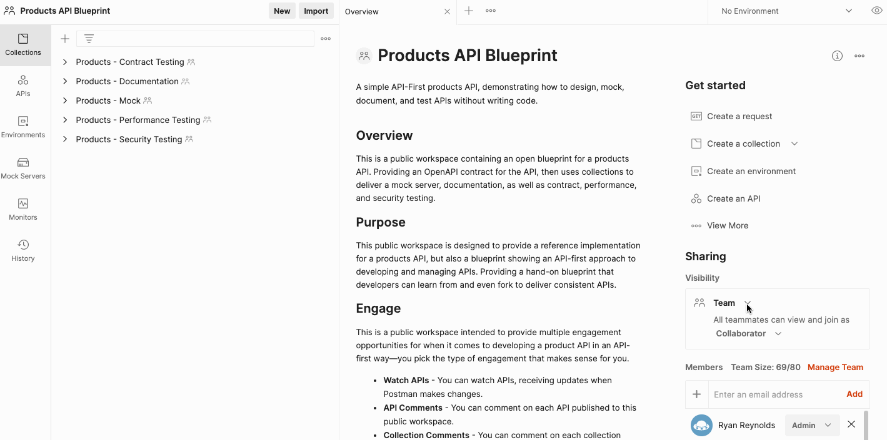

# What is API-First Development?

You probably heard about terms such as API-first, Code-first, and Design-first. Yet, although we as developers are primarily familiar with the Code-first approach to developing APIs, there are also some other approaches.

## **API-first development**

API-first development is a software development approach that **prioritizes the design and development of the Application Programming Interfaces (APIs)** before any other component of the system.

In this approach, the API is considered **the system’s foundation**, and all other components are built on top of it. This allows developers to design and develop the API in a flexible, scalable, and modular way, making it easier to integrate with other systems and evolve.

The **conventional code-first method of application development** occasionally results in delays, rework, or a fragmented experience for the developer, especially in the current Cloud-driven context. Many large corporations have shifted to this strategy, including **Netflix, Uber, and Amazon**, whose solutions were already quite successful with a monolithic design. They adopted microservices architecture fast and **created their premium APIs**, which facilitated even easier platform scalability for their services. While we also saw companies that have **API-first products** (Stripe or Twilio).

The API-first approach emphasizes the **separation of concerns between the API and the user interface** or client-side code, especially in the Cloud-native world. This separation allows developers to work on each component independently, which can result in faster development and easier maintenance.

If companies want to adopt the API-first model, they need to recognize first public and private APIs in their organization and understand the tooling which is needed. When I say recognize, it means prioritizing an API-first approach, by first **designing and building APIs and then writing code**. This helps us to prioritize the business value we bring to our business, rather than just delivering applications.

Image credits: Postman

## Why API-first?

Some important benefits of the API-first approach are:

1. **Flexibility**: An API-first approach allows developers to focus on creating a flexible and scalable API that can work with multiple devices, platforms, and operating systems. This makes it easier to extend and update the application over time.
2. **Faster Development**: By designing and building the API first, developers can ensure that the data and functionality required for the application are available from the start, enabling faster development and testing.
3. **Better User Experience**: An API-first approach can lead to better user experiences by allowing developers to focus on creating a functional and reliable API that can be easily integrated into different interfaces and user experiences.
4. **Lower Costs**: By creating an API-first, development costs can be reduced by focusing on creating a stable, reusable, and well-documented API that can be used across multiple applications and platforms.
5. **Increased Collaboration:** An API-first approach encourages collaboration between developers, designers, and stakeholders, leading to better communication, more efficient development processes, and ultimately, a better end product.

## **Private, external, and public APIs**

When we talk about APIs we usually think about our internal ones, which are hit by some client code or frontend. Yet, there is more than this. When we say API, it is usually a **private or internal API**, which is used and stored in our organization. It is the most usable and fastest one to use.

Along with private APIs, we also have **public APIs**. Some examples of such APIs are the ones from Stripe, Facebook, Weather, etc. We usually build our internal products, by reusing these APIs.

And we have **partner APIs**, which allow organizations to share their APIs with customers, making it a possibility to work together and create partnerships.

## API-First and Other Strategies

In the latest **[State of the API Report 2022](https://www.postman.com/state-of-api/api-first-strategies/#api-first-strategies?utm_source=Milan_Milanovic&utm_medium=newsletter&utm_campaign=influencer&utm_term=newsletter&utm_content=Mar_2023)**[https://www.postman.com/state-of-api/api-first-strategies/#api-first-strategies](https://www.postman.com/state-of-api/api-first-strategies/#api-first-strategies)by [Postman](https://www.postman.com/?utm_source=Milan_Milanovic&utm_medium=newsletter&utm_campaign=influencer&utm_term=newsletter&utm_content=Mar_2023), we saw that two-thirds of last year’s survey respondents ranked themselves 5 or more in adopting the API-first model.

Embracing API-first (Credits: Postman)

Yet, answering the question, of **which API type** they use the most (public, private, and partner), the answer was: Private (58%), Partner (27%), and Public (16%).

When asked about **consuming and producing APIs**, and how they decide on that, the top answer was the same, but a bit of a surprise. It is how well an API integrates with internal apps and systems. This is probably the case because APIs are replacing some legacy methods of integration, such as database sharing, file transfer, etc.

## **API Lifecycle**

The API lifecycle is a standard product lifecycle. The API lifecycle refers to the various stages involved in the design, development, deployment, and management of an API. The API lifecycle typically includes the following stages:

1. **Design:** This stage involves designing the API, including defining the API's purpose, the endpoints it will expose, the data models it will use, and the authentication and authorization mechanisms it will support. The goal is to create a well-designed API that is easy to use, flexible, and scalable. When we finish with the design, we can mock an API and get feedback from users.
2. **Development:** In this stage, developers write code to implement the API according to the design. They may use modern API development tools and frameworks to speed up the development process and ensure that the API meets the design specifications. In this step we do the following:

1. Document the API
2. Write tests
3. Develop backend
4. Develop the user interface

When we finish with the development, we can **deploy the API and share the API documentation**.
3. **Testing:** Once the API is developed, it must be tested to ensure that it is working correctly and meeting the design specifications. Testing may include functional testing, load testing, security testing, and other types of testing.
4. **Implementation**: When our client gathers all the necessary info from us, he can start with the implementation and its usage.
5. **Usage**: This happens when the data hits the system and we can learn from the real world what is the quality of data. It happens along with the maintenance and monitoring phase.
6. **Monitoring:** Once the API is deployed, it must be managed over its lifecycle. This includes monitoring the API to ensure that it is performing as expected, providing documentation and support to users, handling versioning and backward compatibility issues, and addressing any security or compliance issues that may arise.
7. **Optimization:** The final part of the API life cycle involves managing changes and updating existing systems. At this stage, tasks include effectively coordinating responses to fresh user needs, regulatory adjustments, data modifications, process upgrades, the expansion of microservices, the release of new API versions, and occasionally even application migration.

API Lifecycle

---

## Bonus: How to use Postman Workspaces for API development

When developing APIs, you can use **Postman Team, Partner, or Public workspaces** to work on APIs, collections, integrations, mocks, and more. It acts as a **single source of truth** for your API projects and enables collaboration.

What I saw usually is that people are creating **Postman collections** and sending them in .json via some communication channel to use, while Postman Workspaces can enable this more easily.

What we need to do is to **create a team workspace** for every team and invite members. You can here comment on a collection, request, or folder, or read, edit, and resolve comments and tag members. This could be a great basis for building API-first software. Check more **[here](https://learning.postman.com/docs/collaborating-in-postman/using-workspaces/creating-workspaces/?utm_source=Milan_Milanovic&utm_medium=newsletter&utm_campaign=influencer&utm_term=newsletter&utm_content=Mar_2023)**.

Postman Workspaces (Credits: Postman)

---

If you want to learn about .NET technologies, software architecture, and DDD, I can **strongly recommend** a [newsletter from Milan Jovanovic](https://www.milanjovanovic.tech/). He writes in an easy-to-understand manner.

Thanks for reading Tech World With Milan Newsletter! Subscribe for free to receive new posts and support my work.