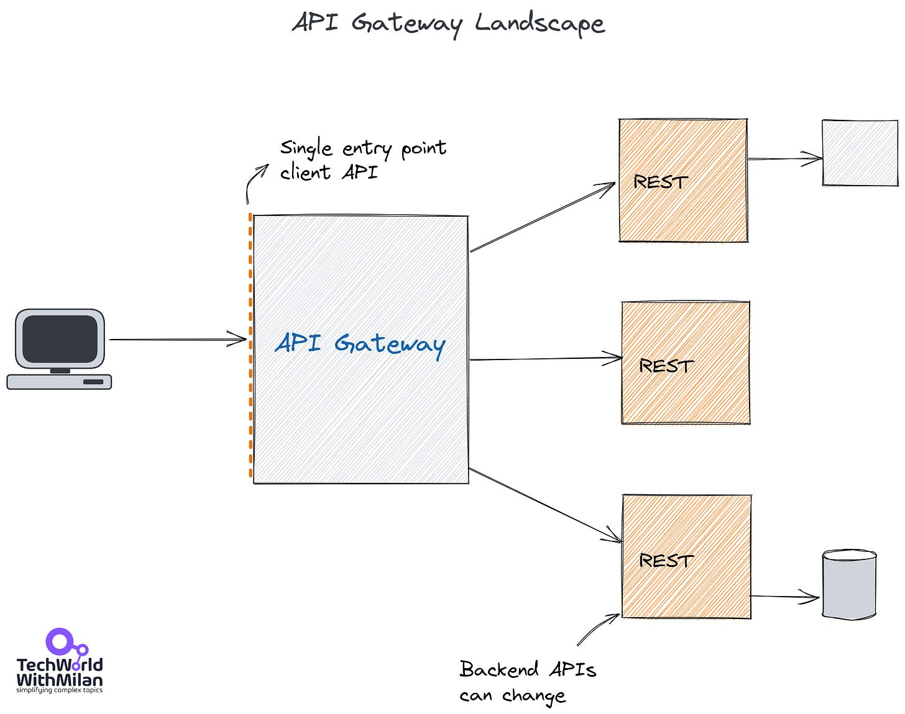
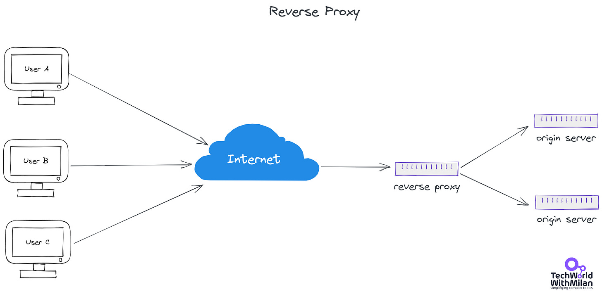

# What is API Gateway?

An API management tool known as an **API Gateway** sits between a client and a group of backend services. It performs the function of a **reverse proxy** by accepting all application programming interface (API) calls, aggregating the different services needed to fulfill them, and returning the right outcome.

Thanks for reading Tech World With Milan Newsletter! Subscribe for free to receive new posts and support my work.

By using API gateways, most enterprise APIs are deployed. **User authentication, rate limits and statistics** are common duties that API gateways take care of on behalf of a system of API services.

An API service receives a remote request and responds to it. But in reality, nothing is ever that easy. When you host large-scale APIs, take into account various concerns:

- You use a **rate limitation system and an authentication service** to safeguard your APIs against abuse and excessive use.
- You implemented **analytics and monitoring tools** because you want to know how people use your APIs.
- You should link to a **payment system** if your APIs are monetized.
- If you've chosen a **microservice architecture**, a single request can need calling hundreds of different programs.
- Your clients will still want to be able to access all your services in **one location** even when you add new API services over time and retire others.

So, how **does it work** in general:

1. API gateway receives an HTTP request from a client.
2. When received it validates the request first.
3. API gateway checks with an identity provider about authentication/authorization.
4. The rate-limiting rules are then applied to the request.
5. Then, the API gateway finds the backend services and routes the request.

API Gateway

Also to this, the API gateway can handle **faults (circuit breaker), but also do logging, caching and monitoring**.

Also, we can see API Gateway as a superset of a **Reverse Proxy**. It is server that resides in front of backend servers and transfers client requests to these servers, typically used to increase security, speed, and dependability. A reverse proxy receives a request from a client, forwards it to another server, and then returns it to the client, giving the impression that the first proxy server handled the request. These proxies ensure that users don't access the origin server directly, giving the web server's anonymity. They are usually used for **Load balancing**, where we need to deal with the flow of incoming traffic, so we may distribute that traffic between multiple back-end servers or we can use them for caching too. An example of reverse proxy services are: **Apache Proxy**, **Nginx** or **IIS**.

Reverse Proxy

An **examples of API Gateways** are:

- **[Apigee](https://cloud.google.com/apigee)** (now part of Google Cloud).
- **[Express Gateway](https://www.express-gateway.io/).**
- **[Tyk API Gateway](https://tykio.info/3Ebo1Ox).**

The major public cloud providers offer API gateway tools specific to their platforms: **Amazon API Gateway**, **Azure API Gateway**, and **Google Cloud API Gateway**.

---

Thanks for reading Tech World With Milan Newsletter! Subscribe for free to receive new posts and support my work.