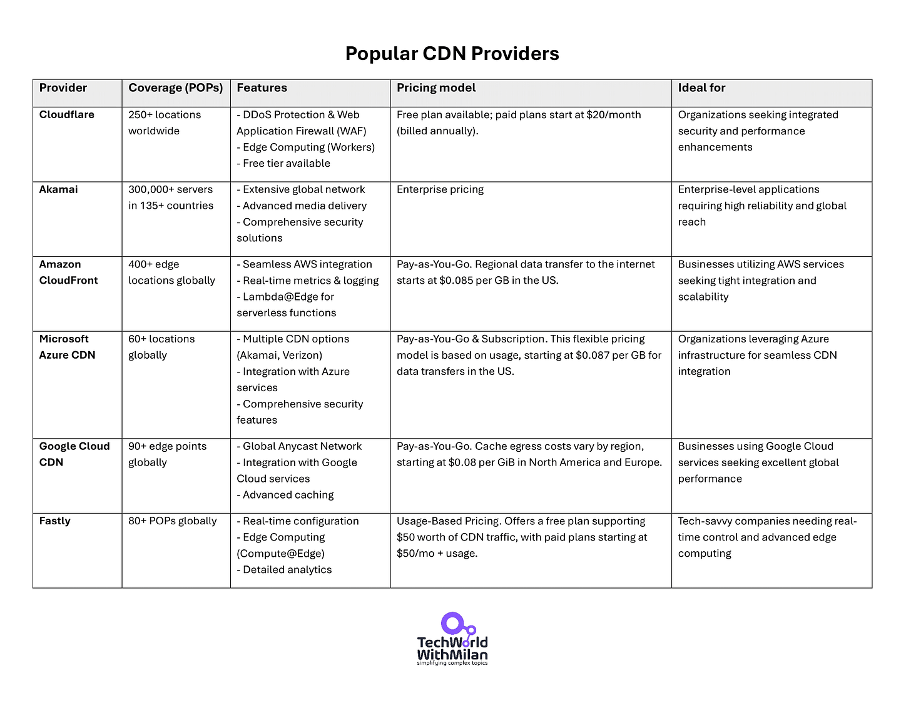

# What is CDN?

*and how it can significantly impact your user experience.*

Have you ever wondered how fast Netflix is when streaming a movie to your house? There is one component that is very important here, and it is called **CDN (Content Delivery Network)**. It is a network of servers that move data fast through the network using cache servers and edge servers in **Points of Presence (POP) locations** that are geographically close to the user.

The site's static content (such as videos, images, etc.) is moved to every server on the network. This allows the user to connect to the geographically closest server and fetch requested contents from there.

Let's see how CDN works in more detail.

## How CDN works

Three key components of a CDN are **edge servers** (located at PoPs and responsible for caching and delivering content to users), **origin servers**(where the original content is hosted), and **DNS** (which directs user requests to the nearest edge server).

And how they work together:

1. A **user** requests a file using some URL.
2. The **DNS** routes the request to the best-performing POP location closest to the user. CDNs strategically position POPs in regions with high user density to minimize this distance.
3. If no servers close to the user have a file in the cache, it is fetched from the **origin server**.
4. Then, the **origin server** moves that file to the closest server location (**POP**).
5. This **edge server** caches the file until time-to-live (TTL) specified in HTTP header experiences (default is 7 days).
6. Subsequent requests for the same content can be provided from the **CDN cache**, lowering the burden on the **origin server** and improving the user experience by serving the content from a nearby server.

Content Delivery Network (CDN)

## Why do we need CDN?

CDN allows us a few crucial **advantages**:

- **✅ Reducing page load time**. We always want to improve our website's page loading speeds, and CDN reduces latencies, which increases users' satisfaction rates.
- **✅ Reduced bandwidth costs**. A significant cost for websites is the bandwidth consumed for hosting. CDNs can decrease the data an origin server must provide through caching and other optimizations, lowering hosting costs for website owners.
- **✅ Increasing content availability**. Significant traffic or hardware issues can prevent a website from operating normally. Because of its distributed architecture, a CDN can better manage traffic and resist hardware failure than multiple-origin servers.
- **✅ Improved website security**. DDoS attacks attempt to shut down applications by flooding the website with fictitious traffic. By spreading the load across several intermediary servers, CDNs can manage such traffic spikes while lessening the impact on the origin server.

In addition to this, there are some **disadvantages**:

- ❌ The first is **complexity**, as integrating a CDN into an existing infrastructure can be complex.
- ❌ Also, while CDNs reduce bandwidth costs, they may **introduce additional fees** depending on the provider and usage, which should be considered.

## Common issues when working with CDN

There are some common problems when setting up CDNs, we should know about:

- **⚠️ Misconfigured cache headers.**If your headers allow zero caching, the CDN won’t help much. If you enable indefinite caching, outdated content might linger.
- **🧹 Overlooking purge processes.**When content changes, you need a quick way to invalidate old caches. Forgetting this can cause confusing mismatches between users’ requests and the content they see.
- **🔄 Ignoring dynamic content rules.**A CDN won’t magically cache highly dynamic data unless you allow it (through custom caching logic or partial caching). Overly aggressive caching can break apps that need fresh data.
- **🌍 Not considering edge cases.**Certain regions might have fewer CDN POPs, resulting in slower speeds for users in remote areas. Check coverage maps or consider multi-CDN strategies for global audiences.

### **Optimizing CDN Performance**

To maximize the benefits of a CDN, several optimization strategies can be employed:

1. **🛠️ Configure proper cache headers**. Set appropriate `Cache-Control`, `ETag`, and `Vary` headers are to guide the CDN on caching duration and validation. Proper headers ensure content is efficiently cached without serving outdated data.
2. **📦 Compress data.**Enable Gzip or Brotli compression and minify your CSS, JavaScript, and HTML files. Smaller, compressed files reduce load times and bandwidth usage.
3. **⚡ Optimize origin performance**. Use load balancers and optimize backend processes to ensure your origin servers are fast and reliable.
4. **🌐 Use HTTP/2 or HTTP/3.**Adopt modern protocols like HTTP/2 or HTTP/3 for better multiplexing and reduced latency.
5. 🔀 **Use a Multi-CDN Strategy**. Deploy multiple CDNs to cover global regions more effectively and ensure high availability. This approach mitigates the risk of downtime and optimizes performance across different locations.
6. **📊 Monitor Real-User Metrics**.****Utilize Real User Monitoring (RUM) and synthetic testing to track performance metrics like TTFB and load times.

To optimize CDNs, we need to follow metrics such as **latency**, **cache hit ratio**, **bandwidth usage**, and others.

## Popular CDN Providers

When we are considering to use CDNs, there are different providers to choose from, such as:

1. **[Cloudflare](https://www.cloudflare.com/)**is one of the most popular CDN providers, with over 250 global locations. It offers strong security features, including DDoS protection and a Web Application Firewall (WAF). Cloudflare’s Workers platform also enables edge computing, allowing you to run custom JavaScript at the edge for enhanced performance and flexibility.
2. **[Akamai](https://www.akamai.com/solutions/content-delivery-network)** is a well-known name in the CDN space. It operates over 300,000 servers in more than 135 countries. It is known for its global network, advanced media delivery expertise, and comprehensive security solutions.
3. **[Amazon CloudFront](https://aws.amazon.com/cloudfront/)**is part of the Amazon Web Services (AWS) ecosystem and integrates well with other AWS services like S3, EC2, and Lambda@Edge. With over 400 edge locations worldwide, CloudFront provides real-time metrics and logging for detailed performance monitoring.
4. **[Microsoft Azure CDN](https://azure.microsoft.com/en-us/products/cdn)** offers over 60 global locations and provides options through Akamai and Verizon networks. It integrates with Azure services such as Azure Blob Storage and Azure Web Apps and includes security features like DDoS protection and SSL/TLS encryption.
5. **[Google Cloud CDN](https://cloud.google.com/cdn)**. It uses Google’s extensive global infrastructure and operates over 90 edge points worldwide. It integrates tightly with Google Cloud Platform services like Google Compute Engine and Cloud Storage, offering advanced caching and a Global Anycast Network for low latency and high availability.
6. **[Fastly](https://www.fastly.com/products/cdn)** is a high-performance CDN known for its real-time configuration and edge computing capabilities through Compute@Edge. With over 80 Points of Presence (POPs) globally, Fastly provides detailed analytics and real-time insights into traffic and performance.

Below is the comparison table for all these providers, with significant features, pricing models, and what they are ideal for.

> ℹ️*Note that in addition to these primarily US-based CDN companies, there are a few European ones, such as **[CDN77](https://www.cdn77.com/)**, **[Bunny CDN](https://bunny.net/)**, and **[OVHcloud CDN](https://www.ovhcloud.com/en/web-hosting/options/cdn/)**.*

## How to choose the right CDN?

When selecting a CDN, consider your website's traffic volume, geographical reach, and specific features like security and performance optimizations. Each provider has unique strengths, so we must align them with our needs.

Here is what you need to have in mind when selecting the CDN provider:

- To make the right choice, **start by assessing your performance needs**. Evaluate the CDN's global coverage to ensure it has Points of Presence (POPs) near your primary user bases, which minimizes latency and improves load times. Additionally, consider the CDN’s caching efficiency; a higher cache hit ratio means more requests are served directly from the CDN, reducing the load on your origin servers and enhancing overall speed.
- **Security is another critical factor** when selecting a CDN. Look for providers offering good Distributed Denial-of-Service (DDoS) protection and Web Application Firewalls (WAF) to guard against cyber threats. Advanced security features such as bot mitigation, SSL/TLS encryption, and support for modern protocols like HTTP/2 and HTTP/3 can further enhance your application security.
- **Integration and compatibility with your existing infrastructure are essential**in the selection process. If your infrastructure is hosted on a specific cloud platform, such as AWS, Azure, or Google Cloud, choosing a CDN that integrates with these services can simplify deployment and management.
- **Cost structure and pricing models are also crucial.** CDNs typically offer various pricing options, including pay-as-you-go and subscription-based models. It’s essential to compare bandwidth costs, primarily if your application serves large files or experiences high traffic volumes. We should also be careful of hidden costs, such as fees for additional features like SSL certificates or advanced security measures, and understand the policies regarding overage charges to avoid unexpected expenses.

So, in short, how to select the proper CDN (possible choice):

- For security & performance: **[Cloudflare](https://www.cloudflare.com/)**.
- For enterprise-scale & reliability: **[Akamai](https://www.akamai.com/solutions/content-delivery-network)**.
- For Cloud Integration (AWS): **[Amazon CloudFront](https://aws.amazon.com/cloudfront/)**.
- For Cloud Integration (Azure): **[Microsoft Azure CDN](https://azure.microsoft.com/en-us/products/cdn)**.
- For Cloud Integration (Google Cloud): **[Google Cloud CDN](https://cloud.google.com/cdn)**.
- For real-time control and edge computing: **[Fastly](https://www.fastly.com/products/cdn)**.

> **⚠️ Note:***Of course, this recommendation is not finite; you should always tailor it to your needs.*

## Conclusion

A CDN is a critical part of modern web architecture. It offloads heavy traffic from your servers, speeds delivery, and adds resilience to the equation. Whether scaling a small web service or building a global platform, a CDN can significantly impact your user experience. By caching static files and optimizing routes, CDNs can improve performance and security without forcing you to buy more servers or rewrite your entire stack.

---

## 🎁 Promote your business to 350K+ tech professionals

Get your product in front of **more than 350,000+ tech professionals** who make or influence significant tech decisions. Our readership includes senior engineers and leaders who care about practical tools and services.

Ad space often books up weeks ahead. If you want to secure a spot, **[contact me](https://milan.milanovic.org/#contact)**.

Let’s grow together!

[Sponsor Tech World With Milan](https://newsletter.techworld-with-milan.com/p/sponsorship-of-tech-world-with-milan)

---

## More ways I can help you

1. **📢 [LinkedIn Content Creator Masterclass](https://www.patreon.com/techworld_with_milan/shop/short-linkedin-content-creator-311232?utm_medium=clipboard_copy&utm_source=copyLink&utm_campaign=productshare_creator&utm_content=join_link).**In this masterclass, I share my strategies for growing your influence on LinkedIn in the Tech space. You'll learn how to define your target audience, master the LinkedIn algorithm, create impactful content using my writing system, and create a content strategy that drives impressive results.
2. **📄 [Resume Reality Check](https://www.patreon.com/techworld_with_milan/shop/resume-reality-check-311008?source=storefront)**. I can now offer you a service where I’ll review your CV and LinkedIn profile, providing instant, honest feedback from a CTO’s perspective. You’ll discover what stands out, what needs improvement, and how recruiters and engineering managers view your resume at first glance.
3. **💡 [Join my Patreon community](https://www.patreon.com/techworld_with_milan)**: This is your way of supporting me, saying “**thanks**," and getting more benefits. You will get exclusive benefits, including 📚 all of my books and templates on Design Patterns, Setting priorities, and more, worth $100, early access to my content, insider news, helpful resources and tools, priority support, and the possibility to influence my work.
4. 🚀 **1:1 Coaching:** [Book a working session with me](https://newsletter.techworld-with-milan.com/p/coaching-services). I offer 1:1 coaching for personal, organizational, and team growth topics. I help you become a high-performing leader and engineer.

---

Thanks for reading Tech World With Milan Newsletter! Subscribe for free to receive new posts and support my work.