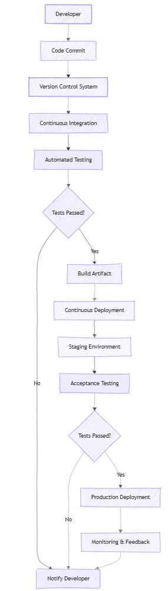
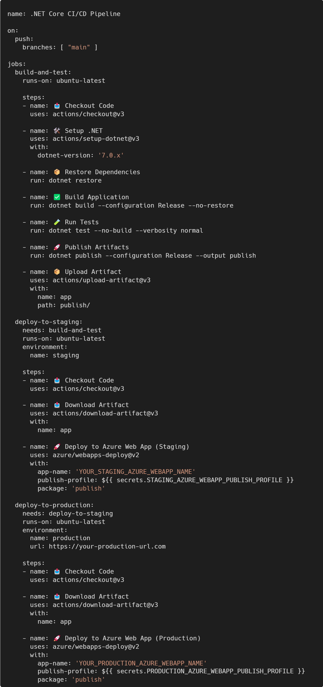
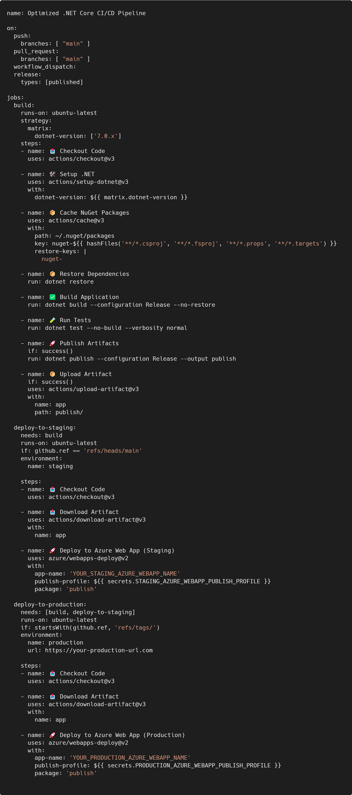
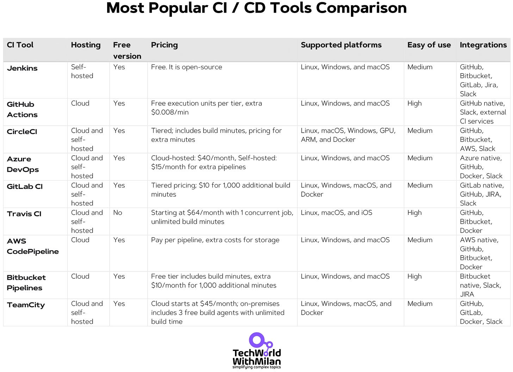
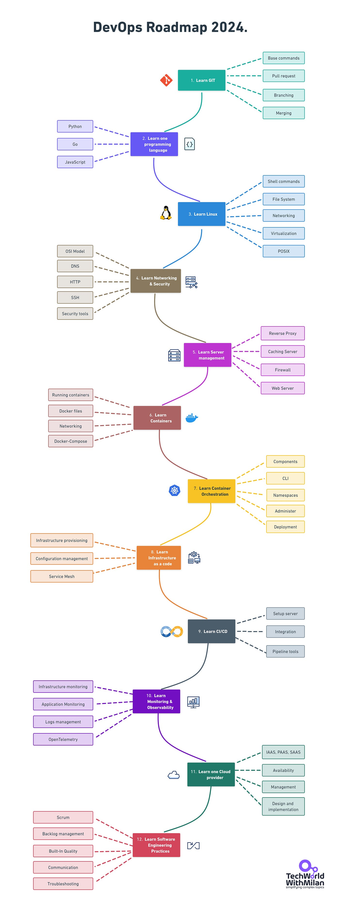

# What is CI/CD Pipeline ?

*and how to choose the right Cloud CI/CD Platform*

Delivering quality software quickly is more critical than ever in today's software development industry. **Continuous Integration and Continuous Delivery** (CI/CD) pipelines have become standard tools for development teams to move code from development to production. By enabling frequent code integrations and automated deployments, CI/CD pipelines help teams avoid the dreaded "integration hell" and ensure a reliable software release cycle.

In this article, we will learn about the fundamentals of CI/CD pipelines—what they are, how they work, and why they're necessary in modern software development. We'll explore the **different stages of a CI/CD pipeline, provide real-world examples using tools like GitHub Actions, and discuss strategies for optimizing your pipeline's performance**.

Additionally, we'll discuss **selecting the right CI/CD platform for your organization,** considering factors like cloud-based versus self-hosted options, integration capabilities, and user-friendliness.

So, let’s dive in.

---

## [Grow into a better developer with Rider for free (Sponsored)](https://www.jetbrains.com/rider/?utm_campaign=rider_free&utm_content=site&utm_medium=cpc&utm_source=milanmilanovict_newsletter_1)

*Are you looking for a cross-platform IDE to support your .NET and game dev learning journey? JetBrains Rider is **now free for non-commercial development**, making it more accessible for hobbyists, students, content creators, and open-source contributors.*

[Download and start today](https://www.jetbrains.com/rider/?utm_campaign=rider_free&utm_content=site&utm_medium=cpc&utm_source=milanmilanovict_newsletter_1)

---

## What is CI/CD Pipeline?

CI and CD stand for **Continous Integration** and **Continous Delivery**. In the simplest terms possible, Continuous Integration (CI) is a technique where incremental code changes are reliably and regularly made. Code updates merged into the repository are made reliable by automated build-and-test procedures that CI sparks. Then, the code is swiftly and efficiently deployed as part of the CD process. The CI/CD pipeline, as used in the software industry, is the automation that enables developers to reliably transfer incremental code changes from their machines to test and production.

Before CI/CD became standard practice, software teams often faced what was known as "**integration hell.**" Developers would work in isolation for weeks or months, leading to painful integration processes when merging code. Deployments were manual and error-prone and often required weekend-long maintenance windows.

The introduction of agile methods and the need for faster delivery cycles led to the development of CI/CD practices. What **started as simple scripts to automate builds** has evolved into sophisticated pipelines that can **deliver code changes to production multiple times per day**.

CI/CD often includes a **[Continous Deployment](https://newsletter.techworld-with-milan.com/i/129063841/top-most-important-strategies-for-continuous-deployment)**, too, which means that the code deployed to the repository will be automatically deployed to production. Taken together, these connected practices are often referred to as a "**CI/CD Pipeline**." They are usually maintained using a DevOps or SRE approach. Having CI/CD pipelines has multiple benefits, such as improved collaboration, code quality, and more agile and reliable systems.

There are **different stages** of a CI/CD pipeline:

1. **📥 Source stage:** Code is checked from a version control system like Git.
2. **🔧 Build stage:** The application is compiled or built from the source code.
3. **✅ Test stage:** Automated tests run to validate code integrity.
4. **🚀 Deploy stage:** The application is deployed to staging or production environments.

However, many more activities could include code analysis, approval gates, environment variable configuration, and monitoring and alerting.

CI/CD Pipeline

An example of a **real-life CI/CD pipeline** could look like this:

- **Code commit:** A developer pushes code to the GitHub repository.
- **Automated build:** GitHub Actions triggers a workflow that builds the application.
- **Automated testing:** The workflow runs unit tests and integration tests.
- **Deployment to staging:** If tests pass, the application is deployed to a staging environment.
- **Approval for production:** A team member reviews and approves deployment.
- **Deployment to production:** The application is deployed to the production environment.

CI/CD Pipeline workflow (Mermaid diagram)

👉 An example of a **GitHub Action workflow for a .NET application** is below. When code is pushed to the main branch, the pipeline triggers a job that restores dependencies, builds the application, and runs tests to ensure everything works correctly. If the tests pass, it publishes the application and uploads the artifacts. The pipeline then automatically deploys the application to a **staging environment** for further evaluation. Manual approval is required before proceeding with deployment to staging. Once a designated reviewer approves, the pipeline deploys the application to the **production environment**.

.NET Core CI/CD Pipeline via GitHub Actions

## Optimizing CI/CD Pipeline

If you already have a CI/CD Pipeline, there are a few things you can do to **improve its performance**, especially if the whole process runs for a long time:

### **1. Identify bottlenecks**

- **🔀 Lack of parallelism**: Processes running sequentially can slow down the pipeline. Enable parallel execution where possible.
- **⏳ Long-running tests**: Optimize or parallelize tests that take excessive time.

### **2. Streamline the build process.**

- **🗑️ Remove unnecessary dependencies:** Eliminate unused libraries or modules.
- **⚙️ Optimize build configurations:** Adjust infrastructure for faster build times.

### **3. Improve testing efficiency**

- **🎯 Prioritize critical tests:** Run essential tests first to catch major issues early.
- **🐳 Use test containers:** Isolate tests in containers for consistent environments.

### **4. Use caching and artifacts**

- **📦 Cache dependencies:** Store dependencies to avoid re-downloading them.
- **♻️ Reuse build artifacts:** Use artifacts from previous stages to save time.

If we take a look at the previous GitHub Action workflow, we can improve a few things, such as:

- **Caching dependencies**: Use caching to avoid re-downloading NuGet packages on every run.
- **Parallel jobs**: Run the build and test jobs in parallel when possible. The `deploy-to-staging` job depends on `build`, but not on `deploy-to-production`. The `deploy-to-production` a job depends on both `build` and `deploy-to-staging`.
- **Conditional deployment**: Deploy to production only when the code is tagged with a release version (`if: startsWith(github.ref, 'refs/tags/'`).
- **Fail fast strategy**: Configure the pipeline to fail quickly as an error occurs. By default, GitHub Actions stops a job when a step fails, yet we added `if: success()` to ensure that subsequent steps run only if previous steps succeeded.
- **Selective test execution**: Run only impacted tests to reduce testing time.

Optimized .NET CI/CD Pipeline via GitHub Actions

## How to choose CI/CD Platform

There are several things to consider while selecting the appropriate CI/CD platform for your company:

1. **Cloud-based vs. self-hosted options**. We see more and more companies transitioning to cloud-based CI tools. The web user interface (UI) for controlling your build pipelines is generally included in cloud-based CI/CD technologies, with the build agents or runners being hosted on public or private cloud infrastructure. Installation and upkeep are not necessary with a cloud-based system. With self-hosted alternatives, you may decide whether to put your build server and build agents in a private cloud, on hardware located on your premises, or publicly accessible cloud infrastructure.
2. **User-friendliness**. The platform should be easy to use and manage, with a user-friendly interface and precise documentation.
3. **Integration with your programming languages and tools**. The CI/CD platform should integrate seamlessly with the tools your team already uses, including source control systems, programming languages, issue-tracking tools, and cloud platforms.
4. **Configuration**. Configuring your automated CI/CD pipelines entails setting everything from the trigger starting each pipeline run to the response to a failing build or test. Scripts or a user interface (UI) can configure these settings.
5. **Knowledge about the platform**. As with all tech, we should always consider whether our engineers have expertise and experience on the platform we want to select. If they don’t, we must check if we have a proper document. Some platforms are better documented, and some are not.

Popular CI/CD Platforms, with more than 80% of the market share, are:

- **[GitHub Actions](https://github.com/features/actions)**: A newer CI/CD platform from Microsoft that tightly integrates with its GitHub-hosted DVCS (distributed version control system) platform and GitHub Enterprise. It's an excellent choice if your business has already committed to using GitHub as your DVCS, has all of your code stored in GitHub, and doesn’t mind your code is being built and tested remotely on GitHub’s servers.
- **[Jenkins](https://www.jenkins.io/)**: An open-source CI/CD platform based on Java. It's highly flexible and supports many configurations but requires more setup time. It's an excellent platform for businesses and users who prefer to run their own CI/CD platform locally due to security or legal precedents or if the software being built and tested on the CI/CD platform has specific hardware/software stack requirements.
- **[JetBrains TeamCity](https://www.jetbrains.com/teamcity/)**. It is a versatile CI/CD solution that accommodates various workflows and development practices. It allows you to write CI/CD configurations using Kotlin, leveraging the capabilities of a full-featured programming language and its robust toolset. It offers native support for languages like Java, .NET, Python, Ruby, and Xcode and extends to others through a rich plugin ecosystem. Additionally, TeamCity integrates with tools such as Bugzilla, Docker, Jira, Maven, NuGet, Visual Studio Team Services, and YouTrack, enhancing its functionality within your development environment.
- **[CircleCI](https://circleci.com/)**: Known for its ease of use for getting up and running with a continuous integration build system. It offers cloud hosting or enterprise on-premise hosting and integration with GitHub, GitHub Enterprise, and Bitbucket for the DVCS provider. It's a great choice if you’re already integrated with GitHub or Bitbucket and prefer a more straightforward pricing model instead of being charged by build minutes like other hosted platforms.
- **[Azure DevOps](https://azure.microsoft.com/en-us/products/devops)**: enables deployments to all significant cloud computing providers and offers out-of-the-box integrations for both on-premises and cloud-hosted build agents. It provides Azure Pipelines as a build-and-deploy service and Agile Board and Test Plans for exploratory testing. Also, it has Azure Artifacts, which allows packages to be shared from public or private registries.
- **[GitLab CI](https://docs.gitlab.com/ee/ci/)**: You don't need a third-party application or integration to develop, test, deploy, or monitor your applications with GitLab CI/CD. GitLab uses CI/CD templates to generate and execute essential pipelines to build and test your application after automatically recognizing your programming language. Afterward, you can set up deployments to send your apps to production and staging.
- **[Travis CI](https://www.travis-ci.com/)**: You can automate additional steps in your development process by controlling deployments and notifications and automatically building and testing code changes. This implies that you can use build stages to have workers depend on one another, set up notifications, prepare deployments following builds, and carry out a variety of other operations.
- **[AWS CodePipeline](https://aws.amazon.com/codepipeline/)** enables you to automate your release pipelines for prompt, dependable application and infrastructure updates. It is a fully managed continuous delivery solution. Every time a code change occurs, CodePipeline automates your release process's build, test, and deploy portions, depending on the release model you establish.
- **[Bitbucket](https://bitbucket.org/product)**: This add-on for Bitbucket Cloud enables users to start automated build, test, and deployment processes on each commit, push, or pull request. Jira Trello and the rest of the Atlassian product range are natively integrated with Bitbucket Pipelines.

Other tools include Bamboo, Drone, AppVeyor, Codeship, Spinnaker, IBM Cloud Continuous Delivery, CloudBees, Bitrise, Codefresh, and more.

### ➡️ Deciding on the right cloud CI/CD platform

Here’s how to find the best one for your team:

**1. Scalability and performance**

Start by evaluating your project's scalability and performance needs. If scaling and handling multiple builds are crucial, consider robust platforms like **CircleCI** or **AWS CodePipeline**. Their infrastructure is designed to manage large workloads efficiently.

Platforms like **Azure DevOps** are ideal for cloud-specific environments if you’re already invested in the Microsoft ecosystem. These tools offer good integration with other services within the cloud.

**2. Ease of use and learning curve**

The learning curve can be an essential factor for your team. Tools like **GitHub Actions** and **Travis CI** are good examples, as they offer user-friendly interfaces and straightforward setups. Your team can quickly configure pipelines without requiring extensive prior experience or training.

**3. Customization and extensibility**

Look for platforms with good customization options for complex workflows. **Jenkins** and **TeamCity** are good selections in this area, as they provide a rich ecosystem of plugins and flexible configurations to meet specialized project requirements.

**4. Cost structure**

Finally, assess the cost. Some platforms, like **GitLab CI/CD** and **Bitbucket Pipelines**, offer generous free tiers, which can be sufficient for smaller teams or projects. Others may have costs based on usage, features, or the number of users. Ensure the pricing aligns with your budget and growth plans.

Most popular CI/CD tools comparison

> *Also, check out my full **[DevOps Roadmap for 2024](https://github.com/milanm/DevOps-Roadmap)** with (mostly) free learning resources, in the living repo with more than 12k ⭐.*

---

## More ways I can help you

1. **[LinkedIn Content Creator Masterclass](https://www.patreon.com/techworld_with_milan/shop/short-linkedin-content-creator-311232?utm_medium=clipboard_copy&utm_source=copyLink&utm_campaign=productshare_creator&utm_content=join_link).**In this masterclass, I share my strategies for growing your influence on LinkedIn in the Tech space. You'll learn how to define your target audience, master the LinkedIn algorithm, create impactful content using my writing system, and create a content strategy that drives impressive results. **Now, it’s** **discounted to only $29**!
2. **[Resume Reality Check"](https://www.patreon.com/techworld_with_milan/shop/resume-reality-check-311008?source=storefront)**. I can now offer you a new service where I’ll review your CV and LinkedIn profile, providing instant, honest feedback from a CTO’s perspective. You’ll discover what stands out, what needs improvement, and how recruiters and engineering managers view your resume at first glance.
3. **[Promote yourself to 36,000+ subscribers](https://newsletter.techworld-with-milan.com/p/sponsorship-of-tech-world-with-milan)**by sponsoring this newsletter. This newsletter puts you in front of an audience with many engineering leaders and senior engineers who influence tech decisions and purchases.
4. **[Join my Patreon community](https://www.patreon.com/techworld_with_milan)**: This is your way of supporting me, saying “**thanks**, " and getting more benefits. You will get exclusive benefits, including all of my books and templates on Design Patterns, Setting priorities, and more, worth $100, early access to my content, insider news, helpful resources and tools, priority support, and the possibility to influence my work.
5. **1:1 Coaching:** [Book a working session with me](https://newsletter.techworld-with-milan.com/p/coaching-services). 1:1 coaching is available for personal and organizational/team growth topics. I help you become a high-performing leader and engineer 🚀.

---

Thanks for reading Tech World With Milan Newsletter! Subscribe for free to receive new posts and support my work.