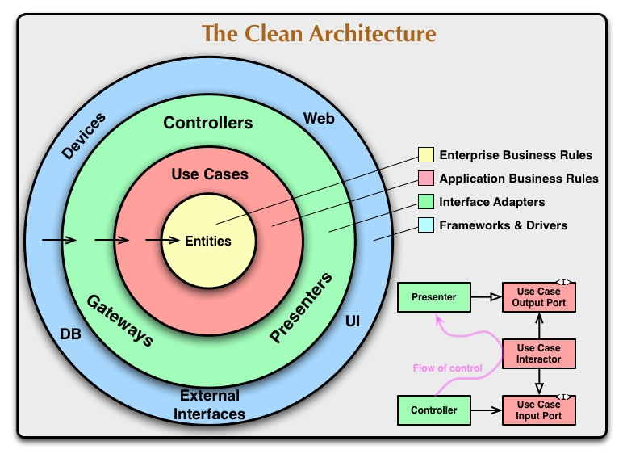
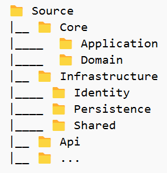
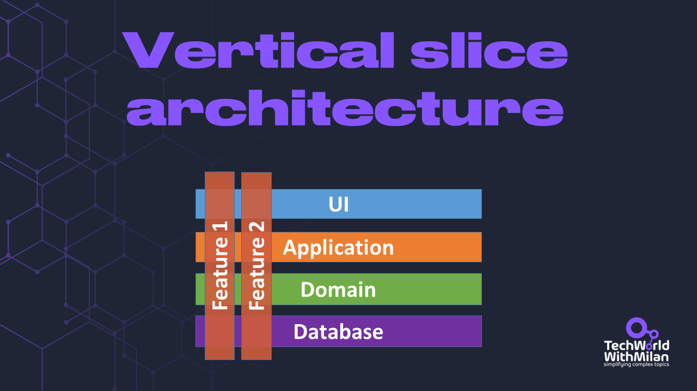
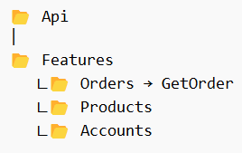
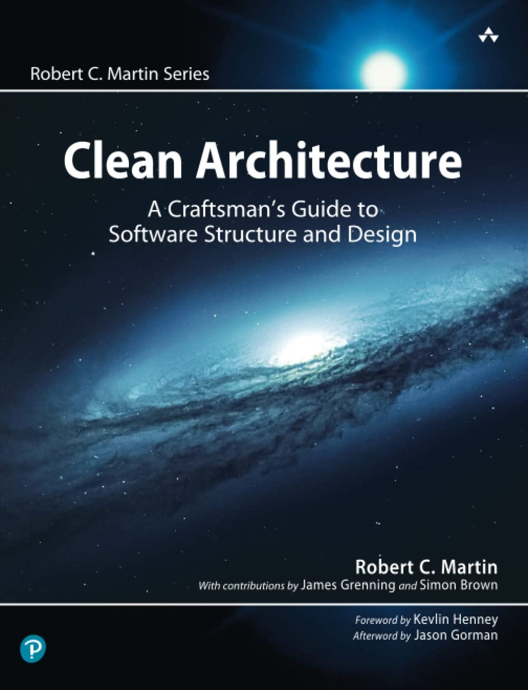
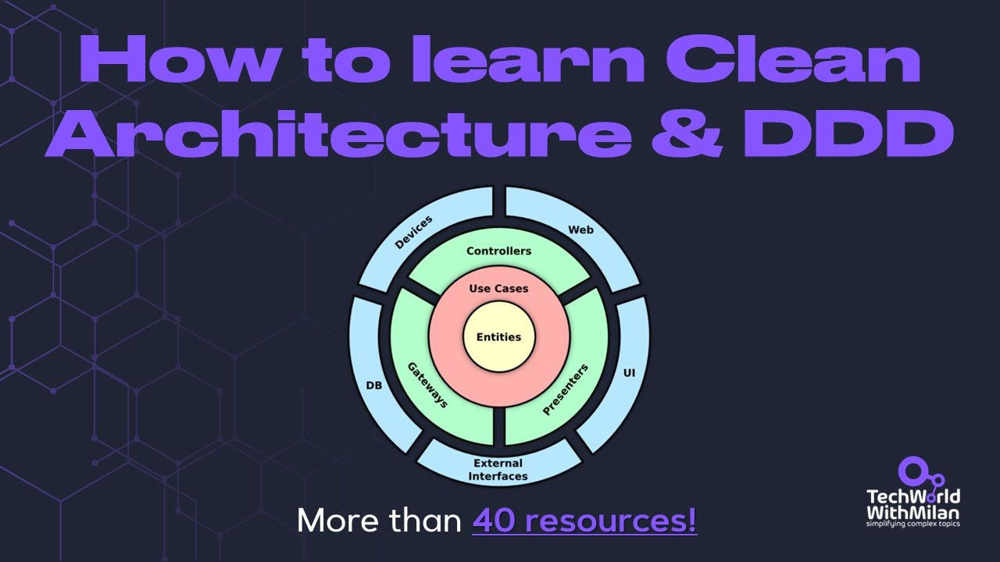

# What is Clean Architecture?

*and more than 40 resources to learn it well.*

In this issue, we will discuss **Clean Architecture**. What is it, when should you use it, and when should you not? We will find out why **vertical slice architecture** is necessary, and we will also see some essential learning resources (more than 40) on clean architecture and domain-driven design.

So, let’s dive in.

---

The Clean Architecture philosophy emphasizes the importance of [separating concerns](https://en.wikipedia.org/wiki/Separation_of_concerns) in software design and creating modular, testable, and maintainable code. It was developed by a software engineer and consultant, Robert C. Martin, and introduced in 2012. in [this blog post](https://blog.cleancoder.com/uncle-bob/2012/08/13/the-clean-architecture.html).

At its core, Clean Architecture promotes the idea that software systems **should be designed to be understood and maintained by developers over the long term**. To achieve this goal, Clean Architecture proposes a layered architecture with **clear boundaries between different system components** to achieve independence of frameworks, UI, databases, and delivery mechanisms and the possibility to test in isolation. Clean Architecture borrows ideas from **[Hexagonal Architecture](https://alistair.cockburn.us/hexagonal-architecture/)**, also known as Ports and Adapters, which emphasizes separating business logic from external dependencies. This architectural pattern facilitates easier testing and promotes flexibility by decoupling the core application from external frameworks and libraries.

The Clean Architecture philosophy defines a **set of layers**, starting with the most general and abstract layers and moving toward the most concrete and specific layers. These layers include:

- **Entities**. The system's fundamental objects represent the core business logic and data. They encapsulate the most general and high-level rules.
- **Use cases** involve high-level interactions between the system and its users or other external systems containing application-specific business rules. This layer is not expected to affect the entities or external systems.
- **Interfaces**. The mechanisms by which the system communicates with external systems or users. Here, we can have an MVC architecture of a GUI.
- **Controllers.** The components manage the data flow between the other system layers.
- **Presenters.** The components are responsible for presenting data to users or other systems.
- **Infrastructure.** The components are responsible for interacting with external systems or services, such as databases or APIs.

The Clean Architecture (Source: [Uncle Bob Martin blog](https://blog.cleancoder.com/uncle-bob/2012/08/13/the-clean-architecture.html))

An **application structure** with Clean Architecture could look like this:

Compared to **[Onion Architecture](https://jeffreypalermo.com/2008/07/the-onion-architecture-part-1/)**, Clean Architecture offers a more precise [separation of concerns](https://en.wikipedia.org/wiki/Separation_of_concerns) and a better comprehension of boundaries. They support similar ideals but with various levels and are close relatives.

### When should you use Clean Architecture?

We should use Clean Architecture when:

- Building **complex or long-lived applications where maintainability, testability, and scalability are crucial**.
- It's suitable for projects **where the domain model is central to the application's functionality** and needs to be well-defined and encapsulated.
- Clean Architecture **benefits teams that prioritize clean code practices, [separation of concerns](https://en.wikipedia.org/wiki/Separation_of_concerns), and a domain-driven design approach**.

### When should we not use Clean Architecture?

- Clean Architecture might introduce unnecessary complexity and overhead **for small or simple projects with straightforward requirements**. It introduces increased complexity, with more layers and abstractions, which can make the codebase more complex.
- **Projects with tight deadlines or limited resources** may not benefit from the upfront investment required to implement Clean Architecture.
- If the **project's requirements are likely to change frequently** or the domain model is not well-understood, a more flexible and agile approach might be more appropriate.
- **Teams unfamiliar with the architecture**: If the development team is not familiar with the principles of Clean Architecture, the learning curve could lead to implementation mistakes and slow development.

> *Clean architecture makes it crystal clear why each layer is necessary and what their roles are, which is why it is often referred to as **Screaming architecture**(along with Onion and Hexagonal architectures).*
> 
> *The term "Screaming Architecture" suggests that the architecture should "scream out" its intent and purpose, making it evident to developers, stakeholders, and anyone involved in the project. Here we want to **keep domain related code separate from technical details**.*
> 
> *For example, if you’re building an e-commerce platform, someone looking at your codebase should immediately see elements like "ShoppingCart," "ProductCatalog," and "CustomerProfile" instead of just "Controllers," "Services," and "DTOs."*
> 
> *This is achieved by following principles such as:*
> 
> - ***Domain-Centric Design:** The architecture should reflect the domain and business logic of the system, making it easy to understand how the software solves real-world problems.*
> - ***Clear Separation of Concerns:** Different parts of the system should have clear and distinct responsibilities with well-defined boundaries. This separation makes it easier to reason about and maintain the codebase.*
> - ***Dependency Inversion:** Dependencies should be abstracted from the core business logic, allowing flexibility and easier testing. This principle promotes loose coupling and high cohesion within the system.*
> - ***Use of Patterns and Practices:** Applying design patterns and best practices helps to standardize the architecture and make it more predictable and understandable.*

*[The Tower of Babel](https://en.wikipedia.org/wiki/The_Tower_of_Babel_%28Bruegel%29)*[(Bruegel)](https://en.wikipedia.org/wiki/The_Tower_of_Babel_%28Bruegel%29)

---

## How to scale your system with Vertical Slice Architecture

When using standard architectural patterns, such as the Layered or Clean architecture approach, where we have N-layers, such architecture doesn't scale well when the application grows. We usually violate the Single Responsibility Principle (SRP), as one functionality is split across many layers. We need to know about all dependencies between layers to implement a feature or fix a bug.

With **[Vertical Slice Architecture](https://jimmybogard.com/vertical-slice-architecture/)**, we build our architecture over different requests, grouping all concerns from the front end to the back end. Here, we couple vertically along the slice, minimizing coupling between slices and maximizing coupling in a slice (**things that change together belong together**).

Vertical slice architecture

This means we don't need many abstractions, such as repositories, services, etc. With this approach, **every slice decides how to approach a request**. In addition, this approach enables us to test our application better, as the boundaries of the test become a lot cleaner. This allows us to write integration tests with little mocking that are unrelated to the feature we are testing.

**The code structure of such architecture** would look like this:

---

## How to Learn Clean Architecture and Domain-Driven Design?

While conceptually straightforward, applying clean architecture effectively can have a learning curve. It requires an understanding of dependency injection and good software design practices. If you want to learn more about it, with real-life examples, here are some learning resources:

### **📚 Books**

1. "Clean Architecture: A Craftsman's Guide to Software Structure and Design," Robert C. Martin https://amzn.to/40XN8yt
2. "Get Your Hands Dirty on Clean Architecture," Tom Hombergs https://amzn.to/3SZrJ65

### **📝 Articles**

1. "[The Clean Architecture](https://blog.cleancoder.com/uncle-bob/2012/08/13/the-clean-architecture.html),” Robert C. Martin blog.
2. "[Clean Architecture: Standing on the shoulders of giants](https://herbertograca.com/2017/09/28/clean-architecture-standing-on-the-shoulders-of-giants/),” Herberto Graca.
3. "[DDD, Hexagonal, Onion, Clean, CQRS, … How I put it all together](https://herbertograca.com/2017/11/16/explicit-architecture-01-ddd-hexagonal-onion-clean-cqrs-how-i-put-it-all-together/)", Herberto Graca.
4. "[A Brief Intro to Clean Architecture, Clean DDD, and CQRS](https://blog.jacobsdata.com/2020/02/19/a-brief-intro-to-clean-architecture-clean-ddd-and-cqrs),” John Jacobs
5. "[A Template for Clean Domain-Driven Design Architecture](https://blog.jacobsdata.com/2020/03/02/a-clean-domain-driven-design-architectural-template)," John Jacobs
6. "[CQRS Translated to Clean Architecture](https://blog.fals.io/2018-09-19-cqrs-clean-architecture/),” Filipe Lima.
7. "[Multiple ways of defining Clean Architecture layers](https://proandroiddev.com/multiple-ways-of-defining-clean-architecture-layers-bbb70afa5d4a)," Igor Wojda.
8. "[Rules to Better Clean Architecture](https://ssw.com.au/rules/rules-to-better-clean-architecture/)," SSW Rules.
9. "[Clean Architecture for .NET Applications](https://paulovich.net/clean-architecture-for-net-applications/)," Ivan Paulovich.
10. "[Clean Architecture Essentials](https://paulovich.net/clean-architecture-essentials/)," Ivan Paulovich.
11. "[Implementing Clean Architecture in ASP.NET Application](https://harshmatharu.com/blog/clean-architecture-in-aspnet)," Harsh Matharu.
12. "[Implementing Clean Architecture - Make it scream](https://www.plainionist.net/Implementing-Clean-Architecture-Scream)," Plainionist.
13. "[Adoption of Clean Architecture layers with modules](https://anil-gudigar.medium.com/adoption-of-clean-architecture-layers-with-modules-a0b5b9b4e716)," Anil Gudigar.
14. “[Vertical slice Architecture](https://jimmybogard.com/vertical-slice-architecture/),” Jimmy Bogard.

### **⏩ Videos**

1. "[Clean Architecture](https://www.youtube.com/watch?v=2dKZ-dWaCiU),” Robert C. Martin.
2. "[Clean Architecture: Patterns, Practices, and Principles](https://app.pluralsight.com/library/courses/clean-architecture-patterns-practices-principles/table-of-contents)," Matthew Renze.
3. "[Clean Testing - Clean Architecture with .NET Core](https://www.youtube.com/watch?v=T6NRcX1vnz8)," Jason Taylor, NDC Oslo 2020.
4. "[Clean Architecture Example & Breakdown - Do I use it?](https://www.youtube.com/watch?v=Ys_W6MyWOCw)", CodeOpinion.
5. "[Clean Architecture with ASP.NET Core](https://www.youtube.com/watch?v=lkmvnjypENw),” Steve "Ardalis" Smith.
6. "[Clean Architecture & DDD Series](https://www.youtube.com/playlist?list=PLYpjLpq5ZDGstQ5afRz-34o_0dexr1RGa)," Milan Jovanović.

### **🗔 Samples**

1. "[Learn Domain-Driven Design, software architecture, design patterns, best practices.](https://github.com/Sairyss/domain-driven-hexagon)" by Sairyss.
2. "[Clean Architecture Solution Template for ASP.NET Core](https://github.com/jasontaylordev/CleanArchitecture)," by Jason Taylor.
3. "[Clean Architecture Solution Template: A starting point for Clean Architecture with ASP.NET Core](https://github.com/ardalis/cleanarchitecture)," by Steve Smith.
4. "[Go (Golang) Clean Architecture](https://github.com/bxcodec/go-clean-arch)," Iman Tumorang.
5. "[SwiftUI sample app using Clean Architecture](https://github.com/nalexn/clean-architecture-swiftui)," Alexey Naumov.
6. "[Android - Clean Architecture - Kotlin](https://github.com/android10/Android-CleanArchitecture-Kotlin)," Fernando Cejas.
7. "[DDD/Clean Architecture inspired boilerplate for Node web APIs](https://github.com/talyssonoc/node-api-boilerplate)," Talysson de Oliveira Cassiano.

### **🎨 Domain-Driven Design**

1. "[Domain-Driven Design: Tackling Complexity in the Heart of Software](https://amzn.to/40Vl3b2)," book by Eric Evans.
2. "[Domain-Driven Design Distilled](https://amzn.to/3t1abMa)," book by Vaughn Vernon.
3. "[An Introduction to Domain-Driven Design (DDD)](https://khalilstemmler.com/articles/domain-driven-design-intro/#building-blockshttps://martinfowler.com/bliki/DomainDrivenDesign.html)," Khalil Stemmler.
4. "[Design a DDD-oriented microservice](https://learn.microsoft.com/en-us/dotnet/architecture/microservices/microservice-ddd-cqrs-patterns/ddd-oriented-microservice#layers-in-ddd-microservices)," Microsoft.
5. "[Domain-Driven Design — Designing Software in a Complex Domain](https://levelup.gitconnected.com/designing-software-in-a-complex-domain-domain-driven-design-10604ad08d12)," Bibek Shah.
6. "[Domain-Driven Design Starter Modelling Process](https://github.com/ddd-crew/ddd-starter-modelling-process)," DDD Crew.
7. "[Practical DDD](https://medium.com/augury-research-and-development/practical-ddd-part-1-setting-the-right-foundations-5b7e4b16c9e8)," Hila Fox.
8. "[Visualising Socio-Technical Architecture with DDD and Team Topologies](https://medium.com/nick-tune-tech-strategy-blog/visualising-sociotechnical-architecture-with-ddd-and-team-topologies-48c6be036c40)," Nick Tune.
9. "[The Bounded Context Canvas](https://miro.com/miroverse/the-bounded-context-canvas/)," Nick Tune.
10. "[Domain-Driven Design example with problem space strategic analysis and various tactical patterns](https://github.com/ddd-by-examples/library)."
11. "[DDD Beyond the Basics: Mastering Aggregate Design](https://medium.com/ssense-tech/ddd-beyond-the-basics-mastering-aggregate-design-26591e218c8c)," Mario Bittencourt.
12. "[Domain-driven design practice — Modelling the payments system](https://medium.com/airwallex-engineering/domain-driven-design-practice-modeling-payments-system-f7bc5cf64bb3)," Chaojie Xiao.
13. "[Event Storming: a technique to understand complex projects](https://medium.com/@danilopvilhena/event-storming-a-technique-to-understand-complex-projects-79bacc54b7b)," Danilo Vilhena

---

## More ways I can help you

1. **[Patreon Community](https://www.patreon.com/techworld_with_milan)**: Join my community of engineers, managers, and software architects. You will get exclusive benefits, including all of my books and templates (worth 100$), early access to my content, insider news, helpful resources and tools, priority support, and the possibility to influence my work.
2. **[Sponsoring this newsletter will promote you to 33,000+ subscribers](https://newsletter.techworld-with-milan.com/p/sponsorship-of-tech-world-with-milan)**. It puts you in front of an audience of many engineering leaders and senior engineers who influence tech decisions and purchases.
3. **1:1 Coaching:** [Book a working session with me](https://newsletter.techworld-with-milan.com/p/coaching-services). 1:1 coaching is available for personal and organizational/team growth topics. I help you become a high-performing leader 🚀.

Thanks for reading Tech World With Milan Newsletter! Subscribe for free to receive new posts and support my work.