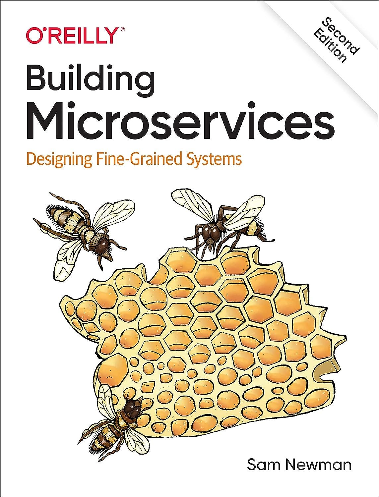
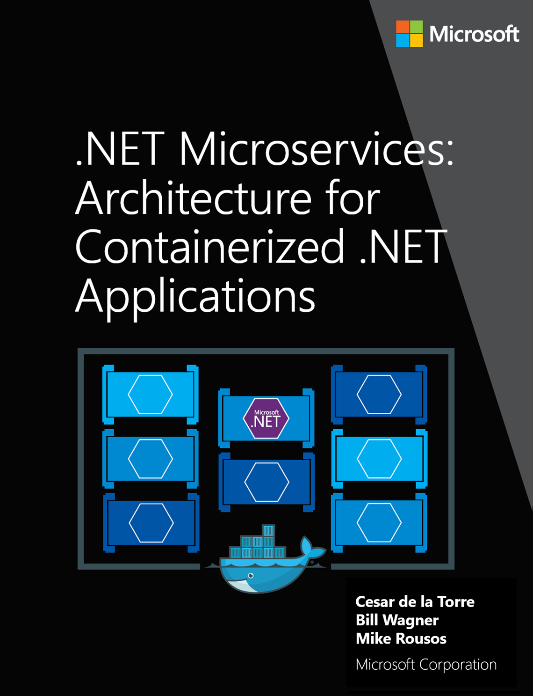
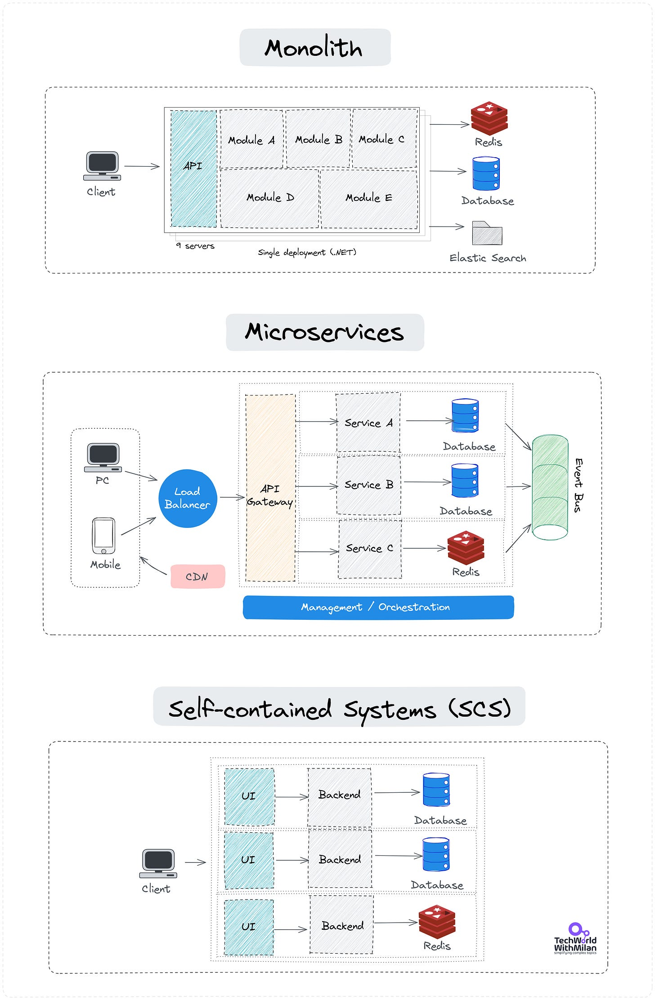
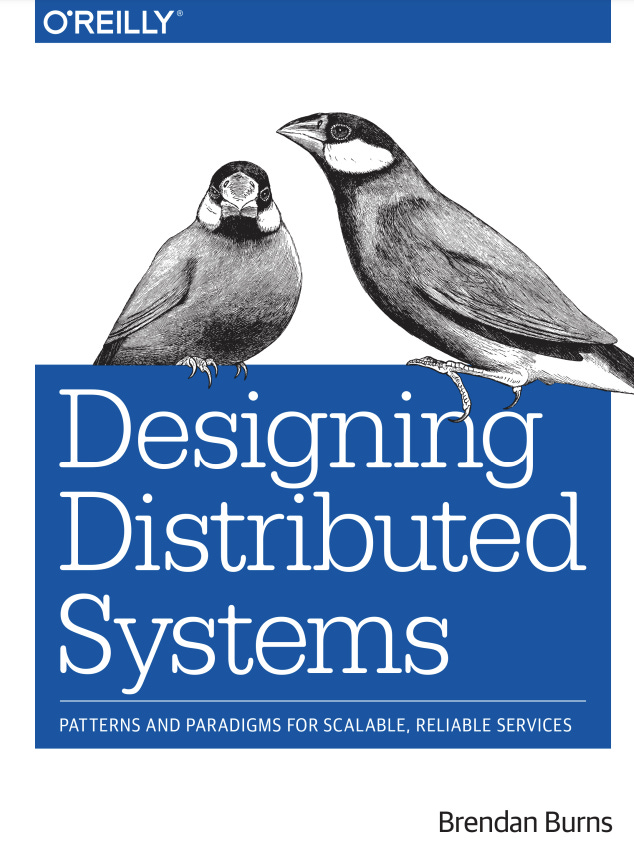

# What is Microservice Architecture?

*and how to properly do it with Self-contained Systems (SCS).*

Microservice architecture has revolutionized how companies build and scale software. Giants like Netflix and Amazon leverage it to deliver new features rapidly and efficiently. But what exactly is microservice architecture, and why does it matter?

This post breaks down the core concepts, benefits, and trade-offs of microservices and explains how they compare to an alternative approach: Self-Contained Systems (SCS). Whether exploring microservices for the first time or considering a shift to SCS, this guide will help you navigate the key architectural choices and patterns that define modern software development.

So, let’s dive in.

---

## What is Microservice Architecture?

Have you ever wondered why companies like Netflix and Amazon seem to roll out features at the speed of light? The secret might be hidden in their tech stack based on Microservice architecture.

At its core, **Microservice architecture is about breaking down an application into a collection of small, loosely coupled services**. Each service runs a unique process and communicates through a well-defined API. Each service is a separate codebase, which can be managed by a small development team and deployed independently.

Sam Newman defined Microservices in his book "**[Building Microservices](https://samnewman.io/books/building_microservices_2nd_edition/)**" as:

> *Microservices are small, autonomous services that work together.*

Microservices architecture is **the best fit** when we have applications with high scalability needs, many subdomains, and possibly multiple cross-functional development teams. Take into account that **organizational shape influences your architecture**.

**Critical Elements of Microservice Architecture:**

1. **Load Balancer**: Ensures even distribution of incoming network traffic across various servers.
2. **CDN (Content Delivery Network):** A distributed server system that delivers web content based on the user's location. It's about bringing content closer to the end-user, making page loads faster.
3. **API Gateway:** This is a single entry point for all clients. It directs requests to the appropriate microservice using REST API or other protocols.
4. **Management**: Monitoring and coordinating the microservices, ensuring they run efficiently and communicate effectively.
5. **Microservices:** Each microservice handles a distinct functionality, allowing for focused development and easier troubleshooting. They can talk with each other using RPC (Remote Procedure Call). Services are responsible for persisting their own data or external state.

When building such architectures, we should strive for every service to have a **single responsibility** with clear boundaries. The services should **communicate asynchronously**, have **a separate database, and build+deployment** per microservice.

Microservice architecture

### **Benefits of Microservice Architecture**

- **Scalability**: Scale up specific parts of an app without affecting others.
- **Flexibility**: Each microservice can be developed, deployed, and scaled independently.
- **Resilience**: If one microservice fails, it doesn't affect the entire system.
- **Faster Deployments:** Smaller codebases mean quicker feature rollouts.

### Drawbacks of Microservice Architecture

- **Complexity:** More services can lead to a more complex system.
- **Eventual Consistency**: Maintaining consistency across services can be challenging.
- **Network Latency**: Inter-service communication can introduce delays.
- **Error handling**: When an error happens, it's hard to debug why and where it happened.
- **Wrong decomposition**: If you do a bad decomposition of your monolith, you can develop a [Distributed Monolith](https://newsletter.techworld-with-milan.com/i/119851189/what-is-a-distributed-monolith).

If you want to learn more about microservices, check out the book “**[Building Microservices](https://amzn.to/47jVKlv)**” by Sam Newman:

“Building Microservices” by Sam Newman

And the free book for **[.NET Microservice Architectures](https://learn.microsoft.com/en-us/dotnet/architecture/microservices/)** by Cesar de la Torre, Bill Wagner, and Mike Rousos:

“.NET Microservices: Architecture for Containerized .NET Applications” by Cesar de la Torre, Bill Wagner, and Mike Rousos:

Also, to handle different trade-offs when creating microservice architecture, we need to know patterns such as Circuit Breaker, Saga, etc. Check **[Design patterns for Microservices](https://azure.microsoft.com/en-us/blog/design-patterns-for-microservices/)** and **[monolith decomposition strategies](https://newsletter.techworld-with-milan.com/i/119851189/monolith-decomposition-strategy)**.

---

## What are Self-contained Systems (SCS)?

**Self-contained Systems (SCS)** are a software architecture approach that prioritizes the decentralization of applications into independent systems, each with its domain logic, UI, and data storage. Unlike Microservices, smaller services focused solely on business logic, SCS are larger and encompass a broader scope within a specific domain.

SCS are systems that represent **autonomous web applications**. They include web UI, business logic, and database and might have a service API. A single team usually owns them.

The main **advantages** of such systems are:

1. **Autonomy**: Each SCS operates independently with its database, business logic, and user interface.
2. **Domain-aligned**: SCS is structured around specific business domains, ensuring each unit represents a coherent and meaningful set of functionalities.
3. **Decentralized Data Management:** Individual databases per SCS ensure data consistency within its boundary, reducing cross-service dependencies.
4. **Technology Diversity**: Allows for different technology stacks to be used across other SCS, suiting the specific needs of each domain.
5. **Explicitly Published Interface:** Well-defined interfaces for interactions with other systems, maintaining a clear contract while preserving encapsulation.
6. **Independent Deployability:** Each SCS can be deployed, scaled, and updated independently without affecting other systems.

Why Self-contained Systems (SCS) has **the edge over microservices**:

- **Broader scope:** SCS has a broader scope encompassing the UI, business logic, and data storage within a bounded context
- **Reduced Operational Complexity:** Microservices can lead to high operational complexity due to managing many smaller, interdependent services, while SCS is more significant and autonomous.
- **Data Consistency:** SCS manages its data, which can improve data consistency within each system, while Microservices often rely on a shared data store.
- **Reduced Inter-service Communication:** SCS, by encapsulating more functionality, requires less inter-service communication than microservices.
- **Better Fit for Certain Domain Complexities:** Due to their domain-aligned nature, SCS might provide a better architectural fit in cases with high domain complexities and clear domain boundaries.

Self-contained Systems (SCS)

Such systems go well along with **Domain-Driven Design (DDD)**. The first step in creating such systems is domain analysis, which can be conducted by identifying bounded contexts that align with specific business domains. Each bounded context is then encapsulated within an SCS, which comprises its own data management, business logic, and user interface, ensuring each system is autonomous yet able to interact with others through well-defined APIs when necessary.

If you want to learn more about Self-contained Systems, check these resources:

- **[Self-contained Systems](https://scs-architecture.org)** by INNOQ.
- **[Self-contained Systems YT Playlist](https://www.youtube.com/playlist?list=PLnSDpJU-Yq1GHdrgOZOMdNqMie43Oz3sx).**
- **[“Self-Contained Systems (SCS): Microservices Done Right,](https://www.infoq.com/articles/scs-microservices-done-right/)”** InfoQ article.
- [“](https://medium.com/swissquote-engineering/our-journey-from-microservices-towards-self-contained-systems-87b72ea8d4ae)**[Our journey from Microservices towards Self Contained Systems,](https://medium.com/swissquote-engineering/our-journey-from-microservices-towards-self-contained-systems-87b72ea8d4ae)”** Swissquote article.
- **[Self-contained service](https://microservices.io/patterns/decomposition/self-contained-service.html)** at Microservices.io.

---

## Free e-book: Designing Distributed Systems

Check out the free book by Brendan Burns, **a creator of Kubernetes** on Distributed Systems. In this book, you will learn about the following:

- How patterns and reusable components enable the rapid development of reliable distributed systems.
- Using the sidecar, adapter, and ambassador patterns, you can divide your application into a group of containers on one machine.
- Explore loosely coupled multi-node distributed patterns for replication, scaling, and communication between the components.
- Learn distributed systems patterns for large-scale batch data processing.

Download the book from **[here](https://azure.microsoft.com/mediahandler/files/resourcefiles/designing-distributed-systems/Designing_Distributed_Systems.pdf)** and **[the labs](https://github.com/brendandburns/designing-distributed-systems-labs)** for the book.

“Designing Distributed Systems” by Brendan Burns

---

## 🎁 Promote your business to 350K+ tech professionals

Get your product in front of **more than 350,000+ tech professionals** who make or influence significant tech decisions. Our readership includes senior engineers and leaders who care about practical tools and services.

Ad space often books up weeks ahead. If you want to secure a spot, **[contact me](https://milan.milanovic.org/#contact)**.

Let’s grow together!

[Sponsor Tech World With Milan](https://newsletter.techworld-with-milan.com/p/sponsorship-of-tech-world-with-milan)

---

## More ways I can help you

1. **📢 [LinkedIn Content Creator Masterclass](https://www.patreon.com/techworld_with_milan/shop/short-linkedin-content-creator-311232?utm_medium=clipboard_copy&utm_source=copyLink&utm_campaign=productshare_creator&utm_content=join_link).**In this masterclass, I share my strategies for growing your influence on LinkedIn in the Tech space. You'll learn how to define your target audience, master the LinkedIn algorithm, create impactful content using my writing system, and create a content strategy that drives impressive results.
2. **📄 [Resume Reality Check](https://www.patreon.com/techworld_with_milan/shop/resume-reality-check-311008?source=storefront)**. I can now offer you a service where I’ll review your CV and LinkedIn profile, providing instant, honest feedback from a CTO’s perspective. You’ll discover what stands out, what needs improvement, and how recruiters and engineering managers view your resume at first glance.
3. **💡 [Join my Patreon community](https://www.patreon.com/techworld_with_milan)**: This is your way of supporting me, saying “**thanks**," and getting more benefits. You will get exclusive benefits, including 📚 all of my books and templates on Design Patterns, Setting priorities, and more, worth $100, early access to my content, insider news, helpful resources and tools, priority support, and the possibility to influence my work.
4. 🚀 **1:1 Coaching:** [Book a working session with me](https://newsletter.techworld-with-milan.com/p/coaching-services). I offer 1:1 coaching for personal, organizational, and team growth topics. I help you become a high-performing leader and engineer.

---

Thanks for reading Tech World With Milan Newsletter! Subscribe for free to receive new posts and support my work.