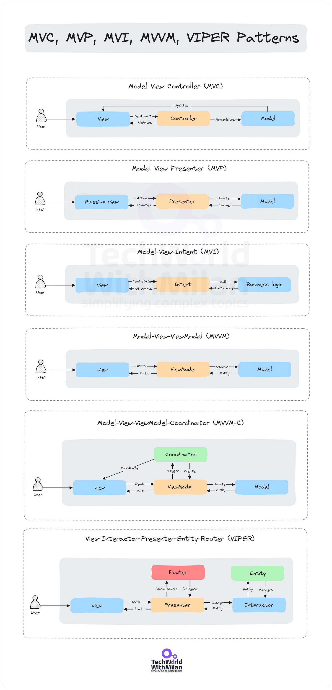
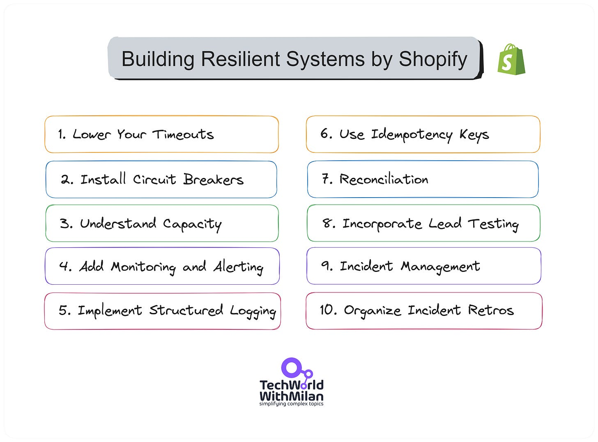
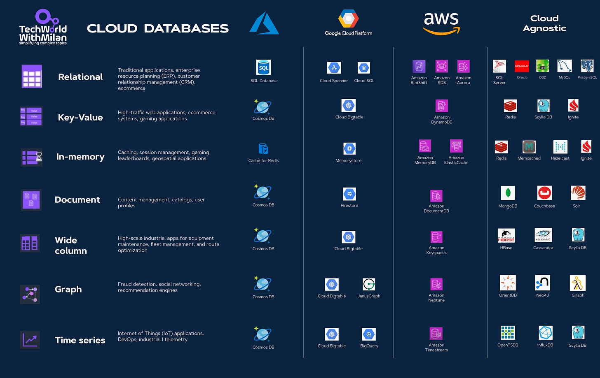

# What is the difference between MVC, MVP, MVI, MVVM, MVVM-C, and VIPER architecture patterns?

This week’s issue brings to you the following:

- **MVC, MVP, MVI, MVVM, and VIPER architecture patterns**
- **How Shopify Builds a Resilient Payment System**
- **Bonus: Cloud Databases Cheat Sheet**

So, let’s dive in.

---

# **MVC, MVP, MVI, MVVM, and VIPER architecture patterns**

**Architecture patterns** are blueprints for structuring software applications. They abstract solutions to common issues, ensuring efficiency, scalability, and maintainability.

Here is the list of the most essential architectural patterns:

1. **MVC (Model-View-Controller)**

It is one of the earliest and most adopted design patterns. Its primary goal is to separate the application's data, user interface, and control logic into three interconnected components.

Here, the Model manages data and logic, the View displays information, and the controller connects the Model and View and handles user input.

**Usage:** For Web applications with a clear separation between data handling and UI.
2. **MVP (Model-View-Presenter)**

The pattern evolved from MVC, aiming to address its shortcomings in event-driven environments by decoupling the View from the Model, with the Presenter acting as a middleman.

Here, the Model manages data, views display data, and sends user commands to the Presenter, while the Presenter retrieves data from the Model and presents it to the View.

**Usage:** Applications emphasizing testing and UI logic, such as Android apps.
3. **MVI (Model-View-Intent)**

MVI is a reactive architecture that embraces unidirectional data flow, ensuring that the UI remains consistent regardless of the state.

Here, the Model represents the state, View reflects the state, while intent represents user actions that change the state.

**Usage**: Reactive applications or frameworks like RxJava with a focus on state consistency.
4. **MVVM (Model-View-ViewModel)**

MVVM arose to address complexities in UI development, promoting a decoupled approach with the ViewModel handling view logic without knowing the UI components.

Here, the Model manages and displays data, while ViewModel holds and contains UI-related data.

**Usage:** UI-rich applications or platforms with data-binding, such as WPF or Android with LiveData.
5. **MVVM-C (MVVM with Coordinator)**

MVVM-C builds upon MVVM, introducing the Coordinator to handle navigation, decoupling it from View and ViewModel.

**Usage:** larger applications, especially iOS, where complex navigation needs separation from view logic.
6. **VIPER (View-Interactor-Presenter-Entity-Router)**

VIPER is a modular architecture akin to Clean Architecture. It emphasizes testability and the Single Responsibility Principle by breaking down application logic into distinct components.

Here, the View displays what the Presenter sends, the interactor contains business logic per use case, the Presenter contains view logic for preparing content, the entity includes a primary model object, and the router contains navigation logic.

**Usage**: Complex applications, especially iOS, need modularity, testability, and clarity.

MVP, MVC, MVI, MVVM, VIPER Patterns

---

# Building a Resilient Payment System by Shopify

The [recent article](https://shopify.engineering/building-resilient-payment-systems) by Shopify Engineering explained the top 10 most valuable tips and tricks for building resilient payment systems.

Here is the list:

1. **Lower your timeouts**

They suggest investigating and setting low timeouts everywhere possible. For instance, Ruby's built-in Net::HTTP client has a default timeout of 60 seconds to open a connection, write data, and read a response. This is too long for online applications where a user is waiting. The author suggests an open timeout of one second with a write and read or query timeout of five seconds as a starting point.
2. **Install Circuit Breakers**

Circuit breakers, like Shopify's Semian, protect services by raising an exception once a service is detected as being down. This saves resources by not waiting for another timeout. Semian protects Net::HTTP, MySQL, Redis, and gRPC services with a circuit breaker in Ruby.
3. **Understand Capacity**

The author discusses Little's Law, which states that the average number of customers in a system equals their average arrival rate multiplied by their average time. Understanding this relationship between queue size, throughput, and latency can help design systems that can handle load efficiently.
4. **Add Monitoring and Alerting**

Google's site reliability engineering (SRE) book lists four golden signals a user-facing system should be monitored for latency, traffic, errors, and saturation. Monitoring these metrics can help identify when a system is at risk of going down due to overload.
5. **Implement Structured Logging**

They recommend using structured logging in a machine-readable format, like key=value pairs or JSON, which allows log aggregation systems to parse and index the data. Passing along a correlation identifier to understand what happened inside a single web request or background job is beneficial in distributed systems.
6. **Use Idempotency Keys**

To ensure payment or refund happens precisely once, they recommend using Idempotency keys, which track attempts and provide only a single request sent to financial partners. This can be achieved by sending a unique idempotency key for each shot.
7. **Be Consistent With Reconciliation**

Reconciliation ensures that records are consistent with those of financial partners. Any discrepancies are recorded and automatically remediated where possible. This process helps maintain accurate records for tax purposes and generate accurate merchant reports.
8. **Incorporate Load Testing**

Regular load testing helps test systems' limits and protection mechanisms by simulating large-volume flash sales. Shopify uses scriptable load balancers to throttle the number of checkouts happening at any time.
9. **Get on Top of Incident Management**

Shopify uses a Slack bot to manage incidents, with roles for coordinating the incident, public communication, and restoring stability. This process starts when the on-call service owners get paged, either by an automatic alert based on monitoring or by hand, if someone notices a problem.
10. **Organize Incident Retrospectives**

Retrospective meetings are held within a week after an incident to understand what happened, correct incorrect assumptions, and prevent the same thing from happening again. This is a crucial step in learning from failures and improving system resilience.

---

# **Bonus: Cloud Databases Cheat Sheet**

Check out this helpful cheat sheet for different kinds of database types:

- **Relational**- Traditional applications, ERP, CRM, e-commerce.
- **Key-Value** - High-traffic web applications, e-commerce systems, and gaming applications.
- **In-memory** - Caching, session management, gaming leaderboards, geospatial applications.
- **Document** - Content management, catalogs, user profiles.
- **Wide-column**- High-scale industrial applications for equipment maintenance, fleet management, and route optimization.
- **Graph**- Fraud detection, social networking, recommendation engines.
- **Time-series**- Internet of Things (IoT) applications, DevOps, industrial telemetry.

Cloud Databases Cheat Sheet

> Download the cheat sheet in the **[PDF version](https://github.com/milanm/Cloud-Product-Mapping)**.

---

## More ways I can help you

1. **1:1 Coaching:** [Book a working session with me](https://newsletter.techworld-with-milan.com/p/coaching-services). 1:1 coaching is available for personal and organizational/team growth topics. I help you become a high-performing leader 🚀.
2. **[Promote yourself to 19,000+ subscribers](https://newsletter.techworld-with-milan.com/p/sponsorship-of-tech-world-with-milan)**by sponsoring this newsletter.

---

Thanks for reading Tech World With Milan Newsletter! Subscribe for free to receive new posts and support my work.