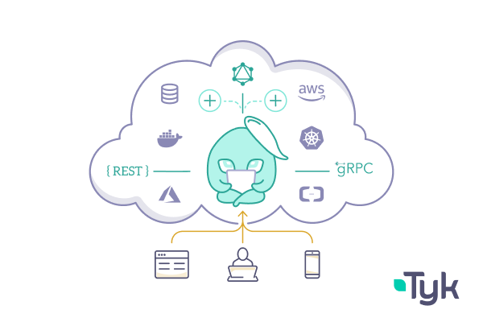

# What is the Fractional CTO role?

*What is the role about and what are the challenges of the role?*

We saw more and more that the Fractional CTO role is getting traction in the last years. What is it and it can help startups to grow, in this episode we are talking with **[Marc van Neerven](https://cto-as-a-service.nl/about/who/marc)**, who had his first CTO role in 2013. and working in a Fractional CTO role at Startups, Scaleups, and ISVs for more than 7 years now.

Thanks for reading Tech World With Milan Newsletter! Subscribe for free to receive new posts and support my work.

*With this, over to Marc.*

## **1. Marc’s short biography**

I've been working as a software architect in Enterprise CMS software for 15 years, and entered the startup world around 2010, first as an architect/lead developer, then as CTO. In 2016, I decided to set up a consultancy to help startups and scaleups with a subscription model, and called it **CTO-as-a-Service**, because I was working in a world where everything was provided as-a-service (IaaS, PaaS, SaaS, you name it).

---

🎁 This issue is brought to you by **[Tyk](https://tykio.info/3IL4VBp). [Tyk](https://tykio.info/3IL4VBp)**is a leading open-source API gateway and management platform, featuring an API gateway, analytics, developer portal, and dashboard. Tyk's API Gateway is provided ‘batteries-included’, with no feature lockout. Enabling your organization to control who accesses your APIs, when they access, and how they access it. [Sign up for a free trial now](https://tykio.info/3Y5ydiI)!

---

## **2. How do you define the role of a Chief Technology Officer?**

My definition is pretty close to the one Eric Ries, the writer of "The Lean Startup", gave in 2012: "**The CTO's primary job is to make sure the company's technology strategy serves its business strategy**". Pretty spot-on, I think, and often neglected: many people see the CTO as being a pure tech lead, even more than a strategist, let alone that they see it as a business role.

## **3. What is the Fractional CTO role?**

For me, a **Fractional CTO** (**fCTO**) is a consultant with long years of experience in developer, architect, and CTO roles, who provides interim services in organizations that either have no CTO yet because of the stage they're in, or have a lead dev who's acting as CTO, but has too little experience with the business- and/or strategic aspects of the role.

An fCTO normally gets hired by the CEO/board of a startup. Depending on the startup's stage, requirements, and budget, the fCTO will be engaging for a few hours to a few days per week. Sometimes, the role is purely advising, sometimes it can be taking the **interim CTO position**, even with just the fractional availability. This is only possible of course because a fractional CTO will never take operational responsibilities.

## **4. What was your first job as fCTO?**

A contract I got through a direct referral from **Microsoft**. The startup wanted to launch an international mobile video platform on Azure, with a lot of gamification elements. I mediated between the startup and Microsoft, to leverage Azure benefits and maximize cost-efficiency on Azure video storage and streaming services, worked on the platform architecture, and coached an outsourced team.

## **5. What are the challenges of the role?**

Each engagement as CTO has its challenges, depending on a lot of factors, such as stage, maturity, product state, and team, but specific to the fractional, consultancy role, there is stuff that you have to deal with **just because you're an external consultant taking on the role temporarily**. This means a lot of things, such as that you have to **document every step** of the way, for a handover, and that you don't have automatic buy-in on decision-making. It is in your interest and that of the company to explicitly get buy-in for any change you would like to implement, in process, team, technology, etc.

## **6. How do you approach your job with a new client, what are you looking at?**

Depends highly on the situation, but the first step is always to **absorb the domain**: I cannot look at software development challenges without understanding the domain first, at least to a degree. This is especially true because of the business aspect of the CTO role. Interviewing the CEO, board members, and tech team is essential, and while I'm at it, I often address the repetitive nature of having to transfer this (and other) knowledge and discuss internal **knowledge base tooling** - that I'm immediately starting to fill.

Another thing worth mentioning is, that what triggered my clients to hire me, might not be exactly what I bring to the table, because **they often don't know what they don't know.**

For instance, they might ask me to check the **scalability of their Cloud solution**, but I might address their development approach, especially if it's fully outsourced; they might ask me to validate the security of their mobile app, but I might address the usability/UX and/or platform choices altogether.

I can't help but have **a holistic approach** - the project might be constrained, however, obviously, because you can't do everything at once.

## **7. Does a CTO code?**

Yes and no. Having a strategic position, it would be a big mistake to take on production responsibilities. The reasons are obvious to me, but I have to keep saying them because clearly, there's a misunderstanding in the field that has probably been caused by the many so-called "**Startup-CTOs**" who start as lead developers in early startups, and who are just CTO-in-name if you ask experienced, strategic CTOs.

This doesn't mean that a CTO should never code: having had lead dev/architect roles, it is natural for a CTO to develop **Proofs-of-Concept and Prototypes**, but more as 'direction-of-travel' pieces, or as illustrations of how to use new technologies.

## **8. How Can a Software Engineer Grow into the CTO Role?**

I might be opinionated, but to be a great fCTO, I feel it was essential for me to have had both a long career as a full stack developer, plus a couple of permanent roles as CTO.

Also, since the CTO role is a business role, at C-level, you can't be an fCTO if you've never been in a C-level role, as part of the board of directors.

So, for **every Lead Developer with the ambition to become a CTO**, I say: *be careful what you wish for*. It's not a linear growth path, and I have personally met many aspiring CTOs in a Lead Developer role who were not ready to stop production coding and take a more high-level view of development.

---

Thanks for reading Tech World With Milan Newsletter! Subscribe for free to receive new posts and support my work.