# Why C#?

I might have been skeptical if someone had told me years ago that **[C#](https://en.wikipedia.org/wiki/C_Sharp_(programming_language))** would become my preferred programming language for most projects. Like many developers, I've explored various languages throughout my career—from low-level C++ to the enterprise king Java. Yet I keep returning to C#, and many people ask me why.

[C#](https://en.wikipedia.org/wiki/C_Sharp_(programming_language)) was Microsoft's response to Java during the platform wars of the early 2000s, but it quickly became something Java could never achieve. It was designed as a strongly typed language that combined the robustness of C++ with the simplicity of Visual Basic.

Unlike some languages that struggle to evolve, C# has been continuously refined, adapting to modern programming paradigms while maintaining backward compatibility.

Some people often ask me why I chose C# over many other languages, and in this text, I will attempt to explain my reasoning.

[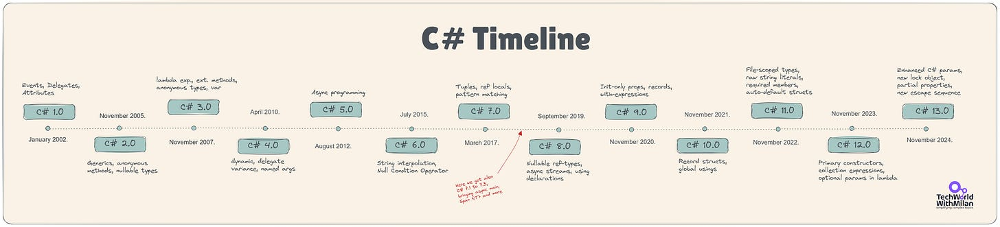](https://substackcdn.com/image/fetch/$s_!yyr-!,f_auto,q_auto:good,fl_progressive:steep/https%3A%2F%2Fsubstack-post-media.s3.amazonaws.com%2Fpublic%2Fimages%2Ff1600cfa-21f2-441f-9b2c-d48c47bfefb3_6446x1467.png)C# Timeline from C# 1.0 to C# 13.0

We will discuss the following:

1. **What is C#?**An overview of C#'s origins, goals, core characteristics, and design philosophy.
2. **The language**. We will discuss essential C# features, including Object-oriented programming, the type system, generics, lambdas, LINQ, async/await, and memory management.
3. **The .NET ecosystem.**We will explore the ecosystem in which C# operates, its various runtimes, and the frameworks that enable it to target different application domains.
4. **Tooling**. We will examine popular development tools and IDEs, including Visual Studio, Visual Studio Code, JetBrains Rider, and the .NET CLI.
5. **Libraries**. We will explore he standard .NET libraries and popular third-party packages available via NuGet.
6. **Documentation**. What are some available and popular resources, official documentation, and recommended materials for learning C# and .NET.
7. **Community**. We will address the questions about the type of community C# has and the critical initiatives, resources, and platforms that support developers.
8. **The popularity contest**. We will examine the popularity of C#, including its rankings, relevance to the job market, salaries, and community perception.
9. **C# vs other languages**. How C# compares to Java, Python, F#, and JavaScript/TypeScript.
10. **The future of C#.**What is the future evolution of C#, recent language advancements, and Microsoft's vision for continued innovation.
11. **Conclusion**. My insights on why C# is a good choice and suitable for various development scenarios.
12. **Bonus: A brief history of C#**.****A historical timeline highlighting significant milestones in the evolution of the C# language.

So, let’s dive in.

---

## [Build .NET mobile, web, and desktop apps — all from one codebase (Sponsored)](https://platform.uno/?utm_source=drmilan&utm_medium=email&utm_campaign=Hot-DesignD)

*Save time. Ship faster. No trade-offs.*

***[Uno Platform](https://platform.uno/?utm_source=drmilan&utm_medium=email&utm_campaign=Hot-DesignD) gives you:***

- *🧰 A complete open-source engine for cross-platform development*
- *🧩 100+ ready-to-use UI controls*
- *🧭 Prebuilt extensions for DI, navigation, and reactive programming, and more*
- *🎨 A powerful WYSIWYG designer — edit your live running app 🤯*
- *🛠️ Works with Visual Studio, VS Code, and Rider*

[Start building today](https://platform.uno/?utm_source=drmilan&utm_medium=email&utm_campaign=Hot-DesignD)

---

## 1. What is C#?

[C#](https://en.wikipedia.org/wiki/C_Sharp_(programming_language)) (pronounced "C-sharp") is a modern, multi-paradigm programming language developed by Microsoft. Created by [Anders Hejlsberg](https://en.wikipedia.org/wiki/Anders_Hejlsberg) and his team as part of the .NET initiative (he now leads TypeScript), C# was designed from the ground up to be object-oriented, component-oriented, and type-safe.

> 💡*The name itself has an interesting origin**—it's a musical reference.** The '#' symbol indicates that a semitone should raise a note in musical notation. So, "C#" suggests that the language is an **"increment" over C/C++**. The # symbol also cleverly resembles four "+" signs stacked together, hinting at C# being "C++++."*

[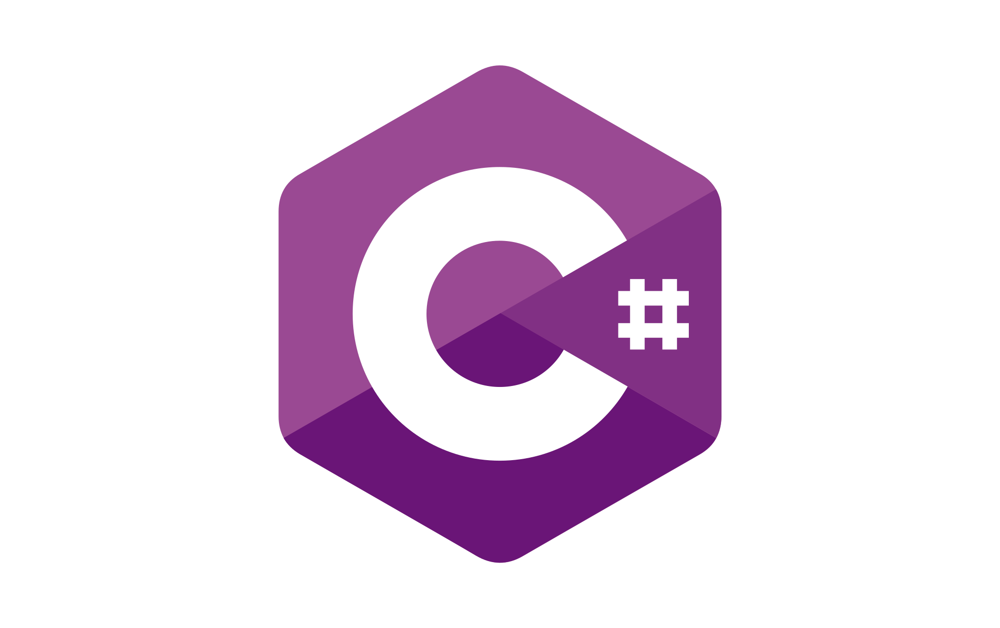](https://substackcdn.com/image/fetch/$s_!o5w0!,f_auto,q_auto:good,fl_progressive:steep/https%3A%2F%2Fsubstack-post-media.s3.amazonaws.com%2Fpublic%2Fimages%2Ff7a78b20-7f53-45bc-b292-eebf154772ef_3938x2475.svg)

When C# was first released, a simple "Hello World" program required several lines of code with namespaces, classes, and method declarations. But as the language evolved, it became simpler. With C# 9's top-level statements, the simplest C# program can now be written as:

[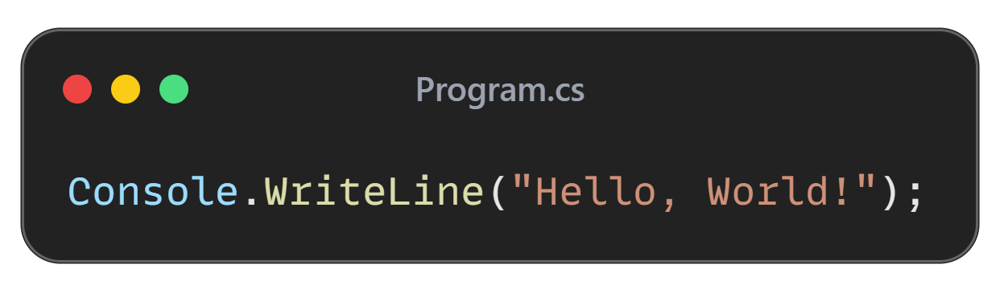](https://substackcdn.com/image/fetch/$s_!smr0!,f_auto,q_auto:good,fl_progressive:steep/https%3A%2F%2Fsubstack-post-media.s3.amazonaws.com%2Fpublic%2Fimages%2F0452c6a4-99a2-4b6c-a41f-e9b6f339fb64_1242x360.png)

Isn’t this great? A cross-platform super-rich language can have a one-liner program.

At its core, C# is:

- **Modern**: Continuously updated with new features that reflect the evolving programming landscape
- **Mature**: It is 25 years old and has undergone significant evolution, yet it remains actively in development.
- **Type-safe**: Prevents type errors through its strong type system.
- **Multi-paradigm**: It is a strongly object-oriented language that incorporates imperative, declarative, and functional programming styles.
- **Component-oriented**: Supports the development of self-contained, reusable components.
- **Cross-platform**: Although initially reserved for Windows, it can now run on Linux, Mac, and other platforms.
- **Versatile**: Suitable for developing a wide range of applications from web to mobile to desktop
- **Open-source:**Since version 7, C # has been fully developed openly on GitHub, and Microsoft accepts feedback and proposals from the community on the **[official C# GitHub page](https://github.com/dotnet/csharplang)**.
- **Readable:** C# recognizes that developers spend more time reading code than writing it. The language was designed from the ground up with readability in mind, making it easier for teams to collaborate and maintain codebases over time.

The C# compiler generates **Intermediate Language (IL)** code that runs on the **Common Language Runtime (CLR)**, which is part of the **.NET runtime** (also shared with other languages such as F# and Visual Basic).

This approach offers benefits such as automatic memory management, type safety, and access to a comprehensive standard library.

[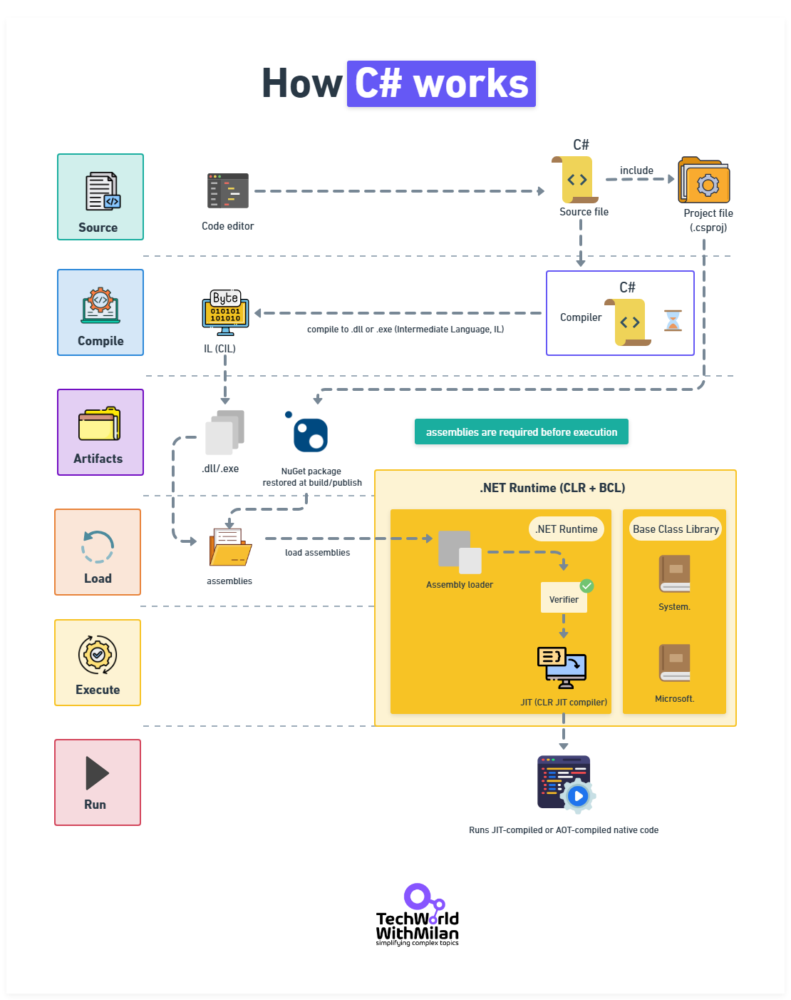](https://substackcdn.com/image/fetch/$s_!eab5!,f_auto,q_auto:good,fl_progressive:steep/https%3A%2F%2Fsubstack-post-media.s3.amazonaws.com%2Fpublic%2Fimages%2F6824f0eb-6972-43a8-927b-568c47b4ade8_1110x1402.png)How C# works

## 2. The Language

What first drew me to C# wasn't its syntax (which was familiar to Java and C++ developers) but its good design choices. Over the years, C# has transformed from a simple object-oriented language into a much richer one.

This language uses multiple programming paradigms with the same core as in the first version.

Let’s look at the basics:

[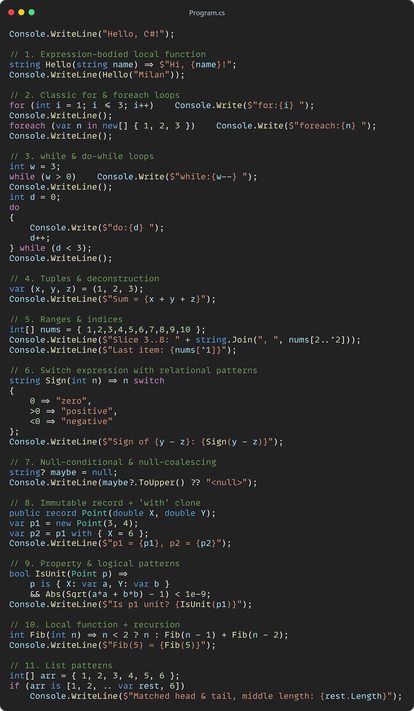](https://substackcdn.com/image/fetch/$s_!_IiY!,f_auto,q_auto:good,fl_progressive:steep/https%3A%2F%2Fsubstack-post-media.s3.amazonaws.com%2Fpublic%2Fimages%2F3bdffc44-1f17-4c10-99c2-6f660ea76701_2442x4185.png)

Easy to understand, even including some modern language features.

But let’s take a look at something more interesting:

[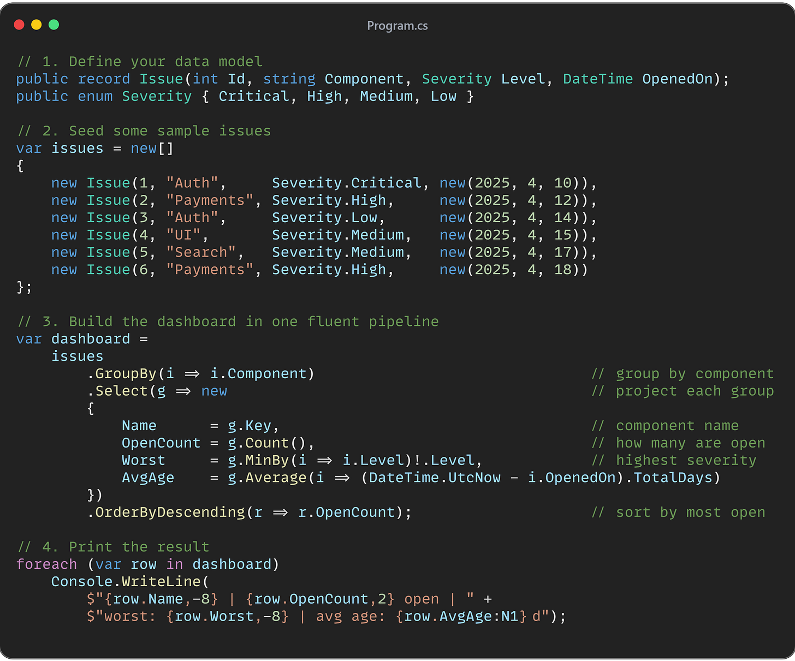](https://substackcdn.com/image/fetch/$s_!64zD!,f_auto,q_auto:good,fl_progressive:steep/https%3A%2F%2Fsubstack-post-media.s3.amazonaws.com%2Fpublic%2Fimages%2Fa42147fd-d123-465d-8b05-4b8736f7bb7a_2751x2288.png)

This single file shows how modern C# balances brevity with clarity (using LINQ, which we will describe shortly). Phenomenal!

A remarkable aspect of C# is its ability to **encapsulate complexity effectively**. You can successfully utilize advanced features like iterators, async/await, or LINQ without needing to understand their internal implementation details fully.

This applies the **object-oriented principle of encapsulation to the language**, allowing developers to use modern features productively without needing to know every implementation detail.

> 👉 *Check out my full **[C# cheat sheet](https://github.com/milanm/csharp-cheatsheet)** if you’d like to see a quick syntax reference. I built it as a companion to this newsletter issue.*
> 
> [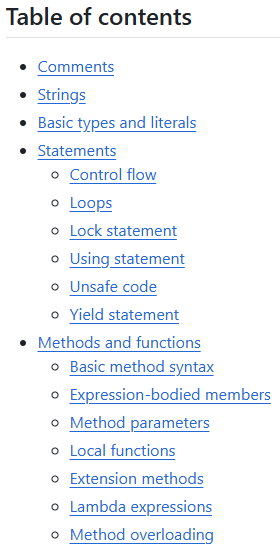](https://github.com/milanm/csharp-cheatsheet)

So, let’s look at the most important C# characteristics:

### Object-oriented foundations

At its core, **C# is an Object-oriented programming language** built around the principles of **encapsulation, inheritance, and polymorphism** from day one.

You define **[classes](https://learn.microsoft.com/en-us/dotnet/csharp/fundamentals/types/classes)** to model real-world entities or abstract concepts, bundling state (fields/properties) and behavior (methods) together. You create **objects (instances)** of these classes to use at runtime.

C# also supports **[interfaces](https://learn.microsoft.com/en-us/dotnet/csharp/fundamentals/types/interfaces)** (abstract contracts that classes can implement) and **abstract classes** (base classes that provide some implementation but are not instantiable).

For example, consider a simple class hierarchy:

[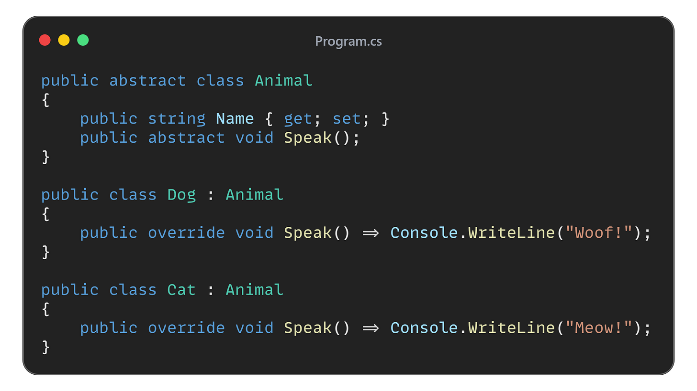](https://substackcdn.com/image/fetch/$s_!a5nw!,f_auto,q_auto:good,fl_progressive:steep/https%3A%2F%2Fsubstack-post-media.s3.amazonaws.com%2Fpublic%2Fimages%2Fe6705a9d-6c67-40d2-9b94-28fa660f444d_2193x1233.png)

Here, `Animal` The abstract base class defines a general concept of an animal with a Name and a Speak behavior, but the actual sound is left abstract. `Dog` and `Cat` inherit from `Animal` and provide concrete implementations of `Speak()`.

This demonstrates:

- **Inheritance** (Dog *is-an* Animal)
- **Polymorphism** (a method behaves differently depending on the actual derived type), and
- **Encapsulation** (each class encapsulates its implementation details – e.g., the specifics of `Speak()`).

In a C# program, one could write:

[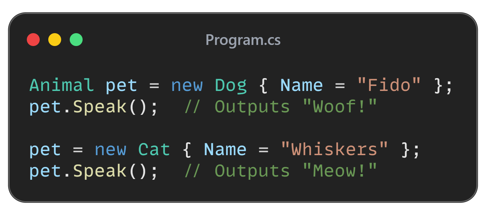](https://substackcdn.com/image/fetch/$s_!eHXB!,f_auto,q_auto:good,fl_progressive:steep/https%3A%2F%2Fsubstack-post-media.s3.amazonaws.com%2Fpublic%2Fimages%2Fcd9ae8b5-c0e1-4e7e-b4d8-540e19a84c5a_1359x600.png)

Because of polymorphism, the call to `pet.Speak()` Invokes the correct override based on the runtime type (Dog or Cat).

C# makes this kind of object-oriented code easy and type-safe.

### Type system

C#'s type system has evolved from a relatively simple static type system into something much more sophisticated, with generics, nullable types, pattern matching, and records.

The introduction of **[nullable reference types](https://learn.microsoft.com/en-us/dotnet/csharp/nullable-references) in C# 8.0** was critical because it helped us to prevent one of the most common runtime errors in object-oriented programming: the famous `NullReferenceException`.

[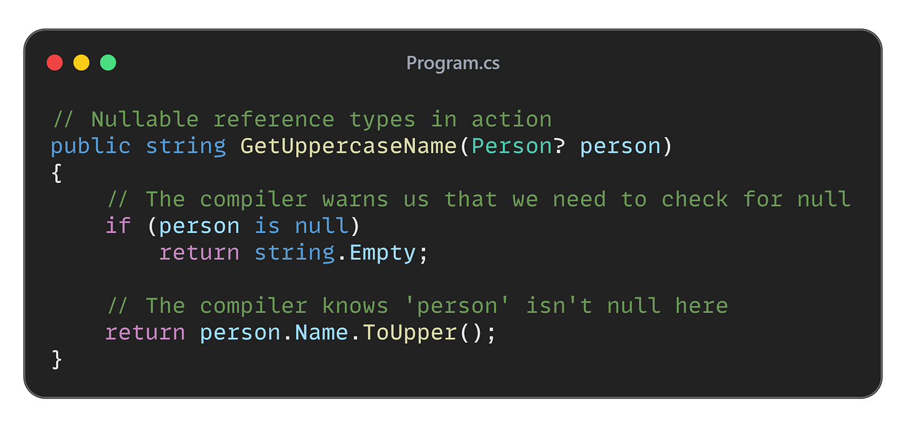](https://substackcdn.com/image/fetch/$s_!W5rr!,f_auto,q_auto:good,fl_progressive:steep/https%3A%2F%2Fsubstack-post-media.s3.amazonaws.com%2Fpublic%2Fimages%2F693d5cad-2c46-4379-84cf-2f60478314a3_2037x960.png)

C#'s [type system](https://learn.microsoft.com/en-us/dotnet/standard/base-types/common-type-system) helps catch errors at compile time while allowing us to write expressive code.

### Generics

One of the earliest significant additions to C# was **[generics](https://learn.microsoft.com/en-us/dotnet/csharp/fundamentals/types/generics)** (added back in C# 2.0). Generics let you define classes and methods with *placeholders for types,* enabling more reusable and type-safe code.

For example, if you want a list of items, you can use the built-in `List<T>` class – where `T` can be any type. This means you don’t need to create separate classes like `IntList`, `StringList`, etc., and you get compile-time type checking on whatever type you use.

Here’s a simple demonstration of a generic class and method:

[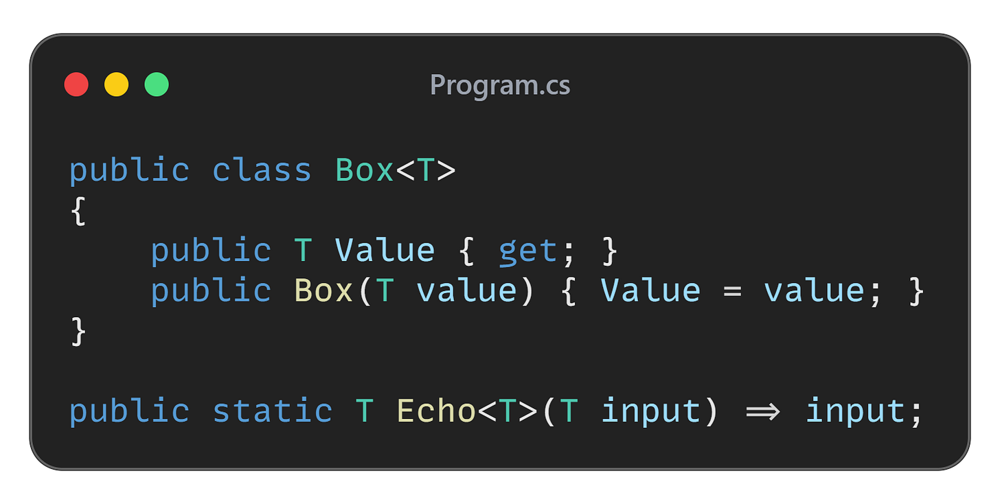](https://substackcdn.com/image/fetch/$s_!Jxh0!,f_auto,q_auto:good,fl_progressive:steep/https%3A%2F%2Fsubstack-post-media.s3.amazonaws.com%2Fpublic%2Fimages%2Fff0548f2-0df6-4de1-93a5-54e4680c44cb_1494x750.png)

We defined a generic class `Box<T>` that can contain a `Value` of any type `T`. We also have a generic method. `Echo<T>` that simply returns the input value (of any type).

We can use these generics like so:

[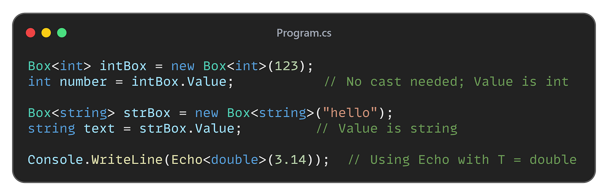](https://substackcdn.com/image/fetch/$s_!edSg!,f_auto,q_auto:good,fl_progressive:steep/https%3A%2F%2Fsubstack-post-media.s3.amazonaws.com%2Fpublic%2Fimages%2F4de37739-37ce-49d2-9f51-546f254a0f58_2331x750.png)

Generics allow **parametric polymorphism** – our code works with any type while remaining **type-safe**. The compiler ensures you only put an `int` in a `Box<int>`, a `string` in `Box<string>`, and so on. There is no runtime cast on retrieving `Value`; it’s already the correct type, preventing class cast exceptions that were common in pre-generic days.

For **value types**, the JIT compiler generates specialized code for each generic type you use. `List<int>` and `List<double>` get their own optimized implementations. This means no boxing overhead and performance comparable to hand-written specialized code, or even C++ templates.

### Lambda expressions

Around 2007, C# started incorporating more functional programming concepts to complement its object-oriented side (influence from [F#](https://fsharp.org/)).

The introduction of **[lambda expressions](https://learn.microsoft.com/en-us/dotnet/csharp/language-reference/operators/lambda-expressions)** in C# 3.0 marked a significant milestone. A lambda expression is an **anonymous function** – a part of code you can treat as data: pass it around, store it in a variable, call it later, etc. Lambdas bring a bit of functional “syntactic sugar” that makes specific tasks much more concise and expressive.

To understand the importance, consider how you’d handle a simple task: *filtering a list of numbers to get only the even ones*.

Before lambdas (and LINQ), you might write:

[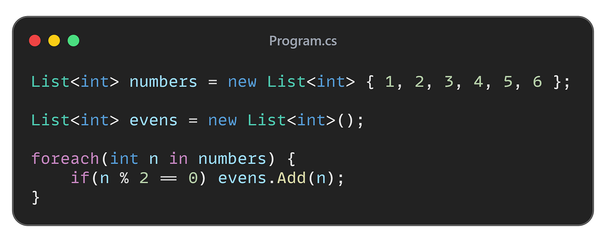](https://substackcdn.com/image/fetch/$s_!Fo3N!,f_auto,q_auto:good,fl_progressive:steep/https%3A%2F%2Fsubstack-post-media.s3.amazonaws.com%2Fpublic%2Fimages%2F166bb022-c4a9-46b6-a313-7d20bf7e581a_1881x750.png)

This works, but it’s a bit complex to write. With lambdas, you can do:

[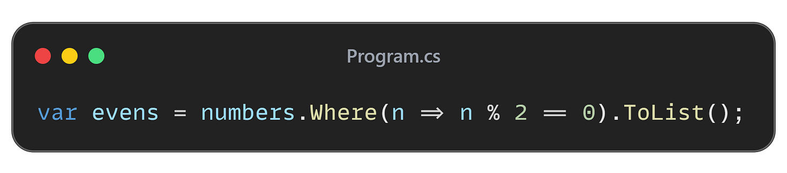](https://substackcdn.com/image/fetch/$s_!X1wJ!,f_auto,q_auto:good,fl_progressive:steep/https%3A%2F%2Fsubstack-post-media.s3.amazonaws.com%2Fpublic%2Fimages%2F16ea803b-4650-4de8-9acc-53e9dbbf7ee2_1764x390.png)

Here `x => x * x` defines an anonymous function that squares its input, and we assign it to the `square` delegate.

So powerful!

### LINQ

Perhaps *the* killer feature that made many developers fall in love with C# is **[LINQ](https://learn.microsoft.com/en-us/dotnet/csharp/linq/)** (Language Integrated Query). Introduced in C# 3.0, LINQ is a language and framework feature set that allows you to **query and manipulate data declaratively**.

If you’ve ever written SQL queries, LINQ will look familiar – except you can use it on all sorts of data (collections in memory, database tables, XML documents, etc.) right from C# code, with compile-time checking and IDE intellisense.

**For example**,*you have a list of*`Book`*objects and want to find all books written by a particular author, order them by title, and select just the titles*. Without LINQ, you’d write nested loops or use library methods manually.

With LINQ, it’s simple:

[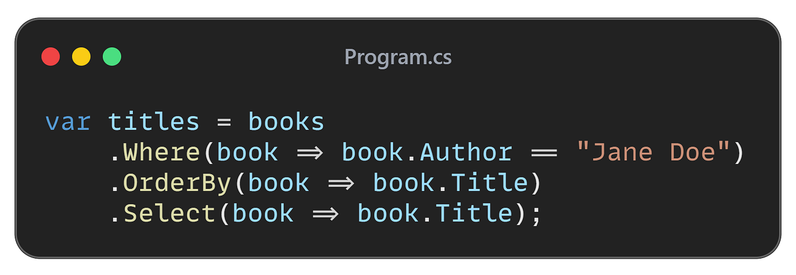](https://substackcdn.com/image/fetch/$s_!FKWu!,f_auto,q_auto:good,fl_progressive:steep/https%3A%2F%2Fsubstack-post-media.s3.amazonaws.com%2Fpublic%2Fimages%2Fd716ad47-51ce-41e7-9f93-2cb3ed00e4db_1557x540.png)

In one fluent statement, we filtered (`Where`), sorted (`OrderBy`), and projected (`Select`) the data. This *reads* almost like the problem statement itself.

There’s also a **query comprehension syntax** that looks even closer to SQL:

[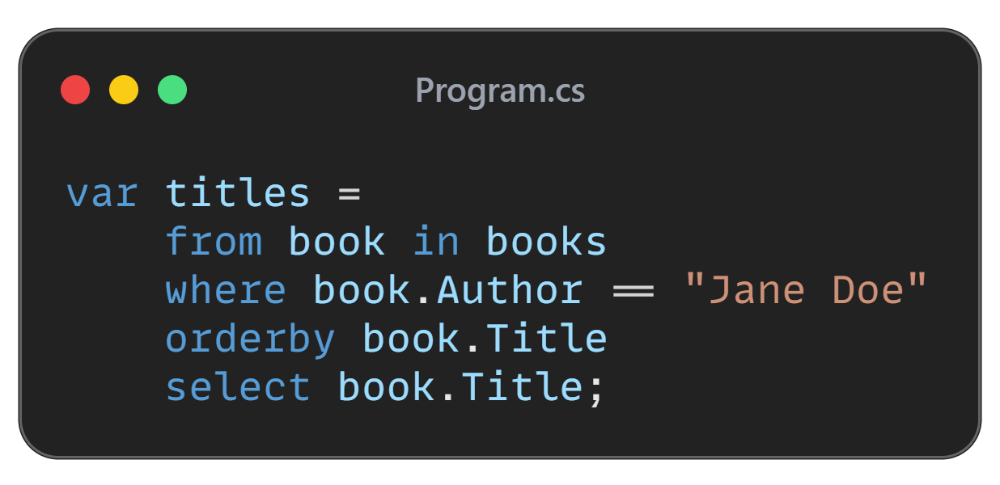](https://substackcdn.com/image/fetch/$s_!HtM4!,f_auto,q_auto:good,fl_progressive:steep/https%3A%2F%2Fsubstack-post-media.s3.amazonaws.com%2Fpublic%2Fimages%2Fb0d9d6f1-57dd-464e-8952-1233c5ee4819_1236x600.png)

Under the hood, both forms are equivalent. LINQ works by using extension methods and lambdas (the `Where`, `OrderBy`, `Select` shown are extension methods on `IEnumerable<T>` that accept lambda expressions).

The C# compiler can even translate the *expression tree* of a LINQ query into other forms – for example, when querying a database via LINQ to SQL or Entity Framework, the lambda expressions get converted to an SQL query sent to the database.

This is powerful: **you can use one unified querying syntax for in-memory collections, relational databases, XML (with LINQ to XML), and more**.

For example, `employees.Where(e => e.Salary > 100000)` might be filtering an in-memory list, or it might be translated to a SQL `WHERE` clause to execute on a database – either way, you, as the programmer, express the intent.

> **🔍 Under the hood:** *LINQ works via **deferred execution** and **iterators**. Methods like*`Where`*and*`Select`*don’t immediately produce a result; they return an*`IEnumerable<T>`*that, when iterated, will yield the filtered or transformed results on the fly.*
> 
> *This means LINQ queries are memory-efficient (they don’t necessarily create new lists until you force an evaluation, e.g., by calling*`.ToList()`*or iterating in a*`foreach`*). It also means you can compose queries dynamically.*

### Asynchronous programming

Dealing with asynchronous operations (like file I/O, network calls, or any long-running task that shouldn’t block the main thread) was tricky in C#. Earlier, we needed to use threads, callbacks, or events to manage sync work. These complex approaches led to “**callback hell**”.

C# tackled this by introducing the **[async/await](https://learn.microsoft.com/en-us/dotnet/csharp/asynchronous-programming/)** pattern in C# 5.0, which has since become the gold standard for asynchronous programming in many languages.

Async/await doesn't just improve performance—**it provides an intuitive way to implement asynchronous programming**, while still maintaining a similar level of productivity as when writing synchronous code. This pattern is built directly into the language, making a traditionally complex programming challenge easy to use.

It works in the following way: you can mark a method with `async` and use the `await` keyword inside it to pause execution until an asynchronous operation completes, without blocking the thread. Here, the compiler transforms your code into a state machine behind the scenes. To you, it appears you’re writing sequential code; under the hood, it’s non-blocking and efficient.

**Example:** Suppose we want to download the contents of a web page and then count the number of characters. Using C#’s `HttpClient` , which have async methods, it would look like:

[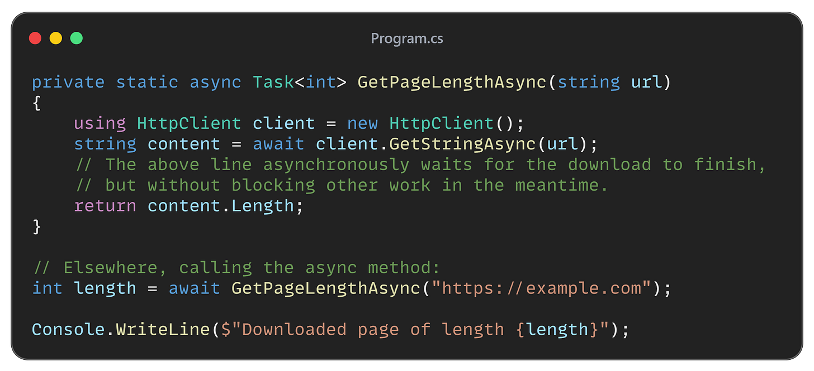](https://substackcdn.com/image/fetch/$s_!SB-k!,f_auto,q_auto:good,fl_progressive:steep/https%3A%2F%2Fsubstack-post-media.s3.amazonaws.com%2Fpublic%2Fimages%2F3e68656b-8296-4bc1-991b-b93b84341e94_2364x1080.png)

When `client.GetStringAsync(url)` is called, it starts an I/O operation. The `await` keyword tells the compiler, “after this operation is kicked off, return control to the caller until it’s done, then resume”. The thread can do other work (or if it’s the UI thread, it can keep the UI responsive). When the download completes, the remainder of the method (computing `content.Length` and returning it) will execute, possibly on the original context.

This linear style is *much simpler* than setting up a callback or manually creating a thread to do the download and somehow synchronizing back.

Before async/await, .NET had the **Asynchronous Programming Model (APM)** `BeginOperation/EndOperation` and the Event-based Asynchronous Pattern (EAP) – both were more cumbersome. Async/await unified everything under a simple model.

> **ℹ️ Other concurrency features:** *C# has a rich async programming model beyond just await. There’s the*`Task`*and*`Task<T>`*types (from the Task Parallel Library) which represent asynchronous operations and can be used with or without the*`async`*keyword.*
> 
> *There are dataflow libraries, async streams (C# 8 added*`await foreach`*to asynchronously iterate results, e.g., reading from an event stream), and more. But for most cases, especially when dealing with non-CPU intensive operations, async/await is the go-to.*

### Memory management

Managing memory efficiently is crucial for ensuring the performance and stability of any application. C# simplifies this critical aspect of software development through its automatic memory management system, which is facilitated by the **Common Language Runtime's (CLR) garbage collector**.

Unlike languages like C and C++, where developers must manually allocate and deallocate memory, C# automates this process. The garbage collector periodically scans the application's memory, identifying and reclaiming space occupied by objects no longer being used or referenced by the program. This automatic process significantly reduces the risk of memory leaks, a common issue in manually managed memory environments.

**The garbage collector** uses a generational system for efficiency. All new objects start in Generation 0. Objects that survive collection move to Generation 1, and persistent objects eventually reach Generation 2. This approach optimizes collection since newer objects tend to have shorter lifespans.

For large objects (over 85,000 bytes), C# uses a separate Large Object Heap (LOH) that's part of Generation 2. Unlike the regular heap, the Large Object Heap (LOH) doesn't compact memory during collection, which can lead to fragmentation.

In C#, memory is primarily managed in two regions: **the stack and the heap**. The stack stores value types (like integers and booleans) and method call information. Memory on the stack is managed in a last-in, first-out (LIFO) manner and is automatically allocated and deallocated when a method is called and returns. The heap, however, stores reference types (like objects and strings).

> **📌 Note:** *While C# offers sophisticated memory management capabilities, it's important to note **that premature optimization is rarely necessary**. For most applications, the readability and maintainability of your code should take precedence over hyper-optimized performance.*
> 
> *The JIT compiler **already generates highly efficient machine code at runtime**, which can sometimes outperform ahead-of-time compiled code in C and C++.*
> 
> *Since .NET 7, **[Native AOT (Ahead-Of-Time) compilation](https://learn.microsoft.com/en-us/dotnet/core/deploying/native-aot/?tabs=windows%2Cnet8)** has provided an additional option for scenarios requiring faster startup times and smaller memory footprints, allowing apps to run without depending on the .NET runtime.*

[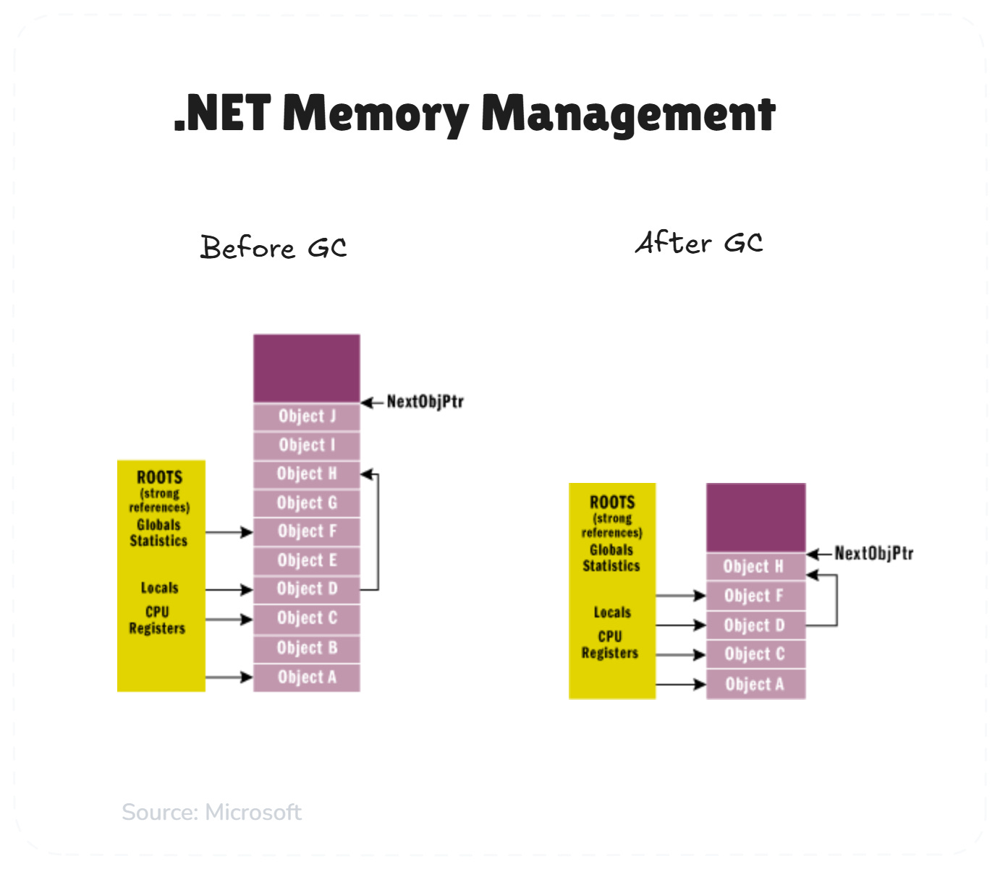](https://substackcdn.com/image/fetch/$s_!y9CE!,f_auto,q_auto:good,fl_progressive:steep/https%3A%2F%2Fsubstack-post-media.s3.amazonaws.com%2Fpublic%2Fimages%2F3ac5fe24-f11c-42ef-b810-2bdcb8959c7e_1382x1202.png).NET Memory Management

> 👉*A full set of features is documented in the **[C# language guide](https://learn.microsoft.com/en-us/dotnet/csharp/)**.*

### Other important C# features

Beyond the features already discussed, C# offers a rich set of other language constructs that contribute to its power and enable developer productivity:

- **[Properties](https://learn.microsoft.com/en-us/dotnet/csharp/programming-guide/classes-and-structs/properties)** provide a clean way to access and modify class data. Instead of direct field access, you write get and set accessors that can include validation logic. This helps maintain proper encapsulation while still providing simple syntax like `object.Property = value`. Properties look like fields to callers but can execute code when read or modified.
- **[Records](https://learn.microsoft.com/en-us/dotnet/csharp/language-reference/builtin-types/record)** simplify creating immutable data objects in C#. Introduced in C# 9, records use a concise syntax like `record Person(string Name, int Age);` to define reference types with value-based equality. This means two records are equal if their properties match, which is not true for classes, where reference equality is the default.
- **[Delegates](https://learn.microsoft.com/en-us/dotnet/csharp/programming-guide/delegates/)** function as type-safe references to methods. They let you store methods in variables, pass them as arguments, and call them later. This powers callbacks and event handlers. Delegates enable us to be flexible in design, allowing us to swap behavior at runtime without changing our class structure.
- **[Tuples](https://learn.microsoft.com/en-us/dotnet/csharp/language-reference/builtin-types/value-tuples)** provide a quick way to return multiple values from methods without creating custom classes. We can write `return (sum, count);` and on the receiving end use `(int total, int n) = ComputeSumAndCount(data);`.
- **[Pattern matching](https://learn.microsoft.com/en-us/dotnet/csharp/fundamentals/functional/pattern-matching)** can improve control flow by testing if values match specific patterns while extracting data. Instead of complex if-else chains or type checks, you write expressions like `if (shape is Circle c)` to both check the type and get the object in one step.
- **[Null-conditional operators](https://learn.microsoft.com/en-us/dotnet/csharp/language-reference/operators/member-access-operators#null-conditional-operators--and-)** solve a common problem - null reference exceptions. The `?.` operator navigates object hierarchies safely by stopping evaluation if it hits a null. Write `customer?.Address?.City` instead of null checks at each step. Paired with the null-coalescing operator `??`, you can provide fallback values easily: `userName = user?.Name ?? "Guest"`.
- **[Collection expressions](https://learn.microsoft.com/en-us/dotnet/csharp/language-reference/operators/collection-expressions)** make creating and initializing arrays and lists more concise. This syntax improvement helps with data structure creation and manipulation. We can define collections with less code, which improves readability in places where we need to work with groups of values.
- **[Expression-bodied members](https://learn.microsoft.com/en-us/dotnet/csharp/programming-guide/statements-expressions-operators/expression-bodied-members)** let us write simple methods and properties in one line. Instead of `{ return x + y; }`, you write `=> x + y`. This cuts boilerplate for cleaner implementations.

[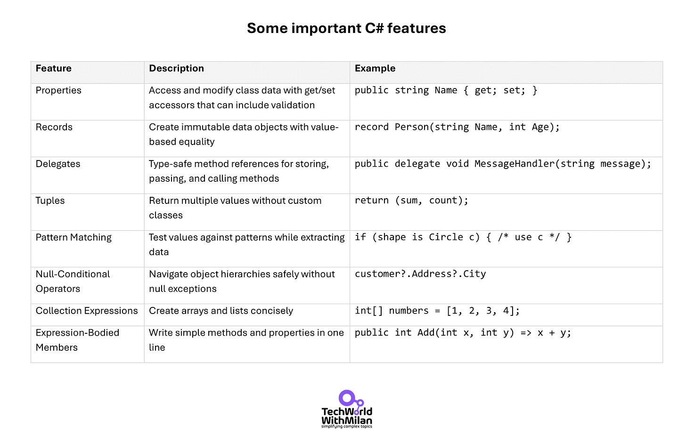](https://substackcdn.com/image/fetch/$s_!-leb!,f_auto,q_auto:good,fl_progressive:steep/https%3A%2F%2Fsubstack-post-media.s3.amazonaws.com%2Fpublic%2Fimages%2F700d177b-78eb-4e82-85b9-f03e0e935a6f_2200x1422.png)

Many of these features aren't just convenient syntax but built-in implementations of established **design patterns:**

- Combined with [yield](https://learn.microsoft.com/en-us/dotnet/csharp/language-reference/statements/yield), the `IEnumerable`/`IEnumerator `interfaces implement the **Iterator pattern**.
- Events provide an implementation of the **Observer pattern**.
- Delegates offer a functional approach to **Strategy and Factory patterns**.
- Paired with `IDisposable`, the statement creates a clean **resource management pattern**.

By embedding these patterns directly in the language, C# makes it easier to implement robust design practices.

> 👉*Learn more about using Design Patterns with C# in **[my book](https://www.patreon.com/techworld_with_milan/shop/design-patterns-in-use-e-book-312304?utm_medium=clipboard_copy&utm_source=copyLink&utm_campaign=productshare_creator&utm_content=join_link)**.*

## 3. The .NET Ecosystem

A programming language doesn’t exist in isolation—it runs on a platform and comes with tools and libraries. One primary reason **“why C#”** for many of us is not just the language features, but the **.NET ecosystem** that surrounds C#.

C# is the flagship language of .NET, and as such, it enjoys the full benefits of one of the most complete developer ecosystems.

[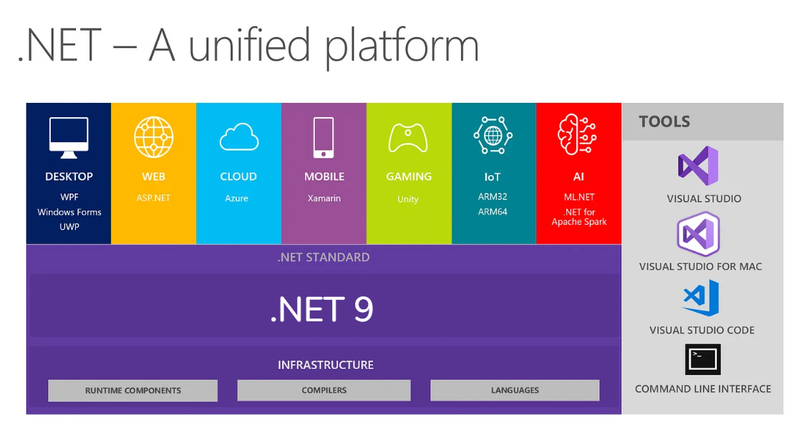](https://substackcdn.com/image/fetch/$s_!Z2ME!,f_auto,q_auto:good,fl_progressive:steep/https%3A%2F%2Fsubstack-post-media.s3.amazonaws.com%2Fpublic%2Fimages%2F2c73830e-c0d1-43ab-93d0-42d54227de22_1130x612.png).NET - A unified platform

C# development is deeply rooted in the .NET ecosystem, a platform Microsoft provides for building and running applications. Historically, the **[.NET Framework](https://dotnet.microsoft.com/en-us/learn/dotnet/what-is-dotnet-framework)** was the original implementation of .NET, targeting the Windows operating system. It offered a rich set of libraries and a runtime environment for building various applications, including Windows desktop apps, web applications using ASP.NET, and web services.

In response to the need for cross-platform development, Microsoft introduced **.NET Core** in 2016—this modern implementation of. NET is [open-source](https://dotnet.microsoft.com/en-us/platform/open-source) and designed to run on Windows, macOS, and Linux.

Microsoft has since unified these platforms by releasing .NET 5 in 2020, followed by subsequent versions.

At a high level, currently the .NET ecosystem provides the following **[runtimes](https://learn.microsoft.com/en-us/dotnet/fundamentals/implementations)**:

- **.[NET 9](https://devblogs.microsoft.com/dotnet/announcing-dotnet-9/)**(ASP.NET Core, WPF, Windows Forms, Blazor). A unifying platform for desktop, Web, cloud, mobile, gaming, IoT, and AI applications.
- **[UWP](https://learn.microsoft.com/en-us/windows/uwp/get-started/universal-application-platform-guide)**[(Universal Windows Platform)](https://learn.microsoft.com/en-us/windows/uwp/get-started/universal-application-platform-guide). Implements .NET to build modern, touch-enabled Windows applications and software for the Internet of Things (IoT).
- **[Mono](https://www.mono-project.com/)** .NET implementation is mainly used when a small runtime is required. Runtime-powered Xamarin applications (now unsupported) are available****on Android, macOS, iOS, tvOS, and watchOS.

All runtimes use tools and infrastructure to compile and run code. This includes languages (such as C# and Visual Basic), compilers (like Roslyn), garbage collection, and build tools like MSBuild or CoreCLR.

On top of the runtime and base libraries, .NET includes **specialized frameworks** for different application models:

- **Web:** [ASP.NET Core](https://dotnet.microsoft.com/en-us/apps/aspnet) for building web applications and APIs. Today, ASP.NET Core is a fast and modular framework for building web APIs, web applications (using MVC or Razor Pages), and even real-time applications (with [SignalR](https://dotnet.microsoft.com/en-us/apps/aspnet/signalr)).
- **[Blazor](https://dotnet.microsoft.com/en-us/apps/aspnet/web-apps/blazor)** deserves special attention as one of the most revolutionary recent additions to the .NET ecosystem. It enables developers to **build client-side web applications using C# instead of JavaScript,** leveraging WebAssembly technology. This enables C# developers to utilize their existing skills for front-end development, allowing us to create full-stack C# applications without context switching between languages.
- **Desktop:** [Windows Presentation Foundation](https://learn.microsoft.com/en-us/dotnet/desktop/wpf/overview/?view=netdesktop-9.0) (WPF) and [Windows Forms](https://learn.microsoft.com/en-us/dotnet/desktop/winforms/overview/?view=netdesktop-9.0) for Windows desktop apps (supported on .NET 6+ for Windows), and .[NET MAUI](https://dotnet.microsoft.com/en-us/apps/maui)(Multi-platform App UI) for cross-platform client apps (the evolution of Xamarin Forms).
- **Mobile:** Xamarin (now integrated as .NET for iOS/Android via **[MAUI](https://dotnet.microsoft.com/en-us/apps/maui)**) for native mobile apps.
- **Cloud and services:** Libraries for building microservices, gRPC services, and cloud integrations (especially with Azure SDKs).
- **Game development:** **[Unity](https://unity.com/)** utilizes a custom version of the .NET Mono runtime for scripting, while Unreal Engine can utilize .NET via third-party plugins. Unity has been used to build a vast percentage of mobile games (some stats say more than 50% of mobile games and a significant fraction of indie PC/console games).
- **Data science and AI:** .NET includes [ML.NET](https://dotnet.microsoft.com/en-us/apps/ai/ml-dotnet) for machine learning, and can interoperate with Python or R for scientific computing. There’s even [.NET for Apache Spark](https://learn.microsoft.com/en-us/azure/synapse-analytics/spark/spark-dotnet), allowing you to write Spark jobs in C#.
- **IoT:** .NET can run on Raspberry Pi and similar devices (with .NET 6+ supporting ARM64/ARM32), and there’s a smaller [.NET NanoFramework](https://nanoframework.net/) for microcontrollers.

The ecosystem supports multiple languages (C#, F#, VB), all of which compile to IL and run on the .NET runtime. This multi-language support enables developers to select different programming paradigms (object-oriented, functional, etc.) while targeting the same platform.

This is something you can rarely see on any other platform.

> **📌 Note: C# language development is following these [key strategy guidelines](https://learn.microsoft.com/en-us/dotnet/csharp/tour-of-csharp/strategy):**
> 
> 1. Innovate broadly in **collaboration** with .NET ecosystem teams, emphasizing productivity, readability, and performance improvements.
> 2. Stay consistent with C#'s original **principles**, prioritizing features intuitive to existing developers.
> 3. Favor **improvements** that benefit the majority of developers across diverse workloads and platforms.
> 4. Maintain strong **backward compatibility**, carefully assessing and limiting disruptive changes.
> 5. Guide language evolution **openly**, considering community proposals and feedback while retaining final design stewardship.

## 4. Tooling

One of the joys of working with C# for me is the **excellent tooling support**.

### Microsoft Visual Studio

**[Microsoft Visual Studio](https://visualstudio.microsoft.com/)** has long been considered a top-tier IDE (some people call it Mercedes in the world of IDEs). It has features like IntelliSense (code auto-completion and documentation), an excellent debugger, UI designers, integrated testing tools, performance profilers, and more. For many, Visual Studio’s productivity features are a big reason for choosing C#/.NET over other ecosystems.

[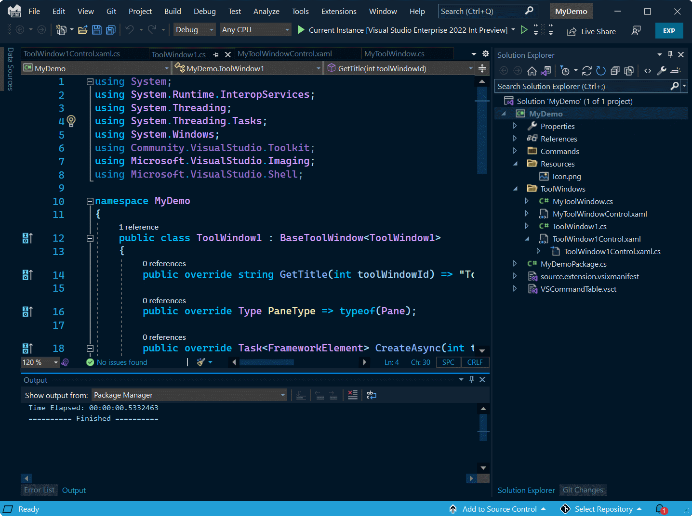](https://substackcdn.com/image/fetch/$s_!UEMk!,f_auto,q_auto:good,fl_progressive:steep/https%3A%2F%2Fsubstack-post-media.s3.amazonaws.com%2Fpublic%2Fimages%2F535b76fb-8f3a-4951-b558-0ffb42f17b85_1436x1072.png)Visual Studio

### Visual Studio Code

There’s also **[Visual Studio Code](https://code.visualstudio.com/)** (a lightweight, cross-platform editor), which, with the C# extension (now enhanced by [Microsoft’s C# Dev Kit](https://learn.microsoft.com/en-us/visualstudio/subscriptions/vs-c-sharp-dev-kit)) and many [extensions](https://code.visualstudio.com/docs/configure/extensions/extension-marketplace), provides a great development experience on Windows, Linux, or Mac. Microsoft also developed it and has made it open-source.

[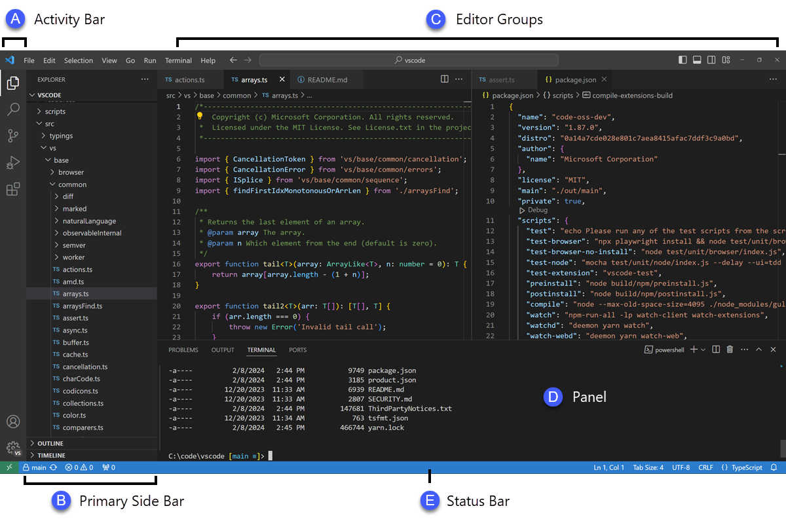](https://substackcdn.com/image/fetch/$s_!3Ywh!,f_auto,q_auto:good,fl_progressive:steep/https%3A%2F%2Fsubstack-post-media.s3.amazonaws.com%2Fpublic%2Fimages%2F1eec024d-fc37-4ca3-a4e9-f95401f2dd24_1200x796.png)Visual Studio Code

### JetBrains Rider

**[JetBrains Rider](https://www.jetbrains.com/rider/)** is an excellent cross-platform IDE for C # developers who prefer third-party tools. It is very performant and works on the largest C# solutions. It is also free for non-commercial usage.

[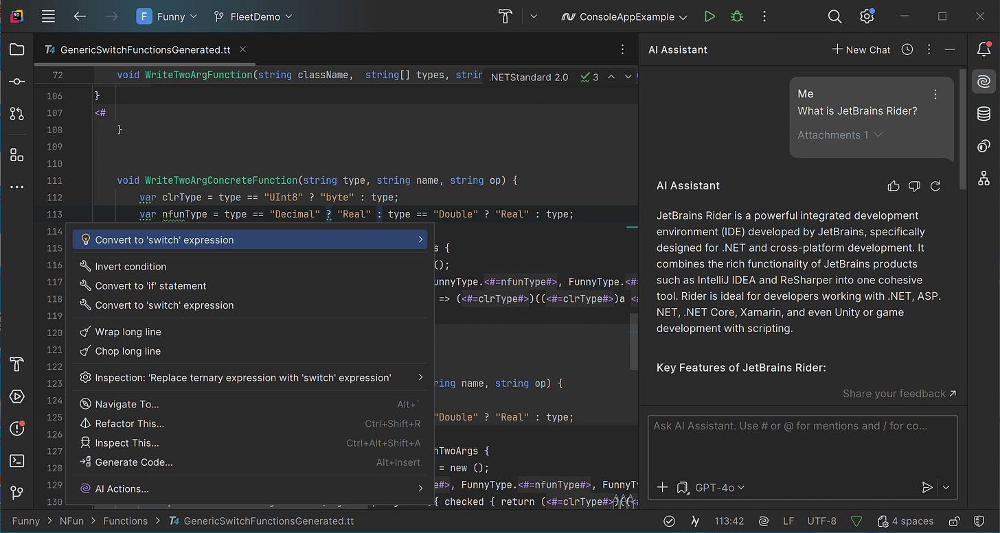](https://substackcdn.com/image/fetch/$s_!hNYQ!,f_auto,q_auto:good,fl_progressive:steep/https%3A%2F%2Fsubstack-post-media.s3.amazonaws.com%2Fpublic%2Fimages%2F18202f38-7d9c-4152-b5db-5033f312f178_2480x1323.png)JetBrains Rider

### Build tools

The **build tools** ([Roslyn compiler](https://github.com/dotnet/roslyn) and [MSBuild](https://github.com/dotnet/msbuild)) work in the background to manage dependencies and compilation. Setting up a new project is often as simple as a few clicks or commands (`dotnet new console -o MyApp` will create a new console app via the .NET CLI).

### .NET CLI

The[https://learn.microsoft.com/en-us/dotnet/core/tools/](https://learn.microsoft.com/en-us/dotnet/core/tools/)**[.NET CLI](https://learn.microsoft.com/en-us/dotnet/core/tools/)** is a powerful command-line interface that enables the building, running, testing, and publishing of .NET applications, facilitating easy automation and CI/CD integration.

[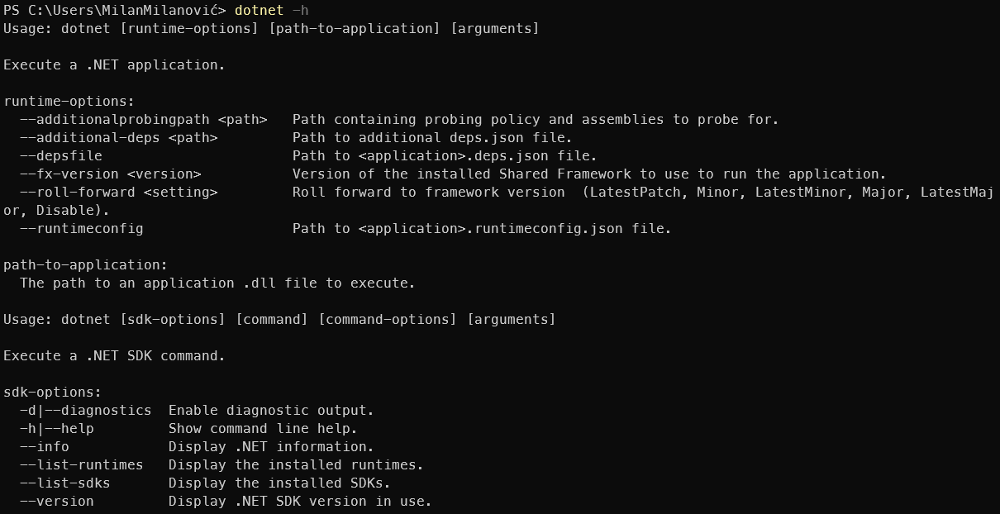](https://substackcdn.com/image/fetch/$s_!xjce!,f_auto,q_auto:good,fl_progressive:steep/https%3A%2F%2Fsubstack-post-media.s3.amazonaws.com%2Fpublic%2Fimages%2Fe4254bc3-db29-4f44-9f52-f2c5d38bc8a5_1210x622.png).NET CLI

### Other tools

C# also benefits from features like **edit-and-continue** during debugging (modify code while paused at a breakpoint), rich **refactoring tools** (renaming symbols, extracting methods, etc.), and **[analyzers](https://learn.microsoft.com/en-us/visualstudio/code-quality/roslyn-analyzers-overview?view=vs-2022)** that catch common issues or style deviations as you type.

Modern editors can even use **[Roslyn analyzers](https://learn.microsoft.com/en-us/visualstudio/code-quality/roslyn-analyzers-overview?view=vs-2022)** to suggest fixes (e.g., “use LINQ instead of this loop” suggestions, or “remove unnecessary cast”). The level of polish in the developer tools is hard to beat, significantly improving developer productivity.

Combining C#'s language design with these powerful tools creates an environment explicitly focused on developer productivity. C #'s strongly typed nature enables these tools to provide rich code analysis, error checking, and refactoring capabilities that would be difficult to implement for more dynamic languages.

## 5. Libraries

The C# language is just one part of the value; the **[.NET class libraries](https://learn.microsoft.com/en-us/dotnet/standard/class-library-overview)** provide a significant amount of functionality.

The standard library encompasses a wide range of functionalities, including collections, file I/O, networking, cryptography, threading, XML/JSON handling, and regular expressions. Microsoft readily makes it available and **[documents](https://learn.microsoft.com/en-us/dotnet/)** it.

This means you can accomplish a lot without needing to search for third-party libraries. When you don’t need third-party help, you can always use the **[NuGet package ecosystem](https://www.nuget.org/)**.

As of 2025, [NuGet.org](https://www.nuget.org/) has experienced explosive growth, with over 600 billion downloads recorded and more than 448,000 packages available. This illustrates how heavily .NET developers rely on shared libraries.

Some popular NuGet libraries are:

- **[MediatR](https://github.com/jbogard/MediatR)** - Mediator pattern implementation in .NET
- **[Polly](https://github.com/App-vNext/Polly)** - A fault-handling library that allows the expression of policies such as Retry and Circuit Breaker.
- **[Fluent Validation](https://github.com/JeremySkinner/FluentValidation)** - .NET validation library for building strongly-typed validation rules.
- **[Benchmark.NET](https://github.com/dotnet/BenchmarkDotNet)** - .NET library for benchmarking.
- **[Refit](https://github.com/reactiveui/refit)** - Turns your REST API into a live interface.
- **[YARP](https://microsoft.github.io/reverse-proxy/)** - Reverse proxy server.

## 6. Documentation

Microsoft’s documentation for C# and .NET (available on **[learn.microsoft.com](https://learn.microsoft.com)**) is generally excellent, with conceptual docs, tutorials, and thorough API references.

The official docs are regularly updated for new features (for instance, when [C# 12](https://learn.microsoft.com/en-us/dotnet/csharp/whats-new/csharp-12) or [13](https://learn.microsoft.com/en-us/dotnet/csharp/whats-new/csharp-13) launched, the docs were ready, explaining new features.

This **comprehensive, up-to-date documentation** for all features is extremely valuable, especially compared to some open ecosystems where you rely more on community wikis or scattered blog posts.

If you're interested in exploring C#, here are some resources to get you started:

- Install .NET from the **[official download page](https://dotnet.microsoft.com/download)**
- Explore **[Microsoft Learn's C# tutorials](https://learn.microsoft.com/en-us/dotnet/csharp/)**
- Try building a simple web API with **[ASP.NET Core](https://learn.microsoft.com/en-us/aspnet/core/)**
- For game development, check out **[Unity Learn](https://learn.unity.com/)**
- Check the **[official C# specification](https://learn.microsoft.com/en-us/dotnet/csharp/specification/)**.
- **[C# identifier naming rules and conventions](https://learn.microsoft.com/en-us/dotnet/csharp/fundamentals/coding-style/identifier-names)**, and the **[C# coding conventions](https://learn.microsoft.com/en-us/dotnet/csharp/fundamentals/coding-style/coding-conventions)**.

Another strength of C# is that it supports **progressive learning**. Developers can start writing applicable code with just a small subset of the language features and expand their knowledge as they become more proficient. This gradual learning curve makes C# accessible to beginners, but it still offers the depth we need as experienced developers.

For those looking to go deeper, I recommend the following books:

- "**[C# in Depth](https://amzn.to/3Ersyji)**" by Jon Skeet for a deep understanding of the language
- "**[ASP.NET Core in Action](https://amzn.to/3Yb4iIW)**" by Andrew Lock for web development
- "**[Concurrency in C# Cookboo](https://amzn.to/42DgLGr)k**" by Stephen Cleary for advanced asynchronous programming

> ➡️ Check here my **recommended learning resources for .NET and C#**:
[
Tech World With Milan NewsletterRecommended learning resources for C# and .NET in 2025.As of 2025, the .NET ecosystem continues to thrive, with .NET 9 bringing powerful updates and C# remaining a top choice for developers. In the recent Stack Overflow Developer Survey 2024, .NET was the library most loved (outside the web…Read morea year ago · 56 likes · Dr Milan Milanović](https://newsletter.techworld-with-milan.com/p/recommended-learning-resources-for?utm_source=substack&utm_campaign=post_embed&utm_medium=web)
Including my complete **[.NET Developer Roadmap](https://github.com/milanm/DotNet-Developer-Roadmap)** in a live GitHub repo:

[.NET Developer Roadmap](https://github.com/milanm/DotNet-Developer-Roadmap)

## 7. Community

C# and .NET enjoy a **vibrant community and strong corporate support**. This is probably one of the main reasons I have chosen to be involved in the world of C# and .NET for all these years.

On the corporate side, Microsoft invests heavily in C#/.NET. The fact that C# is open source means that even outside of Microsoft, many contributors worldwide help improve it.

The language design process is public – you can follow it on the **[dotnet/csharplang GitHub](https://github.com/dotnet/csharplang)**, read proposals, give feedback, or even contribute. This open dialog between the C# design team and the community was highlighted as a strength: *“There is open communication and discussion between the language design team and the community.”*​

This means the language tends to evolve in ways that address real-world needs, often influenced by community proposals.

Here are some of the most notable community initiatives and resources:

- **[.NET Foundation](https://dotnetfoundation.org/)** – An independent, non-profit organization that fosters open development and collaboration around the .NET ecosystem, including C#. The Foundation supports hundreds of open-source projects, helps organize local and online .NET meetups, and provides resources for community leaders and contributors.
- **[.NET Community Toolkit](https://learn.microsoft.com/en-us/dotnet/communitytoolkit/)** – A collection of open-source helpers and APIs for all .NET developers, maintained by Microsoft and the community. It includes tools for MVVM development, high-performance scenarios, diagnostics, and more.
- **[Reddit](https://www.reddit.com/r/dotnet/)**. The r/csharp subreddit is a hub with over 200,000 members. It features daily discussions, Q&A, and a weekly “Ask Anything” thread.
- **[C# Discord group](https://discord.com/servers/c-143867839282020352)** – A Discord server with thousands of members, offering challenges, collaborative projects, learning groups, and a supportive environment for C# learners and developers at all levels.
- **[Local and global meetups](https://dotnetfoundation.org/community/.net-meetups)** -  The .NET Foundation supports hundreds of local .NET user groups and meetups worldwide. These groups regularly organize events, workshops, and networking opportunities.
- **[Microsoft MVP program](https://mvp.microsoft.com/en-us/mvp)** - Microsoft recognizes outstanding community contributors with the Microsoft MVP (Most Valuable Professional) award. This program brings together passionate C# and .NET advocates who share their expertise through talks, blogs, and mentorship. A Microsoft MVP wrote this text 😊.
- **Microsoft conferences ([.NET Conf](https://www.dotnetconf.net/) and [Microsoft Build](https://build.microsoft.com/en-US/home))** are major events announcing the latest .NET and C# advancements. The community gathers to learn, network, and share knowledge. .NET Conf, in particular, is a flagship global event organized by Microsoft and the community. Every November, new editions of C# and .NET are announced.

Despite its size, the C# community is often described as welcoming, passionate, and pragmatic. Developers frequently express genuine enthusiasm for the language and its ecosystem, citing the pleasure of writing “**beautiful code**,” the ongoing innovation, and the sense of productivity it brings.

There is a **strong knowledge-sharing culture**, with many developers contributing to open-source projects, writing tutorials, or helping others on forums and social media.

A pano with all Microsoft MVPs at this year's **MVP Summit 2025**

## 8. The popularity contest

C# consistently ranks among the most widely used programming languages worldwide. In the [Stack Overflow Developer Survey 2024,](https://survey.stackoverflow.co/2024/) it was ranked 8th. In the “[Other frameworks and libraries category](https://survey.stackoverflow.co/2024/technology#most-popular-technologies-misc-tech),” .NET is ranked No. 1.

[I](https://www.tiobe.com/tiobe-index/)t currently (in 2025) ranks 5th on the TIOBE index and [PyPL](https://pypl.github.io/PYPL.html). In 2023, it received the "**[Programming Language of the Year](https://news.ycombinator.com/item?id=38899521)**" award.

TIOBE Index for C#

From a **job market perspective**, C# skills are in high demand, particularly in enterprise environments, game development with Unity, and web development. Job boards indicate that C# developers command competitive salaries, with median wages often exceeding those for many other programming languages. C# was ranked No. 4 on the DevJobsScanner's “**[Top 8 Most Demanded Programming Languages in 2024](https://www.devjobsscanner.com/blog/top-8-most-demanded-programming-languages/)**,” which analyzed the last 21 months and 12 million developer jobs.

[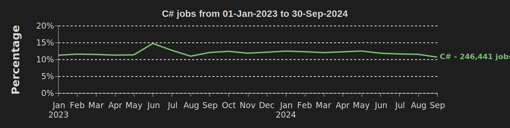](https://substackcdn.com/image/fetch/$s_!y26I!,f_auto,q_auto:good,fl_progressive:steep/https%3A%2F%2Fsubstack-post-media.s3.amazonaws.com%2Fpublic%2Fimages%2F019a9e2d-ff90-4fb7-9291-3111a5ff2ae5_1510x380.svg)C# jobs from 1. January 2023 to 30 September 2024 (Source: [DevJobsScanner](https://www.devjobsscanner.com/blog/top-8-most-demanded-programming-languages/))

Of course, we also need to discuss salaries. Top C# engineers earn over **$120K** in the US ([DevItJobs](https://devitjobs.com/salaries/dotNET/all/all/all)) and **$110K**+ in Europe ([Dreamix](https://dreamix.eu/insights/c-sharp-dot-net-developer-salary-by-country/)). Some [sources](https://rubyonremote.com/c-sharp-developer-salaries/), especially those focused on remote or high-demand roles, report average C# developer salaries as high as **$156,430**, with top salaries reaching **up to $301,100 per year**.

At [leading companies](https://beincrypto.com/jobs/salary/c-sharp/), C# developer salaries can go even higher. For example, OKX offers up to **$213,000 annually,** and Limit Break up to **$205,000** annually for top C# developers. With C# used across web, cloud, enterprise, and even gaming, it's worth getting good at it and aiming for the top 10%.

However, popularity isn't everything. What matters more is whether a language is appropriate for your specific needs, whether you enjoy working with it, and whether it has a sustainable future. On all these fronts, C# looks strong.

> **Note**: *Take into account that there are [critiques of the TIOBE index](https://nindalf.com/posts/stop-citing-tiobe/).*

## 9. C# vs other languages

The image of C# wouldn’t be complete without comparing it to the leading competitors on the market. So, let’s see how it stands.

### C# vs Java

Historically seen as rivals, C # and Java are today mature, performant, object-oriented languages widely used in enterprise backends. While both share a C-style syntax and are used for building a wide range of applications, they have different characteristics today.

C# features modern language constructs, including properties, operator overloading, Language Integrated Query (LINQ), and asynchronous programming with async/await. These can lead to **more concise and expressive code** than Java's more verbose syntax and different approaches to similar functionalities.

Both have garbage collection and JIT compilation, having similar performance characteristics. One significant difference is the ecosystem: **Java has a large, open ecosystem with multiple competing implementations** (OpenJDK, Oracle JDK), **whereas C# has a more unified ecosystem under .NET** (although Mono/Xamarin existed, they are now unified with the core).

Tooling for C# (Visual Studio/Rider) vs Java (IntelliJ/Eclipse) – both good, though many find Visual Studio + ReSharper or Rider extremely productive. Java enjoys “write once, run anywhere” and dominates some areas (like Android, which uses Java/Kotlin, though now .NET MAUI can target Android too).

C# is often seen as more *elegant* and modern in design, as it has learned from Java’s missteps and has been more willing to evolve rapidly. There’s a friendly joke that **C# is what Java would be if it had a soul** – subjective, but it shows that many who use both tend to prefer C#’s feel and conveniences. On the other hand, Java’s simplicity (in not having too many language features) can benefit some teams by reducing complexity.

[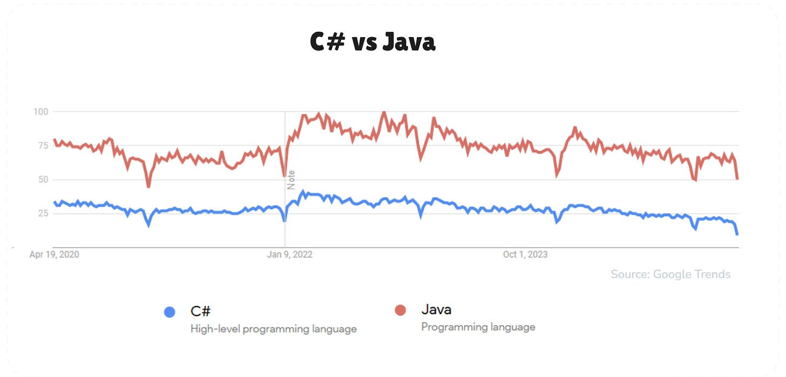](https://substackcdn.com/image/fetch/$s_!56wf!,f_auto,q_auto:good,fl_progressive:steep/https%3A%2F%2Fsubstack-post-media.s3.amazonaws.com%2Fpublic%2Fimages%2F2a207f4a-93f1-47f2-b58b-1a51b08d0326_2132x1025.png)C# vs Java on Google Trends (last 5 years)

> ➡️ [Learn C# for Java developers](https://learn.microsoft.com/en-us/dotnet/csharp/tour-of-csharp/tips-for-java-developers).

### C# vs Python

These two are pretty different – one is statically typed and compiled (to IL), the other is dynamically typed and interpreted (with a few exceptions). **Python** excels in quick scripting, simple syntax, and the data science ecosystem; therefore, many consider it the king of programming languages today. Although C# also now offers scripting support through *[file-based apps](https://devblogs.microsoft.com/dotnet/announcing-dotnet-run-app/?)*, it is not as *widely used as Python*.

**C#** excels in extensive application engineering, performance, and robust tooling. In terms of performance, **[C# will usually outperform Python](https://www.codeporting.com/blog/csharp_vs_python_a_look_at_performance_syntax_and_key_differences#:~:text=C,and%20its%20mature%20JIT) for CPU-intensive tasks** (due to JIT optimization and static typing allowing for better optimizations).

C# also allows low-level control (unsafe code, Span<T>, etc.) to optimize critical paths, whereas Python often relies on C extensions for speed. Where Python has a strong REPL and interactive capabilities, C# historically lacked a mainstream REPL (although one exists in C# Interactive, and notebooks via .NET Interactive now enable similar interactivity).

With top-level statements and scripting support, C# has become easier, but **Python still wins for quick one-off scripts** or when you need that vast array of scientific libraries. That said, the gap is closing – e.g., you can use Jupyter notebooks with C# (via .NET Interactive) for data exploration, and libraries like SciSharp stack try to port some of NumPy, etc., to .NET.

**Python is often recommended for beginners** due to its****simple syntax, while C# might require more learning due to its type system and features. However, modern C# with tools like Visual Studio can also be very beginner-friendly (Intellisense and compile-time checks guide you).

> 💡 **Note**: *You can also use Python with C# by using **[IronPython](https://ironpython.net/)**.*

[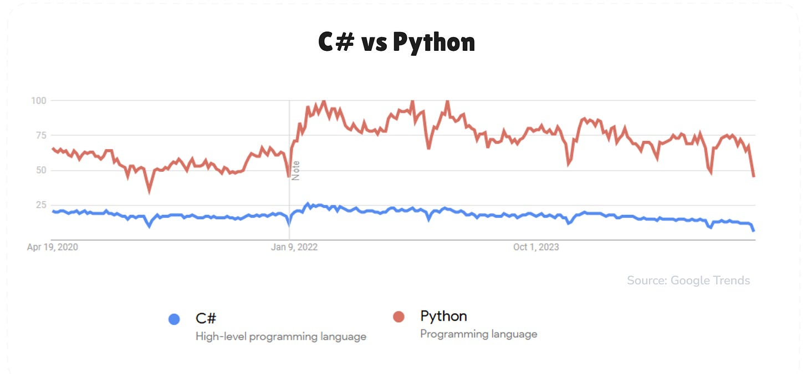](https://substackcdn.com/image/fetch/$s_!G4RX!,f_auto,q_auto:good,fl_progressive:steep/https%3A%2F%2Fsubstack-post-media.s3.amazonaws.com%2Fpublic%2Fimages%2Fe38c0112-0727-43d6-97fc-8c6d9d04d3ab_2132x992.png)C# vs Python on Google Trends (last 5 years)

> ➡️ [Learn C# for Python developers](https://learn.microsoft.com/en-us/dotnet/csharp/tour-of-csharp/tips-for-python-developers).

### C# vs F#

One thing is the same for both, and that is that they run on .NET. **F#** is a functional-first language (also multi-paradigm, but optimized for FP) with type inference, immutability by default, and simple syntax. F# can often express specific algorithms or domain models more clearly than C# (e.g., discriminated unions and pattern matching in F# inspired C#’s additions).

However, **C# is far more popular and has more**explicitly written libraries. Many .NET shops use C# for general purposes and F# for specific tasks where it excels (such as complex calculation engines, certain domain-specific logic, or simply by preference in smaller services).

The choice between C# and F# can be one of **paradigm preference:** if you love functional programming, F# gives you that with full .NET interoperability. If you prefer or need a **mix of paradigms and widespread community suppor**t, C# is a better choice.

Interestingly, **features from F# have been incorporated into C#** (e.g., records, pattern matching), narrowing the gap somewhat. But F# still has advantages like succinct lambda syntax, type inference everywhere (C#’s `var` is limited type inference), and complex type capabilities (computation expressions, etc.).

Some developers recommend using F# for core domain logic (for correctness and terseness) and C# for interfacing with frameworks (such as UI or where Object-Oriented Programming (OOP) makes more sense). There is no one winner; they complement each other. The good news is you can combine them in one project if needed.

[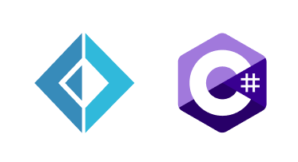](https://substackcdn.com/image/fetch/$s_!vcLR!,f_auto,q_auto:good,fl_progressive:steep/https%3A%2F%2Fsubstack-post-media.s3.amazonaws.com%2Fpublic%2Fimages%2Faa7c857e-1805-41c5-9ba1-783c6a938c1f_373x203.png)F# vs C#

### C# vs JavaScript/TypeScript

JavaScript is the web front-end king, but Node.js (JS) competes with ASP.NET Core (C#) on the back end (and [ASP.NET Core wins on independent benchmarks](https://www.techempower.com/benchmarks/#section=data-r23)). The advantage of Node is its unified language (JavaScript) for both the front and back end, as well as its vast npm ecosystem.

However, many find **C# with ASP.NET more robust for large APIs**, and TypeScript (which adds static types to JS) essentially tries to bring some of the benefits that C# has to the JS world.

Interestingly, with **[Blazor](https://dotnet.microsoft.com/en-us/apps/aspnet/web-apps/blazor)**, you can even use C# to write a web front-end (WebAssembly-based) instead of JavaScript, which is a promising route for those who want to go full-stack C#. It’s not as widely adopted as the JS frameworks, but it’s an example of .NET’s forward-looking approach (embracing WebAssembly).

Regarding performance, **[C# on the server tends to outperform Node.js for CPU-bound tasks](https://www.sitepoint.com/node-js-vs-net-core-what-to-choose/)** due to Node's single-threaded nature. However, Node can handle I/O concurrency very well. C# can also handle I/O concurrency excellently with async/await (and using multiple threads or I/O threads), so it’s more a matter of preference and the existing ecosystem.

For developer experience, debugging C# in Visual Studio is generally easier than debugging Node.js due to the availability of better tools and static typing. TypeScript has leveled the field by catching errors for JS developers during compile time (and it is being built by the same author as C#).

However, if someone is already a .NET/C# developer, they might prefer to use C# for the back end and possibly the front end (via Blazor) to avoid switching context to JavaScript.

[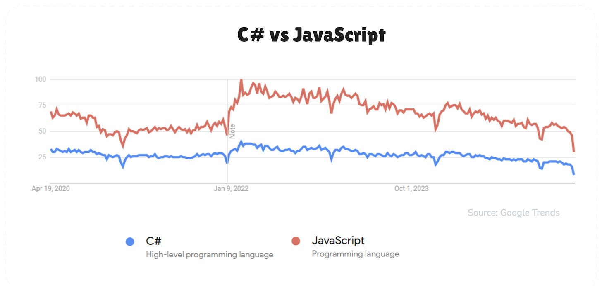](https://substackcdn.com/image/fetch/$s_!M83Y!,f_auto,q_auto:good,fl_progressive:steep/https%3A%2F%2Fsubstack-post-media.s3.amazonaws.com%2Fpublic%2Fimages%2F7ef9da46-9bab-4f73-9907-b8433bc338c6_2132x1016.png)C# vs JavaScript on Google Trends (last 5 years)

> 👉 [Learn C# for JavaScript developers](https://learn.microsoft.com/en-us/dotnet/csharp/tour-of-csharp/tips-for-javascript-developers).

Here is the complete comparison between these four languages:

[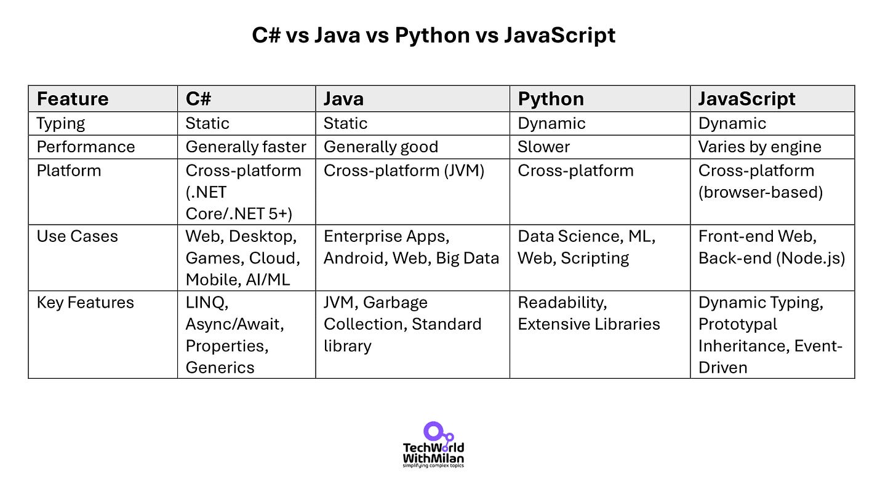](https://substackcdn.com/image/fetch/$s_!aQ8p!,f_auto,q_auto:good,fl_progressive:steep/https%3A%2F%2Fsubstack-post-media.s3.amazonaws.com%2Fpublic%2Fimages%2Fd82b85d2-5672-45b5-b8b9-b3df1533569c_1674x938.png)

So, we can say that C# holds its own or excels in many areas relative to other languages. It may not be as minimal or dynamic as Python, but it offers performance and structure for large-scale applications. It might not be as purely functional as F#, but it balances paradigms and uses far more, so it's the best of both worlds.

> **📈 How does .NET compare in performance to other languages and runtimes?**
> 
> *[TechEmpower publishes](https://www.techempower.com/) an open-source benchmark suite that measures raw HTTP routing, JSON serialization, database reads/writes, and HTML templating under uniform hardware and tooling. [Round 23](https://www.techempower.com/benchmarks/#section=data-r23) (March 2025) is the latest complete run and introduces faster 40-GbE hardware, so scores aren’t directly comparable to older rounds.*
> 
> *If we examine the results and exclude some experimental and rarely used runtimes, we see that Go’s lightweight goroutine model leads the mainstream field, closely followed **by the optimised .NET 8 pipeline**. The Node/TypeScript, Kotlin, and Java clusters are in the middle, and ecosystems (Elixir, Python, Ruby, PHP, Swift) trade outright speed for developer ergonomics and rich libraries.*
> 
> *We can see here that **ASP.NET Core Minimal APIs on .NET 8/9**—scores **87** on that scale:*
> 
> - *only ~10 % behind Go/Fiber (score 100),*
> - ***≈3 × faster** than Node 20 + Fastify and the JVM pair (Spring and Ktor),*
> - ***≈4 × faster** than Elixir/Phoenix,*
> - ***≈7 × faster** than Python/FastAPI,*
> - ***>20 × faster** than Rails or Laravel, and*
> - ***>40 × faster** than Swift/Vapor.*
> 
> *So, it’s clear that .NET is almost on the top of the performance game because the **Adaptive Server GC** (DATAS) grows or shrinks the heap on the fly to cut pause time during bursts; a tiered, PGO-driven **JIT compiler** shortens warm-up then re-optimises the hottest paths in production; **vector-intrinsic APIs** now target AVX-10 and Arm SVE, letting tight loops chew eight-wide data in a single tick; **Native AOT** trims unused IL, **System.Text.Json** avoids reflection and copies fewer bytes, so every REST call allocates less; and the lean **Minimal API** router introduced in .NET 9 adds roughly a 15 % throughput boost over MVC on the same hardware.*
> 
> *Together, those tweaks let the CLR spend less time parking threads, copying buffers, or compiling code, and more time serving your users.*
> 
> [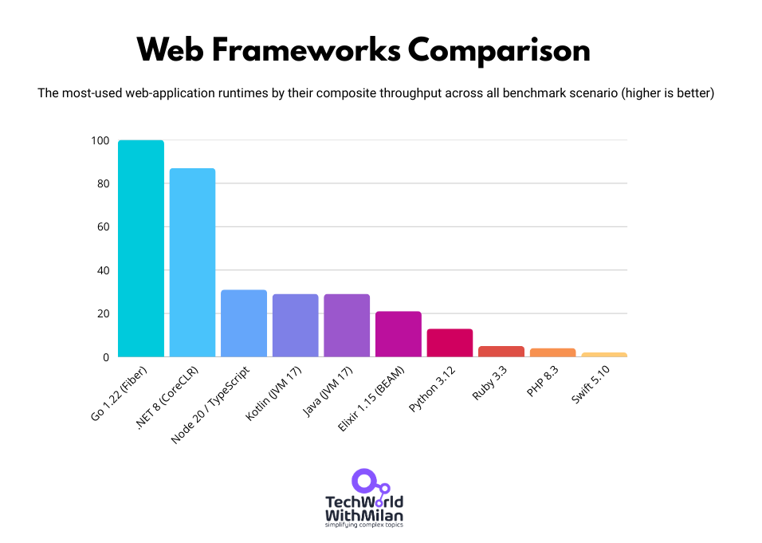](https://substackcdn.com/image/fetch/$s_!qQAj!,f_auto,q_auto:good,fl_progressive:steep/https%3A%2F%2Fsubstack-post-media.s3.amazonaws.com%2Fpublic%2Fimages%2Fdbd8c2c5-5381-456f-899b-0b90bd72dee6_956x681.png)Web Frameworks Comparison (source: [TechEmpower Round-23](https://www.techempower.com/benchmarks/#section=data-r23))

## 10. The future of C#

C# is a language that continues to evolve fast (there is already a [C# 14 preview version](https://learn.microsoft.com/en-us/dotnet/csharp/whats-new/csharp-14)). Microsoft releases new versions every year and introduces new, powerful features for developers.

Recent versions introduced innovations such as **[records](https://learn.microsoft.com/en-us/dotnet/csharp/whats-new/csharp-13)**, **[top-level statements](https://learn.microsoft.com/en-us/dotnet/csharp/tutorials/top-level-statements)**, **[improved string handling](https://learn.microsoft.com/en-us/dotnet/csharp/language-reference/proposals/csharp-10.0/improved-interpolated-strings)**, and **[concise collection expressions](https://learn.microsoft.com/en-us/dotnet/csharp/language-reference/operators/collection-expressions)**. Each release further streamlines everyday tasks and reduces boilerplate code, making development faster and easier.

Microsoft has a clear and **proactive strategy for evolving the C# programming language.** The C# team actively collaborates with the teams responsible for .NET libraries, developer tools, and workload support to introduce new features and enhancements.

A key principle guiding this evolution is prioritizing language and performance improvements that will benefit the majority of C# developers, considering a **wide range of domains in which the language is used**.

There is also a **strong commitment to maintaining backwards compatibility**, considering the large amount of C# code currently in use.

Today, we can also see [startups using C#](https://tracebit.com/blog/why-tracebit-is-written-in-c-sharp) and games switching from [Rust to C#](https://deadmoney.gg/news/articles/migrating-away-from-rust).

Given Microsoft's proactive strategy and continuous community involvement, **the future of C# looks very promising**.

## 11. Conclusion

So, **why C#**?

C #'s performance, readability, versatility, and robust ecosystem make it a good choice for many development scenarios today. From its concise and expressive syntax to powerful features like LINQ and async/await, **C# enables developers to solve complex problems elegantly and efficiently.**

The language **doesn't restrict you to one paradigm**. Depending on your project's needs, you can easily mix object-oriented, functional programming, or low-level optimizations.

C# hits the right balance between power and approachability. It allows you to **write simple, readable code for everyday tasks while providing advanced capabilities when needed**.

As your skills progress, **C# grows with you**, offering features that help you implement established patterns correctly and idiomatically. The language **promotes good practices without introducing unnecessary complexity**, making it suitable for both newcomers and experienced developers.

With the unified .NET ecosystem, **you can confidently build cross-platform apps**—from web and mobile to desktop and cloud services. Rich tooling, extensive libraries, and a big community (supported by Microsoft) further enable learning and development.

Of course, C# isn't perfect—no language is. It can feel verbose compared to simpler scripting languages and isn’t ideal for extremely low-level tasks. However, it's **one of the most productive and balanced languages available for most applications**, particularly in enterprise solutions, web services, and game development.

To anyone on the fence, **give C# a try on your next project**. Explore its features and the ecosystem. You’ll likely find, as I did, that it hits a sweet spot that makes software development an enjoyable craft.

C# continues to amaze me with every new version, so it remains my language of choice for many years.

---

## 12. BONUS: A Brief History of C#

Every language has an origin story. [C#](https://en.wikipedia.org/wiki/C_Sharp_(programming_language))’s story begins around 2000, when Microsoft sought to create a new language for its emerging .NET platform.

**Anders Hejlsberg**, a legendary language architect (known for Turbo Pascal and Delphi, and currently leading TypeScript development), led the design of C#. The goal was to build a **type-safe, object-oriented** language that combined the power and robustness of C++ with the simpler, high-level productivity of languages like Visual Basic.

> 💡*The initial development of C# was called "Cool" or "C-like Object-Oriented Language." However, Microsoft didn't stick with the name due to trademark reasons, but it indeed sounds cool ;).*

In essence, the designers wanted *“all the good stuff in Visual Basic and C++”* without the complexity and pitfalls of those languages. C# was also conceived as an answer to Java—Microsoft’s way of offering a familiar curly-brace language for the new millennium, but with its improvements and without some of Java’s early limitations (such as cumbersome enterprise APIs of that era).

When C# 1.0 was released (alongside .NET 1.0 in 2002), it was **firmly rooted in object-oriented programming (OOP)**. Like Java, it required all code to live inside classes. It featured garbage collection and a robust type system, eliminating pointer arithmetic for safer code (though an “unsafe” mode was available for systems programming when needed).

The *main design goal* of C# was **simplicity over low-level power** – you might give up a bit of C/C++’s manual control. Still, you gained memory safety (garbage collection) and easier development.

Over the next two decades, **C# evolved**and added features with nearly every release to stay modern and relevant.

Here’s a quick timeline of some significant milestones:

- **C# 2.0 (2005)** – Introduced **generics**, **iterators**, and partial classes, vastly improving type safety and eliminating many repetitive coding tasks. (Generics in C# arrived around the same time as Java’s generics, but with a significant difference we’ll discuss later.)
- **C# 3.0 (2007)** – A landmark release that brought **lambda expressions**, **LINQ (Language Integrated Query)**, and anonymous types. This was when C# started embracing functional programming concepts to complement its OO roots. LINQ, in particular, was a game-changer for handling data in code.
- **C# 5.0 (2012)** – Added the `async`/`await` keywords for **asynchronous programming**, dramatically simplifying concurrency and I/O code. (This innovation was so successful that languages like Python and JavaScript adopted similar async/await mechanisms later.)
- **C# 6 and 7 (2015-2017)** – Brought many “syntax sugar” and convenience features: **expression-bodied members**, **string interpolation**, **nameof expressions**, **tuples** and **deconstruction**, **pattern matching**, etc. These features made C# code more concise and expressive, catching up with ideas from functional and dynamic languages while retaining static typing.
- **C# 8 and 9 (2019-2020)** – Introduced **nullable reference types** (helping to mitigate the billion-dollar mistake of null references), **records** (for immutable data classes), **top-level statements** (allowing a quick script-like style without ceremony), **static local functions**, and more pattern matching enhancements. .NET Core had matured by this time into **.NET 5**, unifying the platform across operating systems.
- **C# 10 and 11 (2021-2022)** – Continued incremental improvements (**global**`using`**directives, record structs, improved lambda capabilities**, etc.), keeping C# modern.
- **C# 12 and 13 (2023-2024)** – Came with **primary constructors** for classes, **collection expression** literals, **enhanced C# params**, **new lock object**, and other enhancements to simplify coding. It’s clear that C# is not standing still; it’s continuously refined to be more powerful and developer-friendly.

Throughout this journey, C# has managed to **stay familiar** (old code still runs, the syntax still *feels* like C#) while **evolving** to include new paradigms. It adapts to modern development needs without forcing you to abandon what already works.

Check the **complete C#/.NET development timeline**:

[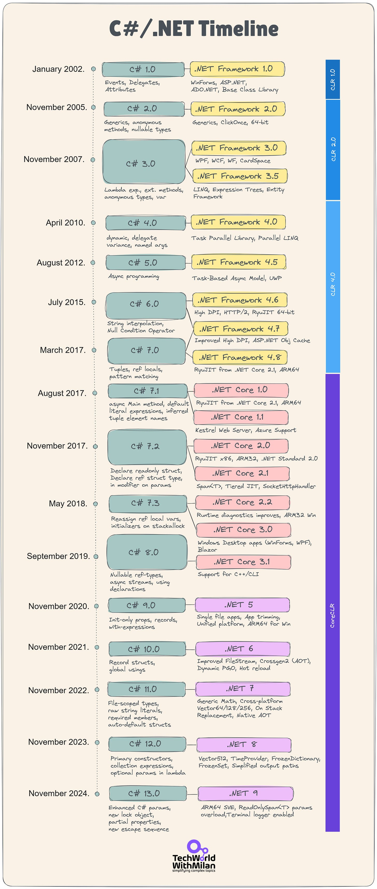](https://substackcdn.com/image/fetch/$s_!OJRA!,f_auto,q_auto:good,fl_progressive:steep/https%3A%2F%2Fsubstack-post-media.s3.amazonaws.com%2Fpublic%2Fimages%2F8635727b-58ed-4577-aef8-941e87fdedb7_2556x6001.png)C#/.NET Timeline

---

## **[Land Senior .NET Roles Faster](https://www.patreon.com/techworld_with_milan/shop/ultimate-net-bundle-for-2025-1519389?utm_medium=clipboard_copy&utm_source=copyLink&utm_campaign=productshare_creator&utm_content=join_link)**

**Grab my** **[The Ultimate .NET Bundle 2025](https://www.patreon.com/techworld_with_milan/shop/ultimate-net-bundle-for-2025-1519389?utm_medium=clipboard_copy&utm_source=copyLink&utm_campaign=productshare_creator&utm_content=join_link)** with over 500 pages of materials + a course packed with modern C#, architecture, and interview prep from 20+ years of real-world experience.

**What’s inside:**

- ✅ **.NET Ecosystem guide** – Understand the entire stack (31 pages)
- ✅ **Why C#** – Deep dive into features, tooling, and market value (60+ pages)
- ✅ **Modern C# v6–13 overview** – 50+ key features explained simply (51 pages)
- ✅ **Design Patterns in C#** – Learn patterns used in production (53 pages)
- ✅ **Clean Code development in C# course** - A practical and visual walkthrough of Clean Code Development in C#.
- ✅ **Grokking .NET Interview** – 200+ interview Q&A from junior to senior roles (122 pages)
- ✅ **2025 .NET Roadmap** – Structured, resource-backed learning (38 pages)
- ✅ **Authentication Masterclass** – Secure apps the right way (86 pages)

🔥 𝗘𝘅𝗰𝗹𝘂𝘀𝗶𝘃𝗲 𝗯𝗼𝗻𝘂𝘀𝗲𝘀 (for FREE):

- 🎁 **ASP.NET Core Best Practices** – Production-ready guidelines (27 pages)
- 🎁 **Middleware Deep Dive** – Master the ASP.NET pipeline (23 pages)
- 🎁 **2025 C# Cheat Sheet** – Your quick coding reference (73 pages)

[Buy bundle](https://www.patreon.com/techworld_with_milan/shop/ultimate-net-bundle-for-2025-1519389?utm_medium=clipboard_copy&utm_source=copyLink&utm_campaign=productshare_creator&utm_content=join_link)

(One-time payment. Lifetime access. Updates are free.)

---

Thanks for reading Tech World With Milan Newsletter! Subscribe for free to receive new posts and support my work.