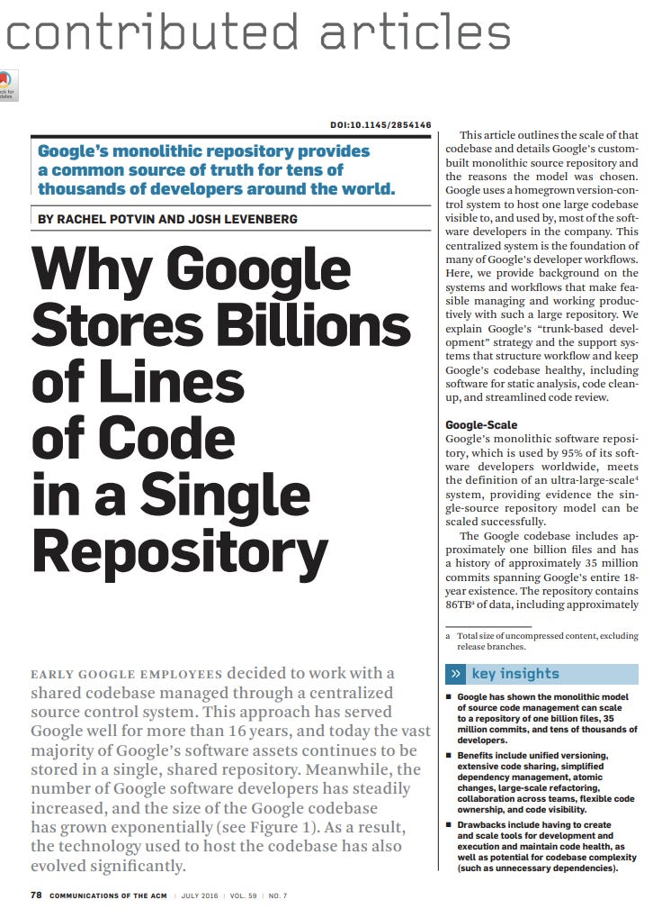
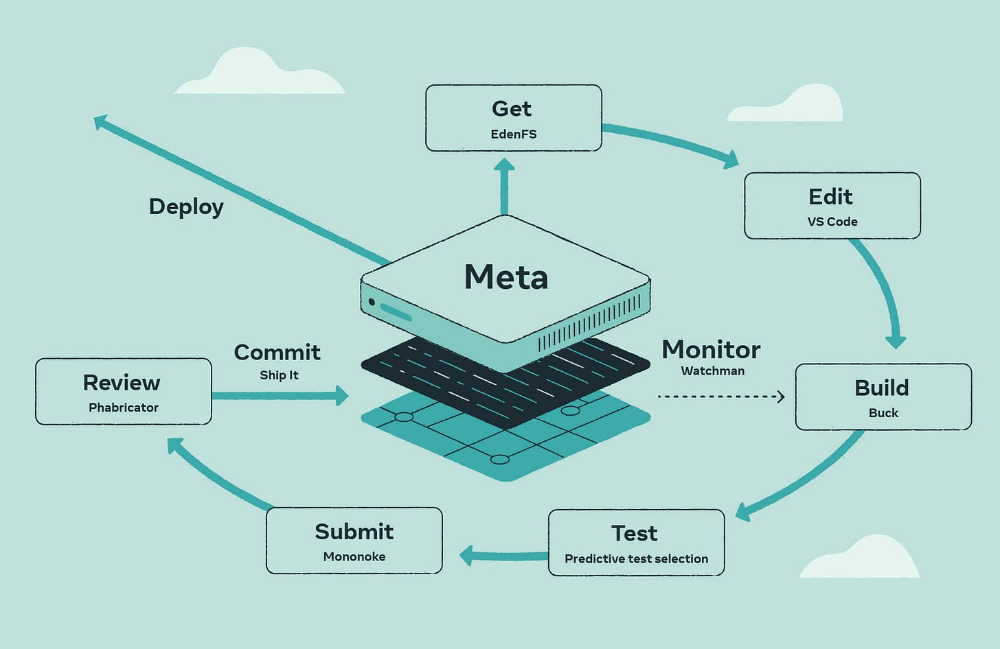
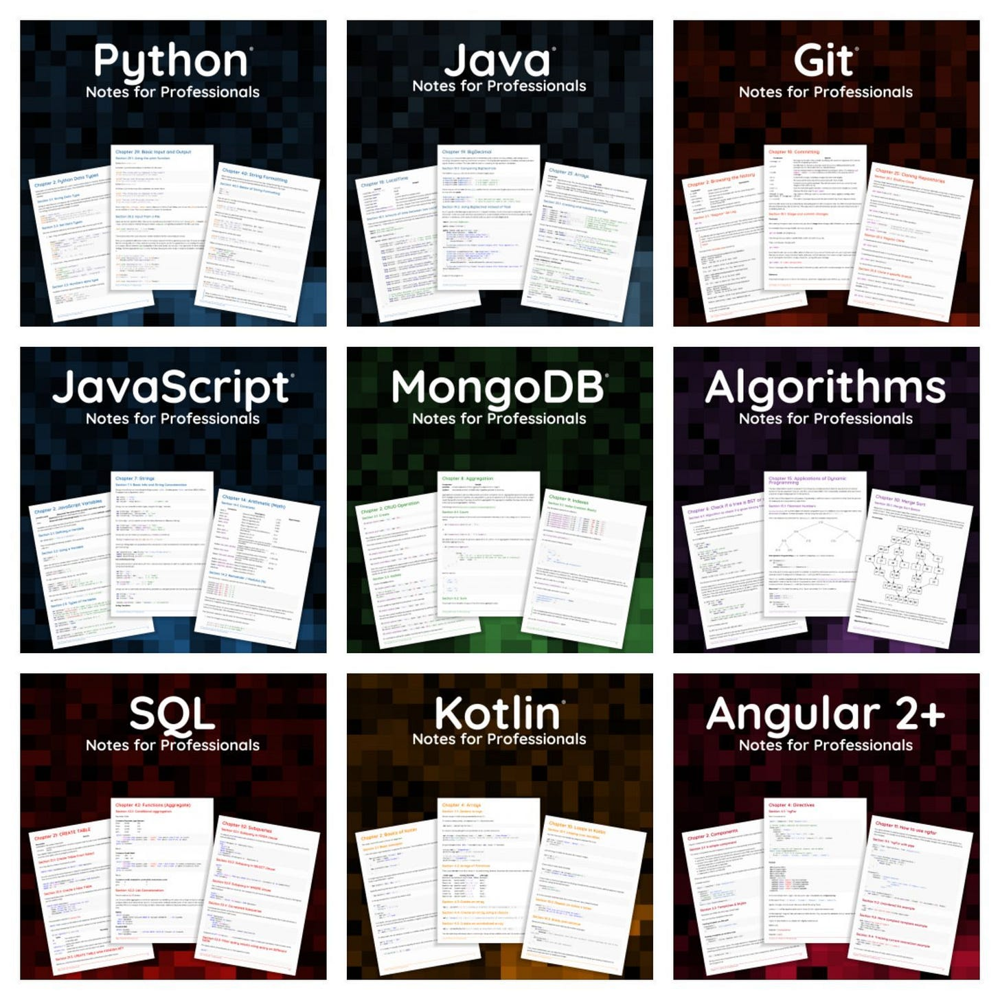

# Why Google Stores Billions of Lines of Code In a Single Repository

[The text](https://dl.acm.org/doi/pdf/10.1145/2854146) by Rachel Potvin and Josh Levenberg in the Communications of the ACM described how Google uses a **monorepo approach**.

Google’s monolithic repository provides a common source of truth for tens of thousands of developers worldwide. They use it for 95% of their source code, leaving Google Chrome and Android on their specific ones.

They used CVS and, after some time, migrated to Perforce and later replaced it with Piper. The 2016 source says it has over 2 billion lines of code and 40,000 daily commits by more than 10,000 engineers. We can only assume that this is much bigger today.

Engineers mainly use **trunk-based development models** at scale with much success. Regarding branching, changes are pushed to the main branch and submitted to code reviews. All of this removes nightmares of merge hell.

**Tricorder** carries out the first automatic checks when they try to submit new code and provides initial automated feedback to the developer. And then, code review can be done using the Critique tool for code reviews.

Engineers use **Rosie**, a solution for massive refactorings, optimizations, code cleaning, and other tools. It enables changes to be divided into minor changes and reviews by each owner before being built.

Some **advantages**of this approach are:

- **Unified versioning**
- **Extensive code sharing**
- **Simplified dependency management**
- **Atomic changes**
- **Large-scale refactoring**
- **Collaboration across teams**
- **Flexible code ownership**
- **Code visibility**

And **disadvantages**include having to create and scale tools for development and execution and maintain code health, as well as the potential for codebase complexity (such as unnecessary dependencies).

The paper

Check **[the entire paper](https://dl.acm.org/doi/10.1145/2854146)** and the **[presentation by Rachel](https://www.youtube.com/watch?v=W71BTkUbdqE&ab_channel=%40Scale)**.

---

# Developer Tools in Meta

[The article](https://engineering.fb.com/2023/06/27/developer-tools/meta-developer-tools-open-source/) from Meta's engineering blog discusses several open-source developer tools used at Meta.

Here are the tools they use:

- **[Sapling](https://engineering.fb.com/2022/11/15/open-source/sapling-source-control-scalable/)**: This is a version control system designed for scalability and usability. It consists of a server, a client, and a virtual file system. The server stores all the data and is [implemented primarily on Rust](https://engineering.fb.com/2021/04/29/developer-tools/rust/). The client communicates with the server and provides familiar operations like check out, rebase, commit, amend, etc. The virtual file system, EdenFS, checks out everything in a few seconds but only downloads the files from the server when they are accessed.
- **[Buck2](https://engineering.fb.com/2023/04/06/open-source/buck2-open-source-large-scale-build-system/)**: This is a build system used by many developers at Meta to compile and test their changes. Buck2 is designed to work at a large scale, supporting remote caching and execution. It also supports multiple programming languages simultaneously.
- **Infer, RacerD, and Jest** are tools used for testing and static analysis. **[Infer](https://fbinfer.com/)** is used for general static analysis and supports multiple languages, including Java and C++. **[RacerD](https://engineering.fb.com/2017/10/19/android/open-sourcing-racerd-fast-static-race-detection-at-scale/)** is used to detect Java concurrency bugs. **[Jest](https://jestjs.io/)** is a JavaScript testing framework transferred to the OpenJS Foundation in 2022.
- **[Sapienz](https://engineering.fb.com/2018/05/02/developer-tools/sapienz-intelligent-automated-software-testing-at-scale/)**: This tool automatically tests mobile apps by simulating the user experience to discover crashes and other potential issues.

In addition to these open-source tools, Meta developers also use proprietary tools like **Phabricator**for CI and code review.

Meta developer tools (credits: Meta)

You can read the **full article** and learn more about these tools **[here](https://engineering.fb.com/2023/06/27/developer-tools/meta-developer-tools-open-source)**. Also, you can find more about these tools (along with the ones covered above) in the article on [Meta developer’s workflow](https://developers.facebook.com/blog/post/2022/11/15/meta-developers-workflow-exploring-tools-used-to-code/).

---

# Bonus: Free Programming Books Curated By Stack Overflow Docs

Here is the list noted as "**[Notes for Professionals](https://books.goalkicker.com/)**," curated by the people at Stack Overflow.

It contains nearly 50 books covering different technologies, such as:

🔹 Python
🔹 Node.js
🔹 Java
🔹 Kotlin
🔹 Git
🔹 C++
🔹 C#
🔹 JavaScript
🔹 SQL
🔹 Swift
🔹 Algorithms
🔹 and more

Some contain more than 700 pages.

Check them out **[here](https://books.goalkicker.com/)**.

Free books by Stack Overflow Docs

---

🎁 If you are interested in sponsoring one of the following issues and supporting my work while enabling this newsletter to be accessible to readers, check out the **[Sponsorship Tech World With Milan Newsletter](https://newsletter.techworld-with-milan.com/p/sponsorship-of-tech-world-with-milan)** opportunity Tech World With Milan Newsletter.

---

Thanks for reading Tech World With Milan Newsletter! Subscribe for free to receive new posts and support my work.