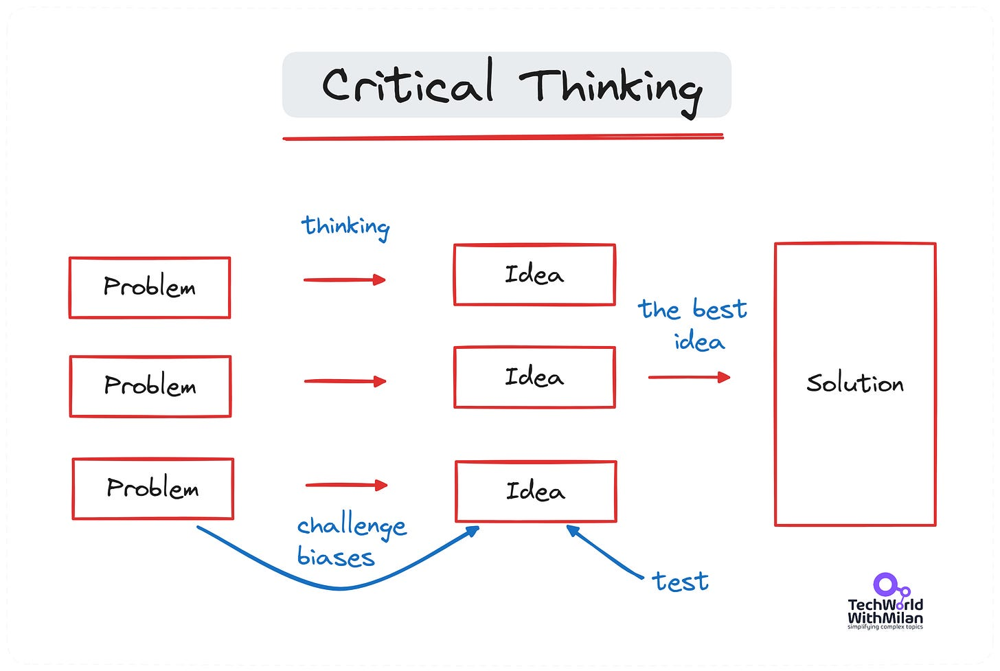
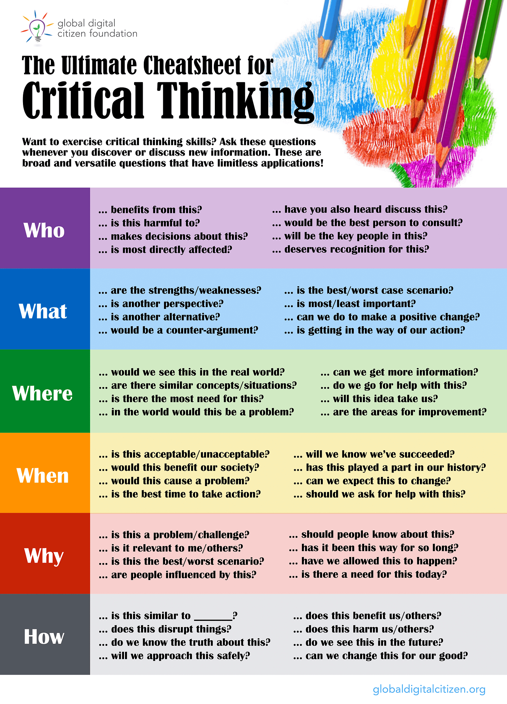
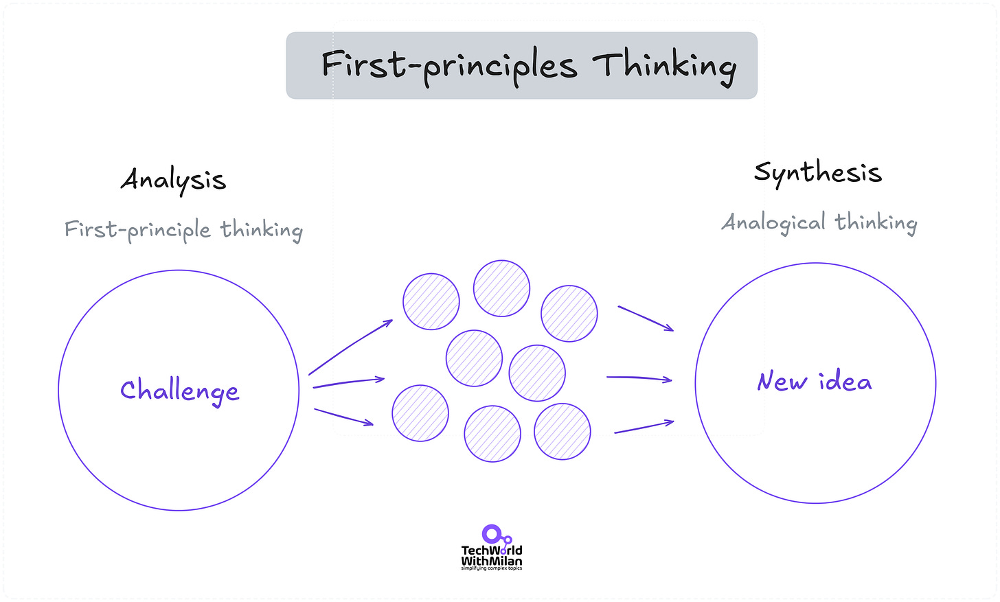
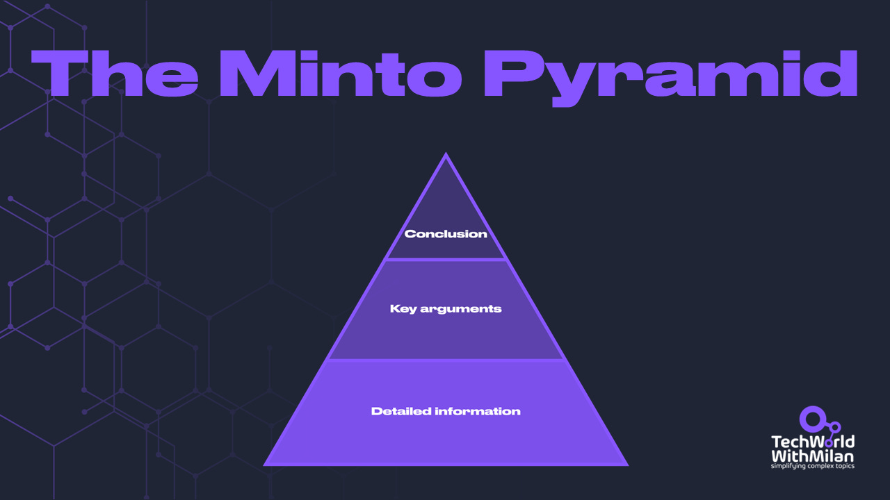

# Why is critical thinking a game-changer for developers ?

This week’s issue brings to you the following:

- **Why is critical thinking a game-changer for developers?**
- **Solving complex problems with First Principles**
- **Making your communication more efficient with Minto Pyramid**

So, let’s dive in.

---

## **Why is critical thinking a game-changer for developers?**

I was often asked if doing a Ph.D. was worth it, considering that I left academia and went to the industry. The clear answer is yes because there, I learned some skills that, as a developer, I wouldn't have, such as how to write, how to collaborate, how to do critical thinking, etc. The most important skill I learned is how to do **critical thinking**. It is also something coming deep from my nature, as saying: "*We are always doing it in this way*," is usually not a good enough explanation for me.

Our industry must continuously test the benefits and drawbacks of different technologies, architectural approaches, etc. It is knowing how to approach and try those options and make proper decisions. **Critical thinking is a way to process information before you get an answer or conclusion**. Critical thinking and problem-solving are the things that make good developers great.

Critical Thinking

Usually, a process of critical thinking goes in the following steps:

1. **Identify the problem**
2. **Analyze the problem from different perspectives and discover the facts**
3. **Challenge your biases by asking yourself whether you’re making assumptions**
4. **Hypothesize possible solutions based on an understanding of the problem and your past knowledge**
5. **Test and compare the effectiveness of each solution and the feasibility of implementation**
6. **Select one solution that fits your criteria**
7. **Communicate results to as vast a pool as possible and take actions**

The most important step 2. can be approached by asking some good questions:

✅ Is this necessary to do at all?
✅ Are we solving the right problem?
✅ Are we solving the problem in the right way?
✅ What goal do we want to achieve with this?
✅ Can we take another look at this?
✅ How can we break big problems into smaller ones?
✅ How do I know I succeeded?
✅ Is this solution good enough?

These are some examples of questions you can ask. Not all the questions you ask yourself have to have an answer. Talk about such issues with your management, the owner of the business, or the client. **Understanding what problem you are fixing, why**, and whether this does not cause new issues elsewhere.

What differentiates critical thinkers from others is that they are **curious, drop less helpful** **information and use the right ones, use reliable sources, listen actively, communicate effectively, and have empathy**.

Below is a **helper cheat sheet** that can guide you through the critical thinking process.

The Ultimate Cheat Sheet for Critical Thinking (Credits: globaldigitalcitizen.org)

---

## **Solving complex problems with First Principles**

In engineering, we have a lot of complicated problems to solve. Some issues are solved already, but not in an optimal way. Sometimes, we need better solutions and some creativity in the end. My favorite answer is to use **the first principles of thinking**. It enables us not to think like everyone else. Many great innovators and thinkers, such as Aristotle or Elon Musk, used this thinking. 

The first principle is something that cannot be further broken down any further, as defined by Aristotle. With first principles, we try to solve things like scientists and search for proofs only. This means we need to dig deeper until we find foundations that are absolute truths. This doesn't mean going to some dark holes of knowledge, but **just one or two levels more than others**.

How can we use it to solve problems?

1. **Define your problem clearly**

Begin by defining the problem and identifying its core components and underlying relationships, e.g., "*How to grow my SAAS business with less money ?*" You don't understand it well enough if you cannot explain it in one to two sentences.
2. **Break the problem down into its most basic elements**

We can do this by asking powerful questions. For example, running my business is expensive because 50% of my spending goes to my team and 50% to the cloud infrastructure. With **first principles,** you can say, "*What are we using in cloud infrastructure? Do we need all of these services up and running? Is cloud tech a must? When we look at each service, can we go on-premises?*"

Here” you can also use a technique called "**[five whys](https://www.mindtools.com/a3mi00v/5-whys),**" where we can ask five why questions to go to the root cause of the problem.
3. **Create a new solution from those principles**

Once you've discovered and reduced your issues or presumptions to their simplest forms, you may start coming up with **“fresh, original, and wise solutions**. E.g., "*We will use on-premises service, tech-agnostic, as this will reduce our costs by 50% in the long run while maintaining our business operations as usual"*.

First-principles thinking is an excellent tool for escaping this herd mentality, thinking creatively, and devising original solutions to well-known problems.

First-principles Thinking

---

## Making your communication more efficient with Minto Pyramid

Here is a simple framework to make your communication clear without putting long walls of text in front of people or making long presentations. It can even help writers attract readers' attention by making communication more precise and efficient. The key is to share the essential info at the very end. It's called **the Minto Pyramid**, first described in the book "[The Minto Pyramid Principle](https://amzn.to/47CUAS5)" by Barbara Minto. 

The idea behind the pyramidal hierarchy is that it makes an argument simpler and more persuasive. **The most significant takeaway from the essay is located at the top of the pyramid**, followed by layers of ordered data. This article's structure enables the reader to take in a central idea before being given evidence to back it up.

Here is how this concept works:

1. **We start with the conclusion**

Tell your audience the primary point, message, advice, or conclusion up front to grab their attention. Although this may go against what we have been taught to do when communicating, it is more effective—mainly when writing to audiences who may be short on time or attention.
2. **Add supporting arguments**

Now that the essential message has been conveyed, it's time to bolster it with supporting evidence or main points. These need to be relatively brief. You should summarize your essential points in them. This section should justify your conclusion or suggestion.
3. **Add supporting data or facts**

As the name implies, the bottom of the pyramid stores the facts, data, and other discoveries that confirm the supporting arguments. If you want to, you can be specific at this point.

Here is **an example** of the Minto Pyramid:

❓ **Question**: Should we enter new markets, like Moldavia?

👉 **What**: We researched our product/approach and concluded that we must open a new location in Moldavia.

👉 **Why**: This market is growing with skilled people by 12%, which is faster than other European developing countries. Here can come more reasoning, such as results of competition analysis, etc.

👉 **How**: This would be the following steps: partnerships with local HR companies, analysis of office location, etc.

The Minto Pyramid

---

## More ways I can help you

1. **1:1 Coaching:** [Book a working session with me](https://newsletter.techworld-with-milan.com/p/coaching-services). 1:1 coaching is available for personal and organizational/team growth topics. I help you become a high-performing leader 🚀.
2. **[Promote yourself to 20,000+ subscribers](https://newsletter.techworld-with-milan.com/p/sponsorship-of-tech-world-with-milan)**by sponsoring this newsletter.

---

Thanks for reading Tech World With Milan Newsletter! Subscribe for free to receive new posts and support my work.