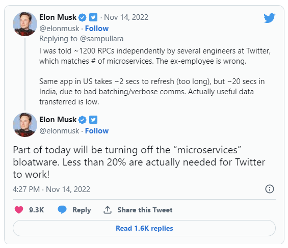
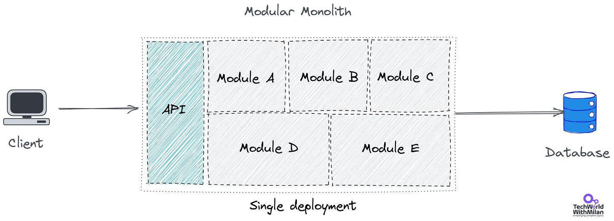
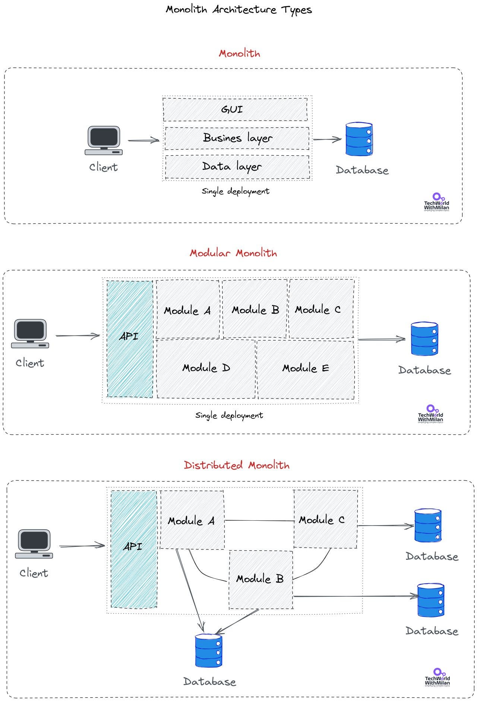
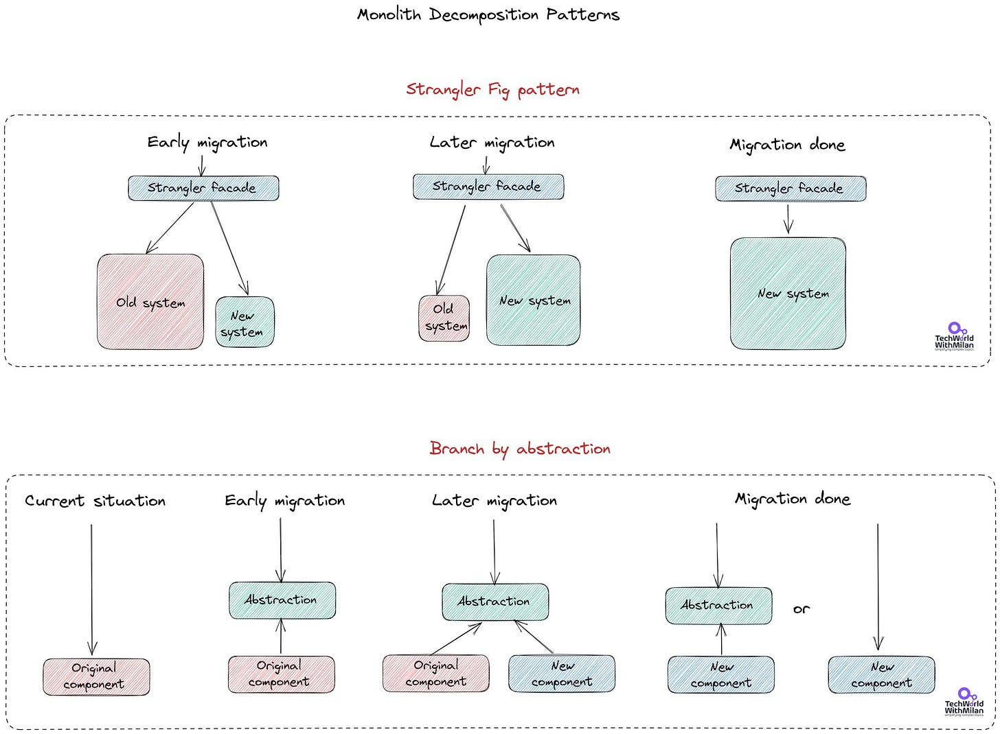
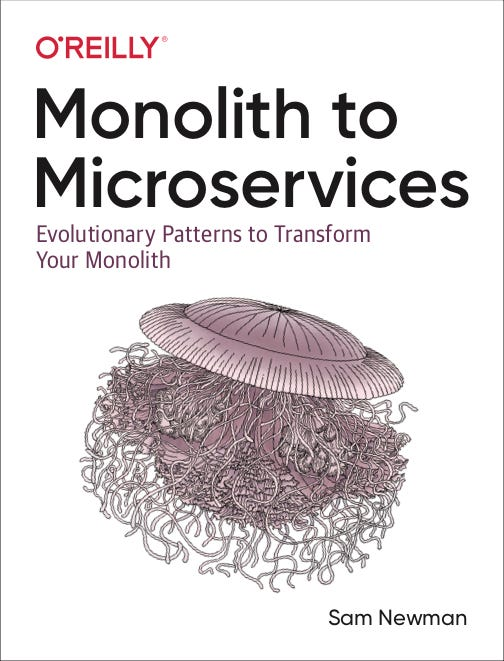

# Why should you build a (modular) monolith first?

In recent years, we have seen a significant increase in apps built using a microservices architecture. We selected this approach mainly because small teams work in isolation without having them trip over each other. Yet, this is an organizational problem, not a technical one. We can also build each service using different technologies and scale it independently.

Monolith at the Swiss National Exp in 2002, built by Jean Nouvel

With the**microservice approach**, we have a few disadvantages, too. The system is becoming complex in terms of maintaining and diagnosing issues (logging and tracing). This is very important when dealing with microservices. Yet, we also saw something called “**microservice bloatware**,” even on Twitter:

But there are also **[many more examples](https://docs.google.com/spreadsheets/d/1vjnjAII_8TZBv2XhFHra7kEQzQpOHSZpFIWDjynYYf0/edit#gid=0)** where the microservices approach fails; if you’re not solving a problem at Netflix size, you probably don’t need microservices.

On the other hand, we have monoliths with a lot of lousy wording about them. But **building monoliths doesn’t mean something better per se**. In the last few years, we have often seen the identification of monoliths with big balls of mud architecture or purely building legacy code, which doesn't mean to be. Yes, monoliths cannot scale or release independent pieces of the system separately, but those are mainly the most significant downsides. Still, you can create tremendous and **high-quality code inside**. Monolith brings us much less complexity, reduced network calls, more detailed logging, etc. Most subsystems of an entire application or system are stored in the monolith container. It is called **self-contained since every system component is housed in a single container**.

We can have architected monoliths that will fulfill all our use cases and requested architecture attributes in the system without dealing with the complexity of microservice architecture. **[The best example is Shopify](https://www.linkedin.com/posts/milanmilanovic_softwareengineering-technology-programming-activity-7005420344463224832-h2YK/)**, with over 3 million lines of code, one of the giant monoliths in the world. Instead of rewriting its entire monolith as microservices, Shopify chose modularization as the solution, while they served **1.27 million requests per second during Black Friday**. But there are also more examples of monoliths, such as **[StackOverflow](https://nickcraver.com/blog/2016/02/03/stack-overflow-a-technical-deconstruction/), [Basecamp](https://m.signalvnoise.com/the-majestic-monolith/),**or **[Istio](https://blog.christianposta.com/microservices/istio-as-an-example-of-when-not-to-do-microservices/)**. Also, recently, we saw that one team in Amazon (Prime Video) **[abandoned microservice architecture in favor of monolith](https://www.linkedin.com/feed/update/urn:li:activity:7060131010885107712/)**.

We want to have separate modules and work on them while maintaining simplicity to **[build a modular monolith](https://martinfowler.com/bliki/MonolithFirst.html)**. An adequately produced modular monolith can be a good step that can be more or less transformed into a microservice solution tomorrow if needed. So, the recommended path is **[Monolith > apps > services > microservices](https://twitter.com/jasoncwarner/status/1592227285024636928?s=46&t=GUYP2Bic04PDaoy0SbDixA)**.

> "*You shouldn't start a new project with microservices, even if you're sure your application will be big enough to make it worthwhile*.​" — Martin Fowler.

When we want to build a modular monolith, it is crucial to**divide the system into manageable modules**before assembling them into a monolith for deployment. As all communication between the modules might result in a cross-network call if you decide to break it into services in the future, high cohesion, and low coupling are crucial in this situation. This means that all inter-module communication must be abstracted, asynchronous, or based on messaging for the modules to handle calls that travel across the network in the future.

How can we implement such a concept? **First, we create separate modules, each with its architecture**, and those modules are pulled together into a single API gateway. This allows us to deploy the whole system as a monolith, but it will also enable us to pull out separate modules into services if needed in the future.

# What is a Distributed Monolith?

There are three types of monoliths:

1. **Traditional Monoliths**

These are the most common monolith types, where everything is bundled together. Usually, we have some user interface, business logic, and data access layers in a single tier and deployment. There are no clear boundaries between domains, and the code will have shared libraries.
2. **Modular Monoliths**

With modular monoliths, we have defined precise functional slices and dependencies, meaning each module can be independent of the others. Yet, there will still be a single deployment unit and a single database. **This is what we want to achieve**.
3. **Distributed Monoliths**

Here, we have one modern monolith variant, where our system is deployed like microservice architecture but built with monolith principles in mind. We usually get to this point while attempting to create a microservice architecture without considering some architectural and process changes needed. For example, we know we have a distributed monolith when some services cannot be deployed separately, are chatty, and cannot scale and share the same data source.

This is an **obvious example of an anti-pattern**. These systems are built like monoliths but deployed similarly to microservices. Here, we have the worst of both worlds: tightly coupled services with the complexity of microservices. Unfortunately, we usually get here by **developing microservice architecture wrongly**.

# Monolith Decomposition Strategy

If we are stuck with traditional or distributed monoliths, we need to do some **monolith decomposition**. There are a few approaches that can help here:

1. **Strangler Fig Pattern**

The Strangler Fig Pattern ([Coined by Martin Fowler](https://martinfowler.com/bliki/StranglerFigApplication.html)) comes from a collection of plants that grow by "strangling" their hosts. This pattern enables the replacement of specific functionality with new services. Here, we create a façade that intercepts requests going to the monolith and routes these requests to the monolith or new services. And we gradually migrate old functionality to new services, yet consumers always hit the façade.

Here, you can also use **Domain-Driven Design (DDD)**to incrementally refactor the application into more minor services, where you first find ubiquitous languages (common vocabulary) between all stakeholders, then identify relevant modules to apply this vocabulary to them and define domain models of the monolithic application. In the last step, you define bounded contexts for the models, which are boundaries within a domain.
2. **Branch by abstraction**

With this approach, we create an abstraction layer over our original component so that we can replace it step by step. Client requests are directed to this layer, allowing us to change everything behind it. The client will hit only the new component when we finish the changes. With this pattern, we can coexist two implementations of the same functionality, the true Liskov substitution principle. Although, like the Strangler Fig pattern, with this one, we are working on a bit lower level of abstraction, where our focus is more on components than the systems.

If you're interested in this approach, I recommend the following book: “**[Monolith to Microservices](https://amzn.to/42wiZ97)**,” by Sam Newman.

Monolith to Microservices, by Sam Newman

# References

- **[Modular Monolith: A Primer](https://www.kamilgrzybek.com/blog/posts/modular-monolith-primer)**, Kamil Grzybek.
- **[Build the modular monolith first](https://www.fearofoblivion.com/build-a-modular-monolith-first)**, Chris Klug.
- **[MonolithFirst](https://martinfowler.com/bliki/MonolithFirst.html)**, Martin Fowler.
- **[Strangler Fig pattern](https://martinfowler.com/bliki/StranglerFigApplication.html)**, Martin Fowler.
- **[The Majestic Monolit](https://m.signalvnoise.com/the-majestic-monolith/)h,** David Heinemeier Hansson.
- **[eShopOnWeb](https://github.com/dotnet-architecture/eShopOnWeb)**by Microsoft - Monolithic Web application built using ASP.NET.
- **[eShopOnContainers](https://github.com/dotnet-architecture/eShopOnContainers)**by Microsoft - Microservices Web Application, which is more complex, scalable, and resilient.
- **[Microservice architecture](https://microservices.io/index.html)**, Chris Richardson.

---

Thanks for reading Tech World With Milan Newsletter! Subscribe for free to receive new posts and support my work.