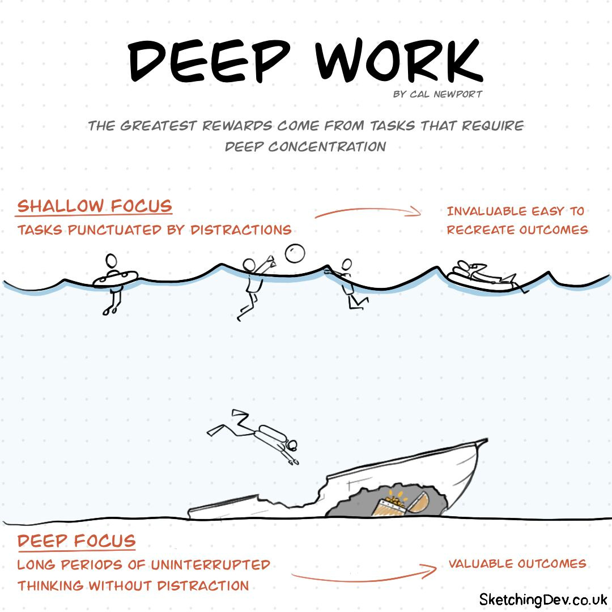
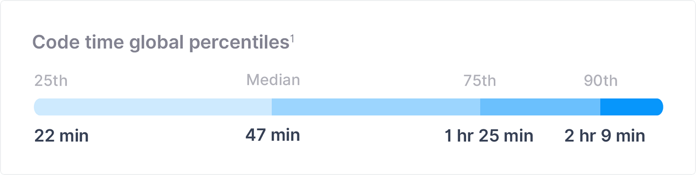
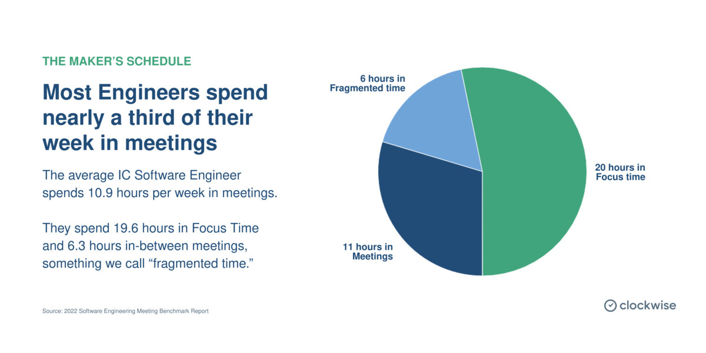
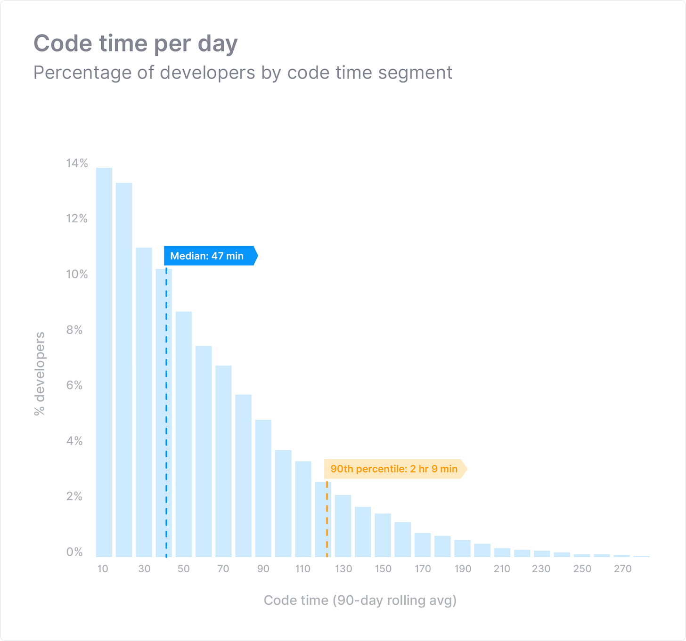
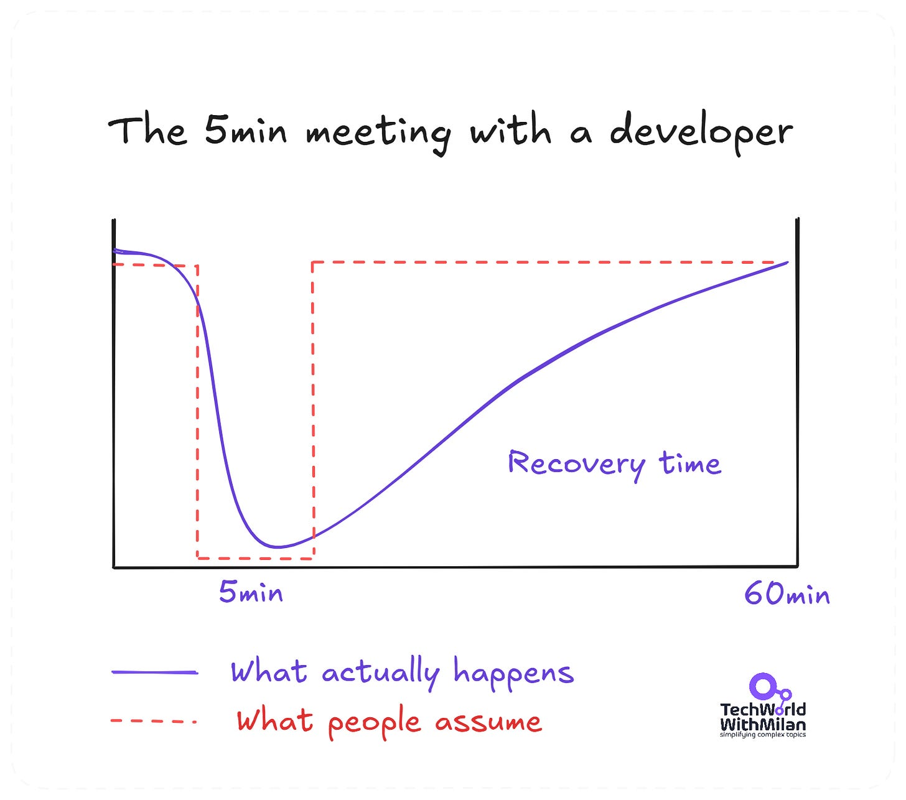
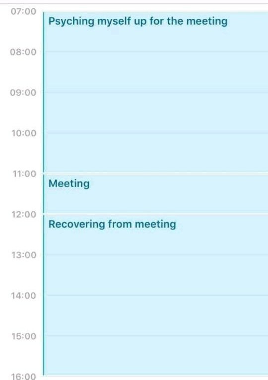
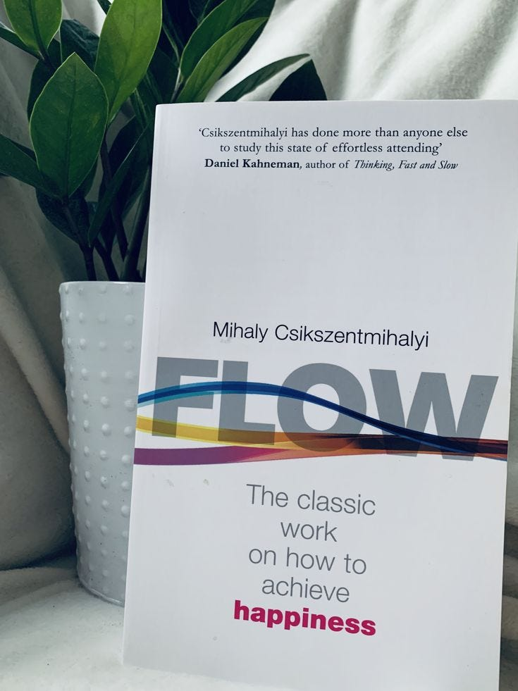
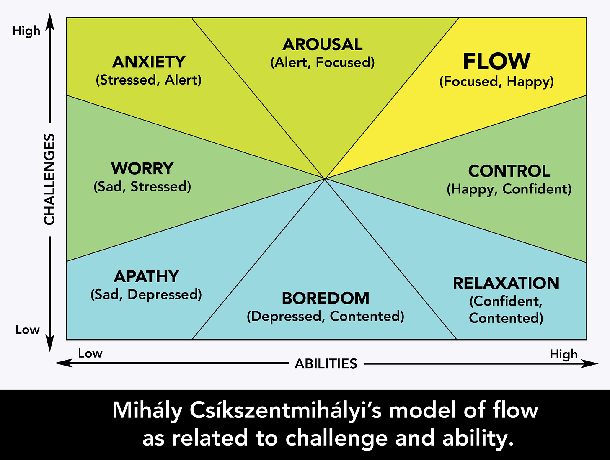
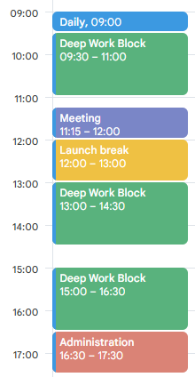
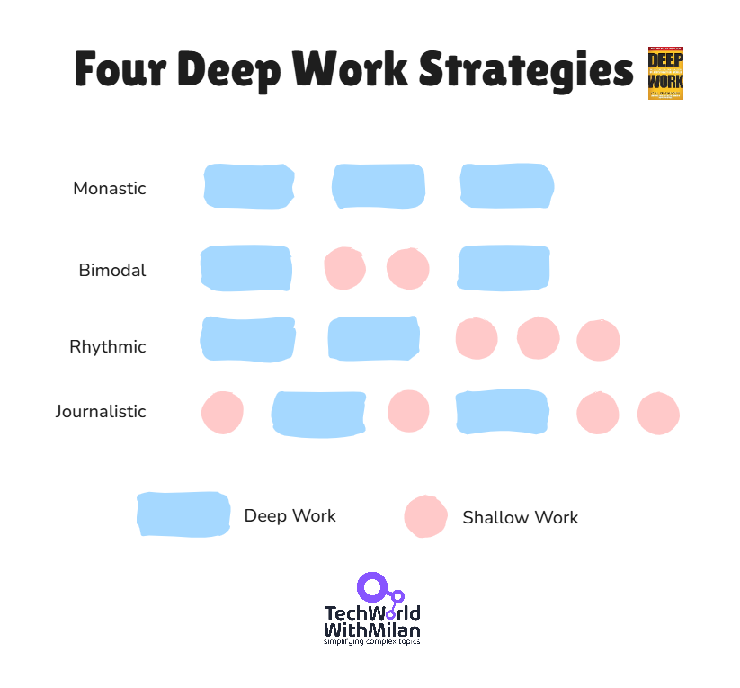

# You can code only 4 hours per day. Here’s why.

*And no, AI doesn’t improve this either.*

You probably felt it: after a few hours of coding, your brain isn't as fresh anymore. A good day can give you maybe 3 to 4 hours of deep, focused coding. After that, quality and focus drop. Research in cognitive psychology also supports the pattern.

Across the teams I’ve led and coached, the same loop keeps showing up. Developers judge themselves by an eight-hour ideal, then feel behind when only a few hours produce real output. But high-focus work has a ceiling. Treating 3 to 4 hours as the primary objective leads to better software and less burnout.

In the rest of the article, we are going to talk about:

1. **The cognitive ceiling.** Research by Ericsson, Mark, and Newport shows that 3-4 hours is the daily maximum for concentrated effort. Beyond that, diminishing returns.
2. **Where developer time actually goes.** Data reveal that the median coding time is 52 minutes/day. Meetings consume 11+ hours per week, pushing peak coding to the afternoons when mornings should be prime.
3. **The cost of interruptions.** 23 minutes to recover from one interruption. For programmers, 30-45 minutes to rebuild the full context. A single meeting can destroy an entire afternoon.
4. **Flow as a force multiplier.** Csikszentmihalyi’s research: 500% increase in productivity in the flow state. But flow requires 15-25 minutes of uninterrupted time just to begin.
5. **Strategies for deep work.** There are four strategies of deep work listed by Newport: Monastic, Bimodal, Journalistic, and Rhythmic, and some practical techniques are time-blocking, batch communication, and focusing on
6. **Why managers should care.** Protecting manager time is more valuable than adding more processes. No-meeting days, async defaults, and reasonable deadline setting provide big wins for cycle time and quality.

So, let’s dive in.

---

## 1. The cognitive ceiling is real, and lower than you think

[Cal Newport](https://calnewport.com/), a full-time professor of computer science at Georgetown University and author of the excellent “[Deep Work](https://amzn.to/46cLRY5)” book [1], describes “deep work” as “*professional activities performed in a state of distraction-free concentration that push your cognitive capabilities to their limit*”. When you are in such an optimal state, you’re not only completing high-leverage work in an efficient way, but it’s also being done at an optimal quality. It’s a bit like *being in “[flow](https://en.wikipedia.org/wiki/Flow_(psychology))” or being “in the zone”*, a state described in psychological terms as “Csíkszentmihályi” (full absorption and energized focus)!

But here’s the challenge: such mental strains can be limited. Newport shows us that most individuals should expect that they can perform what Newport refers to as “deep work” for an average of four hours per day.

Of course, this is further substantiated by traditional psychological research by K. Anders Ericsson, one of America’s most prominent psychological researchers. Ericsson studied competitive violinists [2], showing that they indeed engaged in “*concentrated blocks of practice, or 4 hours of concentrated effort, before they became tired*.” So, despite what certain individuals set as their objective, four hours of concentrated “deep work” is obviously an apex after which one’s performance naturally declines significantly.

Software development isn’t any different. Coding, particularly creative problem-solving or architecting systems, is mentally intensive work. Pushing beyond the 3-4 hour mark for sustained, high-concentration coding usually leads to diminishing returns. I’m sure you’ve felt it-that late-afternoon slowdown where you’ve been staring at the screen but not actually producing much.

Exhausted at the desk (Credits: [Unsplash](https://unsplash.com/photos/a-person-sitting-at-a-desk-in-front-of-a-lamp-Bb_gxpV09qk))

The pattern repeats across different domains. Famous mathematician Henri Poincaré worked 2 hours in the morning and 2 hours in the evening. G.H. Hardy only worked mornings. Charles Darwin, B.F. Skinner and C.S. Lewis both worked in 3-4 hour writing schedules.

Gloria Mark’s attention research at UC Irvine [3] paints an even clearer picture. Her findings discovered we now spend an average of just 47 seconds on any screen before shifting attention, down from 2.5 minutes in 2004. “*Our minds are just not equipped to be able to focus for long extended periods of time*,” Mark says. “We have limited attentional resources or cognitive resources.”

Deep Work (Source: [SketchingDev.co.uk](https://sketchingdev.co.uk/sketchnotes/deep-work.html))

## 2. What developers actually do with their time

The difference between perceived and actual coding time is interesting. An analysis by Software.com of more than 250,000 developers [4] found that the median developer spends only 52 minutes per day writing or editing code, or about 4 hours 21 minutes per week. Only 10% of developers code for more than 2 hours a day, while 40% code for more than 1 hour.

Code time global percentiles (Source: [Global Code Time Report](https://www.software.com/reports/code-time-report) [4])

Where does the time go? Software engineers typically have 10.9 hours of meetings each week, according to an analysis of 1.5 million meetings done by Clockwise [5].

Engineering managers spend 18 hours in meetings each week, almost half of a standard 40-hour workweek. Developers at large organizations have 12.2 hours of meeting time each week, whereas developers at smaller organizations have 9.7 hours.

After a day of “meetings,” “admin,” “code reviews,” and “collaboration,” engineers have a mere 19.6 hours of focus left each week, most of it in unusable chunks.

[Clockwise](https://www.getclockwise.com/eng-meeting-benchmarks) found that developers spend nearly 11 hours in meetings each week [5]

Peak coding time shows how meetings eat mornings. Software.com found that 45% of all workday coding occurs between 2 pm and 5 pm, while only 10% occurs between 9 am and 11 am. Developers are not naturally afternoon coders. Their mornings are just consumed by standups, syncs, and ceremonies. As the report itself notes, “*If more companies protected mornings, we might see an increase in the global average code time per day*.”

Code time per day (Source: [Global Code Time Report](https://www.software.com/reports/code-time-report) [4])

## 3. The high cost of interruptions

An interruption, however, comes with a hidden cost. According to [Gloria Mark’s research](https://ics.uci.edu/~gmark/chi08-mark.pdf) [3],****it takes a person exactly 23 minutes and 15 seconds to fully resume a prior task after an interruption.

For programmers, however, this cost is much higher. According to research conducted at Georgia Institute of Technology [6], it takes 10-15 minutes for programmers to resume their work by starting to edit their code, but a full rebuilding of their prior mental context takes 30-45 minutes.

The 5min meeting with a developer (Y-axis: productivity, X-axis: time)

This dynamic is captured perfectly by Paul Graham in his influential 2009 essay on[the maker’s schedule](https://paulgraham.com/makersschedule.html): “*For someone on the maker’s schedule, having a meeting is like throwing an exception. It doesn’t merely cause you to switch from one task to another; it changes the mode in which you work*.”

A single meeting doesn’t just destroy its allotted time; it “*can blow a whole afternoon, by breaking it into two pieces each too small to do anything hard in.*” Even anticipating an afternoon meeting makes developers “slightly less likely to start something ambitious in the morning.

A meeting is much more than the time scheduled for it

Learn more about why context-switching is the main productivity killer:
[
Tech World With Milan NewsletterContext-switching is the main productivity killer for developersHave you ever wondered what the biggest productivity killer for developers is? There are many, but one stands out—and it’s often underestimated…Read morea year ago · 168 likes · 8 comments · Dr Milan Milanović](https://newsletter.techworld-with-milan.com/p/context-switching-is-the-main-productivity?utm_source=substack&utm_campaign=post_embed&utm_medium=web)
## 4. Flow state: the programmer's force multiplier

Mihaly Csikszentmihalyi, in [his research](https://amzn.to/4bdPEYH) [7][8] identify flow, which is “*the state of being completely involved in an activity for its own sake, when the ego disappears and time flies by*.” This illustrates the importance of protecting time for deep work. His 10-year study found that people achieved a productivity rate 500% higher when in a flow state than in a normal state.

Flow, for a software developer, means the difference between tedium and breakthroughs.

[Flow: The Psychology of Optimal Experience](https://amzn.to/4qJh8ub), by Mihaly Csikszentmihalyi

Csikszentmihalyi found that the balance between challenge and skill was the key to flow, or its absence. The absence, in other words, of too much or too little challenge causes one or the other.

Therefore, it can be stated that Flow, or deep focus, is one of the most powerful predictors of high performance in software teams. Teams that frequently feel they can deliver more value, more quickly, and with greater satisfaction. But most engineers rarely feel it.

Flow is not something that occurs naturally. It requires protection from the forces that drain it.

How to enter Flow state (Credits: [Brian Funk](https://brianfunk.com/blog/2016/3/15/the))

## 5. **How to get in the flow while coding**

Given that 3-4 hours of deep coding is probably the most one can hope for, the objective should then be to make every minute of that time count. The key is effective time management and setting boundaries around one’s schedule.

Here are some things that have personally worked for me and have also been effective for the teams that I manage:

1. **Create a distraction-free environment**. Close Slack. Silence notifications. Use visible status indicators to signal deep work mode. Even seeing a notification breaks concentration, even when you don’t respond to it.

Distraction-free desk (Source: [Sunsama](https://www.sunsama.com/blog/no-distractions))
2. **Set clear goals before every coding session**. Not “work on the backend” but “make the authentication endpoint return proper error responses.” The aspect of specificity allows for clear engagement with what one wants to achieve. Before the actual engagement, one should be clear about what “done” means.
3. **Tackle hard problems during peak cognitive hours**. The “[research on circadian rhythm](https://pmc.ncbi.nlm.nih.gov/articles/PMC10955027/) [9] reveals that cognitive performance can vary by as much as 9 to 40 percent depending on the time.” The most relevant fact for programmers is that “most adults experience their best problem-solving skill during mid-morning to early afternoon (about 10 am-2 pm). Afternoon energy wanes after lunch, but then surges again during late afternoon.” Evening people, known as “owls”, peak at different times than morning people, ”larks.” Code most intensely at your “personal cognitive peak” but protect those times “ruthlessly.”
4. **Time-block for maker schedules**. Proactively block 2-4 hour chunks on your calendar for deep work. Cluster meetings at the end of the day or on specific days. Set one goal for each work block, and break it into three actionable tasks. Focus on one task at a time. After work sessions reflect, do you need to change the length of time, do some tasks before others, etc. Here is an example of how I structure my day for deep work:

5. **Eliminate context switching**. Context switching is the biggest productivity killer. Batch out two communication windows a day rather than trying to be immediate responders. Close browser windows that aren’t relevant to the current task underway. Treat your attention as the scarce resource it is.

6. **Work in focused sessions, not marathon sprints**. The usual 25-minute pomodoro schedule is entirely inadequate for complex development tasks, just enough time for entering flow state before you are timer-interrupted. Take your breaks between intervals. The aim is for maximum quality, not maximum hours, within your cognitive abilities.

7. **Reflect and compound your learning**. Ericsson’s research on deliberate practice attests that it’s not time on task but reflective thinking that can produce expertise. One can conclude each in-depth coding session by mindful reflection on what worked, what got in my way, and what I will try differently tomorrow.

> ### **Four Deep Work Strategies**
> 
> *In this book, Cal Newport [identifies four methods for incorporating deep work into your schedule](https://dansilvestre.com/deep-work-strategies/) [1]. Each depends on how much control you have over your time, and how long you can stay disconnected.*
> 
> - ***The Monastic Strategy involves** the effective elimination of shallow work. Consider Donald Knuth, for example, who decided to remove email in 1990 so that he could focus, without distraction, on computer science research.*
> - ***The Bimodal Strategy** carves your week into deep and shallow days. So, maybe Monday to Wednesday you’re unreachable, then Thursday and Friday you handle meetings and emails.*
> - ***Rhythmic Strategy:** Execute deep work at a same hour each day - no exceptions. Jerry Seinfeld uses the “don’t break the chain” approach.*
> - ***The Journalistic Strategy** means seizing deep work whenever a window opens. Meeting canceled? Thirty free minutes? Drop into focus mode immediately.*
> 
> 
> 
> *For most developers, Rhythmic Strategy works the best. Set your mornings aside to code, uncommitted to any of Slack’s reactive tempts. Most of the people find mornings as the part of the day with the most energy.*
> 
> *But the Journalistic approach is interesting too. The idea of moving into deep focus for even 30-45-minute chunks between meetings sounds efficient. The only problem is to convince yourself you’re doing deep work when you’re actually just context-switching all day. That’s not focus-that’s fragmentation dressed up as productivity.*

## 6. Why engineering managers should care

The rationale for “saving” developers’ time boils down to simple arithmetic. If developers have an average allocation of only 52 minutes of actual coding per day, but all the interruptions they cause take away an additional 23+ minutes in “makeup” time, it means that one message eats nearly half a developer’s daily allocation just by itself!

[TechSmith](https://assets.techsmith.com/docs/async-first.pdf) ran an experiment eliminating meetings entirely, yielding a 15% increase in feeling productive, with 85% of employees stating they would trade meetings for async communication going forward. According to a [Microsoft survey](https://www.microsoft.com/en-us/worklab/work-trend-index/will-ai-fix-work) of 31,000 employees, inefficient meetings ranked #1 as a workplace productivity distraction.

The evidence strongly supports the idea that the best productivity activity for an engineering manager doesn’t involve adding processes or meetings, but instead removing them.

Here are a few recommendations for managers:

- Fine-tune your schedule so that you can have uninterrupted mornings
- Schedule no-meeting days (we do no-meeting Wednesdays)
- Asynchronous should be the default rather than synchronous communication
- Allow for creative exploration by setting realistic deadlines that allow for it

It’s necessary to understand that it’s better to have only 3 or 4 hours of actual, focused work than to fall for the commonly held misconception that one increases productivity with 8 hours, only to do so with interruptions.

To measure the impact of these actions, one can assess cycle time reduction, team satisfaction, and engagement score, as well as quality metrics such as bug rates and rework percentage.

A team of happy and productive employees (Image by pch.vector on [Freepik](https://www.freepik.com/free-vector/portrait-team-happy-professional-employees-cartoon-office-workers-corporate-clothes-group-colleagues-work-together-flat-vector-illustration-career-teamwork-startup-concept_28480791.htm))

## 7. Conclusion

The bottom line is this: 3-4 hours per day of real, deep programming is not a problem with your work habits, but a hard limit on how much useful cognitive load you can have in a day. Rather than fighting this, accept it and fit around it.

Optimize what you can control. You might not control ad-hoc production issues or a customer escalation that wrecks a planned focus block. But you can turn off notifications for a couple of hours, or let your team know you’ll be available after lunch instead of before.

You can negotiate with your product manager that the team needs two mornings per week free of meetings to improve output. You can improve your own habits, like not scheduling back-to-back meetings that mentally drain you, so that even when you do get a free hour, you’re too fried to code.

Most importantly, you need to change your mindset. Doing “half focus” for 8 hours is not better than doing “deep work” for 4 hours. Trust me, in any situation, you can guarantee that “deep work” will always win in terms of results generated in comparison with “half focus.” Once you accept this, you can stop apologizing for “not being busy” and stop envying the people who always *look* productive.

The objective is, of course, to make every coding work-hour worth more, rather than simply working more hours.

You will, over time, realize that consistently entering that flow state for a few hours every day leads to higher-quality code, reduced bug risk, and innovative solutions, not to mention a greatly improved work-life balance.

Remember, folks, coders are marathon runners, not sprinters, and while marathon runners occasionally sprint, that’s not feasible over 26.2 miles.

Your energy is one of the most valuable resources on the planet, so conserve it.

> ### A note on AI coding assistants
> 
> *Tools like Copilot, Cursor, and Claude don’t extend our deep work hours. They just move our focus. Instead of writing code from scratch, you’re working with an AI assistant and reviewing its output. That’s still mentally demanding work. You need the same context, the same judgment, and the same focus level to catch the subtle bugs that AI can introduce.*
> 
> *AI maybe handles mechanical tasks faster, but the 3-4 hour ceiling isn’t about typing speed. It’s about how long your brain can sustain high-quality decision-making under load. That limit doesn’t change just because the code appears on screen faster.*
> 
> *Where AI genuinely helps is during your shallow hours. Drafting documentation, generating boilerplate, answering quick “how do I do X in this library” questions, these tasks drain focus when done manually. Offloading them to AI preserves your deep work budget for actual architectural thinking and complex problem-solving.*
> 
> *The trap is using AI to produce more code than you can mentally process. More output doesn’t mean more value if you can’t reason clearly about what you’ve built.*
> 
> *The goal isn’t to generate more lines per day. It’s to spend your limited cognitive resources on the decisions that matter most.*
> 
> *Use AI to protect your deep work hours, not to pretend you have more of them.*

## 8. References

1. Newport, Cal. *Deep Work: Rules for Focused Success in a Distracted World*. Grand Central Publishing, 2016.
2. Ericsson, K. Anders. Research on expert performance and deliberate practice.
3. Mark, Gloria. Studies on workplace interruptions (University of California, Irvine).
4. Software.com. *[2021 Global Code Time Report](https://www.software.com/reports/code-time-report)*.
5. Clockwise 2022 [Software Engineering Meeting Benchmark Report](https://www.getclockwise.com/eng-meeting-benchmarks)
6. C. Parnin and S. Rugaber, "Resumption strategies for interrupted programming tasks," *2009 IEEE 17th International Conference on Program Comprehension*, Vancouver, BC, Canada, 2009, pp. 80-89, doi: 10.1109/ICPC.2009.5090030
7. Csíkszentmihályi, Mihály. *Flow: The Psychology of Optimal Experience*. Harper & Row, 1990.
8. Csíkszentmihályi, Mihály. [Flow, the secret to happines](https://www.youtube.com/watch?v=fXIeFJCqsPs)s, TED Talk.
9. Valdez, P. et al. (2023). *Diurnal variation in variables related to cognitive performance: a systematic review*. *Chronobiology International*, 40(8), 1091–1110

---

## **More ways I can help you**

- **[📱 You Can Build A LinkedIn Audience](https://www.patreon.com/posts/you-can-build-143858069?source=storefront)** 🆕. The system I used to grow from 0 to 260K+ followers in under two years, plus a 49K-subscriber newsletter. You’ll transform your profile into a page that converts, write posts that get saved and shared, and turn LinkedIn into a steady source of job offers, clients, and speaking invites. Includes 6-module video course (~2 hours), LinkedIn Content OS with 50 post ideas, swipe files, and a 30-page guide. **[Join 300+ people](https://www.patreon.com/posts/you-can-build-143858069?source=storefront)**.
- [📚](https://www.patreon.com/techworld_with_milan/shop/ultimate-net-bundle-for-2025-1519389?utm_medium=clipboard_copy&utm_source=copyLink&utm_campaign=productshare_creator&utm_content=join_link)**[The Ultimate .NET Bundle 2025](https://www.patreon.com/techworld_with_milan/shop/ultimate-net-bundle-for-2025-1519389?utm_medium=clipboard_copy&utm_source=copyLink&utm_campaign=productshare_creator&utm_content=join_link)**. 500+ pages distilled from 30 real projects show you how to own modern C#, ASP.NET Core, patterns, and the whole .NET ecosystem. You also get 200+ interview Q&As, a C# cheat sheet, and bonus guides on middleware and best practices to improve your career and land new .NET roles. **[Join 1,000+ engineers](https://www.patreon.com/techworld_with_milan/shop/ultimate-net-bundle-for-2025-1519389?utm_medium=clipboard_copy&utm_source=copyLink&utm_campaign=productshare_creator&utm_content=join_link)**.
- [📦](https://www.patreon.com/techworld_with_milan/shop/premium-resume-package-1721454?utm_medium=clipboard_copy&utm_source=copyLink&utm_campaign=productshare_creator&utm_content=join_link)**[Premium resume package](https://www.patreon.com/techworld_with_milan/shop/premium-resume-package-1721454?utm_medium=clipboard_copy&utm_source=copyLink&utm_campaign=productshare_creator&utm_content=join_link)**. Built from over 300 interviews, this system enables you to quickly and efficiently craft a clear, job-ready resume. You get ATS-friendly templates (summary, project-based, and more), a cover letter, AI prompts, and bonus guides on writing resumes and prepping LinkedIn. **[Join 500+ people](https://www.patreon.com/techworld_with_milan/shop/premium-resume-package-1721454?utm_medium=clipboard_copy&utm_source=copyLink&utm_campaign=productshare_creator&utm_content=join_link)**.
- [📄](https://www.patreon.com/techworld_with_milan/shop/complete-tech-resume-reality-check-311008?utm_medium=clipboard_copy&utm_source=copyLink&utm_campaign=productshare_creator&utm_content=join_link)**[Resume reality check](https://www.patreon.com/techworld_with_milan/shop/complete-tech-resume-reality-check-311008?utm_medium=clipboard_copy&utm_source=copyLink&utm_campaign=productshare_creator&utm_content=join_link)**. Get a CTO-level teardown of your CV and LinkedIn profile. I flag what stands out, fix what drags, and show you how hiring managers judge you in 30 seconds. **[Join 100+ people](https://www.patreon.com/techworld_with_milan/shop/complete-tech-resume-reality-check-311008?utm_medium=clipboard_copy&utm_source=copyLink&utm_campaign=productshare_creator&utm_content=join_link)**.
- [✨](https://www.patreon.com/c/techworld_with_milan)**[Join My Patreon](https://www.patreon.com/c/techworld_with_milan)**[https://www.patreon.com/c/techworld_with_milan](https://www.patreon.com/c/techworld_with_milan)**[community](https://www.patreon.com/c/techworld_with_milan) and [my shop](https://www.patreon.com/c/techworld_with_milan/shop)**. Unlock every book, template, and future drop, plus early access, behind-the-scenes notes, and priority requests. Your support enables me to continue writing in-depth articles at no cost. **[Join 2,000+ insiders](https://www.patreon.com/c/techworld_with_milan)**.
- [🤝](https://newsletter.techworld-with-milan.com/p/coaching-services)**[1:1 Coaching](https://newsletter.techworld-with-milan.com/p/coaching-services)**. Book a focused session to crush your biggest engineering or leadership roadblock. I’ll map next steps, share battle-tested playbooks, and hold you accountable. **[Join 100+ coachees](https://newsletter.techworld-with-milan.com/p/coaching-services)**.

---

## **Want to advertise in Tech World With Milan? 📰**

If your company is interested in reaching founders, executives, and decision-makers, you may want to **[consider advertising with us](https://newsletter.techworld-with-milan.com/p/sponsorship-of-tech-world-with-milan)**.

---

## **Love Tech World With Milan Newsletter? Tell your friends and get rewards.**

We are now close to **50k subscribers** (thank you!). Share it with your friends by using the button below to get benefits (my books and resources).

[Share Tech World With Milan Newsletter](https://newsletter.techworld-with-milan.com/?utm_source=substack&utm_medium=email&utm_content=share&action=share)

[Track your referrals here](https://newsletter.techworld-with-milan.com/leaderboard).