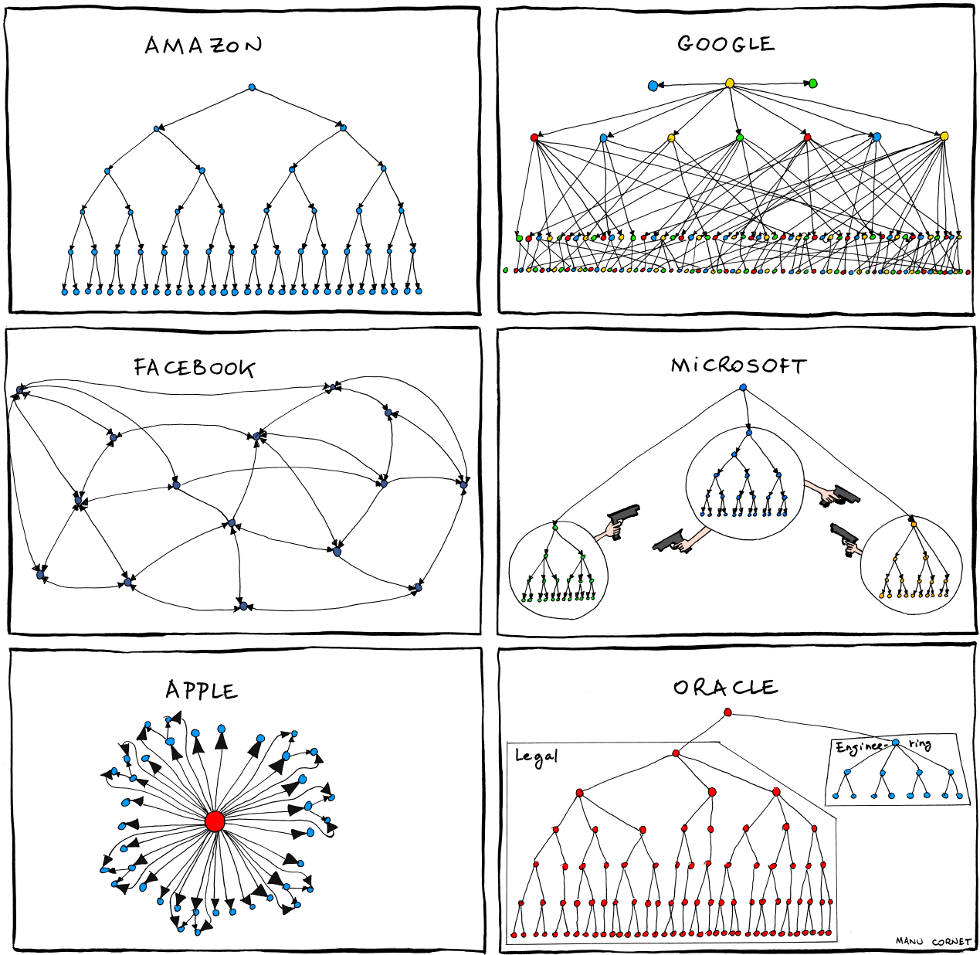
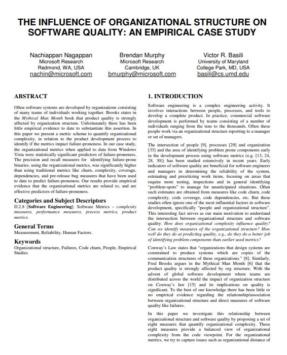
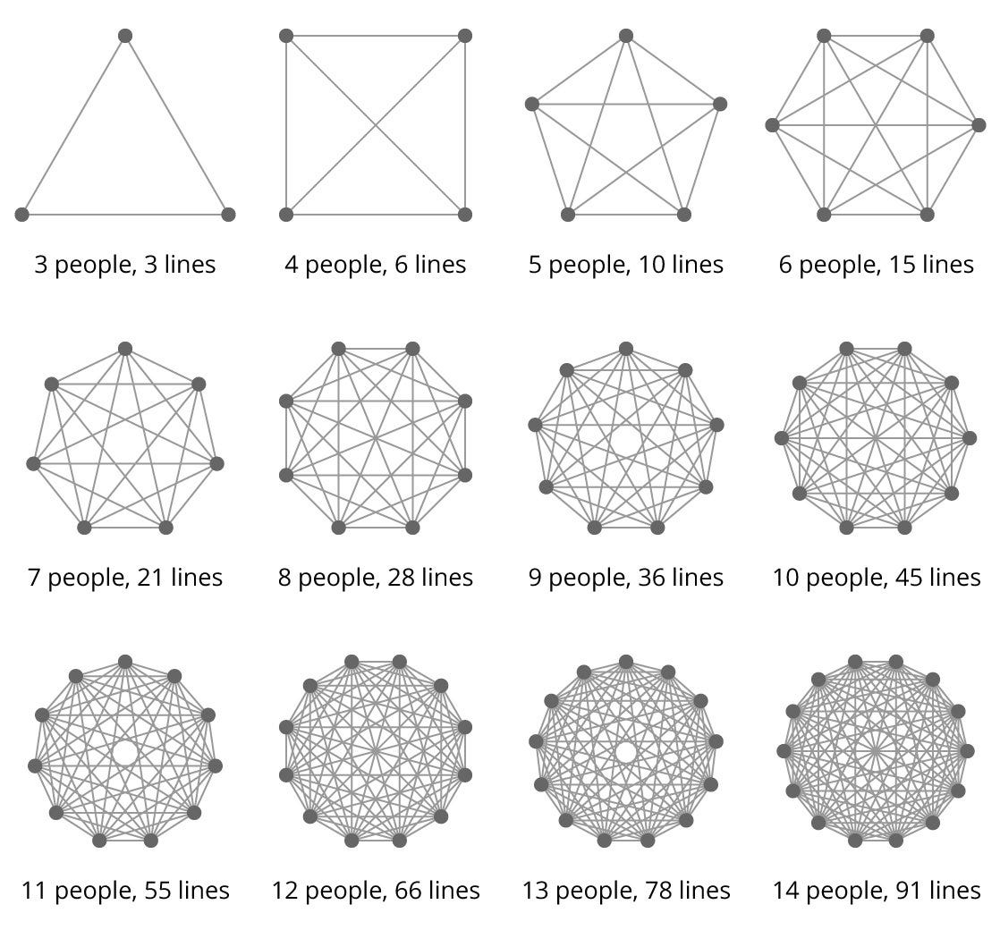

# Your software architecture is complex as your organization

This week’s issue brings to you the following:

- **Why is software architecture as complex as your organization?**
- **How organizational structure predicts code quality**
- **Why do small teams win?**

So, let’s dive in.

---

## Your software architecture is always complex as your organization

Have you heard about **Conway’s Law**? It is a theory created by computer scientist Melvin Conway in 1967. It states, "*Organizations, who design systems, are constrained to produce designs that are copies of the communication structures of these organizations.*” In other words, **the structure of a software system is often influenced by the structure and communication patterns within the team building it**.

This can result in more optimal software architecture**for the problem being solved**, as the team may focus on their own organizational needs over the system’s needs. This means an organization with small distributed teams will produce a modular service architecture, while an organization with large collocated teams will produce a monolithic architecture. In a broad sense, the **HR department defines our software architectures**.

To mitigate this, we can use **the Inverse Conway maneuver**. Instead of letting our existing organizational structure dictate our software's architecture, we should first decide on the ideal architecture and then organize our teams and communication structures to align with that desired architecture. Doing this can lead to better software.

As organizational structures change, the **software architecture might need to evolve to reflect those changes**. For instance, if two teams merge, the components they manage need to be integrated more closely.

When making architectural decisions, it's essential to consider technical requirements and team and **organizational dynamics**. For instance, adopting a [monolithic architecture](https://newsletter.techworld-with-milan.com/p/why-you-should-build-a-modular-monolith) might be technically simpler for a small startup, but as the company grows and teams multiply, this architecture might become a bottleneck.

Yet, we can see that many organizations ignore Conway's law and think that organizational structures and software architecture are **detached from each other**, with surprises in the end.

Organizational Charts (Credits - Manu Cornet [bonkersworld.net](http://bonkersworld.net/))

> *Check Conway's original paper from 1968. “**[How do committees invent?](https://www.melconway.com/Home/pdf/committees.pdf)**”*

And check also Craig Larman's view from the Less Conference 2024 notes that the wording Inverse Conway maneuver is wrong:

---

## How organizational structure predicts code quality

A team of researchers for Microsoft Research published a [paper](https://www.microsoft.com/en-us/research/publication/the-influence-of-organizational-structure-on-software-quality-an-empirical-case-study/)in 2008. which shows how organizational structure influences software quality. Their case study on Windows Vista found that **organizational measures are better predictors of code quality than traditional ones**.

**Traditional measures** are code churn, code complexity, pre-release bugs, dependencies, and code coverage.

Organizational measures are:

1. **Number of Engineers** who have touched a code and are still employed by the company. **The more people who touch the code, the lower the quality.**
2. **Number of Ex-Engineers:** This is the total number of unique engineers who have touched a code and left the company as of the software system's release date. **A significant loss of team members affects knowledge retention and, thus, quality**.
3. **Edit Frequency:** This is the total number of times the source code that makes up the code was edited. **The more edits to components, the higher the instability and lower the quality**.
4. **Depth of Master Ownership**: The code ownership level depends on the number of edits done. **The lower the level of ownership, the better the quality**.
5. **Percentage of Org contributing to development:** The ratio of different internal organizations touched the code. **The lower the rate, the more localized the code ownership, leading to reduced coordination challenges and improved code quality.**
6. **Level of Organizational Code Ownership**: The percent of edits from the organization that contains the code owner or if there is no owner. **The more cohesive the contributors (organizationally), the higher the quality**.
7. **Overall Organization Ownership:** This is the ratio of the percentage of people in the owning organization relative to the total engineers editing the code—the**more cohesive the contributions (edits), the higher the quality**.

From here, more localized code ownership and reduced coordination across diverse organizational units can improve code quality. Therefore, to enhance software quality, organizations should consider **optimizing their organizational structure** by promoting localized ownership, minimizing the number of contributors to specific code sections, and reducing cross-organizational coordination challenges.

The influence of organizational structure on software quality (Microsoft Research)

---

## Why do small teams win?

In his book, published in 2000. called "**[The Tipping Point](https://amzn.to/3Pt1DVS),**" Malcolm Gladwell tried to identify why some ideas spread quickly among people while others do not and what factors influence that spread. One of the critical things he remembered was the benefits of keeping groups under 150 people (called "**The Rule of 150**").

He connected this to the work of British anthropologist Robin Dunbar, who suggested a cognitive limit to the number of people with whom one can maintain stable social relationships (and it is 150 - **Dunbar’s number**). Another rule also impacts this, called **Metcalfe’s Law**, which says that the more people you add to a network, the harder it is to communicate effectively.

It takes work to maintain effective communication in large groups. Our minds can only handle so many relationships simultaneously. According to researchers, **we can only maintain deep relationships with five people at most** and a few less intense ones with another 15.

The Tipping Point, Malcolm Gladwell

Gladwell uses this concept to illustrate why smaller groups can often be more effective and productive:

1. **Communication**: In smaller groups, communication is often more accessible, transparent, and efficient. Everyone can know everyone else, leading to better understanding, less confusion, and more effective teamwork.
2. **Relationships and Trust:** Smaller groups can foster closer relationships and trust among their members. With fewer people, creating deeper bonds that encourage collaboration, innovation, and shared ownership of goals and outcomes is possible.
3. **Ownership**: In smaller groups, each individual's role and contribution are more noticeable. This can lead to a greater sense of personal accountability, and people are less likely to "hide in the crowd."
4. **Speed and Agility:** Smaller organizations tend to be more agile and able to make decisions more quickly. They can adapt faster to changes and challenges, which can be advantageous in volatile or rapidly changing circumstances.
5. **Culture and Community**: A robust and unified culture is often easier to establish and maintain within smaller groups. Shared values and norms can be more easily understood and upheld when the group size is below 150.

Fred Brooks recognized this in his book The Mythical Man-Month, too, which states that "**adding manpower to a late software project makes it later**" (**Brooks Law**). This is due to the increased communication overhead and the time it takes for new members to become productive.

Amazon also relied on this knowledge by introducing Jeff Bezos's "**Two Pizza Rule**." This rule posits that teams should be small enough to be fed two pizzas.

Of course, larger groups can also be successful, but you might need different management and communication structures to be equally effective there.

Lines of communication and team size

---

## More ways I can help you

1. **1:1 Coaching:** [Book a working session with me](https://newsletter.techworld-with-milan.com/p/coaching-services). 1:1 coaching is available for personal and organizational/team growth topics. I help you become a high-performing leader 🚀.
2. **[Promote yourself to 15,000+ subscribers](https://newsletter.techworld-with-milan.com/p/sponsorship-of-tech-world-with-milan)**by sponsoring this newsletter.

---

Thanks for reading Tech World With Milan Newsletter! Subscribe for free to receive new posts and support my work.